<!-- page 1 -->

THEODOROS ZACHARELIS 

# Vehicle Dynamics and Performance Simulation 

**Section: Mechanical Design & Automatic Control Supervisor: D. Koulocheris, Associate Professor, NTUA** 

*[FIG: Univ logo (NTUA)]*

**Athens, July 2023** 

<!-- page 2 -->

Master Thesis – Theo Zacharelis 

It is hard to drive at the limit, But it is harder to know where the limits are. – Stirling Moss – 

It is not always possible to be the best, But it is always possible to improve your own performance. – Jackie Stewart – 

July 2023 2 

<!-- page 3 -->

Master Thesis – Theo Zacharelis 

_<u>Statutory declaration regarding plagiarism and infringement of intellectual property rights:</u>_ 

**I have read and understood the rules regarding plagiarism and the proper referencing of sources outlined in the Thesis Writing Guide. I declare that, to the best of my knowledge, the content of this Thesis is the result of my own work, and all sources I have used are properly cited.** 

**The views and conclusions expressed in this Thesis are those of the author and should not be interpreted as representing the official positions of the School of Mechanical Engineering or the National Technical University of Athens.** 

**Theo Zacharelis** 

July 2023 3 

<!-- page 4 -->

Master Thesis – Theo Zacharelis 

## **<mark>Abstract</mark>** 

The development and optimization of modern vehicles necessitate a comprehensive understanding of vehicle dynamics and performance. This master's thesis addresses the need for a robust simulation framework that encompasses various aspects of vehicle analysis, with a focus on racing vehicles. The research is motivated by the increasing importance of vehicle simulation in designing and evaluating vehicle performance, along with the existing gap in simplified simulation models that fail to capture crucial effects without advanced and complex tools. 

The primary objective of this research is to develop a wide-ranging simulation tool that enables engineers to analyse different aspects of vehicle dynamics and performance. The baseline vehicle used in this research is a prototype race car named “P19-Delia”, which was designed and manufactured by the Formula Student team of the National Technical University of Athens. This choice, made possible due to the author's significant involvement in the design and testing of this vehicle, enables accurate modelling and evaluation of the simulation results by comparing them with actual track data. It is important to note that the purpose of this selection is to provide an illustrative example rather than to optimize or design the vehicle within the simulation framework. The simulation tool incorporates both basic mass point principles and advanced modelling approaches, such as full-car models and Pacejka's Magic Formula, in specific areas like suspension dynamics and yaw moment diagrams. The complexity level of the modelling is carefully selected based on the specific simulation feature to ensure accuracy and relevance. 

The developed simulation framework encompasses a diverse range of areas, including isolated vehicle motion (such as acceleration, braking, and cornering) as well as complete lap time simulation (LapSim). These simulation scenarios have been carefully designed to incorporate crucial factors like weight transfer and aerodynamic map effects, effectively bridging the gap between simplified and advanced modelling approaches. Furthermore, the framework offers comprehensive tools for analysing suspension dynamics using both quarter and full-car models, facilitating the creation and evaluation of aerodynamic maps, and generating precise yaw moment diagrams. This wide array of simulation capabilities empowers engineers to select and utilize the specific features that align with their unique project requirements, thereby enabling more accurate and comprehensive analysis of vehicle performance. The simulation framework is developed using MATLAB, with each simulation sub-feature designed as a specific module format. It is important to note that the code for this framework is entirely self-developed, showcasing the author's expertise and dedication in creating a comprehensive and tailored simulation tool. This tool allows users to seamlessly interact by selecting the desired simulation scenario and defining the relevant inputs. 

4 

July 2023 

<!-- page 5 -->

Master Thesis – Theo Zacharelis 

Furthermore, this thesis aims to enhance engineers' understanding by presenting the fundamental principles and underlying dynamics of vehicle performance. The structure of the thesis is carefully designed to guide readers from more simplified concepts to more complex principles and dynamics, ensuring a progressive transfer of knowledge from one Chapter to the next. Detailed explanations of the simulation algorithms and models are provided, along with example results for the baseline vehicle, allowing engineers to grasp the practical application of the presented concepts. By following the step-by-step progression of the thesis, readers are advised to gain a comprehensive understanding of the subject matter, empowering them to replicate the simulation tool, make necessary adjustments, and effectively evaluate vehicle performance. 

In conclusion, this master's thesis presents a robust and wide simulation framework for vehicle dynamics and performance analysis. With its comprehensive simulation capabilities and focus on enhancing engineers' knowledge, this research contributes to the advancement of vehicle design and optimization processes. 

July 2023 5 

<!-- page 6 -->

Master Thesis – Theo Zacharelis 

## **<mark>Περίληψη</mark>** 

Η σχεδίαση και βελτιστοποίηση σύγχρονων οχημάτων απαιτούν μια ολοκληρωμένη κατανόηση της δυναμικής και της απόδοσης των οχημάτων. Αυτή η διπλωματική εργασία διευθετεί την ανάγκη για ένα αξιόπιστο και ευρύ πλαίσιο προσομοίωσης που καλύπτει διάφορες πτυχές της ανάλυσης οχημάτων, με έμφαση στα αγωνιστικά οχήματα. Το κίνητρο για την συγκεκριμένη εργασία συνοψίζεται στην αυξανόμενη σημασία της προσομοίωσης οχημάτων στον σχεδιασμό και την αξιολόγηση της απόδοσης των οχημάτων, καθώς και στο υπάρχον κενό στα απλοποιημένα μοντέλα προσομοίωσης, που αποτυγχάνουν να καλύψουν σημαντικά φαινόμενα δυναμικής χωρίς προηγμένα και περίπλοκα εργαλεία. 

Ο βασικός στόχος αυτής της έρευνας είναι να αναπτυχθεί ένα ευρύ πλαίσιο προσομοίωσης που επιτρέπει στους μηχανικούς να αναλύουν διάφορες πτυχές της δυναμικής και της απόδοσης των οχημάτων. Το αρχικό όχημα που χρησιμοποιείται στην έρευνα είναι ένα πρωτότυπο αγωνιστικό αυτοκίνητο με την ονομασία “P19-Delia”, που σχεδιάστηκε και κατασκευάστηκε από την ομάδα Formula Student του Εθνικού Μετσοβίου Πολυτεχνείου. Αυτή η επιλογή, που έγινε λόγω της σημαντικής συμμετοχής του γράφοντα στο σχεδιασμό και τη δοκιμή αυτού του οχήματος, επιτρέπει την ακριβή μοντελοποίηση και αξιολόγηση των αποτελεσμάτων της προσομοίωσης με τη σύγκρισή τους με πραγματικά δεδομένα από την πίστα. Είναι σημαντικό να σημειωθεί ότι ο σκοπός αυτής της επιλογής είναι να παρέχει ένα ενδεικτικό παράδειγμα και όχι να βελτιστοποιηθεί ή να σχεδιαστεί το παρόν όχημα μέσω του αναπτυγμένου πλαισίου προσομοίωσης. Το εργαλείο προσομοίωσης συνδυάζει τόσο τις βασικές αρχές του σημείου μάζας όσο και προηγμένες προσεγγίσεις μοντελοποίησης, όπως πλήρη μοντέλα ολόκληρου αυτοκινήτου και την Magic Formula του Pacejka, σε συγκεκριμένους τομείς όπως η δυναμική ανάρτησης και τα διαγράμματα ροπής εκτροπής. Το επίπεδο πολυπλοκότητας της μοντελοποίησης επιλέγεται με προσοχή ανάλογα με το συγκεκριμένο χαρακτηριστικό της προσομοίωσης για να διασφαλιστεί η ακρίβεια και η συνάφεια των αποτελεσμάτων. 

Το αναπτυγμένο πλαίσιο προσομοίωσης καλύπτει διάφορους τομείς, συμπεριλαμβανομένης της απομονωμένης κίνησης του οχήματος (όπως επιτάχυνση, φρενάρισμα και στρίψιμο) και/ή της πλήρους προσομοίωσης του χρόνου γύρου (LapSim). Αυτά τα σενάρια προσομοίωσης έχουν σχεδιαστεί με προσοχή για να συμπεριλαμβάνουν σημαντικούς παράγοντες όπως η μεταφορά βάρους και οι επιδράσεις του αεροδυναμικού χάρτη και της κατάστασης του οχήματος στο χώρο, γεφυρώνοντας αποτελεσματικά το χάσμα μεταξύ απλοποιημένων και προηγμένων προσεγγίσεων της μοντελοποίησης. Επιπλέον, το πλαίσιο προσφέρει περιεκτικά εργαλεία για την ανάλυση της δυναμικής της ανάρτησης χρησιμοποιώντας τόσο μοντέλα τέταρτου αυτοκινήτου όσο και ολόκληρου αυτοκινήτου, ενθαρρύνοντας τη δημιουργία και την αξιολόγηση αεροδυναμικών χαρτών και παρέχοντας ακριβείς διαγράμματα ροπής εκτροπής. Αυτή η ευρεία γκάμα δυνατοτήτων προσομοίωσης επιτρέπει στους μηχανικούς να επιλέξουν και να χρησιμοποιήσουν τα 

6 

July 2023 

<!-- page 7 -->

Master Thesis – Theo Zacharelis 

συγκεκριμένα χαρακτηριστικά του πλαισίου προσομείωσης που ανταποκρίνονται στις μοναδικές απαιτήσεις τους για το εκάστοτε έργο τους. Το πλαίσιο προσομοίωσης αναπτύσσεται χρησιμοποιώντας το MATLAB, με κάθε υπο-χαρακτηριστικό προσομοίωσης σχεδιασμένο ως ένα συγκεκριμένο πρότυπο αρχείου. Είναι σημαντικό να σημειωθεί ότι ο κώδικας για αυτό το πλαίσιο είναι εξ ολοκλήρου αυτοδημιουργημένος, καθιστώντας εμφανή την ειδίκευση και την αφοσίωση του συγγραφέα στη δημιουργία ενός εξειδικευμένου και πλήρους εργαλείου προσομοίωσης. Αυτό το εργαλείο επιτρέπει στους χρήστες να αλληλεπιδρούν ομαλά, επιλέγοντας το επιθυμητό σενάριο προσομοίωσης και καθορίζοντας τις σχετικές εισόδους. 

Επιπλέον, η παρούσα διπλωματική εργασία στοχεύει στη βελτίωση της κατανόησης και της γνώσης των μηχανικών με την παρουσίαση των θεμελιωδών αρχών και των βασικών δυναμικών της απόδοσης οχημάτων. Η δομή της έκθεσης έχει σχεδιαστεί με προσοχή ώστε να καθοδηγεί τους αναγνώστες από απλοποιημένες έννοιες προς πιο πολύπλοκες αρχές και δυναμικές, εξασφαλίζοντας μια σταδιακή μεταφορά γνώσεων από ένα κεφάλαιο στο επόμενο. Παρέχονται λεπτομερείς εξηγήσεις των αλγορίθμων και των μοντέλων προσομοίωσης, μαζί με παραδείγματα αποτελεσμάτων για το αναφερόμενο επιλεγμένο όχημα. Με την ακολούθηση της σταδιακής προόδου της έκθεσης, οι αναγνώστες μπορούν να αποκτήσουν μια ολοκληρωμένη κατανόηση του θέματος, και έχουν τη δυνατότητα να αναπαράγουν το εργαλείο προσομοίωσης, να προβούν στις απαραίτητες προσαρμογές και να αξιολογήσουν αποτελεσματικά την απόδοση των οχημάτων. 

Συνολικά, αυτή η διπλωματική εργασία παρουσιάζει ένα αξιόπιστο και ευρύ πλαίσιο προσομοίωσης για την ανάλυση της δυναμικής και της απόδοσης των οχημάτων. Με τις πλούσιες δυνατότητες προσομοίωσης και την έμφαση στην ενίσχυση των γνώσεων των μηχανικών, αυτή η έρευνα συμβάλλει στην πρόοδο των διαδικασιών σχεδιασμού και βελτιστοποίησης των οχημάτων. 

7 

July 2023 

<!-- page 8 -->

Master Thesis – Theo Zacharelis 

|**Table of C**|**ontents**|
|---|---|
|1. Introduct|ion .............................................................................................................13|
|1.1 Ba|ckground and Motivation .........................................................................13|
|1.2 Ob|jective .......................................................................................................13|
|1.3 Ba|seline Vehicle ............................................................................................14|
|1.4 Str|ucture of the Thesis ..................................................................................17|
|1.4.1|General ...................................................................................................17|
|1.4.2|Chapters Breakdown ..............................................................................17|
|2. Model ....|...................................................................................................................24|
|2.1 Int|roduction ..................................................................................................24|
|2.2 Ge|neral Dimensions and Parameters ...........................................................25|
|2.2.1|General Parameters ................................................................................25|
|2.2.2|General Parameters Supplementary Calculations ..................................27|
|2.3 Ae|rodynamics Model ....................................................................................28|
|2.3.1|Aerodynamics Parameters......................................................................29|
|2.4 Ty|res Model ..................................................................................................31|
|2.4.1|Tyres Parameters ....................................................................................31|
|2.4.2|Coefficient of Friction and Tyre Load Sensitivity ....................................32|
|2.4.3|Cornering Stiffness ..................................................................................35|
|2.5 Su|spension Model ........................................................................................36|
|2.5.1|Definitions ...............................................................................................38|
|2.5.2|Suspension Parameters Supplementary Calculations ............................42|
|2.6 Po|wertrain Model .........................................................................................44|
|2.6.1|Engine and Drivetrain Parameters..........................................................44|
|2.6.2|Engine Curve ...........................................................................................44|
|2.6.3|Drivetrain ................................................................................................45|
|2.6.4|Tractive Force .........................................................................................48|
|2.7 Sh|ifting Model ...............................................................................................53|
|2.8 Fo|rces Model ................................................................................................55|
|2.8.1|Vertical ....................................................................................................56|
|2.8.2|Longitudinal ............................................................................................59|
|2.8.3|Lateral .....................................................................................................64|
|2.8.4|Weight Transfer Effect ............................................................................65|
|2.9 St|eering,  Braking  and Throttle Model ........................................................67|
|2.9.1|Steering ...................................................................................................67|

July 2023 8 

<!-- page 9 -->

Master Thesis – Theo Zacharelis 

|2.9.2|Braking ....................................................................................................70|
|---|---|
|2.9.3|Throttle ...................................................................................................76|
|2.10 Pe|rformance Envelope – GGV Diagram ........................................................80|
|2.10.1|Simplified GG Diagram ............................................................................80|
|2.10.2|GGV Diagram ..........................................................................................84|
|3. Simulatio|n Specific Scenarios ..................................................................................91|
|3.1 Int|roduction ..................................................................................................91|
|3.2 Ac|celeration ..................................................................................................91|
|3.2.1|Algorithm ................................................................................................91|
|3.2.2|Weight Transfer Effect ......................................................................... 102|
|3.2.3|Validation ............................................................................................. 107|
|3.3 Br|aking ....................................................................................................... 115|
|3.3.1|Algorithm ............................................................................................. 115|
|3.3.2|Weight Transfer Effect ......................................................................... 124|
|3.3.3|Validation ............................................................................................. 129|
|3.4 Co|rnering ................................................................................................... 137|
|3.4.1|Algorithm ............................................................................................. 137|
|3.4.2|Validation ............................................................................................. 143|
|4. LapSim ... |................................................................................................................ 150 |
|4.1 Int|roduction ............................................................................................... 150|
|4.2 Tr|ack Model ............................................................................................... 152|
|4.2.1|Introduction ......................................................................................... 152|
|4.2.2|Import Options .................................................................................... 153|
|4.2.3|Extra Processing/Filtering .................................................................... 176|
|4.2.4|Apexes .................................................................................................. 181|
|4.3 Al|gorithm ................................................................................................... 190|
|4.3.1|Main Concept ....................................................................................... 190|
|4.3.2|Accelerate from Apexes ....................................................................... 195|
|4.3.3|Brake to Apexes ................................................................................... 201|
|4.3.4|Combine Traces ................................................................................... 204|
|4.3.5|Re-process braking points ................................................................... 206|
|4.3.6|Weight Transfer Effect ......................................................................... 210|
|4.4 Dr|iven Channels & KPIs .............................................................................. 213|
|4.4.1|Driven Channels ................................................................................... 213|
|4.4.2|KPIs ....................................................................................................... 219|

9 

July 2023 

<!-- page 10 -->

Master Thesis – Theo Zacharelis 

|4.5 Va|lidation ................................................................................................... 221|
|---|---|
|5. Suspensi|on Dynamics ........................................................................................... 232|
|5.1 Int|roduction ............................................................................................... 232|
|5.2 Ra|tes Calculator ......................................................................................... 235|
|5.2.1|Wheel & Heave Rate ............................................................................ 235|
|5.2.2|Pitch ..................................................................................................... 236|
|5.2.3|Roll ....................................................................................................... 237|
|5.2.4|Single Bump ......................................................................................... 239|
|5.2.5|Example Results ................................................................................... 240|
|5.3 Qu|arter Car Model & Damping Curves ...................................................... 241|
|5.3.1|Quarter Car Model ............................................................................... 241|
|5.3.2|Damping Curves ................................................................................... 250|
|5.4 Pa|rameters’ Sweep .................................................................................... 267|
|5.5 Vir|tual 7Post Rig ......................................................................................... 274|
|5.5.1|Introduction ......................................................................................... 274|
|5.5.2|Model ................................................................................................... 275|
|5.5.3|Free Response ...................................................................................... 280|
|5.5.4|Key Performance Indicators (KPIs) ...................................................... 291|
|5.5.5|Parameters’ Sweep – Batch Run .......................................................... 293|
|6. Aerodyna|mic Map ................................................................................................ 298|
|6.1 Int|roduction ............................................................................................... 298|
|6.1.1|AeroMap Necessity .............................................................................. 298|
|6.1.2|AeroMap Dual Nature .......................................................................... 298|
|6.1.3|AeroMap Source Data.......................................................................... 302|
|6.2 Ae|ro Viewer – AeroMap ............................................................................ 307|
|6.2.1|Main AeroMap ..................................................................................... 308|
|6.2.2|Roll & Yaw Analysis .............................................................................. 311|
|6.2.3|Calculation Process – Specific Scenario ............................................... 314|
|6.3 Ae|ro Envelope ............................................................................................ 317|
|6.3.1|Straight-line ......................................................................................... 318|
|6.3.2|Cornering ............................................................................................. 323|
|6.3.3|Static RH Decision ................................................................................ 327|
|7. AeroMap|to Simulation ........................................................................................ 334|
|7.1 Int|roduction ............................................................................................... 334|
|7.2 Str|aight-line Dynamics ............................................................................... 335|

10 

July 2023 

<!-- page 11 -->

Master Thesis – Theo Zacharelis 

|7.2.1|Anti-Features ....................................................................................... 336|
|---|---|
|7.2.2|Longitudinal Acceleration Integration ................................................. 342|
|7.3 Co|rnering Dynamics ................................................................................... 344|
|7.3.1|Roll and Yaw Angles Calculation .......................................................... 345|
|7.3.2|AeroMap Integration to Cornering Algorithm ..................................... 346|
|7.4 Si|mulation with AeroMap .......................................................................... 347|
|7.4.1|Introduction ......................................................................................... 347|
|7.4.2|Acceleration ......................................................................................... 349|
|7.4.3|Braking ................................................................................................. 362|
|7.4.4|Cornering ............................................................................................. 370|
|7.4.5|LapSim .................................................................................................. 375|
|8. Yaw Mom|ent Diagram .......................................................................................... 388|
|8.1 Int|roduction ............................................................................................... 388|
|8.1.1|Aim ....................................................................................................... 388|
|8.1.2|Importance and Definition .................................................................. 388|
|8.1.3|Subsequent Sections ............................................................................ 391|
|8.2 M|agic Formula ........................................................................................... 392|
|8.2.1|Introduction ......................................................................................... 392|
|8.2.2|Modelling ............................................................................................. 396|
|8.3 M|odel ......................................................................................................... 403|
|8.3.1|Complexity Level .................................................................................. 403|
|8.3.2|Calculations .......................................................................................... 403|
|8.3.3|Assumptions & Future Improvement .................................................. 412|
|8.4 Al|gorithm & Results ................................................................................... 415|
|8.4.1|Introduction ......................................................................................... 415|
|8.4.2|Algorithm ............................................................................................. 416|
|8.4.3|Results .................................................................................................. 419|
|8.5 Ke|y Performance Indicators – Analysis...................................................... 427|
|8.5.1|Grip & Balance ..................................................................................... 427|
|8.5.2|Stability & Control ................................................................................ 430|
|8.6 Pa|rameters’ Sweep – Batch Run ................................................................ 433|
|9. Conclusio|ns ........................................................................................................... 438|
|10. Table of T|ables ...................................................................................................... 443|
|11. Table of E|quations ................................................................................................ 446|
|12. Table of F|igures ..................................................................................................... 452|

11 

July 2023 

<!-- page 12 -->

Master Thesis – Theo Zacharelis 

13. Bibliography .......................................................................................................... 460 

July 2023 12 

<!-- page 13 -->

Master Thesis – Theo Zacharelis 

## **<mark>1. Introduction</mark>** 

### **1.1 Background and Motivation** 

The field of vehicle dynamics and performance simulation plays a crucial role in the development and optimization of modern vehicles. With advancements in technology and increasing demands for improved performance, understanding the fundamental principles of vehicle dynamics and simulating their behaviour have become essential. The background of this master thesis lies in addressing the need for a comprehensive simulation tool that encompasses various aspects of vehicle dynamics, performance, and aerodynamics. The motivation for undertaking this research arises from the increasing recognition of the pivotal role that vehicle simulation plays in the design and evaluation of vehicle performance. It is coupled with the realization that existing simplified simulation models often fail to account for critical effects that can only be captured with advanced, complex, and specialized tools. Consequently, there exists a significant gap that needs to be bridged in order to provide a more comprehensive and accurate representation of vehicle behaviour. By delving into the fundamental principles of vehicle dynamics and harnessing the potential of an integrated simulation tool, this thesis endeavours to offer valuable insights and practical solutions that enable a thorough evaluation of vehicle performance across various facets. 

Worth noting, as a foundation for the development of the simulation tool, a primary source of reference for the equations and vehicle dynamics principles was the renowned publication “Race Car Vehicle Dynamics” by Milliken, W. F., Milliken, D. L., and Metz, L. D. (1995), published by SAE International. This influential book served as a key resource, providing valuable insights and guidance throughout the model development process. While comprehensive references for all sources utilized are provided at the end of this document, the aforementioned publication played a significant role in shaping the methodology and approach of this research. 

### **1.2 Objective** 

The primary objective of this master's thesis is to develop a comprehensive and robust simulation framework that enables the analysis of vehicle dynamics and performance, with a particular focus on racing vehicles. This project aims to fulfil three distinct goals, ensuring that the simulation tool covers a wide range of applications and addresses the existing gaps in simplified simulation models while enhancing engineers' general knowledge in the field. 

<mark>1.</mark> <u><mark>Wide Areas of Evaluation:</mark></u> 

<mark>The intention is to create a versatile and all-encompassing simulation tool that allows engineers to simulate various aspects of a vehicle. Rather than focusing on complex dedicated simulations for specific scenarios, the aim is to provide a broad framework that covers areas such as isolated vehicle motions (acceleration, braking, cornering), complete Lap Time Simulation (LapSim), suspension modelling and analysis using</mark> 

13 

July 2023 

<!-- page 14 -->

Master Thesis – Theo Zacharelis 

<mark>quarter and full-car models, aerodynamic map creation and evaluation, yaw moment diagrams, and more. This approach empowers engineers to select the specific simulation features relevant to their projects or areas of interest.</mark> 

<mark>2.</mark> <u><mark>Gap in Simplified Simulations:</mark></u> 

<mark>Conventional simplified simulations, such as mass point-based lap time simulations, often fail to capture important effects crucial for vehicle dynamics and performance, such as weight transfer and the inclusion of the aerodynamic map. These effects are typically addressed by advanced and complex simulation tools that require specialized modelling and dedicated applications. This simulation tool aims to bridge the gap between simplified and advanced modelling by creating a hybrid model that combines the fundamental principles of mass point simulations with the enriched effects and principles of the bicycle or full car model. This hybrid model enables the inclusion of weight transfer and the utilization of the aerodynamic map to assess how the vehicle's attitude/state affects its performance. This tool strives to provide a flexible and accessible means to capture complex effects within a simplified modelling framework.</mark> 

<mark>3.</mark> <u><mark>Enhance General Knowledge:</mark></u> 

<mark>Alongside the development of the simulation tool, a key objective of this research is to enhance engineers' understanding by presenting in-depth knowledge of vehicle dynamics, performance, and simulation theory. The aim is to equip users with the necessary knowledge to replicate the tool or make adjustments to suit their specific needs. By comprehensively explaining the modelling process, simulation algorithms, and providing example results for each simulation feature using a baseline vehicle, this thesis aims to demonstrate effective methodologies and analysis techniques. Detailed discussions of the inputs, modelling approaches, and outputs of each simulation facilitate a comprehensive understanding, empowering engineers to maximize the potential of this generic tool.</mark> 

In summary, this research endeavours to develop a robust simulation framework that covers various aspects of vehicle dynamics and performance. By addressing gaps in simplified simulations, enhancing engineers' general knowledge, and offering a wide range of simulation features, this tool contributes to the advancement of vehicle design, optimization, and evaluation while providing engineers with a valuable resource for their analysis and testing needs. 

### **1.3 Baseline Vehicle** 

Throughout the duration of this project, a Baseline Vehicle has been employed as a means to illustrate the modelling techniques and demonstrate the capabilities of the integrated simulation features. It is crucial to emphasize that the primary objective of this master thesis does not involve designing or optimizing a specific vehicle, but rather establishing a 

14 

July 2023 

<!-- page 15 -->

Master Thesis – Theo Zacharelis 

comprehensive framework that enables engineers to undertake such endeavours. This is achieved by incorporating diverse simulation scenarios and providing a profound understanding of the fundamental principles underlying vehicle dynamics, performance, and simulation. 

The Baseline Vehicle, named “P19-Delia”, serves as a prototype race car that was conceptualized, manufactured, and actively participated in the Formula Student competitions of 2019 by the esteemed Formula Student team, Prom Racing, at the National Technical University of Athens. The selection of this particular vehicle stems from the researcher's extensive knowledge and involvement in its design and testing phases. This intimate familiarity affords the opportunity for precise modelling and meticulous evaluation of the simulation outcomes, which can be effectively compared against the vehicle's actual track data. 

It is important to note that while the Baseline Vehicle represents a formula-type prototype, the simulation tool itself is deliberately developed to accommodate a broad range of vehicle categories, including GT cars, Formula 4 and more. This adaptability is underscored by the researcher's conscientious consideration of the specific features and requirements inherent to each category during the modelling process. For instance, the simulation tool encompasses provisions for four-wheel drive, despite the Baseline Vehicle being a twowheel drive configuration, further attesting to its versatility and applicability to diverse vehicle types. 

Moreover, the equations and parameters employed in the simulation tool are meticulously documented and named consistently, both within this dissertation and in the accompanying source code. This meticulous approach serves two critical purposes. Firstly, it ensures internal consistency throughout the work, mitigating potential confusion arising from disparate naming conventions sourced from various references or bibliographies. Secondly, the availability of the source code to the university and interested readers facilitates an indepth examination of the technical details. In such instances, the uniform naming convention employed in both the dissertation and the code itself proves immensely valuable for comprehending and utilizing the simulation tool effectively. 

15 

July 2023 

<!-- page 16 -->

Master Thesis – Theo Zacharelis 

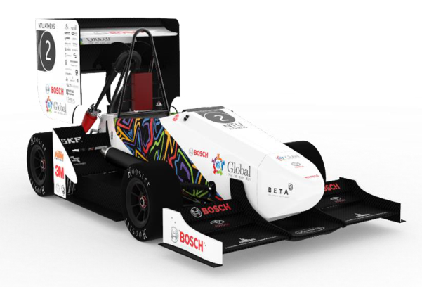

**Figure 1-1: Baseline Vehicle – Render** 

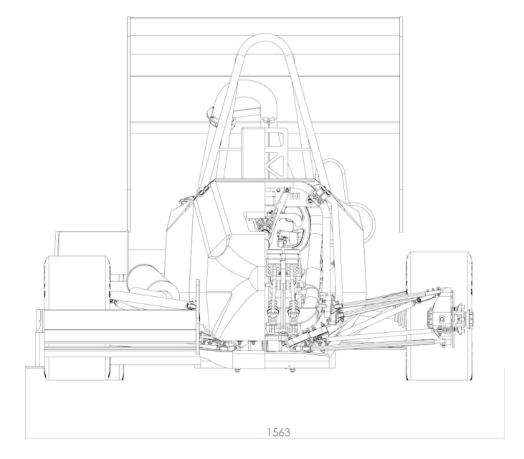

**Figure 1-2: Baseline Vehicle – Front View** 

July 2023 16 

<!-- page 17 -->

Master Thesis – Theo Zacharelis 

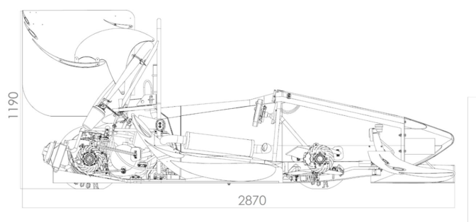

**Figure 1-3: Baseline Vehicle – Side View** 

### **1.4 Structure of the Thesis** 

#### **1.4.1 General** 

This thesis is structured into nine Chapters, with each Chapter contributing to a comprehensive understanding of vehicle dynamics and performance simulation within the context of motorsport. The organization of the Chapters is carefully designed to guide readers on a progressive journey, starting from simplified concepts and gradually moving towards more complex principles and dynamics. This approach ensures a seamless transfer of knowledge from one Chapter to the next, allowing readers to build a solid foundation of understanding. It is highly recommended for readers to follow the Chapters in a step-by-step manner to fully grasp the content and benefit from the logical flow of the thesis. The breakdown of the Chapters is as follows: 

#### **1.4.2 Chapters Breakdown** 

##### 1.4.2.1 <u>Chapter 1 – Introduction</u> 

This Chapter provides an overview of the background and motivation behind the research, outlining the objectives and scope of the thesis. 

##### 1.4.2.2 <u>Chapter 2 – Model</u> 

“Model” serves as a foundational Chapter in the thesis. This Chapter delves into the essential aspects of vehicle dynamics principles and parameterization, laying the groundwork for subsequent Chapters. The Chapter begins with an introduction, providing an overview of the modelling process and its significance in understanding vehicle behaviour. 

17 

July 2023 

<!-- page 18 -->

Master Thesis – Theo Zacharelis 

Moving forward, the Chapter explores the general dimensions and parameters of the vehicle, encompassing both primary dimensions and supplementary calculations to ensure accuracy. It further delves into the aerodynamics model, focusing on the determination of aerodynamic parameters crucial for simulating the vehicle's behaviour. The tyres model is also addressed, covering tyre parameters, including the coefficient of friction, tyre load sensitivity, and cornering stiffness, which significantly influence the vehicle's handling characteristics. 

Additionally, the Chapter addresses the suspension model, presenting definitions and supplementary calculations related to suspension parameters. The powertrain model is discussed in detail, encompassing engine and drivetrain parameters, engine curves, drivetrain configuration, and the calculation of tractive force. 

Furthermore, the Chapter explores the shifting model, forces model (including vertical, longitudinal, and lateral forces), and the weight transfer effect, providing an understanding of the dynamic forces acting on the vehicle during motion. The steering, braking, and throttle models are also described, highlighting their respective parameters, model descriptions, and implementation within the overall framework. 

Lastly, the Chapter introduces the concept of the performance envelope through the creation of a simplified GG and the speed dependent GGV diagram. These diagrams offer insights into the vehicle's performance limits, including braking and acceleration zones. In summary, Chapter 2 forms the basis of the thesis by outlining fundamental vehicle dynamics principles, defining crucial parameters, and constructing a comprehensive model. The content covered in this Chapter lays the groundwork for subsequent Chapters, which will utilize this model to explore various aspects of vehicle dynamics, performance, and simulation. 

##### 1.4.2.3 <u>Chapter 3 – Simulation Specific Scenarios:</u> 

Chapter 3, titled “Simulation Specific Scenarios”, focuses on simulating essential isolated scenarios of acceleration, braking, and cornering within the vehicle dynamics framework. This Chapter delves into the intricacies of the simulation algorithms, available solvers, and the presentation of results and default plots, providing a comprehensive understanding of each scenario's dynamic behaviour. Furthermore, it emphasizes the weight transfer effect and its implementation within the simulations, highlighting its influence on the vehicle's motion. Validation plays a pivotal role in this Chapter, with correlation factors and validation methodologies thoroughly explained and employed to ensure the accuracy and reliability of the model. By simulating these fundamental scenarios, the Chapter establishes a solid foundation for comprehending the underlying principles of vehicle motion, solving algorithms, and paves the way for subsequent full lap time simulations. 

##### 1.4.2.4 <u>Chapter 4 – LapSim:</u> 

Chapter 4, titled “LapSim”, focuses on the Lap Time Simulation (LapSim) aspect of the vehicle dynamics and performance analysis. The Chapter delves into the various components and algorithms involved in simulating a complete lap on a track. 

18 

July 2023 

<!-- page 19 -->

Master Thesis – Theo Zacharelis 

The Chapter begins with an introduction, providing an overview of the LapSim methodology and its importance in evaluating the performance of a vehicle on a specific track. The section on Track Model discusses the fundamental aspects of track modelling. It covers different import options, including radius and length, GPS coordinates, XY coordinates, and acceleration and speed data. These options allow for the creation and customization of the track model based on available data. Additionally, the section explores extra processing and filtering techniques to refine the track model, including filtering radius and length and creating a fine mesh. 

The concept of apexes, crucial points on the track that for the solving algorithm, is addressed in the section on Apexes. It defines apexes and presents an alternative approach to their definition. The section also outlines the methodology for finding the apexes on the track. The Chapter then delves into the LapSim algorithm. The main concept is explained, focusing on key elements such as braking points and the friction ellipse. It discusses the process of accelerating from apexes and braking to apexes, including the dynamics involved, end criteria, and provides an example for better understanding. The algorithm also covers combining traces, and re-processing braking points to refine the simulation. 

Weight transfer effect is an important consideration in LapSim, and its impact is discussed in a dedicated section. It explains how weight transfer affects vehicle dynamics during the lap and its integration into the simulation. 

Driven channels and Key Performance Indicators (KPIs) are explored in the section on Driven Channels & KPIs. It highlights the channels that are recorded during the lap and the KPIs derived from these channels, providing valuable insights into the vehicle's performance. Validation is a critical aspect of LapSim, and the Chapter concludes with a section dedicated to validation. It discusses the methodologies employed to validate the LapSim results, ensuring the accuracy and reliability of the simulation. 

In summary, Chapter 4 provides a comprehensive exploration of the Lap Time Simulation (LapSim) aspect of vehicle dynamics and performance analysis. It covers the track modelling process, including import options and extra processing techniques. The LapSim algorithm is explained in detail, encompassing acceleration and braking from apexes, weight transfer effect, and re-processing of braking points. Driven channels and Key Performance Indicators (KPIs) are highlighted, and validation methodologies are discussed to ensure the accuracy of the LapSim results. This Chapter plays a pivotal role in evaluating the performance of a vehicle on a specific track and provides valuable insights for further analysis and optimization. 

##### 1.4.2.5 <u>Chapter 5 – Suspension Dynamics:</u> 

Chapter 5, titled “Suspension Dynamics”, focuses on modelling and simulating suspensions to provide insights into vital aspects of vehicle performance that were not addressed in previous Chapters. This Chapter introduces calculations and simulations that are essential for understanding suspension dynamics and optimizing vehicle behaviour. 

The Chapter begins with an introduction, highlighting the importance of suspension dynamics in enhancing vehicle performance and handling. 

19 

July 2023 

<!-- page 20 -->

Master Thesis – Theo Zacharelis 

The section on Rates Calculator explores the calculation of wheel and heave rates, pitch, roll, and single bump characteristics. It provides a detailed explanation of these calculations, which are crucial for analysing suspension behaviour. Example results are also presented to illustrate the practical application of the Rates Calculator. 

The Quarter Car Model and Damping Curves are the key focuses of the next section. The Quarter Car Model is explained, shedding light on its significance in understanding suspension dynamics. The section then delves into Damping Curves, discussing the damping coefficients, the construction of damping curves, and their impact on suspension performance. The setup comparison and parameter sweep provide further insights into the practical implementation and tuning of the damping curves. 

A Parameters' Sweep is conducted to analyse the effects of varying suspension parameters on vehicle behaviour. This section investigates the impact of parameter changes on suspension dynamics and helps in optimizing the suspension setup. 

The Virtual 7Post Rig is introduced as a powerful tool for suspension analysis. The section begins by explaining the 7-Post Rig concept and its relevance to suspension testing. It then explores the integration of the Virtual 7Post Rig into the simulation tool, allowing for detailed analysis of suspension behaviour in a virtual environment. The Free Response study examines the heave, roll, and pitch responses of the vehicle, providing valuable insights into suspension performance. Key Performance Indicators (KPIs) are derived to quantify suspension performance and aid in evaluation. 

The Chapter concludes with a Parameters' Sweep - Batch Run, which extends the previous parameter sweep analysis by performing multiple simulations with various parameter combinations. This allows for a comprehensive exploration of suspension behaviour under different scenarios. 

In summary, Chapter 5 provides a thorough examination of suspension dynamics, incorporating calculations, simulations, and analyses. It introduces the Rates Calculator, explores the Quarter Car Model and Damping Curves, conducts a Parameters' Sweep, and utilizes the Virtual 7Post Rig for detailed suspension analysis. The Chapter contributes to a deeper understanding of suspension behaviour and optimization, enabling better performance and handling of the vehicle. 

##### 1.4.2.6 <u>Chapter 6 – Aerodynamics:</u> 

Chapter 6, titled “Aerodynamic Map”, focuses on the development and utilization of an aerodynamic map for the vehicle. This Chapter explores the necessity and dual nature of the aerodynamic map, along with the source data and its integration into the main simulation tool. 

The Chapter begins with an introduction that highlights the importance of the aerodynamic map. It discusses the necessity of having a comprehensive understanding of the vehicle's aerodynamics and how the aerodynamic map serves as a valuable tool in this regard. The dual nature of the aerodynamic map is explained, emphasizing its benefits in visualization, modelling, and integration into the main simulation tool. 

20 

July 2023 

<!-- page 21 -->

Master Thesis – Theo Zacharelis 

The section on AeroMap Source Data delves into the various approaches to obtain source data for the baseline vehicle. It discusses the different methods and considerations involved in collecting accurate and reliable aerodynamic data for modelling purposes. 

The Aero Viewer - AeroMap section introduces the AeroMap visualization tool and its functionality. It presents the main AeroMap, which provides a visual representation of the vehicle's aerodynamic characteristics. The section also explores roll and yaw analysis, focusing on the influence of aerodynamics on these specific vehicle dynamics aspects. The calculation process for a specific scenario is explained, highlighting the objective and the step-by-step calculation methodology. Practical examples are provided to illustrate the practical application of the AeroMap tool. 

The Aero Envelope section discusses the aerodynamic envelope of the vehicle. It explores the calculation process for straight-line scenarios, including the objective and the calculation methodology. Practical examples are presented to demonstrate the interpretation and utilization of the aerodynamic envelope in optimizing vehicle performance. The section also covers the aerodynamic analysis for cornering scenarios, addressing roll and yaw analysis indepth. A summary is provided to consolidate the key findings and insights from the cornering analysis. The Static RH Decision subsection focuses on the determination of the static ride height decision based on the aerodynamic characteristics of the vehicle. 

In summary, Chapter 6 provides a comprehensive exploration of the aerodynamic map and its application in vehicle analysis. It emphasizes the necessity and dual nature of the aerodynamic map, discusses the source data for modelling, and presents the Aero Viewer - AeroMap tool for visualization. The Chapter also examines the aerodynamic envelope, including calculations for straight-line and cornering scenarios. The utilization of the aerodynamic map and its integration into the main simulation tool contribute to a deeper understanding of the vehicle's aerodynamics and aid in optimizing vehicle performance. 

##### 1.4.2.7 <u>Chapter 7 – AeroMap to Simulation:</u> 

Chapter 7, titled “AeroMap to Simulation”, explores the integration of the aerodynamic map into the vehicle simulation process, including the comprehensive lap time simulation (LapSim). This Chapter focuses on the impact of aerodynamics on straight-line dynamics, cornering dynamics, and simulating various scenarios with the AeroMap, ensuring that the LapSim is updated with the aerodynamic map. 

The Chapter begins with an introduction, highlighting the significance of integrating the aerodynamic map into the simulation and its impact on overall vehicle performance, including the LapSim. 

The section on straight-line dynamics examines the anti-features associated with aerodynamics, explaining how weight transfer and anti-features interact. It discusses specific anti-features related to braking (anti-dive front and anti-lift rear) and acceleration (anti-lift front and anti-squat rear). The section provides a summary of these anti-features, along with advantages, disadvantages, and important notes to consider when integrating them into the simulation, including the LapSim. 

21 

July 2023 

<!-- page 22 -->

Master Thesis – Theo Zacharelis 

The longitudinal acceleration integration section focuses on utilizing the anti-features within the simulation algorithm, ensuring that the impact of longitudinal acceleration due to aerodynamics is accurately accounted for in the LapSim and other scenarios. 

The cornering dynamics section addresses the calculation of roll and yaw angles, which are crucial for accurately simulating the effects of aerodynamics during cornering. It explains the calculation methodology for roll and yaw angles, providing insights into the cornering behaviour of the vehicle in the LapSim and other cornering scenarios. 

The AeroMap integration to the cornering algorithm is then discussed. This section highlights how the aerodynamic map is integrated into the cornering algorithm, ensuring that the LapSim and other cornering simulations consider the influence of aerodynamics, resulting in more accurate and realistic representations of vehicle dynamics. 

The Simulation with AeroMap section focuses on specific scenarios, including acceleration, braking, cornering, and the comprehensive LapSim. For each scenario, the algorithm, results, comparison between simulations with and without the AeroMap, and validation processes are presented, ensuring that the LapSim is updated with the aerodynamic map and that its impact is appropriately considered. 

In summary, Chapter 7 explores the integration of the aerodynamic map into the vehicle simulation process, with a specific focus on updating the LapSim with the aerodynamic map. It addresses the impact of aerodynamics on straight-line dynamics, cornering dynamics, and various scenarios, emphasizing the importance of incorporating aerodynamic effects into the simulation process for accurate and comprehensive results. By integrating the AeroMap, the simulation, including the LapSim, accounts for the influence of aerodynamics on different driving scenarios, leading to improved insights, performance evaluation, and a more realistic representation of the vehicle's behaviour. 

##### 1.4.2.8 <u>Chapter 8 – Yaw Moment Diagram:</u> 

The subsequent sections are outlined, setting the stage for the content covered in the Chapter. 

The Magic Formula is introduced as a vital component of the yaw moment diagram. It discusses the scope and testing data used in developing the Magic Formula and highlights its variations. The section emphasizes the necessity of integrating the Magic Formula into the yaw moment diagram for accurate modelling and analysis. 

The modelling of the yaw moment diagram is explored in detail. It provides a general representation of the model and delves into the lateral forces’ equations and parameters. Baseline vehicle results are presented to demonstrate the application of the model. The complexity level of the model and the calculations involved are discussed, providing insights into the underlying assumptions and the potential for future improvements in the yaw moment diagram modelling. 

The algorithm and results section presents the algorithm for generating the yaw moment diagram. It covers different scenarios, including basic, constant speed, and constant radius. The results obtained from the algorithm are analysed, focusing on general areas of interest and examining the sensitivity of speed and radius. 

22 

July 2023 

<!-- page 23 -->

Master Thesis – Theo Zacharelis 

Key performance indicators associated with the yaw moment diagram are analysed in the section titled “Key Performance Indicators – Analysis”. It addresses grip and balance, stability and control, providing an introduction to each indicator, their definitions, and calculation methodologies. 

The Chapter concludes with a Parameters' Sweep - Batch Run, which extends the analysis by conducting multiple simulations with various parameter combinations. This comprehensive sweep allows for a thorough exploration of the yaw moment diagram's behaviour under different scenarios and parameter settings. 

In summary, Chapter 8 explores the concept and utilization of the yaw moment diagram in vehicle dynamics analysis. It covers the Magic Formula, modelling process, calculations, algorithm, and key performance indicators associated with the yaw moment diagram. The Chapter highlights the importance of the yaw moment diagram in understanding and optimizing vehicle behaviour. Through modelling and analysis, the yaw moment diagram provides valuable insights into grip, balance, stability, and control, contributing to overall vehicle performance evaluation and optimization. 

##### 1.4.2.9 <u>Chapter 9 – Conclusions:</u> 

This concluding chapter serves as a comprehensive summary of the simulation framework and the key findings presented in the preceding chapters. It highlights and underlines the pivotal points and significant contributions made in each chapter, offering a concise overview of the important findings and outcomes. By providing a brief summary of the essential points covered in each chapter, this concluding section serves as a valuable reference and encapsulation of the work presented throughout the thesis. 

23 

July 2023 

<!-- page 24 -->

Master Thesis – Theo Zacharelis 

## **<mark>2. Model</mark>** 

### **2.1 Introduction** 

In this Chapter, we present a comprehensive model for the “P19-Delia”, the prototype Formula Student vehicle of the Formula Student Team of the National Technical University of Athens. As it is already mentioned, for the purpose of this master thesis, the P19-Delia serves as the baseline vehicle for developing the model, as it provides a well-known set of specifications and reliable data for validation. The following sections provide an overview of the parameters, their corresponding values for the P19-Delia and the respective models. Worth mentioning that not all the parameters are directly used in the solving equations of the simulations. Instead, a few parameters serve a supplementary role, as they are used in the calculation of driven channels. The driven channels (such as steering wheel angle, brake pressure etc) are typically the variables of interest that are measured or observed in experiments and simulations, without playing an active role in the computation. 

The axis system used for the vehicle follows the SAE convention, as shown in Figure 2-1. This axis system provides a standardized reference frame for describing the vehicle's motion and orientation. By adopting the SAE convention, it facilitates clear communication and understanding among engineers, researchers, and stakeholders involved in vehicle dynamics, control systems, and other related fields. 

- The X-axis is the longitudinal axis, pointing towards the front of the vehicle. 

- The Y-axis is the lateral axis, pointing towards the right side of the vehicle. 

- The Z-axis is the vertical axis, pointing downwards. 

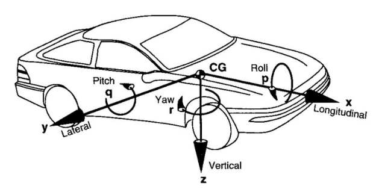

**Figure 2-1: SAE Vehicle Axis System** 

24 

July 2023 

<!-- page 25 -->

Master Thesis – Theo Zacharelis 

### **2.2 General Dimensions and Parameters** 

#### **2.2.1 General Parameters** 

The following table presents a comprehensive set of general parameters that characterize the vehicle's physical properties, that play a significant role in various analyses and calculations. The table includes both mandatory parameters required for the main model creation and additional parameters used in specific analyses. 

**Table 2-1: Vehicle General Parameters** 

|**Parameter Name**|**Value**|**Description**|**Units**|
|---|---|---|---|
|**_Manda_**|**_tory – Us_**|**_edfor Model Creation_**||
|Vehicle.General.DriveAxle|'RWD'|Drive Axle|-|
|Vehicle.General.Mass|250|Mass|kg|
|Vehicle.General.WD|49|Weight Distribution – Front|%|
|Vehicle.General.WDLR|50|Weight Distribution – Left|%|
|Vehicle.General.WB|1.53|Wheelbase|m|
|Vehicle.General.FTrack|1.238|Front Track Width|m|
|Vehicle.General.RTrack|1.15|Rear Track Width|m|
|Vehicle.General.CoG|0.330|Vehicle’s Centre of Gravity Height – Z Axis|m|
|Vehicle.General.SteerRatio|3.74|Steering Wheel Ratio (SteeringWheel/Front Wheels)|-|
|**_Extra –_**|**_Used in Y_**|**_aw Moment Diagram_**||
|Vehicle.General.Mass_NSMf|20|Non-Suspended Mass – Front Axle|kg|
|Vehicle.General.Mass_NSMr|22|Non-Suspended Mass – Rear Axle|kg|
|Vehicle.General.CoG_NSMf|0.26|Non-Suspended Mass – Centre of Gravity Height – Front Axle|m|
|Vehicle.General.CoG_NSMr|0.28|Non-Suspended Mass – Centre of Gravity Height – Rear Axle|m|
|Vehicle.General.CoG_SM|0.324|Suspended Mass – Centre of GravityHeight|m|
|Vehicle.General.MB|47|Mechanical Balance (or Roll Stiffness Distribution)– Front|%|

July 2023 25 

<!-- page 26 -->

Master Thesis – Theo Zacharelis 

|Vehicle.General.Izz|80|Vehicle Yaw Inertia|kg*m^2|
|---|---|---|---|
||**_Extra – Used in_**|**_Suspension Dynamics_**||
|Vehicle.General.Ixx|15|Vehicle Roll Inertia|kg*m^2|
|Vehicle.General.Iyy|60|Vehicle Pitch Inertia|kg*m^2|
|Vehicle.General.Izz|80|Vehicle Yaw Inertia|kg*m^2|
|Vehicle.General.PCx|0.931|Front axle distance from pitch centre – Static Pitch Centre|m|

##### <u>Notes:</u> 

- This thesis is designed to accommodate various drive axle configurations, including Front Wheel Drive ( 𝐹𝑊𝐷 ), Rear Wheel Drive ( 𝑅𝑊𝐷 ), and All Wheel Drive (AWD). 

- Please be advised that all the parameters listed in the table encompass the inclusion of the driver's weight and positioning. Hence, the mass, weight distribution, centre of gravity ( 𝐶𝑜𝐺 ), and other pertinent quantities pertain to the amalgamation of both the vehicle and the driver under race-ready circumstances. Accurate modelling of the vehicle's dynamics and performance attributes necessitates the meticulous consideration of the collective mass and weight distribution of the vehicle-driver assembly. 

- Mechanical balance, also known as roll stiffness distribution or roll balance, refers to the distribution of roll stiffness between the front and rear axles of a vehicle. It represents the relative stiffness of the suspension and anti-roll bars on each axle, affecting the vehicle's handling characteristics during cornering. The mechanical balance or roll stiffness distribution is expressed as a percentage, indicating the proportion of the total roll stiffness that is provided by the front axle compared to the rear axle. For example, if a vehicle has a mechanical balance of 60% front, it means that 60% of the total roll stiffness comes from the front suspension and anti-roll bars, while the remaining 40% comes from the rear. 

- The steering wheel ratio, also known as the steering gear ratio or steering ratio, refers to the relationship between the rotation of the steering wheel and the resulting rotation of the vehicle's wheels. It quantifies the degree of wheel rotation achieved for a given input from the steering wheel. 

26 

July 2023 

<!-- page 27 -->

Master Thesis – Theo Zacharelis 

#### **2.2.2 General Parameters Supplementary Calculations** 

To calculate the distances between the front and rear axles and the centre of gravity ( 𝐶𝑜𝐺 ) along the X-axis, the following Equations are utilized: 

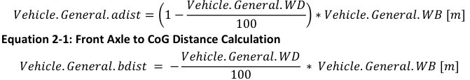

**[Equation/table image transcribed #1]** $$\text{adist} = \left(1-\frac{WD}{100}\right)\cdot WB\ [m]$$  (names: Vehicle.General.adist, .WD, .WB) [caption in image: Equation 2-1: Front Axle to CoG Distance Calculation]

**Equation 2-2: Rear Axle to CoG Distance Calculation** 

The Pitch Arm ( 𝑉𝑒ℎ𝑖𝑐𝑙𝑒. 𝐺𝑒𝑛𝑒𝑟𝑎𝑙. 𝑃𝑖𝑡𝑐ℎ𝐴𝑟𝑚 ) represents the lever arm distance from the pitch centre to the centre of gravity (COG) in the vehicle's longitudinal direction. It is calculated as the absolute difference between the distance from the front axle to the pitch centre and the front axle distance from the static pitch centre. Its calculation is shown below: 

𝑉𝑒ℎ𝑖𝑐𝑙𝑒. 𝐺𝑒𝑛𝑒𝑟𝑎𝑙. 𝑃𝑖𝑡𝑐ℎ𝐴𝑟𝑚 

= 𝑎𝑏𝑠(𝑉𝑒ℎ𝑖𝑐𝑙𝑒. 𝐺𝑒𝑛𝑒𝑟𝑎𝑙. 𝑎𝑑𝑖𝑠𝑡−𝑉𝑒ℎ𝑖𝑐𝑙𝑒. 𝐺𝑒𝑛𝑒𝑟𝑎𝑙. 𝑃𝐶𝑥) [𝑚] **Equation 2-3: Pitch Arm Calculation** 

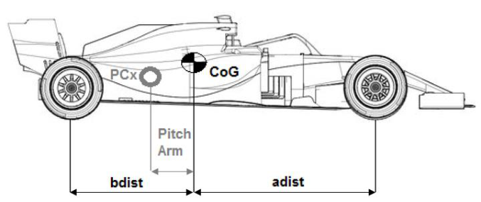

**[Equation/table image transcribed #2]** $$\text{bdist} = -\frac{WD}{100}\cdot WB\ [m]$$ (Vehicle.General.*; negative = CoG-to-rear measured negative) [FIG above/below: car side view with adist (CoG to front axle), bdist (CoG to rear axle), PCx, Pitch Arm]

**Figure 2-2: CoG to Front/Rear Axle and Pitch Arm** 

The unsprung mass of a vehicle is the mass of the suspension, wheels or tracks (as applicable), and other components directly connected to them. This contrasts with the sprung mass supported by the suspension, which includes the body and other components within or attached to it. Components of the unsprung mass include the wheel axles, wheel bearings, wheel hubs, tyres, and a portion of the weight of driveshafts, springs, shock 

27 

July 2023 

<!-- page 28 -->

Master Thesis – Theo Zacharelis 

absorbers, and suspension links. Brakes that are mounted inboard (i.e. as on the drive shaft, and not part of the wheel or its hub) are part of a vehicle's sprung mass. 

The calculation of the sprung mass involves determining the mass of the vehicle's body and components directly supported by the suspension system. It is obtained by subtracting the unsuspended masses from the total mass. The resulting sprung mass is then divided between the front and rear axles to understand the weight distribution and its impact on the vehicle's dynamics, as shown below: 

𝑉𝑒ℎ𝑖𝑐𝑙𝑒. 𝐺𝑒𝑛𝑒𝑟𝑎𝑙. 𝑀𝑎𝑠𝑠_𝑆𝑀 

= 𝑉𝑒ℎ𝑖𝑐𝑙𝑒. 𝐺𝑒𝑛𝑒𝑟𝑎𝑙. 𝑀𝑎𝑠𝑠−𝑉𝑒ℎ𝑖𝑐𝑙𝑒. 𝐺𝑒𝑛𝑒𝑟𝑎𝑙. 𝑀𝑎𝑠𝑠_𝑁𝑆𝑀𝑓 −𝑉𝑒ℎ𝑖𝑐𝑙𝑒. 𝐺𝑒𝑛𝑒𝑟𝑎𝑙. 𝑀𝑎𝑠𝑠_𝑁𝑆𝑀𝑟 [𝑘𝑔] 

**Equation 2-4: Suspended Mass Calculation** 

𝑉𝑒ℎ𝑖𝑐𝑙𝑒. 𝐺𝑒𝑛𝑒𝑟𝑎𝑙. 𝑀𝑎𝑠𝑠_𝑆𝑀𝑓 = 𝑉𝑒ℎ𝑖𝑐𝑙𝑒. 𝐺𝑒𝑛𝑒𝑟𝑎𝑙. 𝑀𝑎𝑠𝑠_𝑆𝑀 ∗ **Equation 2-5: Suspended Mass Calculation – Front Axle** 

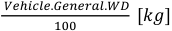

**[Equation/table image transcribed #3]** $$\frac{Vehicle.General.WD}{100}\ [kg]$$ (fragment)

𝑉𝑒ℎ𝑖𝑐𝑙𝑒. 𝐺𝑒𝑛𝑒𝑟𝑎𝑙. 𝑀𝑎𝑠𝑠_𝑆𝑀𝑟 

= 𝑉𝑒ℎ𝑖𝑐𝑙𝑒. 𝐺𝑒𝑛𝑒𝑟𝑎𝑙. 𝑀𝑎𝑠𝑠_𝑆𝑀 − 𝑉𝑒ℎ𝑖𝑐𝑙𝑒. 𝐺𝑒𝑛𝑒𝑟𝑎𝑙. 𝑀𝑎𝑠𝑠_𝑆𝑀𝑓 [𝑘𝑔] **Equation 2-6: Suspended Mass Calculation – Rear Axle** 

### **2.3 Aerodynamics Model** 

Race car aerodynamics is a fundamental discipline that encompasses the study of the interaction between a racing vehicle and the surrounding air, with the goal of enhancing performance through the manipulation of aerodynamic forces. The field draws upon principles from fluid dynamics and employs advanced computational tools to analyse and optimize the design of the car's body and aerodynamic components. 

A key objective of race car aerodynamics is to generate downforce, a vertical force that pushes the car downward, increasing the tyre's grip on the track. Downforce is essential for improving cornering performance and stability. Through meticulous manipulation of the airflow around the car, engineers employ aerodynamic elements such as wings, diffusers, and splitters to create regions of low pressure above the car and high pressure below it. This pressure differential generates downforce, which improves tyre traction, enabling the vehicle to maintain higher speeds through corners while preserving control. 

In addition to downforce generation, race car aerodynamics focuses on the reduction of aerodynamic drag, which poses a significant resistance to the vehicle's motion through the air. Drag has a direct impact on the car's top speed and acceleration capabilities. By carefully shaping the car's exterior surfaces, streamlining its body contours, and minimizing disruptions in the airflow, engineers can effectively mitigate drag and enhance the vehicle's straight-line speed. 

28 

July 2023 

<!-- page 29 -->

Master Thesis – Theo Zacharelis 

The distribution of downforce between the front and rear axles can be finely tuned to optimize the car's handling characteristics. This balance can be tailored to suit varying track conditions, driving styles, and specific performance requirements. By achieving an optimal aerodynamic balance, engineers can enhance cornering stability, facilitate responsive handling, and improve overall vehicle control. 

The obvious benefit of using aerodynamic devices will be further explained in the following sections, and more specifically in “2.8 Forces Model” section. 

#### **2.3.1 Aerodynamics Parameters** 

The aerodynamics parameters listed in Table 2-2 are essential for understanding and modelling the vehicle's aerodynamic behaviour. These parameters play a crucial role in determining the vehicle's overall downforce, drag, and balance characteristics. 

**Table 2-2: Vehicle Aerodynamics Parameters** 

|**Parameter Name**|**Value**|**Description**|**Units**|
|---|---|---|---|
||**_Mandatory_**|**_– Usedfor Model Creation_**||
|Vehicle.Aero.CzT|4.5|Total Downforce𝐶𝑧Coefficient|-|
|Vehicle.Aero.AB|45|Aero Balance - Front|%|
|Vehicle.Aero.Cx|-1.75|Total DragCx Coefficient|-|
|Vehicle.Aero.A|1|Frontal Area|m^2|
|Vehicle.Aero.Rho|1.225|Air Density|kg/m^4|
|Vehicle.Aero.S_FRH|35|Static Front Ride Height|mm|
|Vehicle.Aero.S_RRH|45|Static Rear Ride Height|mm|
||**_Extra – Used_**|**_in Yaw Moment Diagram_**||
|Vehicle.Aero.Sens.Roll|-5|𝛥𝐶𝑧𝑇% per degree of roll angle – Percentage(loss)|[%/deg]|
|Vehicle.Aero.Sens.Yaw|-0.8|𝛥𝐶𝑧𝑇% per degree of yaw angle – Percentage(loss)|[%/deg]|

Obviously, based on Total Downforce coefficient and the Aerodynamic Balance we can calculate the Downforce coefficient on Front and Rear axle respectively, as shown in the following Equations: 

𝑉𝑒ℎ𝑖𝑐𝑙𝑒. 𝐴𝑒𝑟𝑜. 𝐶𝑧𝐹 = 𝑉𝑒ℎ𝑖𝑐𝑙𝑒. 𝐴𝑒𝑟𝑜. 𝐶𝑧𝑇 ∗𝑉𝑒ℎ𝑖𝑐𝑙𝑒. 𝐴𝑒𝑟𝑜. 𝐴𝐵 [−] 100 

**Equation 2-7: CzF Calculation – Downforce Coefficient in Front Axle** 

29 

July 2023 

<!-- page 30 -->

Master Thesis – Theo Zacharelis 

𝑉𝑒ℎ𝑖𝑐𝑙𝑒. 𝐴𝑒𝑟𝑜. 𝐶𝑧𝑅 = 𝑉𝑒ℎ𝑖𝑐𝑙𝑒. 𝐴𝑒𝑟𝑜. 𝐶𝑧𝑇 ∗ (1 −𝑉𝑒ℎ𝑖𝑐𝑙𝑒. 𝐴𝑒𝑟𝑜. 𝐴𝐵 ~~)~~ [−] 100 

##### **Equation 2-8: CzR Calculation – Downforce Coefficient in Rear Axle** 

##### <u>Notes:</u> 

- The aerodynamic frontal area refers to the effective cross-sectional area of a vehicle when viewed from the front. It represents the area that directly faces the oncoming airflow during vehicle motion. The frontal area is an important parameter in aerodynamics as it influences the drag and downforce forces experienced by the vehicle, by definition (refer to “2.8 Forces Model” Section) 

- A constant value for air density is assumed, disregarding its temperaturedependent nature. This simplification allows for computational efficiency and ease of implementation. While it deviates from real-world conditions, it enables consistent analysis and comparative evaluations of other variables' effects on system performance within the simplified framework. 

- The centre of pressure ( 𝐶𝑜𝑃 ) in vehicle aerodynamics can be likened to the centre of gravity ( 𝐶𝑜𝐺 ) and weight distribution in terms of their conceptual roles. While the 𝐶𝑜𝐺 and weight distribution refer to the distribution of physical mass and static weight, the 𝐶𝑜𝑃 represents the average location of the pressure forces generated by the airflow. In a similar vein, the concept of Aerodynamic Balance, akin to weight distribution, focuses on the distribution of aerodynamic forces between the front and rear sections of the vehicle. 

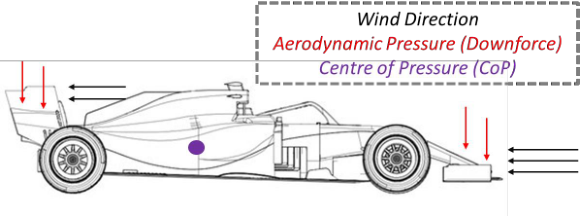

*[FIG: car side view, aero pressure/downforce, centre of pressure, wind]*

**Figure 2-3: CoP and Aero Balance** 

It is important to note that the aforementioned parameters form a simplified aerodynamic model specifically designed for certain simulations such as acceleration, braking, and LapSim. The static ride height, although it does not directly contribute to the calculation of the vehicle's dynamics, is utilized in determining the active front and rear ride heights, which are significant measured channels. 

30 

July 2023 

<!-- page 31 -->

Master Thesis – Theo Zacharelis 

For more comprehensive simulations involving scenarios like Yaw Moment Diagrams or specific cornering situations, additional modelling is required. Aero sensitivities, expressed as a single value, represent the percentage decrease of the downforce coefficient ( 𝐶𝑧 ) per degree of roll and yaw. While the Aero Balance ( 𝐴𝐵 ) remains constant, the drag coefficient ( 𝐶𝑥 ) undergoes the same percentage reduction to maintain consistent aerodynamic efficiency (downforce/drag ratio). 

In later stages, an extensive aerodynamic map is utilized, enabling the determination of coefficients for any given vehicle state, including ride height, roll, and yaw. In such cases, the static ride height actively contributes to the calculations, offering a more comprehensive analysis. 

### **2.4 Tyres Model** 

#### **2.4.1 Tyres Parameters** 

The following table presents a set of simplified parameters that characterize the behaviour of the vehicle's tyres. These parameters have been chosen to provide a basic representation of tyre performance for the specific exercise, without delving into more complex tyre models. They include the rolling radius of the tyres, the coefficients for rolling resistance, longitudinal and lateral friction, as well as load ratings for friction in different directions. The table also includes sensitivity values, which indicate how friction coefficients change with variations in the normal load. Although this simplified tyre model may not capture all intricacies of real-world tyre behaviour, it serves the purpose of the exercise by providing an adequate approximation for the simulation. 

**Table 2-3: Tyres Parameters** 

|**Parameter Name**|**Value**|**Description**|**Units**|
|---|---|---|---|
|**_Man_**|**_datory – U_**|**_sedfor Model Creation_**||
|Vehicle.Tyres.Radius|0.199|Tyre RollingRadius|m|
|Vehicle.Tyres.Cr|-0.03|RollingResistance Coefficient|-|
|Vehicle.Tyres.MuX|1.2|Longitudinal Friction Coefficient|-|
|Vehicle.Tyres.MuY|1.45|Lateral Friction Coefficient|-|
|Vehicle.Tyres.MuX_Norm|50|Longitudinal Friction Normal Load Rating|kg|
|Vehicle.Tyres.MuY_Norm|50|Lateral Friction Normal Load Rating|kg|
|Vehicle.Tyres.MuX_sens|10E-4|Longitudinal Friction Sensitivity|1/N|
|Vehicle.Tyres.MuY_sens|10E-4|Lateral Friction Sensitivity|1/N|
|Vehicle.Tyres.CF|190|Front CorneringStiffness|N/deg|
|Vehicle.Tyres.CR|190|Rear CorneringStiffness|N/deg|

July 2023 31 

<!-- page 32 -->

Master Thesis – Theo Zacharelis 

It is important to note that the baseline vehicle under consideration is equipped with identical tyres and wheels on both the front and rear axles. As a result, the aforementioned parameters are assumed to represent the characteristics of the tyres on both axles, disregarding any variations caused by temperature, pressure, or camber. It should be acknowledged that when dealing with a vehicle equipped with different tyres and/or rims, it is necessary to consider the respective parameters specific to each tyre in order to accurately model their behaviour. 

Additionally, it is assumed that the coefficient of friction for lateral forces remains consistent for both right and left turns. While this assumption may seem evident, it is worth mentioning that experimental data does not always provide unequivocal evidence due to numerous factors that can influence measurements. Regarding the longitudinal coefficient of friction, it is assumed, albeit cautiously, that it remains the same for both acceleration and braking. However, it should be noted that the tyre grip generation mechanism is a complex process, and thus it cannot be taken for granted that the coefficient of friction remains constant for both acceleration and braking. Unfortunately, due to the lack of further experimental data, the model is initialized with this assumption, and it will be subject to further evaluation during subsequent stages, particularly during the validation process. 

#### **2.4.2 Coefficient of Friction and Tyre Load Sensitivity** 

According to Milliken, tyre physics utilizes a concept of a friction coefficient for both longitudinal ( 𝑀𝑢𝑋 ) and lateral ( 𝑀𝑢𝑌 ) defined as: 

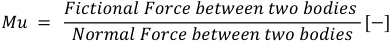

**[Equation/table image transcribed #5]** $$Mu = \frac{\text{Frictional Force between two bodies}}{\text{Normal Force between two bodies}}\ [-]$$

##### **Equation 2-9: Friction Coefficient Concept** 

This suggests normalizing (also referred to as nondimensionalizing) the lateral (or longitudinal) force vs slip angle (or slip ratio respectively) by diving by the load to give a dimensionless measure of the amount of lateral force obtained in relation to the load: 

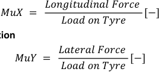

**[Equation/table image transcribed #6]** $$MuX = \frac{\text{Longitudinal Force}}{\text{Load on Tyre}}\ [-]$$ ; $$MuY = \frac{\text{Lateral Force}}{\text{Load on Tyre}}\ [-]$$

**[Equation/table image transcribed #7]** caption only: Equation 2-10: MuX Definition

##### **Equation 2-11: MuY Definition** 

The subsequent two Figures vividly illustrate the impact of normalizing the Lateral Forces as discussed above. 

32 

July 2023 

<!-- page 33 -->

Master Thesis – Theo Zacharelis 

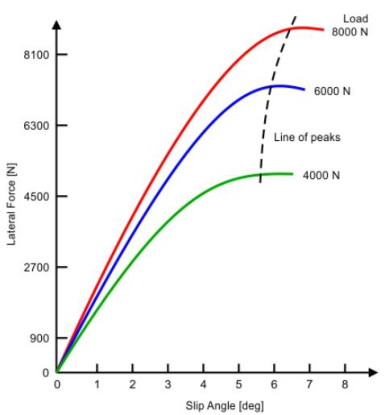

**Figure 2-4: Lateral Force vs Slip Angle for several loads** 

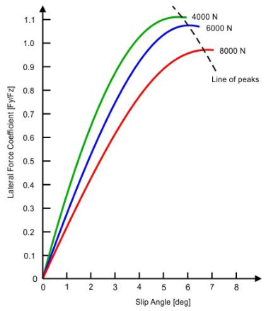

**Figure 2-5: Normalized Lateral Force vs Slip Angle for several loads** 

July 2023 33 

<!-- page 34 -->

Master Thesis – Theo Zacharelis 

It is noted that the peaks of all the load curves are brought more closely together when plotted in this fashion. If they all reached exactly the same value, the peak lateral  force for any load would be simply (lateral force coefficient) x (load on tyre).  The peak lateral force coefficient (or lateral friction coefficient} is normally higher for the lighter loads or, conversely, falls off as the load increases. This effect is called the **tyre load sensitivity** . Both the magnitude of the lateral friction coefficient and its variation with load (load sensitivity) are important in racing. The “Tyre Load Sensitivity” is illustrated in the following Figure: 

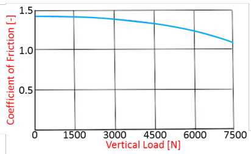

*[FIG: Coefficient of friction vs vertical load [N] (0-7500): mu ~1.42 at 0 falling to ~1.1 at 7500 N (load sensitivity)]*

**Figure 2-6: Tyre Load Sensitivity** 

The “Normal Load Rating” parameter in the given context refers to the load condition at which the longitudinal and lateral friction coefficients ( 𝑀𝑢𝑋 and 𝑀𝑢𝑌 ) were measured and determined. It represents the specific load level designated by the tyre manufacturer for evaluating the tyre's friction characteristics. This nominal load serves as a reference point to assess the tyre's performance in terms of longitudinal and lateral grip during normal operating conditions. By considering the “Normal Load Rating” along with the Mu Sensitivity, the friction coefficient is adjusted to accommodate variations in tyre load levels, effectively accounting for the tyre load sensitivity. 

Here are the corrected Equations incorporating the load sensitivity for friction coefficients: 

<u>For the X-axis (longitudinal direction):</u> 

𝑀𝑜𝑑𝑒𝑙. 𝑇𝑦𝑟𝑒𝑠. 𝑀𝑢𝑋_𝐹 

= 𝑉𝑒ℎ𝑖𝑐𝑙𝑒. 𝑇𝑦𝑟𝑒𝑠. 𝑀𝑢𝑋 + 𝑉𝑒ℎ𝑖𝑐𝑙𝑒. 𝑇𝑦𝑟𝑒𝑠. 𝑀𝑢𝑋_𝑠𝑒𝑛𝑠 

∗ (𝑉𝑒ℎ𝑖𝑐𝑙𝑒. 𝑇𝑦𝑟𝑒𝑠. 𝑀𝑢𝑋_𝑁𝑜𝑟𝑚∗𝑔 − 𝑀𝑜𝑑𝑒𝑙. 𝐹𝑜𝑟𝑐𝑒𝑠. 𝑍. 𝑇𝑜𝑡𝐹/2) [−] 

**Equation 2-12: MuX Calculation – Front Axle** 

𝑀𝑜𝑑𝑒𝑙. 𝑇𝑦𝑟𝑒𝑠. 𝑀𝑢𝑋_𝑅 

= 𝑉𝑒ℎ𝑖𝑐𝑙𝑒. 𝑇𝑦𝑟𝑒𝑠. 𝑀𝑢𝑋 + 𝑉𝑒ℎ𝑖𝑐𝑙𝑒. 𝑇𝑦𝑟𝑒𝑠. 𝑀𝑢𝑋_𝑠𝑒𝑛𝑠 

∗ (𝑉𝑒ℎ𝑖𝑐𝑙𝑒. 𝑇𝑦𝑟𝑒𝑠. 𝑀𝑢𝑋_𝑁𝑜𝑟𝑚∗𝑔 − 𝑀𝑜𝑑𝑒𝑙. 𝐹𝑜𝑟𝑐𝑒𝑠. 𝑍. 𝑇𝑜𝑡𝑅/2) [−] 

**Equation 2-13: MuX Calculation – Rear Axle** 

34 

July 2023 

<!-- page 35 -->

Master Thesis – Theo Zacharelis 

<u>For the Y-axis (lateral direction):</u> 

𝑀𝑜𝑑𝑒𝑙. 𝑇𝑦𝑟𝑒𝑠. 𝑀𝑢𝑌_𝐹 

= 𝑉𝑒ℎ𝑖𝑐𝑙𝑒. 𝑇𝑦𝑟𝑒𝑠. 𝑀𝑢𝑌 + 𝑉𝑒ℎ𝑖𝑐𝑙𝑒. 𝑇𝑦𝑟𝑒𝑠. 𝑀𝑢𝑌_𝑠𝑒𝑛𝑠 

∗ (𝑉𝑒ℎ𝑖𝑐𝑙𝑒. 𝑇𝑦𝑟𝑒𝑠. 𝑀𝑢𝑌_𝑁𝑜𝑟𝑚∗𝑔 − 𝑀𝑜𝑑𝑒𝑙. 𝐹𝑜𝑟𝑐𝑒𝑠. 𝑍. 𝑇𝑜𝑡𝐹/2) [−] 

**Equation 2-14: MuY Calculation – Front Axle** 

𝑀𝑜𝑑𝑒𝑙. 𝑇𝑦𝑟𝑒𝑠. 𝑀𝑢𝑌_𝑅 

= 𝑉𝑒ℎ𝑖𝑐𝑙𝑒. 𝑇𝑦𝑟𝑒𝑠. 𝑀𝑢𝑌 + 𝑉𝑒ℎ𝑖𝑐𝑙𝑒. 𝑇𝑦𝑟𝑒𝑠. 𝑀𝑢𝑌_𝑠𝑒𝑛𝑠 ∗ (𝑉𝑒ℎ𝑖𝑐𝑙𝑒. 𝑇𝑦𝑟𝑒𝑠. 𝑀𝑢𝑌_𝑁𝑜𝑟𝑚∗𝑔 − 𝑀𝑜𝑑𝑒𝑙. 𝐹𝑜𝑟𝑐𝑒𝑠. 𝑍. 𝑇𝑜𝑡𝑅/2) [−] **Equation 2-15: MuY Calculation – Rear Axle** 

These Equations adjust the friction coefficients ( 𝑀𝑢𝑋 and 𝑀𝑢𝑌 ) based on the load sensitivity. The load sensitivity term, represented by the difference between the nominal load ( 𝑀𝑢𝑋_𝑁𝑜𝑟𝑚 or 𝑀𝑢𝑌_𝑁𝑜𝑟𝑚 multiplied by g, the acceleration due to gravity) and half of the total vertical forces on the front or rear axles ( 𝑀𝑜𝑑𝑒𝑙. 𝐹𝑜𝑟𝑐𝑒𝑠. 𝑍. 𝑇𝑜𝑡𝐹 or 𝑀𝑜𝑑𝑒𝑙. 𝐹𝑜𝑟𝑐𝑒𝑠. 𝑍. 𝑇𝑜𝑡𝑅 ), accounts for the variation in tyre load levels and allows for a more accurate representation of the tyre's friction characteristics under different load conditions. In addition, it becomes apparent that obtaining the normal load on each axle requires considering not only the static weight distribution but also factors such as aerodynamic downforce and weight transfer during certain simulations, as explained in the introduction. These aspects will be further explained in the “2.8 Forces Model” section, where the calculation of total vertical forces on the front and rear axles ( 𝑀𝑜𝑑𝑒𝑙. 𝐹𝑜𝑟𝑐𝑒𝑠. 𝑍. 𝑇𝑜𝑡𝐹 and 𝑀𝑜𝑑𝑒𝑙. 𝐹𝑜𝑟𝑐𝑒𝑠. 𝑍. 𝑇𝑜𝑡𝑅 ) will be detailed. By incorporating these dynamic forces, a more comprehensive and accurate assessment of the tyre's load sensitivity and friction characteristics can be achieved. 

#### **2.4.3 Cornering Stiffness** 

Cornering stiffness, represented by the parameters 𝑉𝑒ℎ𝑖𝑐𝑙𝑒. 𝑇𝑦𝑟𝑒𝑠. 𝐶𝐹 (front cornering stiffness) and 𝑉𝑒ℎ𝑖𝑐𝑙𝑒. 𝑇𝑦𝑟𝑒𝑠. 𝐶𝑅 (rear cornering stiffness), is a fundamental characteristic that quantifies a tyre's ability to generate lateral grip. It is defined as the force generated per degree of slip angle (N/deg). A tyre with higher cornering stiffness exhibits greater resistance to lateral forces, resulting in enhanced cornering performance. The cornering stiffness is illustrated in the following graph, where the slope of the curve within the linear range represents this characteristic. This parameter plays a significant role in analysing the vehicle's cornering behaviour and evaluating its handling capabilities. 

35 

July 2023 

<!-- page 36 -->

Master Thesis – Theo Zacharelis 

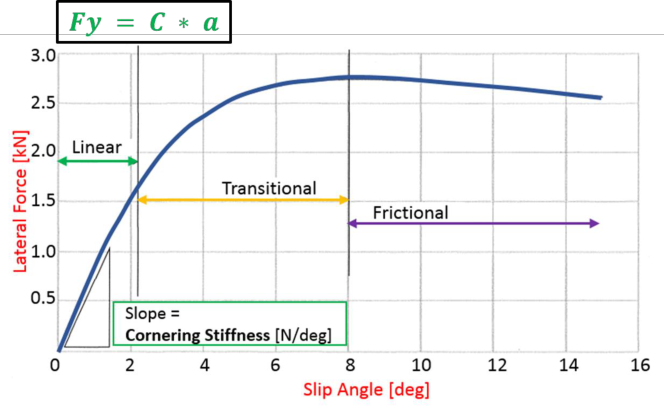

**Figure 2-7: Lateral Force vs Slip Angle - Cornering Stiffness** 

It is noteworthy that although Cornering Stiffness does not directly influence the tyre model, as previously explained, it plays a role in a subsequent stage for the estimation of steering wheel angle (refer to “2.9.1 Steering”). This estimation is considered a driven/measured channel within the simulation. 

### **2.5 Suspension Model** 

It is worth mentioning that while there is no dedicated suspension model specifically tailored for simulation scenarios involving acceleration, braking, cornering or LapSim, as these suspension characteristics do not directly affect the equations governing the vehicle's motion, certain suspension metrics play a crucial role in other aspects of the simulation. 

For instance, when constructing the Yaw Moment Diagram, specific suspension parameters become significant as they influence the Tyres Forces and Moments (Toe and Camber Angle), as a Pacejka Magic Formula is used and the Weight Transfer (Roll Centre). Furthermore, a detailed representation of suspension parameters, including stiffness and motion ratios, as well as damping characteristics, becomes essential when analysing and simulating vertical dynamics (refer to section “Vertical Dynamics”). These metrics are also utilized in estimating the measured active front and rear ride height. 

Moreover, in the context of specific simulation scenarios and LapSim utilizing the AeroMap, the effect of anti-dive, anti-lift, and anti-squat percentages is taken into account. These metrics play a role in accounting for the aerodynamic characteristics of the vehicle, as they 

36 

July 2023 

<!-- page 37 -->

Master Thesis – Theo Zacharelis 

affect the active ride height, which is then incorporated into the simulation through the AeroMap. 

Detailed explanations of these topics can be found in the subsequent Chapters, namely “5. Suspension Dynamics” and “7. AeroMap to Simulation”, which provide a comprehensive understanding of how suspension parameters and aerodynamic effects are considered and integrated into the simulation framework. 

**Table 2-4: Suspension Parameters** 

|**Parameter Name**|**Value**|**Description**|**Units**|
|---|---|---|---|
|**_Extra – Used in Y_**|**_aw Moment_**|**_Diagram_**||
|Vehicle.Suspension.Toef|0|Front Static Toe Angle|deg|
|Vehicle.Suspension.CAf|0|Static Camber Angle - Front|deg|
|Vehicle.Suspension.CAr|0|Static Camber Angle - Rear|deg|
|Vehicle.Suspension.RCf|0.0295|Front Roll Centre Height|m|
|Vehicle.Suspension.RCr|0.0690|Rear  Roll Centre Height|m|
|Vehicle.Suspension.RollGradient|0.65|Roll Gradient|deg/g|
|Vehicle.Steering.AckermannRatio|1|Outer/Inner Steer Angle|-|
|**_Extra – Used in_**|**_Suspension D_**|**_ynamics_**||
|Vehicle.Suspension.MRf|1.08|Front Spring Motion Ratio(Wheel/Spring)|-|
|Vehicle.Suspension.MRr|1.06|Rear  Spring Motion Ratio (Wheel/Spring)|-|
|Vehicle.Suspension.KSpringF_lbsinch|350|Spring Stiffness Front -per corner|lbs/inch|
|Vehicle.Suspension.KSpringR_lbsinch|150|Spring Stiffness Rear -per corner|lbs/inch|
|Vehicle.Suspension.KTyreF|95E+03|Tyre Stiffness Front - per corner|N/m|
|Vehicle.Suspension.KTyreR|95E+03|Tyre Stiffness Rear - per corner|N/m|

July 2023 37 

<!-- page 38 -->

Master Thesis – Theo Zacharelis 

|Vehicle.Suspension.KARBF|36450|Front ARB Stiffness|N/m|
|---|---|---|---|
|Vehicle.Suspension.KARBR|115710|Rear ARB Stiffness|N/m|
|Vehicle.Suspension.MRf_ARB|1.07|Front ARB Motion Ratio(Wheel/ARB)|-|
|Vehicle.Suspension.MRr_ARB|1.56|Rear  ARB Motion Ratio (Wheel/ARB)|-|
|Vehicle.Suspension.Dampers.KneeSpeed|12|Knee Speed|mm/s|
|Vehicle.Suspension.Dampers.ZF_ls|4|Damping Ratio - Front - Low Speed|-|
|Vehicle.Suspension.Dampers.ZR_ls|3.2|Damping Ratio - Rear  - Low Speed|-|
|Vehicle.Suspension.Dampers.CompReb_ls|1.5|Compression/Rebou nd Ratio - Low Speed|-|
|Vehicle.Suspension.Dampers.ZF_hs|0.9|Damping Ratio - Front - High Speed|-|
|Vehicle.Suspension.Dampers.ZR_hs|0.8|Damping Ratio - Rear  - High Speed|-|
|Vehicle.Suspension.Dampers.CompReb_hs|0.5|Compression/Reboun d Ri  Hih Sd|-|
|||ato -g pee||
|**_Extra – Used in LapS_**|**_im with A_**|**_eroMap_**||
|Vehicle.Suspension.AntiDive|30.3|Front Suspension Anti Dive - Braking|%|
|Vehicle.Suspension.AntiLiftR|13.5|Rear Suspension Anti Lift – Braking|%|
|Vehicle.Suspension.AntiLiftF|-|Front Suspension Anti Lift – Acceleration|%|
|||Rear Suspension||
|Vehicle.Suspension.AntiSquat|20|Anti Squat - Acceleration|%|

#### **2.5.1 Definitions** 

**Camber** : Camber is the vertical inclination of the tyre. Zero camber means that the tyres are straight, perpendicular to the road and parallel to each other. With positive camber, the top of the tyres points outwards of the car. With negative camber, the top of the tyres points inwards. 

38 

July 2023 

<!-- page 39 -->

Master Thesis – Theo Zacharelis 

**Toe** : Toe is the angle the tyres are rotated around their vertical axis, looking at them from above the car. You have no toe if the tyres are parallel to each other, along the direction of the car. You have toe-in when the tyres point in towards each other, and toe-out when they point away from each other. 

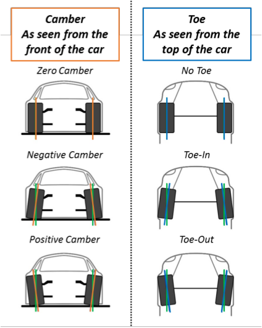

**Figure 2-8: Camber and Toe Definitions** 

**Roll Centre** : The official definition of a roll centre, as given by the Society of Automotive Engineers, is ‘The point in the transverse vertical plane through any pair of wheels centres at which lateral forces apply to the sprung mass without producing suspension roll.’ 

The focus is on force application, and the roll centre represents the pivot point of the suspension system in its entirety. Any force that is parallel to the swing arm of the suspension will act in line with the roll centre and result in zero suspension deflection – hence, no body roll. 

It is important to note that the Roll Centre is not a fixed point but rather exhibits movement during suspension bump or roll. Nevertheless, in the context of race car applications, engineers strive to design the suspension arms in a manner that minimizes the variation of 

July 2023 39 

<!-- page 40 -->

Master Thesis – Theo Zacharelis 

the Roll Centre. This objective is pursued to mitigate the undesirable effects associated with its movement. 

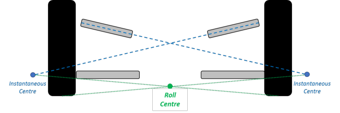

*[FIG: suspension roll centre / instantaneous centres diagram]*

**Figure 2-9: Roll Centre Graphic Definition** 

**Roll Gradient** : The roll gradient is defined as the derivative of the vehicle body roll angle with respect to the lateral acceleration acting at its centre of gravity ( 𝐶𝑜𝐺 ), as indicated in the following graph: 

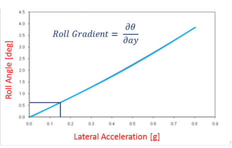

*[FIG: Roll angle [deg] vs lateral acceleration [g]; Roll Gradient = d(theta)/d(ay); ~0.6 deg at 0.15 g, ~3.9 deg at 0.8 g (near-linear)]*

**Figure 2-10: Roll Gradient Definition** 

The Roll Gradient plays a crucial role in Yaw Moment Diagrams by enabling the implementation of Aero Sensitivity. Through the Roll Gradient, it becomes possible to determine the roll angle for a given lateral acceleration, which further allows the calculation of the percentage loss of the Downforce Coefficient ( 𝐶𝑧 ) resulting from the roll, given that roll is essentially a manifestation of lateral acceleration. 

**Motion Ratios:** The Motion Ratio, denoted as MR, is a significant parameter utilized in the computation of vehicle rates. It represents the ratio between the movement of Member A 

July 2023 40 

<!-- page 41 -->

Master Thesis – Theo Zacharelis 

and the motion of Member B in the suspension system. It should be emphasized that the Motion Ratio is not a static value but rather an instantaneous and continuously changing parameter. Its value depends on the positions of the individual members and should not be confused with the ratio of the total displacement range of Member A to the displacement amplitude of Member B. 

In essence, the Motion Ratio can be conceptualized as the derivative of a function F(x), where A represents the displacement of Member A and B represents the displacement of Member B. For a double wishbone suspension system commonly found in prototype racing vehicles, the Motion Ratio most frequently employed is the ratio between the vertical wheel displacement and the displacement of an elastic element, such as a spring or anti-roll bar. 

##### 𝑀𝑜𝑡𝑖𝑜𝑛 𝑅𝑎𝑡𝑖𝑜 =𝑀𝑜𝑣𝑒𝑚𝑒𝑛𝑡 𝑜𝑓 𝑀𝑒𝑚𝑏𝑒𝑟 𝐴 [−] 𝑀𝑜𝑣𝑒𝑚𝑒𝑛𝑡 𝑜𝑓 𝑀𝑒𝑚𝑏𝑒𝑟 𝐵 

##### **Equation 2-16: Motion Ratio Definition** 

Throughout this master’s thesis, the convention adopted is to designate the wheel as Member A (numerator) and the elastic element (e.g., spring, anti-roll bar) as Member B (denominator). This consistent framework allows for clear and consistent communication when referring to the Motion Ratio in the context of the suspension system analysis. 

The baseline vehicle (P19-Delia) was intentionally designed with a relatively constant Motion Ratio, as evidenced by the experimental data presented below. As a result, a consistent Motion Ratio value was maintained throughout the analysis for the sake of simplicity. It is worth noting that a similar trend was also observed for the Motion Ratio of the anti-roll bar (ARB). 

41 

July 2023 

<!-- page 42 -->

Master Thesis – Theo Zacharelis 

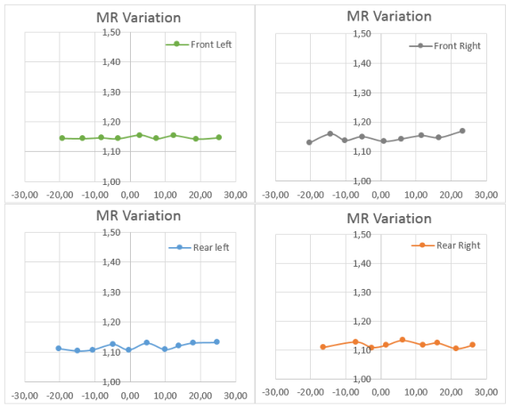

##### **Figure 2-11: Spring Motion Ratio – Experimental Data (Motion Ratio vs Wheel Movement)** 

The definitions of Spring Stiffness, Tyre Vertical Stiffness (referred to as Vertical Spring Rate), and ARB Torsional Stiffness are relatively straightforward. However, a more comprehensive understanding of the damping characteristics and the Anti-Features necessitates additional elaboration, which will be provided in subsequent Chapters, particularly in the sections on “5. Suspension Dynamics” and “7. AeroMap to Simulation”. 

#### **2.5.2 Suspension Parameters Supplementary Calculations** <u>Spring Stiffness:</u> 

The springs in the model are assumed to be linear, meaning that their behaviour is represented by a single stiffness value rather than a complete curve, which would be the case for non-linear springs. This linear assumption is valid for the baseline vehicle, but it may require reassessment for a different vehicle with different suspension characteristics. It is important to note that the spring stiffness values provided in the table are measured in pounds per inch (lbs/inch), which is a common unit for springs. However, if required, these values can be easily converted to the standard SI unit of Newtons per meter (N/m) using an appropriate conversion factor: 

42 

July 2023 

<!-- page 43 -->

Master Thesis – Theo Zacharelis 

𝑉𝑒ℎ𝑖𝑐𝑙𝑒. 𝑆𝑢𝑠𝑝𝑒𝑛𝑠𝑖𝑜𝑛. 𝐾𝑆𝑝𝑟𝑖𝑛𝑔 

= 175.126835 ∗ 𝑉𝑒ℎ𝑖𝑐𝑙𝑒. 𝑆𝑢𝑠𝑝𝑒𝑛𝑠𝑖𝑜𝑛. 𝐾𝑆𝑝𝑟𝑖𝑛𝑔_𝑙𝑏𝑠𝑖𝑛𝑐ℎ [𝑁/𝑚] **Equation 2-17: Convert Spring Stiffness to N/m from lbs/inch** 

##### <u>Roll Axis:</u> 

The calculation of the Roll Axis height and the roll lever arm between the Centre of Gravity ( 𝐶𝑜𝐺 ) and the Roll Axis involves considering the 𝐶𝑜𝐺 Longitudinal position and the Roll Centre heights. The Roll Axis represents an imaginary line around which the vehicle rolls, and its height in relation to the longitudinal position of the sprung mass is a significant factor in understanding the vehicle's stability and handling characteristics. 

To determine the Roll Axis height at the longitudinal position of the sprung mass, we utilize the 𝐶𝑜𝐺 Longitudinal position and the Roll Centre heights in the following Equation: 

𝑉𝑒ℎ𝑖𝑐𝑙𝑒. 𝑆𝑢𝑠𝑝𝑒𝑛𝑠𝑖𝑜𝑛. 𝑅𝐶_𝐶𝑂𝐺 

= (1 −𝑉𝑒ℎ𝑖𝑐𝑙𝑒. 𝐺𝑒𝑛𝑒𝑟𝑎𝑙. 𝑊𝐷/100) ∗ 𝑉𝑒ℎ𝑖𝑐𝑙𝑒. 𝑆𝑢𝑠𝑝𝑒𝑛𝑠𝑖𝑜𝑛. 𝑅𝐶𝑓 +. . . 

𝑉𝑒ℎ𝑖𝑐𝑙𝑒. 𝐺𝑒𝑛𝑒𝑟𝑎𝑙. 𝑊𝐷/100    ∗ 𝑉𝑒ℎ𝑖𝑐𝑙𝑒. 𝑆𝑢𝑠𝑝𝑒𝑛𝑠𝑖𝑜𝑛. 𝑅𝐶𝑟  [𝑚] 

##### **Equation 2-18: Roll Axis Height at the longitudinal position of the sprung mass** 

Furthermore, we determine the roll lever arm between the 𝐶𝑜𝐺 and the Roll Axis using the Equation: 

𝑉𝑒ℎ𝑖𝑐𝑙𝑒. 𝑆𝑢𝑠𝑝𝑒𝑛𝑠𝑖𝑜𝑛. 𝑅𝑜𝑙𝑙_𝐻𝑅 

= 𝑉𝑒ℎ𝑖𝑐𝑙𝑒. 𝐺𝑒𝑛𝑒𝑟𝑎𝑙. 𝐶𝑜𝐺_𝑆𝑀 − 𝑉𝑒ℎ𝑖𝑐𝑙𝑒. 𝑆𝑢𝑠𝑝𝑒𝑛𝑠𝑖𝑜𝑛. 𝑅𝐶_𝐶𝑂𝐺 [𝑚] **Equation 2-19: Roll Lever Arm Calculation** 

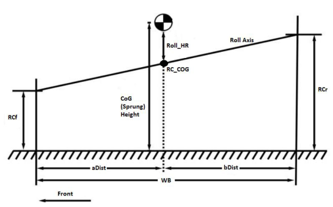

**Figure 2-12: Roll Axis and Roll Lever Arm Definition** 

43 

July 2023 

<!-- page 44 -->

Master Thesis – Theo Zacharelis 

### **2.6 Powertrain Model** 

#### **2.6.1 Engine and Drivetrain Parameters** 

Table 2 presents a comprehensive list of engine and transmission parameters along with their corresponding values and descriptions. These parameters cover a wide range of aspects related to engine performance, efficiency, and configuration. Understanding these parameters is essential for accurately modelling the engine and predicting its behaviour under different operating conditions. 

**Table 2-5: Vehicle Engine and Drivetrain Parameters** 

|**Parameter Name**|**Value**|**Description**|**Units**|
|---|---|---|---|
|Vehicle.Engine.Scalar|1|Factor of Torque and Power for Engine Map|-|
|Vehicle.Engine.Data|(file)|File with Engine Dyno Data including Engine Speed and Engine Torque|RPM and Nm|
|Vehicle.Engine.RPMidle|2000|Idle – Clutch disengagement|RPM|
|Vehicle.Engine.nThermal|0.30|Engine Thermal Efficiency|-|
|Vehicle.Engine.FuelHeatVal|4.72E+07|Fuel Lower HeatingValue|J/kg|
|Vehicle.Engine.nDrivetrain|0.90|Drivetrain Efficiency|-|
|Vehicle.Engine.GearRatioPrimary|1|PrimaryGear Ratio|-|
|Vehicle.Engine.GearRatioFinal|3.6|Final Drive Ratio|-|
|Vehicle.Engine.GearRatios|4.51, 3.23 2.49, 2.03, 1.71, 1.49|Gear Ratios|-|

#### **2.6.2 Engine Curve** 

One of the parameters, 𝑉𝑒ℎ𝑖𝑐𝑙𝑒. 𝐸𝑛𝑔𝑖𝑛𝑒. 𝐷𝑎𝑡𝑎 , refers to an external file that contains the Engine Dyno Data. This file provides detailed information on the engine's performance, including the engine speed and torque values at various RPM points. It serves as a valuable resource for analysing and understanding the engine's characteristics. To utilize this data further, we can calculate the engine power using the Equation: 

44 

July 2023 

<!-- page 45 -->

Master Thesis – Theo Zacharelis 

𝑉𝑒ℎ𝑖𝑐𝑙𝑒. 𝐸𝑛𝑔𝑖𝑛𝑒. 𝑃𝑜𝑤𝑒𝑟 

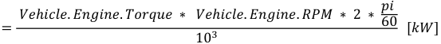

**[Equation/table image transcribed #11]** $$= \frac{Vehicle.Engine.Torque \cdot Vehicle.Engine.RPM \cdot 2\cdot\frac{\pi}{60}}{10^3}\ [kW]$$ (engine power)

##### **Equation 2-20: Engine Power Calculation** 

To visualize the engine dyno data, a graph can be plotted using the RPM values on the x-axis and the corresponding torque and power values on the y-axis. This graph allows for a visual representation of the engine's torque and power curves, showcasing how the torque output varies with the engine speed. 

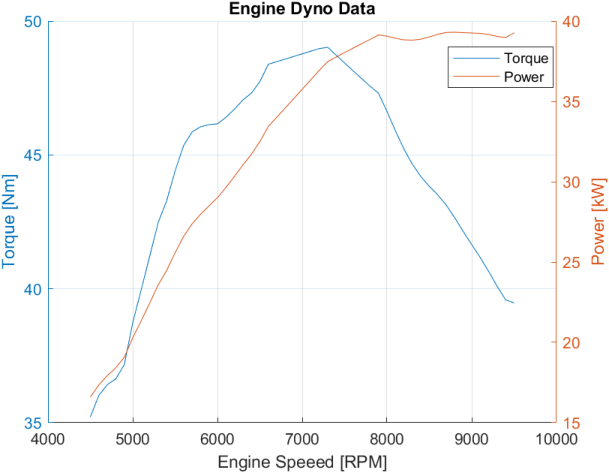

**Figure 2-13: Engine Dyno Data** 

The gear ratios play a crucial role in determining the overall performance of a vehicle's drivetrain. In the context of the engine parameters, the gear ratios refer to the different gear ratios available in the vehicle's transmission system. These ratios define the relationship between the rotational speed of the engine (input) and the rotational speed of the wheels (output) for each gear. 

#### **2.6.3 Drivetrain** 

To calculate the total gear ratios, the following Equation is used: 

45 

July 2023 

<!-- page 46 -->

Master Thesis – Theo Zacharelis 

𝑉𝑒ℎ𝑖𝑐𝑙𝑒. 𝐸𝑛𝑔𝑖𝑛𝑒. 𝑇𝑜𝑡𝑎𝑙𝐺𝑒𝑎𝑟𝑅𝑎𝑡𝑖𝑜𝑠 = 𝑉𝑒ℎ𝑖𝑐𝑙𝑒. 𝐸𝑛𝑔𝑖𝑛𝑒. 𝐺𝑒𝑎𝑟𝑅𝑎𝑡𝑖𝑜𝑠 ∗ 𝑉𝑒ℎ𝑖𝑐𝑙𝑒. 𝐸𝑛𝑔𝑖𝑛𝑒. 𝐺𝑒𝑎𝑟𝑅𝑎𝑡𝑖𝑜𝐹𝑖𝑛𝑎𝑙∗𝑉𝑒ℎ𝑖𝑐𝑙𝑒. 𝐸𝑛𝑔𝑖𝑛𝑒. 𝐺𝑒𝑎𝑟𝑅𝑎𝑡𝑖𝑜𝑃𝑟𝑖𝑚𝑎𝑟𝑦 [−] 

##### **Equation 2-21: Total Gear Ratios Calculation** 

In this Equation, the gear ratios specified in the 𝑉𝑒ℎ𝑖𝑐𝑙𝑒. 𝐸𝑛𝑔𝑖𝑛𝑒. 𝐺𝑒𝑎𝑟𝑅𝑎𝑡𝑖𝑜𝑠 array are multiplied by the primary gear ratio ( 𝑉𝑒ℎ𝑖𝑐𝑙𝑒. 𝐸𝑛𝑔𝑖𝑛𝑒. 𝐺𝑒𝑎𝑟𝑅𝑎𝑡𝑖𝑜𝑃𝑟𝑖𝑚𝑎𝑟𝑦 ) and the final drive ratio ( 𝑉𝑒ℎ𝑖𝑐𝑙𝑒. 𝐸𝑛𝑔𝑖𝑛𝑒. 𝐺𝑒𝑎𝑟𝑅𝑎𝑡𝑖𝑜𝐹𝑖𝑛𝑎𝑙 ). The primary gear ratio represents the gear ratio between the engine's crankshaft and the input shaft of the transmission. The final drive ratio, on the other hand, refers to the gear ratio between the output shaft of the transmission and the wheels. 

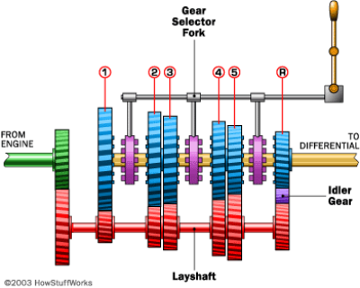

**Figure 2-14: Transmission example of 5-speed car (www.auto.howstuffworks.com)** 

By multiplying these ratios, we obtain the total gear ratios for each gear, as shown in the table below. These total gear ratios are crucial for analysing the vehicle's acceleration, speed, and overall performance characteristics at different gear settings. 

**Table 2-6: Total Gear Ratios** 

|**Gear**|**Gear Ratio**|**Total Gear Ratio**|
|---|---|---|
|1stGear|4.51|16.24|
|2ndGear|3.23|11.63|
|3rdGear|2.49|8.96|
|4thGear|2.03|7.31|
|5thGear|1.71|6.16|
|6thGear|1.49|5.36|

July 2023 46 

<!-- page 47 -->

Master Thesis – Theo Zacharelis 

Afterwards, the main concept is to calculate the speeds for each gear and for each engine RPM datapoint. The purpose is to understand how the engine speed and gear ratio influence the vehicle speed. The calculations are performed for each gear using a loop, considering linear “Torque vs TPS” Map. 

Note: TPS stands for “Throttle Position Sensor”, which is a sensor used to monitor the position of the throttle pedal and provide corresponding feedback to the engine control unit. 

The first step is to calculate the wheel speed ( 𝑀𝑜𝑑𝑒𝑙. 𝐸𝑛𝑔𝑖𝑛𝑒. 𝑣𝑊ℎ𝑒𝑒𝑙_𝑔𝑒𝑎𝑟 ) by dividing the engine RPM ( 𝑉𝑒ℎ𝑖𝑐𝑙𝑒. 𝐸𝑛𝑔𝑖𝑛𝑒. 𝑅𝑃𝑀 ) by the corresponding total gear ratio. This determines the rotational speed of the wheels for each combination of gear and engine speed. 

𝑉𝑒ℎ𝑖𝑐𝑙𝑒. 𝐸𝑛𝑔𝑖𝑛𝑒. 𝑅𝑃𝑀 𝑀𝑜𝑑𝑒𝑙. 𝐸𝑛𝑔𝑖𝑛𝑒. 𝑣𝑊ℎ𝑒𝑒𝑙_𝑔𝑒𝑎𝑟 = [𝑅𝑃𝑀] 𝑉𝑒ℎ𝑖𝑐𝑙𝑒. 𝐸𝑛𝑔𝑖𝑛𝑒. 𝑇𝑜𝑡𝑎𝑙𝐺𝑒𝑎𝑟𝑅𝑎𝑡𝑖𝑜𝑠 

##### **Equation 2-22: Wheel Speed per gear Calculation** 

Next, the wheel torque ( 𝑀𝑜𝑑𝑒𝑙. 𝐸𝑛𝑔𝑖𝑛𝑒. 𝑡𝑊ℎ𝑒𝑒𝑙_𝑔𝑒𝑎𝑟 ) is computed by multiplying the engine torque ( 𝑉𝑒ℎ𝑖𝑐𝑙𝑒. 𝐸𝑛𝑔𝑖𝑛𝑒. 𝑇𝑜𝑟𝑞𝑢𝑒 ) by the total gear ratio and a drivetrain efficiency factor. This represents the twisting force exerted on the wheels due to the engine power and gear ratio. 

𝑀𝑜𝑑𝑒𝑙. 𝐸𝑛𝑔𝑖𝑛𝑒. 𝑡𝑊ℎ𝑒𝑒𝑙_𝑔𝑒𝑎𝑟 

= 𝑉𝑒ℎ𝑖𝑐𝑙𝑒. 𝐸𝑛𝑔𝑖𝑛𝑒. 𝑇𝑜𝑟𝑞𝑢𝑒 ∗ 𝑉𝑒ℎ𝑖𝑐𝑙𝑒. 𝐸𝑛𝑔𝑖𝑛𝑒. 𝑇𝑜𝑡𝑎𝑙𝐺𝑒𝑎𝑟𝑅𝑎𝑡𝑖𝑜𝑠 ∗ 𝑉𝑒ℎ𝑖𝑐𝑙𝑒. 𝐸𝑛𝑔𝑖𝑛𝑒. 𝑛𝐷𝑟𝑖𝑣𝑒𝑡𝑟𝑎𝑖𝑛 [𝑁𝑚] 

##### **Equation 2-23: Wheel Torque per gear Calculation** 

To obtain the vehicle speed ( 𝑀𝑜𝑑𝑒𝑙. 𝐸𝑛𝑔𝑖𝑛𝑒. 𝑣𝐶𝑎𝑟_𝑔𝑒𝑎𝑟 ), the wheel speed is multiplied by the tyre radius and converted from radians per second to kilometres per hour. This provides a measure of how fast the vehicle is moving for each combination of gear and engine speed. 𝑀𝑜𝑑𝑒𝑙. 𝐸𝑛𝑔𝑖𝑛𝑒. 𝑣𝐶𝑎𝑟_𝑔𝑒𝑎𝑟 

=  𝑀𝑜𝑑𝑒𝑙. 𝐸𝑛𝑔𝑖𝑛𝑒. 𝑣𝑊ℎ𝑒𝑒𝑙_𝑔𝑒𝑎𝑟∗𝑉𝑒ℎ𝑖𝑐𝑙𝑒. 𝑇𝑦𝑟𝑒𝑠. 𝑅𝑎𝑑𝑖𝑢𝑠∗2 ∗𝑝𝑖 [𝑚/𝑠] 60 

##### **Equation 2-24: Vehicle Speed per gear Calculation** 

The results are then used to generate a plot showing the relationship between engine RPM and vehicle speed. Each gear is represented by a line on the plot, and the variation of vehicle speed with engine RPM is displayed. This allows for the analysis of how different gear ratios affect the vehicle's speed at different engine speeds. 

47 

July 2023 

<!-- page 48 -->

Master Thesis – Theo Zacharelis 

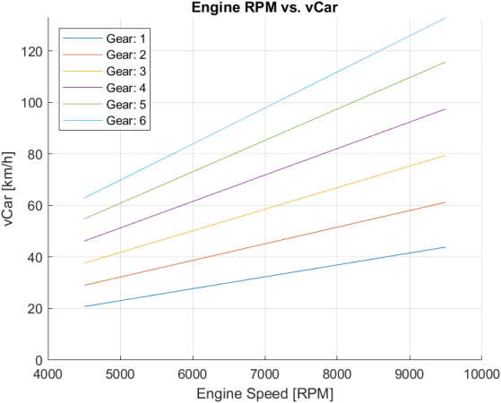

**Figure 2-15: Vehicle Speed vs Engine Speed per Gear** 

Overall, this calculation provides insights into the performance characteristics of the vehicle in terms of speed and engine RPM, highlighting the influence of gear selection on the vehicle's acceleration and overall speed capabilities. 

#### **2.6.4 Tractive Force** 

This section focuses on the analysis and calculation of the engine's tractive force ( 𝐹𝑥𝐸𝑛𝑔𝑖𝑛𝑒 ) in relation to the vehicle speed ( 𝑣𝐶𝑎𝑟 ). The 𝑣𝐶𝑎𝑟 vector is generated using the minimum and maximum 𝑣𝐶𝑎𝑟 values obtained from the previous subsection, specifically the “Vehicle Speed per gear Calculation”. The calculation of the tractive force ( 𝐹𝑥𝐸𝑛𝑔𝑖𝑛𝑒 ) involves a simple division of the torque at the wheel by the radius of the tyre, as demonstrated by the following Equation: 

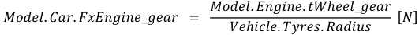

**[Equation/table image transcribed #12]** $$Model.Car.FxEngine\_gear = \frac{Model.Engine.tWheel\_gear}{Vehicle.Tyres.Radius}\ [N]$$

##### **Equation 2-25: Tractive Force Calculation** 

To determine the 𝐹𝑥𝐸𝑛𝑔𝑖𝑛𝑒 at each 𝑣𝐶𝑎𝑟 value, a nested loop structure is employed. The outer loop iterates through each 𝑣𝐶𝑎𝑟 data point, while the inner loop considers each gear. Within the inner loop, the interp1 function is utilized to interpolate the engine torque values 

48 

July 2023 

<!-- page 49 -->

Master Thesis – Theo Zacharelis 

( 𝑀𝑜𝑑𝑒𝑙. 𝐸𝑛𝑔𝑖𝑛𝑒. 𝑡𝑊ℎ𝑒𝑒𝑙_𝑔𝑒𝑎 r) based on the corresponding vehicle speeds ( 𝑀𝑜𝑑𝑒𝑙. 𝐸𝑛𝑔𝑖𝑛𝑒. 𝑣𝐶𝑎𝑟_𝑔𝑒𝑎𝑟 ) for each gear. This interpolation process enables the calculation of the 𝐹𝑥𝐸𝑛𝑔𝑖𝑛𝑒 at the specific 𝑣𝐶𝑎𝑟 value using linear interpolation. 

For every 𝑣𝐶𝑎𝑟 data point, the maximum engine tractive force and the associated gear are identified using the max function. The maximum 𝐹𝑥𝐸𝑛𝑔𝑖𝑛𝑒 represents the highest achievable tractive force by the engine at that particular vehicle speed, while the corresponding gear signifies the optimal gear selection for maximizing performance. 

The computed metrics, including the engine tractive force per gear ( 𝑀𝑜𝑑𝑒𝑙. 𝐶𝑎𝑟. 𝐹𝑥𝐸𝑛𝑔𝑖𝑛𝑒_𝑔𝑒𝑎𝑟 ), the final engine tractive force ( 𝑀𝑜𝑑𝑒𝑙. 𝐶𝑎𝑟. 𝐹𝑥𝐸𝑛𝑔𝑖𝑛𝑒 ), and the selected gear ( 𝑀𝑜𝑑𝑒𝑙. 𝐶𝑎𝑟. 𝐺𝑒𝑎𝑟 ), are stored in their respective arrays for further analysis. 

Furthermore, the code includes plotting functionality to visually represent the relationship between 𝑣𝐶𝑎𝑟 and 𝐹𝑥𝐸𝑛𝑔𝑖𝑛𝑒 . These plots offer valuable insights into the engine's tractive force capabilities across different vehicle speeds and gear choices, facilitating the assessment of the engine's performance characteristics. 

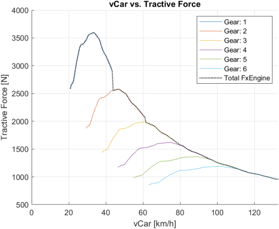

**Figure 2-16: Tractive Force vs Vehicle Speed (Total and for each Gear) – Initial** 

49 

July 2023 

<!-- page 50 -->

Master Thesis – Theo Zacharelis 

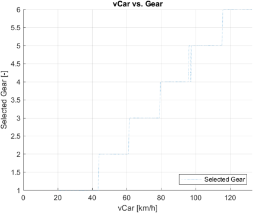

**Figure 2-17: Selected Gear vs Vehicle Speed – Initial** 

It becomes evident that an undesired downshift occurs when transitioning from 5th Gear to 4th Gear as the vehicle speed increases. This behaviour can be attributed to the experimental nature of the engine data, which was obtained from a dyno. Upon conducting a detailed analysis of this particular region, as depicted in the accompanying Figure, the aforementioned hypothesis is corroborated. 

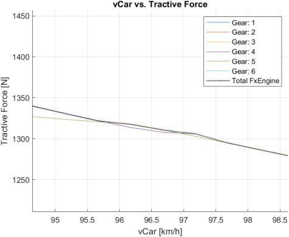

**Figure 2-18: Effect of Non-Smooth Engine Curve on Faulty Downshifts** 

July 2023 50 

<!-- page 51 -->

Master Thesis – Theo Zacharelis 

Moreover, considering the presence of shifting delay (which is not currently considered), a decision has been made to mitigate these undesired downshifts. As a result, the code incorporates a mechanism to identify and filter out erroneous downshifts from the analysis. The resultant corrected Tractive Force and respective selected gear are shown below: 

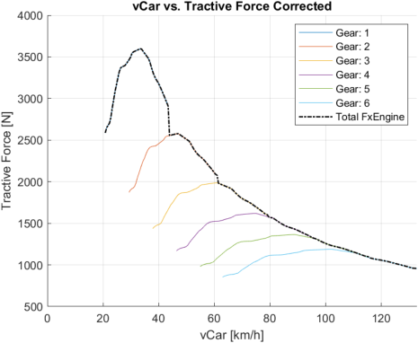

**Figure 2-19: Tractive Force vs Vehicle Speed (Total and for each Gear) – Corrected** 

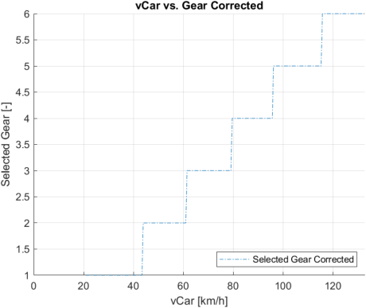

**Figure 2-20: Selected Gear vs Vehicle Speed – Corrected** 

July 2023 51 

<!-- page 52 -->

Master Thesis – Theo Zacharelis 

However, it is evident that the aforementioned graphs do not originate from a zero-vehicle speed, but rather exhibit a starting point corresponding to a minimum vehicle speed. This deviation arises from the engine curve commencing at a specific engine speed value (e.g., 4500 RPM in the provided data), thereby lacking data prior to that threshold. Typically, during engine dynamometer sessions, engineers commence data logging after the rear wheels have ceased slipping. In essence, any data preceding this point becomes inconsequential due to the tyres being limited by grip, rendering the engine tractive force ineffectual. This phenomenon is elucidated by the “Forces Model”, which indicates that the grip limitation prohibits the utilization of engine tractive force. Nevertheless, to address this issue within the “Powertrain Model” framework, a constant 𝐹𝑥𝐸𝑛𝑔𝑖𝑛𝑒 is assigned, equating to the 𝐹𝑥𝐸𝑛𝑔𝑖𝑛𝑒 value of the initial data point (i.e., 4500 RPM in this example). Consequently, the resultant final 𝐹𝑥𝐸𝑛𝑔𝑖𝑛𝑒 is illustrated below: 

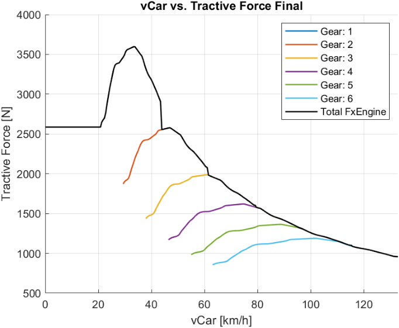

**Figure 2-21: Tractive Force vs Vehicle Speed (Total and for each Gear) – Final** 

July 2023 52 

<!-- page 53 -->

Master Thesis – Theo Zacharelis 

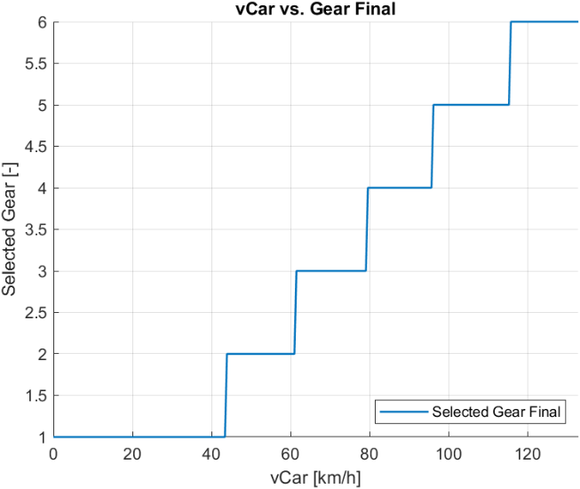

**Figure 2-22: Selected Gear vs Vehicle Speed – Final** 

### **2.7 Shifting Model** 

The shifting model is a key component in the analysis of gear shifting behaviour and its impact on vehicle performance. This section focuses on explaining the underlying logic and concepts of the shifting processor, along with certain assumptions made during the analysis. 

To simplify the analysis and focus on the core concepts, the following assumptions are made: 

- No Shift Delay: 

The analysis assumes that there is no delay in shifting gears. In other words, the gear transitions occur instantaneously without any time lag. 

- No Clutch Engagement Delay: 

The analysis assumes that there is no delay in clutch engagement during gear shifts. It assumes that the clutch engages smoothly and quickly, facilitating seamless gear changes. 

53 

July 2023 

<!-- page 54 -->

Master Thesis – Theo Zacharelis 

- No Throttle Lift Required: 

The analysis assumes that no throttle lift is needed during gear shifts. It implies that the throttle remains open and provides a constant power input during the gear transition process. 

Throughout the shifting model, various metrics are used to quantify and evaluate the gear shifting behaviour. Here are the key metrics employed: 

- Gear Changes: 

The code identifies gear changes by calculating the difference between consecutive gear values. A logical operation is then performed to find the data points right before and after each gear shift. 

- Engine Speed and 𝑣𝐶𝑎𝑟 : 

The shifting model extracts the engine speed and vehicle speed right before and after each gear shift. These parameters provide insights into the dynamic behaviour of the powertrain system during gear transitions. 

- Rev Drops: 

The rev drop represents the decrease in engine speed during a gear shift. It is calculated by subtracting the engine speed after the shift from the engine speed before the shift. 

A table is generated to present the gear shift information in a tabular format. It includes columns for 𝑣𝐶𝑎𝑟 before and after the shift, engine speed before and after the shift, and 𝑅𝑒𝑣𝐷𝑟𝑜𝑝 . 

**Table 2-7: Gear Matrix** 

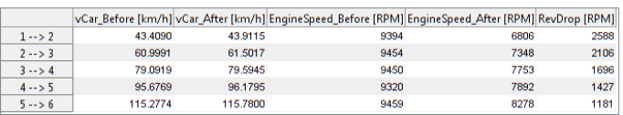

**[Equation/table image transcribed #13]** TABLE (gear shift points): | Shift | vCar_Before [km/h] | vCar_After [km/h] | EngineSpeed_Before [RPM] | EngineSpeed_After [RPM] | RevDrop [RPM] | / 1-->2: 43.4090, 43.9115, 9394, 6806, 2588 / 2-->3: 60.9991, 61.5017, 9454, 7348, 2106 / 3-->4: 79.0919, 79.5945, 9450, 7753, 1696 / 4-->5: 95.6769, 96.1795, 9320, 7892, 1427 / 5-->6: 115.2774, 115.7800, 9459, 8278, 1181

The following plot illustrates the relationship between vehicle speed ( 𝑣𝐶𝑎𝑟 ) and engine speed. It provides a comprehensive view of how gear shifts affect the distribution of data points on the graph. The plot includes markers representing the vehicle and engine speed before and after each gear shift, as well as a line indicating the occurrence of gear changes. 

54 

July 2023 

<!-- page 55 -->

Master Thesis – Theo Zacharelis 

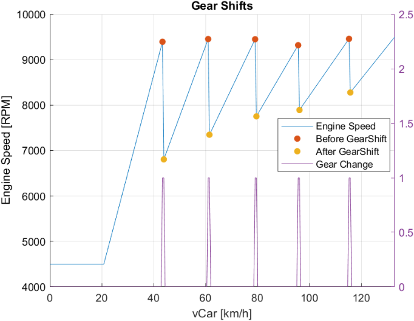

**Figure 2-23: Shifting Model – Gearshifts** 

By employing the shifting processor, the analysis gains valuable insights into gear shifting behaviour and its impact on the powertrain system. The assumptions made regarding shift delay, clutch engagement delay, and throttle lift provide a simplified framework for the analysis. The calculated metrics, such as engine speed, vehicle speed, and rev drops, contribute to a comprehensive understanding of the gear shifting process. The generated visualizations, including the gear shifts table and the 𝑣𝐶𝑎𝑟 𝑣𝑠. 𝐸𝑛𝑔𝑖𝑛𝑒 𝑆𝑝𝑒𝑒𝑑 plot, further aid in the interpretation and visualization of the data. 

### **2.8 Forces Model** 

In this section, an analysis of the forces governing the motion of a vehicle is presented. The equations and calculations presented focus on specific scenarios, isolating individual forces such as acceleration, braking, or cornering. This approach, known as the “Steady State Condition”, allows for a detailed examination of each force's influence on the vehicle's behaviour independently. 

55 

July 2023 

<!-- page 56 -->

Master Thesis – Theo Zacharelis 

##### <u>Further assumptions/notes:</u> 

- The vehicle model used assumes a flat road surface without banking or inclination, simplifying the analysis by disregarding additional weight vectors that would arise in situations like driving on a downhill slope. By focusing solely on forces acting along the horizontal plane, a clearer understanding of the vehicle's dynamics and accurate predictions of its performance can be achieved. 

- The model combines the mass point model, which treats the vehicle as a single point mass, with certain aspects of the bicycle model. In addition to weight distribution and aero balance, the model incorporates considerations such as potential weight transfer (longitudinal only) and tyre load sensitivity (refer to “2.4 Tyres Model”) to provide a comprehensive representation of the vehicle's dynamics. The model utilizes the measured steering angle, referred to as the driven channel, to address cornering behaviour without explicitly relying on steering and slip angles, in contrast to the traditional bicycle model. 

- The model also assumes that the braking performance is always limited by tyre capabilities, as engineers design the braking system based on tyre specifications to ensure the maximum potential of the tyres is utilized during braking. 

- Furthermore, constant aerodynamic parameters are assumed throughout the analysis, while variations in aerodynamic characteristics will be considered in a later section (refer to “AeroMap to Simulation”). 

- It is important to note that all forces are calculated along the vehicle speed vector, allowing for interpolation of forces based on the vehicle speed at any given point. In the simplified version of the model without weight transfer, the calculated forces can be interpolated for various speeds. However, when weight transfer effects are incorporated, a recalculation of forces becomes necessary, specifically addressing longitudinal weight transfer, which will be further explained in the “Weight Transfer Effect” subsection. 

In summary, the developed model combines elements from the mass point model and the bicycle model, incorporating additional considerations such as weight distribution, aero balance, potential weight transfer (longitudinal only), and tyre load sensitivity. The measured steering angle, along with the assumption of tyre-limited braking performance, constant aerodynamic parameters, and calculations along the vehicle speed vector, further contribute to the model's simplicity and accuracy and relevance in analysing the vehicle's behaviour. 

#### **2.8.1 Vertical** 

In this section calculation of various vertical forces acting on a vehicle in the Z-axis direction, which is oriented downward, takes place. These forces contribute to the overall dynamics of the vehicle and can be categorized into two main components: 

56 

July 2023 

<!-- page 57 -->

Master Thesis – Theo Zacharelis 

- mass-related forces 

- aerodynamic forces 

##### 2.8.1.1 <u>Mass-Related Forces</u> 

The mass-related forces account for the weight distribution and total mass of the vehicle. The “ 𝑀𝑎𝑠𝑠𝐹 ” represents the vertical force acting on the front of the vehicle, taking into consideration the front weight distribution ( 𝑉𝑒ℎ𝑖𝑐𝑙𝑒. 𝐺𝑒𝑛𝑒𝑟𝑎𝑙. 𝑊𝐷 ) and the weight transfer (WF), which will be further explained in “Weight Transfer Effect” section. The “ 𝑀𝑎𝑠𝑠𝑅 ” represents the vertical force acting on the rear of the vehicle, considering the rear weight distribution and the weight transfer. The “ 𝑀𝑎𝑠𝑠𝑇𝑜𝑡 ” represents the total vertical force due to the vehicle's mass. 

𝑀𝑜𝑑𝑒𝑙. 𝐹𝑜𝑟𝑐𝑒𝑠. 𝑍. 𝑀𝑎𝑠𝑠𝐹 

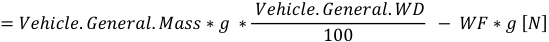

**[Equation/table image transcribed #14]** $$= Mass\cdot g\cdot\frac{WD}{100} - WF\cdot g\ [N]$$ (Vehicle.General.*; WF = wing/aero force term as defined in text; front axle static+aero load, see surrounding text)

**Equation 2-26: Vehicle’s Front Mass Calculation** 

𝑀𝑜𝑑𝑒𝑙. 𝐹𝑜𝑟𝑐𝑒𝑠. 𝑍. 𝑀𝑎𝑠𝑠𝑅 

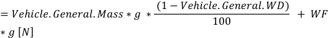

**[Equation/table image transcribed #15]** $$= Mass\cdot g\cdot\frac{(1-WD/100)}{1} + WF\cdot g\ [N]$$ precisely: $$= Mass\cdot g\cdot\frac{(1-WD)}{100}\ ...$$ see image; as rendered: Mass * g * (1 - WD)/100 + WF * g [N]  (NOTE: rendered literally "(1 − WD)/100" with WD in %, i.e. (100-WD)/100 intent)

**Equation 2-27: Vehicle’s Rear Mass Calculation** 

𝑀𝑜𝑑𝑒𝑙. 𝐹𝑜𝑟𝑐𝑒𝑠. 𝑍. 𝑀𝑎𝑠𝑠𝑇𝑜𝑡    = 𝑉𝑒ℎ𝑖𝑐𝑙𝑒. 𝐺𝑒𝑛𝑒𝑟𝑎𝑙. 𝑀𝑎𝑠𝑠∗𝑔   [𝑁] 

**Equation 2-28: Vehicle’s Total Mass Calculation** 

##### 2.8.1.2 <u>Aerodynamic Forces</u> 

The aerodynamic forces are associated with the vehicle's interaction with the surrounding air. The “ 𝐷𝑓_𝐹 ” represents the front downforce generated by the aerodynamic characteristics of the vehicle, which depends on the air density ( 𝑉𝑒ℎ𝑖𝑐𝑙𝑒. 𝐴𝑒𝑟𝑜. 𝑅ℎ𝑜 ), front aerodynamic coefficient ( 𝑉𝑒ℎ𝑖𝑐𝑙𝑒. 𝐴𝑒𝑟𝑜. 𝐶𝑧𝐹 ), vehicle frontal area ( 𝑉𝑒ℎ𝑖𝑐𝑙𝑒. 𝐴𝑒𝑟𝑜. 𝐴 ), and the square of the vehicle's velocity ( 𝑀𝑜𝑑𝑒𝑙. 𝐶𝑎𝑟. 𝑣𝐶𝑎𝑟 ). Similarly, the “ 𝐷𝑓_𝑅 ” represents the rear downforce, and “ 𝐷𝑓_𝑇𝑜 t” represents the total downforce generated by the vehicle's aerodynamics. 

𝑀𝑜𝑑𝑒𝑙. 𝐹𝑜𝑟𝑐𝑒𝑠. 𝑍. 𝐷𝑓_𝐹 

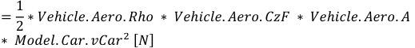

**[Equation/table image transcribed #16]** $$= \tfrac12\,\rho\,C_{zF}\,A\,vCar^2\ [N]$$ (Vehicle.Aero.Rho, CzF, A; Model.Car.vCar) front aero downforce

**Equation 2-29: Front Downforce Calculation** 

57 

July 2023 

<!-- page 58 -->

Master Thesis – Theo Zacharelis 

𝑀𝑜𝑑𝑒𝑙. 𝐹𝑜𝑟𝑐𝑒𝑠. 𝑍. 𝐷𝑓_𝑅 =1 ∗𝑉𝑒ℎ𝑖𝑐𝑙𝑒. 𝐴𝑒𝑟𝑜. 𝑅ℎ𝑜 ∗ 𝑉𝑒ℎ𝑖𝑐𝑙𝑒. 𝐴𝑒𝑟𝑜. 𝐶𝑧𝑅 ∗ 𝑉𝑒ℎ𝑖𝑐𝑙𝑒. 𝐴𝑒𝑟𝑜. 𝐴 2 ∗ 𝑀𝑜𝑑𝑒𝑙. 𝐶𝑎𝑟. 𝑣𝐶𝑎𝑟2 [𝑁] 

##### **Equation 2-30: Rear Downforce Calculation** 

𝑀𝑜𝑑𝑒𝑙. 𝐹𝑜𝑟𝑐𝑒𝑠. 𝑍. 𝐷𝑓_𝑇𝑜𝑡 

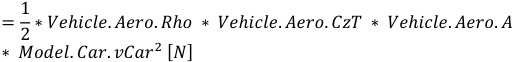

**[Equation/table image transcribed #17]** $$= \tfrac12\,\rho\,C_{zT}\,A\,vCar^2\ [N]$$ total aero downforce (CzT)

##### **Equation 2-31: Total Downforce Calculation** 

##### 2.8.1.3 <u>Total Vertical Forces</u> 

By summing the respective mass-related and aerodynamic forces, the code calculates the total vertical forces acting on the front and rear of the vehicle. The “ 𝑇𝑜𝑡𝐹 ” represents the total vertical force on the front, incorporating the mass-related force and front downforce, while “ 𝑇𝑜𝑡𝑅 ” represents the total vertical force on the rear, considering the mass-related force and rear downforce. The “ 𝑇𝑜𝑡𝑎𝑙 ” represents the overall total vertical force on the vehicle, combining the total mass-related force and total downforce. 

𝑀𝑜𝑑𝑒𝑙. 𝐹𝑜𝑟𝑐𝑒𝑠. 𝑍. 𝑇𝑜𝑡𝐹 = 𝑀𝑜𝑑𝑒𝑙. 𝐹𝑜𝑟𝑐𝑒𝑠. 𝑍. 𝑀𝑎𝑠𝑠𝐹 + 𝑀𝑜𝑑𝑒𝑙. 𝐹𝑜𝑟𝑐𝑒𝑠. 𝑍. 𝐷𝑓_𝐹 [𝑁] **Equation 2-32: Vehicle’s Total Front Vertical Load Calculation** 

𝑀𝑜𝑑𝑒𝑙. 𝐹𝑜𝑟𝑐𝑒𝑠. 𝑍. 𝑇𝑜𝑡𝑅 = 𝑀𝑜𝑑𝑒𝑙. 𝐹𝑜𝑟𝑐𝑒𝑠. 𝑍. 𝑀𝑎𝑠𝑠𝑅 + 𝑀𝑜𝑑𝑒𝑙. 𝐹𝑜𝑟𝑐𝑒𝑠. 𝑍. 𝐷𝑓_𝑅 [𝑁] **Equation 2-33: Vehicle’s Total Rear Vertical Load Calculation** 

𝑀𝑜𝑑𝑒𝑙. 𝐹𝑜𝑟𝑐𝑒𝑠. 𝑍. 𝑇𝑜𝑡𝑎𝑙= 𝑀𝑜𝑑𝑒𝑙. 𝐹𝑜𝑟𝑐𝑒𝑠. 𝑍. 𝑀𝑎𝑠𝑠𝑇𝑜𝑡+ 𝑀𝑜𝑑𝑒𝑙. 𝐹𝑜𝑟𝑐𝑒𝑠. 𝑍. 𝐷𝑓_𝑇𝑜𝑡 [𝑁] **Equation 2-34: Vehicle’s Total Vertical Load Calculation** 

In the simplified version, where the weight transfer ( 𝑊𝐹 ) is assumed to be zero, the code calculates the forces without accounting for weight transfer effects. However, in the weight transfer-enabled version, weight transfer is considered, and the forces are recalculated to incorporate the effects of weight transfer. This allows for a more accurate representation of the forces acting on the tyres and enables a comprehensive analysis of the vehicle's dynamics. 

The presented calculations align with the fundamental principles of vehicle dynamics, taking into account significant factors such as weight distribution, weight transfer, and aerodynamic balance. Once the vertical loads on the vehicle's tyres are determined through 

58 

July 2023 

<!-- page 59 -->

Master Thesis – Theo Zacharelis 

the calculation of mass-related and aerodynamic forces, it becomes possible to utilize the tyres model to calculate the respective tyres coefficients/parameters as explained in the “2.4 Tyres Model” section. 

#### **2.8.2 Longitudinal** 

In the presented section, several forces influencing the vehicle's forward motion along the X-axis are considered based on principles of vehicle dynamics. These forces include drag, rolling resistance, and tyre acceleration and deceleration. 

##### 2.8.2.1 <u>Drag Force</u> 

The drag force, determined by the vehicle's aerodynamic characteristics, opposes the vehicle's motion and is proportional to the square of the vehicle's velocity. It represents the resistance encountered by the vehicle as it moves through the air. 

𝑀𝑜𝑑𝑒𝑙. 𝐹𝑜𝑟𝑐𝑒𝑠. 𝑋. 𝐷𝑟𝑎𝑔 

=1 ∗𝑉𝑒ℎ𝑖𝑐𝑙𝑒. 𝐴𝑒𝑟𝑜. 𝑅ℎ𝑜 ∗ 𝑉𝑒ℎ𝑖𝑐𝑙𝑒. 𝐴𝑒𝑟𝑜. 𝐶𝑥 ∗ 𝑉𝑒ℎ𝑖𝑐𝑙𝑒. 𝐴𝑒𝑟𝑜. 𝐴 2 

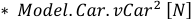

**[Equation/table image transcribed #18]** $$\cdot Model.Car.vCar^2\ [N]$$ (fragment: tail of an equation)

##### **Equation 2-35: Drag Calculation** 

##### 2.8.2.2 <u>Rolling Resistance</u> 

Rolling resistance, on the other hand, arises from the interaction between the tyres and the road surface. It is influenced by factors such as tyre construction, tyre pressure, and road conditions. The rolling resistance force acts in the opposite direction to the vehicle's motion and is directly proportional to the total vertical load on the tyres. 

𝑀𝑜𝑑𝑒𝑙. 𝐹𝑜𝑟𝑐𝑒𝑠. 𝑋. 𝑅𝑜𝑙𝑙𝑅𝑒𝑠 = 𝑉𝑒ℎ𝑖𝑐𝑙𝑒. 𝑇𝑦𝑟𝑒𝑠. 𝐶𝑟∗𝑀𝑜𝑑𝑒𝑙. 𝐹𝑜𝑟𝑐𝑒𝑠. 𝑍. 𝑇𝑜𝑡𝑎𝑙   [𝑁] 

##### **Equation 2-36: Rolling Resistance Calculation** 

##### 2.8.2.3 <u>Tyres Forces</u> 

##### <u>Acceleration:</u> 

The potential acceleration forces generated by the tyres depend on the drive configuration of the vehicle. In rear-wheel drive (RWD) vehicles, only the rear tyres contribute to the acceleration force, while in front-wheel drive (FWD) vehicles, only the front tyres contribute. In all-wheel drive (AWD) vehicles, both the front and rear tyres contribute to the acceleration force. The acceleration force is determined by the product of the tyre-road friction coefficient and the total vertical load on the respective tyres. 

{𝑀𝑜𝑑𝑒𝑙. 𝐹𝑜𝑟𝑐𝑒𝑠. 𝑋. 𝑇𝑦𝑟𝑒𝑠_𝐴𝑐𝑐_𝑅 = 𝑀𝑜𝑑𝑒𝑙. 𝑇𝑦𝑟𝑒𝑠. 𝑀𝑢𝑋_𝑅 ∗ 𝑀𝑜𝑑𝑒𝑙. 𝐹𝑜𝑟𝑐𝑒𝑠. 𝑍. 𝑇𝑜𝑡𝑅 [𝑁]𝑀𝑜𝑑𝑒𝑙. 𝐹𝑜𝑟𝑐𝑒𝑠. 𝑋. 𝑇𝑦𝑟𝑒𝑠_𝐴𝑐𝑐_𝐹 = 0 [𝑁] **Equation 2-37: RWD – Tyres Acceleration Forces Calculation** {𝑀𝑜𝑑𝑒𝑙. 𝐹𝑜𝑟𝑐𝑒𝑠. 𝑋. 𝑇𝑦𝑟𝑒𝑠_𝐴𝑐𝑐_𝐹 = 𝑀𝑜𝑑𝑒𝑙. 𝑇𝑦𝑟𝑒𝑠. 𝑀𝑢𝑋_𝐹 ∗ 𝑀𝑜𝑑𝑒𝑙. 𝐹𝑜𝑟𝑐𝑒𝑠. 𝑍. 𝑇𝑜𝑡𝐹 [𝑁] 𝑀𝑜𝑑𝑒𝑙. 𝐹𝑜𝑟𝑐𝑒𝑠. 𝑋. 𝑇𝑦𝑟𝑒𝑠_𝐴𝑐𝑐_𝑅 = 0 [𝑁] 

**Equation 2-38: FWD – Tyres Acceleration Forces Calculation** 

59 

July 2023 

<!-- page 60 -->

Master Thesis – Theo Zacharelis 

{𝑀𝑜𝑑𝑒𝑙. 𝐹𝑜𝑟𝑐𝑒𝑠. 𝑋. 𝑇𝑦𝑟𝑒𝑠_𝐴𝑐𝑐_𝑅 = 𝑀𝑜𝑑𝑒𝑙. 𝑇𝑦𝑟𝑒𝑠. 𝑀𝑢𝑋_𝑅 ∗ 𝑀𝑜𝑑𝑒𝑙. 𝐹𝑜𝑟𝑐𝑒𝑠. 𝑍. 𝑇𝑜𝑡𝑅 [𝑁]𝑀𝑜𝑑𝑒𝑙. 𝐹𝑜𝑟𝑐𝑒𝑠. 𝑋. 𝑇𝑦𝑟𝑒𝑠_𝐴𝑐𝑐_𝐹 = 𝑀𝑜𝑑𝑒𝑙. 𝑇𝑦𝑟𝑒𝑠. 𝑀𝑢𝑋_𝐹 ∗ 𝑀𝑜𝑑𝑒𝑙. 𝐹𝑜𝑟𝑐𝑒𝑠. 𝑍. 𝑇𝑜𝑡𝐹 [𝑁] **Equation 2-39: AWD – Tyres Acceleration Forces Calculation** 

In all cases, the total tyres accelerating force is given by the following Equation: 

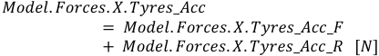

**[Equation/table image transcribed #19]** $$Tyres\_Acc = Tyres\_Acc\_F + Tyres\_Acc\_R\ [N]$$ (Model.Forces.X.*)

##### **Equation 2-40: Total Tyres Acceleration Forces** 

##### <u>Deceleration:</u> 

Similarly, during deceleration, the tyres exert a deceleration force that acts in the opposite direction to the vehicle's motion, contributing to the vehicle's ability to slow down. It is important to note that in the model, the braking system is assumed to be implemented in all four wheels, allowing for braking forces to be generated at each tyre. This assumption reflects the common configuration in vehicles and enables a comprehensive analysis of the deceleration capabilities of the vehicle. 

𝑀𝑜𝑑𝑒𝑙. 𝐹𝑜𝑟𝑐𝑒𝑠. 𝑋. 𝑇𝑦𝑟𝑒𝑠_𝐷𝑒𝑐𝑐_𝐹= 𝑀𝑜𝑑𝑒𝑙. 𝑇𝑦𝑟𝑒𝑠. 𝑀𝑢𝑋_𝐹∗𝑀𝑜𝑑𝑒𝑙. 𝐹𝑜𝑟𝑐𝑒𝑠. 𝑍. 𝑇𝑜𝑡𝐹 [𝑁] **Equation 2-41: Front Tyres Deceleration Calculation** 

𝑀𝑜𝑑𝑒𝑙. 𝐹𝑜𝑟𝑐𝑒𝑠. 𝑋. 𝑇𝑦𝑟𝑒𝑠_𝐷𝑒𝑐𝑐_𝑅= 𝑀𝑜𝑑𝑒𝑙. 𝑇𝑦𝑟𝑒𝑠. 𝑀𝑢𝑋_𝑅∗𝑀𝑜𝑑𝑒𝑙. 𝐹𝑜𝑟𝑐𝑒𝑠. 𝑍. 𝑇𝑜𝑡𝑅 [𝑁] **Equation 2-42: Rear Tyres Deceleration Calculation** 

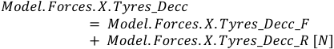

**[Equation/table image transcribed #20]** $$Tyres\_Decc = Tyres\_Decc\_F + Tyres\_Decc\_R\ [N]$$ (Model.Forces.X.*)

##### **Equation 2-43:  Total Tyres Deceleration Forces** 

By combining the previously calculated forces, including the engine tractive force from the previous Chapter, we can create a graphical representation that illustrates the longitudinal dynamics of the vehicle. This graphical representation allows us to visually observe the variations and relationships between different forces as the vehicle's speed changes. It provides a clear visualization of the balance between propulsive forces, such as the engine force, and resistive forces, such as aerodynamic drag and rolling resistance, giving us a better understanding of the overall longitudinal behaviour of the vehicle. 

60 

July 2023 

<!-- page 61 -->

Master Thesis – Theo Zacharelis 

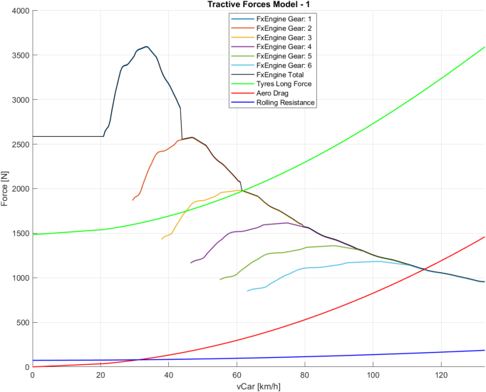

**Figure 2-24: Vehicle's Tractive Forces – Longitudinal Dynamics Detailed** 

Furthermore, additional calculations and corrections are made for the X-axis forces. These calculations involve finding intersection points between different forces to determine the resultant forces acting on the vehicle. 

Firstly, the total accelerating force ( 𝑀𝑜𝑑𝑒𝑙. 𝐹𝑜𝑟𝑐𝑒𝑠. 𝑋. 𝑇𝑜𝑡𝑎𝑙_𝐴𝑐𝑐 ) is determined by taking the minimum value between the engine force ( 𝑀𝑜𝑑𝑒𝑙. 𝐶𝑎𝑟. 𝐹𝑥𝐸𝑛𝑔𝑖𝑛𝑒 ) and the tyres' acceleration force ( 𝑀𝑜𝑑𝑒𝑙. 𝐹𝑜𝑟𝑐𝑒𝑠. 𝑋. 𝑇𝑦𝑟𝑒𝑠_𝐴𝑐𝑐 ). This ensures that the vehicle's acceleration is limited by the available engine power and the tyre grip. 

𝑀𝑜𝑑𝑒𝑙. 𝐹𝑜𝑟𝑐𝑒𝑠. 𝑋. 𝑇𝑜𝑡𝑎𝑙_𝐴𝑐𝑐 

= 𝑚𝑖𝑛(𝑀𝑜𝑑𝑒𝑙. 𝐶𝑎𝑟. 𝐹𝑥𝐸𝑛𝑔𝑖𝑛𝑒, 𝑀𝑜𝑑𝑒𝑙. 𝐹𝑜𝑟𝑐𝑒𝑠. 𝑋. 𝑇𝑦𝑟𝑒𝑠_𝐴𝑐𝑐) [𝑁] 

##### **Equation 2-44: Final Positive Longitudinal Forces** 

On the other hand, the total decelerating force ( 𝑀𝑜𝑑𝑒𝑙. 𝐹𝑜𝑟𝑐𝑒𝑠. 𝑋. 𝑇𝑜𝑡𝑎𝑙_𝐷𝑒𝑐𝑐 ) is calculated by summing the drag force ( 𝑀𝑜𝑑𝑒𝑙. 𝐹𝑜𝑟𝑐𝑒𝑠. 𝑋. 𝐷𝑟𝑎𝑔 ) and the rolling resistance 

61 

July 2023 

<!-- page 62 -->

Master Thesis – Theo Zacharelis 

force ( 𝑀𝑜𝑑𝑒𝑙. 𝐹𝑜𝑟𝑐𝑒𝑠. 𝑋. 𝑅𝑜𝑙𝑙𝑅𝑒𝑠 ). These forces act in the opposite direction to the vehicle's motion, contributing to the deceleration or braking performance. 

𝑀𝑜𝑑𝑒𝑙. 𝐹𝑜𝑟𝑐𝑒𝑠. 𝑋. 𝑇𝑜𝑡𝑎𝑙_𝐷𝑒𝑐𝑐 

= 𝑀𝑜𝑑𝑒𝑙. 𝐹𝑜𝑟𝑐𝑒𝑠. 𝑋. 𝐷𝑟𝑎𝑔 + 𝑀𝑜𝑑𝑒𝑙. 𝐹𝑜𝑟𝑐𝑒𝑠. 𝑋. 𝑅𝑜𝑙𝑙𝑅𝑒𝑠 [𝑁] **Equation 2-45: Final Negative Longitudinal Forces** 

To further analyse the intersection points between these forces, interpolation techniques are utilized. The “Tyres/Engine Intersection” point is determined by finding the point where the engine force and the tyres' acceleration force intersect. This point represents the balance between engine power and tyre grip and the transition from Grip Limited to Power Limited. An intriguing observation can be made regarding the redundancy of the 1st gear in this context. It becomes apparent that the output torque (or force) generated by the 1st gear remains underutilized, as the tyres are incapable of fully harnessing it, resulting in excessive wheel slip. In practical scenarios, a driver could initiate the acceleration from the 2nd gear without compromising the acceleration performance, and potentially even achieve improved results due to the reduced risk of slip. 

Similarly, the “FxAccelerating/Deccelerating Intersection” point is found by identifying the point where the total accelerating force and the absolute value of the total decelerating force intersect. This point signifies the maximum speed at which the vehicle can maintain a state of equilibrium between acceleration and deceleration forces, taking into account the drag force. 

By analysing these intersection points, the model can assess the performance limits of the vehicle, determine the maximum achievable speed, and provide insights into the balance between engine power, tyre grip, and resisting forces. These calculations contribute to a comprehensive understanding of the vehicle's longitudinal dynamics. 

All the above are detailly illustrated in the following graphs: 

62 

July 2023 

<!-- page 63 -->

Master Thesis – Theo Zacharelis 

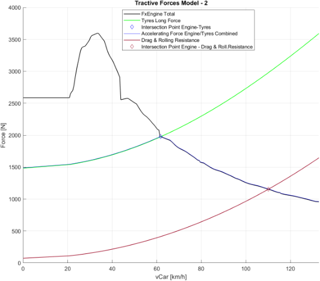

**Figure 2-25: Vehicle's Tractive Forces – Longitudinal Dynamics Simplified** 

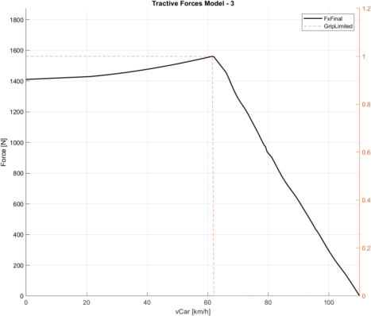

**Figure 2-26: Vehicle's Tractive Forces – Longitudinal Dynamics Final** 

July 2023 63 

<!-- page 64 -->

Master Thesis – Theo Zacharelis 

#### **2.8.3 Lateral** 

This section calculates the lateral forces exerted by the tyres on the vehicle. The lateral force generated by the front tyres is determined by the front tyre's lateral friction coefficient ( 𝑀𝑢𝑌_𝐹 ) and the total vertical force acting on the front tyres ( 𝑀𝑜𝑑𝑒𝑙. 𝐹𝑜𝑟𝑐𝑒𝑠. 𝑍. 𝑇𝑜𝑡𝐹 ). Similarly, the lateral force generated by the rear tyres is calculated using the rear tyre's lateral friction coefficient ( 𝑀𝑢𝑌_𝑅 ) and the total vertical force acting on the rear tyres ( 𝑀𝑜𝑑𝑒𝑙. 𝐹𝑜𝑟𝑐𝑒𝑠. 𝑍. 𝑇𝑜𝑡𝑅 ). The total lateral force is obtained by summing the forces generated by the front and rear tyres. 

𝑀𝑜𝑑𝑒𝑙. 𝐹𝑜𝑟𝑐𝑒𝑠. 𝑌. 𝑇𝑦𝑟𝑒𝑠𝐹   = 𝑀𝑜𝑑𝑒𝑙. 𝑇𝑦𝑟𝑒𝑠. 𝑀𝑢𝑌_𝐹.∗𝑀𝑜𝑑𝑒𝑙. 𝐹𝑜𝑟𝑐𝑒𝑠. 𝑍. 𝑇𝑜𝑡𝐹[𝑁] 

##### **Equation 2-46: Front Tyres Lateral Forces Calculation** 

𝑀𝑜𝑑𝑒𝑙. 𝐹𝑜𝑟𝑐𝑒𝑠. 𝑌. 𝑇𝑦𝑟𝑒𝑠𝑅   = 𝑀𝑜𝑑𝑒𝑙. 𝑇𝑦𝑟𝑒𝑠. 𝑀𝑢𝑌_𝑅.∗𝑀𝑜𝑑𝑒𝑙. 𝐹𝑜𝑟𝑐𝑒𝑠. 𝑍. 𝑇𝑜𝑡𝑅[𝑁] **Equation 2-47: Rear Tyres Lateral Forces Calculation** 

𝑀𝑜𝑑𝑒𝑙. 𝐹𝑜𝑟𝑐𝑒𝑠. 𝑌. 𝑇𝑦𝑟𝑒𝑠𝑇𝑜𝑡 

= 𝑀𝑜𝑑𝑒𝑙. 𝐹𝑜𝑟𝑐𝑒𝑠. 𝑌. 𝑇𝑦𝑟𝑒𝑠𝐹 + 𝑀𝑜𝑑𝑒𝑙. 𝐹𝑜𝑟𝑐𝑒𝑠. 𝑌. 𝑇𝑦𝑟𝑒𝑠𝑅[𝑁] 

##### **Equation 2-48: Total Tyres Lateral Forces Calculation** 

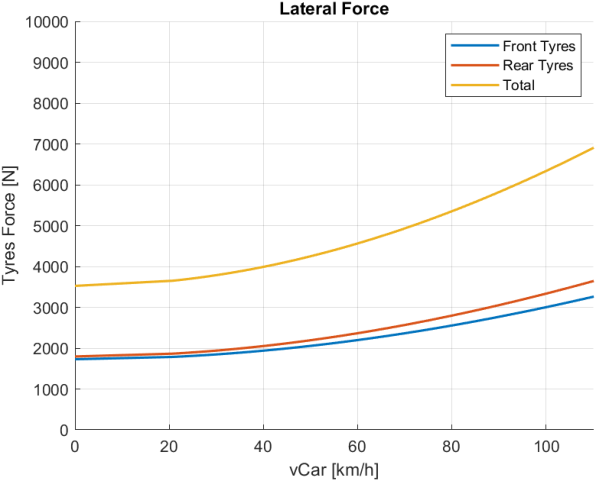

**Figure 2-27: Vehicle's Lateral Forces – Lateral Dynamics** 

July 2023 64 

<!-- page 65 -->

Master Thesis – Theo Zacharelis 

#### **2.8.4 Weight Transfer Effect** 

##### 2.8.4.1 <u>Introduction</u> 

In the current “Forces Model”, which combines elements of both a mass point and a bicycle model, the consideration of lateral weight transfer is not explicitly included. This limitation arises from the hybrid nature of the model, which requires a more comprehensive car model to accurately account for the influence of lateral weight transfer on vehicle dynamics. 

Lateral weight transfer refers to the redistribution of the vehicle's weight during dynamic manoeuvres, such as cornering, acceleration, or braking. As the vehicle undergoes these manoeuvres, the weight shifts from one side of the vehicle to the other, impacting the distribution of forces among the tyres. This redistribution of weight has a significant influence on the tyre's grip and ultimately affects the vehicle's stability and handling characteristics. 

Although lateral weight transfer is not accounted for in the current “Forces Model”, subsequent sections, such as the Yaw Moment Diagrams, incorporate this aspect, providing a more detailed analysis of the vehicle's lateral dynamics. These subsequent sections take into consideration the effects of lateral weight transfer and provide a comprehensive examination of its influence on various aspects of vehicle performance. 

In contrast, the “Forces Model”, offers the option to enable longitudinal weight transfer, which focuses on the redistribution of weight between the front and rear axles during acceleration or deceleration. By considering longitudinal weight transfer, the model provides insights into the resultant changes in vertical loads on the tyres of each axle, thus influencing the tyre's potential for generating longitudinal forces. This feature allows for an examination of how the vehicle's weight distribution affects its traction, acceleration, and braking capabilities. 

It is important to note that while the “Forces Model”  does not currently incorporate lateral weight transfer, it serves as a valuable tool for analysing longitudinal weight transfer and its impact on vertical loads and tyre performance in the longitudinal direction. 

##### 2.8.4.2 <u>Definition</u> 

When a car is accelerating or braking, a reaction force is generated similar to the centrifugal force generated when cornering.  This reaction force is “ 𝑚𝐴𝑥 ”. The longitudinal acceleration is in g force again similar to the lateral load transfer. The g force value is “ 𝐴𝑥 ”. 

- If the longitudinal acceleration is due to acceleration, then it is a positive value. 

- If it is caused by braking, then the acceleration should be assigned a negative sign. 

65 

July 2023 

<!-- page 66 -->

Master Thesis – Theo Zacharelis 

The image below displays a car accelerating that will be referred to for the initial Equation to calculate the load transfer front to rear. It assumes that the centre of gravity position is on the centre line of the track width. 

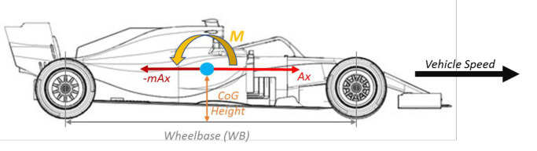

*[FIG: car side view: M (pitch moment), -mAx, Ax, CoG height, wheelbase WB]*

**Figure 2-28: Vehicle Accelerating Diagram** 

Taking moments about the front wheel, the following Equation can be generated: 

𝑊𝐹 ∗ 𝑉𝑒ℎ𝑖𝑐𝑙𝑒. 𝐺𝑒𝑛𝑒𝑟𝑎𝑙. 𝑊𝐵= 𝑉𝑒ℎ𝑖𝑐𝑙𝑒. 𝐺𝑒𝑛𝑒𝑟𝑎𝑙. 𝐶𝑜𝐺 ∗ 𝑉𝑒ℎ𝑖𝑐𝑙𝑒. 𝐺𝑒𝑛𝑒𝑟𝑎𝑙. 𝑀𝑎𝑠𝑠∗ 𝐴𝑥 => 𝑊𝐹 =𝑉𝑒ℎ𝑖𝑐𝑙𝑒. 𝐺𝑒𝑛𝑒𝑟𝑎𝑙. 𝐶𝑜𝐺 ∗ 𝑉𝑒ℎ𝑖𝑐𝑙𝑒. 𝐺𝑒𝑛𝑒𝑟𝑎𝑙. 𝑀𝑎𝑠𝑠∗ 𝐴𝑥[𝑁] 𝑉𝑒ℎ𝑖𝑐𝑙𝑒. 𝐺𝑒𝑛𝑒𝑟𝑎𝑙. 𝑊𝐵 **Equation 2-49: Weight Transfer Calculation** 

##### 2.8.4.3 <u>Implementation in Forces Model</u> 

The calculation of weight transfer in a vehicle involves fundamental parameters such as the centre of gravity ( 𝐶𝑜𝐺 ), wheelbase, mass, and the longitudinal acceleration of the vehicle. With these inputs, the determination of the resulting weight transfer becomes relatively straightforward. This information can then be utilized in the Equations 2-26 and 2-27 presented in the “Mass Related Vertical Loads” section to calculate the vertical loads on the tyres. 

Consequently, the longitudinal forces experienced by the tyres will vary between acceleration and deceleration scenarios, as indicated in the “2.8.2.3 Longitudinal Tyres Forces” section. The impact of weight transfer is particularly pronounced in acceleration for vehicles with a single drive axle (either front-wheel drive or rear-wheel drive), whereas it may be less evident for all-wheel drive vehicles or during deceleration. In the latter case, the sensitivity of tyre loads becomes more noticeable, whereas in the former case, the vertical load on the axle generating the longitudinal force undergoes significant changes, consequently affecting the magnitude of the longitudinal force. It is worth noting that the resulting longitudinal force is equal to the product of the tyre's friction coefficient and the vertical load. 

The “Forces” Model incorporates the consideration of weight transfer to provide a more accurate representation of the vehicle's dynamics. This integration occurs through specific 

66 

July 2023 

<!-- page 67 -->

Master Thesis – Theo Zacharelis 

sections where weight transfer is enabled, as outlined in Chapter “3. Simulation Specific Scenarios” and specifically in sections “3.2.2 Acceleration Weight Transfer Effect” and “3.3.2 Braking Weight Transfer Effect”. 

To incorporate weight transfer, an initial step involves calculating the weight transfer based on the vehicle's parameters and longitudinal acceleration. This computation determines the redistribution of load among the tyres. Subsequently, the tyre model is invoked after the calculation of vertical loads and before the calculation of longitudinal loads. This arrangement allows for the correction of tyre friction coefficients, accounting for the tyres' load sensitivity characteristic. 

By incorporating the weight transfer and updating the tyre forces accordingly, both the vertical and longitudinal forces are accurately represented within the model. However, it is important to note that these forces are specific to the given acceleration scenario. As a result, this iterative process occurs at each time step by updating the longitudinal acceleration (during acceleration and braking scenarios) and subsequently accounting for the associated weight transfer. 

### **2.9 Steering,  Braking  and Throttle Model** 

The additional models presented here serve as complementary tools that enhance the understanding of the vehicle's dynamics and aid in validation. Thanks to these modes, it is possible to calculate channels that are often referred to as “driven” channels, meaning they do not directly influence the simulation but rather respond to the simulation outputs. Specifically, the steering, braking and throttle models are developed to provide additional measurement channels that capture relevant data for analysing the vehicle's resultant dynamics. 

By incorporating these supplementary models, engineers can gather additional data and measurements that contribute to a comprehensive analysis of the vehicle's dynamics. These models serve as valuable tools for validation, performance evaluation, and further insights into the steering wheel angle, brake pressure and throttle position. 

#### **2.9.1 Steering** 

As it is already mentioned, the main model concept is a hybrid combining mass point and bicycle car model. 

The bicycle car model, also known as the single-track model, is a simplified representation of a vehicle that captures its fundamental dynamics during motion. This model is widely used in vehicle dynamics analysis and control systems design. 

In the bicycle car model, the vehicle is simplified to two main components: the chassis and the combined front and rear wheel assembly. Hence, the Ackermann Geometry, accounting for different steering angles of the inner and outer wheels, is not taken into consideration. The chassis is represented as a single point located at the vehicle's centre of gravity ( 𝐶𝑜𝐺 ), which is the balance point of the vehicle's mass distribution. 

67 

July 2023 

<!-- page 68 -->

Master Thesis – Theo Zacharelis 

The front and rear wheels are combined into a single wheel assembly located at the vehicle's 𝐶𝑜𝐺 . This assumption is made to simplify the lateral dynamics of the vehicle and capture its steering behaviour. The combined wheel assembly is responsible for both longitudinal and lateral forces. 

The model assumes that the vehicle's motion occurs in a single plane, neglecting any vertical movement or roll dynamics. This simplification is suitable for studying the vehicle's lateral and longitudinal dynamics in a two-dimensional space. 

The bicycle car model incorporates several key parameters to describe the vehicle's behaviour. These include the wheelbase, which is the distance between the front and rear axles, the steering angle, which determines the direction of the front wheels, and the vehicle's mass and inertia properties. 

In contrast to the traditional bicycle car model, the approach used in this master thesis differs in terms of how the vehicle's motion is controlled. Instead of directly prescribing the steering wheel angle to dictate the vehicle's behaviour, the steering wheel angle is back calculated based on the observed lateral acceleration. 

This alternative approach capitalizes on the underlying principles of Tyres Lateral Force definition, Newton's Second Law, and the assumption of neutral steering, where the sum of moments in the vehicle is zero to achieve optimal balance between front and rear grip, as shown below: 

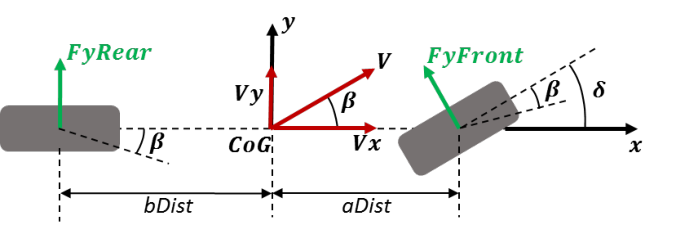

*[FIG: bicycle model: FyRear, FyFront, V, Vx, Vy, beta (body slip), delta (steer), aDist, bDist]*

**Figure 2-29: Bicycle Model** 

- 𝛽 (𝑏𝑒𝑡𝑎) → Chassis Side Slip Angle (deg) 

- 𝛿 (𝑑𝑒𝑙𝑡𝑎) → Steer Angle (deg) 

Starting from Newton’s Second Law: 

𝐹𝑦𝑇𝑜𝑡𝑎𝑙   = 𝑀 ∗𝐴𝑦 ⇒ 

68 

July 2023 

<!-- page 69 -->

Master Thesis – Theo Zacharelis 

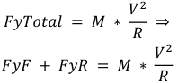

**[Equation/table image transcribed #23]** $$F_{yTotal}=M\frac{V^2}{R}\Rightarrow F_{yF}+F_{yR}=M\frac{V^2}{R}$$

By utilizing Tyre Lateral Force Definition, the above Equation is re-organized as: 

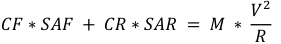

**[Equation/table image transcribed #24]** $$C_F\,SA_F + C_R\,SA_R = M\frac{V^2}{R}$$

##### **Equation 2-50: Steering Model – Equation 1** 

Where: 

𝐶𝐹 and 𝐶𝑅 : Cornering Stiffness Front and Rear respectively, in N/deg 

𝑆𝐴𝐹 and 𝑆𝐴𝑅 : Slip Angle Front and Rear respectively, in deg 

Furthermore, it is assumed that the sum of moments around Z-Axis equals zero, and therefore the vehicle is perfectly balanced (neither oversteer, nor understeer): 

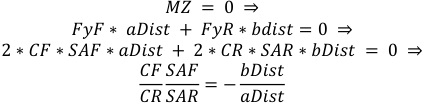

**[Equation/table image transcribed #25]** $$M_Z=0\Rightarrow F_{yF}\,aDist+F_{yR}\,bdist=0\Rightarrow 2C_F SA_F\,aDist+2C_R SA_R\,bDist=0\Rightarrow \frac{C_F}{C_R}\frac{SA_F}{SA_R}=-\frac{bDist}{aDist}$$

##### **Equation 2-51: Steering Model – Equation 2** 

Furthermore, based on the above diagram, it is evident that: 

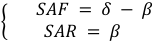

**[Equation/table image transcribed #26]** $$SA_F=\delta-\beta,\quad SA_R=\beta$$ (note: SAR=beta as printed; sign conv. bdist negative)

##### **Equation 2-52: Steering Model – Equation 3** 

By consolidating the aforementioned principles and equations, it becomes feasible to reorganize the relevant variables and equations in a matrix format. This matrix serves as a valuable tool for calculating the steer angle and beta angle, which are essential in determining the vehicle's behaviour based on its lateral acceleration or alternatively, its speed and turning radius. 

**[Equation/table image transcribed #27]** $$\begin{bmatrix} C_F & C_R-C_F\\ adist\,C_F & bdist\,C_R-adist\,C_F\end{bmatrix}\begin{bmatrix}\delta\\\beta\end{bmatrix}=\begin{bmatrix}M V^2/R\\0\end{bmatrix}$$

##### **Equation 2-53: Steering Matrix** 

Utilizing this matrix format, the calculation process becomes more systematic and efficient, allowing for the derivation of the steer angle and beta angle using the appropriate formulas. These angles play a pivotal role in determining the vehicle's trajectory and stability during 

69 

July 2023 

<!-- page 70 -->

Master Thesis – Theo Zacharelis 

lateral manoeuvres. The matrix-based approach facilitates a comprehensive understanding of the relationship between the vehicle's lateral acceleration, speed, turning radius, steer angle, and beta angle. 

It is important to clarify that the aforementioned angle, referred to as the steer angle, represents the orientation of the front wheels of the vehicle rather than the actual steering wheel angle. The steer angle, disregarding the Ackermann effect, provides a measure of the angle at which the front wheels are turned relative to the vehicle's longitudinal axis. 

To obtain the desired steering wheel angle, which holds practical significance for validation and comparison with real-world scenarios, it is necessary to compute the corresponding value based on the steer angle. This adjustment is particularly relevant because steering sensors in actual vehicles are typically positioned on the steering wheel itself. 

𝑆𝑡𝑒𝑒𝑟𝑖𝑛𝑔 𝑊ℎ𝑒𝑒𝑙 𝐴𝑛𝑔𝑙𝑒  = 𝑉𝑒ℎ𝑖𝑐𝑙𝑒. 𝐺𝑒𝑛𝑒𝑟𝑎𝑙. 𝑆𝑡𝑒𝑒𝑟𝑅𝑎𝑡𝑖𝑜 ∗ 𝛿 [𝑑𝑒𝑔] 

##### **Equation 2-54: Steering Wheel Angle Calculation based on Steering Ratio** 

#### **2.9.2 Braking** 

##### 2.9.2.1 <u>Braking Parameters</u> 

The following table provides a concise overview of various parameters related to the vehicle's braking system. These parameters include brake bias, disc diameters for the front and rear brakes, pad heights for both front and rear brakes, pad friction coefficients, the number of calliper pistons for the front and rear brakes, and the diameters of the calliper pistons for both front and rear brakes. These values play a crucial role in understanding and analysing the braking performance and characteristics of the vehicle. 

**Table 2-8: Vehicle's Braking Parameters** 

|**Parameter Name**|**Value**|**Description**|**Units**|
|---|---|---|---|
|𝑉𝑒ℎ𝑖𝑐𝑙𝑒. 𝐵𝑟𝑎𝑘𝑒𝑠. 𝐵𝑖𝑎𝑠|60|Brake Bias - Front|%|
|𝑉𝑒ℎ𝑖𝑐𝑙𝑒. 𝐵𝑟𝑎𝑘𝑒𝑠. 𝐷𝑖𝑠𝑐𝑓_𝑑|0.185|Disc Diameter – Front|m|
|𝑉𝑒ℎ𝑖𝑐𝑙𝑒. 𝐵𝑟𝑎𝑘𝑒𝑠. 𝐷𝑖𝑠𝑐𝑟_𝑑|0.174|Disc Diameter – Rear|m|
|𝑉𝑒ℎ𝑖𝑐𝑙𝑒. 𝐵𝑟𝑎𝑘𝑒𝑠. 𝑃𝑎𝑑𝑓_ℎ|0.04|Pad Height – Front|m|
|𝑉𝑒ℎ𝑖𝑐𝑙𝑒. 𝐵𝑟𝑎𝑘𝑒𝑠. 𝑃𝑎𝑑𝑟_ℎ|0.04|Pad Height – Rear|m|
|𝑉𝑒ℎ𝑖𝑐𝑙𝑒. 𝐵𝑟𝑎𝑘𝑒𝑠. 𝑃𝑎𝑑𝑓_𝑚𝑢|0.45|Pad Friction Coefficient – Front|-|
|𝑉𝑒ℎ𝑖𝑐𝑙𝑒. 𝐵𝑟𝑎𝑘𝑒𝑠. 𝑃𝑎𝑑𝑟_𝑚𝑢|0.45|Pad Friction Coefficient – Rear|-|
|𝑉𝑒ℎ𝑖𝑐𝑙𝑒. 𝐵𝑟𝑎𝑘𝑒𝑠. 𝑁𝑝𝑖𝑠𝑡𝑜𝑛𝑠𝑓|4|Number of Calliper Pistons – Front|-|
|𝑉𝑒ℎ𝑖𝑐𝑙𝑒. 𝐵𝑟𝑎𝑘𝑒𝑠. 𝑁𝑝𝑖𝑠𝑡𝑜𝑛𝑠𝑟|2|Number of Calliper Pistons – Rear|-|

July 2023 70 

<!-- page 71 -->

Master Thesis – Theo Zacharelis 

|𝑉𝑒ℎ𝑖𝑐𝑙𝑒. 𝐵𝑟𝑎𝑘𝑒𝑠. 𝑃𝑖𝑠𝑡𝑜𝑛𝑓_𝑑|0.025|Calliper Piston Diameter – Front|m|
|---|---|---|---|
|𝑉𝑒ℎ𝑖𝑐𝑙𝑒. 𝐵𝑟𝑎𝑘𝑒𝑠. 𝑃𝑖𝑠𝑡𝑜𝑛𝑟_𝑑|0.025|Calliper Piston Diameter – Rear|m|

##### 2.9.2.2 <u>Model Description</u> 

The purpose of the brake model developed in this study is to analyse the “driven channels”, which refer to channels that are not directly involved in the calculation of the deceleration sequence and brake pressure. These channels, such as measured brake pressure in each axle, provide valuable insights into the operation of the brake system and serve as important validation tools. 

A schematic of an example braking system is presented below: 

**Figure 2-30: Brake System Schematic – Example** 

The developed braking model in this study omits the inclusion of a driver model. As a consequence, the calculated pedal force, which is influenced by the lever arm, master cylinder surface area, pedal ratio and brake line pressure, is not particularly informative for validation purposes when compared to the pressure itself. Consequently, the presented braking model focuses solely on the brake line pressure, without incorporating the master cylinder characteristics and the resulting pedal force. 

71 

July 2023 

<!-- page 72 -->

Master Thesis – Theo Zacharelis 

It is widely recognized that engineers design the brake system to effectively utilize the tyre performance. Consequently, this model considers that the braking performance is primarily limited by the capabilities of the tyres rather than the brake system itself. As a result, the maximum achievable deceleration of the tyres and the vehicle is firstly determined, and then the corresponding brake pressure required to achieve this deceleration is back calculated. 

Several key assumptions underlie this approach: 

- Braking performance is predominantly determined by the tyre characteristics. 

- The brake pressure is precisely adjusted to achieve the calculated tyre deceleration, thereby avoiding wheel lock-up caused by excessive brake pressure. 

The calculation sequence follows the flowchart presented below, which is supported by a set of equations that describe the process. 

*[FIG: brake calc flow: Longitudinal Deceleration (input) -> Braking Force -> Brake Torque -> Tangential Force on Disc -> Clamping Force -> Brake Line Pressure; Model feeds each step]*

**Figure 2-31: Brake Line Pressure Calculation Flowchart** 

The sequence of equations presented describes the process of calculating various parameters related to the braking system of a vehicle. It outlines the steps involved in determining the braking force, braking force per corner, braking torque, tangential force on the disc, clamping force, brake pressure in Pascal, and brake pressure in bar. 

The first Equation, “ 𝐵𝑟𝑎𝑘𝑖𝑛𝑔 𝐹𝑜𝑟𝑐𝑒 ”, calculates the overall force exerted on the vehicle during deceleration by considering the vehicle's mass and longitudinal acceleration. This provides an understanding of the total braking force required to slow down the vehicle. 

𝐵𝑟𝑎𝑘𝑖𝑛𝑔 𝐹𝑜𝑟𝑐𝑒 = 𝑀𝑜𝑑𝑒𝑙. 𝐹𝑜𝑟𝑐𝑒𝑠. 𝑋. 𝑇𝑦𝑟𝑒𝑠_𝐷𝑒𝑐𝑐= 𝑉𝑒ℎ𝑖𝑐𝑙𝑒. 𝐺𝑒𝑛𝑒𝑟𝑎𝑙. 𝑀𝑎𝑠𝑠 ∗ 𝐴𝑥 [𝑁] **Equation 2-55: Braking Force Definition** 

The second Equation, “ 𝐵𝑟𝑎𝑘𝑖𝑛𝑔 𝐹𝑜𝑟𝑐𝑒 𝑝𝑒𝑟 𝐶𝑜𝑟𝑛𝑒𝑟 𝑓𝑜𝑟 𝑒𝑎𝑐ℎ 𝐴𝑥𝑙𝑒 ”, distributes the braking force to each individual corner of the vehicle based on the specified braking force bias between the front and rear axles. This helps in determining the braking force distribution and balance across the vehicle's corners. 

72 

July 2023 

<!-- page 73 -->

Master Thesis – Theo Zacharelis 

𝑉𝑒ℎ𝑖𝑐𝑙𝑒. 𝐵𝑟𝑎𝑘𝑒𝑠. 𝐵𝑖𝑎𝑠 ∗ 𝐵𝑟𝑎𝑘𝑖𝑛𝑔 𝐹𝑜𝑟𝑐𝑒 <u>100</u> 𝐵𝑟𝑎𝑘𝑖𝑛𝑔 𝐹𝑜𝑟𝑐𝑒 𝑝𝑒𝑟 𝐶𝑜𝑟𝑛𝑒𝑟 𝐹𝑟𝑜𝑛𝑡 = 2 <u>(1 −</u>𝑉𝑒ℎ𝑖𝑐𝑙𝑒. 𝐵𝑟𝑎𝑘𝑒𝑠. 𝐵𝑖𝑎𝑠 <u>100</u> ~~<u>)</u>~~ ∗ 𝐵𝑟𝑎𝑘𝑖𝑛𝑔 𝐹𝑜𝑟𝑐𝑒 𝐵𝑟𝑎𝑘𝑖𝑛𝑔 𝐹𝑜𝑟𝑐𝑒 𝑝𝑒𝑟 𝐶𝑜𝑟𝑛𝑒𝑟 𝑅𝑒𝑎𝑟 = 2 

##### **Equation 2-56: Braking Force per Corner for each Axle** 

The third Equation, “ 𝐵𝑟𝑎𝑘𝑖𝑛𝑔 𝑇𝑜𝑟𝑞𝑢𝑒 ”, calculates the torque applied to each wheel by multiplying the braking force per corner with the radius of the vehicle's tyres. This torque represents the rotational force required to slow down the wheels. 

𝐵𝑟𝑎𝑘𝑖𝑛𝑔 𝑇𝑜𝑟𝑞𝑢𝑒 = 𝐵𝑟𝑎𝑘𝑖𝑛𝑔 𝐹𝑜𝑟𝑐𝑒 𝑝𝑒𝑟 𝐶𝑜𝑟𝑛𝑒𝑟 ∗ 𝑉𝑒ℎ𝑖𝑐𝑙𝑒. 𝑇𝑦𝑟𝑒𝑠. 𝑅𝑎𝑑𝑖𝑢𝑠 [𝑁𝑚] 

**Equation 2-57: Braking Torque** 

The fourth Equation, “ 𝑇𝑎𝑛𝑔𝑒𝑛𝑡𝑖𝑎𝑙 𝐹𝑜𝑟𝑐𝑒 𝑜𝑛 𝐷𝑖𝑠𝑐 ”, calculates the tangential force acting on the brake disc. It considers the braking torque and the effective radius of the brake disc, which accounts for the disc diameter and pad height. This tangential force represents the force applied to the brake disc surface. 

**[Equation/table image transcribed #29]** $$Model.Brakes.Effective\_Radius=\frac{Vehicle.Brakes.Disc\_d}{2}-\frac{Vehicle.Brakes.Pad\_h}{2}\ [m]$$

##### **Equation 2-58: Brakes Disc Effective Radius** 

**[Equation/table image transcribed #30]** $$\text{Tangential Force on Disc}=\frac{\text{Braking Torque}}{Effective\_Radius}\ [N]$$

##### **Equation 2-59: Tangential Force on Disc** 

The fifth Equation, “ 𝐶𝑙𝑎𝑚𝑝𝑖𝑛𝑔 𝐹𝑜𝑟𝑐𝑒 ”, determines the force exerted on the brake disc by dividing the tangential force on the disc by the friction coefficient of the brake pads. This clamping force represents the force that presses the brake pads against the brake disc to generate friction and decelerate the vehicle. 

**[Equation/table image transcribed #31]** $$\text{Clamping Force}=\frac{\text{Tangential Force on Disc}}{Vehicle.Brakes.Pad\_mu}\ [N]$$

##### **Equation 2-60: Clamping Force** 

The sixth Equation, “ 𝐵𝑟𝑎𝑘𝑒 𝑃𝑟𝑒𝑠𝑠𝑢𝑟𝑒 𝑖𝑛 𝑃𝑎𝑠𝑐𝑎𝑙 ”, calculates the brake pressure in Pascal by dividing the clamping force by the effective piston area. The effective piston area takes into account the number of calliper pistons and their diameter. This provides a measure of the pressure required to achieve the desired clamping force. 

73 

July 2023 

<!-- page 74 -->

Master Thesis – Theo Zacharelis 

𝑀𝑜𝑑𝑒𝑙. 𝐵𝑟𝑎𝑘𝑒𝑠. 𝐴𝑝𝑖𝑠𝑡 =𝑉𝑒ℎ𝑖𝑐𝑙𝑒. 𝐵𝑟𝑎𝑘𝑒𝑠. 𝑁𝑝𝑖𝑠𝑡𝑜𝑛𝑠∗𝜋∗𝑉𝑒ℎ𝑖𝑐𝑙𝑒. 𝐵𝑟𝑎𝑘𝑒𝑠. 𝑃𝑖𝑠𝑡𝑜𝑛_𝑑 [𝑚2 ] 4 

##### **Equation 2-61: Calliper Effective Piston Area** 

𝐶𝑙𝑎𝑚𝑝𝑖𝑛𝑔 𝐹𝑜𝑟𝑐𝑒 𝐵𝑟𝑎𝑘𝑒 𝑃𝑟𝑒𝑠𝑠𝑢𝑟𝑒 𝑃𝑎𝑠𝑐𝑎𝑙 = [𝑃𝑎] 𝑀𝑜𝑑𝑒𝑙. 𝐵𝑟𝑎𝑘𝑒𝑠. 𝐴𝑝𝑖𝑠𝑡 

##### **Equation 2-62: Brake Pressure in Pa** 

Finally, the last Equation, “ 𝑩𝒓𝒂𝒌𝒆 𝑷𝒓𝒆𝒔𝒔𝒖𝒓𝒆 𝑩𝒂𝒓 ”, converts the brake pressure from Pascal to bar for convenience. It divides the brake pressure in Pascal by 10^5 to represent the pressure in a commonly used unit, allowing for easier interpretation and comparison. 

**[Equation/table image transcribed #32]** $$\text{Brake Pressure [bar]}=\frac{\text{Brake Pressure [Pa]}}{10^5}$$

##### **Equation 2-63: Brake Pressure in bar** 

##### <u>Simplification:</u> 

The following set of equations introduces the concept of simplifying the brake pressure calculation and obtaining a linear relationship between brake pressure and longitudinal acceleration, by combining the above presented detailed equations. This approach is aimed at streamlining the analysis of the braking system and facilitating a more straightforward interpretation of the results: 

𝐵𝑟𝑎𝑘𝑒 𝑃𝑟𝑒𝑠𝑠𝑢𝑟𝑒 𝐵𝑎𝑟 = 𝑉𝑒ℎ𝑖𝑐𝑙𝑒. 𝐺𝑒𝑛𝑒𝑟𝑎𝑙. 𝑀𝑎𝑠𝑠 ∗ 𝐴𝑥 ∗ 𝑉𝑒ℎ𝑖𝑐𝑙𝑒. 𝐵𝑟𝑎𝑘𝑒𝑠. 𝐵𝑖𝑎𝑠 <u>100</u> ∗  𝑉𝑒ℎ𝑖𝑐𝑙𝑒. 𝑇𝑦𝑟𝑒𝑠. 𝑅𝑎𝑑𝑖𝑢𝑠 2 ∗105 ∗𝑉𝑒ℎ𝑖𝑐𝑙𝑒. 𝐵𝑟𝑎𝑘𝑒𝑠. 𝑃𝑎𝑑_𝑚𝑢∗𝑀𝑜𝑑𝑒𝑙. 𝐵𝑟𝑎𝑘𝑒𝑠. 𝐴𝑝𝑖𝑠𝑡∗𝑀𝑜𝑑𝑒𝑙. 𝐵𝑟𝑎𝑘𝑒𝑠. 𝐸𝑓𝑓𝑒𝑐𝑡𝑖𝑣𝑒_𝑅𝑎𝑑𝑖𝑢𝑠 [ ] 

[𝑏𝑎𝑟] 

##### **Equation 2-64: Brake Pressure in bar – Combined Equation** 

Therefore, the “ 𝑏𝑒𝑡𝑎 ” parameter is introduced and plays a pivotal role in achieving a linear relationship between brake pressure and longitudinal acceleration. 𝐵𝑒𝑡𝑎 is calculated based on the aforementioned parameters, and it effectively scales the brake pressure to provide a linear output with respect to acceleration: 

𝑉𝑒ℎ𝑖𝑐𝑙𝑒. 𝐵𝑟𝑎𝑘𝑒𝑠. 𝐵𝑖𝑎𝑠 <u>100</u> ∗  𝑉𝑒ℎ𝑖𝑐𝑙𝑒. 𝑇𝑦𝑟𝑒𝑠. 𝑅𝑎𝑑𝑖𝑢𝑠 𝑏𝑒𝑡𝑎 = 2 ∗105 ∗𝑉𝑒ℎ𝑖𝑐𝑙𝑒. 𝐵𝑟𝑎𝑘𝑒𝑠. 𝑃𝑎𝑑_𝑚𝑢∗𝑀𝑜𝑑𝑒𝑙. 𝐵𝑟𝑎𝑘𝑒𝑠. 𝐴𝑝𝑖𝑠𝑡∗𝑀𝑜𝑑𝑒𝑙. 𝐵𝑟𝑎𝑘𝑒𝑠. 𝐸𝑓𝑓𝑒𝑐𝑡𝑖𝑣𝑒_𝑅𝑎𝑑𝑖𝑢𝑠 **Equation 2-65: Beta Parameter Calculation** 

74 

July 2023 

<!-- page 75 -->

Master Thesis – Theo Zacharelis 

Consequently, the calculation for determining the final brake line pressure can be obtained through the subsequent Equation: 

𝐵𝑟𝑎𝑘𝑒 𝑃𝑟𝑒𝑠𝑠𝑢𝑟𝑒 𝐵𝑎𝑟 = 𝑉𝑒ℎ𝑖𝑐𝑙𝑒. 𝐺𝑒𝑛𝑒𝑟𝑎𝑙. 𝑀𝑎𝑠𝑠 ∗ 𝐴𝑥 ∗ 𝑏𝑒𝑡𝑎 [𝑏𝑎𝑟] 

##### **Equation 2-66: Brake Pressure Final Calculation** 

Significantly, the model incorporates the ability to individually analyse the front and rear brake systems, incorporating factors such as the desired brake bias and variations in callipers, brake discs, and pads. As a result, the aforementioned equations are appropriately adapted to account for the specific characteristics of the front and rear axles. 

To summarize, the primary goal of this brake model is to leverage the derived parameters, 𝑏𝑒𝑡𝑎𝐹 and 𝑏𝑒𝑡𝑎𝑅 , in order to reverse-calculate the required brake pressure for both the front and rear brake systems. This approach ensures the attainment of the intended deceleration, aligning with the capabilities of the vehicle's tyres. The utilization of the derived parameters 𝑏𝑒𝑡𝑎𝐹 and 𝑏𝑒𝑡𝑎𝑅 enables a straightforward and efficient calculation of the resulting brake pressure as a linear function of the longitudinal deceleration. 

##### 2.9.2.3 <u>Example</u> 

To illustrate the application of the model, a specific scenario is examined, involving a target deceleration of 2g. By employing the equations outlined earlier, the model facilitates the determination of the required brake pressure in the front and rear brake systems to achieve the desired deceleration, aligning with the capabilities of the tyres. 

**Table 2-9: Braking Scenario – Parameters** 

|**Parameter**|**Va**|**lue**|**Unit**|
|---|---|---|---|
|𝐴||2|g|
|𝑥|19|.62|m/s2|
|𝑉𝑒ℎ𝑖𝑐𝑙𝑒. 𝐺𝑒𝑛𝑒𝑟𝑎𝑙. 𝑀𝑎𝑠𝑠|2|50|kg|
|𝐵𝑟𝑎𝑘𝑖𝑛𝑔𝐹𝑜𝑟𝑐𝑒|49|05|N|
|**Parameter**|**Va**|**lue**|**Unit**|
||**Front**|**Rear**||
|𝑉𝑒ℎ𝑖𝑐𝑙𝑒. 𝑇𝑦𝑟𝑒𝑠. 𝑅𝑎𝑑𝑖𝑢𝑠|0.199|0.199|m|
|𝑉𝑒ℎ𝑖𝑐𝑙𝑒. 𝐵𝑟𝑎𝑘𝑒. 𝐵𝑖𝑎𝑠|60|40|%|
|**Parameter**|**Va**|**lue**|**Unit**|
||**Front**|**Rear**||
|𝑉𝑒ℎ𝑖𝑐𝑙𝑒. 𝐵𝑟𝑎𝑘𝑒𝑠. 𝐷𝑖𝑠𝑐_𝑑|0.1850|0.1740|m|
|𝑉𝑒ℎ𝑖𝑐𝑙𝑒. 𝐵𝑟𝑎𝑘𝑒𝑠. 𝑃𝑎𝑑_ℎ|0.0400|0.0400|m|

July 2023 75 

<!-- page 76 -->

Master Thesis – Theo Zacharelis 

|𝑉𝑒ℎ𝑖𝑐𝑙𝑒. 𝐵𝑟𝑎𝑘𝑒𝑠. 𝑃𝑎𝑑_𝑚𝑢|0.45|0.45|-|
|---|---|---|---|
|𝑉𝑒ℎ𝑖𝑐𝑙𝑒. 𝐵𝑟𝑎𝑘𝑒𝑠. 𝑁𝑝𝑖𝑠𝑡𝑜𝑛𝑠|4|2|-|
|𝑉𝑒ℎ𝑖𝑐𝑙𝑒. 𝐵𝑟𝑎𝑘𝑒𝑠. 𝑃𝑖𝑠𝑡𝑜𝑛_𝑑|0.025|0.025|m|
|𝑀𝑜𝑑𝑒𝑙. 𝐵𝑟𝑎𝑘𝑒𝑠. 𝐸𝑓𝑓𝑒𝑐𝑡𝑖𝑣𝑒_𝑅𝑎𝑑𝑖𝑢𝑠|0.0725|0.0670|m|
|𝑀𝑜𝑑𝑒𝑙. 𝐵𝑟𝑎𝑘𝑒𝑠. 𝐴𝑝𝑖𝑠𝑡|0.001963|0.000982|m^2|

Building upon the comprehensive calculations outlined in the preceding section, the brake line pressure is determined through the following computation: 

**Table 2-10: Braking Scenario – Detailed Results** 

|**Parameter**|**Va**|**lue**|**Unit**|
|---|---|---|---|
||**Front**|**Rear**||
|𝐵𝑟𝑎𝑘𝑖𝑛𝑔 𝐹𝑜𝑟𝑐𝑒 𝑝𝑒𝑟 𝐶𝑜𝑟𝑛𝑒𝑟|1471.5|981.0|N|
|𝐵𝑟𝑎𝑘𝑖𝑛𝑔 𝑇𝑜𝑟𝑞𝑢𝑒|292.8|195.2|Nm|
|𝑇𝑎𝑛𝑔𝑒𝑛𝑡𝑖𝑎𝑙𝐹𝑜𝑟𝑐𝑒 𝑜𝑛𝐷𝑖𝑠𝑐|4039.0|2913.7|N|
|𝐶𝑙𝑎𝑚𝑝𝑖𝑛𝑔 𝐹𝑜𝑟𝑐𝑒|8975.6|6474.9|N|
|𝐵𝑟𝑎𝑘𝑒 𝑃𝑟𝑒𝑠𝑠𝑢𝑟𝑒|4571229|6595305|Pa|
|𝐵𝑟𝑎𝑘𝑒𝑃𝑟𝑒𝑠𝑠𝑢𝑟𝑒|45.7|66.0|bar|

Building upon the simplified approach involving the calculation of the “beta” parameters, the subsequent step involves determining the brake line pressure. This critical calculation is performed using the following methodology: 

**Table 2-11: Braking Scenario – Simplified Results** 

|**Parameter**|**Val**|**ue**|**Unit**|
|---|---|---|---|
||**Front**|**Rear**||
|𝑀𝑜𝑑𝑒𝑙. 𝐵𝑟𝑎𝑘𝑒𝑠. 𝐵𝑒𝑡𝑎|0.0093195|0.0134461|(bar*s^2)/(kg*m)|
|𝐵𝑟𝑎𝑘𝑒 𝑃𝑟𝑒𝑠𝑠𝑢𝑟𝑒|45.7|66.0|bar|

#### **2.9.3 Throttle** 

##### 2.9.3.1 <u>Introduction About Engine Maps</u> 

It is worth noting that the throttle, akin to steering and braking, serves as a fundamental input, governing vehicle dynamics in real-world scenarios. By manipulating the throttle, drivers effectively dictate the desired engine torque through the utilization of an engine map. Specifically, the engine map represents the characteristic response of a particular engine to changes in throttle input. The throttle input is commonly quantified as a percentage of the throttle position relative to its maximum available range. However, it is 

76 

July 2023 

<!-- page 77 -->

Master Thesis – Theo Zacharelis 

important to emphasize that the engine curve presented in the “Powertrain Model” was acquired under controlled conditions using an engine dynamometer, where the throttle position was consistently set to 100%. In reality, the engine map, which accounts for varying throttle positions encountered in real-world vehicle dynamics, exhibits a more intricate relationship, as illustrated in the following example: 

**Figure 2-32: Full Engine Map Example** 

It is apparent that, in contrast to the engine curve depicted in Figure 2-13, the aforementioned map is three-dimensional to accommodate the throttle input. Notably, each distinct throttle position corresponds to a unique engine curve, and the compilation of these curves for various throttle position inputs yields the aforementioned map, commonly referred to as the engine map. 

Henceforth, it becomes apparent that the “Torque Demand Map” (Throttle vs Torque) or “Pedal Map” holds significant influence in the realm of longitudinal dynamics. This powerful tool allows for the management of engine drivability by modifying engine torque in response to variations in engine speed and/or throttle position. The primary objective of this approach is twofold. Firstly, it aims to assist the driver in preventing wheel spinning when the tractive force generated by the engine exceeds the potential grip of the tyres. Secondly, optimizing the torque map can yield substantial benefits by extracting the maximum torque in track 

77 

July 2023 

<!-- page 78 -->

Master Thesis – Theo Zacharelis 

regions where it is most needed. It should be noted that each track possesses a distinct layout, and consequently, an optimal engine curve exists for each specific layout. Fine-tuning this curve enables more efficient utilization of available engine torque in specific track segments, which correspond to precise combinations of throttle input and engine speed. 

In the current era, the presence of highly capable Electronic Control Units (ECUs) underscores the significance of torque map tuning as one of the most valuable tools for enhancing performance in race car vehicles. By illustrating the capabilities of the “Pedal Map” and “Engine Map” on the final engine torque, the accompanying graph showcases two different engines. Although these engines possess similar maximum engine torque, their respective engine and pedal maps exhibit notable differences. These variations depicted in the graph can account for different racing categories, resulting in distinct vehicle characteristics, predominantly influenced by tyre properties, track configurations, and even driver preferences. 

**Figure 2-33: Example engines with different throttle and torque response. The numbers by the lines indicate throttle pedal position.** 

##### 2.9.3.2 <u>Implementation in Current Model</u> 

When considering the incorporation of the aforementioned principles into the current model, it is important to emphasize two key factors. Firstly, the present model and simulation tool do not encompass a driver model, thus the conventional driver inputs such as steering, throttle, and braking do not actively contribute to the equations governing the vehicle's dynamics. Instead, the vehicle is simulated under the assumption of operating at its maximum capabilities, whether limited by tyre characteristics or engine performance. Consequently, the Throttle Position, typically measured by a sensor known as the Throttle Position Sensor (TPS) in real-world scenarios, is derived as a calculated parameter based on the vehicle's final tractive force. More specifically, it is presumed that the applied throttle 

78 

July 2023 

<!-- page 79 -->

Master Thesis – Theo Zacharelis 

corresponds to the precise input necessary to fully exploit the potential grip of the tyres and operate the vehicle at its limits without inducing wheel spin. In essence, the TPS can be derived through a backward calculation using the resultant final tractive force divided by the power limited available force, as demonstrated by the Equation below: 

**[Equation/table image transcribed #33]** $$TPS=100\cdot\frac{\text{Final Longitudinal Force}}{\text{Power Limited Available Tractive Force}}\Rightarrow$$

**[Equation/table image transcribed #34]** $$TPS=100\cdot\frac{F_x}{Fx\_Engine-Fx\_Drag}\ [\%]$$

##### **Equation 2-67: Throttle Position Calculation** 

This Equation encapsulates the aforementioned logic, whereby the modulation of the throttle position precisely aligns with the need to harness the full potential of the tyres. In cases where the vehicle is power-limited, it signifies that the final tractive is not dictated by the tyres but rather corresponds to the force limited by available engine power compensated for the drag. This power-limited acceleration is computed by subtracting the decelerating forces (associated with drag and rolling resistance) from the engine's available tractive, resulting in a TPS value of 100%. 

The second crucial factor pertains to the understanding of the Pedal Map and its incorporation into the calculation of the available engine tractive force. To facilitate the analysis, it is assumed that the relationship between the Throttle Position Sensor (TPS) and the corresponding torque can be represented by a linear Pedal Map. Consequently, the utilization of the simplified Engine Curve, depicted in Figure 2-13, becomes feasible. Furthermore, by dividing both the numerator and denominator of the aforementioned Equation by the mass of the vehicle, the Equation can be reformulated as follows: 

**[Equation/table image transcribed #35]** $$TPS=100\cdot\frac{A_x}{Ax\_Engine-Ax\_Drag}\ [\%]$$

##### **Equation 2-68: Final Throttle Position Calculation** 

The aforementioned Equation will be employed in subsequent sections, which pertain to simulation, for the purpose of retroactively determining the throttle position based on the resulting longitudinal acceleration. It is worth noting that the analysis assumes instantaneous transitions between acceleration and braking, thereby disregarding any delay between releasing the throttle to engage the brakes and vice versa during corner exits. 

79 

July 2023 

<!-- page 80 -->

Master Thesis – Theo Zacharelis 

### **2.10 Performance Envelope – GGV Diagram** 

#### **2.10.1 Simplified GG Diagram** 

##### 2.10.1.1 <u>Definition</u> 

In the field of vehicle dynamics, a G-G diagram serves as a graphical representation that defines the performance envelope of a car. Its purpose is to visually illustrate the range within which the vehicle can maintain stability and grip during various manoeuvres. 

**Figure 2-34: The GG Diagram** 

The G-G diagram is constructed by plotting data points on a graph that represents the lateral acceleration (G) of the vehicle along the horizontal axis and the longitudinal acceleration (G) along the vertical axis. By analysing and interpreting the resulting plot, one can gain insights into the vehicle's stability limits and its ability to maintain traction. 

The stability zone on the G-G diagram represents the region where the vehicle remains within safe operating conditions. This zone is determined by factors such as tyre characteristics, vehicle weight distribution, and available friction between the tyres and the road surface. Any point within this region indicates that the vehicle can successfully execute the corresponding combination of lateral and longitudinal accelerations without losing control. Conversely, data points falling outside the stability zone represent potentially unstable situations, where the vehicle is at risk of experiencing loss of grip or control. 

##### 2.10.1.2 <u>Braking Zone</u> 

The grip capacity of tyres plays a vital role in maintaining vehicle stability on the road. It is important to recognize that tyres have a finite ability to generate the necessary force to keep 

80 

July 2023 

<!-- page 81 -->

Master Thesis – Theo Zacharelis 

the car firmly attached to the road surface. This force is influenced by various factors, including longitudinal (braking/acceleration) and lateral (cornering) forces acting on the vehicle. 

**Figure 2-35: The Braking Zone** 

Figure 2-35 showcases a specific scenario known as the braking zone, where the car is both braking and turning simultaneously. In this situation, the limiting factor is the tyre grip. The braking system has the potential to exert a force that exceeds the tyre's grip, leading to the loss of traction. Additionally, in this case, there are no power limitations since the driver is primarily applying the brakes for the purpose of negotiating a turn. 

When the car is solely engaged in braking, it can achieve a maximum deceleration of 1g. However, it is important to note that this value refers to the car's deceleration during pure braking without any concurrent turning. Conversely, when the car is solely cornering without any accelerator or brake input, it can achieve a maximum lateral acceleration of 0.8g. This value is slightly lower than the maximum braking force due to factors such as body roll and weight transfer that affect the vehicle's dynamics during cornering. 

During a race, a driver frequently encounters situations where they need to brake while simultaneously executing a turn. It is in these complex scenarios that the G-G diagram provides valuable insights. The diagram serves as a graphical representation that identifies the critical threshold where tyre grip is compromised for various driving conditions and combinations of forces. 

81 

July 2023 

<!-- page 82 -->

Master Thesis – Theo Zacharelis 

**Figure 2-36: Driving within the performance envelope** 

Upon analysing the provided Figure, we can observe distinct positions denoted as points A, B, and C, which offer insights into the driver's interaction with the vehicle's grip limits. At point A, the driver operates at the threshold of the car's capabilities, effectively utilizing the maximum available grip. Any further increase in turning or braking inputs would surpass the grip limit, leading to instability. 

Moving to point B, the driver has surpassed the optimal limit and finds themselves in a precarious situation. To regain control, the driver has two options: easing off the brakes and allowing the car to carry more speed into the corner or reducing the steering angle to prevent the car from sliding. This adjustment in strategy is necessary to maintain stability and prevent loss of traction. 

In contrast, at point C, the driver displays a cautious approach. In this scenario, the driver has the opportunity to push the limits further by either initiating a more aggressive turn or applying more brake force, depending on the specific conditions of the track. The optimal choice between increased turning or braking can be determined based on the driver's position on the track and their assessment of the prevailing circumstances. 

82 

July 2023 

<!-- page 83 -->

Master Thesis – Theo Zacharelis 

##### 2.10.1.3 <u>Acceleration Zone</u> 

In Figure 2-34, a noticeable distinction can be observed between the upper and lower halves of the depicted circle. Specifically, the upper half lacks the smooth curvature exhibited by the lower half. 

**Figure 2-37: The Acceleration Zone** 

The above Figure represents the Acceleration Zone, where the limiting factor influencing the car's performance undergoes a transition. In this zone, the car is no longer bound by grip limitations but encounters the constraints imposed by the power output of the engine. This shift occurs as the car progresses from lower gears to higher gears. For example, in first gear, the car can easily generate excessive power that surpasses the grip threshold, causing the wheels to lose traction and spin. However, this capability becomes unattainable when operating in higher gears, such as fifth or sixth gear. 

##### 2.10.1.4 <u>Practical Example</u> 

As previously discussed, the G-G diagram serves as a representation of a vehicle's performance envelope, illustrating the limits of grip and the corresponding forces it can generate. Therefore, a race car will have a larger GG diagram as its max limits of grip and therefore the forces will be greater compared to a road car. 

83 

July 2023 

<!-- page 84 -->

Master Thesis – Theo Zacharelis 

**Figure 2-38: Comparing Performance Envelopes** 

The above Figure presents a comparison of the performance envelopes between a Toyota Celica and a Porsche 928S. Notably, the G-G diagram for the Porsche exhibits a significantly larger area than that of the Toyota, as it would be expected. 

Several factors contribute to the larger performance envelope of the Porsche. Primarily, the disparity can be attributed to the differences in tyre selection between the two vehicles. The Porsche is equipped with high-performance tyres, which inherently provide a substantial advantage in terms of grip and overall performance. Additionally, the design of the Porsche emphasizes speed and track performance, featuring stiffer suspension, superior quality brakes, and an overall rigid and well-balanced construction. 

These collective elements contribute to the expanded performance envelope observed in the Porsche, allowing it to achieve higher levels of grip, generate greater forces, and deliver enhanced performance on the racetrack. 

#### **2.10.2 GGV Diagram** 

##### 2.10.2.1 <u>Introduction</u> 

The utilization of the GGV (Grip-Glide-Velocity) diagram, as compared to the conventional GG (Grip-Glide) diagram, offers several distinct advantages in vehicle performance analysis. The GGV diagram incorporates the influence of the speed vector and its impact on 

84 

July 2023 

<!-- page 85 -->

Master Thesis – Theo Zacharelis 

aerodynamic forces, thereby considering the significant effect of these forces on the potential of the vehicle's tyres. This is particularly elucidated in the “2.4 Tyres Model” and “2.8 Forces Model” sections of this master thesis. 

The primary focus of this study is centred on the GGV diagram, as it provides a more comprehensive framework for simulating and evaluating the potential performance of the vehicle. By accounting for all relevant factors, the GGV diagram enables a more accurate representation of the vehicle's behaviour. In this regard, the GGV map, developed within this section, takes into account the cumulative effects of various forces, including downforce, drag, and engine force, as expounded upon in the “2.8 Forces Model” section. 

Notably, during the subsequent simulation Chapters, the vehicle is operated at its limits, encompassing both the capabilities of the tyres and the engine. Consequently, the vehicle is driven on the edge of the GGV diagram, which underscores the importance of this section as an evaluation tool for comprehending the inherent capabilities of the vehicle. As no driver model is employed, the vehicle is consistently operated at the limits of the GGV diagram, fully capitalizing on the available performance potential. 

##### 2.10.2.2 <u>GGV Diagram Creation</u> 

The calculations begin by interpolating the necessary forces, such as total downforce, lateral tyre force, engine force, drag, rolling resistance, and longitudinal tyre forces. These interpolated forces are obtained based on the given vehicle speed values. 

Next, the acceleration vectors are computed. The maximum lateral acceleration is determined by dividing the lateral tyre force by the vehicle's mass. A range of lateral acceleration values ( 𝐴𝑦 ) is then generated by varying the angle from 0 to 180 degrees. 

Other acceleration components are calculated, including positive acceleration from the engine force, maximum longitudinal tyre acceleration, negative acceleration due to drag and rolling resistance, and maximum longitudinal tyre deceleration. 

Using the obtained acceleration values, the remaining longitudinal tyre acceleration for a given lateral acceleration ( 𝐴𝑦 ) is computed. The final longitudinal acceleration is determined as the minimum value between the combined engine and tyre acceleration and the negative acceleration due to drag. 

Similarly, the remaining longitudinal tyre deceleration is calculated, considering the lateral acceleration and adding the effect of drag. The resulting acceleration values are then used to populate the GGV Map matrix. 

The GGVMap matrix captures the three-dimensional representation of the GGV diagram. Each row corresponds to a specific vehicle speed ( 𝑣𝐶𝑎𝑟 ), and the columns contain the longitudinal acceleration ( 𝐴𝑥 ), lateral acceleration ( 𝐴𝑦 ), and velocity ( 𝑣𝐶𝑎𝑟 ) values. The matrix represents the vehicle's performance envelope across different speed ranges. 

85 

July 2023 

<!-- page 86 -->

Master Thesis – Theo Zacharelis 

**Figure 2-39: GGV Diagram – Extensive Data Points Across Varied Vehicle Speed Range** 

July 2023 86 

<!-- page 87 -->

Master Thesis – Theo Zacharelis 

**Figure 2-40: GGV Diagram – 2D Complete** 

In the showcased view, the GGV Diagram provides a comprehensive representation that closely aligns with the traditional GG Diagram. Notably, the influence of speed manifests in both lateral and longitudinal dynamics, revealing distinct trends in the vehicle's performance. As the speed increases, the vehicle's potential for cornering and braking significantly improves, owing to enhanced grip caused by increased downforce. However, the scenario alters when it comes to acceleration, as the escalating drag forces and diminished engine performance at higher revs pose challenges, leading to a comparatively reduced acceleration capability. 

July 2023 87 

<!-- page 88 -->

Master Thesis – Theo Zacharelis 

**Figure 2-41: GGV Diagram – 2D Lateral** 

In the showcased view, the GGV Diagram offers a comprehensive visualization of vehicle’s lateral dynamics. Notably, the relationship between speed and lateral acceleration is not linear, but rather exhibits a second-order function. This phenomenon can be attributed to the squared term in the calculation of downforce, which is directly linked to tyre vertical load. As speed increases, downforce and, subsequently, tyre grip increase, albeit not precisely in a squared manner due to the sensitivity of tyre grip to variations in tyre load. It is important to note that the depicted GGV Diagram assumes symmetrical conditions for left and right corners, disregarding any asymmetries in the vehicle or road banking. 

88 

July 2023 

<!-- page 89 -->

Master Thesis – Theo Zacharelis 

**Figure 2-42: GGV Diagram – 2D Longitudinal** 

The showcased view of the GGV Diagram offers a profound visualization of the vehicle's longitudinal dynamics, shedding light on the intricate relationship between speed, downforce, and tyre potential. Notably, the acceleration performance exhibits a multifaceted behaviour that warrants detailed investigation. Initially, up to a speed threshold of approximately 60 km/h, the longitudinal acceleration demonstrates a positive correlation with speed. This observation can be attributed to the vehicle operating under grip-limited conditions, where the tractive force generated by the engine exceeds the maximum utilization capacity of the tyres. Consequently, the augmented downforce enhances tyre grip, thereby enabling an increase in longitudinal acceleration as speed escalates. 

89 

July 2023 

<!-- page 90 -->

Master Thesis – Theo Zacharelis 

However, a significant transition occurs as the vehicle shifts from grip-limited to powerlimited conditions. Beyond this threshold, the effect of downforce on tyre grip becomes less influential, while the limiting factors shift towards engine performance and drag. It is worth noting that the drag experienced by the vehicle follows a second-order polynomial relationship with speed, owing to the quadratic nature of drag definition, where speed is squared. Consequently, the longitudinal acceleration experiences a notable decrease with increasing speed. 

**Figure 2-43: GGV Diagram – 3D** 

Overall, this approach enables the evaluation of the vehicle's performance limits, accounting for the effects of aerodynamic forces, speed, and the resulting grip and glide capabilities. By visualizing the GGV diagram, researchers and engineers can gain valuable insights into the vehicle's dynamic behaviour and make informed decisions regarding its performance characteristics. 

July 2023 90 

<!-- page 91 -->

Master Thesis – Theo Zacharelis 

## **<mark>3. Simulation Specific Scenarios</mark>** 

### **3.1 Introduction** 

This Chapter aims to delve into the simulation of distinct and simplified scenarios within the established model structure. Specifically, the focus will be on the simulation of three key scenarios: 

<mark>1. Acceleration</mark> 

<mark>2. Braking</mark> 

<mark>3. Cornering</mark> 

These scenarios are examined independently, considering a steady-state condition. By decoupling the scenarios, their unique characteristics and performance metrics can be comprehensively assessed. 

The subsequent section of the model encompasses the inclusion of the weight transfer phenomenon, which has been previously elucidated. The analysis will entail a deeper exploration and quantitative evaluation of the consequences arising from weight transfer. This aspect plays a pivotal role in understanding the dynamic behaviour of the vehicle and its impact on various performance parameters. 

Lastly, the final segment of this Chapter is dedicated to the validation of the acceleration simulation, both with and without the incorporation of weight transfer effects. This validation process serves as a means to verify the accuracy and reliability of the simulation outcomes, ensuring the model's efficacy in capturing the intricate dynamics associated with vehicle acceleration. 

By undertaking this comprehensive approach, the Chapter aims to provide a rigorous assessment of specific scenarios while considering relevant phenomena, such as weight transfer, in order to enhance the fidelity and validity of the simulation results. 

### **3.2 Acceleration** 

#### **3.2.1 Algorithm** 

##### 3.2.1.1 <u>Introduction</u> 

The preceding section, “2.8 Forces Model”, has provided a comprehensive elucidation of the longitudinal dynamics and the various forces involved. However, for the sake of clarity and consolidation, a concise schematic illustrating the amalgamation of forces acting on the vehicle during longitudinal acceleration is presented below: 

91 

July 2023 

<!-- page 92 -->

Master Thesis – Theo Zacharelis 

*[FIG: longitudinal free body: drag, M*dVx/dt, Mg, rolling resistance front/rear, FxFront, FxRear, CoG height, aDist, bDist]*

**Figure 3-1: Longitudinal Forces in Accelerating Vehicle** 

As elaborated in the “2.8 Forces Model” section, the tractive force exerted during acceleration is determined by the minimum value between the engine tractive force and the maximum tractive force achievable by the tyres. It is noteworthy to mention that the tractive force ( 𝐹𝑥 ) may not act on both axles simultaneously, as this is contingent upon the drivetrain configuration. Specifically, the tractive force is solely transmitted to the drive axle. The accompanying schematic portrays an all-wheel drive ( 𝐴𝑊𝐷 ) vehicle, hence the presence of both 𝐹𝑥𝐹𝑟𝑜𝑛𝑡 and 𝐹𝑥𝑅𝑒𝑎𝑟 . Conversely, rolling resistance is encountered in both axles, as illustrated. For a more comprehensive understanding of the forces involved, please refer to the “2.8 Forces Model” section. 

##### 3.2.1.2 <u>Available Solvers</u> 

According to Newton’s second law of motion: 

##### 𝛴𝐹𝑥 = 𝑀𝑎𝑠𝑠 ∗ 𝑉̇ [𝑁] 

##### **Equation 3-1: Newton’s Second Law of Motion – Longitudinal Dynamics** 

In the context of Quasi-steady acceleration, the vehicle's equations of motion can be effectively utilized with two distinct algorithm solvers: 

<mark>1. time-based solver</mark> 

<mark>2. distance-based solver</mark> 

This algorithm is designed to provide users with the flexibility to choose between the two options. It is important to note that the accuracy of each solver may vary depending on the chosen time step or distance increment, with the more accurate solver typically requiring additional computational time. However, both solvers will yield identical results when the step size is sufficiently small to capture the variations in longitudinal dynamics. Naturally, smaller step sizes result in higher accuracy but also increased computational time. Thus, users have the freedom to select the preferred solver and adjust the step size according to the specific requirements of their simulation exercise. 

92 

July 2023 

<!-- page 93 -->

Master Thesis – Theo Zacharelis 

<u>For Time Based Solver:</u> 

Default Step: 𝑑𝑡 = 0.001𝑠 

**[Equation/table image transcribed #37]** $$V=V_0+A_x\,dt\ [m/s]$$

**Equation 3-2: Velocity Equation** 

**[Equation/table image transcribed #38]** $$dx=X-X_0=V_0\,dt+\tfrac12 A_x\,dt^2\ [m]$$

**Equation 3-3: Distance Equation** 

<u>For Distance Based Solver:</u> 

Default Step: 𝑑𝑥 = 0.25𝑚 

**[Equation/table image transcribed #39]** $$V^2=V_0^2+2A_x\,dx\ [m/s]$$ (units as printed)

**Equation 3-4: Velocity Equation** 

**[Equation/table image transcribed #40]** $$dt=\frac{V-V_0}{A_x}\ [s]$$

##### **Equation 3-5: Time Equation** 

In conclusion, the process involves the application of Newton's Second Law to derive the vehicle's acceleration. Subsequently, this calculated acceleration is utilized within the selected solver, either the time-based or distance-based algorithm, to determine the vehicle's speed at the subsequent simulation step. Additionally, the solver calculates the change in distance or time interval (depending on the chosen solver) between consecutive data points in the simulation. 

##### 3.2.1.3 <u>Initial and End Conditions</u> 

The code implementation allows for the flexibility of initiating the acceleration simulation from: 

- stationary position 

- specified initial vehicle speed 

with the provision of verifying that the initial speed does not exceed the maximum speed of the vehicle, in which case an error message is shown. 

Furthermore, the simulation is designed to terminate based on specific end criteria, including the following: 

- target speed 

- target time 

- target distance 

93 

July 2023 

<!-- page 94 -->

Master Thesis – Theo Zacharelis 

In the absence of any defined target conditions, the simulation will continue until the vehicle reaches its maximum speed, signifying the completion of the acceleration phase. This versatile framework enables users to tailor the simulation parameters according to their desired objectives and provides a comprehensive analysis of the vehicle's acceleration behaviour. 

##### 3.2.1.4 <u>Simulation Loop</u> 

The main concept can be summarized in the following chart: 

*[FIG: straight-line sim loop: vCar -> Forces Model -> Longitudinal Forces -> Newton's 2nd Law -> Longitudinal Acceleration -> Time or Distance Solver (Chosen Step) -> vCar Next Step -> loop]*

**Figure 3-2: Acceleration Algorithm Loop** 

Within the simulation loop, several calculations are performed. The first set of calculations involves interpolating the forces acting on the vehicle during acceleration, such as the engine force ( 𝐹𝑥𝐸𝑛𝑔𝑖𝑛𝑒 ), longitudinal acceleration tyre force ( 𝑋_𝑇𝑦𝑟𝑒𝑠_𝐴𝑐𝑐 ), total acceleration force ( 𝐹𝑥_𝑇𝑜𝑡𝑎𝑙_𝐴𝑐𝑐 ), and total deceleration force ( 𝐹𝑥_𝑇𝑜𝑡𝑎𝑙_𝐷𝑒𝑐𝑐 ). These forces are obtained by interpolating the values from the predefined “Forces Model”. 

Next, acceleration vectors are calculated, including the lateral acceleration ( 𝐴𝑦 ) which is set to zero, engine acceleration ( 𝐴𝑥_𝐸𝑛𝑔𝑖𝑛𝑒 ), maximum longitudinal tyre acceleration ( 𝐴𝑥_𝑇𝑦𝑟𝑒𝑠𝐴𝑐𝑐_𝑚𝑎𝑥 ), total positive acceleration ( 𝐴𝑥_𝑇𝑜𝑡𝑎𝑙_𝐴𝑐𝑐 ), total negative deceleration ( 𝐴𝑥_𝑇𝑜𝑡𝑎𝑙_𝐷𝑒𝑐𝑐 ), and the final total acceleration ( 𝐴𝑥 ). These calculations involve dividing the respective forces by the mass of the vehicle. 

Further calculations include determining the throttle position ( 𝑇𝑃𝑆 ), engine speed ( 𝑅𝑃𝑀 ), gear position ( 𝐺𝑒𝑎𝑟 ), which are obtained by interpolating the predefined “Forces Model”. Also, brake pressure ( 𝑝𝐵𝑟𝑎𝑘𝑒𝐹 ) and steering angle ( 𝑆𝑡𝑒𝑒𝑟𝑖𝑛𝑔 ) are set to zero. 

The simulation progresses based on the chosen solver. If the solver is time-based, the time, distance, and car speed are updated using the time step (dt) and acceleration, as shown in Equations 3-2 and 3-3. If the solver is distance-based, the distance, time, and car speed are updated using the distance step (dx) and acceleration, as shown in Equations 3-4 and 3-5. 

94 

July 2023 

<!-- page 95 -->

Master Thesis – Theo Zacharelis 

The simulation continues iterating until one of the end criteria is met or the maximum speed is reached, providing insights into the vehicle's acceleration behaviour under different conditions. 

In addition to the parameters directly involved in the acceleration simulation, certain auxiliary parameters such as engine acceleration, TPS, Gear, RPM, etc., are calculated as “driven” or measured channels. Although these parameters are not utilized in the longitudinal dynamics or acceleration calculations, they are included for the purpose of completeness and validation. Similarly, certain parameters such as steering, lateral acceleration, and brake pressure are manually set to zero as they do not play a role in the longitudinal dynamics or acceleration. 

##### 3.2.1.5 <u>Results</u> 

Both solvers, time-based and distance-based, underwent initial examination and evaluation to determine the default step values for time and distance, respectively. After careful consideration, the following step values were established as defaults for the baseline vehicle: 

**Table 3-1: Acceleration Solver Steps** 

|**Solver**|**Step Value**|**Units**|
|---|---|---|
|Time-Based|0.001|s|
|Distance-Based|0.25|m|

To conduct preliminary tests and assess the simulation's performance, the following scenarios were chosen: 

<mark>1. Formula Student Acceleration: This test involves simulating the vehicle's acceleration over a distance of 75 meters. It is commonly used in Formula Student competitions to evaluate the vehicle's performance in a short sprint.</mark> 

<mark>2. Drag Race Acceleration: This test aims to simulate the vehicle's acceleration over a longer distance of 400 meters. It is inspired by drag racing events and provides insights into the vehicle's ability to achieve high speeds over an extended straightline distance.</mark> 

<mark>3. Infinite Straight: This scenario focuses on simulating the vehicle's acceleration until it reaches its top speed. The simulation continues indefinitely until the vehicle attains its maximum velocity, allowing for a comprehensive analysis of the vehicle's longitudinal performance characteristics.</mark> 

These tests were chosen as initial benchmarks to assess the acceleration simulation's capabilities with both solvers and to provide valuable insights into the vehicle's performance under different conditions. 

95 

July 2023 

<!-- page 96 -->

Master Thesis – Theo Zacharelis 

**Table 3-2: Preliminary Acceleration Results – Time Based Solver** 

|**Scenario**|**LapTime [s]**|**Max Speed** **[km/h]**|**Computational** **Time[s]**|
|---|---|---|---|
|Formula Student Acceleration|5.195|92.67|0.677|
|DragRace Acceleration|14.123|109.79|1.831|
|Infinite Straight|14.123|109.79|1.799|

**Table 3-3: Preliminary Acceleration Results – Distance Based Solver** 

|**Scenario**|**LapTime [s]**|**Max Speed** **[km/h]**|**Computational** **Time[s]**|
|---|---|---|---|
|Formula Student Acceleration|5.205|92.78|0.055|
|DragRace Acceleration|14.111|109.79|0.197|
|Infinite Straight|14.111|109.79|0.209|

Based on the presented results, the following observations can be made: 

- Maximum Speed Reached: In both the Drag Race Acceleration and Infinite Straight scenarios, the vehicle reaches its maximum speed before reaching the 400-meter mark. As a result, these two scenarios yield identical results since the vehicle's acceleration is no longer a factor once it reaches its top speed. 

- Computational Time: When comparing the selected step values, it is noteworthy that the distance-based solver demonstrates approximately 10 times faster computational time compared to the time-based solver. This reduction in computational time is considerable and should be taken into account, especially for longer simulations involving larger distances. 

- Accuracy Comparison: Although the time-based solver generally exhibits smaller step sizes, which suggests higher accuracy, the difference in lap time is only 0.2% for the first scenario and 0.08% for the other two scenarios. Furthermore, the maximum speed difference is 0.11% for the first scenario, while the speeds are identical for the other two scenarios. These results indicate that both solvers can provide very similar results, with deviations within 0.2%. 

Solver Selection Recommendation: Based on the observations, it is evident that there is no clear advantage of one solver over the other in terms of accuracy, as they yield comparable results within a small margin. However, considering the considerable reduction in computational time for long simulations, it is advised to use the distance-based solver for scenarios involving short distances. For short simulations, the increased accuracy of the time-based solver justifies the additional computational cost. This recommendation holds 

96 

July 2023 

<!-- page 97 -->

Master Thesis – Theo Zacharelis 

particularly true for lap simulations, where the distance-based solver has demonstrated identical results to the time-based solver while being 10 times faster. 

It is important to note that the above observations are specific to the given baseline vehicle and the chosen default step size. Different vehicles or alternative step sizes may yield different trends and results. Thus, caution should be exercised when extrapolating these findings to other vehicles or step sizes. 

##### 3.2.1.6 <u>Default Plots</u> 

Upon completion of the simulation, a standardized approach is adopted to visualize the results. Basic plots are automatically generated, providing essential metrics for analysis. The following metrics are included in the plots: 

- Vehicle Speed: This plot displays the variation of the vehicle's speed over time or distance, depending on the chosen x-axis. It provides insights into the acceleration and deceleration patterns of the vehicle. 

- Distance/Time: This plot illustrates the change in distance or time, depending on the selected x-axis. It helps in visualizing the progression of the simulation and provides a reference for other metrics. 

- Engine Speed: The engine speed plot showcases the RPM (revolutions per minute) of the vehicle's engine over time or distance. It indicates the engine's performance and response during the acceleration scenarios. 

- Gear: This plot depicts the selected gear and the gear shifts of the vehicle throughout the simulation. It shows the gear transitions and provides information about the vehicle's power distribution at different stages. 

- Longitudinal and Lateral Acceleration: The longitudinal and lateral acceleration plots showcase the acceleration experienced by the vehicle in the respective directions. They help in understanding the vehicle's dynamics and grip during acceleration scenarios. 

- Throttle Position: This plot represents the throttle position, measured as a percentage, over time or distance. It indicates the extent to which the accelerator pedal is depressed and provides insights into the expected driver's input. 

- Brake Pressure: The brake pressure plot displays the applied pressure on the brakes over time or distance. It shows instances of braking and helps in analysing the braking strategy employed during the simulations. 

These metrics are plotted on a common x-axis, which can be either “Time” or “Distance” based on the user's preference. The graphs provided represent the results of the first two scenarios, namely Formula Student Acceleration and Drag Race Acceleration, solved in the distance domain. 

97 

July 2023 

<!-- page 98 -->

Master Thesis – Theo Zacharelis 

**Figure 3-3: Formula Student Acceleration – Basic Plot** 

##### <u>Observations:</u> 

- The longitudinal acceleration graph follows the shape of the final 𝐹𝑥𝐹𝑜𝑟𝑐𝑒 , as presented in the “2.8 Forces Model”. This alignment indicates that the acceleration is a result of dividing the compensated force (taking into account decelerating forces like drag and rolling resistance) by the vehicle's mass, which is the correct behaviour. 

- The grip-limited phase can be observed ending at approximately 27m, where the longitudinal acceleration starts to decrease. For more detailed information on this phase, the “GGV Diagram” can be referred to. 

- The TPS trace appears unusual throughout the grip-limited region. This behaviour is expected to some extent because, as a driven channel, the applied throttle is modulated based on the available engine acceleration as a percentage. While the given acceleration is smooth, the engine acceleration, determined by the engine curve, is not smooth. Thus, the TPS trace reflects this discrepancy. Although this 

July 2023 98 

<!-- page 99 -->

Master Thesis – Theo Zacharelis 

discrepancy is only present in the simulation a driven channel, it highlights the importance of a smooth and well-tuned engine map in real-world scenarios. In reality, the driver controls the throttle input to the vehicle, and having a smooth engine curve is crucial to ensure the driver can effectively manage the vehicle's acceleration. A smooth engine curve aligns better with smoother and more reasonable human initialized throttle application, preventing excessive wheel slip. While it may not always be possible to maximize tyre grip and maintain full throttle, focusing on a smooth engine curve can improve the overall acceleration performance. 

- Parameters related to lateral dynamics, such as lateral acceleration and steering wheel angle, are correctly shown as zero since the vehicle is not undergoing any braking or lateral manoeuvres. 

- The gearshifts and RPM values appear reasonable and align with the shifting model. As discussed earlier, no shifting delay is considered in this simulation. The engine speed increase rate naturally varies as higher gears are selected. 

**Figure 3-4: Drag Race Acceleration – Basic Plot** 

July 2023 99 

<!-- page 100 -->

Master Thesis – Theo Zacharelis 

In addition to the aforementioned observations, the following insights can be gleaned from this specific acceleration scenario: 

- The vehicle exhibits limited acceleration potential beyond a distance of 100 meters during constant acceleration, reaching an effective top speed of approximately 100 km/h. This characteristic aligns with the design and setup of the baseline vehicle, which is optimized for Formula Student track layouts characterized by twisty configurations with minimal long straight sections or high-speed zones. Thus, this indicates that the drivetrain, particularly the final drive ratio, has been appropriately chosen to suit the vehicle's intended use. However, a more comprehensive analysis will be conducted using LapSim, where the complete lap will be simulated, providing further insights. 

- The inclusion of a 6th gear in the transmission appears to be redundant in this scenario, as the vehicle attains its maximum speed while operating in 5th gear. This finding corroborates the engineer’s decision to eliminate the 6th gear entirely by removing the actual gears, as it contributes to weight reduction objectives without sacrificing the vehicle's performance capabilities. 

Furthermore, an additional automated visualization approach has been integrated, wherein the aforementioned graphs are displayed in a map format. This novel visualization technique proves to be highly advantageous during LapSim analysis as it facilitates rapid identification of noteworthy features, such as maximum and minimum speeds, gear selections, and other significant parameters, within specific sections of the track or corners. An illustrative example of this visualization technique applied to an acceleration scenario is presented below: 

100 

July 2023 

<!-- page 101 -->

Master Thesis – Theo Zacharelis 

*[FIG: colorbar]*

*[FIG: colorbar]*

*[FIG: colorbar]*

*[FIG: colorbar]*

*[FIG: colorbar]*

**Figure 3-5: Formula Student Acceleration – Map Plot** 

This representation effectively conveys the pertinent information regarding the acceleration performance of the vehicle, enabling a visual assessment of key metrics such as maximum and minimum speeds, gear selections, and other noteworthy parameters. The incorporation of this visual map significantly augments the comprehensibility and interpretability of the acceleration scenario, particularly in scenarios where prompt feedback needs to be communicated to the driver. By providing a concise and visually intuitive representation, this map enables the rapid assimilation of key information regarding the acceleration performance. This real-time feedback mechanism facilitates an efficient and effective communication channel, enabling drivers to promptly assess and adjust their driving strategy based on the displayed metrics. 

July 2023 101 

<!-- page 102 -->

Master Thesis – Theo Zacharelis 

#### **3.2.2 Weight Transfer Effect** 

##### 3.2.2.1 <u>Short Description</u> 

The Forces Model incorporates weight transfer as a significant factor by considering its effect on the vehicle's dynamics. Weight transfer can be summarized through the following Equations: 

𝑀𝑜𝑑𝑒𝑙. 𝐹𝑜𝑟𝑐𝑒𝑠. 𝑍. 𝑀𝑎𝑠𝑠𝐹 

**[Equation/table image transcribed #47]** $$= Mass\cdot g\cdot\frac{WD}{100}-WF\cdot g\ [N]$$ (same form as #14)

##### **Equation 3-6: Vehicle’s Front Mass Calculation** 

𝑀𝑜𝑑𝑒𝑙. 𝐹𝑜𝑟𝑐𝑒𝑠. 𝑍. 𝑀𝑎𝑠𝑠𝑅 

**[Equation/table image transcribed #48]** $$= Mass\cdot g\cdot\frac{(1-WD)}{100}+WF\cdot g\ [N]$$ (same form as #15)

**Equation 3-7: Vehicle’s Rear Mass Calculation** 

The weight transfer is determined using the following formula: 

𝑊𝐹 ∗ 𝑉𝑒ℎ𝑖𝑐𝑙𝑒. 𝐺𝑒𝑛𝑒𝑟𝑎𝑙. 𝑊𝐵= 𝑉𝑒ℎ𝑖𝑐𝑙𝑒. 𝐺𝑒𝑛𝑒𝑟𝑎𝑙. 𝐶𝑜𝐺 ∗ 𝑉𝑒ℎ𝑖𝑐𝑙𝑒. 𝐺𝑒𝑛𝑒𝑟𝑎𝑙. 𝑀𝑎𝑠𝑠∗ 𝐴𝑥 

=> 𝑊𝐹 =𝑉𝑒ℎ𝑖𝑐𝑙𝑒. 𝐺𝑒𝑛𝑒𝑟𝑎𝑙. 𝐶𝑜𝐺 ∗ 𝑉𝑒ℎ𝑖𝑐𝑙𝑒. 𝐺𝑒𝑛𝑒𝑟𝑎𝑙. 𝑀𝑎𝑠𝑠∗ 𝐴𝑥[𝑁] 𝑉𝑒ℎ𝑖𝑐𝑙𝑒. 𝐺𝑒𝑛𝑒𝑟𝑎𝑙. 𝑊𝐵 

##### **Equation 3-8: Weight Transfer Calculation** 

In the following Equation, which pertains to a rear-wheel drive (RWD) vehicle as the baseline, the acceleration forces on the tyres are calculated as follows: 

{𝑀𝑜𝑑𝑒𝑙. 𝐹𝑜𝑟𝑐𝑒𝑠. 𝑋. 𝑇𝑦𝑟𝑒𝑠_𝐴𝑐𝑐_𝑅 = 𝑀𝑜𝑑𝑒𝑙. 𝑇𝑦𝑟𝑒𝑠. 𝑀𝑢𝑋_𝑅 ∗ 𝑀𝑜𝑑𝑒𝑙. 𝐹𝑜𝑟𝑐𝑒𝑠. 𝑍. 𝑇𝑜𝑡𝑅 [𝑁]𝑀𝑜𝑑𝑒𝑙. 𝐹𝑜𝑟𝑐𝑒𝑠. 𝑋. 𝑇𝑦𝑟𝑒𝑠_𝐴𝑐𝑐_𝐹 = 0 [𝑁] 

**Equation 3-9: RWD - Tyres Acceleration Forces Calculation** 

Hence, weight transfer during acceleration proves advantageous for a RWD vehicle, as it leads to an increase in tyre potential. Conversely, weight transfer would be detrimental for a front-wheel drive (FWD) vehicle. The effect on an all-wheel drive (AWD) vehicle is contingent upon tyre load sensitivity, because the coefficient of friction also varies with varying load, as noted in the “2.4 Tyres Model”: 

𝑀𝑜𝑑𝑒𝑙. 𝑇𝑦𝑟𝑒𝑠. 𝑀𝑢𝑋_𝑅 

= 𝑉𝑒ℎ𝑖𝑐𝑙𝑒. 𝑇𝑦𝑟𝑒𝑠. 𝑀𝑢𝑋 + 𝑉𝑒ℎ𝑖𝑐𝑙𝑒. 𝑇𝑦𝑟𝑒𝑠. 𝑀𝑢𝑋_𝑠𝑒𝑛𝑠 

∗ (𝑉𝑒ℎ𝑖𝑐𝑙𝑒. 𝑇𝑦𝑟𝑒𝑠. 𝑀𝑢𝑋_𝑁𝑜𝑟𝑚∗𝑔 − 𝑀𝑜𝑑𝑒𝑙. 𝐹𝑜𝑟𝑐𝑒𝑠. 𝑍. 𝑇𝑜𝑡𝑅/2) [−] 

**Equation 3-10: MuX Calculation – Rear Axle** 

For a comprehensive understanding of how weight transfer impacts longitudinal dynamics, readers are advised to refer to the sections titled “2.4 Tyres Model” and “2.8 Forces Model”. 

102 

July 2023 

<!-- page 103 -->

Master Thesis – Theo Zacharelis 

##### 3.2.2.2 <u>Implementation in Acceleration</u> 

The weight transfer effect is incorporated into the Acceleration Simulation loop through a series of sequential steps. First, weight transfer due to acceleration is calculated. This information is then used to modify the vertical load on both axles in the “Vertical Forces Model”. The “Tyres Model” is subsequently reprocessed to account for the sensitivity of tyre friction to changes in load. Finally, the “Longitudinal Forces Model” is reprocessed to incorporate the updated tyre potential resulting from the variation in vertical load and tyre friction coefficient. 

In essence, this means that it is no longer possible to directly interpolate the “Forces Model” based on the vehicle speed alone. Instead, an instantaneous Forces Model is generated for each step of the acceleration simulation to accurately capture the weight transfer effect. 

The schematic diagram below illustrates the aforementioned sequence of variations: 

*[FIG: straight-line sim loop flowchart (vCar -> Forces Model -> Longitudinal Forces -> Newton 2nd Law -> Longitudinal Acceleration -> Time/Distance Solver w/ Chosen Step -> vCar Next Step -> loop)]*

**Figure 3-6: Acceleration Algorithm Loop – Without Weight Transfer Effect** 

*[FIG: same loop plus Weight Transfer: Longitudinal Acceleration -> Weight Transfer -> Instantaneous Forces Model -> Longitudinal Forces]*

**Figure 3-7: Acceleration Algorithm Loop – With Weight Transfer Effect** 

To effectively evaluate the impact of weight transfer, two acceleration scenarios have been simulated: 

<mark>1. Formula Student Acceleration</mark> 

<mark>2. Drag Race Acceleration</mark> 

103 

July 2023 

<!-- page 104 -->

Master Thesis – Theo Zacharelis 

These scenarios are consistent with the previous subsection, allowing for a meaningful comparison between the two options: with and without weight transfer effect. The results of these simulations are presented below: 

**Table 3-4: Weight Transfer LapTime and Computational Time Effect in Acceleration** 

|**Scenario**|**LapTim** **Without WF**|**e[s]** **With WF**|**Computatio** **Without WF**|**nal Time[s]** **With WF**|
|---|---|---|---|---|
|Formula Student Acceleration|5.205|4.824|0.061|0.279|
|DragRace Acceleration|14.111|13.528|0.246|1.167|

The influence of weight transfer is highly significant in both the Formula Student and Drag Race Acceleration scenarios, as evidenced by substantial differences in LapTime. In the Formula Student Acceleration case, enabling the weight transfer effect results in a 7% variation in LapTime compared to the scenario without weight transfer. Similarly, in the Drag Race Acceleration, there is a 4% difference in LapTime when weight transfer is considered. It should be noted that the inclusion of weight transfer effect comes at the expense of computational time. Due to the requirement of recreating the instantaneous Forces Model at each step of the simulation, the computational time increases by approximately 5 times. This increase is expected given the additional calculations needed for the weight transfer effect. 

Importantly, when weight transfer is enabled, the LapTime aligns more closely with the measured LapTime of the vehicle in Formula Student competitions, reflecting a more realistic representation of the car's performance under real-world acceleration conditions. Further elaboration and validation regarding this will be provided in the subsequent subsection titled “Validation”. 

These findings highlight the importance of considering weight transfer in acceleration simulations, as it significantly impacts the performance and ultimately leads to more accurate results that are in line with real-world measurements and expectations. 

The acceleration simulation with weight transfer has been used to generate the basic plot, which was introduced in the previous subsection. This plot serves as a foundational representation of the simulation's results: 

104 

July 2023 

<!-- page 105 -->

Master Thesis – Theo Zacharelis 

**Figure 3-8: Formula Student Acceleration with WF – Basic Plot** 

Upon examining the plot for the acceleration simulation with weight transfer, it is observed that there are no apparent discernible differences when compared to the corresponding plot without weight transfer, as depicted in Figure 3-3. As a result, a direct comparison of basic metrics has been conducted to further evaluate and highlight any distinctions. The findings of this comparison are graphically represented in the following graph: 

105 

July 2023 

<!-- page 106 -->

Master Thesis – Theo Zacharelis 

*[FIG: acceleration run (75 m): vCar [km/h] vs distance, with vs without WF (wings/aero); ~92 km/h (no WF) vs ~94 km/h (WF) at 75 m]*

*[FIG: acceleration run: gear vs distance (1->4); upshifts ~10-12 m, ~19-25 m, ~39-44 m (WF earlier)]*

*[FIG: acceleration run: longitudinal accel [m/s2] vs distance; no WF ~5.7->6.3 then falls to ~2.1 at 75 m; with WF ~7.5->7.9 then ~1.9 at 75 m]*

*[FIG: acceleration run: TPS [%] vs distance; reaches 100% at ~25 m (no WF) / ~15 m (WF)]*

**Figure 3-9: Acceleration – With and Without Weight Transfer Effect Evaluation** 

The above graph provides several key observations that can be derived from the comparison between the simulations with and without weight transfer effect: 

- The decreased LapTime is a direct consequence of increased longitudinal acceleration during the initial meters of acceleration. This increase in acceleration is a result of the greater available tyre forces during grip-limited conditions, which in turn is facilitated by the increased vertical load on the driven wheels. 

- Notably, the simulation with weight transfer effect exhibits higher throttle input in the grip-limited region. This is because, while the available engine acceleration remains the same (denominator), the achieved acceleration, influenced by the tyre's available acceleration, increases (numerator). 

- The transition from grip-limited to power-limited occurs earlier in terms of distance. This shift is primarily determined by the vehicle's speed rather than the distance covered. Consequently, it is reasonable to expect a shorter grip-limited 

July 2023 106 

<!-- page 107 -->

Master Thesis – Theo Zacharelis 

region when weight transfer effect is considered, as the transition speed is reached sooner. 

- In the power-limited region, the acceleration is lower in the simulation incorporating weight transfer effect. This outcome is expected since the limiting factors in this region are the engine's performance and the drag force. While the engine performance remains consistent in both scenarios, the increased speed in the simulation with weight transfer leads to a higher drag force, resulting in lower longitudinal acceleration. 

- Although there is a slight variation in the gearshift points, it is not substantial enough to warrant a significant difference, such as utilizing an additional or one less gear. This variation is attributed to the differences in the speed vector between the two scenarios. 

These observations collectively emphasize the significant impact of weight transfer on the vehicle's acceleration dynamics, highlighting the role of tyre grip, engine performance, drag forces, and gearshift points in determining the overall acceleration characteristics. 

#### **3.2.3 Validation** 

Model validation is crucial for ensuring the accuracy and reliability of a model's predictions. By comparing the model's outputs with observed data or measurements from the real-world system, validation allows for the identification of any disparities or errors. This process of validation enhances the trustworthiness and credibility of the model, instilling confidence in its ability to provide reliable results. Furthermore, validation helps identify areas for improvement and optimization, allowing for refinement of the model's assumptions, parameters, or equations. Validated models are essential decision-making tools as they provide a solid basis for informed decision-making. 

In this section, the correlation between acquired track data and the acceleration simulation will be explored. Specifically, the focus will be on a Formula Student acceleration scenario. The objective is to establish a strong correlation and make necessary adjustments to parameters that influence longitudinal dynamics, if required. These parameters primarily include: 

- engine power 

- tyre longitudinal grip 

- drag coefficient 

Unfortunately, due to limitations in the test setup and the vehicle itself, there were insufficient sensors, such as strain gauges in the pushrod, to enable correlation of vertical load. Additionally, some sensors encountered calibration issues or malfunctioned, for example the throttle position sensor. These factors have made it challenging to establish correlations for several parameters. Consequently, the analysis primarily centred around vehicle speed, which is an ultimate output, and the acquired vehicle data were deemed reliable for this baseline vehicle. 

107 

July 2023 

<!-- page 108 -->

Master Thesis – Theo Zacharelis 

An initial evaluation was carried out to compare simulations with and without weight transfer, utilizing the default vehicle parameters. The results of this analysis are illustrated in the graph below: 

**Figure 3-10: Acceleration Validation – With and Without Weight Transfer – Initial** 

The graph clearly demonstrates that the simulation incorporating weight transfer aligns more closely with real-world observations during the grip limited region. Considering this discrepancy and acknowledging the undeniable existence of weight transfer in vehicle dynamics, it was decided to concentrate efforts on correlating the model that incorporates weight transfer. 

July 2023 108 

<!-- page 109 -->

Master Thesis – Theo Zacharelis 

**Figure 3-11: Acceleration Correlation (with WF) – Initial** 

Based on the analysis of the graph provided, the following observations can be made: 

- Grip-Limited Region: In this region, the slope of the track data appears to be steeper compared to the simulation. Since the acceleration is limited by the tyre's potential in this region, increasing the tyre grip could be a promising step towards achieving a better correlation. 

- Power-Limited Medium-Speed Region: The simulation slope in this region is considerably steeper than the track data. As the dominant factor in this region is the engine power, reducing the engine's power output by applying a curve multiplication factor could help address this discrepancy. 

- Power-Limited High-Speed Region: Conversely, in this region, the slope of the track data appears to be steeper than the simulation data. Here, aerodynamics plays a significant role, with the drag force (calculated using the squared speed and the drag coefficient) acting as the limiting factor. Adjusting the drag 

109 

July 2023 

<!-- page 110 -->

Master Thesis – Theo Zacharelis 

coefficient by applying a factor aiming to lower it could be a viable step towards achieving a better correlation. 

To isolate the effect of each specific parameter, these adjustments were made incrementally rather than all at once. The resulting impact of each adjustment is illustrated in the subsequent: 

<u>Grip-Limited Region:</u> 

**Figure 3-12: Acceleration Correlation – Grip Corrected** 

Upon careful examination, it is now evident that the traces of the simulation and the track data align perfectly in the grip limited region. 

110 

July 2023 

<!-- page 111 -->

Master Thesis – Theo Zacharelis 

##### <u>Power-Limited Medium-Speed Region:</u> 

**Figure 3-13: Acceleration Correlation – Engine Power Corrected** 

Upon careful examination, it can be observed that the acceleration of the simulation closely matches the track data in the power-limited medium speed region. However, this exacerbates the discrepancy in the power-limited high-speed region, where the drag force becomes even more dominant in influencing the acceleration compared to the engine force. This reinforces the earlier observation that the drag coefficient should be reduced to achieve better alignment between the simulation and the track data in this region. 

##### <u>Power-Limited High-Speed Region:</u> 

It is noteworthy to mention that when considering a constant aero efficiency (downforce/drag ratio), a reduction in the drag coefficient would also result in a proportional decrease in the downforce coefficient. This adjustment has implications for the grip-limited region, where the influence of the downforce on overall performance should be carefully monitored and taken into account. Therefore, while aiming to improve correlation in the 

July 2023 111 

<!-- page 112 -->

Master Thesis – Theo Zacharelis 

power-limited high-speed region by reducing the drag coefficient, it is essential to consider its potential impact on the grip-limited region as well. 

**Figure 3-14: Acceleration Correlation – Aero Corrected** 

Upon careful analysis of the presented graph, it becomes evident that the acceleration of the simulation exhibits a significantly closer resemblance to the acquired track data in the power-limited high-speed region. This improvement is achieved by applying a reduction factor of 0.50 to both the drag coefficient and the downforce coefficient. It is important to note that this adjustment does not negatively impact the grip-limited region, as the speed in that region remains relatively low. In this context, the primary factor influencing tyre grip is the tyre coefficient of grip, whereas the increased downforce level does not play a significant role. 

##### <u>Final Factors:</u> 

It should be noted that the presented correlation factors were determined after thorough iterations and examinations, rather than being applied directly. The decision to include only 

112 

July 2023 

<!-- page 113 -->

Master Thesis – Theo Zacharelis 

the final factors was made to avoid unnecessary correlation sequences, as this falls primarily within the engineer's responsibility. The resulting correlation factors are as follows: 

- **Tyre Grip: 1.08** 

A minor correction of less than 10% was applied to account for the trustworthiness of the tyre data, which was acquired from FSAE TTC laboratory testing conditions. This adjustment brings confidence in the overall reliability of the tyre data. 

- **Engine Power: 0.8** 

Considering the specific vehicle in question, an expected adjustment factor of 0.8 was applied to the modelled engine curve. This adjustment accounts for modifications made to the engine exhaust system, which inevitably affected the engine's performance. 

- **Aero Coefficients: 0.5** 

A significant reduction in the aero coefficients was necessary, but this was also anticipated. While the tyre and engine parameters were initially defined based on real-world experiments/measurements, the aerodynamic parameters were derived from Computational Fluid Dynamics (CFD) simulations. Discrepancies between CFD results and real-world data are known to occur due to factors such as unsteady flow conditions, surface roughness, and limitations in computational modelling. Since wind tunnel or track testing was not conducted for the baseline vehicle, a substantial correlation factor was required to account for these discrepancies. 

The final result, encompassing the adjustments and correlation factors discussed previously, is presented below: 

113 

July 2023 

<!-- page 114 -->

Master Thesis – Theo Zacharelis 

**Figure 3-15: Acceleration Correlation – Final** 

The analysis reveals several noteworthy findings: 

- Firstly, the acceleration slope in the grip-limited, power-limited medium-speed, and power-limited high-speed regions of the simulation closely resembles that of the acquired track data. This indicates a reasonable correlation between the two datasets in terms of the overall rate of acceleration. The simulation accurately captures the behaviour of the vehicle during these distinct regions, aligning with the observed acceleration characteristics. 

- Secondly, a slight disparity is observed between the final traces of the simulation and track data. This disparity is primarily attributed to a significant delay in shifting during the collection of track data. Two contributing factors to this delay are identified: 

   - i <mark>. the non-professional driver's suboptimal gearshifts</mark> 

   - ii <mark>. the poor/slow shifter mechanism specific to the tested vehicle.</mark> 

<mark>These factors introduce variations in the timing of gear changes, leading to differences in the vehicle speed profiles between the simulation and track data.</mark> 

114 

July 2023 

<!-- page 115 -->

Master Thesis – Theo Zacharelis 

Considering the focus of the analysis, which centres on the vehicle's longitudinal dynamics and the correlation of acceleration performance between the simulation and track data, it is determined that no further corrective actions are necessary to address the observed shifting delay. This decision is based on the understanding that the primary objective is to assess the accuracy of the simulation in capturing the fundamental aspects of the vehicle's acceleration behaviour, rather than to address specific driver-related or mechanical issues. Overall, by applying the previously discussed correlation factors to the simulation model, the alignment between the simulated and observed acceleration data is significantly improved. These correlation factors account for discrepancies arising from various factors such as tyre grip, engine power, and aerodynamic coefficients, enabling a more accurate representation of the baseline vehicle's acceleration performance in relation to the acquired track data. 

### **3.3 Braking** 

#### **3.3.1 Algorithm** 

##### 3.3.1.1 <u>Introduction</u> 

The preceding section, “2.8 Forces Model”,  has provided a comprehensive elucidation of the longitudinal dynamics and the various forces involved. However, for the sake of clarity and consolidation, a concise schematic illustrating the amalgamation of forces acting on the vehicle during longitudinal deceleration is presented below: 

*[FIG: longitudinal free body for braking: Drag, M*dVx/dt, Mg, rolling resistance, FxBrake Front/Rear]*

**Figure 3-16: Longitudinal Forces in Decelerating Vehicle** 

As described in the “Forces” Model section, the braking force in the simulation is solely determined by the maximum force achievable by the tyres. However, it is important to acknowledge that in real-world scenarios, the braking force is influenced by both the braking system's capabilities and the maximum braking force that can be exerted by the tyres. This distinction arises from the common engineering design choice to ensure that the braking system is never the limiting factor in deceleration. It should be noted that the braking force ( 𝐹𝑥𝐵𝑟𝑎𝑘𝑒 ) may not be distributed to both axles, depending on the braking configuration employed. In cases where both front and rear axles are equipped with braking systems 

115 

July 2023 

<!-- page 116 -->

Master Thesis – Theo Zacharelis 

(common in most racing vehicle applications, with the exception of certain cases like karting), the braking force is transmitted exclusively to the respective axle equipped with the braking system. This distinction is depicted in the accompanying schematic, featuring separate components for 𝐹𝑥𝐵𝑟𝑎𝑘𝑒𝐹𝑟𝑜𝑛𝑡 and 𝐹𝑥𝐵𝑟𝑎𝑘𝑒𝑅𝑒𝑎𝑟 . In contrast, rolling resistance affects both axles and is represented as a collective force always acting on both axles in the diagram. For a more comprehensive understanding of the forces involved in the braking simulation, further details can be found in the “Forces” Model section. 

##### 3.3.1.2 <u>Available Solvers</u> 

The solvers employed in the Braking Simulation are identical to those utilized in the Acceleration Simulation. Specifically, upon determining the vehicle's deceleration through the application of Newton's Second Law of Motion, the equations of motion are then employed, with the choice of solver dependent on whether a time-based or distance-based approach is selected. 

Notably, the distance solver employed in the Braking Simulation incorporates a default step size of 0.15m, which differs from the 0.25m step size used in the acceleration simulation. This adjustment is made to account for the typically shorter braking zones compared to acceleration zones, necessitating a more refined resolution in distance measurement during the simulation. 

For a more comprehensive understanding of the solvers employed and their application in the simulation process, reference can be made to the preceding section titled “Acceleration Simulation”, where detailed explanations regarding the solvers are provided. 

##### 3.3.1.3 <u>Initial and End Conditions</u> 

The code implementation allows for the flexibility of initiating the braking simulation from a specified initial vehicle speed. If an initial vehicle speed is not defined, the braking simulation starts from the maximum speed of the vehicle. 

Furthermore, the simulation is designed to terminate based on specific end criteria, including the following: 

- target speed 

- target time 

- target distance 

In the absence of any defined target conditions, the simulation will continue until the vehicle's motion comes to a complete halt, indicating the completion of the braking phase. 

This versatile framework enables users to tailor the simulation parameters according to their desired objectives and provides a comprehensive analysis of the vehicle's deceleration behaviour. 

116 

July 2023 

<!-- page 117 -->

Master Thesis – Theo Zacharelis 

##### 3.3.1.4 <u>Simulation Loop</u> 

The simulation loop employed for the braking simulation closely resembles the one utilized for acceleration simulation, employing equivalent mathematical equations. However, a notable distinction lies in the interpolation process, where the estimation of the tractive accelerating force is replaced by interpolation of the decelerating force exerted by the tyres. To provide a comprehensive overview, the core concept can be succinctly summarized in the following illustrative representation.: 

*[FIG: braking sim loop flowchart (same as #49)]*

**Figure 3-17: Deceleration Algorithm Loop** 

Within the simulation loop, several calculations are performed. The first set of calculations involves interpolating the forces acting on the vehicle during deceleration, including the total vertical force ( 𝐹𝑧𝑇𝑜𝑡𝑎𝑙 ) acting on the vehicle, the longitudinal deceleration tyre force ( 𝑋_𝑇𝑦𝑟𝑒𝑠_𝐷𝑒𝑐𝑐 ), and the total deceleration force ( 𝐹𝑥_𝑇𝑜𝑡𝑎𝑙_𝐷𝑒𝑐𝑐 ) consisting of drag and rolling resistance. These forces are then combined to obtain the total braking force ( 𝐹𝑥 ) acting on the vehicle. These forces are obtained by interpolating the values from the predefined “Forces Model”. 

Next, acceleration vectors are calculated, including the lateral acceleration ( 𝐴𝑦 ) which is set to zero, maximum longitudinal tyre deceleration ( 𝐴𝑥_𝑇𝑦𝑟𝑒𝑠𝐷𝑒𝑐𝑐_𝑚𝑎𝑥 ), the total negative deceleration ( 𝐴𝑥_𝑇𝑜𝑡𝑎𝑙_𝐷𝑒𝑐𝑐 ) due to drag and rolling resistance, and the final total deceleration ( 𝐴𝑥 ). These calculations involve dividing the respective forces by the mass of the vehicle. 

Further calculations include determining the front brake pressure ( 𝑝𝐵𝑟𝑎𝑘𝑒𝐹 ) based on braking model and engine speed ( 𝑅𝑃𝑀 ) and gear position ( 𝐺𝑒𝑎𝑟 ), which are obtained by interpolating the predefined “Forces Model”. Also, throttle position ( 𝑇𝑃𝑆 ) and steering angle ( 𝑆𝑡𝑒𝑒𝑟𝑖𝑛𝑔 ) are set to zero. 

The simulation progresses based on the chosen solver. If the solver is time-based, the time, distance, and car speed are updated using the time step (dt) and acceleration, as shown in Equations 3-2 and 3-3. If the solver is distance-based, the distance, time, and car speed are updated using the distance step (dx) and acceleration, as shown in Equations 3-4 and 3-5. 

117 

July 2023 

<!-- page 118 -->

Master Thesis – Theo Zacharelis 

The simulation continues iterating until one of the end criteria is met or the maximum speed is reached, providing insights into the vehicle's acceleration behaviour under different conditions. 

In addition to the parameters directly involved in the acceleration simulation, certain auxiliary parameters such as brake pressure, Gear, RPM, etc., are calculated as “driven” or measured channels. Although these parameters are not utilized in the longitudinal dynamics or deceleration calculations, they are included for the purpose of completeness and validation. Similarly, certain parameters such as steering, lateral acceleration, and TPS are manually set to zero as they do not play a role in the longitudinal dynamics or deceleration. 

##### 3.3.1.5 <u>Results</u> 

Both solvers, time-based and distance-based, underwent initial examination and evaluation to determine the default step values for time and distance, respectively. After careful consideration, the following step values were established as defaults for the baseline vehicle: 

**Table 3-5: Acceleration Solver Steps** 

|**Solver**|**Step Value**|**Units**|
|---|---|---|
|Time-Based|0.001|s|
|Distance-Based|0.15|m|

To conduct preliminary tests and assess the simulation's performance, the following scenarios were chosen: 

<mark>1. Formula Student Brake Test: This test entails simulating the deceleration of the vehicle. The simulation begins with the vehicle decelerating from an initial speed of approximately 55 km/h until it comes to a complete stop.</mark> 

<mark>2. Common Formula Student Braking: This test aims to simulate the typical deceleration of the vehicle on the tight tracks used in Formula Student competitions. As a representative scenario, the braking simulation is performed from a speed of 100 km/h to 35 km/h, which corresponds to the typical speed encountered when negotiating a hairpin turn.</mark> 

These tests were chosen as initial benchmarks to assess the deceleration simulation's capabilities with both solvers and to provide valuable insights into the vehicle's performance under different conditions. 

118 

July 2023 

<!-- page 119 -->

Master Thesis – Theo Zacharelis 

**Table 3-6: Preliminary Braking Results – Time Based Solver** 

|**Scenario**|**LapTime**|**Distance**|**Computational**|
|---|---|---|---|
||**[s]**|**[m]**|**Time[s]**|
|Formula Student Brake Test|1.157|8.43|0.187|
|Common Formula Student Braking|1.020|18.20|0.185|

**Table 3-7: Preliminary Braking Results – Distance Based Solver** 

|**Scenario**|**LapTime**|**Distance**|**Computational**|
|---|---|---|---|
||**[s]**|**[m]**|**Time[s]**|
|Formula Student Brake Test|1.154|8.55|0.039|
|Common Formula Student Braking|1.032|18.30|0.038|

Based on the presented results, the following observations can be made: 

- Computational Time: It is important to consider the computational time when evaluating the selected step values. It is observed that the distance-based solver offers a significant improvement in computational efficiency, with approximately 5 times faster computation for both scenarios, compared to the time-based solver. This reduction in computational time is substantial and should be taken into consideration, particularly for simulations involving longer distances. 

- Accuracy Comparison: While the time-based solver generally employs smaller step sizes, implying higher accuracy, the difference in lap time between the two solvers is minimal, with a variation of approximately 0.2% for the Formula Student Brake Test and approximately 1% for the Common Formula Student Braking scenario. Similarly, the discrepancy in the travelled distance is within 1.5% for the first scenario and 0.6% for the second scenario. 

Solver Selection Recommendation: Based on the observations, it is evident that there is no clear advantage of one solver over the other in terms of accuracy, as they yield comparable results within a small margin. However, considering the considerable reduction in computational time for long simulations, it is advised to use the distance-based solver for scenarios involving short distances. For short simulations, the increased accuracy of the time-based solver justifies the additional computational cost. This recommendation holds particularly true for lap simulations, where the distance-based solver has demonstrated identical results to the time-based solver while being up to 5 times faster. 

It is important to note that the above observations are specific to the given baseline vehicle and the chosen default step size. Different vehicles or alternative step sizes may yield different trends and results. Thus, caution should be exercised when extrapolating these findings to other vehicles or step sizes. 

119 

July 2023 

<!-- page 120 -->

Master Thesis – Theo Zacharelis 

##### 3.3.1.6 <u>Default Plots</u> 

Similar to the approach employed in the Acceleration Simulation, a “Basic Plot” is generated for the Braking simulation. The Basic Plot serves as a visual representation of the vehicle's basic metrics and is depicted below. For a detailed explanation of the Basic Plot and its significance, please refer to the previous section titled “Acceleration Simulation”. 

**Figure 3-18: Formula Student Braking – Basic Plot** 

##### <u>Observations:</u> 

- The longitudinal deceleration graphs demonstrate a decreasing braking capability as the vehicle's speed decreases. This phenomenon can be attributed to the reduction in drag and diminished tyre potential caused by the decrease in vertical 

July 2023 120 

<!-- page 121 -->

Master Thesis – Theo Zacharelis 

load. This reduction in vertical load is a result of decreasing downforce at lower speeds. 

- The brake pressure exhibits a linear relationship similar to the longitudinal deceleration. This linearity aligns with the braking model, which emphasizes that brake pressure, as a controlled parameter, is directly proportional to deceleration, multiplied by the vehicle's mass and the system-specific parameter beta. Further insights into this relationship can be found in the “Braking Model” section. 

- Parameters pertaining to the vehicle's lateral dynamics, such as lateral acceleration and steering wheel angle, are accurately represented as zero in the graphs. This is because the vehicle is not engaged in any braking or lateral manoeuvres during the simulation, focusing solely on longitudinal deceleration. 

**Figure 3-19: Common Formula Student Braking – Basic Plot** 

July 2023 121 

<!-- page 122 -->

Master Thesis – Theo Zacharelis 

In addition to the aforementioned observations, the following insights can be gleaned from this specific braking scenario: 

- The maximum initial deceleration observed in this braking scenario is higher compared to the previous scenario. This can be attributed to the increased downforce level resulting from the higher initial speed. The higher downforce generates greater grip for the tyres, allowing for enhanced deceleration performance. 

- As a direct consequence of the increased deceleration, the brake pressure is slightly elevated. This relationship is in accordance with the linear nature of brake pressure, which is a product of the vehicle's mass, the beta parameter specific to the brake system, and the deceleration itself. A more substantial deceleration necessitates a proportional increase in brake pressure. 

- The braking scenario involving more gear shifts can be attributed solely to the drivetrain configuration of the vehicle. The shifting points are primarily determined by the vehicle's speed, as explained in detail in the “Shifting Model” section. The necessity for additional gear shifts arises from the specific characteristics of the drivetrain, rather than any intrinsic changes in the braking process itself. 

Similar to the Acceleration Simulation, the Map plot is employed in the Braking Simulation to visually present key metrics in a comprehensive map format. The Map plot provides a concise and intuitive representation of the data, facilitating easy interpretation and analysis of the results. For a detailed explanation of this type of graph and its interpretation, please refer to the “Acceleration Simulation” section. 

122 

July 2023 

<!-- page 123 -->

Master Thesis – Theo Zacharelis 

*[FIG: colorbar]*

*[FIG: colorbar]*

*[FIG: colorbar]*

*[FIG: colorbar]*

*[FIG: colorbar]*

**Figure 3-20: Formula Student Brake Test – Map Plot** 

In this particular representation, notable observations can be derived by analysing the map plot. It can be observed that the vehicle undergoes a sequential gear shift process, utilizing only two gears. Additionally, the average brake pressure is approximately 32.5 bar, exhibiting a slight decrease as the deceleration decreases from approximately 15 m/s² to 13 m/s². These insights provide valuable information regarding the gear selection strategy and the behaviour of the braking system during the simulation. For a more comprehensive understanding of the utilization and interpretation of map plots, please refer to the “Acceleration Simulation” section. 

July 2023 123 

<!-- page 124 -->

Master Thesis – Theo Zacharelis 

#### **3.3.2 Weight Transfer Effect** 

##### 3.3.2.1 <u>Short Description</u> 

The Weight Transfer phenomenon and its influence have been comprehensively elucidated in the corresponding Chapter (refer to “2.8 Forces Model") and have been effectively incorporated into the Acceleration simulation, resulting in significant improvements in acceleration performance, primarily attributable to the enhanced traction of the driven wheels. 

However, it is anticipated that the impact of Weight Transfer during braking would not be as pronounced. This can be attributed to the fact that all four wheels are engaged in braking, unlike acceleration where only the driven wheels are involved (for the baseline vehicle). The implications of Weight Transfer during braking can be succinctly summarized through the following Equations: 

𝑀𝑜𝑑𝑒𝑙. 𝐹𝑜𝑟𝑐𝑒𝑠. 𝑍. 𝑀𝑎𝑠𝑠𝐹 

**[Equation/table image transcribed #62]** $$= Mass\cdot g\cdot\frac{WD}{100}-WF\cdot g\ [N]$$ (same as #14)

**Equation 3-11: Vehicle’s Front Mass Calculation** 

𝑀𝑜𝑑𝑒𝑙. 𝐹𝑜𝑟𝑐𝑒𝑠. 𝑍. 𝑀𝑎𝑠𝑠𝑅 

**[Equation/table image transcribed #63]** $$= Mass\cdot g\cdot\frac{(1-WD)}{100}+WF\cdot g\ [N]$$ (same as #15)

**Equation 3-12: Vehicle’s Rear Mass Calculation** 

The weight transfer is determined using the following formula: 

𝑊𝐹 ∗ 𝑉𝑒ℎ𝑖𝑐𝑙𝑒. 𝐺𝑒𝑛𝑒𝑟𝑎𝑙. 𝑊𝐵= 𝑉𝑒ℎ𝑖𝑐𝑙𝑒. 𝐺𝑒𝑛𝑒𝑟𝑎𝑙. 𝐶𝑜𝐺 ∗ 𝑉𝑒ℎ𝑖𝑐𝑙𝑒. 𝐺𝑒𝑛𝑒𝑟𝑎𝑙. 𝑀𝑎𝑠𝑠∗ 𝐴𝑥 => 𝑊𝐹 =𝑉𝑒ℎ𝑖𝑐𝑙𝑒. 𝐺𝑒𝑛𝑒𝑟𝑎𝑙. 𝐶𝑜𝐺 ∗ 𝑉𝑒ℎ𝑖𝑐𝑙𝑒. 𝐺𝑒𝑛𝑒𝑟𝑎𝑙. 𝑀𝑎𝑠𝑠∗ 𝐴𝑥[𝑁] 𝑉𝑒ℎ𝑖𝑐𝑙𝑒. 𝐺𝑒𝑛𝑒𝑟𝑎𝑙. 𝑊𝐵 

##### **Equation 3-13: Weight Transfer Calculation** 

In the following Equations, which pertains the baseline vehicle,  the deceleration forces on the tyres are calculated as follows: 

𝑀𝑜𝑑𝑒𝑙. 𝐹𝑜𝑟𝑐𝑒𝑠. 𝑋. 𝑇𝑦𝑟𝑒𝑠_𝐷𝑒𝑐𝑐_𝐹= 𝑀𝑜𝑑𝑒𝑙. 𝑇𝑦𝑟𝑒𝑠. 𝑀𝑢𝑋_𝐹∗𝑀𝑜𝑑𝑒𝑙. 𝐹𝑜𝑟𝑐𝑒𝑠. 𝑍. 𝑇𝑜𝑡𝐹 [𝑁] **Equation 3-14: Front Tyres Deceleration Calculation** 

𝑀𝑜𝑑𝑒𝑙. 𝐹𝑜𝑟𝑐𝑒𝑠. 𝑋. 𝑇𝑦𝑟𝑒𝑠_𝐷𝑒𝑐𝑐_𝑅= 𝑀𝑜𝑑𝑒𝑙. 𝑇𝑦𝑟𝑒𝑠. 𝑀𝑢𝑋_𝑅∗𝑀𝑜𝑑𝑒𝑙. 𝐹𝑜𝑟𝑐𝑒𝑠. 𝑍. 𝑇𝑜𝑡𝑅 [𝑁] **Equation 3-15: Rear Tyres Deceleration Calculation** 

124 

July 2023 

<!-- page 125 -->

Master Thesis – Theo Zacharelis 

The effect of weight transfer on braking is influenced by two key factors: 

##### <u>Front-Rear Coefficient of Friction Variation:</u> 

Firstly, the variation in the coefficient of friction between the front and rear axles plays a crucial role. The longitudinal deceleration force is directly impacted by this coefficient, and if it differs between the axles, weight transfer will affect the resultant forces. Specifically, if the front axle has a higher friction coefficient than the rear axle, weight transfer during braking will lead to greater total tyre deceleration forces. Conversely, if the rear axle has a higher friction coefficient, the weight transfer effect will be in the opposite direction. 

In racing vehicles, it is common to use wider tyres and/or wheels on the driven axle to optimize grip during acceleration and harness the tractive force generated by the engine. Additionally, wider contact patches on tyres tend to result in higher coefficient of friction. For example, in a rear-wheel drive (RWD) race car, the rear tyres typically have a wider contact patch and consequently a greater tyre friction coefficient compared to the front tyres. In this scenario, weight transfer during braking would have a negative effect. 

However, it should be noted that the baseline vehicle analysed in this study is equipped with identical wheels and tyres on both the front and rear axles, thus eliminating the potential influence of different tyre characteristics across the axles on weight transfer effect during braking. 

##### <u>Tyre Load Sensitivity:</u> 

The variation in the friction coefficient of tyres with varying load is an important factor to consider in the context of braking performance. As discussed in the “2.4 Tyres Model” section, the relationship between the friction coefficient ( 𝑀𝑢𝑋 ) and load is described by the following Equations: 

𝑀𝑜𝑑𝑒𝑙. 𝑇𝑦𝑟𝑒𝑠. 𝑀𝑢𝑋_𝐹 

= 𝑉𝑒ℎ𝑖𝑐𝑙𝑒. 𝑇𝑦𝑟𝑒𝑠. 𝑀𝑢𝑋 + 𝑉𝑒ℎ𝑖𝑐𝑙𝑒. 𝑇𝑦𝑟𝑒𝑠. 𝑀𝑢𝑋_𝑠𝑒𝑛𝑠 

∗ (𝑉𝑒ℎ𝑖𝑐𝑙𝑒. 𝑇𝑦𝑟𝑒𝑠. 𝑀𝑢𝑋_𝑁𝑜𝑟𝑚∗𝑔 − 𝑀𝑜𝑑𝑒𝑙. 𝐹𝑜𝑟𝑐𝑒𝑠. 𝑍. 𝑇𝑜𝑡𝐹/2) [−] 

**Equation 3-16: MuX Calculation – Front Axle** 

𝑀𝑜𝑑𝑒𝑙. 𝑇𝑦𝑟𝑒𝑠. 𝑀𝑢𝑋_𝑅 

= 𝑉𝑒ℎ𝑖𝑐𝑙𝑒. 𝑇𝑦𝑟𝑒𝑠. 𝑀𝑢𝑋 + 𝑉𝑒ℎ𝑖𝑐𝑙𝑒. 𝑇𝑦𝑟𝑒𝑠. 𝑀𝑢𝑋_𝑠𝑒𝑛𝑠 

∗ (𝑉𝑒ℎ𝑖𝑐𝑙𝑒. 𝑇𝑦𝑟𝑒𝑠. 𝑀𝑢𝑋_𝑁𝑜𝑟𝑚∗𝑔 − 𝑀𝑜𝑑𝑒𝑙. 𝐹𝑜𝑟𝑐𝑒𝑠. 𝑍. 𝑇𝑜𝑡𝑅/2) [−] 

**Equation 3-17: MuX Calculation – Rear Axle** 

These Equations demonstrate that the corrected coefficient of friction ( 𝑀𝑢𝑋 ) varies as a result of the tyre load sensitivity, even when the total vertical load on the braking wheels and the initial tyre friction coefficient are constant. 

By accounting for the tyre load sensitivity, it becomes apparent that the effective friction coefficient during braking is influenced by the distribution of load between the front and 

125 

July 2023 

<!-- page 126 -->

Master Thesis – Theo Zacharelis 

rear axles. This sensitivity to load variations can impact the overall braking performance of a vehicle, as the corrected coefficient of friction may differ between the front and rear tyres. 

For a comprehensive understanding of how weight transfer impacts longitudinal dynamics, readers are advised to refer to the sections titled “2.4 Tyres Model” and “2.8 Forces Model”. 

##### 3.3.2.2 <u>Implementation in Braking</u> 

The weight transfer effect is incorporated into the Braking Simulation loop through a series of sequential steps. First, weight transfer due to deceleration is calculated. This information is then used to modify the vertical load on both axles in the “Vertical Forces Model”. The “Tyres Model” is subsequently reprocessed to account for the sensitivity of tyre friction to changes in load. Finally, the “Longitudinal Forces Model” is reprocessed to incorporate the updated tyre potential resulting from the variation in vertical load and tyre friction coefficient. 

In essence, this means that it is no longer possible to directly interpolate the “2.8 Forces Model” based on the vehicle speed alone. Instead, an instantaneous Forces Model is generated for each step of the acceleration simulation to accurately capture the weight transfer effect. 

The schematic diagram below illustrates the aforementioned sequence of variations: 

*[FIG: braking sim loop flowchart]*

**Figure 3-21: Braking Algorithm Loop – Without Weight Transfer Effect** 

*[FIG: braking loop with Weight Transfer / Instantaneous Forces Model]*

**Figure 3-22: Braking Algorithm Loop – With Weight Transfer Effect** 

126 

July 2023 

<!-- page 127 -->

Master Thesis – Theo Zacharelis 

To effectively evaluate the impact of weight transfer, two acceleration scenarios have been simulated: 

- Formula Student Brake Test 

- Common Formula Student Braking 

These scenarios are consistent with the previous subsection, allowing for a meaningful comparison between the two options: with and without weight transfer effect. The results of these simulations are presented below: 

**Table 3-8: Weight Transfer LapTime and Computational Time Effect in Braking** 

|**Si**|**LapTim**|**e[s]**|**Computatio**|**nal Time[s]**|
|---|---|---|---|---|
|**cenaro**|**Without WF**|**With WF**|**Without WF**|**With WF**|
|Formula Student Brake Test|1.154|1.169|0.039|0.069|
|Common Formula Student Braking|1.032|1.047|0.038|0.128|

The influence of weight transfer is obvious – but not major – in both the Formula Student Brake Test and Common Formula Student Braking, as evidenced by the slight differences in LapTime. In the Formula Student Brake Test case, enabling the weight transfer effect results in a 1.3% variation in LapTime compared to the scenario without weight transfer. Similarly, in the Common Formula Student Braking, there is a 1.5% difference in LapTime, when weight transfer is considered. 

It should be noted that the inclusion of weight transfer effect comes at the expense of computational time. Due to the requirement of recreating the instantaneous Forces Model at each step of the simulation, the computational time increases by approximately 2-3 times. This increase is expected given the additional calculations needed for the weight transfer effect. 

These findings underscore the importance of incorporating weight transfer effects in braking simulations. However, it is noteworthy that the magnitude of this effect is not as significant for the specific vehicle under consideration compared to the Acceleration Simulation, where a LapTime difference of approximately 7% was observed. This disparity can be attributed to the inherent dynamics and characteristics of the braking process, as previously explained. 

A comparative analysis of fundamental metrics was conducted to assess and elucidate potential differences between the two alternatives: with and without weight transfer. The outcomes of this comparative examination are visually depicted in the subsequent graph: 

127 

July 2023 

<!-- page 128 -->

Master Thesis – Theo Zacharelis 

*[FIG: braking run: vCar vs distance, 100 -> ~35 km/h in ~21 m (WF barely different)]*

*[FIG: braking run: gear vs distance 5->1 (downshifts ~1.5, 7.7, 13.8, 18.7 m)]*

*[FIG: braking run: longitudinal decel [m/s2] vs distance, about -19.7 (no WF) / -19.4 (WF) at 0 m rising to ~-13.7 at 21 m]*

*[FIG: braking run: front brake line pressure pBrakeF [bar] vs distance, ~46 -> ~32 bar]*

**Figure 3-23: Braking – With and Without Weight Transfer Effect Evaluation** 

The above graph provides several key observations that can be derived from the comparison between the simulations with and without weight transfer effect: 

- The observed reduction in LapTime can be attributed to the diminished longitudinal deceleration during the initial stages of braking. This decreased deceleration is a direct consequence of the limited availability of tyre forces, which is facilitated by the tyre load sensitivity. 

- It is noteworthy that the braking simulation, incorporating weight transfer, necessitates a longer braking distance in order to attain the desired braking speed. 

- As expected, the brake pressure exhibits a similar trend to longitudinal deceleration, as it is derived through a back-calculation process involving the linear combination of deceleration, mass, and the beta parameter. 

128 

July 2023 

<!-- page 129 -->

Master Thesis – Theo Zacharelis 

These collective observations underscore the influence of weight transfer on the vehicle's braking dynamics. While not as pronounced as in acceleration, these effects are present and offer valuable insights. 

#### **3.3.3 Validation** 

The significance of validation has been previously emphasized in the section “Acceleration Simulation”. In this section, the correlation between the braking simulation and the braking model will be established using track data obtained from the Formula Student Brake Test. Several parameters influencing braking performance, such as tyre grip, coefficient of downforce, and drag, will be adjusted to achieve model correlation. It is worth noting that the beta parameter, as outlined in the “Braking Model” section, represents the characteristics of the brake system design, while the mass can be directly measured. Consequently, the calculated brake pressure relies solely on the deceleration. 

Due to limitations in sensor availability on the actual vehicle, the following metrics were examined for correlation: braking time, braking distance, and vehicle speed (and consequently deceleration). Worth noting that the correlation process was conducted including weight transfer effect. 

**Figure 3-24: Braking Correlation – Initial** 

July 2023 129 

<!-- page 130 -->

Master Thesis – Theo Zacharelis 

**Table 3-9: Simulation Correlation – Initial** 

||**Braking Time[s]**|**Braking Distance[m]**|
|---|---|---|
|**Track Data**|1.392|5.85|
|**Simulation - Initial**|0.877|4.80|

Based on the analysis depicted in the provided graph and table, it is evident that the braking performance exhibited by the model surpasses that of the actual car. The model demonstrates significantly reduced braking time and distance compared to the real-world vehicle. Nonetheless, the similarity observed in the shape of the vehicle speed trace between the model and the actual car implies that the deceleration dynamics are effectively captured by the model, albeit requiring parameter adjustments. 

It is noteworthy that the initial simulation was performed using the baseline vehicle parameters, without considering correlation factors established during the Acceleration Simulation. In the process of correlation, adjustments were made to the Aero Coefficients by multiplying them by a factor of 0.5, while the tyres' grip was increased by a factor of 1.08. This adjustment aimed to reflect inferior aerodynamic performance and enhanced tyres grip in the model. Notably, the reduced aerodynamic performance could potentially contribute to improved correlation in the context of braking simulation. Hence, the primary parameter to be addressed is the aero correction, involving a multiplication of both Drag and Downforce coefficients by 0.5. 

By employing this approach, it is anticipated that the model's braking performance can be further refined to align with the characteristics exhibited by the actual car, thereby enhancing the overall accuracy and realism of the simulation results. 

130 

July 2023 

<!-- page 131 -->

Master Thesis – Theo Zacharelis 

##### <u>Aero Correlation Factor:</u> 

**Figure 3-25: Braking Correlation – Aero Corrected** 

**Table 3-10: Simulation Correlation – Aero Corrected** 

||**Braking Time[s]**|**Braking Distance[m]**|
|---|---|---|
|**Track Data**|1.392|5.85|
|**Simulation - Initial**|0.877|4.80|
|**Simulation – Aero Corrected**|0.915|5.10|

Upon careful scrutiny, it is now evident that the aforementioned adjustment was a step forward, leading to a closer alignment between the model's behaviour and the actual track data in terms of the speed trace, as well as the measured braking time and distance. This alignment is in line with expectations for an accurate representation. 

131 

July 2023 

<!-- page 132 -->

Master Thesis – Theo Zacharelis 

However, it is noteworthy that the grip adjustment made during the Acceleration Simulation contradicted the necessary update for achieving correlation in the Braking Simulation. Specifically, while an increase in grip was implemented for the Acceleration Simulation, it is now apparent that a decrease in grip is required for the Braking Simulation. This discrepancy can be attributed to the complex nature of tyre structures and the multifaceted mechanisms involved in grip generation. It is possible that the longitudinal grip potential varies between acceleration and braking scenarios, particularly for the tyres used in the baseline vehicle. 

Furthermore, it is important to consider external factors such as temperature and pressure, which are not explicitly incorporated into the model but can significantly impact the simulation results by affecting the coefficient of grip. Specifically, variations in temperature and pressure can alter the optimal window for tyre performance, resulting in different levels of friction. For example, in one scenario, the tyre temperature during the track data might have been within the optimal range, leading to a higher coefficient of friction compared to another scenario where the temperature was outside the optimal window. Similarly, adjusting tyre pressure can influence the contact patch of the tyres. Decreasing tyre pressure increases the contact patch, resulting in improved grip assuming temperature remains constant. The specific objectives of the Formula Student Acceleration event and Brake Test further demonstrate the impact of tyre pressure. In the Acceleration event, the rear tyre pressure is often decreased significantly to maximize the tyres' longitudinal capabilities, requiring a correlation factor greater than 1. On the other hand, in the Brake Test, the objective is to lock all four wheels, and lower friction is beneficial as it requires less brake pressure to achieve wheel lock. Therefore, it is common practice for performance engineers to increase tyre pressure in order to reduce the contact patch and consequently decrease the tyres' longitudinal capabilities, resulting in a correlation factor less than 1. It is worth noting that these findings align with the insights provided by the engineer of the specific baseline vehicle and the corresponding correlation factors. Thus, the difference in longitudinal grip for acceleration and braking does not necessarily indicate any issues with the model or initial tyre parameter values. Instead, it can be attributed to the aforementioned variation in tyre pressure. 

Thus, a decision has been made to reduce the available longitudinal grip for deceleration by a factor of 0.9. It is important to emphasize that these adjustments are relatively moderate, given the intricate complexities underlying grip generation. Nevertheless, they are expected to contribute to a more accurate representation of braking performance in the model. 

132 

July 2023 

<!-- page 133 -->

Master Thesis – Theo Zacharelis 

##### <u>Tyres Correlation Factor:</u> 

**Figure 3-26: Braking Correlation – Tyres Corrected** 

**Table 3-11: Simulation Correlation – Tyres Corrected** 

||**Braking Time[s]**|**Braking Distance[m]**|
|---|---|---|
|**Track Data**|1.392|5.85|
|**Simulation - Initial**|0.877|4.80|
|**Simulation – Aero Corrected**|0.915|5.10|
|**Simulation – Tyres Corrected**|1.014|5.70|

The application of the tyre friction coefficient correction has yielded notable improvements in the alignment between the vehicle speed trace and the corresponding track data. Moreover, the observed braking time exhibits a closer approximation to the measured values, while the simulated braking distance demonstrates a reduction of approximately 2% 

133 

July 2023 

<!-- page 134 -->

Master Thesis – Theo Zacharelis 

compared to the track data. These findings indicate a favourable progress in enhancing the accuracy and fidelity of the braking simulation. 

##### <u>Final Factors:</u> 

It should be noted that the presented correlation factors were determined after thorough iterations and examinations, rather than being applied directly. The decision to include only the final factors was made to avoid unnecessary correlation sequences, as this falls primarily within the engineer's responsibility. The resulting correlation factors are as follows: 

- **Tyre Grip: 0.90** 

A minor correction of 10% was applied to account for the reliability of the tyre data obtained from FSAE TTC laboratory testing conditions. This adjustment enhances the overall trustworthiness of the tyre data, despite its deviation from the previously correlated values for Acceleration Simulation. This discrepancy highlights the necessity of considering variations in the coefficient of friction between acceleration and braking scenarios when conducting LapSim. 

- **Aero Coefficients: 0.5** 

A substantial reduction in the aero coefficients was deemed necessary, mirroring the adjustments made in the context of Acceleration Simulation. The rationales behind this significant correction are elaborated upon in the “Acceleration Simulation” section for reference. However, it is noteworthy and encouraging that this reduction was warranted for both the Acceleration and Braking Simulations, emphasizing the interrelated nature of these two dynamic aspects. 

The final result, encompassing the adjustments and correlation factors discussed previously, is presented below: 

134 

July 2023 

<!-- page 135 -->

Master Thesis – Theo Zacharelis 

**Figure 3-27: Braking Simulation – Final – vCar** 

The analysis reveals several noteworthy findings: 

- Firstly, it is noteworthy that the vehicle speed slope, which represents the acceleration, exhibits an identical pattern in both the simulation and track data. 

- A minor deviation in vehicle speed is observed at approximately 1.8m, which could potentially be attributed to sensor inaccuracies. Moreover, it is important to highlight that the simulation assumes a flat road surface without accounting for any track inclination. Consequently, subtle variations such as bumps or downhill sections in real-world scenarios can impact braking performance. Hence, the observed small discrepancy may be attributed to such factors. 

135 

July 2023 

<!-- page 136 -->

Master Thesis – Theo Zacharelis 

**Figure 3-28: Braking Simulation – Final – pBrakeF** 

In addition to the aforementioned observations, a comparison of the brake pressure traces further supports the following conclusions: 

- The brake pressure profiles demonstrate remarkable similarity, indicating the accurate modelling of deceleration dynamics and the braking model. However, a noticeable drop in brake pressure is observed in the track data after 4m. This observation could be explained by the presence of an inexperienced driver during the specific test. In the context of non-professional drivers, such as the case in this instance, they tend to exercise caution by not fully utilizing the tyre's potential. Instead, they apply brake pressure more gently, particularly towards the end of the braking zone, to avoid wheel lockups. This cautious approach becomes more pronounced as the downforce steadily diminishes, leading to a corresponding reduction in the tyre's braking potential. These circumstances introduce a level of uncertainty regarding the consistently varying braking potential of the tyres. 

July 2023 136 

<!-- page 137 -->

Master Thesis – Theo Zacharelis 

Given the focus of the analysis on the longitudinal dynamics of the vehicle and the objective of correlating the braking performance between the simulation and track data, it is deemed that the achieved correlation level is satisfactory. The primary aim of this analysis is to evaluate the simulation's accuracy in capturing the fundamental aspects of the vehicle's braking behaviour, rather than specifically addressing driver-related behaviour. 

By incorporating the aforementioned correlation factors into the simulation model, significant improvements are observed in the alignment between the simulated and observed braking data. These correlation factors effectively account for discrepancies stemming from factors such as tyre grip and aerodynamic coefficients, resulting in a more precise representation of the baseline vehicle's braking performance in relation to the actual track data. 

### **3.4 Cornering** 

#### **3.4.1 Algorithm** 

##### 3.4.1.1 <u>Introduction</u> 

The preceding section, “2.8 Forces Model”, has provided a comprehensive elucidation of the lateral dynamics, where unlikely longitudinal dynamics, only tyres forces and downforce indirectly – through total vertical load - are involved. However, for the sake of clarity and consolidation, a simplified schematic illustrating the amalgamation of forces acting on the vehicle during cornering is presented below: 

*[FIG: bicycle model with FxRear, FyRear, FxFront, FyFront, slip angles SA.R, SA.F, steer delta, body slip beta, aDist, bDist]*

**Figure 3-29: Lateral Forces in Steady State Cornering Vehicle** 

As expounded in the “Force Model” section, the lateral forces acting on the vehicle are solely generated by the tyres, without considering the influence of aerodynamic side forces. Moreover, during steady-state cornering, the vehicle's speed is assumed to remain constant, resulting in a zero 𝐹𝑥 component in the aforementioned diagram. This indicates that the utilised tyre force is in equilibrium with the drag and rolling resistance force, establishing a longitudinal axis equilibrium. Furthermore, although the provided schematic portrays a 

137 

July 2023 

<!-- page 138 -->

Master Thesis – Theo Zacharelis 

bicycle model, wherein the lateral force primarily relies on the steering wheel angle and the resulting slip angle, the current simplified tyre model assumes that the vehicle operates at its tyre limit, and the ultimate lateral force is determined by the vertical load and coefficient of friction. It is worth mentioning that similar to previous simulations, the lateral tyre forces account for tyre load sensitivity, but weight transfer effects are not considered due to the limitation of the hybrid vehicle model, which combines aspects of both a mass point and a bicycle model, but not full car model. Finally, the bicycle model is utilized to retroactively calculate slip angles and the steering wheel angle. For a more comprehensive comprehension of the forces involved, please refer to the “2.8 Forces”, “2.4 Tyres”, and “2.9.1 Steering” model sections. 

##### 3.4.1.2 <u>Available Solvers</u> 

According to Newton's Second Law of motion, the lateral dynamics of the vehicle can be described by the Equation: 

**[Equation/table image transcribed #71]** $$\Sigma F_y = Mass\cdot V_y\ [N]$$ (as printed; lateral force balance)

##### **Equation 3-18: Newton’s Second Law of Motion – Lateral Dynamics** 

In contrast to the Acceleration and Braking Simulation, the lateral dynamics simulation does not involve a time or distance-based solver. As the longitudinal vehicle speed remains constant during steady-state cornering, the available lateral tyre forces remain unchanged regardless of the distance or duration of the simulation. 

After calculating the lateral acceleration based on Newton's Second Law, the following Equations are employed to determine the vehicle's speed, time, and distance travelled for a given corner radius (Radius): 

**[Equation/table image transcribed #72]** $$V=\sqrt{A_y\cdot Radius}\ [m/s]$$

##### **Equation 3-19: Velocity Equation** 

**[Equation/table image transcribed #73]** $$Distance=\frac{2\pi\cdot Radius\cdot Rotation}{360}\ [m]$$

##### **Equation 3-20: Distance Equation** 

The calculated distance represents the travel distance for a specific Rotation (in degrees). Similarly, the Rotation can be determined using the following Equation: 

**[Equation/table image transcribed #74]** $$Rotation=\frac{360\cdot Distance}{2\pi\cdot Radius}\ [deg]$$

##### **Equation 3-21: Rotation Equation** 

In summary, the lateral performance of the vehicle is adequately assessed by calculating the lateral forces and obtaining the resulting available lateral acceleration. Depending on the 

138 

July 2023 

<!-- page 139 -->

Master Thesis – Theo Zacharelis 

cornering radius, this acceleration determines the vehicle's cornering speed, which serves as a key measure of cornering performance. 

The calculation of distance or rotation serves as supplementary information to ensure completeness and validation. For instance, in the case of a Skidpad test, which involves cornering in a full circle, the rotation would be 360 degrees. With the knowledge of the Skidpad's radius and rotation, the total distance travelled can be computed and used to calculate the LapTime using the Equation: 

**[Equation/table image transcribed #75]** $$Time=\frac{Distance}{V}\ [s]$$

##### **Equation 3-22: Time Equation** 

In summary, the sequence of equations and principles discussed in the previous text focuses on the lateral dynamics of a vehicle during cornering. Newton's second law of motion is utilized to calculate the lateral forces acting on the vehicle. The absence of longitudinal forces during steady-state cornering allows for the determination of available lateral tyre forces, which remain constant regardless of time or distance. The equations then enable the computation of the vehicle's speed, time, and distance travelled based on the corner radius. These calculations provide valuable insights into the vehicle's cornering performance and can be used to assess lap times and validate simulation results. Overall, this sequence offers a comprehensive understanding of the lateral dynamics and performance of a vehicle during cornering. 

##### 3.4.1.3 <u>Inputs</u> 

The simulation described in the preceding text focuses on Quasi-steady-state cornering, where acceleration and braking are decoupled from the analysis. The simulation does not consider time or distance as variables, and instead, the cornering performance is solely determined by the constant lateral forces acting on the vehicle for a given radius. 

- The primary input for the simulation is the cornering radius, which is used to calculate the vehicle's speed. 

- Additionally, users have the option to specify either the rotation or distance, which facilitates the computation of the LapTime for the specific scenario. 

By offering this flexibility in input parameters, the simulation framework allows users to tailor the analysis according to their specific objectives and gain a comprehensive understanding of the vehicle's cornering characteristics. 

##### 3.4.1.4 <u>Simulation Loop</u> 

The main concept can be summarized in the following chart: 

139 

July 2023 

<!-- page 140 -->

Master Thesis – Theo Zacharelis 

*[FIG: cornering flowchart: Forces Model -> Minimum Radius Vector (with Newton 2nd Law, Velocity Equation) -> vCar (with Radius) -> Lateral Acceleration; Distance or Rotation + Time Equation -> LapTime]*

**Figure 3-30: Cornering Algorithm** 

In the pre-processing step, the code calculates the maximum cornering acceleration based on the total lateral forces generated by the tyres and the vehicle's mass. It also determines the minimum corner radius at which the vehicle can drive at the limit based on maximum cornering acceleration and the vehicle's speed. 

The code then checks if the desired corner radius (radius) is greater than the maximum corner radius calculated for the car's maximum potential speed. If it is, the radius is adjusted to the maximum value, and a message is printed indicating that the vehicle cannot drive faster in the corner due to its top speed limitation. 

The steady-state vehicle speed is determined based on the interpolated relationship between the minimum corner radius and the car's speed. The lateral acceleration is calculated using the vehicle speed and the radius. The yaw velocity is computed by dividing the vehicle speed by the radius. Depending on the scenario chosen (either 'Distance' or 'Rotation'), the corner distance (Distance) is calculated accordingly. The LapTime is computed by dividing the corner distance by the steady-state vehicle speed. 

The code then fills the driven channels. It interpolates the engine force, longitudinal acceleration tyre force, and total deceleration force based on the vehicle speed. It sets the total longitudinal force during cornering to 0, indicating the vehicle is in purely lateral scenario. The force to compensate for drag during acceleration is then calculated in order to have an equilibrium in longitudinal dynamics. 

Acceleration vectors are then calculated. The positive acceleration from the engine force and the maximum longitudinal tyre acceleration are divided by the vehicle's mass. The positive acceleration combined from the engine force and tyre forces during acceleration and the negative deceleration from drag force and rolling resistance are also divided by the vehicle's mass. The total or final acceleration is obtained by dividing the total longitudinal force by the vehicle's mass, which is zero as described above 

140 

July 2023 

<!-- page 141 -->

Master Thesis – Theo Zacharelis 

The code determines additional parameters such as brake pressure, throttle position, engine speed (RPM), and gear. It sets the brake pressure to zero, calculates the throttle position as a percentage of the engine force to prevent slipping, and interpolates the engine speed and gear based on the vehicle speed. The delta and beta angles, representing the steering angles, are calculated by solving a matrix Equation, as underlined in “Steering Model”. The steering wheel angle is adjusted by the steering ratio, and the beta angle represents the slip angle of the vehicle. 

##### 3.4.1.5 <u>Results</u> 

The cornering algorithm was employed to assess the performance of the baseline vehicle in a cornering scenario. The chosen scenario for evaluation was the Formula Student Skidpad, characterized by a complete circular trajectory (rotation=360) with a consistent radius of 9.125 meters. 

**Table 3-12: Formula Student Skidpad Scenario** 

|**Scenario**|**Radius[m]**|**Rotation[deg]**|**Distance[m]**|
|---|---|---|---|
|Formula Student Skidpad|9.125|360|57.33|

The selection of the Formula Student Skidpad as the initial benchmark for evaluating the cornering simulation capabilities was based on its significance as a widely recognized and standardized test. By subjecting the vehicle to this common cornering scenario, valuable insights can be obtained regarding its performance and handling characteristics. The Formula Student Skidpad serves as an effective reference point to assess the accuracy and effectiveness of the cornering simulation, enabling a comprehensive analysis of the vehicle's cornering capabilities. 

**Table 3-13: Preliminary Cornering Results** 

|**Scenario**|**LapTime [s]**|**Average Speed**|**Computational**|
|---|---|---|---|
|||**[km/h]**|**Time[s]**|
|Formula Student Skidpad|4.694|43.97|0.018|

The preliminary findings obtained for the vehicle demonstrate reasonable performance, albeit with a slightly optimistic tendency. However, it is important to emphasize that the model will undergo correlation in the subsequent section, mirroring the approach taken for the Acceleration and Braking simulation. It is noteworthy that the results are resampled to progressively increasing distance and time domains, while maintaining consistent cornering performance parameters such as speed, acceleration, and steering. This resampling process aims to generate results in the time and distance domains, facilitating visualization through graphical representations. Furthermore, these results will be instrumental in validating the accuracy of the simulation against real-world track data, thereby enhancing the reliability and credibility of the cornering simulation. 

141 

July 2023 

<!-- page 142 -->

Master Thesis – Theo Zacharelis 

*[FIG: colorbars]*

*[FIG: colorbars]*

*[FIG: colorbars]*

*[FIG: colorbars]*

*[FIG: colorbars]*

**Figure 3-31: Cornering Results – Initial** 

##### <u>Observations:</u> 

- The metrics analysed in the steady state cornering scenario exhibit constant behaviour, with the exception of time and distance, as expected. It is important to note that due to the constant lateral performance and dynamics inherent in this type of cornering, a single value was calculated for each parameter. However, for visualization purposes and to facilitate the validation process, this single value was resampled across the distance domain. 

- The observed lateral acceleration of approximately 16.5 m/s² aligns well with expectations and reflects reasonable cornering performance. Meanwhile, the longitudinal acceleration remains at zero, indicating a balance between tractive 

142 

July 2023 

<!-- page 143 -->

Master Thesis – Theo Zacharelis 

forces and decelerating forces (drag and rolling resistance) in order to maintain a consistent vehicle speed, as required for in steady state cornering. 

- A minor amount of throttle input, around 15%, is necessary to meet the small tractive force requirement for maintaining the desired speed during the cornering manoeuvre. 

- The calculated steering wheel angle of approximately 40 degrees corresponds well with the acquired data, indicating the accuracy of the steering model employed in the simulation. 

- The selected gear is the 2nd gear, determined by the shifting model. However, it is important to highlight that the shifting model prioritizes the gear that offers the highest tractive force for a given vehicle speed. In the context of steady state cornering, where high tractive force is not fully utilized, an alternative gear selection could be considered. Typically, drivers opt for higher gears in order to reduce engine tractive force and enhance drivability. In such cases, the engine speed would be lower, resulting in a smoother engine response with reduced sensitivity to throttle inputs, necessitating greater throttle inputs to compensate for the higher gear. Hence, it should be acknowledged that the simulated gear selection may not be optimal unless a specific strategy for steady state cornering is implemented, which is not currently incorporated in the existing model. 

#### **3.4.2 Validation** 

The validation process holds significant importance and has been previously emphasized in the “Acceleration” And “Braking” simulations sections. In this section, the focus shifts to establishing correlation between the cornering simulation and the steering model by utilizing track data gathered from the Formula Student Skidpad dynamic event. The adjustment of parameters that influence cornering performance, such as tyre grip and coefficient of downforce, will be undertaken to achieve an optimal correlation within the model. 

It is essential to acknowledge that, for the steering model, the primary parameter influencing the steering angle, apart from lateral acceleration, is the cornering stiffness, which has not yet been evaluated. Therefore, in cases where the lateral acceleration exhibits strong correlation while the steering angle does not, adjustments to the cornering stiffness parameter will be necessary to ensure a better alignment between the simulation and the steering model. 

The Skidpad Validation process introduces an added layer of complexity compared to the acceleration and braking simulations. This complexity arises from the fact that the simulation treats the Skidpad as a steady state cornering scenario. However, in real-world driving, executing steady state cornering is more challenging compared to acceleration and braking manoeuvres. Specifically, while acceleration only requires throttle control (typically set to 

143 

July 2023 

<!-- page 144 -->

Master Thesis – Theo Zacharelis 

maximum), and braking involves controlling the brake pedal with maximum force, Skidpad driving necessitates simultaneous control of both the throttle position (TPS) and steering. 

The inclusion of steering control introduces difficulties in maintaining stable throttle and steering inputs throughout the cornering manoeuvre. This highlights two crucial aspects of Skidpad driving: 

- Grip Limit and Steering Adjustment: 

The driver needs to explore the grip limit of the vehicle and make corresponding adjustments to the steering wheel position. By doing so, the driver can find the optimal balance between lateral grip and steering angle, enabling the vehicle to manoeuvre around the Skidpad with maximum efficiency. 

- Alternative Approaches: 

It is important to recognize that the driver may opt for a different approach to cornering instead of adhering strictly to the steady state cornering assumption. The driver's experience, preferences, and vehicle characteristics might lead them to choose alternative strategies that deviate from the idealized steady state scenario. Factors such as the desired trajectory, available grip, and individual driving style can influence the driver's decision to modify their approach to Skidpad cornering. 

These considerations highlight the complexity involved in achieving accurate model correlation during the Skidpad validation process. 

Due to practical constraints regarding the availability of sensors on the actual vehicle, the following metrics were selected for examination during the correlation process: LapTime, average vehicle speed, average lateral acceleration, and average steering wheel angle. These metrics provide valuable insights into the performance of the vehicle during cornering and serve as indicators of the simulation's accuracy when compared to the obtained track data. 

144 

July 2023 

<!-- page 145 -->

Master Thesis – Theo Zacharelis 

**Figure 3-32: Cornering Correlation – Initial** 

**Table 3-14: Simulation Correlation – Initial** 

||**LapTime**|**Avg vCar**|**Avg Acceleration**|**Avg St.Wheel**|
|---|---|---|---|---|
||**[s]**|**[km/h]**|**[m/s2]**|**Angle[deg]**|
|**Track Data**|4.880|42.23|15.09|36.9|
|**Simulation - Initial**|4.694|43.97|16.35|40.2|

Based on the analysis presented in the accompanying graph and table, it can be observed that despite concerns regarding the driver's ability to consistently maintain a steady state cornering approach, the initial correlation between the simulated and track data is reasonably close. The LapTime shows a difference of approximately 4%, while the steering wheel angle exhibits a difference of 9%. 

The trace of the track data confirmed the presence of variations in the driver's approach, which can affect the accuracy of the correlation between the simulation and real-world results. Nevertheless, the initial correlation results demonstrate a promising degree of agreement between the simulated and observed LapTime and steering wheel angle. This suggests that the simulation captures the essential dynamics and performance aspects of the vehicle during cornering. 

145 

July 2023 

<!-- page 146 -->

Master Thesis – Theo Zacharelis 

It is noteworthy that the initial simulation was performed using the baseline vehicle parameters, without considering correlation factors established during the Acceleration and Braking Simulation. In the process of correlation, adjustments were made to the Aero Coefficients by multiplying them by a factor of 0.5. Additionally, the longitudinal grip of the tyres was increased by a factor of 1.08 for Acceleration and reduced by a factor of 0.90 for Braking. These adjustments were made to account for variations in aerodynamic performance and discrepancies in longitudinal performance between the simulation and real-world scenarios. 

Notably, the reduced aerodynamic performance could potentially contribute to improved correlation in the context of cornering simulation as well. Hence, the primary parameter to be addressed is the aero correction, involving a multiplication of both Drag and Downforce coefficients by 0.5. 

By employing this approach, it is anticipated that the model's cornering performance can be further refined to align with the characteristics exhibited by the actual car, thereby enhancing the overall accuracy and realism of the simulation results. 

<u>Aero Correlation Factor:</u> 

**Figure 3-33: Cornering Correlation – Aero Corrected** 

July 2023 146 

<!-- page 147 -->

Master Thesis – Theo Zacharelis 

**Table 3-15: Simulation Correlation – Aero Corrected** 

||**LapTime**|**Avg vCar**|**Avg Acceleration**|**Avg St.Wheel**|
|---|---|---|---|---|
||**[s]**|**[km/h]**|**[m/s2]**|**Angle[deg]**|
|**Track Data**|4.880|42.23|15.09|36.9|
|**Simulation - Initial**|4.694|43.97|16.35|40.2|
|**Simulation – Aero Corrected**|4.876|42.33|15.14|37.3|

Upon thorough examination, it becomes apparent that the aforementioned adjustment has yielded positive results, bringing the model's behaviour into closer conformity with the actual track data. This alignment is particularly evident in the speed trace, as well as the LapTime, average vehicle speed, acceleration, and steering wheel angle metrics. Notably, the observed differences between the simulation and the track data are within an acceptable range, indicating a high degree of accuracy in representing real-world dynamics. 

Specifically, the discrepancy in LapTime is less than 0.1%, highlighting the model's ability to closely replicate the actual lap times achieved on the track. Similarly, the variance in average vehicle speed is a mere 0.2%, indicating a remarkable correspondence between the simulated and observed speeds. Furthermore, the disparity in average steering wheel angle is only 1%, which further underscores the fidelity of the model in capturing the intricacies of the vehicle's steering behaviour. 

##### <u>Final Factors:</u> 

It should be noted that the presented correlation factors were determined after thorough iterations and examinations, rather than being applied directly. The decision to include only the final factors was made to avoid unnecessary correlation sequences, as this falls primarily within the engineer's responsibility. The resulting correlation factors are as follows: 

- **Aero Coefficients: 0.5** 

   - A substantial reduction in the aero coefficients was deemed necessary, mirroring the adjustments made in the context of Acceleration and Braking Simulation. It is noteworthy and encouraging that this reduction was deemed necessary across all specific scenario simulations, including Acceleration, Braking, and Cornering. This consistent requirement for reducing the aero coefficients strengthens confidence not only in the correlation of the aero model specifically, but the robustness of the other unchanged parameters as well. 

The final result, encompassing the adjustments and correlation factors discussed previously, is presented below: 

147 

July 2023 

<!-- page 148 -->

Master Thesis – Theo Zacharelis 

**Figure 3-34: Cornering Simulation – Final** 

The analysis reveals several noteworthy findings: 

- It is indeed acknowledged that the driver's approach may not exhibit ideal stability for correlation purposes. Variations in the chosen racing line, throttle or steering input can deviate from the steady state cornering logic, resulting in slight discrepancies in the vehicle's trace along the distance vector. However, it is noteworthy that the average vehicle speed and LapTime remain identical, instilling confidence in both the cornering algorithm and the overall model correlation. 

- Furthermore, it is worth highlighting that the average steering wheel angle shows a difference of within 1% between the simulation and the track data. This indicates a strong correlation and validation of the steering model within the simulation framework. 

Given the focus of the analysis on the lateral dynamics of the vehicle and the objective of correlating the cornering performance between the simulation and track data, it is deemed 

148 

July 2023 

<!-- page 149 -->

Master Thesis – Theo Zacharelis 

that the achieved correlation level is satisfactory. The primary aim of this analysis is to evaluate the simulation's accuracy in capturing the fundamental aspects of the vehicle's cornering behaviour, rather than specifically addressing driver-related behaviour. 

By incorporating the aforementioned correlation factors into the simulation model, significant improvements are observed in the alignment between the simulated and observed braking data. These correlation factors effectively account for discrepancies in aerodynamic coefficients, resulting in a more precise representation of the baseline vehicle's cornering performance in relation to the actual track data. 

July 2023 149 

<!-- page 150 -->

Master Thesis – Theo Zacharelis 

## **<mark>4. LapSim</mark>** 

### **4.1 Introduction** 

A key objective and significant achievement of this master’s Thesis was the creation of a LapTime Simulation tool, referred to as “4. LapSim”. The LapTime simulation is a computational modelling approach employed to estimate the duration needed for a vehicle to complete an entire lap on a designated track or circuit. This process encompasses the utilization of the vehicle model, as outlined in Chapter “2. Model”, in conjunction with a Track Model (which will be elaborated upon subsequently). 

##### <u>Quasi-steady-state simulation:</u> 

In contrast to the previous specific scenarios involving decoupled steady-state acceleration, braking, or cornering, the LapSim is developed based on a quasi-steady state model. This modelling approach assumes that the vehicle transitions between states of equilibrium at a rate slow enough to disregard transient effects. However, in reality, vehicles are almost always in a transient state, wherein critical parameters such as damping and rotational inertia significantly influence the response in the time domain. Unfortunately, transient simulations are often excessively intricate, rendering analytical solutions impracticable and numerical solutions excessively computationally demanding. By selecting an appropriately sized time or distance step, quasi-steady state simulations can uphold a relatively high level of accuracy while requiring only a fraction of the computational time. 

To conduct quasi-steady state simulations, a comprehensive understanding of the vehicle's steady-state capabilities under various operating conditions is essential. Each operating condition encompasses the vehicle's available lateral and longitudinal acceleration at different speeds, as meticulously described in the “GGV Diagram” section. In this diagram, each point represents a distinct steady-state performance condition, and the simulation methodically traverses from one point to another across the diagram to acquire the vehicle's capabilities and subsequently calculate the vehicle speed in the subsequent step. 

##### <u>Model Utilization:</u> 

Similar to the previous specific scenario simulations, the LapSim does not incorporate a driver model, and the vehicle is simulated operating at its limits, whether constrained by tyre or engine capabilities. It is assumed that the vehicle constantly operates at the edge of the aforementioned GGV Diagram. 

Furthermore, as outlined in the “Model” section, the forces acting on the vehicle in all three axes have already been calculated across the speed vector. This feature proves particularly advantageous as it facilitates force interpolation for any given vehicle speed, eliminating the need to recreate the model at each simulation step. Consequently, this approach significantly reduces computational time, enhancing the efficiency of the simulation process. 

150 

July 2023 

<!-- page 151 -->

Master Thesis – Theo Zacharelis 

##### <u>Weight Transfer:</u> 

In subsequent stages, the influence of longitudinal weight transfer, which can be regarded as an element of transient simulation, will be incorporated in a manner similar to its treatment in the Acceleration and Braking Simulation. This entails reprocessing the “Forces” and “Tyres” models at each step to account for the weight transfer generated as a result of the previous acceleration. Undoubtedly, this approach incurs a noticeable computational cost. Nevertheless, as elucidated in the aforementioned sections, the inclusion of this effect substantially enhances the accuracy of the simulation. 

##### <u>AeroMap:</u> 

Moreover, in the 7th Chapter titled “AeroMap to Simulation”, a comprehensive overhaul of LapSim is undertaken to accommodate a comprehensive aerodynamic map. This involves incorporating the varying coefficients of downforce and drag, which are influenced by factors such as roll, yaw, and ride height. This constitutes another noteworthy instance where the current LapSim transcends the boundaries of quasi-steady state simulation and encompasses effects and features derived from transient simulation. 

It is important to emphasize that the aerodynamic map, in conjunction with weight transfer, stands out as one of the predominant factors shaping the vehicle's dynamics. While it is widely recognized that suspension kinematics and dampers have a relatively minor impact on LapTime outcomes, the essence lies in the interplay between the aerodynamic map and weight transfer. 

##### <u>Driven Channels:</u> 

Despite its simplified approach, the utilization of fundamental metrics contributing to the simulation, namely forces and accelerations, alongside the apparent output represented by the vehicle speed vector, enables the derivation of additional essential channels for a comprehensive analysis. This includes the estimation of crucial parameters such as throttle position, brake pressure, and steering wheel angle, as successfully demonstrated in the preceding section. Similarly, by incorporating suspension characteristics such as heave or roll stiffness, which may not actively participate in the equations of motion, it becomes possible to infer valuable driven channels such as front and rear ride height, roll angle, and more. Another illustrative example pertains to the study of suspension kinematics, where the inclusion of a camber gain curve as a lookup table facilitates the determination of the active camber angle for each wheel throughout the lap. These instances underscore the notable potency and utility of LapSim, despite its simplified rendition. 

##### <u>Summary:</u> 

In summary, the objective of this Chapter is to develop an initially robust and computationally efficient LapSim, serving as a foundation for studying, analysing, and quantifying the impact of various parameters throughout a complete lap. Despite its simplicity, LapSim proves to be a valuable tool that can be employed in both the design process, facilitating the definition of fundamental vehicle characteristics such as dimensions, 

151 

July 2023 

<!-- page 152 -->

Master Thesis – Theo Zacharelis 

tyres, aerodynamics, powertrain, and their respective influence on lap time, as well as during the setup process, allowing for the adjustment of parameters like aerodynamic balance and engine mapping. 

Moreover, the subsequent inclusion of transient effects such as weight transfer and AeroMap further enhances the accuracy of LapSim, resulting in an improved version. Notably, the incorporation of these features represents an innovative aspect within the realm of LapTime simulation tools, as existing solutions typically lack them. On the other hand, comprehensive vehicle simulation tools encompass such functionalities, but they tend to exhibit complexity in terms of vehicle modelling, necessitating a large amount of vehicle data, some of which may not be readily available to engineers in advance. Consequently, these comprehensive tools often yield less representative models and entail considerable computational costs due to complex solving and numerical methods. 

As a result, the simplified LapSim presented in this master thesis, particularly in its enhanced form with the inclusion of weight transfer and AeroMap, retains its simplified nature with regards to vehicle modelling and parameters. Nevertheless, by encompassing the dominant factors of transient dynamics, it achieves remarkable accuracy and effectively accounts for dynamic effects that are typically captured only by intricate simulation algorithms and models 

The subsequent sections of this thesis will commence by conducting a thorough analysis and elucidation of the track model. This will be succeeded by the presentation of the core LapSim algorithm, both with and without the incorporation of weight transfer effects, as well as the computation of driven channels. Lastly, a validation of the simulation will be conducted, employing real-world track data obtained for the reference vehicle. 

### **4.2 Track Model** 

#### **4.2.1 Introduction** 

As emphasized previously, apart from the vehicle model and equations of motion, a track model plays a crucial role in LapSim. In the context of Acceleration and Braking Simulation scenarios, the requirement was either a time (and consequently distance) or distance step, while for Cornering Simulation, the necessary parameters were radius and rotation (and consequently distance) or directly distance. As a result, the essential parameters for LapSim encompass: 

- Distance 

- Radius 

- Type (Left or Right) 

Hence, a Track Model encompasses any dataset containing the aforementioned information. However, it is important to note that the subsequent sections will focus on the final utilized model, which may be derived from various source data and undergo subsequent processing and filtering to appropriately prepare the data for the LapSim purposes. 

152 

July 2023 

<!-- page 153 -->

Master Thesis – Theo Zacharelis 

#### **4.2.2 Import Options** 

The developed tool allows for the utilization of four distinct types of source data, offering flexibility to engineers based on their convenience and the availability of data. Depending on the selected source data file, appropriate initial processing is performed to generate the track in two different formats: 

<mark>1. Radius & Length, which is used for the simulation purposes</mark> 

<mark>2. XY Coordinates, which is used for visualization, specifically for map plotting</mark> 

The available source data options and their corresponding essential processing steps are summarized in the following flow chart: 

**Figure 4-1: Track Model – Source Data Options and Essential Processing Steps** 

As depicted in the diagram above, there are four distinct options available for generating a track model, each serving different scenarios. Engineers typically have the capability to utilize data obtained from the data logger during an actual testing session. This data can include GPS coordinates, or vectors of acceleration and speed for a selected lap. 

However, in cases where there is a need for a new track layout or a specific scenario that lacks available track data (e.g., a scenario involving a single straight and a hairpin turn), there is the option to directly import one of the following formats: 

- Radius & Length 

- XY Coordinates 

153 

July 2023 

<!-- page 154 -->

Master Thesis – Theo Zacharelis 

These alternative options can be easily created manually using design software or tools such as Google Maps. This provides the flexibility to simulate desired scenarios, even those that may be hypothetical or unrealistic, without relying solely on the existence of a pre-existing log file. 

Further details regarding the source data file and the corresponding processing methods are provided in the subsequent subsections, offering a comprehensive understanding of the track model generation process. 

##### 4.2.2.1 <u>Radius & Length</u> 

##### <u>Data Format & Example:</u> 

This dataset represents a straightforward set of data that requires minimal additional processing, as the original data aligns precisely with the final data required for the simulation. The primary parameter that needs to be determined, except corner radius, is the section length, which corresponds to the distance between two consecutive data points. A representative excerpt from an exemplary source data file is presented below: 

**Table 4-1: Example of Track Data – Source File: Radius & Length** 

|**Corner Radius[m]**|**Section Length[m] **|**Direction[-]**|
|---|---|---|
|3.2215|0.5531|Left|
|3.2930|0.5314|Left|
|3.7589|0.5260|Left|
|4.7186|0.5314|Left|
|6.4422|0.5425|Left|
|9.6818|0.5551|Left|
|17.3326|0.5662|Left|
|58.6946|0.5741|Left|
|-47.3323|0.5778|Right|
|-16.8677|0.5775|Right|
|-10.0621|0.5741|Right|
|-8.3072|0.5694|Right|
|-10.7879|0.5653|Right|
|-27.7193|0.5616|Right|
|44.3546|0.5565|Left|
|11.8310|0.5499|Left|
|6.6614|0.5435|Left|
|5.4216|0.5396|Left|
|5.8482|0.5372|Left|
|6.9051|0.5322|Left|
|8.1246|0.5223|Left|
|9.4954|0.5059|Left|
|11.0446|0.4819|Left|
|11.9452|0.4537|Left|
|15.7064|0.5107|Left|
|25.5675|0.5099|Left|
|72.4963|0.5123|Left|
|100000.0000|0.5171|Straight|

154 

July 2023 

<!-- page 155 -->

Master Thesis – Theo Zacharelis 

The provided table highlights the sign convention employed for corners in the dataset: 

- Positive values indicate left corners. 

- Negative values indicate right corners. 

It is important to note that when a straight section is present, the corresponding corner radius value should be exceptionally high (e.g., 10E+5), indicating that this section represents a straight-line rather than a corner. 

While the example showcases a relatively small section length, it should be emphasized that this small step is not a requirement. Subsequent processing stages will address the determination of the section length, which ultimately defines the distance step utilized in the LapSim. 

Figure 4-2 presents the Radius vs Track Length graph for the Formula Student East 2018 track, showcasing the relationship between the radius of curvature and the corresponding total distance along the track: 

**Figure 4-2: Radius vs Track Length Graph – Formula Student East 2018** 

Although the graph may initially appear complex and challenging to interpret due to the varying magnitudes and shapes of the radius, a more visually accessible parameter called “Curvature” can be employed. Curvature is obtained by taking the reciprocal of the radius and is calculated using the following Equation: 

**[Equation/table image transcribed #82]** $$Curvature=\frac{1}{Radius}\ [m^{-1}]$$ (printed [m])

**Equation 4-1: Curvature Equation** 

155 

July 2023 

<!-- page 156 -->

Master Thesis – Theo Zacharelis 

*[FIG: Curvature [1/m] vs sLap [m] (0-~930 m; spikes up to ~0.7)]*

**Figure 4-3: Curvature vs Track Length – Formula Student East 2018** 

To facilitate comprehension, Figure 4-3 depicts the Curvature vs Track Length graph for the Formula Student East 2018 track. This representation offers enhanced clarity, as smaller curvature values indicate straight-line sections, while larger curvature values correspond to curved sections, indicating the presence of corners. 

##### <u>XY Coordinates Calculation:</u> 

The track model consists of two essential datasets with different formats: Radius & Length and XY Coordinates. The Radius & Length data is primarily used for the Lap Simulation, while the XY Coordinates are employed for visualizing the track layout. 

Converting the track data from the Radius & Length format to XY Coordinates format is a crucial step in the process. This conversion is not only utilized in the Lap Simulation but also in the 4th importing option for the Accel & Speed source data file. Consequently, a dedicated function has been developed to perform this conversion effectively. 

The function requires several inputs for the conversion process, which are as follows: 

- Initial track data: This input represents the track information in the Radius & Length format. It contains data regarding the radius and length of each section of the track 

- Angle (alpha): This input refers to the initial yaw angle, which serves the purpose of controlling the total rotation or yaw angle of the track during the conversion process. 

- Offset value: The offset value is utilized as a scaling factor for the instantaneous rotation ( 𝑑𝑡ℎ𝑒𝑡𝑎 ) calculations. It plays a crucial role in determining the overall rotation of the track. By incorporating the offset value, fine-tuning of the track's curvature becomes possible, allowing for potential modifications to be made 

156 

July 2023 

<!-- page 157 -->

Master Thesis – Theo Zacharelis 

- Moving average window size ( 𝑚𝑜𝑣𝑚𝑒𝑎𝑛𝑣𝑎𝑙𝑢𝑒 ): This input represents the size of the moving average window used in filtering the resulting XY coordinates. It is applied to smooth the track layout and reduce any potential noise or fluctuations in the data 

The three optional inputs: initial alpha angle , offset value, and moving average window size, are not always necessary for the conversion process. In cases where these inputs are not provided, their default values of 0, 0, and 1 respectively, meaning that they don’t affect the calculations. 

To calculate the coordinates, the function iterates through the distance data points of the track. For each point, it determines the section length (dl) between that point and the next point, as well as the corner angle ( 𝑑𝑡ℎ𝑒𝑡𝑎 ) using the corresponding radius value: 

**[Equation/table image transcribed #84]** $$d\theta=\frac{dl}{Radius(i)}\ [rad]$$

##### **Equation 4-2: Corner Angle Equation** 

The total rotation or yaw angle (alpha) is updated based on the corner angle and an offset value, which allows for adjustments in the rotation: 

𝑎𝑙𝑝ℎ𝑎 = 𝑎𝑙𝑝ℎ𝑎 + 𝑑𝑡ℎ𝑒𝑡𝑎(1 + 𝑜𝑓𝑓𝑠𝑒𝑡/100) [𝑟𝑎𝑑] 

##### **Equation 4-3: Total Rotation Equation** 

Using the radius and corner angle, the function calculates the lateral distance (Ll) and tangential distance (Lt): 

**[Equation/table image transcribed #85]** $$L_l=Radius\cdot\sin(d\theta)\ [m],\qquad L_t=Radius\cdot(1-\cos(d\theta))\ [m]$$

##### **Equation 4-4: Lateral and Tangential Distance Equation** 

These distances are then used to compute the derivatives of the x and y coordinates: 

**[Equation/table image transcribed #86]** $$dx=L_t\sin(\alpha)+L_l\cos(\alpha)\ [m],\qquad dy=L_t\cos(\alpha)+L_l\sin(\alpha)\ [m]$$ (as printed)

##### **Equation 4-5: Track dx and dx Equation** 

By accumulating these derivatives with the previous values of x and y, the function obtains the updated x and y coordinates for each iteration. 

**[Equation/table image transcribed #87]** $$x_{i+1}=x_i+dx\ [m],\qquad y_{i+1}=y_i+dy\ [m]$$

##### **Equation 4-6: XY Coordinates Equation** 

157 

July 2023 

<!-- page 158 -->

Master Thesis – Theo Zacharelis 

To smoothen the data, the function applies a moving average filter to the x and y coordinates using the specified window size ( 𝑚𝑜𝑣𝑚𝑒𝑎𝑛𝑣𝑎𝑙𝑢𝑒 ). 

##### <u>Plotting:</u> 

Finally, the function plots both the raw and processed (filtered) data on a graph, with the x- coordinate representing the horizontal axis and the y-coordinate representing the vertical axis. This visual representation helps in understanding the shape and layout of the track. 

**Figure 4-4: FSEAST 2018 Track Layout from Radius & Length – Example 1** 

Figure 4-4 displays the track layout of the FSEAST 2018 example using the radius and length data, with an initial alpha angle of 0, offset of 0, and a moving average window size of 5. It can be observed that there is no noticeable difference between the raw and filtered maps, indicating that the initially imported data already exhibited a smooth track layout without the need for additional filtering. 

The impact of the initial alpha angle can be observed in the graph below, where the entire track map is rotated by 90 degrees. This rotation alters the orientation of the track layout, providing a different perspective of the circuit: 

July 2023 158 

<!-- page 159 -->

Master Thesis – Theo Zacharelis 

**Figure 4-5: FSEAST 2018 Track Layout from Radius & Length – Example 2** 

The influence of the offset value on the track curvature can be observed in the graph below. By adjusting the offset to 100, the instantaneous rotation of each track segment is modified, resulting in a variation in the curvature of the track: 

**Figure 4-6: FSEAST 2018 Track Layout from Radius & Length – Example 3** 

July 2023 159 

<!-- page 160 -->

Master Thesis – Theo Zacharelis 

The effect of adjusting the offset value can sometimes lead to an undesirable outcome, as it can transform a closed track layout into an open one by modifying the instantaneous rotation of each track segment. In such cases, it is advisable not to use the offset option, indicating that the initially imported data already provide accurate track information. However, it's important to note that the offset option may prove useful in other scenarios. 

Worth noting that the initial alpha angle only affects the perspective of the track layout without altering the radius and section length. In contrast, the moving average filter and the offset scaling factor have a direct impact on the resultant radius and section length. If the altered track da is deemed useful and intended for use in the actual Lap Simulation, it is necessary to reprocess the data by converting the updated XY coordinates back to the Radius & Length format. The fundamental concept and equations remain the same, but they are applied in reverse, as it will be explained in the corresponding section that addresses the initial importation of XY coordinates. 

The final track map, depicted below, represents the track layout without any initial alpha angle, offset value, or moving average filter. In this visualization, the track segments are color-coded based on the total track distance, providing a visual representation of the track’s direction and start/finish line: 

**Figure 4-7: FSEAST 2018 Track Layout from Radius & Length – Final** 

July 2023 160 

<!-- page 161 -->

Master Thesis – Theo Zacharelis 

##### 4.2.2.2 <u>GPS Coordinates</u> 

##### <u>Data Format & Example:</u> 

This dataset format, which is quite common among motorsport, is a single log file of latitude and longitude GPS Coordinates. These coordinates can be acquired either by the vehicle’s data logger after a test session or simple GPS device (even a mobile device with incorporated GPS) without the need of actually driving on the track. A representative excerpt from an exemplary source data file is presented below: 

**Table 4-2: Example of Track Data – Source File: GPS Coordinates** 

161 

July 2023 

<!-- page 162 -->

Master Thesis – Theo Zacharelis 

##### <u>Initial Processing:</u> 

In the provided example, the presence of duplicate values in the source file could result in duplicate XY coordinates and, consequently, zero section length when converting to XY format. This situation would pose issues in the LapSim, as it relies on accurate section lengths for calculations. Hence, it is necessary to remove duplicate values during the importation process to ensure the integrity of the data. 

Additionally, GPS coordinates typically exhibit limited variation, usually up to the third decimal place. This characteristic allows for the implementation of an outlier filter, which identifies and eliminates data points that deviate significantly from the median values. By applying this filter, erroneous or inconsistent GPS data points, often encountered in less advanced GPS devices, can be eliminated. This process enhances the accuracy and reliability of the data, providing a more robust foundation for analysis and simulations. 

After removing duplicate and erroneous data, one may consider applying a moving average filter to further refine the GPS coordinates. This filter becomes particularly valuable in situations where the GPS logging rate is suboptimal, and the typical GPS accuracy is around 5 meters. By incorporating a moving average filter, the inherent limitation of GPS accuracy can be mitigated, resulting in smoother and more precise coordinates for subsequent analyses and simulations. 

In the process of calculating XY coordinates, the “latlon2local” function from the Matlab library is employed. This function relies on GPS coordinates (latitude and longitude) and optionally the altitude of the track, if available. Most GPS devices provide altitude measurements, but in cases where this information is not provided, a default altitude of 0 is used. While altitude can be a valuable parameter for high accuracy applications, it does not significantly affect the calculation of XY coordinates in this context. The “latlon2local” function leverages the GPS coordinates and, optionally, altitude to convert the geographical coordinates into a local coordinate system. By utilizing this function, the conversion process accounts for the curvature of the Earth and adjusts the coordinates accordingly to represent the track layout in a two-dimensional plane. The resulting XY coordinates provide a more localized representation of the track, which is essential for subsequent analyses and simulations. 

The track layout depicted below represents the culmination of the aforementioned processing steps: 

162 

July 2023 

<!-- page 163 -->

Master Thesis – Theo Zacharelis 

**Figure 4-8: FSG 2019 Track Layout from GPS Coordinates – Filtered** 

In that case, the utilization of filtering technique, such as the moving average filter, improves the data smoothening process, resulting in more accurate and reliable track layouts for Lap Simulation. 

##### <u>Start/Finish Line Processing:</u> 

Depending on the source data file, particularly if it is not separated for each lap from the vehicle's data logger, there may be instances where the start/finish line data overlaps, as illustrated below: 

**Figure 4-9: FSG 2019 Track Layout from GPS Coordinates – Start/Finish Line Data overlap** 

163 

July 2023 

<!-- page 164 -->

Master Thesis – Theo Zacharelis 

In such cases, it is necessary to address the overlapping start/finish line data in order to create a closed track layout. To accomplish this, three options for processing the start/finish line have been developed: 

- “Auto” 

- “Npoints” 

- “Select Points” 

##### **Auto** : 

This is an automatic process, without user’s/engineer’s input, which aims to update GPS track by addressing the presence of an undesirable start/finish line overlay in the data. The function aims to remove or update the affected data points to ensure a closed track layout. The function first identifies the intersections between line segments within the sub-region defined by the track boundaries. These intersections indicate the presence of the start/finish line overlay. 

The function proceeds by examining each data point and assessing its proximity to other points using distance criteria. It specifically identifies situations where data points that are not close in terms of their sequential order appear to be in close proximity on the map, indicating the presence of a start/finish line. In such cases, the function flags these points for removal or update based on the defined distance criteria. This step ensures that the start/finish line overlay is appropriately handled, allowing for the accurate representation of the track layout. 

Finally, the function removes the flagged data points and closes the track by connecting the last point with the first point. 

This automated method offers the advantage of not relying on user input, ensuring a streamlined process. However, it may not be suitable for track layouts that inherently involve intersections, such as bridges where the vehicle traverses over existing track segments. 

##### **Npoints:** 

This is the simplest processing method, where the function takes as input the initial track data and the number of points to remove from the start and end. By removing these points, the function aims to eliminate any overlapping data at the start/finish line of the track. The main advantage of this method is its simplicity and robustness. By removing points solely from the start and end of the log file, it offers a straightforward approach to improving the track data. However, a potential drawback is that the engineer or user needs to manually identify and determine the specific points to remove, which can be time-consuming. 

##### **Select points:** 

This probably the best compromise of the other two options combining both user input and automatic removal, as it provides a user-controlled method for removing specific data points 

164 

July 2023 

<!-- page 165 -->

Master Thesis – Theo Zacharelis 

from a GPS Track. The function allows the user to visually inspect the track data and interactively select points to be removed. 

The process begins by displaying the initial track data on a plot. The user is prompted to choose an action: removing data points, restoring previous data points, or finishing the data point removal process. 

If the user chooses to remove data points, they can visually select the points they want to eliminate by clicking on the plot. The function then automatically identifies if there are actual track data points that meet the distance criteria based on the user's clicks. If such points exist, indicating proximity to the selected locations, they are considered “near” points and are subsequently removed from the track data. 

In case the user is not satisfied with the removal and wants to restore the previous data points, they can choose the option to restore. 

The user can repeat the process of selecting and removing points as many times as desired until they choose to finish the data point removal. 

This approach strikes a balance between efficiency and robustness by incorporating user input. It empowers the user to make informed decisions and exercise control over the data refinement process. By visually inspecting the track and selectively removing data points, the user can ensure the accuracy and quality of the track data. 

A practical demonstration of this process is showcased below: 

**Figure 4-10: Process Start/Finish Line – “Select” Method – Steps** 

July 2023 165 

<!-- page 166 -->

Master Thesis – Theo Zacharelis 

The graph above depicts the step-by-step process of removing undesirable data using the “Select” method. Each colour represents a different stage in the data removal process, starting with the blue trace as the initial track layout and progressing towards the green trace, which represents the final track layout. Along the way, there are three distinct steps, each bringing us closer to achieving the desired data removal. The final visualization of the start/finish line data processing is presented below: 

**Figure 4-11: Process Start/Finish Line – “Select” Method – Final** 

The graph above demonstrates the successful processing of the start/finish line by effectively eliminating duplicate overlapping regions and retaining the most representative data points. 

The track map displayed below showcases the final track layout achieved through a series of data processing steps. These steps include the removal of outliers in GPS coordinates, elimination of duplicate GPS coordinates, application of data filtering techniques, and the processing of the start/finish line. The resulting track map represents a refined and accurate depiction of the track layout, optimized for reliable analysis and performance evaluation: 

July 2023 166 

<!-- page 167 -->

Master Thesis – Theo Zacharelis 

**Figure 4-12: FSG 2019 Track Layout from GPS Coordinates – Final** 

Nevertheless, the process is not yet complete, as the Track Model should also incorporate the data in Radius and Length format, as previously mentioned. However, the conversion from XY Coordinates to Radius and Length will be elaborated in the upcoming section titled “XY Coordinates”. 

##### 4.2.2.3 <u>XY Coordinates</u> 

As previously discussed, XY Coordinates is one of the two essential data formats for the track model. Unlike the previous cases where XY Coordinates were derived through filtering and data processing from other formats, in this section, the XY Coordinates directly originate from the source data file. The following excerpt exemplifies a representative section of a source data file: 

167 

July 2023 

<!-- page 168 -->

Master Thesis – Theo Zacharelis 

**Table 4-3: Example of Track Data – Source File: XY Coordinates** 

|**x [m]**|**y [m]**|
|---|---|
|0|0|
|2.06E-10|0.88935|
|0.609632|2.223376|
|1.219264|3.112727|
|1.905101|3.557402|
|2.590936|4.66909|
|3.124364|6.225454|
|3.657791|6.892467|
|4.496035|7.114805|
|5.334278|7.559481|
|5.334277|8.448832|
|5.943908|10.0052|
|7.010761|11.56156|
|8.230022|12.89559|
|9.60169|14.22961|
|10.89715|15.11897|
|11.58299|15.78598|
|12.11641|16.00832|
|12.64984|17.12001|
|13.33567|18.2317|
|14.70734|18.2317|
|15.39317|18.67638|
|15.9266|19.12106|
|16.46002|20.01041|
|17.22206|20.89976|
|18.59373|20.89976|
|19.88919|20.89977|

##### <u>Initial Processing:</u> 

Since XY Coordinates are typically generated through design software or other means rather than being measured by a sensor, erroneous data is not expected in this format. Therefore, unlike GPS Coordinates, there is no need to remove duplicate or out-of-threshold data points. However, during the import process, a moving average filter can still be applied for smoothing purposes. The raw and filtered XY Coordinates of an example track are displayed below: 

168 

July 2023 

<!-- page 169 -->

Master Thesis – Theo Zacharelis 

**Figure 4-13: FSEast 2019 Track Layout from XY Coordinates – Filtered** 

The benefits of the filtering technique are particularly evident when analysing a cornering region. In this area, the filtered data provides a more accurate representation of the cornering radius compared to the raw data, which appears to have a lower frequency: 

**Figure 4-14: FSEast 2019 Two Hairpins – Filtered** 

July 2023 169 

<!-- page 170 -->

Master Thesis – Theo Zacharelis 

##### <u>Radius & Length:</u> 

A dedicated function has been developed to calculate the Radius & Length of a track. It employs a reverse calculation approach to increase the number of data points and enhance accuracy. Interpolation techniques are utilized to generate intermediate points and refine the representation of each track segment, resulting in a more precise estimation of the track's curvature and length. More details about the algorithm are provided below: 

The function starts by interpolating the XY coordinates using piecewise polynomials and calculating their first and second derivatives. It then estimates the total length of the track by summing the distances between consecutive points. A discretization length is determined based on the median distance between points, and the track is divided into spline indices accordingly. 

Next, the function performs smoothing on the XY coordinates using a smoothing algorithm. The smoothed coordinates are once again interpolated using piecewise polynomials, and the first and second derivatives are recalculated. The track is further divided into spline indices based on the discretization length. 

Finally, the function calculates the distributed track curvature (and therefore radius) and length for each segment of the track. The curvature is determined by the second derivative of the XY coordinates, and the track direction (straight, left, or right) is assigned based on the curvature values. The total track length is also calculated. 

The resulting Radius and Curvature for the example track layout (FSEast 2019) are displayed below, depicting their variations across the lap. 

*[FIG: Radius [m] vs sLap (raw, 0-~830 m), spikes]*

**Figure 4-15: Radius vs Track Length Graph – FSEast 2019** 

170 

July 2023 

<!-- page 171 -->

Master Thesis – Theo Zacharelis 

*[FIG: Curvature vs sLap (processed, +-0.25 1/m, 0-830 m)]*

**Figure 4-16: Curvature vs Track Length Graph – FSEast 2019** 

It is essential to emphasize that the calculation of Radius & Length based on XY coordinates and this specific function have broad applicability across all four importing options (Radius & Length, GPS Coordinates, XY Coordinates, and Accel & Speed), whether used directly or after initial processing and filtering. This versatility is critical since, as discussed in the section's introduction, the track model relies on a Radius & Length data structure, which plays a pivotal role in subsequent utilization within the LapSim algorithm. 

**Figure 4-17: FSEast 2019 Track Layout from XY Coordinates – Final** 

July 2023 171 

<!-- page 172 -->

Master Thesis – Theo Zacharelis 

##### 4.2.2.4 <u>Acceleration & Speed</u> 

The final available importing option for the current track model is based on the vehicle's logged data, specifically Time, Speed, and Lateral Acceleration. This option is widely preferred by motorsport engineers due to its simplicity in data creation, as the logged data inherently includes the required information. One significant advantage of this option is its inclusion of the driving line, as the log file is generated from a vehicle following the racing/driving line. Consequently, the resulting track model in Radius & Length format accurately represents the actual driving line. Additionally, lateral acceleration sensors typically offer higher accuracy compared to GPS devices. The following excerpt provides a representative section from a source data file: 

**Table 4-4: Example of Track Data – Source File: Accel & Speed** 

|**Speed[km/h] **|**Acceleration[g**|**] Time[s]**|
|---|---|---|
|228.6|0.14|0|
|228.3|0.14|0.02|
|228.1|0.1|0.04|
|228.7|0.09|0.06|
|229|0.01|0.08|
|228.8|-0.04|0.1|
|229|0.04|0.12|
|229.6|0.1|0.14|
|229.6|0.04|0.16|
|229.3|0|0.18|
|229.1|0.08|0.2|
|229.3|0.2|0.22|
|229.2|0.13|0.24|
|229.3|-0.01|0.26|
|229.1|-0.04|0.28|
|229.1|0.03|0.3|
|229.6|0.06|0.32|
|229.4|0.02|0.34|
|229.2|0.02|0.36|
|229.7|0.01|0.38|
|229.5|0.1|0.4|
|229.2|0.15|0.42|
|229.3|0.09|0.44|
|229.6|0.04|0.46|
|229.8|0.1|0.48|
|229.9|0.12|0.5|
|230|0.09|0.52|
|230|0.05|0.54|
|229.6|0.04|0.56|
|229.8|0.04|0.58|
|230.1|0.08|0.6|
|230.2|0.09|0.62|

172 

July 2023 

<!-- page 173 -->

Master Thesis – Theo Zacharelis 

##### <u>Initial Processing:</u> 

The track model is designed to accommodate speed in km/h and acceleration in g, which are widely used units in the motorsport industry, despite not being in SI units. 

Like the other importing options, the imported file can undergo filtering during the initial import process. Filtering can be performed using either a moving average filter or a lowfrequency Butterworth filter. For the moving average filter, the user can specify the window size, while for the Butterworth filter, the user needs to define the filter order and cut-off frequency in Hz. Below is an example of imported and filtered data: 

**Figure 4-18: Zandvoort Acceleration Trace – Filtered** 

The importance of filtering becomes evident when dealing with noisy acceleration data, as it can adversely affect the accuracy of radius calculation and subsequently impact the LapSim algorithm. Noise in acceleration measurements, caused by sensor inaccuracies, vibrations, or external disturbances, can introduce fluctuations and inconsistencies. When using noisy acceleration data to calculate the radius, the resulting radius values may also contain noise and inaccuracies. These inaccuracies can lead to incorrect estimations of the track's curvature, compromising the vehicle's trajectory prediction, braking points, cornering speeds, and overall lap time estimation. Therefore, it is crucial to apply appropriate filtering 

173 

July 2023 

<!-- page 174 -->

Master Thesis – Theo Zacharelis 

techniques to address the noise in the acceleration data, ensuring smoother and more reliable radius values for improved accuracy in the LapSim algorithm. 

##### <u>Radius & Length Calculation:</u> 

To determine the trajectory of the vehicle, specifically the radius and distance of each section, simplified steady-state equations can be employed. These equations, which are also utilized in the “3.4 Specific Scenario Simulation – Cornering” module, enable the calculation of the vehicle's acceleration and speed for a given segment. In the current context, these equations are applied in a reversed manner to determine the radius and distance based on the available data. By leveraging these equations, the track model can accurately estimate the vehicle's trajectory, which is the input to the LapSim algorithm: 

**[Equation/table image transcribed #90]** $$SectionLength=\frac{Speed}{3.6}\cdot dt\ [m]$$ ; $$Curvature=\frac{1}{Radius}=\left(\frac{Acceleration\cdot 9.81}{(Speed/3.6)}\right)^2\ [m]$$ (AS PRINTED in paper; dimensionally this is suspect - correct form is a_y/V^2; note speed in km/h /3.6)

**Equation 4-7: Radius & Length Calculation from Speed and Acceleration** 

As previously mentioned, it is important to note that the speed is represented in kilometres per hour (km/h), and the acceleration is measured in gravitational units (g), which are widely used in the context of racing vehicles. This choice of units aligns with industry standards and facilitates easier interpretation of the results. The following data illustrates the calculated radius and curvature values for the Zandvoort F1 track: 

*[FIG: Radius vs sLap, endurance (0-4500 m)]*

**Figure 4-19: Radius vs Track Length Graph – F1 Zandvoort** 

174 

July 2023 

<!-- page 175 -->

Master Thesis – Theo Zacharelis 

*[FIG: Curvature vs sLap, endurance (+-0.03 1/m)]*

**Figure 4-20: Curvature vs Track Length Graph – F1 Zandvoort** 

Upon completing the calculation of the Radius & Length values based on the Acceleration and Speed vectors, referring back to subsection “4.2.2.1 Radius & Length” can be particularly advantageous. This is because the processing, filtering, plotting, and other related procedures remain the same, given that we now have achieved the same data format. To avoid redundancy, the detailed explanations regarding filtering and other steps can be found in the aforementioned subsection. For convenience, the Track Layout of F1 Zandvoort is presented below: 

**Figure 4-21: F1 Zandvoort Track Layout from Accel & Speed – Final** 

July 2023 175 

<!-- page 176 -->

Master Thesis – Theo Zacharelis 

#### **4.2.3 Extra Processing/Filtering** 

While the initial processing and smoothening of the imported track file address noise reduction, accuracy enhancement, and resolution of certain issues (e.g., start/finish line overlap), additional processing is necessary to optimize the track model for LapSim. It is important to note that the LapSim algorithm relies on precise radius and section length calculations to determine the vehicle's motion throughout the lap. Therefore, this section focuses on further refining the track model through the following steps: 

- Filtering of Radius & Length data 

- Implementation of a fine mesh in cornering regions 

- Smoothening of apexes 

These steps aim to improve the accuracy and usability of the track model within the LapSim algorithm. By undertaking these additional processing measures, the track model can provide more reliable and effective simulations of the vehicle's performance. 

##### 4.2.3.1 <u>Filtering Radius & Length</u> 

This section offers users the flexibility to refine the radius data through additional filtering. It provides two filtering options: moving average filtering and low-pass filtering. The moving average filter computes the mean of neighbouring radius values within a specified sample window, resulting in a smoother curve. Conversely, the low-pass filter employs a Butterworth filter to suppress high-frequency noise while preserving the low-frequency components of the radius values. 

To assist users in evaluating the impact of the filtering process, an automatic plot showcasing the effect on the radius is generated, as shown below. This plot serves as a valuable visual aid, enabling users to make informed decisions regarding the filtering parameters. 

*[FIG: Radius filtering raw vs processed (0-830 m)]*

**Figure 4-22: Filtering Example – Moving Average** 

176 

July 2023 

<!-- page 177 -->

Master Thesis – Theo Zacharelis 

*[FIG: Radius filtering raw vs processed (endurance)]*

**Figure 4-23: Filtering Example – Low Pass Filter** 

The filtering feature can be applied iteratively as needed to achieve a desired level of smoothness in the corner radius length. Users can experiment with different filtering techniques and parameter settings to refine the track model for improved accuracy and reliability in subsequent simulations and analyses. 

It is worth noting that the selection of an appropriate filtering technique depends on the specific requirements and characteristics of the data. Users should consider factors such as noise levels, desired level of smoothing, and the trade-off between retaining important features and reducing noise artefacts. 

Overall, this functionality empowers users to iteratively enhance the track model by employing effective filtering techniques, ultimately leading to more accurate and reliable results in their cornering simulations and analyses. 

##### 4.2.3.2 <u>Fine Mesh</u> 

##### <u>Introduction:</u> 

The fine mesh feature is crucial for the track model and the reliable and accurate results of the LapSim algorithm. LapSim is based on a quasi-steady state condition, where the vehicle transitions between equilibrium states at a slow rate, disregarding transient effects. To achieve this slow rate, an appropriately sized distance step is required. 

The LapSim algorithm solves the vehicle's motion equations in the distance domain, obtained from the track model. However, the step size of the track model is determined solely by the imported data. This section aims to address this by resampling the track model in the distance domain through interpolation, creating a fine mesh representation. This ensures that the processed track model has a smaller step size, satisfying the assumption of equilibrium between states. 

Additionally, the fine mesh feature captures more detailed track geometry, enhancing the precision of the vehicle's trajectory and dynamics estimation. It fills in the gaps between original data points, resulting in a more continuous and detailed track representation. This 

177 

July 2023 

<!-- page 178 -->

Master Thesis – Theo Zacharelis 

level of detail is vital for accurately calculating parameters such as vehicle’s acceleration and speed at different track sections. 

##### <u>Employed Strategy:</u> 

Striking a balance between computational efficiency and accuracy is of utmost importance when determining the step size for the fine mesh. A finer mesh improves accuracy by capturing more detailed track geometry but comes at the cost of increased computational demands. Conversely, a coarser mesh sacrifices accuracy but reduces computational overhead. 

During “Specific Simulation Scenarios”, it was empirically demonstrated that selecting a step size within the range of 0.15m to 0.25m is sufficient to ensure equilibrium between consecutive steps. This step size strikes a balance between capturing the necessary details of the vehicle's motion while avoiding excessive computational demands. 

Furthermore, when considering the influence of weight transfer, which represents a transient effect, it was observed that the most significant impact occurs in regions characterized by high acceleration or deceleration. Notably, these regions tend to correspond to sections of the track where the vehicle operates at lower speeds. 

In general, substantial variations in the vehicle's states are predominantly experienced during periods of high acceleration, whether in the longitudinal or lateral direction. Conversely, in straight-line conditions, particularly in scenarios where the vehicle is powerlimited and acceleration is relatively low, the vehicle's states undergo minimal changes. By considering these dynamics, it becomes apparent that the selection of a fine mesh is not universally necessary along the entire lap or track model. Instead, it can be strategically applied in regions where the aforementioned variations and transient effects are prominent. Therefore, in order to identify this region, the developed function requires the user to provide specific inputs, which include: 

- Threshold Radius: A radius value that serves as a threshold below which all data points should be resampled, leading to the creation of a fine mesh in those regions. 

- Span: The distance preceding and following the threshold radius region that should also be resampled, irrespective of whether it satisfies the threshold radius criteria. This feature takes into account the effects of braking and acceleration in straight-line segments. 

Additionally, the user has the option to specify the desired section length distance, allowing for customization based on individual requirements. 

For the baseline vehicle, the following default parameters have been chosen: 

- Section Distance: 0.1m 

- Span: 2m 

- Threshold Radius: 35m 

178 

July 2023 

<!-- page 179 -->

Master Thesis – Theo Zacharelis 

It is worth noting that the selection of the section distance, span value, and threshold radius is highly dependent on the characteristics of the specific vehicle and the objectives of the simulation exercise. For instance, in the case of an F1 vehicle, which typically encounters longer braking zones and higher-radius corners, these parameter values would need to be adjusted accordingly. The default values provided were specifically chosen for a Formula Student vehicle and tracks characterized by tight and twisty configurations. 

##### <u>Example Results:</u> 

This “Fine Mesh” feature effectiveness can be illustrated through an example depicted in the accompanying graph. In this visualization, the track model is resampled specifically in the targeted region, resulting in a fine mesh that captures the intricacies of interest, while keeping the remaining sections of the track unchanged. This selective resampling technique offers substantial benefits as it fulfils the step size requirements necessary for achieving steady state equilibrium, all while incurring minimal additional computational cost. By employing this strategy, the fidelity of the track model is significantly enhanced, leading to more precise and realistic simulations in LapSim, all without significantly compromising computational efficiency. 

*[FIG: Comparison of original (raw) vs interpolated radius, with interpolation-area flag]*

**Figure 4-24: FSG Fine Mesh – Whole Lap Example** 

The presented graph provides a comprehensive overview of the track, showcasing the predominance of cornering scenarios throughout the Formula Student track. However, it is evident that certain regions correspond to straight-line segments where interpolation was not necessary. This particular characteristic proves advantageous in terms of computational efficiency. 

179 

July 2023 

<!-- page 180 -->

Master Thesis – Theo Zacharelis 

*[FIG: zoom of #95 (350-395 m)]*

**Figure 4-25: FSG Fine Mesh – Specific Region Zoom Example** 

By examining a specific region of the track in greater detail, the refined radius shape and the effectiveness of the fine mesh technique become readily apparent. This visual representation allows for a direct observation of the enhanced accuracy and utility achieved through the selective application of the fine mesh. 

After calibrating the threshold, span, and section length distance parameters to suit an F1 track, the selective fine mesh technique was employed for the F1 Zandvoort track layout. Notably, the track layout features substantial and extended straight-line sections, amplifying the computational advantage gained from this approach. 

*[FIG: raw vs interpolated radius endurance]*

**Figure 4-26: F1 Zandvoort Fine Mesh – Whole Lap Example** 

##### <u>Summary:</u> 

The selective fine mesh technique offers significant benefits in track modelling and simulation. By selectively interpolating and creating a fine mesh in regions of interest, while keeping the rest of the track unchanged, the fidelity and accuracy of the track model are enhanced without incurring excessive computational costs. This approach ensures that the step size requirements for steady state equilibrium are met effectively. It is crucial to 

180 

July 2023 

<!-- page 181 -->

Master Thesis – Theo Zacharelis 

carefully define the parameters of threshold radius, span, and section length distance, taking into account the characteristics of the specific vehicle and the track being modelled. This ensures optimal performance and accurate simulations tailored to the vehicle's behaviour and the intended simulation objectives. Adapting these parameters to match the characteristics of the vehicle and track, such as longer braking zones or higher corner radii, maximizes the effectiveness of the fine mesh technique and enables more precise and realistic simulations. 

#### **4.2.4 Apexes** 

##### 4.2.4.1 <u>Definition</u> 

The universal and most generic definition is that it is the point at which the vehicle is closest to the inside of the corner, also referred to as the clipping point. 

However, in reality there are a lot of different definitions depending on the perspective: 

- Geometric Apex: It is based on a mathematical concept, meaning that it is the point with the minimum cornering radius for a corner with varying radius or the middle of the corner for a corner which constant radius, as shown below 

**Figure 4-27: Geometric Apex Example** 

- Racing Line Apex: It is based on racing line, meaning that it is the specific point along the racing line within a corner where a driver aims to position their vehicle for optimal speed and trajectory. The racing line apex is a practical consideration that takes into account real-world racing dynamics and strategies. 

181 

July 2023 

<!-- page 182 -->

Master Thesis – Theo Zacharelis 

**Figure 4-28: Racing Line Apex Example** 

Oddly enough, carrying the highest average speed round corners may not actually be the quickest way around a track. If the corner leads onto a straight it can be better to take a late apex, straighten out the car and get the power on earlier for a high-speed exit. This is generally regarded as the best strategy for racing, with a slightly lower entry speed but a faster exit speed. 

However, it is important to note that the Lap Simulation developed in this Master Thesis does not incorporate a driver model or a specific driving line model. Consequently, the vehicle follows a predetermined trajectory based on the track model's radius data. The presence of the geometric apex or the racing line apex within this trajectory depends on the source data file used. For instance, when utilizing logged data from sources such as “Accel & Speed” or GPS coordinates, the racing line apex is employed since the data is derived from a vehicle following the optimal racing line. It is worth mentioning that the inclusion or exclusion of the racing line apex is solely determined by the source data file, and no additional processing is performed within the track model to identify or adjust the racing line. 

##### 4.2.4.2 <u>Alternative Approach/Definition</u> 

In this Master Thesis, an alternative approach to defining the apex is presented. The apex is defined as the specific point in which the vehicle experiences the highest lateral acceleration and minimum vehicle speed, while instantaneously cornering, with the sum of longitudinal forces being zero. This point represents the moment when the vehicle aims to adjust its direction the most, coinciding with the minimum radius of the trajectory. It is important to 

182 

July 2023 

<!-- page 183 -->

Master Thesis – Theo Zacharelis 

note that the minimum radius refers to the minimum radius of the trajectory itself, rather than the physical track corner. 

Taking the example of the racing line apex: 

**Figure 4-29: True Apex – Example** 

- The universally recognized “Late Apex” refers to the point in a corner that is closest to the inside of the turn. However, it becomes evident that at this particular stage, the vehicle's direction is already transitioning to a near-straight trajectory, resulting in minimal or negligible lateral acceleration. The concept of the “Late Apex” implies that the vehicle has completed a significant portion of the cornering manoeuvre and is on the path to straightening out. 

- On the other hand, the “True Apex” based on the alternative approach occurs much earlier in the corner and even earlier than the “Geometric Apex". This early positioning of the true apex allows for achieving maximum lateral acceleration and effectively changing the direction of the vehicle. 

The “True Apex”, as defined by the alternative approach, represents a specific point along the vehicle's trajectory rather than being solely associated with the innermost portion of the physical track corner. It is characterized by a unique set of conditions: the maximization of lateral forces for the particular corner sequence, the minimization of vehicle speed, and the instantaneous absence of longitudinal forces, which is a prerequisite for achieving maximum lateral acceleration. This pivotal point marks the transition from deceleration to acceleration in the cornering process. 

183 

July 2023 

<!-- page 184 -->

Master Thesis – Theo Zacharelis 

The significance of the True Apex stems from its correlation with the minimum radius of the vehicle's trajectory, as dictated by the cornering equations elucidated in the Cornering Simulation. By embracing the True Apex as the focal point of reference, a more comprehensive understanding of the vehicle’s trajectory and dynamics can be attained. It is crucial to note that going forward, when the term “Apex” is employed, it should be interpreted in the context of the True Apex, embracing the alternative approach's nuanced definition. 

##### 4.2.4.3 <u>Find the Apexes</u> 

##### <u>Initial Maximum Vehicle Cornering Speed:</u> 

By leveraging the vehicle and track model, it becomes feasible to simulate each data point of the track individually, focusing exclusively on the cornering scenario. As demonstrated in the “Cornering Simulation” section, it is possible to assess the vehicle's cornering performance, including the maximum lateral acceleration achieved and the corresponding vehicle speed, for each track data point. This analysis allows for the determination of the maximum speed attainable by the vehicle while still maintaining control within that specific corner or data point, utilizing its available lateral capabilities to their fullest extent. 

In essence, this approach treats each data point as an independent instantaneous Apex, where the vehicle's performance is optimized in terms of lateral capabilities. It disregards the continuous nature of the track and instead concentrates on evaluating the vehicle's cornering potential at each individual point, providing insights into the maximum achievable speed while maintaining control. 

If the calculated cornering speed exceeds the vehicle's maximum speed capability, it is adjusted to match the vehicle's maximum speed. This ensures the simulation reflects the realistic performance boundaries, considering the engine and drivetrain limitations. By overriding the cornering speed with the vehicle's maximum speed, the simulation remains within the physical constraints of the vehicle during cornering manoeuvres. 

184 

July 2023 

<!-- page 185 -->

Master Thesis – Theo Zacharelis 

**Figure 4-30: vMaxApex F1 Zandvoort – Initial** 

The provided graph clearly demonstrates that, in the given track and vehicle scenario, the primary limiting factor for the vehicle's performance is its powertrain and drivetrain configuration, rather than the specific cornering radius. It is noteworthy that there are only two regions within the track where the maximum cornering speed of the vehicle is lower than its top speed. This observation aligns with expectations, considering the context of the example being a Formula Student vehicle on an F1 track. 

Considering the graph and the previous definition of apex, it is logical to anticipate the presence of two apexes, corresponding to each of the two corners in the track. These apexes are expected to occur at the data points where the vehicle's speed is minimized locally (for the given corner), indicating the moments when the vehicle experiences the highest lateral forces and achieves maximum cornering performance. 

##### <u>Corrected Maximum Vehicle Cornering Speed:</u> 

Before determining the apexes though, it is necessary to re-evaluate the calculation of cornering speed as presented earlier. It was previously assumed that at the apex, the sum of longitudinal forces is zero, indicating that all of the tyre's potential is fully utilized for lateral performance. However, this assumption is not entirely accurate due to the presence of drag and rolling resistance forces. These forces require a portion of the tyre's longitudinal capabilities to be used in order to compensate for the decelerating effects caused by drag and rolling resistance. 

185 

July 2023 

<!-- page 186 -->

Master Thesis – Theo Zacharelis 

The friction ellipse concept further limits the maximum utilization of lateral tyre potential since the available grip for lateral performance is reduced after accounting for the utilization of some grip in the longitudinal dynamics. The details and explanation of the friction ellipse and its implications will be elaborated upon in the upcoming section titled “Algorithm”. Considering the nature of the apex, it becomes inevitable to confront this phenomenon. The apex necessitates a minimum vehicle speed for the corner, representing a local minimum, which in turn requires the sum of longitudinal forces to be zero. Consequently, the available tyre grip for lateral performance is diminished. There are outlined in the following schematic: 

*[FIG: flowchart: Apex -> vCar local minimum -> zero longitudinal acceleration -> necessity of tyres acceleration (drag + rolling resistance deceleration) -> longitudinal tyre grip utilized -> available lateral grip reduced (friction ellipse)]*

**Figure 4-31: Cornering Performance Re-evaluation Schematic** 

Therefore, taking into consideration the aforementioned phenomenon, it is crucial to revise the calculation of the maximum vehicle cornering speed for each data point in the track model: 

**Figure 4-32: vMaxApex F1 Zandvoort – Corrected** 

By zooming in on a specific region or corner, the direct impact of the correction can be observed more prominently: 

186 

July 2023 

<!-- page 187 -->

Master Thesis – Theo Zacharelis 

**Figure 4-33: vMaxApex F1 Zandvoort – Corrected – Corner Example** 

Based on the definition of the apex, it is identified as the point where the vehicle reaches a local minimum in speed. This indicates a phase of deceleration leading up to the apex, followed by acceleration beyond it. In line with this concept, an initial logic was implemented to determine the apex. The resulting findings are presented below: 

**Figure 4-34: Finding the Apexes F1 Zandvoort – Initial** 

July 2023 187 

<!-- page 188 -->

Master Thesis – Theo Zacharelis 

**Figure 4-35: Finding the Apexes F1 Zandvoort – Initial – Corner Example** 

The presented data indicates that within the highlighted region, which represents a single corner, there are multiple identified apexes. This occurrence can be attributed to the presence of noise in the vehicle speed trace. It is important to note that this noise originates from the track model itself rather than the vehicle model. 

##### <u>Real Apex & Smoothening of Data:</u> 

Despite the implementation of processing, filtering, and fine meshing techniques, it is possible for the track model to exhibit noise, as shown above, particularly when using the “Accel & Speed” data option as the source file. To address this issue without excessively altering the actual radius shape through intensive filtering, a smoothening technique is employed specifically for the apexes. This technique focuses on refining and optimizing the track model by reducing abrupt variations at the apex points while preserving the overall shape and characteristics of the radius. 

This technique incorporates the crucial aspect of maintaining a minimum distance between consecutive genuine apexes. When multiple apexes are initially detected within this defined distance, the technique identifies the real apex as the one with the minimum cornering speed. To address any noise or fluctuations in the data, the points between these initially identified apexes are smoothly interpolated, providing a more accurate representation of the apex and the cornering performance. 

188 

July 2023 

<!-- page 189 -->

Master Thesis – Theo Zacharelis 

As a result of this correction, there will be a single apex for each corner, representing the point of minimum speed in the trajectory. The maximum cornering speed leading up to this apex will exhibit a continuous decrease, reflecting the decreasing cornering radius as the vehicle approaches the apex. Beyond the apex, the maximum cornering speed will start to increase as the vehicle transitions into the acceleration phase. 

This approach helps to refine the track model and obtain more reliable results by eliminating false apexes and mitigating the impact of noise. It ensures that the apex accurately represents the point of minimum cornering speed. 

The specific value of the minimum distance between consecutive apexes varies depending on the characteristics of the track and the category/competition. For instance, in F1 tracks, this distance is typically greater than 5 meters, whereas in formula student tight and twisty tracks, it may be around 2 meters. Consequently, it is essential for the user to define their preferred apex minimum distance based on the specific track and simulation scenario. It is important to note that there is no universally applicable value that can be used across all applications. 

The technique's effectiveness is evident in the F1 Zandvoort graph, where a minimum distance of 5 meters between apexes is applied. This refinement yields a more accurate and reliable identification of apexes, resulting in an improved representation of the track's cornering characteristics. By filtering out noise and erroneous data points, the technique enhances the consistency and meaningfulness of the cornering speed trace, providing valuable input for the Lap Simulation process. 

**Figure 4-36: Finding the Apexes F1 Zandvoort – Corrected** 

189 

July 2023 

<!-- page 190 -->

Master Thesis – Theo Zacharelis 

**Figure 4-37: Finding the Apexes F1 Zandvoort – Corrected – Corner Example** 

### **4.3 Algorithm** 

#### **4.3.1 Main Concept** 

The algorithm can be broadly categorized into three main components: 

**<mark>1. Vehicle Model</mark>** 

<mark>The Vehicle Model encompasses the vehicle parameters and the equations that govern its dynamics</mark> 

**<mark>2. Track Model</mark>** 

<mark>The Track Model includes the desired cornering radius and its respective section distance, as well as the position of apexes along the track</mark> 

**<mark>3. Simulation Strategy</mark>** 

<mark>The Simulation Strategy involves the practical implementation of the Vehicle Model within the given Track Model</mark> 

The first two components have been thoroughly discussed and analysed. 

However, the strategy for effectively utilizing the vehicle model with a specific track model is yet to be explored in detail. This component is crucial in estimating the vehicle’s dynamics states (acceleration, speed etc) across the given track. 

Taking the simplified example of a single corner: 

190 

July 2023 

<!-- page 191 -->

Master Thesis – Theo Zacharelis 

*[FIG: corner schematic: Decelerate to Apex (red) / Accelerate from Apex (green)]*

**Figure 4-38: Cornering Sequence** 

- The vehicle reaches its minimum speed at the apex, where the tightest trajectory is encountered, and the sum of longitudinal forces is instantaneously zero. 

- Leading up to the apex, the vehicle undergoes a deceleration phase. 

- After passing the apex, the vehicle transitions into an acceleration phase. 

##### 4.3.1.1 <u>Braking Points</u> 

This process can be applied to each apex independently, allowing the vehicle to both accelerate from and decelerate to each apex. It is important to note that, in terms of the algorithm, the acceleration is expected to start from the apex, while the deceleration also begins from the apex but is calculated in reverse order with respect to the distance domain. This technique, known as forward/reverse, offers a practical advantage by eliminating the need for complex logic to determine braking points. The braking point of a corner can be determined by the intersection of the speed trace representing the acceleration from the previous corner and the speed trace representing the deceleration from the current corner. The illustration below demonstrates this concept for a sequence of two corners: 

**Figure 4-39: LapSim Forward/Reverse Method** 

July 2023 191 

<!-- page 192 -->

Master Thesis – Theo Zacharelis 

The braking point is determined as the intersection of the “Accelerate from Apex 1” and “Decelerate from Apex 2” traces. The resulting speed trace is represented by a solid black line, while the dashed line indicates the portions of the traces that are not used in creating the final speed trace. Minimizing the length of the dashed line reduces unnecessary computational costs. To achieve this, a smart technique is implemented to detect instances such as overshooting the braking point, where acceleration or deceleration calculations are redundant and do not contribute useful information to the final speed trace. This technique enhances the efficiency of the method and will be further elaborated in subsequent stages, specifically in the sections on “Accelerate from Apex” and “Decelerate to Apex”. 

##### 4.3.1.2 <u>Friction Ellipse</u> 

In the context of a full corner sequence, it is important to note that the vehicle operates in a combined scenario of either cornering and acceleration or cornering and deceleration. Unlike the “Specific Scenarios Simulation” where the vehicle was limited to isolated scenarios of either accelerating or decelerating, the combined scenario of cornering and acceleration or deceleration requires careful consideration of the available lateral and longitudinal capabilities to ensure representative modelling. 

Section “4.2.4.3 Find the Apexes” emphasized the importance of correcting the maximum cornering vehicle speed for a given radius. The definition of an apex necessitates constant speed, implying a sum of zero longitudinal forces. However, the presence of decelerating forces like drag and rolling resistance requires utilizing the longitudinal potential of the tyres to counteract these forces and achieve zero net acceleration/deceleration. This relationship is visually demonstrated in the accompanying graph: 

*[FIG: tyre force vectors at apex: FxTyres = -(FxDrag + FxRollingResistance); FyTyres; FTyres Total]*

**Figure 4-40: Tyres Forces in Apex** 

The Equation for calculating the total tyre forces can be expressed as: 

𝐹𝑇𝑜𝑡𝑎𝑙2 = 𝐹𝑦2 + 𝐹𝑥2 

where 𝐹𝑇𝑜𝑡𝑎𝑙 represents the total tyre forces, 𝐹𝑦 represents the lateral forces, and 𝐹𝑥 represents the longitudinal forces. 

However, the actual tyre forces are accurately represented by a friction ellipse, as shown in Figure 4-41. The friction ellipse is an ellipse rather than a circle because the coefficients of friction for lateral and longitudinal forces are typically different. 

192 

July 2023 

<!-- page 193 -->

Master Thesis – Theo Zacharelis 

*[FIG: friction ellipse: FyMax = MUY*Fz, FxMax = MUX*Fz; F_combined from Fx, Fy; braking/accelerating halves]*

**Figure 4-41: Friction Ellipse – Example** 

In the simulation, it is assumed that the vehicle is always operating at its limits, fully utilizing the available tyre forces. Therefore, the total tyre forces ( 𝐹𝑇𝑜𝑡𝑎𝑙 ) must necessarily lie on the edge of the friction ellipse, rather than within it: 

**[Equation/table image transcribed #102]** $$\left(\frac{F_y}{F_{yMax}}\right)^2+\left(\frac{F_x}{F_{xMax}}\right)^2=1$$ with FyMax(a, MUY, Fz), FxMax(s, MUX, Fz) (a = slip angle, s = slip ratio)

**Figure 4-42: Friction Ellipse – Equation** 

To incorporate this into the analysis, the Equation can be reformulated by dividing it by the vehicle's mass: 

**[Equation/table image transcribed #103]** $$\left(\frac{F_y}{F_{yMax}}\right)^2+\left(\frac{F_x}{F_{xMax}}\right)^2=1$$ [Equation 4-8: Friction Ellipse – Forces] ; $$\left(\frac{A_y}{A_{yMax}}\right)^2+\left(\frac{A_x}{A_{xMax}}\right)^2=1$$ (accelerations form)

**Equation 4-9: Friction Ellipse Equation – Acceleration** 

193 

July 2023 

<!-- page 194 -->

Master Thesis – Theo Zacharelis 

The maximum lateral and longitudinal tyre forces, as well as the corresponding accelerations, can be determined based on the “Tyres Model”. This allows for solving one component when the other is known, given a specific longitudinal or lateral acceleration. 

It is important to clarify that the above Equation refers specifically to tyre forces and accelerations, rather than the overall vehicle's total. Additionally, it should be noted that the maximum lateral and longitudinal tyre forces vary along the speed vector, influenced by changes in the vertical load. This relationship is discussed in detail in the “2.4 Tyres Model” and “GGV Diagrams” sections. Therefore, these maximum forces need to be recalculated for each data point to accurately account for the variation in vertical load. 

##### <u>Apex:</u> 

The apex scenario poses a challenge because the vehicle speed and vertical load are initially unknown, making it difficult to determine the lateral and longitudinal acceleration. To address this, an iterative convergence method is employed, as shown in the flow-chart below: 

*[FIG: apex-speed iteration flowchart: Corner Radius -> Isolated Cornering -> vApex Initial -> vApex Temporary -> (Drag Forces -> Ax Decelerating -> Ax Tyres Accelerating (Ax Total should be Zero) -> Tyres Friction Ellipse -> Ay Remain) -> Ay Needed vs Ay Remain -> Ay Converged? NO: vApex Temporary = vApex Corrected, loop; YES: vApex Final = vApex Corrected]*

**Figure 4-43: Apex VMax Correction Flowchart** 

Starting with an initial apex speed that does not account for drag forces or longitudinal acceleration, the remaining lateral acceleration of the tyres is calculated by considering the drag forces and the friction ellipse of the tyres. This calculation is repeated iteratively until the required lateral acceleration for navigating the corner with the calculated speed converges with the remaining lateral acceleration of the tyres after accounting for drag forces. 

The iterative process allows for refining the estimation of lateral acceleration and adjusting the apex speed until a convergence is achieved 

194 

July 2023 

<!-- page 195 -->

Master Thesis – Theo Zacharelis 

The remaining two phases, combined acceleration and combined deceleration, are examined separately in the subsequent sections. 

#### **4.3.2 Accelerate from Apexes** 

##### 4.3.2.1 <u>Dynamics</u> 

The key distinction in the calculation of combined acceleration dynamics lies in the initial data point, which determines the vehicle speed. From this speed, the available lateral and longitudinal accelerations can be determined as follows: 

- The lateral acceleration utilized by the tyres corresponds to the acceleration required to follow the vehicle's trajectory and is influenced by the vehicle speed and track radius. 

- Considering the friction ellipse, the remaining longitudinal acceleration available to the tyres is calculated 

The determination of the vehicle's longitudinal acceleration during combined scenarios involves considering additional factors beyond the available longitudinal acceleration of the tyres. These factors are crucial in accurately modelling the vehicle's dynamics: 

- Engine Performance: Similar to the isolated acceleration scenario, the vehicle's acceleration is influenced by both the available acceleration from the tyres and the engine's capabilities. By considering the minimum of these two available accelerations and subtracting the deceleration from drag and rolling resistance forces, the resulting vehicle acceleration is determined. This approach provides a more comprehensive understanding of the longitudinal dynamics compared to relying solely on the tyres' available acceleration. For more detailed insights, please refer to the “Acceleration Specific Simulation” and “Throttle Model” sections. 

𝐴𝑥𝑉𝑒ℎ𝑖𝑐𝑙𝑒= 𝑚𝑖𝑛(𝐴𝑥𝑇𝑦𝑟𝑒𝑠, 𝐴𝑥𝐸𝑛𝑔𝑖𝑛𝑒) + 𝐴𝑥𝐷𝑟𝑎𝑔 [𝑚/𝑠^2] 

##### **Equation 4-10: Vehicle's Available Acceleration in Combined Acceleration** 

- Track Model: Even after calculating the vehicle's available acceleration, it does not necessarily mean that this acceleration should be fully utilized. The track model introduces an important consideration: the maximum cornering speed. If the calculated vehicle speed based on the available acceleration exceeds the maximum cornering speed, adjustments to the acceleration must be made. Specifically, the vehicle's longitudinal dynamics need to be constrained to ensure that it can effectively follow the prescribed trajectory. Modulating the acceleration in such cases becomes essential to maintain the vehicle's adherence to the desired path. 

195 

July 2023 

<!-- page 196 -->

Master Thesis – Theo Zacharelis 

**[Equation/table image transcribed #105]** $$AxLimited=\frac{V_{i+1}^2-V_i^2}{2\,dx}\ [m/s^2]$$

##### **Equation 4-11: Vehicle's Modulated Acceleration** 

𝐴𝑥𝐹𝑖𝑛𝑎𝑙= 𝑚𝑖𝑛(𝐴𝑥𝑉𝑒ℎ𝑖𝑐𝑙𝑒, 𝐴𝑥𝐿𝑖𝑚𝑖𝑡𝑒𝑑)[𝑚/𝑠^2] 

##### **Equation 4-12: Vehicle's Final Acceleration in Combined Acceleration** 

By incorporating these aspects into the analysis of combined scenarios, a more comprehensive understanding of the vehicle's longitudinal dynamics is achieved. This approach considers the interplay between the available acceleration from both the tyres and the engine, while also accounting for the constraints imposed by the track geometry and the vehicle's manoeuvrability requirements. 

Using these accelerations, the vehicle speed for the next data point is computed. This iterative process is repeated for each data point until one of the specified end conditions is satisfied. 

##### 4.3.2.2 <u>End Criteria</u> 

The end criteria play a crucial role in enhancing the algorithm's efficiency by avoiding redundant computations. While the most apparent end condition is reaching the end of the lap, it doesn't align with the logical flow of the track. It is improbable for the vehicle to continue accelerating from each apex until the end of the lap, as subsequent corners typically require lower speeds. Consequently, the acceleration from a previous apex becomes irrelevant and doesn't contribute to the final speed profile. To address this, another end condition is introduced to detect braking points. 

In the context of the algorithm, if the acceleration, which has been modulated to maintain the specified trajectory, turns negative while accelerating, it indicates that the vehicle is decelerating, implying the presence of a subsequent corner. Therefore, there is no need to persist with the acceleration, as the actual braking point occurs at a preceding data point. A visual representation of this concept will be presented in the subsequent visualization graphs, providing a clearer understanding of the concept.  In summary, the end criteria of the combined acceleration phase for each apex are: 

- End of Lap 

- Negative Acceleration (braking is needed) 

##### 4.3.2.3 <u>Example</u> 

The aforementioned combined acceleration dynamics can be demonstrated by applying them to a simplified track model, as depicted below: 

196 

July 2023 

<!-- page 197 -->

Master Thesis – Theo Zacharelis 

**Figure 4-44: Example Track – Map** 

**Figure 4-45: Example Track – Curvature** 

By applying the methodology outlined in the “Find the Apexes” section, the vApex speed and the corresponding locations and speeds of the apexes are computed for the specific track, as shown below: 

197 

July 2023 

<!-- page 198 -->

Master Thesis – Theo Zacharelis 

**Figure 4-46: Example Track – vApex Cornering** 

As elucidated previously, the determined speed represents the maximum velocity at which the vehicle can effectively follow the specified trajectory. In practical terms, it serves as an upper boundary for the actual speed profile of the vehicle. Essentially, the vehicle's speed profile should always remain at or below this boundary. However, if the available longitudinal acceleration of the vehicle is sufficient to accelerate it beyond this speed, it indicates that the vehicle will not be able to maintain the desired curvature at the next data point. Therefore, proactive modulation of acceleration is necessary to address this discrepancy. 

In the given example track, there are a total of five apexes. The graph below demonstrates how the vehicle accelerates from each of these apexes, providing a visual representation of the acceleration patterns throughout the track: 

198 

July 2023 

<!-- page 199 -->

Master Thesis – Theo Zacharelis 

**Figure 4-47: Example Track – Accelerate from Apexes** 

In the depicted graph, the blue dotted line represents the corrected maximum velocity that enables the vehicle to faithfully adhere to the prescribed trajectory. This line serves as an upper boundary, imposing a limit on the achievable speed profile. Notably, except for the final apex, the acceleration phase terminates upon reaching a point on the boundary that necessitates deceleration. This outcome showcases the effectiveness of the end criteria, as it ensures that only essential calculations are performed. At the last apex, the acceleration phase concludes upon completing the lap. 

For reference, the computational time required for this simulation is 0.12 seconds. 

##### <u>Friction Ellipse Effect:</u> 

The influence of the friction ellipse becomes evident when examining the slalom scenario. Initially, during the acceleration phase (at 89-93m), a significant amount of lateral acceleration is required to maintain the prescribed trajectory, driven by the corner radius. This demand is reflected in the maximum cornering speed, which closely aligns with the 

July 2023 199 

<!-- page 200 -->

Master Thesis – Theo Zacharelis 

actual apex speed. As the corner radius increases, indicating a limitation in powertrain/drivetrain performance (since the maximum cornering speed represents the vehicle's top speed, approximately 110 km/h), the available tyre grip is predominantly utilized for longitudinal acceleration. Consequently, the slope of the speed profile becomes substantially steeper beyond approximately 93m. 

In essence, the impact of the friction ellipse on the vehicle's speed profile is evident as it transitions from the apex phase to combined acceleration and a significant amount of cornering, eventually culminating in pure acceleration. This observation emphasizes the relationship between the friction ellipse and the slope of the speed profile, illustrating the dynamic interplay between lateral and longitudinal acceleration as the vehicle traverses the from a slalom course to a straight. 

**Figure 4-48: Example Track – Friction Ellipse Effect** 

##### <u>Flying Lap:</u> 

It is worth mentioning that the user has the flexibility to define the initial speed of the vehicle. Additionally, two distinct modes are available: “flying” lap and ““stationery”“ start. In the “flying” lap mode, the initial speed corresponds to the end speed of the previous lap, creating a continuous circuit. On the other hand, in the “stationary” start mode, the vehicle begins accelerating from a standstill. The example provided below demonstrates the acceleration from apexes in a “flying” lap scenario: 

200 

July 2023 

<!-- page 201 -->

Master Thesis – Theo Zacharelis 

**Figure 4-49: Example Track – Accelerate from Apexes (Flying Lap)** 

#### **4.3.3 Brake to Apexes** 

##### 4.3.3.1 <u>Dynamics</u> 

The combined deceleration scenario bears significant resemblance to the previously analysed combined acceleration scenario, as they both adhere to the same fundamental principles: 

- The lateral acceleration utilized by the tyres corresponds to the acceleration required to follow the vehicle's trajectory and is influenced by the vehicle speed and track radius. 

- Considering the friction ellipse, the remaining longitudinal deceleration available to the tyres is calculated. 

However, there are several distinctions between the combined deceleration scenario and the combined acceleration scenario, which are to be expected. These differences are elucidated below: 

- The deceleration phase is computed in a reverse manner, as expounded in the “Main Concept” section. This entails initiating the calculation from the apex and 

201 

July 2023 

<!-- page 202 -->

Master Thesis – Theo Zacharelis 

progressing backwards. The significance of this approach was emphasized in the corresponding section. 

- In the context of deceleration, the sole limiting factor is the capability of the tyres, as the engine's performance becomes irrelevant (in contrast to acceleration). Additionally, the braking system, as explicated in the “Braking Model”, is designed to fully leverage the braking potential of the tyres under any circumstances. 

- The contributions of drag and rolling resistance act beneficially during deceleration, as they augment the overall deceleration. By employing the appropriate sign convention in all acceleration and deceleration calculations, specifically with respect to 𝐴𝑥𝐷𝑟𝑎𝑔 being negative, no further adjustments are required. 

- Analogous to the combined acceleration scenario, the available deceleration of the vehicle must be modulated if the speed trace has the potential to exceed the upper boundary of the cornering speed trace. In other words, deceleration is adjusted to ensure a smoother transition in order to adhere to the specified trajectory. 

##### 4.3.3.2 <u>End Criteria</u> 

As anticipated, the end criteria for the combined deceleration scenario exhibit similarities as well as distinctions. While the end of the lap serves as the termination point for acceleration, the start of the lap acts as the corresponding end criterion for braking, given that the calculations are performed in reverse. Similar to the cessation of acceleration when deceleration is necessary to regulate the resultant speed, the braking calculation concludes when acceleration becomes necessary to modulate the resultant speed. This arises from the recognition that the requirement for acceleration signifies the presence of a preceding apex (later in terms of calculation), which also involves an acceleration phase. 

In summary, the end criteria of the combined deceleration phase for each apex are: 

- Start of Lap 

- Positive Acceleration 

- Vehicle’s Top Speed 

##### 4.3.3.3 <u>Example</u> 

Using the example track that was presented in the “Acceleration from Apexes” section, the braking phase of each apex is calculated as shown below: 

202 

July 2023 

<!-- page 203 -->

Master Thesis – Theo Zacharelis 

**Figure 4-50: Example Track – Brake to Apexes** 

Similar to the combined acceleration phase, the depicted graph illustrates the influence of the corrected maximum velocity, represented by the blue dotted line, which ensures adherence to the prescribed trajectory. This line acts as an upper boundary, placing a constraint on the achievable speed profile. It is evident that in three instances, the braking capabilities allow the speed to potentially exceed the upper boundary. However, the speed is appropriately modulated to the vehicle's top speed, resulting in a flat line at approximately 110 km/h. This behaviour highlights the physical limitations imposed by the powertrain/drivetrain configuration. Consequently, the model avoids calculating velocity regions that the vehicle is unable to attain, as it serves no practical purpose. Notably, the deceleration phase concludes when a point on the boundary is reached, signalling the need for acceleration. 

For reference, the computational time required for this simulation is 0.06 seconds. 

203 

July 2023 

<!-- page 204 -->

Master Thesis – Theo Zacharelis 

#### **4.3.4 Combine Traces** 

Upon computing the velocity traces for acceleration from each apex and deceleration to each apex, the next significant step is to combine these traces, as elucidated in the “Main Concept” section. The resulting graph illustrates the acceleration and deceleration traces for all apexes, as depicted below: 

**Figure 4-51: Example Track – Acceleration and Braking Traces** 

The final vehicle's velocity trace can be determined by considering the minimum speed among all the traces obtained from the acceleration and deceleration calculations for each data point of the track model. It is important to emphasize that once the comprehensive Figure, depicting the acceleration and deceleration from and to all apexes, is constructed, no further individual analysis of each apex is required. Instead, the speed profile should be approached holistically, taking into account the overall behaviour of the vehicle. 

To calculate the final speed trace, the minimum speed at each data point should be considered. Not all apexes contribute equally to the creation of the final vehicle speed 

204 

July 2023 

<!-- page 205 -->

Master Thesis – Theo Zacharelis 

profile. This is because, when considering the system as a whole, it is possible for the vehicle, after exiting an apex, to be unable to reach the minimum speed required by the subsequent apex due to its own dynamics. In such cases, there is no need for further deceleration since the vehicle's speed is already lower than the minimum required for the next apex. 

By adopting this comprehensive approach, the final vehicle speed profile is derived, illustrating the optimal speeds at each data point throughout the track, as shown in the graph below. This approach ensures that the vehicle adheres to the prescribed trajectory while taking into account its own dynamics and limitations. 

**Figure 4-52: Example Track – Obtaining Final Vehicle's Velocity Profile** 

It is noteworthy that the entire process conducted thus far, encompassing acceleration from each apex, deceleration to each apex, and the combination of these traces, can be computed within a remarkable duration of 0.15 seconds. This efficiency is particularly impressive when considering the length of the track (250m) and the fine granularity of the mesh (step size of 0.1m) employed for all cornering regions, as elucidated in the “Track Model” section. 

July 2023 205 

<!-- page 206 -->

Master Thesis – Theo Zacharelis 

This expedited computation time serves as a testament to the robust capabilities of LapSim in estimating fundamental characteristics such as acceleration and speed. Moreover, based on the derived speed profile and the vehicle model, LapSim empowers the back-calculation of various essential parameters, including throttle, brake, and steering inputs. The efficacy of the developed algorithm is evident, commencing from the vehicle model that facilitates interpolation at each data point, the track model that is resampled and finely meshed in an efficient manner, and the determination of apexes as well as the computation of acceleration and deceleration profiles. 

This collective evidence underscores the potency and efficiency of LapSim, enabling accurate estimation and analysis of diverse driving channels, thereby facilitating comprehensive and informed decision-making in vehicle performance evaluation and optimization. 

#### **4.3.5 Re-process braking points** 

Following the derivation of the final vehicle's velocity trace, an additional analysis is undertaken to identify the braking points. As expounded upon in the “Main Concept” section and distinctly depicted in the preceding graph, the braking points manifest at the intersection of the deceleration trace and the subsequent acceleration from the previous apex. 

To provide a closer examination of this pivotal region, a zoomed-in graph is presented below: 

**Figure 4-53: Example of Intersection – Braking Point** 

July 2023 206 

<!-- page 207 -->

Master Thesis – Theo Zacharelis 

Regrettably, it is evident that the precise location of the braking point is overlooked during the amalgamation of the acceleration and deceleration traces using the aforementioned technique of identifying the minimum vehicle speed for each data point of the track model. Subsequently, it is understandable that the braking point will be situated between two discrete data points on the track model, rather than coinciding with a specific data point. To address this issue, two approaches can be employed: 

<mark>1. Utilizing an exceedingly small distance step.</mark> 

<mark>2. Reprocessing the final vehicle's velocity trace by incorporating the intersection point.</mark> 

The second option is preferred due to its minimal computational cost (~1sec), unlike the first option which would incur substantial computational overhead without significantly enhancing accuracy. Consequently, the intersection point for each braking point is identified and incorporated into the final vehicle's velocity trace. 

It is noteworthy that this point is also added to the track model, allowing for the calculation of its radius by interpolating the two adjacent points. This ensures consistent data size between the track model and the obtained results. 

The reprocessing method is elucidated through the following graphs: 

**Figure 4-54: Finding Braking Points** 

Significantly, the aforementioned diagram highlights two crucial observations. Firstly, when considering the lap in its entirety, it becomes apparent that not all the identified apexes correspond to genuine apexes. Secondly, it is evident that not all the intersection points 

207 

July 2023 

<!-- page 208 -->

Master Thesis – Theo Zacharelis 

coincide with actual braking points. Braking points are defined as the intersection points associated with the minimum vehicle speed, mirroring the approach employed in generating the final vehicle's velocity profile. These distinctions are particularly conspicuous when focusing on “Apex 4” and “Apex 5” specifically: 

**Figure 4-55: Finding Braking Points – Apex 4 & 5** 

Hence, the rectified final vehicle's velocity profile, incorporating the adjusted braking points, is depicted below: 

July 2023 208 

<!-- page 209 -->

Master Thesis – Theo Zacharelis 

**Figure 4-56: Final Vehicle's Velocity Trace – Raw vs Processed** 

**Figure 4-57: Final Vehicle's Velocity Trace – Raw vs Processed (Apex 1 & 2)** 

July 2023 209 

<!-- page 210 -->

Master Thesis – Theo Zacharelis 

#### **4.3.6 Weight Transfer Effect** 

The Weight Transfer phenomenon and its influence have been extensively discussed in the dedicated Chapter (see “2.8 Forces Model”) and have been effectively integrated into the Acceleration and Braking simulation, resulting in notable enhancements in acceleration performance primarily attributed to improved traction on the driven wheels. The effects on braking performance, although less apparent, stem from the engagement of all four wheels during braking. A summary of the implications of Weight Transfer during acceleration and braking can be found in the aforementioned sections. 

Regarding its implementation in LapSim, Weight Transfer is incorporated in a manner identical to the isolated Acceleration and Braking scenarios. This involves reprocessing the “Forces” and “Tyres” Models at each step to create an instantaneous Forces Model, which accounts for the effects of weight transfer, including variations in vertical load distribution and the resultant impact on available tyre forces. 

It is important to note that longitudinal weight transfer is considered in the deceleration and acceleration combined scenarios, while not affecting the lateral dynamics and the apex estimation. However, the available longitudinal tyre forces are influenced as the friction ellipse is dynamically updated for each data point, taking into account the acceleration and corresponding weight transfer from the previous data point. 

In order to assess the significance of weight transfer in the LapSim track example, a comprehensive comparison was conducted between the results obtained with and without accounting for weight transfer effects. It is important to note that the computational time mentioned refers to the overall time required for performing various calculations, including acceleration from apexes, braking to apexes, combining traces, and adjusting the final vehicle's velocity trace to incorporate braking points. 

Two distinct scenarios were assessed in the evaluation: the “flying lap” and the “standstill” scenarios. In the “flying lap” scenario, the vehicle is assumed to be already in motion on a closed track, where the initial vehicle speed corresponds to the end speed of the previous lap. This scenario allows for a continuous flow of motion without any interruptions between laps. 

In contrast, the “standstill” scenario simulates the vehicle starting from a stationary position, with an initial speed of 0. This scenario enables an analysis of the vehicle's acceleration performance from a complete stop, capturing the dynamics involved in the initial stages of motion. 

210 

July 2023 

<!-- page 211 -->

Master Thesis – Theo Zacharelis 

**Table 4-5: Weight Transfer LapTime and Computational Time Effect in LapSim** 

||**LapTi**|**me[s]**|**Computati**|**onal Time[s]**|
|---|---|---|---|---|
|**Scenario**|**Without** **WF**|**With WF**|**Without** **WF**|**With WF**|
|Example LapSim Track – “Flying”|11.655|11.533|1.33|2.04|
|Example LapSim Track – “Standstill”|13.865|13.412|1.36|1.99|

The influence of weight transfer is evident in both the “Flying” and “Standstill” scenarios, as demonstrated by the observed differences in LapTime. In the “Flying” scenario, considering weight transfer results in a marginal 1% variation in LapTime compared to the scenario without weight transfer. Conversely, in the “Standstill” scenario, there is a more substantial 3.2% difference in LapTime when weight transfer is taken into account. 

In both scenarios, incorporating weight transfer leads to improved LapTime, consistent with the findings from the isolated acceleration scenario. This improvement arises from the fact that the baseline vehicle is rear-wheel drive (RWD) and increased vertical load on the rear axle translates to higher longitudinal forces on the rear tyres, enhancing traction as they are the driven wheels. However, when it comes to braking, where all four wheels are engaged, the LapTime is slightly compromised due to the tyre load sensitivity (refer to the respective section for more details). Nevertheless, given the magnitude of the influence observed in the isolated scenarios, it is reasonable to conclude that the overall benefit of the combined acceleration phase in LapSim outweighs any negative impact from the combined deceleration phase. 

It is noteworthy that the effect on LapTime is significantly more pronounced in the “Standstill” scenario. This can be attributed to the fact that the weight transfer effect is more noticeable at lower speeds, as longitudinal acceleration in that range is higher, resulting in greater weight transfer and consequently a more substantial variation in the longitudinal potential of the tyres. 

Regarding computational cost, there is a comparable impact in both scenarios, amounting to a substantial percentage difference of approximately 50%. However, given the overall efficiency of the method and the remarkably low initial computational time (around 1.3 seconds), the additional cost associated with incorporating weight transfer is not prohibitive. The total computational time remains at significantly low levels (around 2 seconds), which is considered highly satisfactory considering the complexity of the dynamics and involved. 

A comparative analysis of fundamental metrics was conducted to assess and elucidate potential differences between the two alternatives: with and without weight transfer. The outcomes of this comparative examination are visually depicted in the subsequent graph: 

211 

July 2023 

<!-- page 212 -->

Master Thesis – Theo Zacharelis 

**Figure 4-58: LapSim – With and Without Weight Transfer Effect Evaluation** 

The presented graph provides empirical evidence that supports the earlier explanation regarding the gain in LapTime. It clearly demonstrates that the most notable difference in the speed profile occurs at the beginning of the lap, particularly in the region where the vehicle experiences low-speed longitudinal acceleration (below 50 km/h). This acceleration results in a substantial increase in available longitudinal forces at the driven wheels, leading to further improvements in longitudinal acceleration performance. 

212 

July 2023 

<!-- page 213 -->

Master Thesis – Theo Zacharelis 

It is worth noting that even within the first 40 meters of the lap, prior to encountering the first braking point, a significant LapTime gain of 0.3 seconds is already achieved. Additionally, another noticeable benefit is observed in the subsequent straight-line section following a low-speed corner (around 90 meters), contributing an approximate additional LapTime gain of 0.15 seconds. 

As the lap progresses beyond these specific sections, the longitudinal acceleration and vehicle speed exhibit similar characteristics, resulting in relatively consistent performance for the remaining portion of the lap. 

The collective observations clearly highlight the significant impact of weight transfer on the vehicle's dynamics. Taking this into consideration, it has been concluded that weight transfer should be included as the default option in all subsequent simulations. The inclusion of weight transfer ensures a more accurate representation of the vehicle's behaviour and enables more realistic performance evaluations. 

### **4.4 Driven Channels & KPIs** 

#### **4.4.1 Driven Channels** 

##### <u>Introduction:</u> 

It should be noted that, upon obtaining the final velocity trace for the vehicle along the track, it becomes possible to back-calculate parameters known as “driven channels”. These parameters, although not directly influencing the vehicle's equations of motion and final solution, are calculated based on the observed or measured values of the vehicle's speed. The term “driven channels” refers to the fact that they are determined by the simulation results rather than driving the model itself. 

##### <u>Driver’s Inputs & Engine Related:</u> 

To establish a relationship between the driven channels and the driving channels (such as acceleration and speed), suitable models and calculations are employed, as previously discussed in the “2. Model” Chapter. These include the modelling of steering, brakes, and throttle position, which in real-world scenarios serve as inputs to define the vehicle's motion and trajectory. Additionally, by utilizing the powertrain and shifting models, information such as the selected gear, gear shift points, and engine speed (RPM) throughout the lap can be determined, providing valuable insights into engine performance for engineers and potential feedback for drivers. Further details on these parameters can be found in their respective sections. 

##### <u>Suspension and Ride Height:</u> 

213 

July 2023 

<!-- page 214 -->

Master Thesis – Theo Zacharelis 

While all the aforementioned parameters are derived based on existing models described in the “2. Model” Chapter, the inclusion of suspension modelling can offer significant advantages in calculating additional driven channels. It is important to note that suspension characteristics do not currently contribute to the simulation of isolated scenarios or LapSim, as the current model assumes quasi-steady state conditions where transient phenomena are not considered. However, by incorporating suspension modelling, including features such as heave and roll stiffness, it becomes possible to estimate the car's state variables such as ride height and roll for each data point, utilizing the speed vector, vertical load, and acceleration. This enhances the ability to analyse the vehicle's behaviour and performance in more detail. 

The calculation of ride height becomes more intricate when considering the weight transfer effect, particularly in the presence of Antis Features. These features play a crucial role in determining the distribution of vertical load variation among the wheels and significantly impact the behaviour of the suspension system. 

In simpler terms, the weight transfer causes a portion of the load to be transferred through the springs, which are part of the heave components of the suspension. This enables the utilization of heave stiffness in the calculation of ride height based on the vertical load variation. However, another portion of the load is transferred through the suspension arms, which does not directly affect the ride height calculation. 

In the current section, a simplified approach is adopted, assuming that 100% of the vertical load variation is transferred exclusively through the heave components. This simplification allows for an estimation of ride height without explicitly considering the specific influence of Antis Features. However, it is important to note that Antis Features play a significant role in the overall dynamics of the vehicle, especially in the subsequent “AeroMap to Simulation” section where ride height actively participates in the vehicle's equations of motion. 

Comprehending the influence of Antis Features is of utmost importance for engineers as it provides valuable insights into the interaction between the suspension system and the vehicle's dynamics. By considering the interdependencies among ride height, weight transfer, and other factors such as aerodynamics and handling, engineers can develop a profound understanding of the vehicle's performance characteristics. Consequently, while the present section offers a simplified explanation of ride height calculation, the subsequent sections will delve into a comprehensive exploration of Antis Features, delivering a more precise representation of the vehicle's behaviour and motion. 

##### <u>Further Suspension Modelling:</u> 

Additional suspension modelling techniques include the consideration of camber gain and bump steer. Camber gain refers to the change in camber angle as a result of vertical displacement of the wheel, while bump steer pertains to the change in toe angle under the same vertical displacement. Estimating the active camber angle and toe angle for all four 

214 

July 2023 

<!-- page 215 -->

Master Thesis – Theo Zacharelis 

wheels can provide valuable insights to engineers regarding the vehicle's setup and performance. 

Taking a further step, similar to how weight transfer was incorporated into the simulation, these wheel angles can be easily integrated into the tyre model. This can be achieved by utilizing the current simplified tyre model to adjust the tyre friction coefficient based on the provided camber angle. Experimental data can be utilized to understand the effect of camber angle on the lateral and longitudinal tyre coefficients, further enhancing the accuracy and realism of the simulation. However, a more sophisticated tyre model, such as the Pacejka Tyre Model, can also be employed, which incorporates the camber angle as an input parameter (alongside the vertical load and the slip angle or slip ratio). This advanced model utilizes the camber angle to accurately calculate the corresponding lateral and longitudinal tyre forces, providing a more comprehensive representation of tyre behaviour and enhancing the fidelity of the simulation. By incorporating these suspension-related parameters into the tyre model, engineers gain a comprehensive understanding of how changes in camber angle and toe angle impact the vehicle's tyres performance. 

##### <u>Summary:</u> 

It is evident that the level of detail in suspension modelling can be further refined based on the specific objectives of the simulation, without incurring additional computational costs since the derived channels are calculated retrospectively. Various aspects of advanced suspension modelling can be considered, including the incorporation of compliances to investigate variations in wheel angles due to longitudinal and lateral forces, and mechanical components’ stiffnesses, the implementation of Ackerman geometry to accurately monitor variations in inner and outer steering wheel angles, non-linear elements stiffnesses and motion ratio (such as springs and anti-roll bars), the inclusion of the caster effect to account for diagonal weight transfer resulting from steering inputs, advanced engine modelling with non-linear pedal/torque maps, and more. 

The inclusion of such modelling techniques can prove highly valuable and beneficial to engineers, whether they are used for simple measurements or integrated into solving methods/model to incorporate their effects in subsequent calculations. The choice of which parameters to calculate, either as basic measurements (driven channels) or as essential inputs in the vehicle's motion equations, depends on the specific vehicle and the objectives of the simulation exercise. In this master's thesis, the decision was made to incorporate weight transfer, as previously discussed, and the AeroMap (which provides information on the car's states in terms of ride height, roll, and yaw), as will be detailed in the subsequent sections. For more comprehensive information, refer to the corresponding Chapters dedicated to these topics. 

##### <u>Example:</u> 

A summary of all the parameters that are calculated during (active) or after (driven) the LapSim is presented below: 

215 

July 2023 

<!-- page 216 -->

Master Thesis – Theo Zacharelis 

**Table 4-6: LapSim Output Channels – Example** 

|**Name**|**Description**|**Units**|
|---|---|---|
|LapTime|Vehicle’s Active Time|s|
|sLap|Vehicle’s Active Distance|m|
|vCar|Speed|km/h|
|Ax|Longitudinal Acceleration|m/s^2|
|Ay|Lateral Acceleration|m/s^2|
|FyF|Lateral Forces – Front|N|
|FyR|Lateral Forces – Rear|N|
|FxF|Longitudinal Forces – Front|N|
|FxR|Longitudinal Forces – Rear|N|
|aSteer|SteeringWheel Angle|deg|
|pBrakeF|Brake Pressure – Front|bar|
|PBrakeR|Brake Pressure – Rear|bar|
|TPS|Throttle Position|%|
|Engine Speed|Engine Speed|RPM|
|Gear|Selected Gear|-|
|WF|Weigh Transfer|kg|
|CzT|Coefficient of Downforce|-|
|AB|Aero Balance – Front|%|
|Cx|Coefficient of Drag|-|
|FRH|Front Ride Height|mm|
|RRH|Rear Ride Height|mm|
|beta|Chassis Side SlipAngle – Yaw|deg|
|aRoll|Roll Angle|deg|

It is important to note that in the current simulation, the aerodynamic parameters such as the coefficient of downforce, drag, and aero balance are kept constant. However, in the upcoming section where AeroMap will be implemented, these coefficients vary based on the vehicle's state, including ride height, roll, and yaw. Therefore, it was decided to include the AeroMap in advance, irrespective of the specific aerodynamic model used, to facilitate visualization and enable meaningful comparisons between different scenarios. This approach allows for a comprehensive analysis of the impact of varying aerodynamic conditions on the vehicle's performance. 

Several key parameters from the aforementioned table are depicted in the following graphs, providing a visual representation of their trends and relationships: 

216 

July 2023 

<!-- page 217 -->

Master Thesis – Theo Zacharelis 

**Figure 4-59: FSG 2019 – LapSim Results** 

217 

July 2023 

<!-- page 218 -->

Master Thesis – Theo Zacharelis 

*[FIG: track map coloured by vCar [km/h] (0-~100, track ~250x170 m autocross layout)]*

*[FIG: track map coloured by Steering [deg] (-50..+45)]*

*[FIG: track map coloured by TPS [%] (-20..100)]*

*[FIG: track map pBrakeF [bar] (0..~52)]*

**Figure 4-60: FSG 2019 – LapSim Results – Driver’s Input Map** 

*[FIG: track map FRH front ride height [mm] (~21..35)]*

*[FIG: track map RRH rear ride height [mm] (~14..44)]*

**Figure 4-61: FSG 2019 – LapSim Results – Ride Height Map** 

July 2023 218 

<!-- page 219 -->

Master Thesis – Theo Zacharelis 

#### **4.4.2 KPIs** 

KPI stands for Key Performance Indicators. In the context of the given statement, the KPI table refers to a table that presents important performance metrics or indicators related to the simulated vehicle. These indicators are typically used to assess and evaluate the performance and efficiency of the vehicle in different aspects such as lap time, speed, acceleration, braking, handling, and other relevant factors. The KPI table provides a concise summary of these indicators, allowing for a quick and comprehensive overview of the vehicle's performance during the simulation. 

After completing the LapSim computation and performing the back-calculation of the driven channels, a comprehensive analysis of the results is conducted to provide valuable information in the form of Key Performance Indicators (KPIs). These KPIs serve as crucial metrics for assessing the performance of both the track and the vehicle. Examples of calculated KPIs, each offering specific insights into different aspects of the lap performance, are: 

- LapTime: Represents the total time taken to complete the lap. It is a fundamental KPI that provides an overall measure of the vehicle's speed and efficiency. 

- Cornering Percentage in Low Speed, Medium Speed, and High-Speed Regions: These percentages indicate the distribution of cornering manoeuvres across different speed ranges. By analysing these KPIs, engineers can gain insights into the vehicle's cornering behaviour and its performance in varying speed zones. 

- Grip Limited and Power Limited Percentage: These percentages represent the time during the lap when the vehicle is limited by tyre grip or engine power, respectively. These KPIs are essential for understanding the limitations and constraints imposed on the vehicle's performance. 

- Gearshifts: The number of gear shifts that occur during the lap. This KPI is particularly valuable for powertrain and drivetrain engineers, as it provides insights into the gear utilization and shifting patterns. 

- Minimum and Maximum Speed: These KPIs indicate the slowest and fastest speeds achieved during the lap, providing valuable information about the vehicle's performance capabilities. 

- Front and Rear Ride Heights (FRH and RRH): These KPIs reflect the minimum ride heights observed during the lap. Ride height plays a critical role in vehicle dynamics and aerodynamics, and these measurements can aid in understanding suspension behaviour and potential aerodynamic effects. 

- Fuel Consumption: The energy and fuel required to complete one lap. This KPI is crucial for assessing the vehicle's fuel efficiency and consumption patterns. 

- Median Aero Parameters: These KPIs include the median values of coefficients of downforce, drag, and aerodynamic balance. They offer insights into the aerodynamic performance of the vehicle, helping aerodynamics engineers in 

219 

July 2023 

<!-- page 220 -->

Master Thesis – Theo Zacharelis 

optimizing the vehicle's setup for better downforce, reduced drag, and improved overall aerodynamic balance 

The presented KPIs offer a glimpse into the performance of the vehicle in the given simulation scenario. However, it is essential to note that the range of indicators is not limited to these examples. Depending on the specific simulation objectives, a comprehensive set of KPIs can be tailored to assess the vehicle's performance and limitations more effectively. For instance, if the focus is on evaluating braking performance, additional metrics such as average and maximum braking distance, average deceleration during braking, total braking time, or maximum brake pressure can be included. The selection of KPIs is inherently tied to the simulation objective, and as all the driven channels are calculated, the KPIs table can be customized by incorporating the relevant channels. The following KPI table provides an illustrative example of the simulated scenario, demonstrating the potential for expanding the range of KPIs for a more comprehensive analysis: 

**Table 4-7: FSG 2019 – LapSim Results – KPIs** 

|**KPI**|**Value**|**Units**|
|---|---|---|
|LapTime|69.775|s|
|Track Length|1140|m|
|Low Speed|4.5|%|
|Medium Speed|54.7|%|
|High Speed|40.7|%|
|Cornering|88.4|%|
|Accelerating|56.9|%|
|Decelerating|28.5|%|
|GripLimited|82.8|%|
|Power Limited|17.2|%|
|Min Gear|1|-|
|Max Gear|5|-|
|Gear Shifts|78|-|
|Max Speed|99.6|km/h|
|Min Speed|0.0|km/h|
|Median Speed|57.2|km/h|
|Fuel|0.177|kg|
|Min FRH|21.0|mm|
|Median FRH|30.4|mm|
|Min RRH|14.1|mm|
|Median RRH|34.8|mm|
|Median CzT|4.5|-|
|Median AB|45|%|
|Median Cx|1.75|-|

220 

July 2023 

<!-- page 221 -->

Master Thesis – Theo Zacharelis 

### **4.5 Validation** 

The significance of the validation process has been emphasized in the “3. Simulation Specific Scenarios” Chapter, where each isolated scenario (acceleration, braking, cornering) was considered. In these sections, fundamental parameters of the vehicle model, including lateral and longitudinal coefficients of the tyres, aerodynamic coefficients of downforce and drag, and engine power, were carefully evaluated and subsequently adjusted to establish a correlation with the aforementioned scenarios. 

It is important to highlight and bring attention to the following key points: 

- Weight transfer has been integrated into both isolated acceleration and braking scenarios, as it has been observed that incorporating the effect of weight transfer in the simulation renders it more representative. Neglecting weight transfer in the simulation may result in a less accurate representation of the vehicle's dynamics. 

- The isolated scenarios are considered ideal for establishing fundamental correlations due to two key factors. Firstly, the absence of a track model simplifies the simulation by eliminating the complexities associated with determining the vehicle's trajectory and making assumptions about corner apexes (refer to the “4.2 LapSim – Track Model” section for more details). This allows for a focused analysis of the vehicle's performance in isolated acceleration or braking situations. Secondly, drivers find it easier to push the limits in these isolated scenarios compared to scenarios involving lateral dynamics. Accelerating in a straight-line or braking in a controlled manner requires less intricate skill and precision compared to navigating a track, identifying optimal braking points, hitting apexes, and effectively combining acceleration and cornering throughout the course. 

- The correlation factors considered for the aforementioned scenarios are as follows: 

**Table 4-8: Simulation Specific Scenarios – Correlation Factors** 

||**Engine**|**Aero**|**Tyres Longitudinal**|**Tyres Lateral**|
|---|---|---|---|---|
||**Power**|**Coefficients**|**Coefficient(**𝑴𝒖𝑿**)**|**Coefficient(**𝑴𝒖𝒀**)**|
|**Acceleration**|0.8|0.5|1.08|-|
|**Braking**|-|0.5|0.9|-|
|**Cornering**|-|0.5|-|1|

It should be noted that in the above graph, the line (-) indicates parameters that are deemed irrelevant as they do not impact the calculations (e.g., engine performance does not affect braking or cornering). A correlation factor of one (1) signifies that the parameter is used in the calculation but no correction to the initial value was considered necessary. 

Upon analysing the aforementioned correlation factors for the isolated scenarios, two distinct conclusions can be drawn: 

221 

July 2023 

<!-- page 222 -->

Master Thesis – Theo Zacharelis 

- Firstly, it is noteworthy that the correlation of aero coefficients remains consistent across all three scenarios. This provides a significant level of confidence that the initial values of the model were not representative. As explained in the corresponding section, it is important to highlight that the initial coefficients of downforce and drag were derived from computational fluid dynamics (CFD) results rather than physical measurements, whereas the parameters of the tyres and engine were obtained through experimental data. Essentially, this implies that the aero coefficients are inherently uncorrelated in the real world prior to their correlation in the LapSim. Consequently, it is not the simulation model or the underlying physics of the model that necessitate correction, but rather the aero capabilities of the actual car. 

- Secondly, it is somewhat concerning that a divergent approach was required for longitudinal tyre grip in the context of acceleration and braking. As elaborated in the “Braking Validation” section, the intricate nature of the tyre grip generation mechanism, coupled with factors such as temperature and pressure which are not accounted for in the model, can significantly influence grip by altering the coefficient of friction. This can elucidate the observed variation in longitudinal grip for acceleration and braking within the simulation. 

In this section, the focus is on the correlation analysis of LapSim. Specifically, the relevance of various parameters, such as engine power, aero coefficients, and longitudinal and lateral grip of the tyres, is examined within the context of LapSim. In LapSim, it is expected that the disparity in longitudinal grip observed in isolated scenarios, specifically during acceleration and braking, becomes negligible. This is attributed to the consistent temperature and pressure conditions experienced throughout the lap, which contrasts with the distinct conditions encountered in individual acceleration and braking scenarios. Moreover, for the purpose of correlation, a lap with optimal tyre temperature and stable characteristics across its duration is selected from the track data. 

Furthermore, LapSim, being primarily composed of combined scenarios, entails a considerably larger number of parameters that impact the final results compared to isolated scenarios. Given the broader range of velocity encompassed by LapSim, there exists the potential to identify additional parameters that contribute to improved correlation, such as tyre load sensitivity values or rolling resistance. 

It is worth mentioning that the correlation process follows a systematic approach, commencing with baseline parameters and subsequently introducing the aforementioned correlation factors in a stepwise manner to evaluate their influence. If deemed necessary, further adjustments are incorporated to enhance the correlation. Additionally, parameters that have not been addressed thus far, such as tyre load sensitivity, hold the potential to offer valuable insights and can be considered for achieving better correlation. 

222 

July 2023 

<!-- page 223 -->

Master Thesis – Theo Zacharelis 

In summary, the correlation analysis in LapSim involves a meticulous iterative process that builds upon baseline parameters, progressively incorporates correlation factors, and aims to refine the accuracy of the simulation. 

The chosen track lap for analysis is a flying lap captured during the Formula Student East 2019 endurance event. The track layout is depicted in the image below: 

**Figure 4-62: FSEast 2019 Layout** 

*[FIG: Curvature vs sLap (0-820 m), +-0.25 1/m]*

**Figure 4-63: FSEast 2019 Curvature** 

July 2023 223 

<!-- page 224 -->

Master Thesis – Theo Zacharelis 

The initial comparison between the LapSim results using the initial vehicle parameters and the corresponding track data is presented in the following illustration: 

**Figure 4-64: LapSim Correlation – Initial** 

**Table 4-9: LapSim Correlation – Initial** 

||**LapTime[s]**|
|---|---|
|**Track Data**|65.71|
|**Simulation - Initial**|61.24|

Upon careful examination of the initial comparison depicted above, it is evident that the overall shape of the velocity trace is accurately replicated, indicating that the track layout and apex points have been adequately modelled. However, it is apparent that the vehicle exhibits significantly higher performance capabilities in the LapSim simulation when compared to the actual track data. 

The speed regions and, consequently, the areas of correlation can be categorized as follows: 

- Grip-Limited Low-Speed: 

   - i <mark>. The LapSim trace closely resembles the track data</mark> 

224 

July 2023 

<!-- page 225 -->

Master Thesis – Theo Zacharelis 

   - ii <mark>. The dominant factor influencing performance is the coefficient of friction of the tyres</mark> 

- Grip-Limited High-Speed: 

   - i <mark>. The LapSim trace significantly exceeds the track data</mark> 

   - ii <mark>. The dominant factor influencing performance is the coefficient of downforce</mark> 

- Power-Limited: 

   - i <mark>. The LapSim trace is considerably higher and steeper than the track data</mark> 

   - ii <mark>. The dominant factors influencing performance are the engine power and the coefficient of drag</mark> 

These observations align with the findings from the isolated scenarios simulations. As a result, the initial correction applied involves adjusting the Aero Correlation factor. A factor of 0.5 is utilized for both the coefficient of downforce and the coefficient of drag to improve the correlation between LapSim and the track data. 

##### <u>Aero Parameters Correlation Factor:</u> 

**Figure 4-65: LapSim Correlation – Aero Corrected** 

225 

July 2023 

<!-- page 226 -->

Master Thesis – Theo Zacharelis 

**Table 4-10: LapSim Correlation – Aero Corrected** 

||**LapTime[s]**|
|---|---|
|**Track Data**|65.71|
|**Simulation – Initial**|61.24|
|**Simulation – Aero Corrected**|63.08|

The Aero Correlation factor improves LapTime and cornering speed in high-speed regions but shows a greater discrepancy in Power-Limited regions due to reduced drag. In the acceleration and braking correlation processes, the same Aero Correlation factor is applied to both drag and downforce. However, in LapSim, different correlation factors may be needed for downforce and drag. To address this, an engine power correlation factor of 0.8 is applied to improve Power-Limited regions, followed by re-evaluating the drag coefficient to address remaining discrepancies. 

##### <u>Engine Power Correlation Factor:</u> 

**Figure 4-66: LapSim Correlation – Engine Corrected** 

July 2023 226 

<!-- page 227 -->

Master Thesis – Theo Zacharelis 

**Table 4-11: LapSim Correlation – Engine Corrected** 

||**LapTime[s]**|
|---|---|
|**Track Data**|65.71|
|**Simulation – Initial**|61.24|
|**Simulation – Aero Corrected**|63.08|
|**Simulation – Engine Corrected**|64.15|

The engine power correlation factor significantly improves the similarity between LapSim's vehicle velocity trace and the track data. LapTime shows less than 3% difference, and powerlimited regions exhibit similar velocity slopes, particularly above 50 km/h. Next, attention is needed for the low-speed region's velocity slope, affecting acceleration and braking. To address this, tyres' longitudinal grip will be adjusted by decreasing its value, aligning with the 0.9 correlation factor used for braking simulation. This adjustment is expected to mitigate the discrepancy and enhance acceleration and braking performance in LapSim. 

##### <u>Tyres Longitudinal Grip Correlation Factor:</u> 

**Figure 4-67: LapSim Correlation – Tyres Longitudinal Grip Corrected** 

227 

July 2023 

<!-- page 228 -->

Master Thesis – Theo Zacharelis 

**Table 4-12: LapSim Correlation – Tyres Longitudinal Grip Corrected** 

||**LapTime[s]**|
|---|---|
|**Track Data**|65.71|
|**Simulation – Initial**|61.24|
|**Simulation – Aero Corrected**|63.08|
|**Simulation – Engine Corrected**|64.15|
|**Simulation – Tyres Longitudinal Grip Corrected**|64.64|

Implementing the tyre longitudinal grip correlation factor further reduces LapTime difference to 1.6% and improves velocity slope during braking and acceleration in low-speed corners. Another parameter with potential for simulation correlation enhancement is tyre load sensitivity. Observations show that braking slope differs based on vertical load, suggesting underestimated tyre load sensitivity in initial parameter definition. To address this, a correlation factor of 3 is applied to tyre load sensitivity, considering its initial low magnitude (10E-4). This correction is expected to better capture tyre load sensitivity's influence, improving accuracy in braking and acceleration during low-speed corners. 

##### <u>Tyres Load Sensitivity Correlation Factor:</u> 

**Figure 4-68: LapSim Correlation – Tyres Load Sensitivity Corrected** 

July 2023 228 

<!-- page 229 -->

Master Thesis – Theo Zacharelis 

**Table 4-13: LapSim Correlation – Tyres Load Sensitivity Corrected** 

||**LapTime[s]**|
|---|---|
|**Track Data**|65.71|
|**Simulation – Initial**|61.24|
|**Simulation – Aero Corrected**|63.08|
|**Simulation – Engine Corrected**|64.15|
|**Simulation – Tyres Longitudinal Grip Corrected**|64.64|
|**Simulation – Tyres Load Sensitivity Corrected**|65.55|

The adjustment made to the tyre load sensitivity parameter has had beneficial effects on both the velocity trace and the LapTime. The difference in LapTime has been reduced to just 0.3% and the speed trace indicates a high level of similarity between LapSim and Track Data for all the basic regions, such as apex speed in low-speed and high-speed corners, top speed, and acceleration in power-limited regions. 

It is important to note that the few noticeable differences in speed are not primarily attributed to the dynamics of the model, as those aspects are well captured in other regions of the simulation. Instead, the differences in speed can be attributed to specific regions where the driver may have taken a different trajectory, potentially due to a different approach to the corner compared to the one followed by the LapSim, as defined in the “Track Model”. Furthermore, it is worth mentioning that the track model used in the simulation is derived from GPS coordinates. The limitations of this approach are addressed in the respective section ("Track Model"), highlighting the lower accuracy of GPS data, which may result in the omission of certain aspects, such as a slalom trajectory. 

Considering the focus of the analysis on vehicle dynamics and the objective of correlating the vehicle's performance between the simulation and track data, the achieved level of correlation is deemed satisfactory. The primary aim of this analysis is to evaluate the accuracy of the simulation in capturing the fundamental aspects of the vehicle's dynamic behaviour, rather than specifically addressing driver-related behaviour or addressing specific challenging regions of the track model. 

In summary, the correlation analysis has successfully demonstrated the simulation's ability to capture the essential dynamics of the vehicle's performance. While there may be variations in certain regions of the track, overall, the simulation accurately represents the vehicle's behaviour, providing valuable insights into its performance. 

229 

July 2023 

<!-- page 230 -->

Master Thesis – Theo Zacharelis 

##### <u>Final Correlation Factors:</u> 

**Table 4-14: LapSim Correlation Factors** 

||**Engine** **Power**|**Aero** **Coefficients**|**Tyres** **Longitudinal** **Coefficient** **(**𝑴𝒖𝑿**)**|**Tyres** **Lateral** **Coefficient** **(**𝑴𝒖𝒀**)**|**Tyres** **Load** **Sensitivity**|
|---|---|---|---|---|---|
|**Acceleration**|0.8|0.5|1.08|-|1|
|**Braking**|-|0.5|0.9|-|1|
|**Cornering**|-|0.5|-|1|1|
|**LapSim**|0.8|0.5|0.9|1|3|

The correlation analysis reveals a high level of consistency in the correlation factors across the different scenarios, indicating that the underlying dynamics of the simulation are accurately represented. This consistency boosts confidence in the vehicle model and validates the fundamental methods employed in the simulation. Any minor discrepancies observed in specific regions of the vehicle trace in LapSim can be primarily attributed to driver-related behaviour or potential inaccuracies in the imported track model, resulting in variations in the trajectory taken around corners. 

It is important to note that the main differences in correlation are identified in the aero model and powertrain, which were expected and are related to refining the model rather than the dynamics of the simulation itself. The aero coefficients, obtained from Computational Fluid Dynamics (CFD) rather than experimental track data, and the engine curve, which underwent adjustments based on post-dyno session modifications to the exhaust outlet for the baseline vehicle, are both inherently uncorrelated in the real world prior to their correlation in the LapSim. Thus, these corrections highlight the need to align the aero and engine capabilities of the actual car with the simulation model, rather than indicating any deficiencies in the underlying physics or overall simulation model. 

In summary, the correlation analysis demonstrates the soundness of the simulation's dynamics and fundamental methods. While minor variations in specific regions of the vehicle trace may arise from driver behaviour and potential limitations in the track model, the overall consistency and accuracy of the simulation provide valuable insights into the vehicle's performance. The focus of the analysis is primarily on refining the model to better represent the real-world aero and engine characteristics, ensuring a more accurate correlation with the track data. 

230 

July 2023 

<!-- page 231 -->

Master Thesis – Theo Zacharelis 

**Figure 4-69: LapSim Correlation – Final** 

July 2023 231 

<!-- page 232 -->

Master Thesis – Theo Zacharelis 

## **<mark>5. Suspension Dynamics</mark>** 

### **5.1 Introduction** 

It is important to acknowledge that the current quasi-steady state simulation algorithm employed in the specific scenarios and LapSim does not directly account for suspension characteristics in the vehicle's equations of motion. However, in real-world dynamics, the suspension system significantly influences transient behaviour, which is highly representative of actual vehicle performance. 

Considering the aim of this master's thesis and the simulation tool developed, which is to provide a comprehensive understanding of vehicle dynamics and performance, it becomes necessary to further model and simulate the suspension system in this Chapter. The objective is to delve into fundamental suspension characteristics and explore how they contribute to overall performance. Although the effects of suspension will not be quantified solely in terms of LapTime difference, other pertinent metrics will be presented to offer a comprehensive assessment. 

To address the comprehensive analysis of suspension dynamics and their impact on vehicle performance, four distinct sections have been developed, each serving a specific purpose: 

<mark>1.</mark> <u><mark>Rates Calculator:</mark></u> 

<mark>This section focuses on elucidating and calculating the vehicle's rates, which exert critical control over the movement of both the wheels and the sprung mass. These calculated model parameters facilitate the back-calculation of various important channels, as detailed in the corresponding section. Moreover, specific derived parameters, such as heave stiffness, hold significant value during the integration of the AeroMap into the Lap Simulation, as they govern the vehicle's state (e.g., ride height, roll, yaw), thereby impacting aerodynamic performance and, subsequently, influencing the LapSim results.</mark> 

<mark>2.</mark> <u><mark>Quarter Car Model & Damping Curves:</mark></u> 

<mark>In this section, a simplified representation of a vehicle's suspension system is presented, specifically targeting the dynamics and response of a single corner. This model comprises a mass representing the vehicle body, a spring representing the suspension spring, and a damper representing the suspension damper. By employing this model, engineers can analyse vertical motion, evaluate ride comfort, and examine the dynamic behaviour of a single wheel or corner of the vehicle. Additionally, the section delves into a thorough analysis of damping and damping curves, shedding light on how damping parameters and setup significantly influence overall damping performance and vertical dynamics.</mark> 

<mark>3.</mark> <u><mark>Parameters Sweep:</mark></u> 

232 

July 2023 

<!-- page 233 -->

Master Thesis – Theo Zacharelis 

The Parameters Sweep feature facilitates a comprehensive analysis of the suspension system by systematically varying parameters and observing their effects on various suspension metrics and parameters of rates calculator and/or quarters car model. It serves as a valuable tool for engineers to optimize vehicle performance and understand the intricate relationships between suspension parameters and desired outcomes 

<mark>4.</mark> <u><mark>Virtual 7Post Rig:</mark></u> 

<mark>This section introduces a simulation tool that emulates the behaviour and performance of a physical 7 post rig—a suspension testing system equipped with seven actuators simulating various forces and motions encountered by a vehicle's suspension. The virtual 7 post rig empowers engineers to virtually test and optimize suspension setups, assess vehicle dynamics, and evaluate handling characteristics without the need for physical hardware. By providing valuable insights into suspension performance, vehicle behaviour, and the effects of different parameters, this tool plays a pivotal role in the development and refinement of vehicle suspension systems</mark> 

The calculation sequence for the initial two sections can be summarized in the provided flowchart. However, in the third section, referred to as the “Parameters Sweep”, an extensive investigation is conducted to explore the influence of altering different parameters of the vehicle data on the outcomes and intermediate calculations. It is noteworthy that while the intermediate calculations contribute to the computation of other parameters, such as the natural frequency, they simultaneously possess inherent significance as independent results, exemplified by metrics like Heave Stiffness, within the broader context of vehicle dynamics. This study aims to understand the extent to which these parameters influence the results and the associated calculations: 

**Figure 5-1: Rates and Vertical Dynamics Calculations Sequence** 

233 

July 2023 

<!-- page 234 -->

Master Thesis – Theo Zacharelis 

It is important to note that all of the aforementioned sections will not only present and discuss the underlying dynamics and equations but also create a model specifically tailored for the baseline vehicle, thereby providing comprehensive insights into its vertical dynamics. Furthermore, the structure of the algorithm allows for parameter sweep analysis, enabling the assessment and evaluation of how changes in suspension parameters impact rates and vertical dynamics. 

In summary, this Chapter serves as a powerful tool for the complete modelling and evaluation of the suspension system, which was not included in the Specific Scenarios Simulation and LapSim. It offers a comprehensive overview and analysis of the vehicle's dynamics and performance, extending beyond LapTime simulations. 

Moreover, it is worth emphasizing that the calculations of suspended mass rates hold significant value even in LapTime simulations, when AeroMap is incorporated. These rates control the vehicle's movement, thereby influencing aerodynamic parameters. Ultimately, these calculations and simulations provide invaluable insights for optimizing suspension setups, understanding vehicle dynamics, and assessing handling characteristics, contributing to the development and refinement of vehicle suspension systems. 

The suspension and its setup play a crucial role in various aspects of vehicle performance and dynamics. Here is a summary of key areas where the suspension influences: 

- <u>Comfort:</u> 

The suspension system plays a crucial role in enhancing comfort by isolating the vehicle body from the road. It achieves this by reducing occupant accelerations and displacements, ensuring a smoother ride experience. 

- <u>Static Load Distribution:</u> 

Without a compliant structure, a vehicle becomes statically indeterminate. The suspension system has an influence on the vertical reaction force at the tyre contact patch, allowing for adjustments in the static load distribution. 

- <u>Handling:</u> 

The suspension system has a significant impact on both the steady-state and transient vehicle balance. It influences the vehicle's handling characteristics by adjusting the springs and/or anti-roll bars, affecting load transfer rates and distribution. 

- <u>Tyre Grip:</u> 

An optimized suspension system can contribute to enhancing tyre grip. It helps to reduce variations in the vertical load on the tyres, improving overall traction. Additionally, the suspension stiffness can affect tyre temperature, further influencing grip performance. 

- <u>Aerodynamics:</u> 

234 

July 2023 

<!-- page 235 -->

Master Thesis – Theo Zacharelis 

Springs and dampers control the sprung platform of the vehicle, impacting its aerodynamics. The springs allow for beneficial or detrimental movement, while dampers regulate the rate of movement, preventing oscillations that could affect the vehicle's aerodynamic stability. 

- <u>Transient Response:</u> 

Damping in the suspension system is crucial for reducing the amount and duration of pitching, rolling, and heaving caused by external inputs. It enhances the transient response of the vehicle, promoting stability and control. 

- <u>Forced Response:</u> 

Damping is necessary to minimize the magnitude of vehicle excitation near resonance points. By reducing the amplitude of vibrations and oscillations, damping helps manage the forced response of the vehicle, maintaining stability and minimizing potential issues. 

### **5.2 Rates Calculator** 

It is important to note that the baseline vehicle, being a prototype, is equipped with a conventional suspension system. This system consists of a double wishbone geometry with two linear springs (one for each wheel) and one anti-roll bar for each axle. The motion ratio of both the springs and anti-roll bars is constant, resulting in constant rates calculated in the following sections. 

However, it is common for race cars to deviate from this setup. They may incorporate nonlinear springs, variable motion ratios, or even different suspension systems such as decoupled roll and heave. In such cases, the rates are calculated as a function of wheel and/or chassis movement, rather than being constant single values. Additionally, if a different actuation system is employed, the equations presented below require refinement to accurately represent the suspension system, while the underlying definitions remain the same. 

#### **5.2.1 Wheel & Heave Rate** 

##### <u>Wheel Rate:</u> 

𝑊ℎ𝑒𝑒𝑙 𝑅𝑎𝑡𝑒 is effectively the spring rate when measured at the wheel as opposed to at the spring and can be calculated based on the following Equations for front and rear: 

𝑀𝑜𝑑𝑒𝑙. 𝑆𝑢𝑠𝑝𝑒𝑛𝑠𝑖𝑜𝑛. 𝐾𝑤𝐹=𝑉𝑒ℎ𝑖𝑐𝑙𝑒. 𝑆𝑢𝑠𝑝𝑒𝑛𝑠𝑖𝑜𝑛. 𝐾𝑆𝑝𝑟𝑖𝑛𝑔𝐹 [𝑁/𝑚] 𝑉𝑒ℎ𝑖𝑐𝑙𝑒. 𝑆𝑢𝑠𝑝𝑒𝑛𝑠𝑖𝑜𝑛. 𝑀𝑅𝑓2 𝑀𝑜𝑑𝑒𝑙. 𝑆𝑢𝑠𝑝𝑒𝑛𝑠𝑖𝑜𝑛. 𝐾𝑤𝑅=𝑉𝑒ℎ𝑖𝑐𝑙𝑒. 𝑆𝑢𝑠𝑝𝑒𝑛𝑠𝑖𝑜𝑛. 𝐾𝑆𝑝𝑟𝑖𝑛𝑔𝑅 [𝑁/𝑚] 𝑉𝑒ℎ𝑖𝑐𝑙𝑒. 𝑆𝑢𝑠𝑝𝑒𝑛𝑠𝑖𝑜𝑛. 𝑀𝑅𝑟2 **Equation 5-1: Wheel Rate Calculation for Front and Rear Axle** 

235 

July 2023 

<!-- page 236 -->

Master Thesis – Theo Zacharelis 

##### <u>Heave Rate:</u> 

The 𝐻𝑒𝑎𝑣𝑒 𝑅𝑎𝑡𝑒 , which represents the Total Vertical Stiffness constant for each wheel of the axle, is derived by combining the wheel rate with the vertical tyre stiffness constant in a series configuration, as demonstrated in the following Equation: 

𝑀𝑜𝑑𝑒𝑙. 𝑆𝑢𝑠𝑝𝑒𝑛𝑠𝑖𝑜𝑛. 𝐾𝐻𝑒𝑎𝑣𝑒𝐹 

=𝑀𝑜𝑑𝑒𝑙. 𝑆𝑢𝑠𝑝𝑒𝑛𝑠𝑖𝑜𝑛. 𝐾𝑤𝐹 ∗ 𝑉𝑒ℎ𝑖𝑐𝑙𝑒. 𝑆𝑢𝑠𝑝𝑒𝑛𝑠𝑖𝑜𝑛. 𝐾𝑇𝑦𝑟𝑒𝐹 [𝑁/𝑚] 𝑀𝑜𝑑𝑒𝑙. 𝑆𝑢𝑠𝑝𝑒𝑛𝑠𝑖𝑜𝑛. 𝐾𝑤𝐹 + 𝑉𝑒ℎ𝑖𝑐𝑙𝑒. 𝑆𝑢𝑠𝑝𝑒𝑛𝑠𝑖𝑜𝑛. 𝐾𝑇𝑦𝑟𝑒𝐹 

- 𝑀𝑜𝑑𝑒𝑙. 𝑆𝑢𝑠𝑝𝑒𝑛𝑠𝑖𝑜𝑛. 𝐾𝐻𝑒𝑎𝑣𝑒𝑅 

=𝑀𝑜𝑑𝑒𝑙. 𝑆𝑢𝑠𝑝𝑒𝑛𝑠𝑖𝑜𝑛. 𝐾𝑤𝑅 ∗ 𝑉𝑒ℎ𝑖𝑐𝑙𝑒. 𝑆𝑢𝑠𝑝𝑒𝑛𝑠𝑖𝑜𝑛. 𝐾𝑇𝑦𝑟𝑒𝑅 [𝑁/𝑚] 𝑀𝑜𝑑𝑒𝑙. 𝑆𝑢𝑠𝑝𝑒𝑛𝑠𝑖𝑜𝑛. 𝐾𝑤𝑅 + 𝑉𝑒ℎ𝑖𝑐𝑙𝑒. 𝑆𝑢𝑠𝑝𝑒𝑛𝑠𝑖𝑜𝑛. 𝐾𝑇𝑦𝑟𝑒𝑅 

##### **Equation 5-2: Heave Rate Calculation for Front and Rear Axle** 

The 𝐻𝑒𝑎𝑣𝑒 𝑅𝑎𝑡𝑒 serves as a valuable parameter that governs the vertical movement of the vehicle body, specifically the front and rear ride height, resulting from the vertical load (downforce) while traveling at a constant speed without acceleration. Consequently, it is evident that by leveraging the heave stiffness, the computation of the ride height variation for a given vehicle speed becomes a straightforward process. 

#### **5.2.2 Pitch** 

##### <u>Pitch Stiffness:</u> 

The vertical stiffness of the axles has a direct impact on the pitch stiffness, which, together with the kinematic pitch centre and wheelbase, governs the pitch rate. The relationship between these factors is illustrated in the Equation below: 

𝑀𝑜𝑑𝑒𝑙. 𝑆𝑢𝑠𝑝𝑒𝑛𝑠𝑖𝑜𝑛. 𝐾𝑃𝑖𝑡𝑐ℎ 

=𝜋 ∗𝑉𝑒ℎ𝑖𝑐𝑙𝑒. 𝐺𝑒𝑛𝑒𝑟𝑎𝑙. 𝑃𝐶𝑥2 ∗𝑀𝑜𝑑𝑒𝑙. 𝑆𝑢𝑠𝑝𝑒𝑛𝑠𝑖𝑜𝑛. 𝐾𝐻𝑒𝑎𝑣𝑒𝐹 90 + (𝑉𝑒ℎ𝑖𝑐𝑙𝑒. 𝐺𝑒𝑛𝑒𝑟𝑎𝑙. 𝑊𝐵−𝑉𝑒ℎ𝑖𝑐𝑙𝑒. 𝐺𝑒𝑛𝑒𝑟𝑎𝑙. 𝑃𝐶𝑥)2 ∗𝑀𝑜𝑑𝑒𝑙. 𝑆𝑢𝑠𝑝𝑒𝑛𝑠𝑖𝑜𝑛. 𝐾𝐻𝑒𝑎𝑣𝑒𝑅 [𝑁𝑚/𝑑𝑒𝑔] 

##### **Equation 5-3: Pitch Stiffness Calculation** 

##### <u>Pitch Gradient:</u> 

By utilizing the aforementioned stiffness values and the pitch arm, as explained in the “Model” section, it becomes possible to calculate the “Theta” metric, which quantifies the pitch angle per longitudinal acceleration. This relationship is demonstrated in the Equation below: 

𝑀𝑜𝑑𝑒𝑙. 𝑆𝑢𝑠𝑝𝑒𝑛𝑠𝑖𝑜𝑛. 𝑃𝑖𝑡𝑐ℎ𝑇ℎ𝑒𝑡𝑎 

**[Equation/table image transcribed #113]** $$= \frac{Vehicle.General.Mass\cdot g\cdot Vehicle.General.PitchArm}{Model.Suspension.KPitch}\ [deg/g]$$ (pitch gradient)

##### **Equation 5-4: Pitch Gradient Calculation** 

236 

July 2023 

<!-- page 237 -->

Master Thesis – Theo Zacharelis 

##### <u>Pitch Centre:</u> 

Finally, in cases where the stiffness of the front and rear springs differs, the position of the pitch centre undergoes a shift, causing the vehicle to pitch around a point known as the “ 𝐷𝑦𝑛𝑎𝑚𝑖𝑐 𝑃𝑖𝑡𝑐ℎ 𝐶𝑒𝑛𝑡𝑟𝑒 ” rather than the “ 𝐾𝑖𝑛𝑒𝑚𝑎𝑡𝑖𝑐 𝑃𝑖𝑡𝑐ℎ 𝐶𝑒𝑛𝑡𝑟𝑒 ”. The determination of the Dynamic Pitch Centre involves the following calculation: 

𝑀𝑜𝑑𝑒𝑙. 𝑆𝑢𝑠𝑝𝑒𝑛𝑠𝑖𝑜𝑛. 𝑃𝐶𝑑 

= 𝑉𝑒ℎ𝑖𝑐𝑙𝑒. 𝐺𝑒𝑛𝑒𝑟𝑎𝑙. 𝑃𝐶𝑥 + 𝑉𝑒ℎ𝑖𝑐𝑙𝑒. 𝐺𝑒𝑛𝑒𝑟𝑎𝑙. 𝑃𝐶𝑥 ∗𝑉𝑒ℎ𝑖𝑐𝑙𝑒. 𝑆𝑢𝑠𝑝𝑒𝑛𝑠𝑖𝑜𝑛. 𝑀𝑅𝑓2 ∗(1 −𝑉𝑒ℎ𝑖𝑐𝑙𝑒. 𝑆𝑢𝑠𝑝𝑒𝑛𝑠𝑖𝑜𝑛. 𝐾𝑆𝑝𝑟𝑖𝑛𝑔𝐹 𝑉𝑒ℎ𝑖𝑐𝑙𝑒. 𝑆𝑢𝑠𝑝𝑒𝑛𝑠𝑖𝑜𝑛. 𝐾𝑆𝑝𝑟𝑖𝑛𝑔𝑅 𝑉𝑒ℎ𝑖𝑐𝑙𝑒. 𝑆𝑢𝑠𝑝𝑒𝑛𝑠𝑖𝑜𝑛. 𝑀𝑅𝑟2 ) [𝑚] 

##### **Equation 5-5: Dynamic Pitch Centre Calculation** 

It is worth noting that the parameters mentioned above provide valuable insights into the pitch dynamics of the vehicle; however, they do not consider the influence of the AntiFeatures. As a result, they serve as preliminary informative parameters. For the ride height calculation in the subsequent Chapters, a more comprehensive approach is employed, which incorporates the Anti-Features to provide a more accurate and less complex representation. For further details on this topic, please refer to the respective Chapter titled “7. AeroMap to Simulation”. 

#### **5.2.3 Roll** 

##### <u>ARB Wheel Rate:</u> 

The 𝐴𝑅𝐵 𝑊ℎ𝑒𝑒𝑙 𝑅𝑎𝑡𝑒 , which represents the stiffness of the anti-roll bar measured at the wheel, is analogous to the wheel rate of the springs and can be determined using the following Equations for the front and rear anti-roll bars: 

𝑉𝑒ℎ𝑖𝑐𝑙𝑒. 𝑆𝑢𝑠𝑝𝑒𝑛𝑠𝑖𝑜𝑛. 𝐾𝐴𝑅𝐵𝐹 𝑀𝑜𝑑𝑒𝑙. 𝑆𝑢𝑠𝑝𝑒𝑛𝑠𝑖𝑜𝑛. 𝐾𝑤𝐴𝑅𝐵𝐹= [𝑁/𝑚] 𝑉𝑒ℎ𝑖𝑐𝑙𝑒. 𝑆𝑢𝑠𝑝𝑒𝑛𝑠𝑖𝑜𝑛. 𝑀𝑅𝑓_𝐴𝑅𝐵2 

𝑉𝑒ℎ𝑖𝑐𝑙𝑒. 𝑆𝑢𝑠𝑝𝑒𝑛𝑠𝑖𝑜𝑛. 𝐾𝐴𝑅𝐵𝑅 𝑀𝑜𝑑𝑒𝑙. 𝑆𝑢𝑠𝑝𝑒𝑛𝑠𝑖𝑜𝑛. 𝐾𝑤𝐴𝑅𝐵𝑅= [𝑁/𝑚] 𝑉𝑒ℎ𝑖𝑐𝑙𝑒. 𝑆𝑢𝑠𝑝𝑒𝑛𝑠𝑖𝑜𝑛. 𝑀𝑅𝑟_𝐴𝑅𝐵2 

##### **Equation 5-6: ARB Wheel Rate Calculation for Front and Rear Axle** 

##### <u>Roll Stiffness:</u> 

In the case of the roll of the suspended mass, the amount of the roll angle that occurs depends on the percentage of the kinematic weight transfer (roll axis height) and the combination of the Wheel Rate, the ARB Wheel Rate and the Vertical Tyre Stiffness, as shown below: 

237 

July 2023 

<!-- page 238 -->

Master Thesis – Theo Zacharelis 

𝑀𝑜𝑑𝑒𝑙. 𝑆𝑢𝑠𝑝𝑒𝑛𝑠𝑖𝑜𝑛. 𝐾𝑅𝑜𝑙𝑙𝐹=𝜋 ∗𝑉𝑒ℎ𝑖𝑐𝑙𝑒. 𝐺𝑒𝑛𝑒𝑟𝑎𝑙. 𝐹𝑇𝑟𝑎𝑐𝑘2 360 ∗ ~~[~~(𝑀𝑜𝑑𝑒𝑙. 𝑆𝑢𝑠𝑝𝑒𝑛𝑠𝑖𝑜𝑛. 𝐾𝑤𝐹+ 𝑀𝑜𝑑𝑒𝑙. 𝑆𝑢𝑠𝑝𝑒𝑛𝑠𝑖𝑜𝑛. 𝐾𝑤𝐴𝑅𝐵𝐹) ∗𝑉𝑒ℎ𝑖𝑐𝑙𝑒. 𝑆𝑢𝑠𝑝𝑒𝑛𝑠𝑖𝑜𝑛. 𝐾𝑇𝑦𝑟𝑒𝐹 𝑀𝑜𝑑𝑒𝑙. 𝑆𝑢𝑠𝑝𝑒𝑛𝑠𝑖𝑜𝑛. 𝐾𝑤𝐹+ 𝑀𝑜𝑑𝑒𝑙. 𝑆𝑢𝑠𝑝𝑒𝑛𝑠𝑖𝑜𝑛. 𝐾𝑤𝐴𝑅𝐵𝐹+ 𝑉𝑒ℎ𝑖𝑐𝑙𝑒. 𝑆𝑢𝑠𝑝𝑒𝑛𝑠𝑖𝑜𝑛. 𝐾𝑇𝑦𝑟𝑒𝐹 ] [𝑁𝑚/𝑑𝑒𝑔] 

𝑀𝑜𝑑𝑒𝑙. 𝑆𝑢𝑠𝑝𝑒𝑛𝑠𝑖𝑜𝑛. 𝐾𝑅𝑜𝑙𝑙𝑅=𝜋 ∗𝑉𝑒ℎ𝑖𝑐𝑙𝑒. 𝐺𝑒𝑛𝑒𝑟𝑎𝑙. 𝑅𝑇𝑟𝑎𝑐𝑘2 360 ∗ ~~[~~(𝑀𝑜𝑑𝑒𝑙. 𝑆𝑢𝑠𝑝𝑒𝑛𝑠𝑖𝑜𝑛. 𝐾𝑤𝑅+ 𝑀𝑜𝑑𝑒𝑙. 𝑆𝑢𝑠𝑝𝑒𝑛𝑠𝑖𝑜𝑛. 𝐾𝑤𝐴𝑅𝐵𝑅) ∗𝑉𝑒ℎ𝑖𝑐𝑙𝑒. 𝑆𝑢𝑠𝑝𝑒𝑛𝑠𝑖𝑜𝑛. 𝐾𝑇𝑦𝑟𝑒𝑅 𝑀𝑜𝑑𝑒𝑙. 𝑆𝑢𝑠𝑝𝑒𝑛𝑠𝑖𝑜𝑛. 𝐾𝑤𝑅+ 𝑀𝑜𝑑𝑒𝑙. 𝑆𝑢𝑠𝑝𝑒𝑛𝑠𝑖𝑜𝑛. 𝐾𝑤𝐴𝑅𝐵𝑅+ 𝑉𝑒ℎ𝑖𝑐𝑙𝑒. 𝑆𝑢𝑠𝑝𝑒𝑛𝑠𝑖𝑜𝑛. 𝐾𝑇𝑦𝑟𝑒𝑅 ] [𝑁𝑚/𝑑𝑒𝑔] 

##### **Equation 5-7: Roll Stiffness Calculation for Front and Rear Axle** 

And the total roll stiffness is calculated as: 

𝑀𝑜𝑑𝑒𝑙. 𝑆𝑢𝑠𝑝𝑒𝑛𝑠𝑖𝑜𝑛. 𝐾𝑅𝑜𝑙𝑙 

= 𝑀𝑜𝑑𝑒𝑙. 𝑆𝑢𝑠𝑝𝑒𝑛𝑠𝑖𝑜𝑛. 𝐾𝑅𝑜𝑙𝑙𝐹 + 𝑀𝑜𝑑𝑒𝑙. 𝑆𝑢𝑠𝑝𝑒𝑛𝑠𝑖𝑜𝑛. 𝐾𝑅𝑜𝑙𝑙𝑅 [𝑁𝑚/𝑑𝑒𝑔] **Equation 5-8: Total Roll Stiffness Calculation** 

The roll stiffness distribution, also referred to as mechanical balance, is computed as follows: 

𝑀𝑜𝑑𝑒𝑙. 𝑆𝑢𝑠𝑝𝑒𝑛𝑠𝑖𝑜𝑛. 𝑀𝐵= 100 ∗𝑀𝑜𝑑𝑒𝑙. 𝑆𝑢𝑠𝑝𝑒𝑛𝑠𝑖𝑜𝑛. 𝐾𝑅𝑜𝑙𝑙𝐹 [% 𝐹𝑟𝑜𝑛𝑡] 𝑀𝑜𝑑𝑒𝑙. 𝑆𝑢𝑠𝑝𝑒𝑛𝑠𝑖𝑜𝑛. 𝐾𝑅𝑜𝑙𝑙 

##### **Equation 5-9: Mechanical Balance / Roll Stiffness Distribution Calculation** 

It is worth noting that the roll stiffness, particularly the roll stiffness distribution, is a highly valuable tool for vehicle setup, as it directly influences the Front and Rear Lateral Weight Transfer Sensitivity, which is illustrated in the accompanying graphs: 

*[FIG: contour: Rear Lateral Weight Transfer Sensitivity [N/G] vs front/rear roll stiffness [kgfm/deg] (1000-10000)]*

*[FIG: contour: Front Lateral Weight Transfer Sensitivity [N/G] vs front/rear roll stiffness]*

**Figure 5-2: Front and Rear Lateral Weight Transfer Sensitivity** 

238 

July 2023 

<!-- page 239 -->

Master Thesis – Theo Zacharelis 

Upon analysing the aforementioned graphs, it becomes apparent that the roll stiffness distribution plays a crucial role in determining the extent of lateral weight transfer between the front and rear axles. Specifically, a lower roll stiffness distribution (% front) results in less weight transfer on the front axle and more on the rear axle, while keeping the total weight transfer of the vehicle constant regardless of the roll stiffness distribution. This weight transfer distribution impacts the grip on each axle due to the sensitivity of tyre load. Consequently, reduced weight transfer on an axle translates to increased grip on that particular axle. Consequently, decreasing the mechanical balance (% front) shifts the grip towards the front, generating a higher yaw moment, while increasing the mechanical balance shifts the grip towards the rear, resulting in a reduced yaw moment. The significance of the roll stiffness distribution is evident from the aforementioned example. Adjusting the anti-roll bars or their settings is the most effective method to modify the roll stiffness distribution without affecting other parameters such as heave rates, as elucidated by the aforementioned definition. 

Finally, the roll gradient, also referred to as “ 𝑅𝑜𝑙𝑙𝑃ℎ𝑖 ”, is a measure that quantifies the roll angle per lateral acceleration. It serves as an equivalent parameter to the previously discussed “ 𝑃𝑖𝑡𝑐ℎ𝑇ℎ𝑒𝑡𝑎 ”, which describes the pitch angle per longitudinal acceleration. The roll gradient can be calculated using the following formula or Equation: 

𝑀𝑜𝑑𝑒𝑙. 𝑆𝑢𝑠𝑝𝑒𝑛𝑠𝑖𝑜𝑛. 𝑅𝑜𝑙𝑙𝑃ℎ𝑖 

**[Equation/table image transcribed #116]** $$= \frac{Vehicle.General.Mass\cdot g\cdot Vehicle.Suspension.Roll\_HR}{Model.Suspension.KRoll}\ [deg/g]$$ [Equation 5-10: Roll Gradient Calculation] (Roll_HR = roll moment arm: CoG height above roll axis)

#### **5.2.4 Single Bump** 

##### <u>Single Bump Rate:</u> 

When a single wheel of an axle is subjected to vertical force, the stiffness experienced by that wheel is a combination of the vertical stiffness of the spring and a portion of the antiroll bar stiffness, resulting from the reaction caused by the differing displacements of its levers. This characteristic is particularly evident in racing vehicles when encountering curbs and should be considered when selecting the anti-roll bar stiffness, in addition to the desired roll gradient. 

Specifically, if only one wheel undergoes compression, the corresponding stiffness is the result of adding the spring stiffness in parallel with the anti-roll bar stiffness, which is in series with the spring stiffness of the opposite wheel on the same axle. This occurs because the twisting of one side of the anti-roll bar, caused by the compression of the wheel, compresses the opposite-side wheel and its spring via the other end of the anti-roll bar. 

Consequently, the vertical stiffness of a single bump can be calculated as follows: 

239 

July 2023 

<!-- page 240 -->

Master Thesis – Theo Zacharelis 

𝑀𝑜𝑑𝑒𝑙. 𝑆𝑢𝑠𝑝𝑒𝑛𝑠𝑖𝑜𝑛. 𝐾𝑆𝐵𝐹=𝑆𝐵𝑝𝑎𝑟𝑎𝑚𝐹∗ 𝑉𝑒ℎ𝑖𝑐𝑙𝑒. 𝑆𝑢𝑠𝑝𝑒𝑛𝑠𝑖𝑜𝑛. 𝐾𝑇𝑦𝑟𝑒𝐹 [𝑁/𝑚] 𝑆𝐵𝑝𝑎𝑟𝑎𝑚𝐹+ 𝑉𝑒ℎ𝑖𝑐𝑙𝑒. 𝑆𝑢𝑠𝑝𝑒𝑛𝑠𝑖𝑜𝑛. 𝐾𝑇𝑦𝑟𝑒𝐹 𝑀𝑜𝑑𝑒𝑙. 𝑆𝑢𝑠𝑝𝑒𝑛𝑠𝑖𝑜𝑛. 𝐾𝑆𝐵𝑅=𝑆𝐵𝑝𝑎𝑟𝑎𝑚𝑅∗ 𝑉𝑒ℎ𝑖𝑐𝑙𝑒. 𝑆𝑢𝑠𝑝𝑒𝑛𝑠𝑖𝑜𝑛. 𝐾𝑇𝑦𝑟𝑒𝑅 [𝑁/𝑚] 𝑆𝐵𝑝𝑎𝑟𝑎𝑚𝑅+ 𝑉𝑒ℎ𝑖𝑐𝑙𝑒. 𝑆𝑢𝑠𝑝𝑒𝑛𝑠𝑖𝑜𝑛. 𝐾𝑇𝑦𝑟𝑒𝑅 

Where the 𝑆𝐵𝑝𝑎𝑟𝑎𝑚𝐹 and 𝑆𝐵𝑝𝑎𝑟𝑎𝑚𝑅 , are calculated as shown below: 

- 𝑆𝐵𝑝𝑎𝑟𝑎𝑚𝐹 

- =𝑀𝑜𝑑𝑒𝑙. 𝑆𝑢𝑠𝑝𝑒𝑛𝑠𝑖𝑜𝑛. 𝐾𝑤𝐹 + (𝑀𝑜𝑑𝑒𝑙. 𝑆𝑢𝑠𝑝𝑒𝑛𝑠𝑖𝑜𝑛. 𝐾𝑤𝐹+ 𝑀𝑜𝑑𝑒𝑙. 𝑆𝑢𝑠𝑝𝑒𝑛𝑠𝑖𝑜𝑛. 𝐾𝑤𝐴𝑅𝐵𝐹) 𝑀𝑜𝑑𝑒𝑙. 𝑆𝑢𝑠𝑝𝑒𝑛𝑠𝑖𝑜𝑛. 𝐾𝑤𝐹∗𝑀𝑜𝑑𝑒𝑙. 𝑆𝑢𝑠𝑝𝑒𝑛𝑠𝑖𝑜𝑛. 𝐾𝑤𝐴𝑅𝐵𝐹 

- 𝑆𝐵𝑝𝑎𝑟𝑎𝑚𝑅 

- =𝑀𝑜𝑑𝑒𝑙. 𝑆𝑢𝑠𝑝𝑒𝑛𝑠𝑖𝑜𝑛. 𝐾𝑤𝑅 + (𝑀𝑜𝑑𝑒𝑙. 𝑆𝑢𝑠𝑝𝑒𝑛𝑠𝑖𝑜𝑛. 𝐾𝑤𝑅+ 𝑀𝑜𝑑𝑒𝑙. 𝑆𝑢𝑠𝑝𝑒𝑛𝑠𝑖𝑜𝑛. 𝐾𝑤𝐴𝑅𝐵𝑅) 𝑀𝑜𝑑𝑒𝑙. 𝑆𝑢𝑠𝑝𝑒𝑛𝑠𝑖𝑜𝑛. 𝐾𝑤𝑅∗𝑀𝑜𝑑𝑒𝑙. 𝑆𝑢𝑠𝑝𝑒𝑛𝑠𝑖𝑜𝑛. 𝐾𝑤𝐴𝑅𝐵𝑅 

##### **Equation 5-11: Single Bump Rate Calculation** 

#### **5.2.5 Example Results** 

Hence, employing the suspension parameters outlined in section XX, along with the aforementioned equations, enables the computation of the following metrics for the baseline vehicle: 

**Table 5-1: Rates Calculator Results – For Baseline Vehicle** 

|**Parameter**|**Value**|**Description**|**Units**|
|---|---|---|---|
|Model.Suspension.KwF|52550|Wheel Rate – Front|N/m|
|Model.Suspension.KwR|23379|Wheel Rate – Rear|N/m|
|Model.Suspension.KHeaveF|33834|Heave Stiffness – Front|N/m|
|Model.Suspension.KHeaveR|18762|Heave Stiffness – Rear|N/m|
|Model.Suspension.KPitch|1259|Pitch Stiffness|Nm/deg|
|Model.Suspension.KPitchTheta|0.2936|Pitch Gradient|deg/g|
|Model.Suspension.PCd|-0.3931|Dynamic Pitch Centre|M|
|Model.Suspension.KwARBF|31837|ARB Wheel Rate – Front|N/m|
|Model.Suspension.KwARBR|47547|ARB Wheel Rate – Rear|N/m|
|Model.Suspension.KRollF|597.72|Roll Stiffness – Front|Nm/deg|
|Model.Suspension.KRollR|468.66|Roll Stiffness – Rear|Nm/deg|
|Model.Suspension.Kroll|1066.4|Total Roll Stiffness|Nm/deg|
|Model.Suspension.RollPhi|0.6328|Roll Gradient|deg/g|
|Model.Suspension.MB|56.05|Mechanical Balance|% Front|
|Model.Suspension.KSBF|33834|Single Bump Rate – Front|N/m|
|Model.Suspension.KSBR|18762|Single Bump Rate – Rear|N/m|

July 2023 240 

<!-- page 241 -->

Master Thesis – Theo Zacharelis 

The calculated parameters mentioned above provide valuable insights into the fundamental rates of suspended mass, which play a crucial role in controlling the body's movement under specific conditions of speed, longitudinal, and lateral acceleration. It is important to note that most of these metrics serve an informative purpose in the current Chapter and do not contribute further. However, there are a few key parameters, such as Heave Rates and Roll Gradient, that will be utilized in the subsequent sections of “AeroMap” and “AeroMap to Simulation” to calculate the front and rear ride height and roll angle. Similarly, parameters like Heave, Wheel Rates, and ARB Wheel Rates will be further employed in the following section, “Quarter Car Model”. 

It is important to emphasize that the subsequent sections will involve conducting a parameter sweep, specifically focusing on key parameters to analyse their effects and sensitivity on various aspects, including the rates of the suspended mass. This analysis will provide valuable insights into the behaviour of the suspension system. 

### **5.3** **<u>Quarter Car Model & Damping Curves</u>** 

#### **5.3.1 Quarter Car Model** 

##### 5.3.1.1 <u>Introduction</u> 

The quarter car model is a widely used approach to study the impact of damping on wheel and suspended mass movements. It involves isolating a single wheel and considering its associated stiffness, damping, and masses. This model consists of two masses: the suspended mass ( 𝑚𝐵 ) and the non-suspended mass ( 𝑚𝑇 ). The two masses are interconnected by a spring (KB) representing the total wheel rate and a damper (CB) that accounts for the motion ratio between the shock absorber's displacement and the wheel's displacement. Additionally, the unsprung mass is connected to the ground through a spring (KT) representing the vertical stiffness of the tyre. 

In Figure 5-3, the quarter car model is depicted, where 𝑚𝐵 represents the suspended mass, 𝑥𝐵 denotes the suspended mass movement, 𝐾𝐵 represents the wheel rate, 𝐶𝐵 represents the damping, 𝑚𝑇 represents the non-suspended mass, 𝑥𝑇 represents the non-suspended mass movement, and 𝐾𝑇 represents the tyre stiffness. This model provides a simplified yet effective representation of the dynamic behaviour of the suspension system, allowing for analysis and understanding of the complex interactions between the various components. 

241 

July 2023 

<!-- page 242 -->

Master Thesis – Theo Zacharelis 

**Figure 5-3: Quarter Car Model** 

The dynamic Equations governing the relative motion of the masses, with respect to the system's balance point, are as follows: 

**[Equation/table image transcribed #117]** $$m_B\ddot{x}_B=-K_B(x_B-x_T)-C_B(\dot{x}_B-\dot{x}_T)$$ $$m_T\ddot{x}_T=K_B(x_B-x_T)+C_B(\dot{x}_B-\dot{x}_T)-K_T(x_T-A_D)$$ (quarter-car 2-DOF: body B, tyre/unsprung T, A_D = road input)

Where, 𝐴𝐷 is the vertical shift introduced by the terrain (bump). 

##### **Figure 5-4: Quarter Car Model Equations** 

In a practical context, the acceleration of the suspended mass is contingent upon the relative displacement of the elastic components and the resulting force they generate, as well as the relative velocity of the damper and the force it generates. Similarly, the acceleration of the non-suspended mass is influenced by the same parameters as the sprung mass, given their interconnected nature. Additionally, the acceleration of the non-suspended mass incorporates the elastic force resulting from the vertical stiffness of the tyre, stemming from its relative displacement with respect to the ground. 

##### 5.3.1.2 <u>Natural Frequency and Critical Damping</u> 

Building upon the established model, as well as the derived suspension parameters and metrics discussed in earlier Chapters, it is now possible to introduce and calculate the following well-known metrics for both the suspended and non-suspended masses, that offer further insights into the performance and behaviour of the suspension system: 

- Natural Frequency 

- Critical Damping (for Heave and Roll) 

242 

July 2023 

<!-- page 243 -->

Master Thesis – Theo Zacharelis 

##### <u>Natural Frequency:</u> 

The Vertical Natural Frequency for the Suspended Mass is calculated as follows: 

**[Equation/table image transcribed #118]** $$NatFreqSM\_F=\frac{1}{2\pi}\sqrt{\frac{KHeaveF}{Mass\_SMf/2}}\ [Hz]$$ ; $$NatFreqSM\_R=\frac{1}{2\pi}\sqrt{\frac{KHeaveR}{Mass\_NSMr/2}}\ [Hz]$$ (as printed: rear uses Mass_NSMr - likely typo for Mass_SMr)

##### **Equation 5-12: Natural Frequency [Hz]– Suspended Mass for Front and Rear Axle** 

It is important to note that when considering the mass of both the suspended and nonsuspended components, the values are divided by two. This adjustment is necessary because the initial vehicle parameters (“2. Model” Chapter) represent the total mass of the axle (combining the left and right sides), rather than the mass of an individual corner. 

Similarly, the Vertical Natural Frequency for the Non-Suspended Mass is calculated as follows: 

∗ 𝑀𝑜𝑑𝑒𝑙. 𝑆𝑢𝑠𝑝𝑒𝑛𝑠𝑖𝑜𝑛. 𝑁𝑎𝑡𝐹𝑟𝑒𝑞𝑁𝑆𝑀_𝐹=1 <u>2𝜋</u> 𝑀𝑜𝑑𝑒𝑙. 𝑆𝑢𝑠𝑝𝑒𝑛𝑠𝑖𝑜𝑛. 𝐾𝑤𝐹 + 𝑉𝑒ℎ𝑖𝑐𝑙𝑒. 𝑆𝑢𝑠𝑝𝑒𝑛𝑠𝑖𝑜𝑛. 𝐾𝑇𝑦𝑟𝑒𝐹 [𝐻𝑧] 𝑉𝑒ℎ𝑖𝑐𝑙𝑒. 𝐺𝑒𝑛𝑒𝑟𝑎𝑙. 𝑀𝑎𝑠𝑠𝑆𝑀𝑓 2 √ ∗ 𝑀𝑜𝑑𝑒𝑙. 𝑆𝑢𝑠𝑝𝑒𝑛𝑠𝑖𝑜𝑛. 𝑁𝑎𝑡𝐹𝑟𝑒𝑞𝑁𝑆𝑀_𝑅=1 <u>2𝜋</u> 𝑀𝑜𝑑𝑒𝑙. 𝑆𝑢𝑠𝑝𝑒𝑛𝑠𝑖𝑜𝑛. 𝐾𝑤𝑅 + 𝑉𝑒ℎ𝑖𝑐𝑙𝑒. 𝑆𝑢𝑠𝑝𝑒𝑛𝑠𝑖𝑜𝑛. 𝐾𝑇𝑦𝑟𝑒𝑅 [𝐻𝑧] 𝑉𝑒ℎ𝑖𝑐𝑙𝑒. 𝐺𝑒𝑛𝑒𝑟𝑎𝑙. 𝑀𝑎𝑠𝑠_𝑁𝑆𝑀𝑟 2 √ 

##### **Equation 5-13: Natural Frequency [Hz] – Non Suspended Mass for Front and Rear Axle** 

The undamped frequency at which the sprung mass will resonate, or bounce is often called the ride frequency. This is the same as the sprung natural frequency. 

In road vehicle applications, passenger comfort is a crucial consideration, particularly when driving over bumps. Therefore, the selection of vertical stiffness aims to minimize the perceived “hardness” while accommodating packaging constraints and allowing for an acceptable range of wheel movement. 

Another aspect to be considered is the reduction of pitch oscillations, which occur when the front and rear axles encounter a transverse bump at different times determined by the 

243 

July 2023 

<!-- page 244 -->

Master Thesis – Theo Zacharelis 

vehicle speed and wheelbase.  To mitigate this phenomenon, lower natural frequencies are chosen for the front axles compared to the rear axle. This phase difference between the oscillations of the axles ensures that the rear axle attempts to catch up with the front axle during specific time intervals associated with each amplitude. For instance, in a vehicle with a wheelbase of 1.75m, moving at a speed of 100km/h, and with a damping ratio of ζ = 0.7 on both axles, several potential cases can be observed. 

*[FIG: heave step response (amplitude mm vs time s), front vs rear, 50->73 mm peak at ~1.1 s, settling ~4-5 s (before tuning)]*

**Figure 5-5: Oscillation of front and rear axles with the same natural frequencies** 

*[FIG: same, after tuning (front/rear responses closer)]*

**Figure 5-6: Oscillation of front and rear axle with rear natural frequency 10% higher than the front** 

However, in the context of prototype racing cars, the selection of suspension rates is not primarily driven by considerations of passenger comfort and oscillations of the suspended mass over bumps. Instead, the decision is guided by empirical factors. Generally, passenger road cars exhibit vertical natural frequency ranges of approximately 1 to 2 Hz, while Formula Student cars tend to fall within the range of 2.5 to 5 Hz. In the case of prototype racing cars equipped with substantial aerodynamic loads, the natural frequencies extend beyond 5 Hz, as the restriction of suspended mass movement becomes a significant concern in such highperformance vehicles. 

Typical Natural Frequencies of sprung and unsprung mass are listed below: 

244 

July 2023 

<!-- page 245 -->

Master Thesis – Theo Zacharelis 

**Table 5-2: Indicative Sprung Mass Natural Frequencies** 

|**Vehicle**|**Sprung Mass** **Natural Frequency [Hz]**|
|---|---|
|Passenger Car|1-2|
|Nascar CupCar(Low Aero Loads)|1.5-4|
|FSAE Vehicle(Medium Aero Loads)|2.5-5|
|IndyCar(High Aero Loads)|5-7|

**Table 5-3: Indicative Unsprung Mass Natural Frequencies** 

|**Vehicle**|**Sprung Mass** **Natural Frequency [Hz]**|
|---|---|
|Passenger Car|10-12|
|Nascar CupCar(Low Aero Loads)|15-17|
|FSAE Vehicle(Medium Aero Loads)|15-19|
|IndyCar(High Aero Loads)|23-27|

##### <u>Critical Damping:</u> 

Critical damping is defined as the threshold between overdamping and underdamping. In the case of critical damping, the oscillator returns to the equilibrium position as quickly as possible, without oscillating, and passes it once at most. 

In line with the calculation of vertical natural frequency, the determination of critical damping is also applicable to both the suspended and non-suspended masses. Additionally, critical damping can be computed for both heave and roll motions, as illustrated below. 

For Heave Motion, the Suspended Mass Critical Damping is calculated as follows: 𝑀𝑜𝑑𝑒𝑙. 𝑆𝑢𝑠𝑝𝑒𝑛𝑠𝑖𝑜𝑛. 𝐶𝑟𝐷𝑎𝑚𝑝𝑆𝑀_ℎ𝐹= 2 ∗ 

**[Equation/table image transcribed #121]** $$CrDampSM\_hR = 2\sqrt{KHeaveR\cdot\frac{Mass\_SMr}{2}}\cdot ZR\_hs\ [Ns/m]$$ ; front analogue: $$CrDampSM\_hF = 2\sqrt{KHeaveF\cdot\frac{Mass\_SMf}{2}}\cdot ZF\_hs$$ (critical damping x target damping ratio ZR_hs = Vehicle.Suspension.Dampers.ZR_hs)

##### **Equation 5-14: Heave – Critical Damping – Suspended Mass Calculation** 

For Heave Motion, the Non-Suspended Mass Critical Damping is calculated as follows: 𝑀𝑜𝑑𝑒𝑙. 𝑆𝑢𝑠𝑝𝑒𝑛𝑠𝑖𝑜𝑛. 𝐶𝑟𝐷𝑎𝑚𝑝𝑁𝑆𝑀_ℎ𝐹= 2 ∗ 

[𝑁𝑠/𝑚] 2 <u>√(𝑀𝑜𝑑𝑒𝑙. 𝑆𝑢𝑠𝑝𝑒𝑛𝑠𝑖𝑜𝑛. 𝐾𝑤𝐹 + 𝑉𝑒ℎ𝑖𝑐𝑙𝑒. 𝑆𝑢𝑠𝑝𝑒𝑛𝑠𝑖𝑜𝑛. 𝐾𝑇𝑦𝑟𝑒𝐹) ∗</u>𝑉𝑒ℎ𝑖𝑐𝑙𝑒. 𝐺𝑒𝑛𝑒𝑟𝑎𝑙. 𝑀𝑎𝑠𝑠_𝑁𝑆𝑀𝑓 𝑀𝑜𝑑𝑒𝑙. 𝑆𝑢𝑠𝑝𝑒𝑛𝑠𝑖𝑜𝑛. 𝐶𝑟𝐷𝑎𝑚𝑝𝑁𝑆𝑀_ℎ𝑅= 2 ∗ 

[𝑁𝑠/𝑚] 2 <u>√(𝑀𝑜𝑑𝑒𝑙. 𝑆𝑢𝑠𝑝𝑒𝑛𝑠𝑖𝑜𝑛. 𝐾𝑤𝑅 + 𝑉𝑒ℎ𝑖𝑐𝑙𝑒. 𝑆𝑢𝑠𝑝𝑒𝑛𝑠𝑖𝑜𝑛. 𝐾𝑇𝑦𝑟𝑒𝑅) ∗</u>𝑉𝑒ℎ𝑖𝑐𝑙𝑒. 𝐺𝑒𝑛𝑒𝑟𝑎𝑙. 𝑀𝑎𝑠𝑠_𝑁𝑆𝑀𝑟 

##### **Equation 5-15: Heave – Critical Damping – Non-Suspended Mass Calculation** 

245 

July 2023 

<!-- page 246 -->

Master Thesis – Theo Zacharelis 

For Roll Motion, the Suspended Mass Critical Damping is calculated as follows: 

[𝑁𝑠/𝑚] 2 𝑀𝑜𝑑𝑒𝑙. 𝑆𝑢𝑠𝑝𝑒𝑛𝑠𝑖𝑜𝑛. 𝐶𝑟𝐷𝑎𝑚𝑝𝑆𝑀_𝑟𝐹= 2 ∗√ 𝐾𝑅𝑜𝑙𝑙𝑝𝑎𝑟𝑎𝑚𝐹∗𝑉𝑒ℎ𝑖𝑐𝑙𝑒. 𝐺𝑒𝑛𝑒𝑟𝑎𝑙. 𝑀𝑎𝑠𝑠_𝑆𝑀𝑓 [𝑁𝑠/𝑚] 2 𝑀𝑜𝑑𝑒𝑙. 𝑆𝑢𝑠𝑝𝑒𝑛𝑠𝑖𝑜𝑛. 𝐶𝑟𝐷𝑎𝑚𝑝𝑆𝑀_𝑟𝑅= 2 ∗√ 𝐾𝑅𝑜𝑙𝑙𝑝𝑎𝑟𝑎𝑚𝑅∗𝑉𝑒ℎ𝑖𝑐𝑙𝑒. 𝐺𝑒𝑛𝑒𝑟𝑎𝑙. 𝑀𝑎𝑠𝑠_𝑆𝑀𝑟 

Where the 𝐾𝑅𝑜𝑙𝑙𝑝𝑎𝑟𝑎𝑚𝐹 and 𝐾𝑅𝑜𝑙𝑙𝑝𝑎𝑟𝑎𝑚𝑅 , are calculated as shown below: 

- 𝐾𝑅𝑜𝑙𝑙𝑝𝑎𝑟𝑎𝑚𝐹 

- =(𝑀𝑜𝑑𝑒𝑙. 𝑆𝑢𝑠𝑝𝑒𝑛𝑠𝑖𝑜𝑛. 𝐾𝑤𝐹 + 𝑀𝑜𝑑𝑒𝑙. 𝑆𝑢𝑠𝑝𝑒𝑛𝑠𝑖𝑜𝑛. 𝐾𝑤𝐴𝑅𝐵𝐹) ∗ 𝑉𝑒ℎ𝑖𝑐𝑙𝑒. 𝑆𝑢𝑠𝑝𝑒𝑛𝑠𝑖𝑜𝑛. 𝐾𝑇𝑦𝑟𝑒𝐹) (𝑀𝑜𝑑𝑒𝑙. 𝑆𝑢𝑠𝑝𝑒𝑛𝑠𝑖𝑜𝑛. 𝐾𝑤𝐹 + 𝑀𝑜𝑑𝑒𝑙. 𝑆𝑢𝑠𝑝𝑒𝑛𝑠𝑖𝑜𝑛. 𝐾𝑤𝐴𝑅𝐵𝐹) + 𝑉𝑒ℎ𝑖𝑐𝑙𝑒. 𝑆𝑢𝑠𝑝𝑒𝑛𝑠𝑖𝑜𝑛. 𝐾𝑇𝑦𝑟𝑒𝐹) 

- 𝐾𝑅𝑜𝑙𝑙𝑝𝑎𝑟𝑎𝑚𝑅 =(𝑀𝑜𝑑𝑒𝑙. 𝑆𝑢𝑠𝑝𝑒𝑛𝑠𝑖𝑜𝑛. 𝐾𝑤𝑅 + 𝑀𝑜𝑑𝑒𝑙. 𝑆𝑢𝑠𝑝𝑒𝑛𝑠𝑖𝑜𝑛. 𝐾𝑤𝐴𝑅𝐵𝑅) ∗ 𝑉𝑒ℎ𝑖𝑐𝑙𝑒. 𝑆𝑢𝑠𝑝𝑒𝑛𝑠𝑖𝑜𝑛. 𝐾𝑇𝑦𝑟𝑒𝑅) (𝑀𝑜𝑑𝑒𝑙. 𝑆𝑢𝑠𝑝𝑒𝑛𝑠𝑖𝑜𝑛. 𝐾𝑤𝑅 + 𝑀𝑜𝑑𝑒𝑙. 𝑆𝑢𝑠𝑝𝑒𝑛𝑠𝑖𝑜𝑛. 𝐾𝑤𝐴𝑅𝐵𝑅) + 𝑉𝑒ℎ𝑖𝑐𝑙𝑒. 𝑆𝑢𝑠𝑝𝑒𝑛𝑠𝑖𝑜𝑛. 𝐾𝑇𝑦𝑟𝑒𝑅) 

##### **Equation 5-16: Roll - Critical Damping - Suspended Mass Calculation** 

For Roll Motion, the Non-Suspended Mass Critical Damping is calculated as follows: 

[𝑁𝑠/𝑚] 2 𝑀𝑜𝑑𝑒𝑙. 𝑆𝑢𝑠𝑝𝑒𝑛𝑠𝑖𝑜𝑛. 𝐶𝑟𝐷𝑎𝑚𝑝𝑁𝑆𝑀_𝑟𝐹= 2 ∗√ 𝐾𝑅𝑜𝑙𝑙𝑝𝑎𝑟𝑎𝑚𝐹∗𝑉𝑒ℎ𝑖𝑐𝑙𝑒. 𝐺𝑒𝑛𝑒𝑟𝑎𝑙. 𝑀𝑎𝑠𝑠_𝑁𝑆𝑀𝑓 [𝑁𝑠/𝑚] 2 𝑀𝑜𝑑𝑒𝑙. 𝑆𝑢𝑠𝑝𝑒𝑛𝑠𝑖𝑜𝑛. 𝐶𝑟𝐷𝑎𝑚𝑝𝑁𝑆𝑀_𝑟𝑅= 2 ∗√ 𝐾𝑅𝑜𝑙𝑙𝑝𝑎𝑟𝑎𝑚𝑅∗𝑉𝑒ℎ𝑖𝑐𝑙𝑒. 𝐺𝑒𝑛𝑒𝑟𝑎𝑙. 𝑀𝑎𝑠𝑠_𝑁𝑆𝑀𝑟 

##### **Equation 5-17: Roll – Critical Damping – Non-Suspended Mass Calculation** 

The determination of actual damping involves utilizing the previously calculated critical damping and the desired damping ratio. The significance of the damping ratio is emphasized below, with the specific details regarding the actual damping coefficients to be discussed in the subsequent section ("Damping Curves"). 

##### <u>Damping Ratio:</u> 

The relationship of the damping coefficient to the coefficient at critical damping (e.g. the ratio of C/Ccrit) is fundamental to the choice of damping in all damped spring and mass systems. This ratio is called the damping ratio, usually given the symbol 𝜁 . 

**[Equation/table image transcribed #122]** $$\zeta=\frac{C}{C_{crit}}=\frac{\text{Actual Damping}}{\text{Critical Damping}}\ [-]$$

##### **Equation 5-18: Damping Ratio Definition** 

246 

July 2023 

<!-- page 247 -->

Master Thesis – Theo Zacharelis 

**Figure 5-7: Time histories showing different levels of damping ratio** 

It is observed that under small damping conditions, an underdamped system exhibits significant overshoot above the steady-state value, undergoing multiple cycles of oscillation before reaching its equilibrium. Increasing the damping ratio substantially reduces the overshoot and the time required for the system to reach equilibrium until it reaches the critical damping point at 𝜁 = 1 , where no overshoot occurs, and the system achieves the shortest possible recovery time. Beyond 𝜁 = 1 , the system becomes overdamped, requiring more time to reach the steady state. 

Regarding the forces experienced by the mass during transient states, underdamped behaviour is characterized by relatively large displacements of the elastic member and high 

247 

July 2023 

<!-- page 248 -->

Master Thesis – Theo Zacharelis 

volatility. Approaching critical damping, the dominant factor becomes the force exerted by the damper, resulting in a significant reduction in volatility due to the absence of overshoot. In an overdamped scenario, the force on each mass is primarily provided by the damper and is applied over a very short duration, resembling a step-like response. 

The choice of damping ratio is subjective and varies depending on the specific application (such as passenger or racing vehicles), the vehicle characteristics (mainly the level of aerodynamic loads), and the preferences of the driver. For instance, vehicles with significant downforce typically utilize ride damping ratios above one and roll damping ratios exceeding six, indicating an overdamped configuration. In these cases, the emphasis is placed on maximizing the potential of the aerodynamic package rather than prioritizing comfort. 

When the input involves an impulse-type displacement, such as encountered when driving over a bump, the concept of Transmissibility ( 𝑇𝑅 ) becomes relevant. Transmissibility refers to the relationship between the displacement amplitude of the respective mass, representing its movement, and the amplitude of the bump displacement. It provides a formal measure of how the mechanical system responds to the applied input, specifically in terms of the relative amplitudes between the input and the resulting response. 

##### 𝑇𝑟𝑎𝑛𝑠𝑚𝑖𝑠𝑠𝑖𝑏𝑖𝑙𝑖𝑡𝑦= 𝑇𝑅=𝐴𝑚𝑝𝑙𝑖𝑡𝑢𝑑𝑒 𝑜𝑓 𝑂𝑢𝑡𝑝𝑢𝑡 [−] 𝐴𝑚𝑝𝑙𝑖𝑡𝑢𝑑𝑒 𝑜𝑓 𝐼𝑛𝑝𝑢𝑡 

**Equation 5-19: Transmissibility Definition** 

**Figure 5-8: Transmissibility vs Stimulation Frequency** 

248 

July 2023 

<!-- page 249 -->

Master Thesis – Theo Zacharelis 

Based on the provided Figure, several observations can be made: 

- The system depicted in the Figure exhibits a natural frequency of 2.5 Hz. It is notable that when the excitation exceeds the natural frequency significantly, such as when driving over bumps at high speeds, the transmissibility is significantly lower than 1. Consequently, the displacement amplitude of each mass can become relatively small. 

- Furthermore, the Figure demonstrates that the transmissibility is notably influenced by the damping ratio. When the damping ratio is low, the transmissibility is prominently high around the natural frequency. However, as the frequency increases, the transmissibility decreases, exhibiting a “filtering” effect. Conversely, higher damping ratios result in relatively lower transmissibility around the natural frequency, which does not diminish significantly as the frequency increases. 

These observations underscore the interplay between natural frequency, damping ratio, and transmissibility, elucidating their influence on the system's response to diverse excitation inputs. Notably, it has become apparent that distinct damping ratios are required for low and high forcing frequencies, with greater damping needed at lower frequencies and relatively reduced damping at higher frequencies. This objective is effectively accomplished in vehicle dampers through the incorporation of specialized valves that enable varying fluid resistance based on piston speed, ensuring appropriate damping characteristics at different frequency ranges. 

In the upcoming Chapter titled “Damping Curves”, a comprehensive analysis will be conducted to explore the intricate relationship between damping, damping ratios, and their impact on the final damping curves. Additionally, the Chapter will delve into the influence of damping curves on the overall performance of the vehicle, unravelling the significant role they play in optimizing handling characteristics and enhancing overall vehicle dynamics. 

5.3.1.3 <u>Example Quarter Car Results</u> 

Utilizing the equations described earlier and employing the calculated rates from the previous section ("Rates Calculator"), along with the vehicle data of the baseline vehicle as presented in Chapter “2. Model", example results for the natural frequencies and critical damping values have been automatically computed for the baseline vehicle. It is important to note that the baseline vehicle considered in this analysis is an FSAE vehicle with a moderate level of aerodynamic loads, particularly downforce. These calculations are integral components of the overall vehicle dynamics and performance simulation tool, where the user enters the vehicle's data, executes the rates calculator, and performs the quarter car model simulation sections. The obtained example results are presented in the subsequent tables for reference and analysis: 

249 

July 2023 

<!-- page 250 -->

Master Thesis – Theo Zacharelis 

**Table 5-4: Natural Frequency Results for baseline Vehicle** 

|**Parameter**|**Val** **Front**|**ue** **Rear**|**Units**|
|---|---|---|---|
|Natural Frequency– SprungMass|4.1|3.0|Hz|
|Natural Frequency– UnsprungMass|19.3|16.5|Hz|

**Table 5-5: Heave – Critical Damping Results for baseline Vehicle** 

|**Parameter**|**Val** **Front**|**ue** **Rear**|**Units**|
|---|---|---|---|
|Critical DampingHeave – SprungMass|2626|1995|Ns/m|
|Critical DampingHeave – UnsprungMass|2429|2282|Ns/m|

**Table 5-6: Roll – Critical Damping Results for baseline Vehicle** 

|**Parameter**|**Va** **Front**|**lue** **Rear**|**Units**|
|---|---|---|---|
|Critical DampingRoll – SprungMass|3018|2935|Ns/m|
|Critical DampingRoll – UnsprungMass|1337|1337|Ns/m|

#### **5.3.2 Damping Curves** 

##### 5.3.2.1 <u>Introduction</u> 

##### <u>Low Speed & High Speed:</u> 

As it already mentioned, it has become apparent that distinct damping ratios are required for low and high forcing frequencies, with greater damping needed at lower frequencies and relatively reduced damping at higher frequencies. Therefore, the dampers that are commonly used in racing vehicles have at least four different damping ratios, as shown below: 

<mark>1. Low Speed – Compression</mark> 

<mark>2. Low Speed – Rebound</mark> 

<mark>3. High Speed – Compression</mark> 

<mark>4. High Speed – Rebound</mark> 

<mark>The low speed ratios in the suspension system are responsible for managing the lowfrequency motions of the sprung mass, such as heave, pitch, and roll, as well as regulating the rate of weight transfer during transient manoeuvres like braking, turning, and acceleration. On the other hand, the high-speed ratios play a crucial role in damping highfrequency inputs and ensuring the suspension remains controlled over bumps. It is essential to note that dampers do not directly influence weight transfer but rather control the rate at which weight transfer occurs.</mark> 

250 

July 2023 

<!-- page 251 -->

Master Thesis – Theo Zacharelis 

##### <u><mark>Knee Speed:</mark></u> 

The knee speed refers to the velocity at which the damping characteristics shift from low speed to high speed, representing the transition from body control to control over bumps. Typically, the knee speed is selected to be higher than the velocity of the sprung mass resonance. However, unlike the low speed and high-speed damping ratios, adjusting the knee speed may not always be feasible due to limitations imposed by valve design in the damper. 

##### <u><mark>Compression to Rebound:</mark></u> 

<mark>The ratio of compression to rebound damping is an important factor to consider in suspension design. The conventional recommendation, as found in many textbooks, is a ratio of three to one, with a higher damping rate in rebound compared to compression. This ratio is commonly observed in passenger vehicles, where the heavier sprung mass is predominantly influenced by rebound damping, while the initial movements of the lighter unsprung mass are primarily controlled by compression damping</mark> 

<mark>However, the application of dampers in race cars differs significantly from passenger vehicles, as they play a crucial role in suspension tuning. Unlike in passenger vehicles where dampers primarily dampen the sprung and unsprung masses, race car dampers have a more profound impact on the dynamic behaviour of the vehicle. As previously mentioned, dampers in race cars are instrumental in controlling the rate of weight transfer during transient manoeuvres. Leveraging their unique characteristic of developing force proportional to velocity rather than displacement, dampers act as dynamic springs, generating force while in motion during these manoeuvres. Hence, the damping ratios can be likened to dynamic spring rates, reflecting their contribution to the overall suspension system's responsiveness and performance.</mark> 

<mark>The comprehensive analysis of various aspects discussed above is consolidated in the following example damper curve. This curve encapsulates the key characteristics related to damping ratios, low speed and high-speed damping, knee speed and compression to rebound ratios. It serves as a visual representation of how these parameters influence the overall damping performance and behaviour of the suspension system:</mark> 

251 

July 2023 

<!-- page 252 -->

Master Thesis – Theo Zacharelis 

*[FIG: damper force [N] vs velocity [mm/s]: low-speed and high-speed regions, knee speed ~25 mm/s, compression (+, ~250 N at knee -> ~750 N at 250 mm/s) and rebound (-, ~-500 N at knee -> ~-1250 N at 250 mm/s)]*

**Figure 5-9: Example Damping Curve – Explained** 

<mark>The presented diagram showcases the widely adopted damping curve, offering valuable insights into the performance and behaviour of the damping system. The four distinct curves depicted represent the actual damping characteristics of the system. It is important to note that the damping ratio, which is determined by dividing the actual damping by the critical damping, plays a significant role in this analysis. By establishing the desired damping ratio for both low and high speeds, as well as the desired compression-to-rebound ratio, the actual damping coefficients (for front and rear axles) are calculated, by utilizing the critical damping as follows:</mark> 

##### 5.3.2.2 <u>Damping Coefficients</u> 

##### **<mark>For the Heave Motion:</mark>** 

- <mark>Compression – Low Speed</mark> 

   - 𝑀𝑜𝑑𝑒𝑙. 𝑆𝑢𝑠𝑝𝑒𝑛𝑠𝑖𝑜𝑛. 𝐶ℎ𝐹_𝑙𝑠 

      - = 𝑀𝑜𝑑𝑒𝑙. 𝑆𝑢𝑠𝑝𝑒𝑛𝑠𝑖𝑜𝑛. 𝐶𝑟𝐷𝑎𝑚𝑝𝑆𝑀_ℎ𝐹 

   - ∗ 𝑉𝑒ℎ𝑖𝑐𝑙𝑒. 𝑆𝑢𝑠𝑝𝑒𝑛𝑠𝑖𝑜𝑛. 𝐷𝑎𝑚𝑝𝑒𝑟𝑠. 𝑍𝐹_𝑙𝑠 [𝑁𝑠/𝑚] 

   - 𝑀𝑜𝑑𝑒𝑙. 𝑆𝑢𝑠𝑝𝑒𝑛𝑠𝑖𝑜𝑛. 𝐶ℎ𝑅_𝑙𝑠 

      - = 𝑀𝑜𝑑𝑒𝑙. 𝑆𝑢𝑠𝑝𝑒𝑛𝑠𝑖𝑜𝑛. 𝐶𝑟𝐷𝑎𝑚𝑝𝑆𝑀_ℎ𝑅 

∗ 𝑉𝑒ℎ𝑖𝑐𝑙𝑒. 𝑆𝑢𝑠𝑝𝑒𝑛𝑠𝑖𝑜𝑛. 𝐷𝑎𝑚𝑝𝑒𝑟𝑠. 𝑍𝑅_𝑙𝑠 [𝑁𝑠/𝑚] 

##### **Equation 5-20: Heave Compression Damping Coefficients Low Speed** 

- <mark>Compression – High Speed</mark> 

𝑀𝑜𝑑𝑒𝑙. 𝑆𝑢𝑠𝑝𝑒𝑛𝑠𝑖𝑜𝑛. 𝐶ℎ𝐹_ℎ𝑠 

- = 𝑀𝑜𝑑𝑒𝑙. 𝑆𝑢𝑠𝑝𝑒𝑛𝑠𝑖𝑜𝑛. 𝐶𝑟𝐷𝑎𝑚𝑝𝑁𝑆𝑀_ℎ𝐹 

- ∗ 𝑉𝑒ℎ𝑖𝑐𝑙𝑒. 𝑆𝑢𝑠𝑝𝑒𝑛𝑠𝑖𝑜𝑛. 𝐷𝑎𝑚𝑝𝑒𝑟𝑠. 𝑍𝐹_ℎ𝑠 [𝑁𝑠/𝑚] 

𝑀𝑜𝑑𝑒𝑙. 𝑆𝑢𝑠𝑝𝑒𝑛𝑠𝑖𝑜𝑛. 𝐶ℎ𝑅_ℎ𝑠 

- = 𝑀𝑜𝑑𝑒𝑙. 𝑆𝑢𝑠𝑝𝑒𝑛𝑠𝑖𝑜𝑛. 𝐶𝑟𝐷𝑎𝑚𝑝𝑁𝑆𝑀_ℎ𝑅 

**[Equation/table image transcribed #124]** $$\ast\ Vehicle.Suspension.Dampers.ZR\_hs\ [Ns/m]$$ (tail of #121)

##### **Equation 5-21: Heave Compression Damping Coefficients High Speed** 

252 

July 2023 

<!-- page 253 -->

Master Thesis – Theo Zacharelis 

- <mark>Rebound – Low Speed</mark> 

𝑀𝑜𝑑𝑒𝑙. 𝑆𝑢𝑠𝑝𝑒𝑛𝑠𝑖𝑜𝑛. 𝑅ℎ𝐹_𝑙𝑠 

= 𝑀𝑜𝑑𝑒𝑙. 𝑆𝑢𝑠𝑝𝑒𝑛𝑠𝑖𝑜𝑛. 𝐶ℎ𝐹_𝑙𝑠 

∗ 𝑉𝑒ℎ𝑖𝑐𝑙𝑒. 𝑆𝑢𝑠𝑝𝑒𝑛𝑠𝑖𝑜𝑛. 𝐷𝑎𝑚𝑝𝑒𝑟𝑠. 𝐶𝑜𝑚𝑝𝑅𝑒𝑏_𝑙𝑠[𝑁𝑠/𝑚] 

𝑀𝑜𝑑𝑒𝑙. 𝑆𝑢𝑠𝑝𝑒𝑛𝑠𝑖𝑜𝑛. 𝑅ℎ𝑅_𝑙𝑠 

= 𝑀𝑜𝑑𝑒𝑙. 𝑆𝑢𝑠𝑝𝑒𝑛𝑠𝑖𝑜𝑛. 𝐶ℎ𝑅_𝑙𝑠 

∗ 𝑉𝑒ℎ𝑖𝑐𝑙𝑒. 𝑆𝑢𝑠𝑝𝑒𝑛𝑠𝑖𝑜𝑛. 𝐷𝑎𝑚𝑝𝑒𝑟𝑠. 𝐶𝑜𝑚𝑝𝑅𝑒𝑏_𝑙𝑠 [𝑁𝑠/𝑚] 

##### **Equation 5-22: Heave Rebound Damping Coefficients Low Speed** 

- <mark>Rebound – High Speed</mark> 

𝑀𝑜𝑑𝑒𝑙. 𝑆𝑢𝑠𝑝𝑒𝑛𝑠𝑖𝑜𝑛. 𝑅ℎ𝐹_ℎ𝑠 

= 𝑀𝑜𝑑𝑒𝑙. 𝑆𝑢𝑠𝑝𝑒𝑛𝑠𝑖𝑜𝑛. 𝐶ℎ𝐹_ℎ𝑠 

∗ 𝑉𝑒ℎ𝑖𝑐𝑙𝑒. 𝑆𝑢𝑠𝑝𝑒𝑛𝑠𝑖𝑜𝑛. 𝐷𝑎𝑚𝑝𝑒𝑟𝑠. 𝐶𝑜𝑚𝑝𝑅𝑒𝑏_ℎ𝑠[𝑁𝑠/𝑚] 

𝑀𝑜𝑑𝑒𝑙. 𝑆𝑢𝑠𝑝𝑒𝑛𝑠𝑖𝑜𝑛. 𝑅ℎ𝑅_ℎ𝑠 

= 𝑀𝑜𝑑𝑒𝑙. 𝑆𝑢𝑠𝑝𝑒𝑛𝑠𝑖𝑜𝑛. 𝐶ℎ𝑅_ℎ𝑠 

∗ 𝑉𝑒ℎ𝑖𝑐𝑙𝑒. 𝑆𝑢𝑠𝑝𝑒𝑛𝑠𝑖𝑜𝑛. 𝐷𝑎𝑚𝑝𝑒𝑟𝑠. 𝐶𝑜𝑚𝑝𝑅𝑒𝑏_ℎ𝑠 [𝑁𝑠/𝑚] 

##### **Equation 5-23: Heave Rebound Damping Coefficients Hight Speed** 

##### **<mark>For the Roll Motion:</mark>** 

- <mark>Compression – Low Speed</mark> 

𝑀𝑜𝑑𝑒𝑙. 𝑆𝑢𝑠𝑝𝑒𝑛𝑠𝑖𝑜𝑛. 𝐶𝑟𝐹_𝑙𝑠 

= 𝑀𝑜𝑑𝑒𝑙. 𝑆𝑢𝑠𝑝𝑒𝑛𝑠𝑖𝑜𝑛. 𝐶𝑟𝐷𝑎𝑚𝑝𝑆𝑀_𝑟𝐹 

∗ 𝑉𝑒ℎ𝑖𝑐𝑙𝑒. 𝑆𝑢𝑠𝑝𝑒𝑛𝑠𝑖𝑜𝑛. 𝐷𝑎𝑚𝑝𝑒𝑟𝑠. 𝑍𝐹_𝑙𝑠 [𝑁𝑠/𝑚] 

𝑀𝑜𝑑𝑒𝑙. 𝑆𝑢𝑠𝑝𝑒𝑛𝑠𝑖𝑜𝑛. 𝐶𝑟𝑅_𝑙𝑠 

= 𝑀𝑜𝑑𝑒𝑙. 𝑆𝑢𝑠𝑝𝑒𝑛𝑠𝑖𝑜𝑛. 𝐶𝑟𝐷𝑎𝑚𝑝𝑆𝑀_𝑟𝑅 

∗ 𝑉𝑒ℎ𝑖𝑐𝑙𝑒. 𝑆𝑢𝑠𝑝𝑒𝑛𝑠𝑖𝑜𝑛. 𝐷𝑎𝑚𝑝𝑒𝑟𝑠. 𝑍𝑅_𝑙𝑠[𝑁𝑠/𝑚] 

##### **Equation 5-24: Roll Compression Damping Coefficients Low Speed** 

- <mark>Compression – High Speed</mark> 

𝑀𝑜𝑑𝑒𝑙. 𝑆𝑢𝑠𝑝𝑒𝑛𝑠𝑖𝑜𝑛. 𝐶𝑟𝐹_ℎ𝑠 

= 𝑀𝑜𝑑𝑒𝑙. 𝑆𝑢𝑠𝑝𝑒𝑛𝑠𝑖𝑜𝑛. 𝐶𝑟𝐷𝑎𝑚𝑝𝑁𝑆𝑀_𝑟𝐹 

∗ 𝑉𝑒ℎ𝑖𝑐𝑙𝑒. 𝑆𝑢𝑠𝑝𝑒𝑛𝑠𝑖𝑜𝑛. 𝐷𝑎𝑚𝑝𝑒𝑟𝑠. 𝑍𝐹_ℎ𝑠[𝑁𝑠/𝑚] 

𝑀𝑜𝑑𝑒𝑙. 𝑆𝑢𝑠𝑝𝑒𝑛𝑠𝑖𝑜𝑛. 𝐶𝑟𝑅_ℎ𝑠 

= 𝑀𝑜𝑑𝑒𝑙. 𝑆𝑢𝑠𝑝𝑒𝑛𝑠𝑖𝑜𝑛. 𝐶𝑟𝐷𝑎𝑚𝑝𝑁𝑆𝑀_𝑟𝑅 

∗ 𝑉𝑒ℎ𝑖𝑐𝑙𝑒. 𝑆𝑢𝑠𝑝𝑒𝑛𝑠𝑖𝑜𝑛. 𝐷𝑎𝑚𝑝𝑒𝑟𝑠. 𝑍𝑅_ℎ𝑠 [𝑁𝑠/𝑚] 

##### **Equation 5-25: Roll Compression Damping Coefficients High Speed** 

- <mark>Rebound – Low Speed</mark> 

𝑀𝑜𝑑𝑒𝑙. 𝑆𝑢𝑠𝑝𝑒𝑛𝑠𝑖𝑜𝑛. 𝑅𝑟𝐹_𝑙𝑠 = 

𝑀𝑜𝑑𝑒𝑙. 𝑆𝑢𝑠𝑝𝑒𝑛𝑠𝑖𝑜𝑛. 𝑅𝑟𝑅_𝑙𝑠 = 

𝑀𝑜𝑑𝑒𝑙. 𝑆𝑢𝑠𝑝𝑒𝑛𝑠𝑖𝑜𝑛. 𝐶𝑟𝐹_𝑙𝑠 

[𝑁𝑠/𝑚] 𝑉𝑒ℎ𝑖𝑐𝑙𝑒. 𝑆𝑢𝑠𝑝𝑒𝑛𝑠𝑖𝑜𝑛. 𝐷𝑎𝑚𝑝𝑒𝑟𝑠. 𝐶𝑜𝑚𝑝𝑅𝑒𝑏_𝑙𝑠 

𝑀𝑜𝑑𝑒𝑙. 𝑆𝑢𝑠𝑝𝑒𝑛𝑠𝑖𝑜𝑛. 𝐶𝑟𝑅_𝑙𝑠 

[𝑁𝑠/𝑚] 𝑉𝑒ℎ𝑖𝑐𝑙𝑒. 𝑆𝑢𝑠𝑝𝑒𝑛𝑠𝑖𝑜𝑛. 𝐷𝑎𝑚𝑝𝑒𝑟𝑠. 𝐶𝑜𝑚𝑝𝑅𝑒𝑏_𝑙𝑠 

##### **Equation 5-26: Roll Rebound Damping Coefficients Low Speed** 

253 

July 2023 

<!-- page 254 -->

Master Thesis – Theo Zacharelis 

- <mark>Rebound – High Speed</mark> 

𝑀𝑜𝑑𝑒𝑙. 𝑆𝑢𝑠𝑝𝑒𝑛𝑠𝑖𝑜𝑛. 𝐶𝑟𝐹_ℎ𝑠 𝑀𝑜𝑑𝑒𝑙. 𝑆𝑢𝑠𝑝𝑒𝑛𝑠𝑖𝑜𝑛. 𝑅𝑟𝐹_ℎ𝑠 = [𝑁𝑠/𝑚] 𝑉𝑒ℎ𝑖𝑐𝑙𝑒. 𝑆𝑢𝑠𝑝𝑒𝑛𝑠𝑖𝑜𝑛. 𝐷𝑎𝑚𝑝𝑒𝑟𝑠. 𝐶𝑜𝑚𝑝𝑅𝑒𝑏_ℎ𝑠 𝑀𝑜𝑑𝑒𝑙. 𝑆𝑢𝑠𝑝𝑒𝑛𝑠𝑖𝑜𝑛. 𝐶𝑟𝑅_ℎ𝑠 𝑀𝑜𝑑𝑒𝑙. 𝑆𝑢𝑠𝑝𝑒𝑛𝑠𝑖𝑜𝑛. 𝑅𝑟𝑅_ℎ𝑠 = [𝑁𝑠/𝑚] 𝑉𝑒ℎ𝑖𝑐𝑙𝑒. 𝑆𝑢𝑠𝑝𝑒𝑛𝑠𝑖𝑜𝑛. 𝐷𝑎𝑚𝑝𝑒𝑟𝑠. 𝐶𝑜𝑚𝑝𝑅𝑒𝑏_ℎ𝑠 

##### **Equation 5-27: Roll Compression Damping Coefficients High Speed** 

To summarize, the aforementioned calculations are performed to determine the damping coefficients for both the front and rear axles, considering both low and high speeds, as well as heave and roll motions. These coefficients are derived by utilizing the corresponding critical damping values (suspended or non-suspended, and heave or roll) along with the desired damping ratio and compression to rebound ratio for both low and high speeds. It is important to note that the calculation of critical damping is explained in the previous step, while the desired damping ratio and compression to rebound ratio for low and high speeds are outlined in the “Model” Chapter under the “Suspension” section. 

<mark>For reference, example results of the damping coefficients for the baseline vehicle, which is a prototype FSAE vehicle as mentioned previously, are presented in the following tables:</mark> 

**Table 5-7: Heave – Damping Coefficients – Results for baseline Vehicle** 

|**Parameter**|**Val**|**ue**|**Units**|
|---|---|---|---|
||**Front**|**Rear**||
|Compression Damping– LS|10505|6384||
|Compression Damping– HS|2186|1826|Ns/m|
|Rebound Damping– LS|15757|9577||
|Rebound Damping– HS|1093|913||

**Table 5-8: Roll – Damping Coefficients – Results for baseline Vehicle** 

|**Parameter**|**Val**|**ue**|**Units**|
|---|---|---|---|
||**Front**|**Rear**||
|Compression Damping– LS|12073|9393||
|Compression Damping– HS|1203|1069|N|
|Rebound Damping– LS|8049|6262|s/m|
|Rebound Damping– HS|2407|2139||

<mark>It is important to note that the baseline vehicle features a conventional suspension system with a single damper on each side for both the front and rear axles. These dampers contribute to both heave and roll motion, and as a result, optimizing the damping for one of these motions is not feasible in isolation. The interconnected nature of the system</mark> 

254 

July 2023 

<!-- page 255 -->

Master Thesis – Theo Zacharelis 

<mark>necessitates a compromise to be made, as adjusting the damping for one motion affects the other. This limitation stems from the simplicity of the conventional layout. In contrast, a decoupled activation system offers greater potential for optimizing damping independently for each motion, providing enhanced flexibility and performance.</mark> 

##### 5.3.2.3 <u>Damping Curves</u> 

<mark>Once the damping coefficients have been computed for low speed and high speed, as well as for heave and roll motions, taking into account the specified knee speed, the damping curves of the system can be generated. These curves represent the relationship between damping force and velocity and provide a visual representation of the system's damping characteristics. Below, the damping curves for the baseline system are depicted as an illustration of this process:</mark> 

**Figure 5-10: Damping Curves – Results for baseline Vehicle** 

<mark>It is obvious that the resulted damping curves of the baseline vehicle have significant differences both for front/rear axle and for heave/roll motion as well as for low/high speed regions, which is result of different damping ratio, critical damping and compression to</mark> 

255 

July 2023 

<!-- page 256 -->

Master Thesis – Theo Zacharelis 

<mark>rebound ratios. As already mentioned, the damping characteristics serve as valuable suspension setup tool for transient performance, and especially response. Further examples on this, will be presented in the following section “Practical Examples”.</mark> 

<mark>It is important to note that the coefficients and curves presented above represent the damping applied to the wheel, rather than the damper itself. This distinction arises from the utilization of the wheel rate and anti-roll bar (ARB) wheel rate in the calculation of critical damping, as opposed to the spring stiffness and ARB stiffness. To convert these damping coefficients and curves to actual damping force, the corresponding motion ratio should be taken into account. To illustrate this, a comparison between the wheel and damper curves for the baseline vehicle, which has a nearly constant motion ratio of 1, is provided below:</mark> 

**Figure 5-11: Damping Curves – Wheel & Damper** 

<mark>In summary, this section allows users to analyse the damping characteristics of both axles in terms of low and high speed, as well as heave and roll motion. It is seamlessly integrated with the previous section on Natural Frequencies and Critical Damping. By defining the desired damping ratio, the damping coefficients are automatically calculated using the provided equations, and the resulting damping curves are generated to visually represent the damping characteristics of the model.</mark> 

July 2023 256 

<!-- page 257 -->

Master Thesis – Theo Zacharelis 

##### 5.3.2.4 <u>Setup Comparison</u> 

<mark>Users have the flexibility to modify one or more parameters simultaneously, allowing for direct comparison between different setups. An example showcasing a baseline setup labelled “Model” and an alternative setup with different damping ratios labelled “Alternative” is presented below:</mark> 

**Table 5-9: Example of Alternative Damping Setup** 

|**Parameter Name**|**Description**| **Model**|**Value** **Alternative**|
|---|---|---|---|
|Vehicle.Suspension.Dampers.ZF_ls|Damping Ratio – Front – Low Speed|4.0|4.5|
|Vehicle.Suspension.Dampers.ZR_ls|Damping Ratio – Rear – Low Speed|3.2|3.8|
|Vehicle.Suspension.Dampers.ZF_hs|Damping Ratio – Front – High Speed|0.9|1.4|
|Vehicle.Suspension.Dampers.ZR_hs|Damping Ratio – Rear – High Speed|0.8|1.3|

**Figure 5-12: Damping Curves – Setup Comparison** 

July 2023 257 

<!-- page 258 -->

Master Thesis – Theo Zacharelis 

##### 5.3.2.5 <u>Parameters Sweep</u> 

Furthermore, this simulation and analysis tool allows the user or engineer to perform parameter sweeps, which involve automatically running simulations for various parameter values within a specified range. This feature enables the extraction of valuable information regarding the sensitivity of these parameters to heave and roll motion, both in low and highspeed regions. The insights gained from these sweeps are crucial in determining the optimal settings that lead to the desired performance characteristics. 

To illustrate the functionality of the tool, two parameter sweeps were conducted for the baseline vehicle, and the corresponding results are presented below.: 

**Table 5-10: Parameters Sweep Scenarios – Damping Batch Run** 

|**Parameter Name**|**Description**|**Sweep ** **Range **|**Specs** **Step**|
|---|---|---|---|
|1 Vehicle.Suspension.Dampers.CompReb_ls|Compression/Rebound Ratio – Low Speed|0.5-2.5|0.2|
|2 Vehicle.Suspension.Dampers.ZF_hs|Damping Ratio – Front – Low Speed|0.5-1.5|0.2|

<u>Parameters Sweep Scenario 1 – Compression/Rebound Ratio – Low Speed</u> 

**Figure 5-13: Compression/Rebound Low Speed Sweep – Damping Coefficients Front** 

258 

July 2023 

<!-- page 259 -->

Master Thesis – Theo Zacharelis 

The graph clearly demonstrates that the compression/rebound for low speed ratio parameter influences the rebound damping coefficients for low-speed heave and low-speed rebound. Specifically, an increase in the compression/rebound for low speed ratio parameter leads to a linear increase in the rebound coefficient for heave, while the rebound coefficient for roll shows a non-linear decrease. It is worth noting that the compression coefficients and high-speed coefficients remain unchanged, as expected. Similar trends are observed for the rear axle, albeit with different magnitudes. The updated damping curves are depicted below, showcasing the effect of the varying damping coefficients: 

**Figure 5-14: Compression/Rebound Low Speed Sweep – Damping Curves Results** 

The disparity in the slope of the low speed rebound damping force is apparent for both heave and roll motions on both the front and rear axles. Additionally, it is important to highlight that the absolute values of the damping force in the high-speed region differ, despite having the same slope. This discrepancy arises from the variation in the damping force at the knee speed. The pronounced non-linear effect on roll damping is clearly depicted in the graphs on the right-hand side for both the front and rear axles. 

<u>Parameters Sweep Scenario 1 – Damping Ratio Front – High Speed</u> 

July 2023 259 

<!-- page 260 -->

Master Thesis – Theo Zacharelis 

**Figure 5-15: Damping Ratio High Speed Sweep – Damping Coefficients Front** 

The impact of the high-speed damping ratio on both compression and rebound, while maintaining a constant compression/rebound ratio, is clearly apparent. This influence is observed in both heave and roll motions. Consistent with the definition of damping ratio, the damping coefficients exhibit a linear increase as the damping ratio increases, as expected. 

260 

July 2023 

<!-- page 261 -->

Master Thesis – Theo Zacharelis 

**Figure 5-16: Damping Ratio High Speed Sweep – Damping Curves Results** 

The resulting damping curves provide a clear depiction of the consistent nature of the lowspeed region, while demonstrating an increasing slope of the damping force (for both compression and rebound) in the high-speed range as the damping ratio increases. 

In conclusion, the parameter sweep feature enables the user to automatically generate similar diagrams, allowing for the exploration of various parameters such as damping characteristics (as demonstrated in the previous examples) or suspension characteristics (e.g., spring stiffness) and their impact on the damping coefficients and resultant damping curves. This provides an opportunity for further analysis to assess the sensitivity of each parameter, determining which parameters yield significant differences for the same percentage step. This tool empowers engineers to optimize the damping setup according to their specific requirements. Practical tuning recommendations will be presented below as illustrative examples. 

5.3.2.6 <u>Practical Examples and Tuning</u> 

##### <u>Different Shapes:</u> 

One prominent characteristic that is clearly evident on a damper dyno graph is the classification of shocks into digressive, linear, or progressive types. While a comprehensive 

261 

July 2023 

<!-- page 262 -->

Master Thesis – Theo Zacharelis 

exploration of their individual benefits and applications will be addressed in a separate article, it is important to acknowledge their distinct natures as displayed on the dyno graphs. 

The graph below illustrates all three styles, showcasing how digressive, progressive, and linear dampers would appear on a dyno. A digressive shock exhibits an initial steep curve with significantly higher damping forces at lower speeds, gradually levelling out and reducing the gradient as speeds increase. In contrast, a linear damping curve shows a nearly constant rate of force increase relative to velocity, indicating a consistent relationship between the two. On the other hand, a progressive shock behaves inversely to the digressive shock, featuring lower damping forces at lower speeds and an increasing gradient due to higher stiffness at higher velocities. 

**Figure 5-17: Different Damper Curves Example** 

Each damper style has its own set of advantages and well-suited applications, enabling different tuning possibilities to optimize damper performance. In general, circuit cars tend to favour digressive or linear shocks. Digressive shocks provide higher damping forces at lower speeds, which are particularly beneficial during cornering, braking, and acceleration, offering enhanced driver control. At higher speeds, these shocks reduce force to prevent stiffness during kerb strikes or after crest landings. Achieving similar characteristics can be accomplished with a well-valved linear damper, especially in 3-way damping setups, where the shock curve can be fine-tuned using high and low-speed adjusters. Progressive shocks, on the other hand, are more commonly found in off-road and rally environments, where high damping forces are often necessary during high-speed sections to handle jumps, large crests, and resist bottoming out. This is especially important due to the softer springs typically associated with off-roading. 

262 

July 2023 

<!-- page 263 -->

Master Thesis – Theo Zacharelis 

##### <u>Varying Damper Characteristics:</u> 

In the previous section, it was highlighted that altering the damping setup or suspension characteristics can modify the shape and slope of the damping curves. However, directly changing suspension characteristics, such as critical damping, by adjusting parameters like spring rate inevitably affect other unrelated parameters, like heave stiffness. 

Therefore, it is obvious that damping characteristics, specifically the damping ratio, is a very powerful setup tool for two reasons. Firstly, damping characteristics are independent of the overall setup, allowing for optimization to achieve the desired damping curve and, consequently, desired vehicle response and balance in transient conditions. Secondly, the final results exhibit a significant and linear sensitivity, as indicated by the definition of damping ratio (actual damping divided by critical damping). 

Notably, most dampers used in racing applications are designed with this flexibility, enabling users to easily and quickly adjust damping characteristics to achieve the desired vehicle behaviour. 

The following diagram presents the outcomes of a damper dyno analysis conducted on the baseline vehicle's damper. The study involved iterative adjustments of the damping ratio for both high speed and low speed settings: 

**Figure 5-18: Ohlins Example (FSAE) Damper Dyno** 

The purpose of this evaluation was to investigate the impact of varying the damping ratio on the damper's performance characteristics. The diagram provides a visual representation of 

263 

July 2023 

<!-- page 264 -->

Master Thesis – Theo Zacharelis 

the resulting damping curves and highlights the relationship between damping ratio adjustments and the corresponding damping forces exhibited by the damper. 

##### <u>Tuning Techniques:</u> 

Dampers play a crucial role in the arsenal of suspension tuning tools. Unlike springs and antiroll bars that generate force in relation to displacement, dampers have unique properties that make them highly valuable. 

Firstly, dampers excel in controlling the rate of weight transfer induced by springs and antiroll bars. By precisely timing the delivery or removal of load during cornering, they optimize tyre grip and maximize traction. In this sense, dampers act as vital timing devices, strategically managing weight transfer to enhance overall vehicle performance. 

Secondly, dampers exhibit dynamic spring-like behaviour. While springs exert force based on displacement, dampers possess the remarkable ability to function like dynamic springs. Instead of relying on displacement, they generate force in response to velocity. This characteristic allows dampers to exert instantaneous force proportional to the speed of motion, adding an additional dimension to their role in suspension dynamics. 

Together, these properties empower dampers to finely tune the handling and responsiveness of a vehicle. By precisely controlling the rate of weight transfer and behaving as dynamic springs, dampers contribute to optimizing grip, stability, and overall driving experience. The inherent properties of dampers exert a significant influence on the handling characteristics of a vehicle during various transitional phases. These transitions encompass critical moments such as braking, entering a corner, transitioning from turning to acceleration, and during acceleration itself. 

Figure 5-19 provides a detailed breakdown of a corner into multiple sections: 

**Figure 5-19: Handling Corner Sections** 

264 

July 2023 

<!-- page 265 -->

Master Thesis – Theo Zacharelis 

In each section of the corner, the dampers play a pivotal role in shaping the vehicle's behaviour and response. Their influence can be observed as follows: 

##### **<mark>1. Braking:</mark>** 

<mark>During corner braking, dampers regulate weight transfer from rear to front tyres. Insufficient front compression damping causes rapid weight transfer, risking front tyre grip loss. Excessive front compression or rear rebound damping hinders braking performance and delays corner entry. Incorrect rear rebound damping leads to braking instability, with inadequate damping lifting the rear and excessive damping compromising rear tyre grip.</mark> 

##### **<mark>2. Turn-in</mark>** 

<mark>During corner turn-in, which marks the completion of braking and downshifting, precise control is essential. Trail braking is often employed in this phase to maintain responsiveness in steering.</mark> 

<mark>The compression of outside wheel dampers serves as dynamic springs, responding to velocity rather than displacement. Proper adjustment of damping enables the prompt loading of outside tyres during roll, resulting in improved turn-in response. Finding the correct damping level is crucial to prevent tyre overload and understeer caused by excessive damping, as well as sluggish turn-in performance from insufficient damping. It is also important to match the damping characteristics with the stiffness of the springs and anti-roll bars.</mark> 

<mark>Furthermore, dampers play a significant role in regulating the rate of weight transfer, particularly through rear rebound damping. Excessive rear rebound can lead to oversteer during turn-in, highlighting the influence of damping on weight transfer dynamics.</mark> 

##### **<mark>3. Corner Entry</mark>** 

<mark>During this phase of the corner, weight transfer from the rear to the front and to the outside wheels continues to occur. The dampers serve as timing devices to regulate the rate of weight transfer. The compression of the outside wheel dampers is primarily utilized to control this rate, with less compression accelerating the transfer and more compression slowing it down. Furthermore, the dampers can be utilized to manage the rate of roll and the coordination between the front and rear of the vehicle.</mark> 

<mark>To control the rate of weight transfer, the initial focus is on adjusting the compression at the outside wheels. If grip begins to diminish and additional control is required, rebound damping can be added to the inside corners of the car.</mark> 

**<mark>4. Mid Corner</mark>** 

<mark>During the steady state portion of a corner, where the car has achieved equilibrium, the handling is primarily influenced by the front and rear roll stiffness. At this stage, the suspension remains relatively static, with minimal movement except for</mark> 

265 

July 2023 

<!-- page 266 -->

Master Thesis – Theo Zacharelis 

<mark>encountering bumps. Consequently, the dampers have little to no impact on the handling characteristics during this phase of the corner. The focus shifts to the inherent roll stiffness provided by the suspension setup, which determines the cornering behaviour and stability of the vehicle.</mark> 

##### **<mark>5. Corner Exit</mark>** 

<mark>During the transition from turning to acceleration in this phase of the corner, weight transfer occurs from the front to the rear of the car, specifically from the inside front to the outside rear. The dampers can be utilized as dynamic springs to influence the vehicle's behaviour. Rear compression can be employed to support the rear of the vehicle during this transition phase. However, excessive rear compression can induce oversteer by mimicking a stiffer rear spring. Additionally, the dampers play a role in controlling the rate of weight transfer, particularly from the front to the rear tyres, specifically from the inside front to the outside rear.</mark> 

<mark>In this phase, there are a few scenarios to consider. When encountering oversteer, a common occurrence during this stage, adjusting the rear compression to a softer setting is the initial step. This reduces the dynamic spring rate of the rear dampers and accelerates weight transfer to the rear. Increasing front rebound can also enhance the rate of weight transfer to the rear. If reducing rear compression exacerbates the situation, then increasing rear compression can be attempted. If these adjustments prove ineffective, modifications to the springs or anti-roll bars may be considered.</mark> 

<mark>Conversely, if the car is experiencing understeer during this portion of the corner, it suggests that weight is transferring too quickly away from the front tyres, resulting in a loss of grip. To mitigate this transition, increasing front rebound or rear compression can be applied. The first adjustment typically involves raising front rebound. If additional measures are needed, increasing rear compression can be considered. However, it is important to note that augmenting rear compression will raise the dynamic spring rate of the rear dampers and may induce oversteer. Moreover, excessive front rebound may attempt to lift the front wheels off the ground, leading to understeer.</mark> 

##### **<mark>6. Acceleration</mark>** 

<mark>In this phase of the corner, similar to the braking phase, the dampers play a role in regulating the rate of weight transfer from the front to the rear tyres. The objective is to transfer weight quickly enough to maximize traction without exceeding the threshold that would cause the tyres to lose grip. To manage the weight transfer, the initial focus is on adjusting the rear compression. It is important to note that rear compression in the dampers functions as a dynamic spring, and excessive rear compression can result in traction loss. If this occurs, an alternative approach is to increase front rebound to govern the rate of weight transfer.</mark> 

266 

July 2023 

<!-- page 267 -->

Master Thesis – Theo Zacharelis 

### **5.4 Parameters’ Sweep** 

The “Parameters Sweep” feature is a valuable tool that enables engineers to systematically explore the impact of different parameters on the suspension rates and the dynamics of a quarter car model. It allows for automated calculations and simulations, providing users with visual representations of the results in an easily understandable manner. 

By conducting a parameter sweep, engineers can vary specific parameters such as springs, anti-roll bars, motion ratios, mass, and more, while keeping other variables constant. This systematic exploration helps identify how changes in these parameters affect the suspension rates (such as front and rear wheel rates) and metrics (such as natural frequency, critical damping etc) of the quarter car model. 

The feature offers valuable insights into the sensitivity of different parameters, revealing which ones have a significant impact on the system's behaviour. Engineers can observe how variations in parameters influence the vehicle’s dynamics and response, allowing them to make informed decisions when designing or optimizing the suspension system. 

For example, if the user/engineer has a specific target for the natural frequency, they can perform a parameter sweep to determine the optimal combination of spring rates, motion ratios, or other parameters that would yield the desired natural frequency. By systematically analysing the results, they can identify which fundamental vehicle parameters require adjustment and determine the appropriate values to achieve the desired outcome. 

In summary, the Parameters Sweep feature facilitates a comprehensive analysis of the suspension system by systematically varying parameters and observing their effects on rates and metrics. It serves as a valuable tool for engineers to optimize vehicle performance and understand the intricate relationships between suspension parameters and desired outcomes. 

It is worth noting that the simulation tool allows for the adjustment of various initial vehicle parameters, as outlined in Chapter “2. Model". The calculations presented in the current Chapter are performed automatically by the tool. The table below provides a list of indicative parameters (although there are more) that are recommended to be simulated in sweep mode, enabling the analysis of their impact and sensitivity on suspension dynamics: 

**Table 5-11: Example Parameters for Sweep Analysis** 

|**Parameter Name**|**Description**|
|---|---|
|Vehicle.General.Mass|Total Mass|
|Vehicle.General.WD|Weight Distribution|

267 

July 2023 

<!-- page 268 -->

Master Thesis – Theo Zacharelis 

|Vehicle.General.WB|Wheelbase|
|---|---|
|Vehicle.General.FTrack|Front Track|
|Vehicle.General.RTrack|Rear Track|
|Vehicle.General.CoG|Centre of Gravity– height|
|Vehicle.General.Mass_NSMf|Non-Suspended Mass – Front|
|Vehicle.General.Mass_NSMr|Non-Suspended Mass – Rear|
|Vehicle.General.PCx|Kinematic Pitch Centre|
|Vehicle.Suspension.MRf|Motion Ratio Spring– Front|
|Vehicle.Suspension.MRr|Motion Ratio Spring– Rear|
|Vehicle.Suspension.KSpringF_lbsinch|SpringStiffness – Front|
|Vehicle.Suspension.KSpringR_lbsinch|SpringStiffness – Rear|
|Vehicle.Suspension.KTyreF|Tyre Vertical Stiffness – Front|
|Vehicle.Suspension.KTyreR|Tyre Vertical Stiffness – Rear|
|Vehicle.Suspension.KARBF|Anti-Roll Bar Stiffness – Front|
|Vehicle.Suspension.KARBR|Anti-Roll Bar Stiffness – Rear|
|Vehicle.Suspension.MRf_ARB|Motion Ratio Anti-Roll Bar – Front|
|Vehicle.Suspension.MRr_ARB|Motion Ratio Anti-Roll Bar – Rear|

To demonstrate the results and practical significance of this analysis, an example parameter sweeps was performed for the Front Spring Stiffness (measured in lbs/inch) of the baseline vehicle. The table below provides the settings for the parameter sweep, including the range and step size: 

**Table 5-12: Parameters Sweep Scenarios – Suspension Dynamics Batch Run** 

|**Parameter Name**|**Description**|**Sweep S** **Range **|**pecs** **Step**|
|---|---|---|---|
|1 Vehicle.Suspension.KSpringF_lbsinch|SpringStiffness – Front|200-500|50|

This parameter sweep offers valuable insights into the impact of different values within the specified ranges, allowing for a comprehensive understanding of its effects on the suspension system. The resulting analysis is categorized into five key areas: 

<mark>1. Natural Frequency Analysis</mark> 

<mark>2. Heave Analysis</mark> 

<mark>3. Roll Analysis</mark> 

<mark>4. Pitch Analysis</mark> 

<mark>5. Single Bump Analysis</mark> 

268 

July 2023 

<!-- page 269 -->

Master Thesis – Theo Zacharelis 

By categorizing the results in these areas, engineers and users can gain a comprehensive understanding of how different parameter values influence specific aspects of the suspension system's performance. 

##### <u>Natural Frequency Analysis:</u> 

**Figure 5-20: Front Spring Stiffness Sweep – Natural Frequency Analysis** 

As anticipated, increasing the front spring stiffness results in higher natural frequencies for both the suspended and unsuspended masses. Specifically, the natural frequency of the suspended mass ranges from approximately 3.4 to 4.6 Hz, while the natural frequency of the unsuspended mass ranges from approximately 18 to 21 Hz. 

##### <u>Heave Analysis:</u> 

As shown in the following Figure, the impact of the front spring stiffness on the wheel rate and heave stiffness is highly noticeable and aligns with expectations. The wheel rate exhibits a linear increase, solely influenced by the spring stiffness and the motion ratio which remains constant. On the other hand, the heave stiffness does not follow a strictly linear trend, particularly for lower spring stiffness values. This non-linearity arises from the contribution of the tyre's vertical stiffness to the calculation of heave stiffness. With lower spring stiffness, the tyre becomes relatively more significant, thus exerting a greater influence on the overall heave stiffness. Similarly, the critical damping coefficients demonstrate a similar trend, although the percentage difference in magnitude is not as substantial as observed in the heave stiffness and wheel rate. 

269 

July 2023 

<!-- page 270 -->

Master Thesis – Theo Zacharelis 

**Figure 5-21: Front Spring Stiffness Sweep – Heave Analysis** 

<u>Roll Analysis:</u> 

**Figure 5-22: Front Spring Stiffness Sweep – Roll Analysis 1** 

July 2023 270 

<!-- page 271 -->

Master Thesis – Theo Zacharelis 

**Figure 5-23: Front Spring Stiffness Sweep – Roll Analysis 2** 

Although spring stiffness is not the primary parameter for setting up roll dynamics in a conventional suspension actuation system, it still has a noticeable impact on roll metrics, albeit as a side effect. This is due to the interconnected nature of heave and roll motion in the given baseline vehicle. Interestingly, increasing the spring stiffness from 200 lbs/inch to 500 lbs/inch leads to a 34% increase in front roll stiffness, subsequently affecting the overall roll stiffness and resulting in a reduced roll gradient. Additionally, as the rear roll stiffness remains constant, the mechanical balance shifts towards the front, reaching nearly 10% of forward shift. 

In situations where setup changes are made, it is not uncommon for engineers to encounter unintended effects on various metrics. For instance, adjusting a specific parameter, such as the front spring stiffness, to achieve a desired outcome, may inadvertently impact other aspects of the system, such as roll dynamics. This necessitates a process known as “rebalancing”, where additional adjustments are made to counteract the undesired effects and restore the desired overall performance. 

During the rebalancing process, engineers carefully evaluate the changes and consider alternative modifications to achieve the desired system behaviour. This could involve adjusting other parameters, such as anti-roll bars, damping characteristics, or other 

271 

July 2023 

<!-- page 272 -->

Master Thesis – Theo Zacharelis 

suspension components, to restore the desired balance and optimize the overall performance. 

This tool, in the current section, conducts a thorough and comprehensive analysis of setup changes. By considering the broader impact on various metrics and understanding the interconnected nature of the system, engineers can effectively manage the trade-offs and make informed decisions to achieve the desired performance goals. 

##### <u>Pitch Analysis:</u> 

**Figure 5-24: Front Spring Stiffness Sweep – Pitch Analysis** 

The pitch analysis highlights the anticipated impact of front spring stiffness on pitch stiffness and, consequently, pitch gradient, with notable effects observed. However, the most intriguing aspect of the analysis lies in the dynamic shift of the pitch centre as front heave stiffness increases. Specifically, it is evident that the pitch centre shifts from being in front of the centre of gravity ( 𝐶𝑜𝐺 ) for low front spring stiffness values to behind the 𝐶𝑜𝐺 as front spring stiffness increases. This emphasizes the importance of considering the dynamic pitch centre rather than solely relying on kinematic considerations. By altering the relative relationship between front and rear heave stiffness, engineers can effectively control the vehicle's pitching behaviour. This control is often sought to optimize performance by leveraging the aerodynamic characteristics of the vehicle, based on the AeroMap. 

272 

July 2023 

<!-- page 273 -->

Master Thesis – Theo Zacharelis 

##### <u>Single Bump Analysis:</u> 

*[FIG: Single Bump Stiffness vs KSpringF [lbs/inch 200..500]: front 22.8k -> 42k N/m rising linearly, rear constant 18762 N/m]*

**Figure 5-25: Front Spring Stiffness Sweep – Single Bump Analysis** 

Lastly, the impact of front spring stiffness on single bump stiffness is noteworthy, as it plays a prominent role as one of the key contributing factors. However, it is important to note that the relationship between front spring stiffness and single bump stiffness is not linear, as other factors such as tyre vertical stiffness and anti-roll bar (ARB) stiffness also contribute significantly to the overall stiffness. 

##### <u>Summary:</u> 

Upon conducting the front spring stiffness sweep and analysing the generated graphs across different categories, the tool's effectiveness in providing a holistic analysis of suspension dynamics becomes evident. This tool offers valuable insights into the impact of parameter adjustments and their magnitudes on various aspects of suspension dynamics. These findings are crucial for understanding vehicle dynamics, designing vehicles, and optimizing their setups. 

The ability to investigate and analyse the effects of different parameters on suspension dynamics is of paramount importance. This comprehensive suspension dynamics tool empowers engineers to gain a deeper understanding of how various parameters influence the performance of a vehicle. Particularly for parameters that do not actively participate in LapSim, where their influence on LapTime cannot be directly assessed, this tool becomes even more invaluable. 

By leveraging this tool, engineers can uncover the intricate relationships between parameters and suspension dynamics, enabling them to make informed decisions in vehicle 

273 

July 2023 

<!-- page 274 -->

Master Thesis – Theo Zacharelis 

design and setup optimization. This section provides a vital foundation for enhancing vehicle performance and ensuring optimal suspension behaviour. The calculations and insights derived from these analyses significantly contribute to the overall understanding and refinement of suspension systems, ultimately leading to improved vehicle handling, stability, and overall driving experience. 

### **5.5 Virtual 7Post Rig** 

#### **5.5.1 Introduction** 

##### 5.5.1.1 <u>7-Post Rig</u> 

A 7-post rig, also known as a seven-post shaker or seven-post suspension rig, is a specialized testing tool used in the automotive industry to evaluate and fine-tune vehicle suspension systems. It is primarily used in the development and optimization of race cars and highperformance vehicles. 

The name “7-post rig” refers to the configuration of the testing apparatus, which includes seven hydraulic actuators or posts that simulate the forces and motions experienced by a vehicle's suspension system. The purpose of a 7-post rig is to replicate real-world driving conditions and analyse how a vehicle's suspension responds to various inputs such as bumps, corners, and braking forces. The rig can simulate the dynamic behaviour of a vehicle on different racetracks or road surfaces, allowing engineers to fine-tune suspension settings, optimize handling characteristics, and improve overall performance. 

##### 5.5.1.2 <u>Virtual Environment</u> 

This section aims to replicate the aforementioned exercise within a virtual environment by implementing a comprehensive 7-degree-of-freedom (DOF) vehicle model. This full-car model encompasses bounce, pitch, roll, and vertical wheel travel for all four wheels. The virtual 7-post rig serves as the platform for conducting this simulation. 

The advantages of utilizing this virtual simulation approach are evident. Firstly, it allows for a substantial reduction in real test bench time, thereby minimizing associated costs. Additionally, the risks associated with potential damage to the actual test equipment during physical tests are significantly mitigated. By leveraging the virtual environment, engineers can conduct thorough evaluations and analyses without compromising the integrity of the physical testing apparatus. 

##### 5.5.1.3 <u>Free Response Study</u> 

The current section presents an analysis of the vehicle's free response when subjected to an initial excitation of a specified magnitude, such as heave, roll, or pitch. This approach simplifies the system by considering excitation on a single degree of freedom. However, depending on the simulation objectives, the excitation can be more intricate, encompassing 

274 

July 2023 

<!-- page 275 -->

Master Thesis – Theo Zacharelis 

forces/moments acting on multiple degrees of freedom simultaneously or incorporating a user-provided road profile derived from data logged by LVDTs, for instance. 

Given that this section serves as a supplementary study within the context of this master's thesis and the tool developed, it was decided to focus solely on the free response scenario (heave, roll, or pitch). The objective is to emphasize the advantages of utilizing a comprehensive full-car model, particularly in comparison to the quarter car model. The fullcar model allows for the evaluation of accelerations, velocities, and displacements of both suspended and non-suspended masses across multiple degrees of freedom. 

Additionally, a parameter sweep feature has been developed to facilitate automated simulations with varying parameters. This enables engineers to investigate the impact of these parameters on the aforementioned metrics and other key performance indicators. The Key Performance Indicators (KPIs) serve as an extension to the virtual 7-post rig simulation, providing a concise summary of crucial metrics pertaining to the vehicle's response and handling. 

##### 5.5.1.4 <u>Integrating Established Research into the Simulation Tool</u> 

The primary objective of this section is to integrate previously published research papers and methodologies into the main framework of the current model, master thesis, and simulation tool. It is important to note that the generic tool is not specifically designed for the virtual 7-post rig, but rather serves as an additional feature. Therefore, a decision was made not to provide a detailed analytical presentation or explanation of the dynamics, equations, and solving algorithms associated with the full car model. 

The research and analysis conducted for this section draw upon the computational project titled “Passive Suspension Mode Decoupling Analysis”, which was completed during the 8th semester of Mechanical Engineering at the National Technical University of Athens (NTUA) and authored by Andreas Theocharopoulos. This work forms a foundational basis for the current feature and serves as a valuable reference in the development of the simulation tool. 

#### **5.5.2 Model** 

##### 5.5.2.1 <u>General Full Car Model</u> 

In order to formulate the equations for the full-vehicle model, the suspended and unsprung masses are treated as point masses positioned at their respective centres of gravity. The rear tyres are simplified as linear springs without any damping, acting solely in the vertical direction. The stiffness coefficients for the rear tyres are represented by 𝑘𝑡𝑓 and 𝑘𝑡𝑟 , corresponding to the front and rear axles, respectively. 

Furthermore, it is assumed that the centre of gravity of the suspended mass is located along the longitudinal axis of the vehicle, at a distance of 𝑙𝑓 from the front axle and 𝑙𝑟 from the rear axle. The track width for the front axle is twice the value of 𝑡𝑓 , while the track width for 

275 

July 2023 

<!-- page 276 -->

Master Thesis – Theo Zacharelis 

the rear axle is twice the value of 𝑡𝑟 . The moments of inertia for pitch ( 𝐼𝜃 ) and roll ( 𝐼𝜑 ) are calculated with respect to the centre of gravity of the suspended mass. It is also assumed that the orientation of the principal inertia moments system coincides with that of the bodyfixed coordinate system. 

Next, the mathematical equations describing the vertical dynamics of the vehicle are derived. These equations are derived under the assumption of small angular rotations in the roll and pitch directions. 

**Figure 5-26: 7-DOF Full Car Model** 

The derivation commences by formulating the equilibrium equations for each of the seven degrees of freedom within the full-vehicle model (as indicated by Equations 5-28 to 5-34 provided below). In order to preserve the model's versatility and its applicability to vehicles equipped with diverse suspension systems, generalized suspension forces 𝑢𝑙𝑓 , 𝑢𝑟𝑓 , 𝑢𝑙𝑟 , 𝑢𝑟𝑟 are introduced (as illustrated in Figure 5-26). These forces encompass the combined effects exerted by the suspension on both the suspended and unsprung masses, and their magnitudes are contingent upon various factors such as stiffness, damping, and other pertinent characteristics specific to each vehicle, as well as the operation of any interconnecting mechanisms, if present. 

𝑚𝑠 𝑧̈𝑠 = 𝐹𝑠 − 𝑢𝑙𝑓 − 𝑢𝑟𝑓 − 𝑢𝑙𝑟 – 𝑢𝑟 

**Equation 5-28: Full Car Model – Equilibrium Heave** 

276 

July 2023 

<!-- page 277 -->

Master Thesis – Theo Zacharelis 

𝐼𝜑 𝜑̈ = 𝑇𝜑 + 𝑡𝑓 (𝑢𝑙𝑓 − 𝑢𝑟𝑓) + 𝑡𝑟 (𝑢𝑙𝑟 − 𝑢𝑟𝑟) **Equation 5-29: Full Car Model – Equilibrium Roll** 

𝐼𝜃 𝜃̈ = 𝑇𝜃 + 𝑙𝑓 (𝑢𝑙𝑓 + 𝑢𝑟𝑓) − 𝑙𝑟 (𝑢𝑙𝑟 + 𝑢𝑟𝑟) **Equation 5-30: Full Car Model – Equilibrium Pitch** 

**[Equation/table image transcribed #126]** $$m_f\,\ddot{z}_{ulf}=u_{lf}+F_{lf}$$ (unsprung mass equation, left-front)

**Equation 5-31: Full Car Model – Equilibrium Front Left** 

𝑚𝑓 𝑧̈𝑢𝑟𝑓 = 𝑢𝑟𝑓 + 𝐹𝑟𝑓 

**Equation 5-32: Full Car Model – Equilibrium Front Right** 

𝑚𝑟 𝑧̈𝑢𝑙𝑟 = 𝑢𝑙𝑟 + 𝐹𝑙𝑟 

**Equation 5-33: Full Car Model – Equilibrium Rear Left** 

𝑚𝑟 𝑧̈𝑢𝑟𝑟 = 𝑢𝑟𝑟 + 𝐹𝑟𝑟 

**Equation 5-34: Full Car Model – Equilibrium Rear Right** 

Where: 

**[Equation/table image transcribed #127]** $$F_{lf}=k_{tf}(z_{lf}-z_{ulf}),\ F_{rf}=k_{tf}(z_{rf}-z_{urf}),\ F_{lr}=k_{tr}(z_{lr}-z_{ulr}),\ F_{rr}=k_{tr}(z_{rr}-z_{urr})$$ (tyre vertical force: ktf/ktr tyre stiffness, z = road, z_u = unsprung displacement)

**Equation 5-35: Full Car Model – Non-Suspended Masses Forces** 

The aforementioned system of Equations can be written in matrix form as follows: 

**[Equation/table image transcribed #128]** $$[m]\{\ddot{z}\}+[A]\{u\}=\{F\}$$

**Equation 5-36: Full Car Model – Equilibrium in Matrix Form** 

Where: 

277 

July 2023 

<!-- page 278 -->

Master Thesis – Theo Zacharelis 

**[Equation/table image transcribed #129]** $$[m]=\mathrm{diag}(m_s,\ I_\varphi,\ I_\theta,\ m_f,\ m_f,\ m_r,\ m_r)$$ (7x7 diagonal) [Equation 5-36.1]

**[Equation/table image transcribed #130]** $$\{\ddot z\}=[\ddot z_s\ \ddot\varphi\ \ddot\theta\ \ddot z_{ulf}\ \ddot z_{urf}\ \ddot z_{ulr}\ \ddot z_{urr}]^T$$ [Equation 5-36.2]

**[Equation/table image transcribed #131]** $$\{u\}=[u_{lf}\ u_{rf}\ u_{lr}\ u_{rr}]^T$$ [Equation 5-36.3]

**[Equation/table image transcribed #132]** $$\{F\}=[F_s\ T_\varphi\ T_\theta\ F_{lf}\ F_{rf}\ F_{lr}\ F_{rr}]^T$$ [Equation 5-36.4]

**[Equation/table image transcribed #133]** $$[A]=\begin{bmatrix}1&1&1&1\\-t_f&t_f&-t_r&t_r\\-l_f&-l_f&l_r&l_r\\-1&0&0&0\\0&-1&0&0\\0&0&-1&0\\0&0&0&-1\end{bmatrix}$$ [Equation 5-36.5]

At this juncture, a matrix representation of a 7x7 system of second-order linear differential equations has been derived to describe the dynamics of the generalized full vehicle model, adhering to the sign convention depicted in Figure 5-26. However, there is a desire to invert the positive direction for the vertical translational degrees of freedom associated with the suspended and unsuspended masses. This entails a positive displacement, in relation to the first masses, signifying the separation of said masses from the ground, while positive values of the generalized suspension forces indicate compression of the suspensions. Consequently, this change in sign convention will also impact the sign convention for the pitch degree of freedom, maintaining a right-handed body-fixed coordinate system for the suspended mass. In practice, incorporating these alterations in sign conventions can be accomplished by reversing the signs of all elements in the rows of the [A] matrix, except for the second row corresponding to the roll degree of freedom. The resulting transformed matrix [A] is derived from the following Equation 5-36.6. 

278 

July 2023 

<!-- page 279 -->

Master Thesis – Theo Zacharelis 

**[Equation/table image transcribed #134]** $$[A]=\begin{bmatrix}-1&-1&-1&-1\\-t_f&t_f&-t_r&t_r\\l_f&l_f&-l_r&-l_r\\1&0&0&0\\0&1&0&0\\0&0&1&0\\0&0&0&1\end{bmatrix}$$ [Equation 5-36.6] (alternative sign convention)

Once the equations describing the generalized full vehicle model have been formulated, the next step is to express the vector of generalized suspension forces {u}, which customizes the full vehicle model according to the specific suspension system employed by the studied vehicle. Specifically, the final matrix expression used to compute the {u} vector depends on the mechanisms implemented within the suspension system (e.g., the presence or absence of anti-roll bars, the interconnection of wheels on different axes, etc.) and clearly incorporates the stiffness, damping coefficients, and other relevant parameters of the respective suspension elements employed. 

##### 5.5.2.2 <u>Full Car Model with Conventional Suspension System</u> 

The majority of modern vehicles are equipped with conventional suspension systems, as they can achieve excellent dynamic behaviour through appropriate selection of stiffness and damping parameters (suspension tuning). These systems are preferred due to their reduced complexity, even for high-performance vehicle suspensions. As it is already mentioned, the baseline vehicle, also features conventional suspensions on both axles. The double wishbone suspension mechanism is employed to implement these suspensions, as it offers increased freedom compared to other mechanisms in achieving the desired kinematic characteristics. For simplicity, the subsequent analysis will assume that each wheel of a vehicle equipped with a conventional suspension corresponds to a linear stiffness element and a linear damping element, characterized by their respective coefficients. Additionally, each axle incorporates an anti-roll bar, which is modelled as an equivalent linear spring. The expression for the {u} vector for a conventional suspension system is provided below: 

**[Equation/table image transcribed #135]** $$\{u\}=[C]\{\dot x\}+[K]\{x\}$$

##### **Equation 5-37: Full Car Model – Conventional Suspension – {u} vector** 

**[Equation/table image transcribed #136]** $$[C]=\mathrm{diag}(c_f,c_f,c_r,c_r)$$ [Equation 5-37.1]

279 

July 2023 

<!-- page 280 -->

Master Thesis – Theo Zacharelis 

**[Equation/table image transcribed #137]** $$\{\dot x\}=[\dot x_{lf}\ \dot x_{rf}\ \dot x_{lr}\ \dot x_{rr}]^T$$ [Equation 5-37.2]

**[Equation/table image transcribed #138]** $$[K]=\begin{bmatrix}k_f+k_{rf}&-k_{rf}&0&0\\-k_{rf}&k_f+k_{rf}&0&0\\0&0&k_r+k_{rr}&-k_{rr}\\0&0&-k_{rr}&k_r+k_{rr}\end{bmatrix}$$ [Equation 5-37.3] (k_f spring+, k_rf/k_rr anti-roll bar rates; as printed "kf + krf")

**[Equation/table image transcribed #139]** $$\{x\}=[x_{lf}\ x_{rf}\ x_{lr}\ x_{rr}]^T$$ [Equation 5-37.4]

Where: 

- 𝑐𝑓 : The damping coefficient of the front axle dampers, referred to the wheel. 

- 𝑐𝑟 : The damping coefficient of the rear axle dampers, referred to the wheel. 

- 𝑘𝑓 : The stiffness coefficient of the front axle springs, referred to the wheel. 

- 𝑘𝑟 : The stiffness coefficient of the rear axle springs, referred to the wheel. 

- 𝑘𝑟𝑓 : The stiffness coefficient of the front anti-roll bar, modelled as an equivalent linear spring, referred to the wheel. 

- 𝑘𝑟𝑟 : The stiffness coefficient of the rear anti-roll bar, modelled as an equivalent linear spring, referred to the wheel. 

- 𝑥𝑖 ̇ : The relative velocity between the sprung mass and unsprung mass i. 

- 𝑥𝑖 : The relative displacement between the sprung mass and unsprung mass i. 

It is worth noting that the index i is used here informally and takes the values 𝑖 = 𝑙𝑓 , 𝑟𝑓 , 𝑙𝑟 , 𝑟𝑟 . 

The vectors { 𝑥 ̇} and { 𝑥 } are computed from the vectors { 𝑧 ̇} and { 𝑧 } through the transformation matrix [ 𝛣 ] according to the following Equations: 

**[Equation/table image transcribed #140]** $$\{\dot x\}=[B]\{\dot z\},\quad \{x\}=[B]\{z\},\quad [B]=[A]^T$$

##### **Equation 5-38: Calculation of {** 𝑥 **̇} and {** 𝑥 **}  vectors, based on matrix [B]** 

#### **5.5.3 Free Response** 

After the mathematical formulation of the full vehicle model for the conventional suspension system presented in the previous Chapter, the implementation of the equations in the MATLAB computational environment is carried out. The mathematical formulation of the full vehicle model, as given above, facilitates the understanding of the model's dynamics 

280 

July 2023 

<!-- page 281 -->

Master Thesis – Theo Zacharelis 

but is not suitable for expressing the equations in a programming environment (model computerization). In cases where the suspension generalized load vector { 𝑢 } is a function only of the vectors { 𝑥 ̇}, { 𝑥 }, or their equivalents, and the properties of the suspension's stiffness and damping elements do not dynamically change, it is possible to reformulate the equations into a new, computationally more advantageous form. To achieve this, the following procedure is followed. 

In the expressions provided for the generalized force vectors { 𝑢 }, which correspond to the conventional suspension system, the matrix products preceding the vectors { 𝑥 ̇} and { 𝑥 } are set equal to [ 𝐶𝑠 ] and [ 𝐾𝑠 ] respectively, where [ 𝐶𝑠 ]=[ 𝐶 ]  and [ 𝐾𝑠 ]=[ 𝐾 ]. Therefore, the generalized force vector {u} for the conventional suspension system is given by the following Equation: 

**[Equation/table image transcribed #141]** $$\{u\}=[C_s]\{\dot x\}+[K_s]\{x\}$$

##### **Equation 5-39: Generalized Force vector {u} for conventional suspension system** 

Which, based on the Equations 5-38 can be reshaped as: 

**[Equation/table image transcribed #142]** $$\{u\}=[C_s][B]\{\dot z\}+[K_s][B]\{z\}$$

**Equation 5-40: General Force vector {u} for conventional suspension system – Reshaped** 

Moreover, the vector {F} can be expressed as follows: 

**[Equation/table image transcribed #143]** $$\{F\}=\{F_{ext}\}+\{F_t\},\quad \{F_{ext}\}=[F_s\ T_\varphi\ T_\theta\ 0\ 0\ 0\ 0]^T,\quad \{F_t\}=[0\ 0\ 0\ F_{lf}\ F_{rf}\ F_{lr}\ F_{rr}]^T$$

##### **Equation 5-41: {F} vector matrix form** 

By substituting Equations 5-35 into the last Equation, the resulting expression is obtained: 

**[Equation/table image transcribed #144]** $$\{F_t\}=[K_t](\{y\}-\{z\})$$ (y = road input vector)

**Equation 5-42: {Ft} vector – Reshaped** 

Where: 

**[Equation/table image transcribed #145]** $$[K_t]=\mathrm{diag}(0,0,0,k_{tf},k_{tf},k_{tr},k_{tr})$$ [Equation 5-42.1]

{𝑦} = [0 0 0 𝑧𝑙𝑓 𝑧𝑟𝑓 𝑧𝑙𝑟 𝑧𝑟𝑟]𝑇 

281 

July 2023 

<!-- page 282 -->

Master Thesis – Theo Zacharelis 

**(Equation 5-42.2)** 

By substituting Equations 5-40 and 5-42 into Equation 5-41, the resulting expression is obtained: 

[𝑚]{𝑧̈} + [𝛢][𝐶𝑠 ][𝐵]{𝑧̇} + [𝛢][𝐾𝑠 ][𝐵]{𝑧} = {𝐹𝑒𝑥𝑡} + [𝐾𝑡 ]({𝑦} − {𝑧}) **Equation 5-43: Full Car Model – Equilibrium in Matrix Form – Reshaped** 

After performing the necessary calculations, the following equivalent expression of Equation 5-43 is obtained: 

**[Equation/table image transcribed #146]** $$[m]\{\ddot z\}+[C_g]\{\dot z\}+[K_g]\{z\}=\{F_g\}$$

**[Equation/table image transcribed #147]** $$[C_g]=[A][C_s][B]$$

**[Equation/table image transcribed #148]** $$[K_g]=[A][K_s][B]+[K_t],\quad \{F_g\}=\{F_{ext}\}+[K_t]\{y\}$$

**Equation 5-44: Full Car Model – Equilibrium in Matrix Form – Final** 

In the last 4 Equations, the index “g” is derived from the initial letter of the word “global” and is used to denote the global stiffness and damping matrices, as well as the global load vector of the vehicle. The use of the reorganized expression of the Equations, given by Equations 5-44, significantly reduces the number of operations required to compute the model's response and, consequently, its computational cost. The matrices [Cg] and [Kg] are calculated once at the beginning of the simulation, assuming that the properties of the stiffness and damping elements of the suspension system do not dynamically change, as mentioned at the beginning of the Chapter. However, if these properties do change dynamically, the matrices [Cg] and [Kg] need to be recalculated at each time integration step. 

The Dormand & Prince method (RKDP method) is used to solve the system of differential equations resulting from the modelling process. This method belongs to the family of numerical integration methods for differential equations, known as the Runge-Kutta family. One of the reasons for choosing the RKDP method is the convenience it offers in terms of incorporating an adaptive step size integration algorithm. The use of this algorithm significantly reduces the computational cost associated with the model, as it adjusts the time integration step size accordingly as the simulation progresses. This feature provides ease and efficiency in the numerical integration process. 

The equations and matrices presented above are seamlessly integrated into the existing model and simulation tool. Consequently, essential vehicle parameters, suspension stiffness, damping characteristics, and other relevant factors have already been calculated as discussed in previous sections. However, in this particular section, these elements are combined to form the final matrices and solve the equations pertaining to the free response 

282 

July 2023 

<!-- page 283 -->

Master Thesis – Theo Zacharelis 

excitation. This integration allows for a comprehensive analysis of the system's behaviour and enables the determination of its response to external stimuli. 

And if we set { 𝑧 ̈} and { 𝑧 ̇} equal to the zero vector in Equation 5-44, the system's response to a time-invariant input is then obtained through the algebraic solution of the system of Equations: 

[𝐾𝑔]{𝑧} = {𝐹𝑔} 

##### **Equation 5-45: System's Response to a time-invariant input** 

As mentioned earlier, this section of the tool focuses on analysing the system's free response under initial excitation, specifically in heave, roll, or pitch motions. By defining the excitation, the initial conditions { 𝑦 } of Equation XX and { 𝐹𝑒𝑥𝑡 } are determined. By employing the RKDP method explained earlier and utilizing the system response equations provided above, the final response of the system can be computed. 

In the subsequent sections, these three scenarios (heave, pitch, roll) will be investigated for the baseline vehicle to showcase representative simulation results and the capabilities of the tool. This will be accomplished by presenting automatically generated graphs depicting the accelerations, velocities, and displacements of both suspended and non-suspended masses, as well as variations in tyre load. The latter is a critical measure in vehicle dynamics and performance evaluation. 

It should be noted that the tool has been developed with a plug-and-play approach, making it user-friendly for engineers. Once the suspension model is created, as discussed in the previous Chapters, the engineer/user only needs to specify the desired scenario (heave, pitch, roll) and the initial excitation (in millimetres or degrees, depending on the scenario). The virtual 7-post rig simulation will then perform the free response simulation and provide all the aforementioned results. This streamlined process allows for easy and efficient utilization of the tool, simplifying the workflow for engineers. 

It is worth noting that the computational cost for each scenario is approximately 4 seconds, which is remarkably low considering the complexity of the full-car model and the involved equations. This highlights the efficiency of the algorithm and the solving methods employed in the simulation. The relatively quick computation time offers significant potential for conducting parameter sweeps and exploring various combinations, which will be discussed in detail later. This efficiency facilitates the exploration of different design configurations and optimization possibilities, enabling engineers to make informed decisions within a reasonable timeframe. 

283 

July 2023 

<!-- page 284 -->

Master Thesis – Theo Zacharelis 

##### 5.5.3.1 <u>Heave</u> 

For the Heave occasion, it was decided to simulate the baseline vehicle’s free response in an initial excitation of 15mm bounce, and the results are presented below: 

**Figure 5-27: DOF Displacements for 15mm Heave** 

In the provided Figure, the initial excitation of 15mm heave is clearly visible, accompanied by the expected low pitch angle that arises as a consequence. It is noteworthy that the vehicle reaches equilibrium in approximately 0.5 seconds. 

Moreover, the magnitude of the unsprung displacement is observed to be higher for the front axle (equally on both the left and right sides) compared to the rear axle. Interestingly, there exists a phase difference in the oscillation between the rear and front axles during heave motion. This phenomenon can be attributed to the natural frequency and damping ratios values between the two axles, as explained in the “Quarter Car Model” section. 

284 

July 2023 

<!-- page 285 -->

Master Thesis – Theo Zacharelis 

**Figure 5-28: Vehicle's Response for 15mm Heave** 

In the provided Figure, the response of the system is displayed, showcasing the displacements, velocities, and accelerations of both the sprung and unsprung masses. These graphs offer valuable insights for further analysis and optimization, depending on the engineer's specific focus. There are three key areas that warrant attention: 

- Time needed for equilibrium: It is important to examine the duration it takes for the system to reach equilibrium, as it provides insights into the stability and responsiveness of the vehicle. 

- Amplitude of oscillations: Analysing the amplitudes of the oscillations in all three metrics (displacements, velocities, and accelerations) helps understand the magnitude of the system's response and its impact on the overall performance. 

- Phase differences: The phase differences between different components of the system, such as the sprung and unsprung masses, shed light on the timing and synchronization of their motions. 

In the specific excitation scenario presented for the baseline vehicle, several observations can be made. The front unsprung mass reaches equilibrium before the rear unsprung mass, and both reach equilibrium earlier than the sprung mass. Additionally, the sprung mass 

July 2023 285 

<!-- page 286 -->

Master Thesis – Theo Zacharelis 

exhibits the highest amplitude in all three metrics. It is important to note that the specific oscillation period, magnitude, and phase differences are highly dependent on the type of vehicle and its intended application (e.g., race car, passenger car). Therefore, there is no universally applicable answer, and the engineer must carefully select and optimize the parameters based on the vehicle's unique requirements and limitations. 

Furthermore, the graph depicting the tyre load variation provides additional insights into the dynamics and performance of the vehicle: 

*[FIG: 7-DOF ride model: tyre normal load FL [N] vs time (200->845 N peak, settles ~600 N by 0.5 s)]*

*[FIG: tyre normal load FR (same)]*

*[FIG: tyre normal load RL (settles ~628 N)]*

*[FIG: tyre normal load RR (settles ~628 N)]*

**Figure 5-29: Tyre Load Variation for 15mm Heave** 

The tyre load variation is noticeable in both axles, with slightly higher values in the front axle. Additionally, there is a phase difference, with the front axle experiencing load variations before the rear axle. As discussed in previous sections, tyre load variation has direct implications for grip, as it affects the contact patch between the tyres and the road surface. The loss of grip resulting from load variations can impact the vehicle's handling and overall performance. Furthermore, the phase difference between the axles can lead to balance issues, potentially affecting the stability and responsiveness of the vehicle. These factors highlight the importance of analysing and optimizing the tyre load distribution to ensure optimal grip and balanced performance. 

286 

July 2023 

<!-- page 287 -->

Master Thesis – Theo Zacharelis 

##### 5.5.3.2 <u>Roll</u> 

For the Roll occasion, it was decided to simulate the baseline vehicle’s free response in an initial excitation of 1deg roll angle, and the results are presented below: 

**Figure 5-30: DOF Displacements for 1deg Roll** 

**Figure 5-31: Vehicle's Response for 1deg Roll** 

July 2023 287 

<!-- page 288 -->

Master Thesis – Theo Zacharelis 

*[FIG: tyre normal load FL (lightly damped variant, rings to ~1.2 s)]*

*[FIG: tyre normal load FR (lightly damped variant)]*

*[FIG: tyre normal load RL (lightly damped variant)]*

*[FIG: tyre normal load RR (lightly damped variant)]*

**Figure 5-32: Tyre Load Variation for 1deg Roll** 

In this scenario, similar to the previous heave excitation, there are three key areas of focus for analysis: amplitude, oscillation time, and phase difference. 

In summary, the vehicle takes a considerably longer time to reach equilibrium compared to the heave excitation, approximately 1 second, for both the sprung and unsprung masses. The phase difference between the left and right sides is evident and expected due to the nature of the roll excitation. Additionally, the magnitude of oscillation is higher in the front axle compared to the rear axle. 

It should be noted that a direct comparison of displacement, velocity, and acceleration oscillation magnitudes between the sprung and unsprung masses is not feasible due to the different measurement units (degrees per second for sprung mass and millimetres per second for unsprung mass). However, both show significantly longer settling times compared to the heave excitation. 

Lastly, the tyre load variation is also considerably higher compared to the heave excitation. This has negative implications for tyre grip and performance. 

July 2023 288 

<!-- page 289 -->

Master Thesis – Theo Zacharelis 

##### 5.5.3.3 <u>Pitch</u> 

For the Pitch occasion, it was decided to simulate the baseline vehicle’s free response in an initial excitation of 0.8deg pitch angle, and the results are presented below: 

**Figure 5-33: DOF Displacements for 0.8deg Pitch** 

**Figure 5-34: Vehicle's Response for 0.8deg Pitch** 

July 2023 289 

<!-- page 290 -->

Master Thesis – Theo Zacharelis 

*[FIG: tyre normal load FL (higher damping)]*

*[FIG: tyre normal load FR (higher damping)]*

*[FIG: tyre normal load RL (higher damping)]*

*[FIG: tyre normal load RR (higher damping)]*

**Figure 5-35: Tyre Load Variation for 0.8deg Pitch** 

One notable aspect of this scenario is the significant displacement of the sprung mass in heave mode, approximately 2mm, resulting from the initial excitation of 0.8 degrees of pitch angle. Additionally, the phase difference between the front and rear axles is considerable, similar to the previous observation of different phase differences in the roll scenario. This discrepancy in phase is attributed to the specific type of excitation. Furthermore, the settling time in this scenario is considerably shorter compared to the roll scenario and comparable to the heave motion. However, the magnitude difference between the front and rear axles is notably higher in this scenario than in the previous two. Interestingly, the tyre load variation in this scenario is lower in magnitude, particularly for the rear axle. Despite the lower amplitude for the rear axle, the settling time is higher compared to the front axle. 

##### 5.5.3.4 <u>Summary</u> 

In summary, the objective of this section is not to delve into the detailed modelling of a vehicle with 7 degrees of freedom (even though the fundamental principles are presented), but rather to utilize the model to extract valuable insights into the dynamics and performance of the vehicle. By evaluating the vehicle's free response under various initial 

July 2023 290 

<!-- page 291 -->

Master Thesis – Theo Zacharelis 

excitations, this section introduces an additional capability to the existing tool. Importantly, this capability enables the analysis of parameters that have not been previously addressed, offering a comprehensive representation of a full-car model with 7 degrees of freedom. The simulation feature aims to simulate actual testing conducted in a 7-post rig facility, but within a virtual environment, showcasing the advantages of this approach. 

The presented graphs depict the response of the baseline vehicle to three different excitations (heave, roll, and pitch). It is important to note that these responses should not be interpreted as optimized solutions. Rather, they serve as a demonstration of the tool's capabilities and its potential for analysis. It is crucial to recognize that there is no singular “magic number” or definitive solution when it comes to response shape, magnitude, or settling time. These factors depend on various factors such as the specific vehicle, its limitations (e.g., impact on ride quality or aerodynamic performance due to excessive body oscillations, or compromised tyre grip resulting from tyre load variations), the intended application (e.g., passenger car or race car), and the feedback and preference of the driver. 

#### **5.5.4 Key Performance Indicators (KPIs)** 

Key Performance Indicators (KPIs) are quantifiable metrics used to evaluate the performance and effectiveness of a system, process, or project. They provide meaningful insights and measurable indicators of progress towards specific goals and objectives. KPIs serve as key benchmarks that enable organizations to monitor and assess their performance, identify areas for improvement, and make informed decisions based on objective data. These indicators are typically selected based on their relevance to the objectives and desired outcomes of the project or system being evaluated. By tracking and analysing KPIs, organizations can gain valuable insights into their performance, identify trends, and take proactive measures to optimize results and achieve desired outcomes. 

In the context of the “Virtual 7-Post Rig” section, Key Performance Indicators (KPIs) play a crucial role in evaluating the vehicle's dynamic behaviour and performance during the free response simulation. In this section, particular emphasis is placed on Key Performance Indicators (KPIs) related to the vertical load exerted on the tyres. The significance of monitoring the vertical load lies in its direct connection to the interaction between the vehicle and the road surface. The vertical load determines the amount of force exerted by the tyres onto the road, ultimately affecting the grip and traction between the tyres and the road surface. 

By analysing KPIs related to the vertical load, such as average dynamic tyre load, peak tyre load, negative peak tyre load, and their averages, valuable insights can be gained about the grip performance of the vehicle. Grip is a critical performance metric as it directly influences the vehicle's stability, handling, and overall balance. 

291 

July 2023 

<!-- page 292 -->

Master Thesis – Theo Zacharelis 

The following Key Performance Indicators (KPIs) are computed at the conclusion of each free response simulation: 

- Average Dynamic Tyre Load [N] 

- Average Wedge [%] 

- Peak Tyre Load [N] 

- Average Peak Tyre Load [N] 

- Negative Peak Tyre Load [N] 

- Average Negative Peak Tyre Load [N] 

The KPI results for the three aforementioned simulations (heave, roll, and pitch) of the baseline vehicle are provided below as an illustrative example. These KPIs serve to assess the vehicle's performance under various conditions by examining the impact of different scenarios on tyre loads: 

**Table 5-13: Example KPIs Results for the baseline Vehicle** 

|**KPI**|**Heave** **(15mm)**|**Roll** **(1deg)**|**Pitch** **(0.8deg)**|
|---|---|---|---|
|Average Dynamic Tyre Load[N]|615|615|614|
|Average Wedge[%]|50|50|50|
|Peak Tyre Load[N]|846|930|847|
|Average Peak Tyre Load[N]|833|903|785|
|Negative Peak Tyre Load[N]|215|274|382|
|Average Negative Peak Tyre Load[N]|295|324|444|

The presented results in the above example are in line with the observations and comments discussed in the previous section for each simulation. The average dynamic tyre load and average wedge, being primarily influenced by the static load, show minimal variations. However, the peak metrics and average peak metrics provide valuable insights into tyre load variation. It is evident that the roll scenario has the highest peak values and average peak values, aligning with the earlier conclusions drawn from the graphs. 

It is important to emphasize that this example pertains to the baseline vehicle and the simulated scenarios mentioned above. Its purpose is to illustrate and emphasize the significance and capabilities of KPIs, specifically focusing on tyres. By quantifying and establishing such metrics, the evaluation of different cars, setups, and scenarios becomes more informed and effective. 

292 

July 2023 

<!-- page 293 -->

Master Thesis – Theo Zacharelis 

#### **5.5.5 Parameters’ Sweep – Batch Run** 

The section “5.4 Parameters Sweep” extensively discusses and presents the importance, capabilities, and primary objective of the automated parameters sweep concept. The current section focuses on applying this concept to the simulation of the vehicle's free response in an initial excitation scenario using the virtual 7post rig. By conducting parameter sweeps, engineers have the opportunity to systematically vary a vehicle parameter within a defined range and observe the corresponding effects on the vehicle's free response. 

This analysis relies on the previously discussed metrics and parameters, including displacements for both suspended and non-suspended masses, tyre load variations, and the resulting KPIs. The utilization of KPIs is particularly valuable as it offers quick and insightful results, eliminating the need for extensive graph analysis. Given the significance of tyre load variation, the KPIs provide meaningful information for evaluating the impact of parameters on the vehicle's dynamics. 

To demonstrate the results and practical significance of this analysis, an example parameter sweeps was performed for the front high-speed damping ratio. The table below provides the settings for the parameter sweep, including the range and step size: 

**Table 5-14: Parameters Sweep Scenarios – Virtual 7Post Rig – Free Response Batch Run** 

|**Parameter Name**|**Description**|**Sweep ** **Range **|**Specs** **Step**|
|---|---|---|---|
|1 Vehicle.Suspension.Dampers.ZF_hs|High Speed Damping Ratio –  Front|0.5-1.5|0.25|

The conducted parameter sweep provides valuable insights into the effects of varying parameter values within specified ranges, enabling a comprehensive understanding of their impact on the system's free response. It is important to note that the simulation encompasses a range of damping values, including underdamped, critically damped, and overdamped scenarios. The resulting analysis is categorized into three key areas of focus: 

<mark>1. DOF Displacements (Sprung and Unsprung)</mark> 

<mark>2. Tyres Normal Loads</mark> 

<mark>3. KPIs</mark> 

By categorizing the results in these areas, engineers and users can gain a comprehensive understanding of how different parameter values influence specific aspects of the system's performance. 

293 

July 2023 

<!-- page 294 -->

Master Thesis – Theo Zacharelis 

##### <u>DOF Displacements:</u> 

**Figure 5-36: Front High-Speed Damping Ratio Sweep – DOF Displacement Analysis** 

*[FIG: sprung-mass heave displacement [mm] vs time, damping-ratio sweep ZF_h = 0.5..1.5]*

**Figure 5-37: Front High-Speed Damping Ratio Sweep – Sprung Displacement Analysis** 

The Figures above clearly demonstrate the influence of damping ratios on the amplitude of oscillation in both the sprung and unsprung masses. It is observed that as the damping ratio increases, the amplitude decreases, particularly noticeable in the front axle due to the 

294 

July 2023 

<!-- page 295 -->

Master Thesis – Theo Zacharelis 

parameter being swept (front high-speed damping ratio). The effect is also evident in the rear axle, albeit to a lesser extent. It is important to note that since the model used is a fullcar model with interconnected axles, changes in one axle can impact the response of the other axle as well. 

##### <u>Tyres Normal Loads:</u> 

*[FIG: tyre normal load FL for ZF_h sweep]*

*[FIG: tyre normal load RL for ZF_h sweep]*

**Figure 5-38: Front High-Speed Damping Ratio Sweep – Tyres Load Analysis 1** 

A similar trend is observed in the tyre normal loads, where lower damping ratios result in higher oscillations for both axles. It is important to note that the sensitivity of the oscillations is not constant, with a more pronounced effect observed in the underdamped scenarios (0.50 and 0.75) compared to the overdamped scenarios (1.25-1.50). Additionally, the settling time varies among the different damping ratios, with the critical damping (1.00) exhibiting the shortest settling time, while the other four scenarios show longer settling times. These observations are further illustrated in the subsequent graph, which provides a zoomed-in view of the first 0.5 seconds. 

July 2023 295 

<!-- page 296 -->

Master Thesis – Theo Zacharelis 

**Figure 5-39: Front High-Speed Damping Ratio Sweep – Tyres Load Analysis 2** 

##### <u>KPIs:</u> 

The results of the KPIs confirm the observations made regarding the tyre normal load. Specifically, the peak and average peak loads decrease as the damping ratio increases. Conversely, for the negative peaks, the effect is in the opposite direction, as negative peaks represent unloading of the wheel. This effect is similar to overloading, both of which are caused by high oscillation amplitudes. Furthermore, the non-linearity of this observation is evident in the graph, where the difference in peak load is more pronounced between the damping ratios of 0.50 and 0.75 compared to 1.25 and 1.50, both in absolute values and percentage values. 

July 2023 296 

<!-- page 297 -->

Master Thesis – Theo Zacharelis 

**Figure 5-40: Front High-Speed Damping Ratio Sweep – KPIs Analysis** 

##### <u>Summary:</u> 

The virtual 7post rig simulation tool plays a pivotal role in the analysis of vehicle dynamics, allowing engineers to conduct parameter sweeps and evaluate system response. It provides a comprehensive understanding of the intricate relationships between parameters and suspension behaviour, enabling engineers to optimize vehicle performance, particularly in areas that are not directly assessed in LapSim. The insights derived from these analyses inform the fine-tuning of suspension systems to enhance handling, stability, and the overall driving experience. Additionally, the results of the parameter sweep for the baseline vehicle confirm the theoretical principles presented in Section 5.XX, reinforcing the existing knowledge and benefiting from the ability to simulate a full car model, which provides deeper insights and understanding. This integration of theory and simulation drives advancements in suspension design and setup, unlocking the inherent capabilities of the virtual 7post rig simulation tool. 

July 2023 297 

<!-- page 298 -->

Master Thesis – Theo Zacharelis 

## **<mark>6. Aerodynamic Map</mark>** 

### **6.1 Introduction** 

#### **6.1.1 AeroMap Necessity** 

The understanding of aerodynamics and its profound influence on vehicle performance has been thoroughly explored in preceding Chapters, notably in the “2.8 Model” Chapter. This section delves into key aerodynamic parameters like 𝐶𝑧𝑇 (Coefficient of Downforce), 𝐶𝑥 (Coefficient of Drag), and 𝐴𝐵 (Aerodynamic Balance), providing a comprehensive foundation for subsequent Chapters. Building upon this knowledge, these parameters have been effectively integrated into the simulation of specific scenarios and LapSim analysis, enabling a detailed examination of their impact on vehicle behaviour and performance. However, it is important to recognize that the aerodynamic parameters are not constant throughout a lap. 

During a lap, the vehicle's attitude undergoes changes due to braking, cornering, and acceleration, leading to variations in yaw, pitch, roll, and steer angles. These attitude changes significantly influence the aerodynamic performance and the resulting downforce generated by the car. Consequently, the cornering potential of the vehicle is directly influenced by its attitude. Insufficient understanding of these relationships and their impact on downforce can introduce uncertainties in the car's cornering performance. 

A common approach to gain a comprehensive understanding of these relationships is through aerodynamic mapping. In essence, aerodynamic mapping involves mapping the correlation between the geometric properties of the race car's attitude and its corresponding aerodynamic properties ( 𝐶𝑧𝑇 , 𝐶𝑥 , 𝐴𝐵 ). This process enables a more precise fine-tuning of the vehicle's aerodynamics, thereby enhancing its overall performance on the racetrack. By establishing a thorough aerodynamic map, teams can optimize the car's setup and make informed adjustments based on its attitude during various racing conditions. 

#### **6.1.2 AeroMap Dual Nature** 

Aero Mapping, also referred to as “AeroMap”, serves a dual purpose in the realm of aerodynamics: 

##### **<mark>1. Visualization</mark>** 

<mark>Firstly, the Aero Map can provide a visual representation of the relationship between performance metrics such as 𝐶𝑧𝑇 , 𝐶𝑥 , and 𝐴𝑒𝑟𝑜 𝐵𝑎𝑙𝑎𝑛𝑐𝑒 , and the various car attitudes. Through charts and Figures, AeroMap visually elucidates how ride height, roll angle, and pitch angle impact aerodynamic performance. It encompasses crucial parameters such as the Coefficient of Downforce ( 𝐶𝑧𝑇 ), Aerodynamic Balance ( 𝐴𝐵 ), and the Coefficient of Drag ( 𝐶𝑥 ).</mark> 

298 

July 2023 

<!-- page 299 -->

Master Thesis – Theo Zacharelis 

##### **<mark>2. Modelling</mark>** 

Aero Mapping can function as a mathematical model for numerical lap simulations and the evaluation of aero components. It enables engineers to import an aero map into a simulator and assess the impact of different components on the car's balance and feel. By leveraging this numerical representation, engineers can conduct virtual tests and evaluate the performance of hypothetical wing designs or other parameters related to suspension, chassis, tyres, and aerodynamics. The resulting data values can be exported and further analysed using chart-drawing software or other analysis tools, providing a comprehensive understanding of the simulated performance. 

Both approaches hold significant utility, contingent upon the specific analysis and its objectives: 

##### 6.1.2.1 <u>Visualization Benefits</u> 

The visualization aspect of Aero Mapping serves as a crucial tool when the objective is to develop a fundamental understanding of the aerodynamic package's operation, its sensitivity to various scenarios (heave, roll, pitch, yaw), and identifying its optimal performance zone. In this context, if the engineer possesses a basic initial estimation of the ride height envelope across the lap, it becomes straightforward to overlay this envelope onto the AeroMap's main chart (front ride height vs. rear ride height vs. 𝐶𝑧𝑇 ). This approach offers a clear and insightful depiction of the resulting aerodynamic parameters and the dynamic window of aerodynamic performance experienced by the vehicle throughout the lap. By visualizing the AeroMap, engineers can gain valuable insights into the relationship between vehicle attitudes and aerodynamic performance, enabling them to identify the most favourable operating conditions. For more detailed information on the practical applications of Aero Mapping, please refer to the “Aero Envelope” section. 

##### <u>Example:</u> 

An illustrative example can be presented to demonstrate the concept below. The aero map showcases the visualization of downforce, utilizing varying front and rear ride heights. The quantity of downforce is represented by a colour gradient, where the higher values are depicted in red and the lower values in blue. By employing two separate colour maps, the front and rear downforce can be effectively visualized. This approach enhances the comprehension of the vehicle's aerodynamic characteristics in a comprehensive manner. 

299 

July 2023 

<!-- page 300 -->

Master Thesis – Theo Zacharelis 

**Figure 6-1: Example of AeroMap – Coefficients of Downforce vs Ride Height** 

Let us now examine the effect of ride height on the vehicle's aerodynamics. Throughout the course of a lap, the dynamic nature of downforce leads to continuous fluctuations in both the front and rear ride heights. Consider a single-seater, aero-dominated racecar as an example: the magnitude of downforce increases as the car attains higher speeds. Consequently, during instances of straight-line acceleration, where the vehicle achieves considerable velocity, the force exerted on the car intensifies. As a result, both the front and rear ride heights decrease, as demonstrated in the ride height envelope presented below. 

During the deceleration phase, when the car reduces its speed under braking, the downforce gradually diminishes, causing the front and rear ride heights to elevate. This behaviour is exemplified by the hypothetical ride height envelope presented below: 

*[FIG: schematic FRH vs RRH loop over a lap: Straight Line Acceleration, Corner Exit, Apex, Corner Entry, Straight Line Braking, Brake Dip]*

**Figure 6-2: Generic Ride Height Envelope** 

July 2023 300 

<!-- page 301 -->

Master Thesis – Theo Zacharelis 

The ride height envelope can be superimposed onto an aero map to facilitate the analysis of various configurations, as depicted in the illustration below. This juxtaposition reveals that by expanding the ride height envelope (depicted in pink), the front of the car experiences a slight augmentation in downforce (indicated by the yellow region). Simultaneously, the adjustment shifts the maximum downforce (highlighted in red) towards the middle of the ride height envelope for enhanced stability at the rear. 

**Figure 6-3: Example of Aero Map overlaid with Ride Height Envelope** 

This serves as a mere demonstration of a setup modification that results in an enhanced ride height envelope, thereby improving the aerodynamic performance. In practice, engineers utilize simulation and calculation tools to determine setup adjustments that align with their objectives, whether it be maximizing downforce, optimizing aerodynamic balance, or achieving desired operational parameters. Subsequently, to assess the impact of these setup changes, accounting for inherent variations in aerodynamic performance, engineers can conduct a LapSim analysis, given that the simulation tool is integrated with an AeroMap model. This comprehensive evaluation allows for an assessment of the vehicle's overall performance and its effect on LapTime. 

##### 6.1.2.2 <u>Modelling Benefits</u> 

Employing a mathematical approach to model the AeroMap provides significant advantages when it comes to simulation, whether in simplified scenarios like isolated acceleration, braking, or cornering, or in comprehensive LapSim analyses where the vehicle's performance is simulated across the entire lap. This modelling approach enhances the accuracy of the vehicle representation, as aerodynamic parameters play a crucial role in overall performance. However, the relationship between inputs and outputs is not as straightforward as it may initially appear. While the car's state influences the resulting set of aero parameters through the AeroMap, it is equally true that these aero parameters impact 

July 2023 301 

<!-- page 302 -->

Master Thesis – Theo Zacharelis 

the vehicle's performance, such as acceleration and speed, thereby influencing the car's state through vehicle modelling considerations like heave and roll stiffness. The interconnection between these parameters is managed through the utilization of a convergence method, which will be further elucidated in Section “6.3 Aero Envelope” and Chapter “7. AeroMap to Simulation”, highlighting the benefits of this modelling approach. 

##### 6.1.2.3 <u>AeroMap Integration to Main Simulation Tool</u> 

The simulation tool developed for this project and master thesis integrates both visualization and modelling approaches. 

Firstly, the tool focuses on delivering a user-friendly visual representation of the AeroMap, facilitating a comprehensive understanding of how the vehicle's state influences aerodynamic performance. It highlights the benefits of conducting CFD simulation sweeps across various vehicle states. The “Aero Viewer” section, an integral component of the comprehensive simulation tool, empowers users to efficiently explore and interpret the AeroMap. It facilitates effective comparison between different AeroMaps, whether they are generated by alternative aero packages during conceptual design or alternative aerodynamic setups involving modifications such as adjusting flap angles or adding gurney flaps. 

Furthermore, the simulation tool also encompasses a modelling aspect, which is emphasized in the concluding section of this Chapter. The primary objective of this section is to establish the “Aero Envelope”, a comprehensive evaluation tool for the AeroMap. This involves simulating simplified scenarios like straight-line driving and cornering, enabling a detailed analysis of the AeroMap's behaviour. By incorporating these simulations, the Aero Envelope serves as a crucial foundation for seamlessly integrating the AeroMap into the final simulation models, encompassing both isolated scenarios and LapSim analysis. 

#### **6.1.3 AeroMap Source Data** 

##### 6.1.3.1 <u>General Approaches</u> 

When it comes to obtaining the source data for the AeroMap, there are three possible approaches: 

##### <mark>1.</mark> <u><mark>Computational Fluid Dynamics  (CFD)</mark></u> 

CFD simulations involve the numerical analysis of airflow around the vehicle using computational methods and algorithms. The vehicle geometry is divided into a grid of cells, and mathematical equations governing fluid motion are solved iteratively to predict airflow patterns and aerodynamic forces. 

CFD simulations offer the advantage of flexibility and cost-effectiveness compared to wind tunnel testing. They enable the evaluation of various design configurations and operating conditions, as demonstrated in the subsequent graph. This graph illustrates the assessment of two alternative design configurations for the front wing in the baseline vehicle during the conceptual design phase. 

302 

July 2023 

<!-- page 303 -->

Master Thesis – Theo Zacharelis 

However, accurate modelling and meshing of complex vehicle geometries can be challenging, and the accuracy of results depends on the quality of the computational models and assumptions made. 

**Figure 6-4: Coefficient of Pressure – Baseline Vehicle (CFD Results)** 

##### <mark>2.</mark> <u><mark>Wind Tunnel</mark></u> 

Wind tunnel testing is a commonly used method in aerodynamic analysis and involves subjecting a scaled or full-scale vehicle model to controlled airflow in a wind tunnel facility. The model is positioned within the test section, and air is forced over and around it at various speeds and angles. This allows for the measurement of aerodynamic forces and moments acting on the vehicle. 

Wind tunnel testing offers the advantage of controlled and repeatable conditions, enabling precise data collection and comparisons. 

However, limitations include the cost and complexity of building and operating a wind tunnel, as well as the challenge of accurately scaling down the vehicle and its aerodynamic features. 

303 

July 2023 

<!-- page 304 -->

Master Thesis – Theo Zacharelis 

*[FIG: photo of scale F1 model in wind tunnel]*

**Figure 6-5: Scaled F1 Model in a Wind Tunnel (www.formula1.com)** 

##### <mark>3.</mark> <u><mark>Track Testing</mark></u> 

On-track measurements involve collecting aerodynamic data from the vehicle while it is in operation on a racetrack. This typically involves using sensors (e.g. pressure taps, pitot tube, suspension strain gauges, lasers etc), data acquisition systems, and instrumentation installed on the vehicle. 

On-track testing provides real-world conditions and allows for the evaluation of aerodynamic performance in dynamic scenarios and or with different setups. This information is particularly useful when trying out different wings, ride height settings, and measuring flow around the car in general. 

However, conducting on-track measurements can be time-consuming and costly. Environmental factors, such as wind and track conditions, may introduce variability in the results. 

*[FIG: photo of F1 car with aero rake in testing]*

**Figure 6-6 Aero Rakes, series of pitot tubes measuring pressure in F1 car** **<u>(www.wtf1.com)</u>** 

304 

July 2023 

<!-- page 305 -->

Master Thesis – Theo Zacharelis 

In summary, the combination of wind tunnel testing, computational fluid dynamics (CFD) simulations, and on-track measurements offers a robust approach for analysing vehicle aerodynamics. CFD simulations are particularly valuable during the conceptual and design phase, enabling engineers to conduct numerous iterations and simulations to refine the design approach. This method provides flexibility and cost-effectiveness, allowing for the exploration of various design configurations and aerodynamic concepts. Wind tunnel testing, on the other hand, serves as a crucial validation tool, allowing for controlled and precise measurements in a controlled environment. It provides the opportunity to simulate a wide range of vehicle states, including roll angles and ride height, providing essential data for validating CFD results and design concepts. Finally, on-track measurements provide realworld insights, allowing engineers to assess the vehicle's performance within the aerodynamic map under actual track conditions. While track testing may not cover the full range of simulated scenarios, it serves as a final validation step and helps refine inputs and outputs, enhancing the understanding of the vehicle's behaviour within the aerodynamic realm. The selection of the most suitable method(s) depends on various factors, including budget, time constraints, desired accuracy, and available testing facilities. Employing a combination of these methods ensures a comprehensive and reliable assessment of vehicle aerodynamics throughout the design and validation process. 

##### 6.1.3.2 <u>Source Data for Baseline Vehicle</u> 

For the baseline vehicle, the AeroMap is generated using computational fluid dynamics (CFD) simulations, which involve conducting a comprehensive sweep of simulations to capture the aerodynamic performance under various conditions. This includes varying front and rear ride heights (ranging from 5mm to 45mm), roll angles (ranging from 0.5 to 1.5 degrees), and yaw angles (ranging from 0 to 20 degrees). The specific range of the sweep depends on factors such as the vehicle's characteristics (e.g., roll stiffness), application/category requirements (e.g., yaw angles), and category rules (e.g., restrictions on static ride height). It is important to note that the AeroMap results obtained from CFD simulations are not validated in a wind tunnel, which introduces a degree of uncertainty due to the complexities and uncertainties associated with the CFD models and simulations. However, it is generally accepted that while the magnitude of the values may differ between simulated and actual parameters, the sensitivity remains consistent. During the correlation process, the AeroMap will be globally scaled by adjusting the coefficients 𝐶𝑧𝑇 and 𝐶𝑥 while maintaining a constant aerodynamic balance. Example AeroMap source data for the baseline vehicle is illustrated below: 

305 

July 2023 

<!-- page 306 -->

Master Thesis – Theo Zacharelis 

**Table 6-1: Example of AeroMap Source Data** 

July 2023 306 

<!-- page 307 -->

Master Thesis – Theo Zacharelis 

### **6.2 Aero Viewer – AeroMap** 

In this section, a dedicated visualization tool called the “Aero Viewer” is developed for the AeroMap source data. The Aero Viewer is an integral part of the comprehensive simulation tool presented in this master thesis. 

The primary aim of the Aero Viewer is to utilize the source data obtained from various sources such as CFD, Wind Tunnel, or Track Testing, and generate the key AeroMap plots. These plots capture the influence of specific vehicle states on the aerodynamic performance, including: 

- Front and Rear Ride Height 

- Roll Angle 

- Yaw Angle 

##### <u>Note:</u> 

It is worth mentioning that the front and rear ride height, as indicated in the previous table, was swept independently, encompassing variations in pitch angles. When creating CFD simulation scenarios, it is important to consider the vehicle's state during roll scenarios. While the body roll angle is the primary parameter to adjust, it is crucial to initialize the roll angle based on a specific corner, which requires a corresponding steering input. This implies that the front wheel angles are not in a straight-line. 

Additionally, during roll, the active camber of both the front and rear wheels, as well as the inner and outer wheels, undergoes changes. Moreover, there is a camber change in the front wheels due to steering (caster effect). To achieve higher modelling accuracy, it is essential to account for these phenomena in order to create a representative model for CFD analysis. By incorporating these factors, the CFD simulations can better reflect the actual behaviour of the vehicle during roll scenarios. 

Lastly, the key aerodynamic result parameters include: 

- 𝐶𝑧𝑇 – Coefficient of Downforce 

- 𝐴𝐵 – Aero Balance (front %) 

- 𝐶𝑥 – Coefficient of Drag 

As observed in the previous table, the sweeps were performed with a constant step size, resulting in a limited number of data points. Initially, visualizing the data in a map format can be challenging due to this sparse distribution. To overcome this, a higher resolution is achieved by utilizing a considerably smaller step size, and the intermediate values are obtained through interpolation of the source data. 

The final results for the baseline vehicle, considering the source data from CFD, are presented below. 

307 

July 2023 

<!-- page 308 -->

Master Thesis – Theo Zacharelis 

#### **6.2.1 Main AeroMap** 

The primary AeroMap visualizes the coefficient of downforce and aero balance in a 3D format, representing varying ride heights with the rear and front ride heights on the x and y axes, respectively, and the resulting 𝐶𝑧𝑇 or 𝐴𝐵 on the z axis: 

**Figure 6-7: AeroMap 3D – CzT** 

**Figure 6-8: AeroMap 3D – Aero Balance** 

308 

July 2023 

<!-- page 309 -->

Master Thesis – Theo Zacharelis 

The graphs can be reshaped into a 2D surface, with the colour bar indicating the 3rd dimension ( 𝐶𝑧𝑇 or 𝐴𝐵 ). An example is shown below: 

**Figure 6-9: AeroMap 2D – CzT** 

**Figure 6-10: AeroMap 2D – Aero Balance** 

July 2023 309 

<!-- page 310 -->

Master Thesis – Theo Zacharelis 

It is worth mentioning that similar plots are generated for the coefficient of drag ( 𝐶𝑥 ). However, in the context of the given category and baseline vehicle, drag was not a significant concern, and given the fact that including these graphs does not contribute to the illustration of the capabilities of the “Aero Viewer” , it was decided to exclude these graphs from the examples presented. 

The effectiveness of the fine mesh and interpolation is evident as it allows for a comprehensive representation of the aero performance behaviour using only a few data points. The color-coded 3rd axis, representing the resultant aero parameter ( 𝐶𝑧𝑇 , 𝐴𝐵 , or 𝐶𝑥 ) in the “Aero Viewer”, provides a visually intuitive way to quickly interpret the main findings and enables the transformation to a two-dimensional plot. 

The preference for analysing these graphs, whether in 3D or 2D format, is subjective and may vary among engineers/users. However, both formats offer valuable insights into the aero map, its performance, sensitivity, and optimal operating range. Based on the example graphs for the baseline vehicle, the following key observations can be made after careful analysis: 

- The variation in both the coefficient of downforce ( 𝐶𝑧𝑇 ) and aero balance ( 𝐴𝐵 ) is significant. The 𝐶𝑧𝑇 ranges from approximately 2 to a maximum of 5.5, indicating a high sensitivity of downforce to ride height and pitch variations. The 𝐶𝑧𝑇 can decrease by up to 65% compared to its maximum value. Similarly, the aero balance ranges from approximately 30% to 60% (front), which can lead to balance issues causing understeer or oversteer in specific track regions. 

In high-level motorsport, engineers typically achieve a variable balance based on speed by adjusting the vehicle's setup, such as heave stiffness, to attain the desired balance at specific speeds, rather than intentionally designing the aerodynamic package for variable balance. 

They also strive to decrease 𝐶𝑧𝑇 (which corresponds to reduced 𝐶𝑥 ) as the speed increases and the ride height decreases, as this improves straight-line performance. This can be accomplished by modelling the stiffness of the wings and flaps and designing the components to deflect at specific speeds, taking into account their stiffness in computational fluid dynamics (CFD) simulations. 

However, in the case of the baseline vehicle, aeroelasticity is not taken into account, and as a result, the observed variations in 𝐶𝑧𝑇 and 𝐴𝐵 are unintentional. Therefore, engineers working with the baseline vehicle must exercise utmost caution when configuring the static aerodynamics and suspension setup, particularly the heave stiffness, to ensure that the vehicle remains within its operational window. Any deviation from this window could result in significant loss of grip and balance problems. 

310 

July 2023 

<!-- page 311 -->

Master Thesis – Theo Zacharelis 

- The baseline vehicle demonstrates improved performance when operating with a slightly lower front ride height than the rear. This configuration could be particularly beneficial for braking. However, to enhance overall performance, it may be advantageous to consider incorporating a static rake, although this depends heavily on the heave stiffness and aero balance. The combination of these three factors (static ride height, aero balance, heave stiffness) determines the front and rear ride heights during straight-line driving. Therefore, in the case of a vehicle with rearward aero balance and stiffer front heave stiffness (as observed in the baseline vehicle), it is recommended to explore the option of implementing a static rake, aiming for equal or lower ride height in the front compared to the rear axle. It is important to note that this is merely an example and conclusion drawn from the assumptions and AeroMap provided. Each vehicle's AeroMap may lead to different decisions and configurations. The key emphasis lies in recognizing the interconnected nature of aero balance, heave stiffness, and static ride height in optimizing vehicle performance. 

- The total 𝐶𝑧𝑇 experiences a significant decrease beyond a certain point of the rear ride height. It is noteworthy that when the rear ride height falls below approximately 20mm, the aero performance becomes notably limited. This finding is intriguing since aero performance typically improves with lower ride heights due to increased undertray speed and hence pressure difference. While the baseline vehicle may not strictly fall under the “ground-effect” category, this decline in performance can be referred to as “stall”, indicating airflow separation beyond a specific ride height. Aerodynamic engineers should thoroughly investigate the root cause and address it through design considerations, depending on the vehicle and category. From a performance standpoint, the race engineer must ensure that the vehicle avoids reaching this critical point of reduced aero performance. This can be accomplished by implementing a higher static ride height, stiffer heave stiffness, or employing innovative strategies like nonlinear heave stiffness and bump stops to prevent approaching this limit without compromising stiffness prior to it. 

#### **6.2.2 Roll & Yaw Analysis** 

Regarding the analysis of roll and yaw, which pertain to the cornering phase, the current aero model represents them as a percentage loss (for 𝐶𝑧𝑇 ) or percentage variation (for 𝐴𝐵 ) compared to the zero angle. This approach quantifies the reduction in aero performance for a given roll or yaw angle, as illustrated in the following graphs. 

It is important to note that the roll and yaw simulations are conducted at a specific baseline ride height to isolate the effects of roll and yaw independently from ride height variations. It is recommended that the baseline ride height for these simulations represents a typical scenario, such as the ride height corresponding to the median vehicle speed throughout the lap, while considering factors such as the vehicle's heave stiffness and static ride height. This approach ensures a more meaningful evaluation of the roll and yaw effects. 

July 2023 311 

<!-- page 312 -->

Master Thesis – Theo Zacharelis 

*[FIG: CzT and Aero Balance vs roll angle [deg] (0,0.5,1,1.5): CzT 5.39, 4.81, 4.75, 4.61; AB 49.0, 52.6, 50.5, 50.5 %]*

*[FIG: Delta CzT % and Delta AB vs roll angle: dCzT 0, -10.7, -11.9, -14.5 %; dAB 0, +3.6, +1.5, +1.6]*

**Figure 6-11: AeroMap – Roll Analysis/Sensitivity** 

The Roll Analysis reveals several noteworthy findings: 

- The decrease in 𝐶𝑧𝑇 is not proportional to the increase in roll angle, with the most significant decline occurring within the first 0.5 degrees (>10% reduction). Subsequently, the loss becomes considerably less pronounced (<2%) for the subsequent 0.5 degrees (0.5-1 degree). 

- The Aero Balance exhibits minimal variation, with a maximum increase of 3% observed for a 0.5-degree roll angle. Interestingly, beyond this angle, the balance decreases again, reaching an intermediate point between the balance of 0 and 0.5 degrees. 

312 

July 2023 

<!-- page 313 -->

Master Thesis – Theo Zacharelis 

*[FIG: CzT vs yaw angle [deg] (0,5,10,15,20): 5.39, 4.88, 4.33, 3.72, 3.31]*

*[FIG: Aero Balance vs yaw: 49.0, 53.9, 57.7, 57.8, 55.0 %]*

*[FIG: Delta CzT % vs yaw: 0, -9.5, -19.8, -31, -38.5]*

*[FIG: Delta AB vs yaw: 0, +4.9, +8.8, +8.9, +6.0]*

**Figure 6-12: AeroMap – Yaw Analysis/Sensitivity** 

The Yaw Analysis provides significant insights as well: 

- The impact of yaw angle on 𝐶𝑧𝑇 loss is both substantial and linear, with approximately 10% reduction for every 5 degrees of yaw angle. 

- The variation in aero balance is more pronounced compared to roll, with a maximum overall change of 10%. Similar to the roll scenario, the aero balance reaches a peak value (approximately 58%) with increased yaw angle, but subsequently decreases again to an intermediate point. 

313 

July 2023 

<!-- page 314 -->

Master Thesis – Theo Zacharelis 

#### **6.2.3 Calculation Process – Specific Scenario** 

##### 6.2.3.1 <u>Objective and Calculation Process</u> 

The primary AeroMap is formed by establishing the relationship between ride height (front and rear) as inputs and the coefficients of downforce and aero balance, resulting in a comprehensive 3D map known as the main AeroMap. 

However, when considering roll and yaw angles, they are examined separately. This means that the aero package's sensitivity is assessed in pure roll conditions, keeping the yaw angle and ride height constant, and also in pure yaw conditions, maintaining a constant roll angle and ride height. The outcomes, apart from their absolute values, can be expressed as a percentage of variation (specifically, loss in the coefficient of downforce) relative to a straight-line scenario with zero roll angle and yaw angle. 

Moreover, it is assumed that the sensitivity to roll and yaw remains constant and independent of the ride height. Consequently, the obtained (via interpolation of the map) value for the specific front and rear ride height can be adjusted by incorporating the percentage variation resulting from roll and yaw effects. 

To provide a summary of the procedure discussed above, two flowcharts are presented below. The first flowchart depicts the calculation process for the simplified straight-line scenario, while the second flowchart illustrates the more intricate combined scenario: 

*[FIG: aero lookup: Front RH, Rear RH -> Interpolate Main AeroMap -> Initial CzT, AB, Cx]*

**Figure 6-13: Calculation process for the simplified Straight-Line Scenario** 

*[FIG: aero lookup chain: (FRH,RRH) -> Main AeroMap -> Initial (CzT,AB,Cx) -> Roll Sensitivity (roll angle) -> Adjusted -> Yaw Sensitivity (yaw angle) -> Adjusted (CzT,AB,Cx)]*

**Figure 6-14: Calculation process for the Cornering Scenario** 

July 2023 314 

<!-- page 315 -->

Master Thesis – Theo Zacharelis 

It is apparent that during straight-line performance, the ride height is the sole input parameter that undergoes changes. Consequently, the initial aero parameters are calculated by interpolating this ride height within the primary 3D AeroMap, considering the specific vehicle's characteristics and aerodynamic performance. This approach ensures accurate and customized results based on the ride height variations. 

In the case of the combined scenario, where the vehicle experiences both roll and yaw angles, the initial parameter calculation follows the same initial step as before. However, to capture the complex interactions between roll and yaw, these parameters must be further adjusted to account for the given roll and yaw angles, taking into consideration their independent sensitivities. 

##### 6.2.3.2 <u>Practical Example</u> 

To facilitate a clearer understanding and illustrate the process using a numerical example, let us consider a specific baseline vehicle as a reference. The example vehicle's state can be effectively summarized through the following key inputs and parameters: 

**Table 6-2: Example Vehicle's State** 

|**Input Parameters**|**Value**|
|---|---|
|Front Ride Height[mm]|17|
|Rear Ride Height[mm]|20|
|Roll Angle[deg]|0.8|
|Yaw Angle[deg]|6.5|

Utilize the primary 3D AeroMap to interpolate the ride heights and determine the initial aero coefficient of downforce: 

**Table 6-3: Example Vehicle’s State – Initial CzT** 

|**Input Vehicle’s St**|**ate**|**Output** **Parame**|**Aero** **ters**|
|---|---|---|---|
|**Parameters**|**Value**|**Sensitivity**|**Value**|
|Front Ride Height[mm]|17|||
|Rear Ride Height[mm]|20|-|**4.61**|

Incorporate the effects of the roll angle by considering the independent sensitivity to roll. Adjust the initial coefficient of downforce accordingly. 

315 

July 2023 

<!-- page 316 -->

Master Thesis – Theo Zacharelis 

**Table 6-4: Example Vehicle’s State – Adjusted CzT** 

|**Input Vehicle’s St**|**ate**|**Output** **Parame**|**Aero** **ters**|
|---|---|---|---|
|**Parameters**|**Value**|**Sensitivity**|**Value**|
|Front Ride Height[mm]|17|||
|Rear Ride Height[mm]|20|-|**4.61**|
|Roll Angle[deg]|0.8|-11.43|**4.08**|

Account for the yaw angle by taking into consideration the independent sensitivity to yaw. Update the adjusted coefficient of downforce accordingly. 

**Table 6-5: Example Vehicle’s State – Final CzT** 

|**Input Vehicle’s St**|**ate**|**Output** **Parame**|**Aero** **ters**|
|---|---|---|---|
|**Parameters**|**Value**|**Sensitivity**|**Value**|
|Front Ride Height[mm]|17|||
|Rear Ride Height[mm]|20|-|**4.61**|
|Roll Angle[deg]|0.8|-11.43|**4.08**|
|Yaw Angle[de]|6.5|-12.52|**3.57**|

The step-by-step calculations for the example vehicle's state, as outlined above, provide a comprehensive understanding of the entire process. It is important to note that the identical process is followed for all the aero parameters, including the coefficient of downforce, coefficient of drag, and aero balance. The presented example focused on a specific parameter, but the same methodology applies to the calculation of all aero parameters. This ensures a consistent and thorough evaluation of the vehicle's aerodynamic characteristics. Finally, it is worth mentioning that the computational time required for the aforementioned process is approximately 0.02 seconds, demonstrating exceptional efficiency. This is particularly remarkable considering the significance and utility of the obtained results. 

When simulating the aerodynamic performance using computational fluid dynamics (CFD) or wind tunnel testing, it is essential to carefully select a reasonable range for ride height, roll angle, and yaw angle. This involves studying the expected states of the vehicle and considering the maximum and minimum values. This study relies on various factors, such as the vehicle's characteristics (e.g., heave and roll stiffness) and its potential capabilities (e.g., lateral acceleration and top speed), as well as the specific track layout. By creating a range that encompasses all potential vehicle states, the corresponding CFD scenarios can 

316 

July 2023 

<!-- page 317 -->

Master Thesis – Theo Zacharelis 

effectively capture the full spectrum of possible conditions. For the baseline vehicle, the simulated ride height ranged from 5mm to 45mm, the roll angle was limited to 1.5 degrees, and the yaw angle was constrained to 20 degrees. These values were deemed suitable for the baseline vehicle, considering its unique capabilities and characteristics. 

However, it's worth noting that the Aero Viewer and AeroMap modelling in this tool account for situations where the vehicle's state exceeds the limits of the AeroMap. In such cases, the values corresponding to the maximum vehicle state within the AeroMap are utilized. For instance, if the vehicle's actual roll angle surpasses the maximum limit of 1.5 degrees (e.g., reaching 1.7 degrees), the roll sensitivity used in the calculations would still be based on the maximum roll angle of 1.5 degrees. This approach addresses the scenario where the simulated range in the CFD may not be fully satisfactory, ensuring that the calculations remain functional without disrupting the integration of the AeroMap in the simulation algorithm. 

Furthermore, the impact of the AeroMap on the coefficient of downforce is evident and notable, particularly in realistic cornering scenarios. In these scenarios, the coefficient of downforce experiences a reduction of more than 20% compared to straight-line performance and over 35% compared to the maximum value (5.5) recorded in the AeroMap. 

Consequently, the significance of AeroMap modelling becomes apparent in simulations, as it yields significantly different parameters compared to using single constant values. Therefore, appropriate adjustments must be implemented to establish a representative aerodynamic model. This importance is demonstrated in the “7. AeroMap to Simulation” Chapter, which focuses on integrating the AeroMap into the simulation algorithms. 

However, it is crucial to acknowledge that the aforementioned calculations in a LapSim scenario are not as straightforward as they may initially appear. This complexity arises from the interconnected nature of the AeroMap and the vehicle's state. In other words, as previously explained, the vehicle's state impacts the aero parameters, but the aero parameters also influence the vehicle's state. This interdependency will be initially addressed in the following section “Aero Envelope” and further analysed in the forthcoming “7. AeroMap to Simulation” Chapter. 

### **6.3 Aero Envelope** 

To simplify the evaluation of the AeroMap throughout the entire range of vehicle speeds, ride heights, and cornering states (roll and yaw), a widely recognized approach known as the “Aero Envelope” is introduced in the subsequent section. This approach aids in visualizing and understanding the overall characteristics of the AeroMap. 

317 

July 2023 

<!-- page 318 -->

Master Thesis – Theo Zacharelis 

#### **6.3.1 Straight-line** 

##### 6.3.1.1 <u>Objective and Calculation Process</u> 

In this section, the Aero Envelope in a straight-line scenario is evaluated by considering the variations in ride height across the speed range, facilitated by the utilization of heave stiffness. It is important to note that the Straight-Line envelope analysis assumes a steadystate condition, where there is no longitudinal acceleration, resulting in no pitch angle or weight transfer. The straight-line envelope serves two primary objectives: 

##### <mark>1.</mark> <u><mark>Investigating the aero parameters across the speed range:</mark></u> 

<mark>This analysis focuses on understanding the vehicle's aerodynamic capabilities at different speeds. It assumes a given and constant heave stiffness and initial static ride height. The straight-line envelope can be created for multiple initial static ride heights and/or multiple heave stiffness values independently. This approach allows for the determination of optimized heave stiffness and static ride height, based on the criterion of achieving maximum aero performance within a specified speed region (e.g., 50-70 km/h), considering the specific vehicle and track characteristics. This will be further demonstrated in the upcoming section titled “Static RH Decision”. Such analysis provides valuable information on the dynamic and active aero potential across the vehicle speed range, as well as the ride height envelope, which represents the dynamic active envelope across the speed vector, and serves as an intermediate step between the speed and the final aero parameters.</mark> 

##### <mark>2.</mark> <u><mark>Understanding the interconnection between the car's state and aero parameters:</mark></u> 

<mark>As previously mentioned, the car's state impacts the resulting aero parameters through the AeroMap, while the aero parameters also affect the car's state due to performance deviations and resulting changes in vertical load on the front and rear axles. To address this interdependence, a convergence method (successive substitution) is employed for each data point in the speed vector. Specifically, the front and rear ride heights are selected as convergence monitors. Initial values are inputted into the AeroMap to calculate the resulting aero parameters, which, in turn, yield a ride height after considering the heave stiffness. Convergence is achieved when the inputted ride height matches the resulting ride height obtained from the updated/adjusted aero parameters. This iterative procedure for the straight-line performance is illustrated in the following flowchart:</mark> 

318 

July 2023 

<!-- page 319 -->

Master Thesis – Theo Zacharelis 

*[FIG: ride-height convergence loop: vCar + Aero Model -> temporary aero params (CzT, AB) -> Forces Model -> Delta Load on Wheels -> Delta RH (heave stiffness, static RH) -> Temporary RH -> to Aero Map; check RH Converged? NO loop / YES -> Final RH & final aero params]*

**Figure 6-15: Vehicle Speed & Aero Parameters – Convergence Process** 

<mark>Several techniques were employed during the development of the AeroMap model, which greatly facilitated the convergence process. These techniques have proven to be extremely beneficial in achieving accurate and reliable results. The following techniques are worth mentioning:</mark> 

- <u>Storage of convergence and intermediate ride heights:</u> 

During the convergence process, the obtained convergence values, the iterations number and the intermediate ride heights are stored for future analysis, if required. This allows for a comprehensive evaluation of the convergence behaviour and provides valuable insights into the dynamics of the system. 

- <u>Improved initial estimation of ride height:</u> 

To enhance the convergence process, the last converged ride height is utilized as the initial ride height for each data point (corresponding to different vehicle speeds). This approach provides a better initial estimation of the ride height, which aids in accelerating the convergence process. By using the last converged ride height rather than a static value for instance, the algorithm starts from a closer approximation, reducing the number of iterations required for convergence. 

- <u>Handling ride height beyond AeroMap limits:</u> 

In cases where the intermediate resulted ride height exceeds the maximum or minimum limits of the AeroMap, the ride height is overridden with these limits. This ensures that the convergence process remains stable and does not encounter any issues caused by exceeding the boundaries of the AeroMap. By enforcing these limits, the convergence process continues smoothly and reliably. By employing these techniques, the convergence within the AeroMap model is improved, ensuring more efficient and accurate results. These strategies enhance the overall reliability of the model, capturing the intricate relationship between the vehicle's state and aero parameters. 

319 

July 2023 

<!-- page 320 -->

Master Thesis – Theo Zacharelis 

The key Equations used in the process, excluding AeroMap interpolation, are summarized below. Firstly, the vertical load due to downforce is calculated for each wheel/corner, utilizing the obtained coefficient of downforce and aero balance from the AeroMap for the specified vehicle speed: 

**[Equation/table image transcribed #176]** $$Downforce\_Total=\tfrac12\,\rho\,C_{zT}\,A\,v_{Car}^2\ [N]$$ ; $$Downforce\_Front=\frac{\frac{AB}{100}\,Downforce\_Total}{2}\ [N]$$ ; $$Downforce\_Rear=\frac{\left(1-\frac{AB}{100}\right)Downforce\_Total}{2}\ [N]$$ (AB = aero balance, % front; per-wheel values, /2)

##### **Equation 6-1: Total, Front and Rear Downforce Calculation – per Corner** 

Next, the change in ride height caused by this load is calculated by utilizing the heave stiffness specific to each axle. 

**[Equation/table image transcribed #177]** $$\Delta RH_{Front}=\frac{Downforce\_Front}{KHeaveF/1000}\ [mm]$$ ; $$\Delta RH_{Rear}=\frac{Downforce\_Rear}{KHeaveR/1000}\ [mm]$$ (KHeave in N/m -> /1000 gives N/mm)

##### **Equation 6-2: Front Rear Ride Height Change due to Downforce** 

Finally, the active ride height is determined by subtracting the calculated ride height change from the static ride height: 

𝐴𝑐𝑡𝑖𝑣𝑒 𝑅𝑖𝑑𝑒 𝐻𝑒𝑖𝑔ℎ𝑡 𝐹𝑟𝑜𝑛𝑡= 𝑆𝑡𝑎𝑡𝑖𝑐_𝑅𝐻_𝐹𝑟𝑜𝑛𝑡− 𝐷𝑒𝑙𝑡𝑎_𝑅𝐻_𝐹𝑟𝑜𝑛𝑡 [𝑚𝑚] 𝐴𝑐𝑡𝑖𝑣𝑒 𝑅𝑖𝑑𝑒 𝐻𝑒𝑖𝑔ℎ𝑡 𝑅𝑒𝑎𝑟= 𝑆𝑡𝑎𝑡𝑖𝑐_𝑅𝐻_𝑅𝑒𝑎𝑟− 𝐷𝑒𝑙𝑡𝑎_𝑅𝐻_𝑅𝑒𝑎𝑟 [𝑚𝑚] 

##### **Equation 6-3: Front Rear Active Ride Height** 

##### 6.3.1.2 <u>Practical Example</u> 

By following the aforementioned process, the Straight-Line Aero Envelope is generated for the vehicle's potential speed vector, ranging from stationary to the vehicle's top speed. The resulting Aero Envelope is depicted below: 

320 

July 2023 

<!-- page 321 -->

Master Thesis – Theo Zacharelis 

**Figure 6-16: Aero Envelope – Straight-line** 

The presented graph provides a clear visualization of the key aero parameters, including the total coefficient of downforce, aero balance, and the extracted coefficients of downforce for the front and rear of the vehicle. Additionally, the monitoring of front and rear ride heights allows for the investigation of the ride-height envelope, proximity to defined limits (such as the ground or minimum values of the aero map), and the potential correlation between ride height and aero performance across the speed range. Based on the analysis of the baseline straight-line Aero Envelope, the following observations can be made: 

- The coefficient of downforce ( 𝐶𝑧𝑇 ) shows an interesting trend, initially decreasing until approximately 30 km/h, then increasing up to 60 km/h where the maximum coefficient of downforce (5.5) is observed. Beyond this point, the coefficient gradually decreases to approximately 3.5 at around 110 km/h. 

- In the range of maximum downforce, it is observed that both the front and rear ride heights fall between 25 and 35 mm, indicating the operational window for 

321 

July 2023 

<!-- page 322 -->

Master Thesis – Theo Zacharelis 

ride height. Additionally, the absolute maximum coefficient is observed when the front and rear ride heights are very close to each other, suggesting that the aero performance is not optimized when there is a significant pitch angle, particularly with the front higher than the rear. 

- Both the aero balance and 𝐶𝑧𝑇 results exhibit some non-smoothness, which can be attributed to the non-smoothness of the AeroMap source data, possibly due to poor CFD modelling. To address this, both raw (dashed lines) and filtered (solid lines) values are presented for a more accurate representation. 

- As the speed increases, the rear ride height decreases more than the front ride height, which can be attributed to the differences in heave stiffness between the front and rear axles. 

- The front ride height remains far from the defined limit of 5 mm, while the rear ride height approaches the limit of approximately 8 mm. This difference is influenced by both heave stiffness and the static ride height. 

- The aero balance remains relatively constant from 0 speed until 65 km/h, ranging from 48% to 52%. However, beyond 65 km/h, it significantly reduces due to a notable decrease in front downforce. 

- The front coefficient of downforce ( 𝐶𝑧𝐹 ) experiences a substantial reduction of 48% from 2.7 at 65 km/h to 1.4 at 110 km/h, while the rear coefficient ( 𝐶𝑧𝑅 ) decreases by 18% from 2.7 to 2.2 within the same speed range. This disparity is likely caused by the stall in the airflow over the front wing, as explained in the previous section. 

- It is worth noting that in the previous section, we discussed a specific point in the AeroMap where the aero performance is significantly limited. By analysing the AeroMap in the context of straight-line performance and creating the Straightline Aero Envelope, we can translate this point into a specific speed (65 km/h) and assess the impact of surpassing this speed through the presented graphs. Depending on factors such as the track layout (including the presence of corners above 65 km/h) and the characteristics of the vehicle, engineers need to determine whether exceeding this point is acceptable or not. If it is deemed unacceptable, appropriate adjustments should be made, such as employing stiffer suspension or increasing the static ride height, to further shift this point and better utilize the aero capabilities. However, it's important to consider that such adjustments may result in a shift in the entire 𝐶𝑧𝑇 𝑣𝑠. 𝑆𝑝𝑒𝑒𝑑 curve, potentially reducing aero performance in the 40-60 km/h range, for instance. Thus, a compromise needs to be reached, taking into account the vehicle, track layout, and driver's preferences. The Aero Viewer tool proves to be a powerful resource for conducting this analysis and optimizing the setup for the desired performance regions. 

322 

July 2023 

<!-- page 323 -->

Master Thesis – Theo Zacharelis 

As previously mentioned, the aforementioned observations are specific to the provided Aero Envelope, which was created for the baseline vehicle using specific heave stiffness and static ride height, as well as a particular AeroMap. It is important to note that these observations may not be relevant or applicable to other vehicles with different AeroMaps. The purpose of this analysis was not to focus on a specific vehicle and AeroMap, but rather to emphasize the impact of the AeroMap and highlight the necessity of the Aero Viewer tool and its capabilities. By examining a simplified straight-line scenario, the Aero Envelope proves to be an efficient tool for evaluating aero performance and making appropriate setup adjustments. For instance, engineers can generate an updated Aero Envelope after adjusting the stiffness of the front and/or rear suspension. This enables an evaluation of how suspension stiffness affects aero performance and facilitates the determination of suitable settings by the engineer. An illustrative example will be presented in the upcoming section, titled “Static RH Decision”. 

It is worth mentioning that the computation time for generating the Straight-Line Aero Envelope is approximately 1.5 seconds. This highlights the efficiency of the tool, which is remarkable considering the valuable analysis it offers. 

#### **6.3.2 Cornering** 

##### 6.3.2.1 <u>Introduction</u> 

By leveraging the insights gained from the roll and yaw analysis performed on the StraightLine Aero Envelope, a similar methodology can be applied to examine the Aero Envelope in cornering scenarios. This involves utilizing the sensitivities obtained from the analysis. The cornering envelope can be divided into two components: 

- Roll Aero Envelope 

- Yaw Aero Envelope. 

These components are visually represented by distinct lines, each corresponding to a specific roll or yaw angle. The generation of these lines involves applying the roll and yaw sensitivities to the straight-line Aero Envelope, following the approach illustrated in Figure 6-14. 

This approach allows for a comprehensive analysis of the Aero Envelope in cornering scenarios, providing valuable insights into the vehicle's aerodynamic behaviour. The following sections presents indicative results for the baseline vehicle. 

323 

July 2023 

<!-- page 324 -->

Master Thesis – Theo Zacharelis 

##### 6.3.2.2 <u>Roll Analysis</u> 

*[FIG: CzT vs vCar [km/h] (0-110) for roll 0/0.5/1.0/1.5 deg: CzT ~5.4 at low speed (roll 0) falling to ~3.6 at 110 km/h; roll 1.5 ~4.6 -> 3.1]*

*[FIG: CzF vs vCar by roll: ~2.7 -> 1.4 (roll 0)]*

*[FIG: Aero balance (front %) vs vCar by roll: ~50-54% falling to ~39-42% at 110 km/h]*

*[FIG: CzR vs vCar by roll: ~2.65 -> 2.2 (roll 0)]*

**Figure 6-17: Aero Envelope – Roll** 

Based on the Roll Aero Envelope presented above, several observations can be made: 

- The shape of the traces closely resembles that of the straight-line Aero Envelope, but is vertically shifted based on the corresponding sensitivity for each roll angle value. 

- The coefficient of downforce experiences a significant decrease for small roll angles (0.5 deg), followed by a gradual decrease at higher roll angles, albeit with a less pronounced percentage variation. 

- This decrease is primarily driven by a notable loss in the rear coefficient of downforce, indicating that the rear axle is more susceptible to roll effects. 

- As the rear coefficient of downforce is more sensitive to roll compared to the front, the aero balance tends to shift forward when the vehicle rolls. 

July 2023 324 

<!-- page 325 -->

Master Thesis – Theo Zacharelis 

- However, the shift in aero balance is not catastrophic, with approximately 3% for the initial 0.5 deg of roll and less than 3% for higher roll angles. 

##### 6.3.2.3 <u>Yaw Analysis</u> 

*[FIG: CzT vs vCar for yaw 0/5/10/15/20: 5.4 (yaw 0) down to ~3.3 (yaw 20) at low speed]*

*[FIG: CzF vs vCar by yaw]*

*[FIG: AB front % vs vCar by yaw (~50% yaw 0 up to ~59% at yaw 10-15, low speed)]*

*[FIG: CzR vs vCar by yaw 0-20]*

**Figure 6-18: Aero Envelope – Yaw** 

Based on the Yaw Aero Envelope above, several interesting observations can be made: 

- The shape of the envelope follows the straight-line Aero Envelope, but adjusted for the sensitivity of each yaw angle. 

- Increasing yaw angle results in a linear decrease in the total coefficient of downforce. 

- Similar to the roll scenario, the rear axle demonstrates higher sensitivity to yaw angle compared to the front axles. Specifically, the rate of decrease in the rear 

325 

July 2023 

<!-- page 326 -->

Master Thesis – Theo Zacharelis 

coefficient of downforce diminishes as the yaw angle increases, while the front coefficient of downforce exhibits an increasing rate of decrease. Notably, for the initial 5 degrees of yaw, the coefficient on the rear axle experiences a significant decrease, while the coefficient on the front axle remains relatively stable. 

- As a consequence of the aforementioned observation, an inevitable effect is the forward shift of the aero balance as the yaw angle increases. This phenomenon resembles the shift observed in isolated roll but is more pronounced, reaching approximately 10%. Such a significant shift in the aero balance could potentially lead to balance issues. 

##### 6.3.2.4 <u>Summary</u> 

The above observations from both the Roll and Yaw Aero Envelopes highlight the evident benefits of this approach, which can be summarized by the following two objectives: 

<mark>1.</mark> <u><mark>Enhanced AeroMap Understanding:</mark></u> 

<mark>The comprehensive visualization of the AeroMap across the entire speed range, along with the specific analysis of coefficient variations for both the front and rear axles, provides valuable insights into the vehicle's aero performance under roll and yaw conditions. As these scenarios commonly occur simultaneously during cornering, it becomes crucial for engineers to have a deep understanding of the vehicle's performance in such situations, where aero performance plays a significant role. The Aero Viewer tool effectively facilitates this understanding by offering the opportunity to explore and analyse the vehicle's aero characteristics in cornering scenarios.</mark> 

<mark>2.</mark> <u><mark>Monitoring a More Representative Vehicle State:</mark></u> 

<mark>In the previous section, the main performance goals and areas of focus were discussed. However, it is important to note that while the key behavioural observations remain consistent, the absolute values do change. This becomes particularly significant when engineers aim to achieve a specific target, such as aero balance in high-speed corners. The analysis provided by this tool proves indispensable in investigating this objective.</mark> 

<mark>High-speed corners occur within a specific speed range and correspond to specific roll and yaw angles. The generated graphs encompass all these aspects and offer a more comprehensive and accurate representation of the aero balance within the desired region. To illustrate this, consider the following example: Engineers aiming for a 50% aero balance at 50 km/h have correctly set up the baseline vehicle to achieve this in a straight-line scenario. However, as mentioned earlier, aero performance becomes particularly relevant during cornering.</mark> 

<mark>Based on this analysis, it becomes apparent that at 50 km/h, with a moderate amount of roll (e.g., 0.5 degrees) and yaw (e.g., 10 degrees), the aero balance shifts around 12% forward, resulting in a 62% aero balance. This deviation from the desired aero</mark> 

326 

July 2023 

<!-- page 327 -->

Master Thesis – Theo Zacharelis 

<mark>balance demonstrates the necessity of considering the effects of cornering conditions to ensure accurate and representative monitoring of the vehicle state.</mark> Based on the preceding summary, it is clear that the Aero Viewer and the Aero Envelopes offer significant benefits, utility, and effectiveness in three distinct scenarios: straight-line, roll, and yaw. Through illustrative examples and observations, their power becomes evident. 

<mark>Users and engineers have the convenience of utilizing this sub-feature of the Aero Viewer to obtain automated analysis. This allows for iterative iterations of the process, enabling finetuning of vehicle settings for optimal setup.</mark> 

#### **6.3.3 Static RH Decision** 

In this section, the focus is on addressing the determination of the static ride height of the vehicle using the Aero Envelope, as demonstrated thus far. It serves as an illustrative example of how the Aero Envelope feature can be effectively utilized while simultaneously providing an automated analysis of the static ride height. 

As mentioned previously, the Aero Envelope can be generated iteratively for various setups. Among the crucial setup decisions, the static ride height holds significant importance. It allows for easy adjustments within the AeroMap, enabling shifts, different envelopes, without impacting other handling characteristics or overall suspension dynamics (such as the side-effects of altering heave stiffness). 

Therefore, determining the appropriate ride height involves straightforward considerations: 

- Lower Limit: 

Typically, there exists a minimum static ride height requirement based on the vehicle category. This serves as the initial constraint. 

- Maximum Limit: 

The maximum static ride height is determined either by the suspension travel limits of the vehicle or, in most cases, by observing the AeroMap. Higher ride heights tend to diminish the vehicle's aerodynamic capabilities. 

- The engineer's objectives for ride height can be summarized in the following key areas: 

   - i <mark>. Maximizing Aero Capabilities Across the Entire Speed Range</mark> 

   - ii <mark>. Maximizing Aero Capabilities within a Specific Speed Range</mark> 

   - iii <mark>. Targeting a Specific Downforce and/or Aero Balance and/or Drag Value within a Desired Region</mark> 

In all of these cases, monitoring and achieving the desired aero balance remains a focal point alongside assessing the 𝐶𝑧𝑇 and 𝐶𝑥 values. 

By leveraging the Aero Envelope, it becomes clear that the process of sweeping through different static ride heights can be automated. As a result, an automated sweep feature was 

327 

July 2023 

<!-- page 328 -->

Master Thesis – Theo Zacharelis 

developed as a sub feature of the Aero Viewer tool. To demonstrate its functionality, an illustrative example is provided below. For the baseline vehicle, the following constraints were defined: 

**Table 6-6: Static Ride Height Constraints - Example for Baseline Vehicle** 

|**Constraint**|**Value**|
|---|---|
|Front Static Ride Height – Lower Limit[mm]|30|
|Front Static Ride Height – Higher Limit[mm]|45|
|Rear Static Ride Height – Lower Limit[mm]|30|
|Rear Static Ride Height – Higher Limit[mm]|45|
|Stepfor the Sweep [mm]|5|

It is worth noting that the front and rear static ride heights can be independently adjusted for all potential configurations, resulting in a total of 16 different scenarios, as illustrated below: 

**Table 6-7: Static Ride Height Combinations for the Given Constraints** 

|**Scenario**|**Value**||**[mm]**|
|---|---|---|---|
|**Number**|**Front**||**Rear**|
|1|30||30|
|2|30||35|
|3|30||40|
|4|30||45|
|5|35||30|
|6|35||35|
|7|35||40|
|8|35||45|
|9|40||30|
|10|40||35|
|11|40||40|
|12|40||45|
|13|45||30|
|14|45||35|
|15|45||40|
|16|45||45|

July 2023 328 

<!-- page 329 -->

Master Thesis – Theo Zacharelis 

As a result, an Aero Envelope is generated for each of these scenarios, as shown below: 

**Figure 6-19: CzT and AB vs Speed for Static RH Combinations** 

**Figure 6-20: CzF and CzR vs Speed for Static RH Combinations** 

July 2023 329 

<!-- page 330 -->

Master Thesis – Theo Zacharelis 

The graphs presented above illustrate the 16 unique Aero Envelopes, with each line representing a specific combination. Dashed lines are used to denote configurations that cannot attain the vehicle's top speed. This limitation occurs when the active ride height falls below the lower limit, which can be caused by contact with the ground or a predetermined threshold set by the engineer (e.g., 5mm). As a result, these dashed lines should be excluded from consideration. 

Furthermore, upon analysing these graphs, which specifically examine the total coefficient of downforce, aero balance, and coefficient of downforce for the front and rear, it becomes apparent that the total coefficient of downforce indeed shifts along the x-axis (the speed vector). However, the shape of the front and rear coefficients is not consistent or similar across the various combinations, leading to significant variations in the aero balance. 

The graphs clearly demonstrate that each combination exhibits a unique operational window in terms of speed, aero balance, and maximum potential. However, evaluating and selecting the optimal setup based solely on these views can be challenging. As a result, additional image plots have been created to facilitate a more comprehensive assessment and decision-making process, as illustrated below: 

**Figure 6-21: CzT vs Speed for Static RH Combinations** 

July 2023 330 

<!-- page 331 -->

Master Thesis – Theo Zacharelis 

**Figure 6-22: AB vs Speed for Static RH Combinations** 

These plots offer a valuable tool for effectively visualizing the magnitude of both the total coefficient of downforce and the aero balance across the speed vector for various ride height combinations. They provide a representative and visually efficient representation of the data. The black dashed line serves as a reference, delineating the minimum and maximum limits of the user-defined area of interest (e.g., 20-100 km/h for the baseline vehicle). Furthermore, the speed vector is divided into discrete sections or bins of 10 km/h. For each section, the median values of 𝐶𝑧𝑇 and 𝐴𝐵 are calculated and superimposed on the image. This approach is particularly advantageous when aiming to achieve a target balance or a specific coefficient of downforce within a designated region. 

In analysing these example graphs, a simplified approach is to aim for the “most yellow column” among the 16 columns within the area of interest (indicated by the black dashed 

331 

July 2023 

<!-- page 332 -->

Master Thesis – Theo Zacharelis 

line). The influence of rear ride height on 𝐶𝑧𝑇 is clearly visible, as a pattern emerges where an increase in rear ride height leads to a noticeable delay in the point at which 𝐶𝑧𝑇 decreases significantly, effectively occurring at higher speeds. This trend is consistent across all sets of front ride height. 

Regarding aero balance, intriguing patterns emerge both in terms of balance variation across the speed vector and the shift in balance as static ride height changes. Firstly, it is evident that lower front ride height generally results in a more forward aero balance, effectively increasing the balance. Secondly, some combinations exhibit significant sensitivity of aero balance to speed, while others display relatively constant balance values. 

The engineer should evaluate all the aforementioned factors, taking into account the vehicle's limitations and specific objectives, in order to select the appropriate ride height. For the baseline vehicle, the goal was to maximize the coefficient of downforce within the area of interest (20-100 km/h) while maintaining a reasonable variation in aero balance (+/2.5% of the 50% balance). This is a common objective, albeit with different criteria for the area of interest and acceptable aero balance variation. The tool is designed to provide this answer by calculating the median 𝐶𝑧𝑇 and corresponding aero balance within the area of interest, as demonstrated below: 

**Figure 6-23: Median CzT & AB for Static RH Combinations** 

332 

July 2023 

<!-- page 333 -->

Master Thesis – Theo Zacharelis 

Upon analysing the previous graph, it becomes clear that the median values of the coefficient of downforce and aero balance effectively highlight the observations mentioned earlier. It is evident that, in general, increasing the front ride height leads to a decrease in aero balance. Conversely, increasing the rear ride height primarily results in an increase in aero balance, and secondarily in the coefficient of downforce. 

The maximum median 𝐶𝑧𝑇 value is achieved with a front ride height of 35mm and a rear ride height of 45mm, with a notable difference compared to the second-best combination (approximately 0.2 higher). Additionally, upon examining the previous graphs, it is apparent that this setup exhibits low variation in aero balance, remaining relatively constant around 51%. Thus, for the baseline vehicle within the given constraints and area of interest, these values represent the optimal static ride height. 

It should be noted that for a different vehicle, area of interest (e.g., 40-80 km/h), or a different target (e.g., lower aero balance), the results would vary. Moreover, it is generally recommended to repeat this process with a narrower range for the front and rear ride height, such as 32.5-37.5mm and 42.5-47.5mm, respectively, while using finer step increments for combinations. The initial step size of 5mm was relatively coarse. By doing so, further performance improvements can be achieved. However, it is important to consider physical limitations, such as the adjustability of the suspension, to ensure that the simulated setup is feasible for the actual vehicle. 

333 

July 2023 

<!-- page 334 -->

Master Thesis – Theo Zacharelis 

## **<mark>7. AeroMap to Simulation</mark>** 

### **7.1 Introduction** 

The integration of the AeroMap into the simulation process and algorithm is consistently emphasized as a significant and innovative feature of this simulation tool. This deliberate approach was employed in structuring the Master Thesis to systematically progress from simpler dynamics to more complex ones, thereby enhancing comprehension of the vehicle model, dynamics, and observed phenomena in vehicle behaviour. 

The foundational elements for the vehicle's dynamics were established in the “2. Model” and “3. Simulation Specific Scenarios” Chapters, where the equations of motion were presented for three isolated scenarios: acceleration, braking, and cornering. Building upon this foundation, the subsequent “4. LapSim” Chapter provided a detailed exploration of combining these equations and dynamics. By incorporating additional models such as the track model, friction ellipse, and apex definition, along with the introduction of a forwardreverse solving method, a comprehensive simulation of the vehicle's motion throughout an entire lap/track became attainable. 

A notable feature within these simulation algorithms is the inclusion of “Weight Transfer”, which accounts for the longitudinal weight transfer effect. This effect is integrated into the simulation by updating the vertical forces on the tyres, thereby influencing the longitudinal forces and subsequently impacting the vehicle's performance. This pioneering step towards integrating a transient effect into a quasi-steady state simulation algorithm offers valuable insights into the benefits of such an approach. For more detailed information on these topics, readers are directed to the respective Chapters. 

However, it is important to emphasize that in the aforementioned simulations, the aerodynamic parameters remained constant irrespective of the vehicle's attitude, as outlined in the “Aerodynamics Model” section. Nevertheless, the significance of considering the vehicle's state and incorporating it into the modelling process was thoroughly discussed in the “6. Aerodynamic Map” Chapter. The procedure for obtaining appropriate aerodynamic parameters based on the vehicle's attitude and utilizing the AeroMap was extensively explained, accompanied by illustrative examples. For a more comprehensive understanding of these topics, readers are encouraged to refer to the corresponding Chapter. 

The present Chapter is dedicated to the integration of the AeroMap into the simulation algorithms for various scenarios, including acceleration, braking, cornering, and LapSim. In the upcoming sections, this integration will be explored in depth, leveraging the acquired 

334 

July 2023 

<!-- page 335 -->

Master Thesis – Theo Zacharelis 

knowledge and updating the respective algorithms. The analysis will commence with an examination of straight-line dynamics, which serves as the foundational element for isolated acceleration and braking scenarios. Subsequently, the intricacies of cornering dynamics will be explored, laying the groundwork for the isolated cornering scenario. Finally, the specific simulation scenarios and LapSim will be updated to incorporate the revised procedures and dynamics. Through this comprehensive reassessment and comparison with the nonAeroMap simulations, the aim is to enhance the accuracy and realism of the simulations, thereby providing valuable insights for assessing vehicle performance. 

### **7.2 Straight-line Dynamics** 

The integration of the AeroMap into the simulation process can be initiated through the straightforward analysis of the straight-line scenario. In this scenario, the only variable pertaining to the vehicle's state that undergoes change is the ride height. The comprehensive explanation of the correlation between ride height and the resulting aerodynamic parameters can be found in Chapter 6.2 titled “Aero Viewer – AeroMap”. 

Furthermore, in scenarios where the vehicle maintains a constant speed without any longitudinal acceleration or weight transfer, the ride height is solely influenced by the vehicle's velocity (along with the heave stiffness, a model parameter). As discussed earlier, the AeroMap takes into account the vehicle's state to determine the corresponding aerodynamic parameters. Conversely, these aerodynamic parameters have an impact on the vehicle's state by affecting performance characteristics and consequently altering the vertical load on the front and rear axles. This interdependence was examined in Chapter 6.3 titled “Aero Envelope”, particularly in Figure 6-15, where a convergence method known as successive substitution was introduced to construct the straight-line Aero Envelope. 

However, when considering a more realistic straight-line scenario that involves non-zero longitudinal acceleration, the solving method becomes more complex. This is because longitudinal acceleration induces weight transfer, leading to pitch motion in the vehicle— forward during braking and rearward during acceleration. Consequently, this introduces additional deviations in the ride height that have not been addressed thus far. 

In Chapter 5.2 titled “Rates Calculator”, a comprehensive discussion was presented on pitch dynamics, covering essential parameters such as pitch stiffness, kinematic pitch centre, and dynamic pitch centre. The aim was to establish a fundamental understanding of how the vehicle responds in terms of pitch under specific longitudinal acceleration or deceleration conditions. Factors such as front and rear heave stiffness and the relationship between the centre of gravity ( 𝐶𝑜𝐺 ) and dynamic pitch centre were highlighted as key influencers. While these concepts laid the groundwork for pitch dynamics, it was acknowledged that a more 

335 

July 2023 

<!-- page 336 -->

Master Thesis – Theo Zacharelis 

efficient approach would be adopted in this section, employing the use of “Anti-Features” to calculate the changes in ride height at the front and rear axles. 

Therefore, in the upcoming section, a thorough analysis of the “Anti-Features” will be presented, followed by their integration into the calculation process to account for longitudinal acceleration in the primary longitudinal dynamics. 

#### **7.2.1 Anti-Features** 

##### 7.2.1.1 <u>Introduction</u> 

The Side View Swing Arm ( 𝑠𝑣𝑠𝑎 ) plays a crucial role in managing fore and aft motions and forces within a suspension system. Key suspension parameters such as anti-dive, anti-lift, anti-squat, and wheel path are employed to control these dynamics. The position of the 𝑠𝑣𝑠𝑎 in relation to the wheel centre offers various solutions for both front and rear independent suspensions. In most front suspensions, the instant centre is positioned behind and above the wheel centre, while in the majority of rear suspensions, it is located ahead and above the wheel centre. 

##### 7.2.1.2 <u>Weight Transfer vs “Anti” Features:</u> 

The term “anti” effect in suspensions refers to the coupling between longitudinal and vertical forces experienced by the sprung and unsprung masses. This effect arises solely from the angle or slope of the side view swing arm. 

It is important to note that suspension “anti's” do not alter the steady-state load transfer at the tyre patch. The overall longitudinal load transfer during steady acceleration or braking is determined by factors such as the wheelbase, centre of gravity ( 𝐶𝑜𝐺 ) height, and the applied acceleration or braking force. These relationships are explained in section “2.8.4 Weight Transfer effect” of the thesis, particularly in Equation 2-49 and Figure 2-28, which demonstrate the calculation of the actual change in wheel load (WF). For reference, the Equation is provided below: 

𝑊𝐹 =𝑉𝑒ℎ𝑖𝑐𝑙𝑒. 𝐺𝑒𝑛𝑒𝑟𝑎𝑙. 𝐶𝑜𝐺_𝐻𝑒𝑖𝑔ℎ𝑡 ∗ 𝑉𝑒ℎ𝑖𝑐𝑙𝑒. 𝐺𝑒𝑛𝑒𝑟𝑎𝑙. 𝑀𝑎𝑠𝑠∗ 𝐴𝑥 [𝑁] 𝑉𝑒ℎ𝑖𝑐𝑙𝑒. 𝐺𝑒𝑛𝑒𝑟𝑎𝑙. 𝑊𝐵 

##### **Equation 7-1: Weight Transfer Calculation** 

However, the presence of suspension anti affects the amount of load going through the springs and hence it influences the pitch attitude of the car. In summary: 

- Anti-Features do not alter the total amount of weight transfer 

- Anti-Features do alter the amount of weight transfer going through springs 

336 

July 2023 

<!-- page 337 -->

Master Thesis – Theo Zacharelis 

The calculation methodology for determining suspension anti in both braking and acceleration scenarios, as well as the interpretation of the anti-feature percentage and meaning is demonstrated below. 

##### 7.2.1.3 <u>Braking: Anti-Dive Front & Anti-Lift Rear</u> 

The calculation of suspension anti is influenced by the way drive and brake torque are reacted to by a specific suspension design. If the control arms respond to torque from brakes or drive torque, the antis are determined based on the location of the instant centre relative to the tyre/ground contact point. However, if the suspension only reacts to forward or rearward force (e.g., inboard brakes) and not drive/brake torque, then the antis are calculated based on the instant centre location relative to the wheel centre. In general: 

- Front anti-dive geometry effectively mitigates the tendency of the car to dive forward during braking, ensuring that the front wheels remain stable and do not deflect vertically or enter into a bump condition. 

- Rear anti-lift geometry is implemented on the rear wheels during braking to counteract the upward motion of the rear of the car, thus minimizing the rearend rise, which in turn limits the extent to which the rear wheels can contribute to braking effort. 

The following Figures depict both instances, illustrating the implementation of front antidive and rear anti-lift geometries in braking scenarios. 

##### **<u>A) Outboard Brakes:</u>** 

The following depicts a free-body diagram illustrating the opposing forces resulting from the implementation of both anti-dive and anti-lift geometry in a car equipped with the more commonly used outboard brakes: 

*[FIG: anti-dive geometry (outboard brakes): svsa length, svsa height, IC, anti-dive force = W(ax/g)(%front braking)(svsa ht)/(svsa length); moment = W(ax/g)(%front braking)(svsa ht)]*

**Figure 7-1: Braking Anti-Features – Outboard Brakes (Milliken)** 

337 

July 2023 

<!-- page 338 -->

Master Thesis – Theo Zacharelis 

The brake distribution, expressed as a percentage or brake balance, dictates the proportion of the total longitudinal force that is allocated to each braking component. The percentage of anti-dive applied to the front suspension can be determined using the following Equation: 

**[Equation/table image transcribed #187]** $$\%\,FrontAntiDive=\frac{BrakingForce\cdot(\%front\ braking)\cdot\frac{svsa\ height}{svsa\ length}}{BrakingForce\cdot\frac{CoG_{Height}}{WB}}$$

**[Equation/table image transcribed #188]** $$\%\,FrontAntiDive=\frac{(\%front\ braking)\cdot\tan\varphi_F}{CoG\_Height/WB}$$ [Equation 7-2: Anti-Dive Front – Calculation Outboard Brakes]

**[Equation/table image transcribed #189]** caption: Equation 7-2 (outboard brakes)

Similarly, the rear anti-lift can be computed using the following Equation: 

**[Equation/table image transcribed #190]** $$\%\,RearAntiLift=\frac{(\%rear\ braking)\cdot\tan\varphi_R}{CoG\_Height/WB}$$

**Equation 7-3: Anti-Lift Rear – Calculation Outboard Brakes** 

##### **<u>B) Inboard Brakes:</u>** 

As mentioned previously, in the case of inboard brakes, the anti-values are calculated based on the location of the instant centre relative to the wheel centre, as illustrated in the following Figure: 

*[FIG: anti-dive geometry inboard brakes: theta_F, theta_R, svsa height/length, h, l; tan(theta)=svsa height/svsa length]*

**Figure 7-2: Braking Anti-Features – Inboard Brakes (Milliken)** 

Based on the above Figure, it is obvious that the front anti-dive and rear anti-lift during braking are calculated as shown: 

338 

July 2023 

<!-- page 339 -->

Master Thesis – Theo Zacharelis 

**[Equation/table image transcribed #192]** $$\%\,FrontAntiDive=\frac{\tan\theta_F}{\frac{CoG\_Height}{WB}\cdot(\%front\ braking)}$$ [Equation 7-4: Anti-Dive Front – Calculation Inboard Brakes] ; $$\%\,RearAntiLift=\frac{\tan\theta_R}{\frac{CoG\_Height}{WB}\cdot(\%rear\ braking)}$$ (AS PRINTED: %braking multiplies denominator; for inboard brakes the standard form is tanθ/(h/l) without braking split - see text)

**Equation 7-5: Anti-Lift Rear – Calculation Inboard Brakes** 

##### 7.2.1.4 <u>Acceleration: Anti-Lift Front & Anti-Squat Rear</u> 

##### **<u>A) Front:</u>** 

Anti-lift geometry, primarily utilized in front-wheel drive and four-wheel drive vehicles, counteracts the front wheels' tendency to lift during acceleration, which can lead to traction loss and understeer. This geometry involves the use of the side view swing arm to calculate the amount of anti-lift implemented. By drawing the side view swing arm from the instant centre to the centre of the front wheel and determining its angle from horizontal, along with considering the forward thrust due to acceleration, the anti-lift Equation can be satisfied: 

*[FIG: anti-lift geometry (rear driven wheel): theta, F_A-L, pro-lift, h, l, forward thrust]*

**Figure 7-3: Acceleration – Front Anti-Lift (Milliken)** 

The following Equation can be utilized to calculate the percentage of anti-lift present in the front suspension geometry: 

% 𝐹𝑟𝑜𝑛𝑡 𝐴𝑛𝑡𝑖−𝐿𝑖𝑓𝑡  = 𝐹𝑡ℎ𝑟𝑢𝑠𝑡∗𝑡𝑎𝑛𝜃 

##### **Equation 7-6: Anti-Lift Front** 

##### **<u>A) Rear:</u>** 

Anti-squat geometry is employed in the rear wheels to counteract the natural tendency of squatting during acceleration caused by the car's rotation. It restricts the compression or vertical movement of the rear wheels, minimizing the impact of car acceleration. The degree of anti-squat is influenced by factors including the geometry of the control arms in the rear 

339 

July 2023 

<!-- page 340 -->

Master Thesis – Theo Zacharelis 

wheels, as well as the length and height of the side view swing arm, wheelbase, and centre of gravity height. The accompanying diagram illustrates the necessary dimensions for a car with a drawn side view swing arm: 

*[FIG: anti-squat geometry: IC, theta_R, h, l, CG]*

**Figure 7-4: Acceleration – Rear Anti-Squat (Milliken)** 

The percentage of anti-squat can be determined by utilizing the following Equation: 

**[Equation/table image transcribed #195]** $$\%\,RearAntiSquat=\frac{\tan\theta_R}{CoG\_Height/WB}$$

##### **Equation 7-7: Anti-Squat Rear** 

##### 7.2.1.5 <u>Summary</u> 

The following points summarize the calculation and effects of anti-features during braking and acceleration for both front and rear suspensions: 

<u>Front Suspension:</u> 

- Anti-Dive geometry in front suspensions mitigates vertical deflection during forward braking, with the calculation varying depending on the braking system (inboard or outboard). 

- Anti-Lift in front suspensions is specific to front-wheel drive vehicles and reduces suspension droop deflection during forward acceleration. <u>Rear Suspension:</u> 

- Anti-Lift in rear suspensions minimizes droop travel during forward braking, with the calculation varying depending on the braking system (inboard or outboard). 

- Anti-Squat in rear suspensions limits bump travel during forward acceleration, applicable to rear-wheel drive cars. 

<u>Anti-Feature Percentage Meaning:</u> 

In a suspension system with 100% anti, the control arms bear the entire longitudinal load transfer, while the suspension springs do not deflect during braking or acceleration. Conversely, in a suspension with 0% anti, the load transfer is entirely supported by the 

340 

July 2023 

<!-- page 341 -->

Master Thesis – Theo Zacharelis 

springs, resulting in proportional deflection of the suspension according to the wheel rate. It is important to mention that 0% anti is observed when the angles θ or φ in the Figures are zero. 

##### 7.2.1.6 <u>Notes</u> 

The following points provide further insights into the nature, definition, and significance of the anti-features, offering additional clarification: 

- In the aforementioned types of anti-features, a positive value is assumed, ensuring that the overall pitch deflections of the vehicle are minimized. However, it is possible to configure the geometry in a manner that results in the longitudinal forces increasing suspension deflections. This configuration is referred to as prodive, squat, or lift. 

- The anti-features can generate vertical forces only when longitudinal forces are present. Therefore, it is not feasible to have any anti-lift incorporated into the front suspension of a rear-wheel-drive car. Similarly, the side view geometry does not provide assistance in rear squat for a front-wheel-drive car. 

- In addition to considering the precise location of the side view instant centre at the design height, it is crucial to monitor how it changes with suspension ride travel. The length and angle of the side view swing arm undergo alterations, necessitating careful observation of the extent and direction of changes in the anti-features. For instance, if a front anti-dive of 30% is initially designed but diminishes to 0% with 0.75 inches of bump travel, it may indicate that the inclusion of anti-dive was unnecessary from the outset. 

##### 7.2.1.7 <u>Advantages and Disadvantages</u> 

##### <u>Advantages:</u> 

Anti-geometries, commonly utilized in aerodynamic cars, particularly those employing underbody aerodynamics like venturi cars, are crucial for maintaining consistent grip and maximizing aerodynamic performance. These geometries prevent disruptions in downforce by ensuring minimal changes in the height of the floor pan during throttle or braking manoeuvres. Additionally, anti-squat and anti-dive geometries prove useful in nonaerodynamic racing cars, mitigating issues related to camber gain and optimizing grip levels during acceleration and braking. Moreover, these geometries play a vital role in preventing bottoming out, preserving suspension functionality, minimizing friction, and protecting the car's underbody and aerodynamic components. Finally, the application of anti-lift geometry enhances corner exit speed in front-wheel-drive and four-wheel-drive racing cars by keeping the front suspension compressed, promoting traction and reducing understeer. 

##### <u>Disadvantages:</u> 

One limitation of anti-geometry is its impact on driver feedback. During braking, drivers expect the front of the car to dip, indicating the intensity of braking, while during 

341 

July 2023 

<!-- page 342 -->

Master Thesis – Theo Zacharelis 

acceleration, they anticipate a slight rearward settling. Anti-geometry diminishes these dynamic sensations, leaving drivers with minimal feedback solely from G-forces. This lack of feedback can make it challenging for drivers to gauge grip limits during braking and acceleration, resulting in an unsettled car. Therefore, it is advisable to incorporate some level of squat and dive in the suspension system rather than employing 100% anti-geometry, unless dictated by aerodynamics. 

#### **7.2.2 Longitudinal Acceleration Integration** 

##### 7.2.2.1 <u>Utilize Anti-Features</u> 

After a thorough analysis of the calculation and the impact of the anti-features, it becomes evident that determining the load transmitted through the springs, which significantly influences the vehicle's behaviour, is a straightforward process. This calculation relies solely on the anti-features and weight transfer. As discussed in section “2.8.4 Weight Transfer Effect”, weight transfer is determined by longitudinal acceleration and vehicle characteristics such as wheelbase, centre of gravity height, and mass. 

Regarding the anti-features, it is the responsibility of the user or engineer to calculate them using the previously presented equations and incorporate them as inputs into the current simulation tool. For the baseline vehicle, the following anti-features are provided: 

**Table 7-1: Anti-Features for the Baseline Vehicle** 

|**Parameter Name**|**Value** **[%]**|**Description**|
|---|---|---|
|𝑉𝑒ℎ𝑖𝑐𝑙𝑒. 𝑆𝑢𝑠𝑝𝑒𝑛𝑠𝑖𝑜𝑛. 𝐴𝑛𝑡𝑖𝐷𝑖𝑣𝑒|30.3|Front Suspension Anti Dive – Braking|
|𝑉𝑒ℎ𝑖𝑐𝑙𝑒. 𝑆𝑢𝑠𝑝𝑒𝑛𝑠𝑖𝑜𝑛. 𝐴𝑛𝑡𝑖𝐿𝑖𝑓𝑡𝑅|13.5|Rear Suspension Anti Lift – Braking|
|𝑉𝑒ℎ𝑖𝑐𝑙𝑒. 𝑆𝑢𝑠𝑝𝑒𝑛𝑠𝑖𝑜𝑛. 𝐴𝑛𝑡𝑖𝐿𝑖𝑓𝑡𝐹|-|Front Suspension Anti Lift – Acceleration|
|𝑉𝑒ℎ𝑖𝑐𝑙𝑒. 𝑆𝑢𝑠𝑝𝑒𝑛𝑠𝑖𝑜𝑛. 𝐴𝑛𝑡𝑖𝑆𝑞𝑢𝑎𝑡|20|Rear Suspension Anti Squat – Acceleration|

Taking into consideration all the aforementioned information, the calculation of the load transmitted through the springs, as opposed to the control arms, during acceleration or deceleration scenarios is determined by: 

𝐷𝑒𝑙𝑡𝑎_𝐿𝑜𝑎𝑑_𝑆𝑝𝑟𝑖𝑛𝑔𝑠= 𝑊𝑒𝑖𝑔ℎ𝑡 𝑇𝑟𝑎𝑛𝑠𝑓𝑒𝑟∗𝐴𝑛𝑡𝑖𝐹𝑒𝑎𝑡𝑢𝑟𝑒 

##### **Equation 7-8: Delta Load going Through Springs for Acceleration/Deceleration Scenario** 

It is essential to first calculate the weight transfer and then select the appropriate antifeature based on the axle (front or rear) and the specific scenario (acceleration or deceleration). Therefore, the change in ride height caused by weight transfer can be determined using the following calculation: 

342 

July 2023 

<!-- page 343 -->

Master Thesis – Theo Zacharelis 

##### 𝐷𝑒𝑙𝑡𝑎_𝐿𝑜𝑎𝑑_𝑆𝑝𝑟𝑖𝑛𝑔𝑠 

𝐷𝑒𝑙𝑡𝑎_𝑅𝐻 = 𝑀𝑜𝑑𝑒𝑙. 𝑆𝑢𝑠𝑝𝑒𝑛𝑠𝑖𝑜𝑛. 𝐾𝐻𝑒𝑎𝑣𝑒𝐹 

##### **Equation 7-9: Delta Ride Height due to Weight Transfer** 

Clearly, in the provided Equation, it is crucial to choose the corresponding delta load and heave stiffness based on the axle involved. By incorporating the anti-features and weight transfer calculation, the resulting change in ride height (delta ride height) caused by longitudinal acceleration or deceleration becomes evident and easily determined. 

The calculation process can be summarized in the following flowchart: 

*[FIG: Delta ride height due to long. accel/decel: Ax -> Longitudinal Weight Transfer -> Delta Load on Wheels (with Anti-Features) -> Delta RH (Heave Stiffness)]*

**Figure 7-5: Delta Ride Height due to Longitudinal Acceleration – Flowchart** 

##### 7.2.2.2 <u>Complete Algorithm</u> 

As previously mentioned, the AeroMap, which corresponds to a specific speed and zero longitudinal acceleration, is employed to determine the aero parameters within the straightline Aero Envelope. The calculation procedure for this is depicted in Figure 6-15. 

The aforementioned process can be enhanced by incorporating the longitudinal acceleration, as illustrated in the following representation: 

343 

July 2023 

<!-- page 344 -->

Master Thesis – Theo Zacharelis 

**Figure 7-6: Straight-Line & Aero Parameters – Convergence Process** 

The aforementioned process holds significant utility as it allows for the calculation of aero parameters, utilizing the AeroMap, for a given vehicle speed and longitudinal acceleration/deceleration. This particular scenario, where the speed and longitudinal acceleration are known, represents an isolated acceleration or braking scenario that can be solved either in the time or distance domain. Consequently, this process can be applied in such scenarios to calculate the aero parameters at each step, seamlessly integrating the vehicle's attitude and the AeroMap within the simulation process. The forthcoming section, “7.4 Simulation with AeroMap”, will demonstrate the practical application of this process. 

### **7.3 Cornering Dynamics** 

In the previous section, the integration of the AeroMap in a pure longitudinal scenario (either acceleration or deceleration) was analysed. The subsequent section will address the pure lateral scenario. 

In the context of a pure lateral scenario, it is important to consider that the vehicle maintains a constant speed, resulting in a specific ride height. Additionally, lateral acceleration induces roll and yaw angles, while the longitudinal acceleration remains zero. The general procedure for calculating aero parameters in a cornering scenario, using the AeroMap, is outlined in Chapter “6.2 Aero Viewer – AeroMap” and summarized in Figure 6-14. This concept involves initially calculating the aero parameters based on the active ride height determined by the constant speed. Subsequently, the roll and yaw sensitivities are applied to update the aero parameters, taking into account the specific roll and yaw angles in the cornering scenario. 

The calculation of vehicle speed for the steady-state cornering scenario is discussed in Chapter “3.4 Simulation Specific Scenarios – Cornering”, but it is presented with constant values for the aero parameters, disregarding the effects of ride height, roll, and yaw. 

344 

July 2023 

<!-- page 345 -->

Master Thesis – Theo Zacharelis 

Consequently, it becomes evident that the comprehensive analysis of cornering dynamics, including the integration of the AeroMap, involves two distinct steps: 

<mark>1. Determining the roll and yaw angles corresponding to a given vehicle speed.</mark> 

<mark>2. Incorporating the vehicle's state into the underlying cornering algorithm, as outlined in Chapter “3.4 Simulation Specific Scenarios – Cornering”.</mark> 

The following sections offer valuable insights into these steps, shedding light on the overall process. 

#### **7.3.1 Roll and Yaw Angles Calculation** 

##### 7.3.1.1 <u>Roll Angle</u> 

In Chapter “2.5 Suspension Model”, specifically in Figure 2-10, the roll gradient (deg/g) is defined, which allows for a straightforward calculation of the roll angle by incorporating the lateral acceleration and this metric. In the initial suspension modelling, the roll gradient is an input parameter defined by the user. This approach aims to enable the integration of the AeroMap into cornering scenarios without requiring more advanced suspension modelling techniques (Chapter 5, titled “Suspension Dynamics”). 

However, in Chapter “5.2.3 Suspension Dynamics – Rates Calculator – Roll”, the roll stiffness and roll gradient are calculated (Equation 5.10) based on fundamental input suspension parameters, such as spring and anti-roll bar stiffness, roll centre heights, and so on. This analysis provides insights into the calculation process of the roll gradient by utilizing essential vehicle characteristics. 

Regardless of the chosen approach, whether it is the simplified definition of the roll gradient ( 𝑉𝑒ℎ𝑖𝑐𝑙𝑒. 𝑆𝑢𝑠𝑝𝑒𝑛𝑠𝑖𝑜𝑛. 𝑅𝑜𝑙𝑙𝐺𝑟𝑎𝑑𝑖𝑒𝑛𝑡) or the more comprehensive calculation of the roll gradient ( 𝑀𝑜𝑑𝑒𝑙. 𝑆𝑢𝑠𝑝𝑒𝑛𝑠𝑖𝑜𝑛. 𝑅𝑜𝑙𝑙𝑃ℎ𝑖) , it is clear that the roll angle can be calculated straightforwardly as follows: 

𝑅𝑜𝑙𝑙 𝐴𝑛𝑔𝑙𝑒= 𝑅𝑜𝑙𝑙 𝐺𝑟𝑎𝑑𝑖𝑒𝑛𝑡∗𝐿𝑎𝑡𝑒𝑟𝑎𝑙 𝐴𝑐𝑐𝑒𝑙𝑒𝑟𝑎𝑡𝑖𝑜𝑛 [𝑑𝑒𝑔] 

##### **Equation 7-10: Roll Angle Calculation** 

##### 7.3.1.2 <u>Yaw Angle</u> 

For the calculation of the yaw angle, the steering model described in Chapter “2.9.1 Steering” is employed. Specifically, the bicycle model is utilized to examine the correlation between the vehicle's cornering speed, steering wheel angle, and the chassis side slip angle ( 𝑏𝑒𝑡𝑎 ), which corresponds to the yaw angle. The summarized steering model is presented in the following steering matrix: 

345 

July 2023 

<!-- page 346 -->

Master Thesis – Theo Zacharelis 

**[Equation/table image transcribed #197]** $$\begin{bmatrix}C_F&C_R-C_F\\adist\,C_F&bdist\,C_R-adist\,C_F\end{bmatrix}\begin{bmatrix}\delta\\\beta\end{bmatrix}=\begin{bmatrix}M V^2/R\\0\end{bmatrix}$$ (same as #27)

##### **Equation 7-11: Steering Matrix** 

As discussed in that Chapter, this modelling approach was initially introduced to supplement the calculation of driven channels, specifically the δ steer angle. Its purpose was to enhance the understanding of vehicle dynamics without directly impacting the equations of motion, as the simulation already encompassed the vehicle's full potential based on available lateral tyre forces, rather than the steer input. For more detailed information on this modelling, please refer to the corresponding Chapter. 

To determine the steer and yaw angle for a given scenario, the total lateral force, derived from the cornering speed and the assumption of zero moments around the z-axis (indicating neither oversteer nor understeer), is utilized. Regarding vehicle characteristics, the cornering stiffness for the front and rear axles ( 𝐶𝐹 , 𝐶𝑅 ), as well as the distances from each axle to the centre of gravity ( 𝑎𝑑𝑖𝑠𝑡 , 𝑏𝑑𝑖𝑠𝑡 ), are necessary. For a more comprehensive understanding of how this matrix is constructed, please refer to the respective Chapter. 

Hence, it is clear that this approach offers significant advantages for the integration of the AeroMap by enabling the calculation of the yaw angle ( 𝛽 ) as an input. As a result, the steering model becomes an integral part of the simulation when incorporating the AeroMap. 

#### **7.3.2 AeroMap Integration to Cornering Algorithm** 

After introducing the calculation methods for roll and yaw angles, as well as the fundamental cornering dynamics in Chapter “3.3 Simulation Specific Scenarios – Cornering”, the integration of the AeroMap into the cornering speed calculation follows a similar approach to that of longitudinal dynamics. The process involves utilizing a convergence method known as successive substitution, which iteratively adjusts the vehicle speed and hence the ride height considering the influences of roll and yaw angles. This includes incorporating the corresponding sensitivities and following the aforementioned process as previously described. To provide a clear representation of this process, the following flowchart illustrates the steps involved in integrating the AeroMap into the cornering speed calculation: 

346 

July 2023 

<!-- page 347 -->

Master Thesis – Theo Zacharelis 

**Figure 7-7: Cornering & Aero Parameters – Convergence Process** 

The presented flowchart highlights the significant role of ride height, roll angle, and yaw angle in determining the overall attitude of the vehicle. These parameters are crucial inputs for the AeroMap, which in turn influences the resulting aero parameters as discussed in the previous Chapter on “6 Aerodynamic Map”. By integrating the AeroMap into the cornering dynamics, a more comprehensive vehicle model is achieved, enhancing the reliability of the results. This integration ensures that the aero performance is appropriately adjusted, leading to a more accurate representation of the vehicle's cornering performance. As a result, the inclusion of the AeroMap enhances the fidelity and realism of the cornering simulation, providing a more representative depiction of the vehicle's behaviour. 

### **7.4 Simulation with AeroMap** 

#### **7.4.1 Introduction** 

The simulation processes and methods discussed in the previous two sections, namely Straight-Line Dynamics and Cornering Dynamics, have demonstrated the integration of the AeroMap. This integration enables the simulation of specific scenarios ,such as acceleration, braking, cornering and LapSim. With the fundamental dynamics already explained in Chapters 2, 3 and 4  and the AeroMap integration method outlined in the preceding sections, the upcoming sections will focus on presenting example results for the baseline vehicle, comparing them with non-AeroMap simulations, and validating each specific scenario. 

It is worth noting that in the aforementioned non-AeroMap simulation, correlation factors were employed to establish a validation between the simulation results and real-world track 

347 

July 2023 

<!-- page 348 -->

Master Thesis – Theo Zacharelis 

data. These correlation factors were primarily used to rectify the initial vehicle parameters rather than adjusting the model or underlying dynamics themselves. One notable example is the engine power, where a correction factor of 0.8 was applied for the baseline vehicle. This adjustment was deemed necessary due to the engine modifications that occurred after the engine dyno session but prior to the baseline vehicle's track testing. Consequently, this correction was essential to ensure the accuracy of the inherited values in the simulation. 

Regarding the aerodynamic model, it is worth noting that a correlation factor of 0.5 was utilized to establish a representative correlation between track data and simulation data. This factor, applied uniformly across acceleration, braking, cornering, and LapSim scenarios, was considered necessary due to potential discrepancies in the initial modelling of the aero parameters. The initial values were obtained from CFD results rather than real-world measurements, which can often lead to optimistic outcomes, especially when the engineering expertise is not at an elite level, as was the case with the baseline vehicle. 

However, with the introduction of the AeroMap and its impact on aero parameters, as discussed in the previous Chapter, a different interpretation emerges. The constant value used for the aero parameters in the specific scenario simulations, regardless of the vehicle's attitude, may not accurately represent dynamic situations outside of ideal straight-line scenarios. This realization suggests that the necessity for the correlation factor may not be attributed to poor CFD quality, but rather the assumption of constant aero parameters independent of the vehicle's state. The incorporation of the vehicle's state into the AeroMap allows for the capture of aero performance reduction under non-ideal straight-line conditions. 

Based on this new understanding, it is crucial to re-evaluate the appropriateness of the correlation factor that was previously employed. The integration of the AeroMap, which incorporates the influence of the vehicle's state on aero performance, contradicts the assumption of constant aero parameters. This integration not only challenges the validity of the previous correlation factor but also emphasizes the significance and utility of AeroMap modelling. Consequently, a reassessment of the correlation factor is warranted following the implementation of the AeroMap integration in simulations. 

Hence, the upcoming sections commence by offering a straightforward comparison between outcomes obtained using constant aero parameters and those obtained through the integration of the AeroMap, with no involvement of correlation factors. The objective is to assess the impact of the AeroMap on the results. 

Subsequently, a correlation analysis is performed to determine the appropriate correlation factors for the simulations incorporating the integrated AeroMap, mirroring the approach adopted for simulations with constant aero parameters. 

348 

July 2023 

<!-- page 349 -->

Master Thesis – Theo Zacharelis 

#### **7.4.2 Acceleration** 

##### 7.4.2.1 <u>Algorithm</u> 

When it comes to the simulation of acceleration scenarios, the process follows a straightforward approach. It builds upon the fundamental concepts and underlying dynamics discussed in Chapter “3.2 Simulation Specific Scenarios - Acceleration”, where two solvers, time-based and distance-based, are applicable. The primary algorithm loop, as depicted in Figures 3-6 and 3-7, maintains the same core principle: utilizing the longitudinal acceleration and the chosen solver – distance or time – to calculate the speed for the next step. 

However, the significant change lies in the thorough integration of the AeroMap, as illustrated in detail in Figure 7-6. This integration considers various factors, including the vehicle's ride height, the longitudinal weight transfer and its effect on the ride height. Consequently, in the current section, it is unnecessary to differentiate between scenarios with and without weight transfer, as the AeroMap integration inherently accounts for weight transfer and its influence on ride height. Moreover, due to the instantaneous nature of the Forces Model employed, the interpolation of a main “2.8 Forces Model” is not applicable in this case. 

In summary, Figure 7-6 illustrates the convergence process for the straight-line simulation, which plays a crucial role in constructing the instantaneous Forces Model based on the current vehicle speed and the longitudinal acceleration from the previous step. This Forces Model is subsequently utilized to determine the longitudinal acceleration for the current step, which, in turn, is used to calculate the vehicle speed for the next step. This iterative process continues until a specified end condition is met. The entirety of this process, as depicted in the following Figure: 

*[FIG: straight-line sim loop with Convergence Process before Longitudinal Acceleration]*

**Figure 7-8: Acceleration Algorithm – With Integrated AeroMap** 

Please note that the step referred to as the “Convergence Process” in the above description corresponds to the process outlined in Figure 7-6. 

Lastly, it is worth mentioning that all other aspects of the simulation, including end conditions, plotting, and driven channels, remain unchanged. 

349 

July 2023 

<!-- page 350 -->

Master Thesis – Theo Zacharelis 

##### 7.4.2.2 <u>Results</u> 

##### <u>Solver:</u> 

Both the time-based and distance-based solvers were thoroughly evaluated to determine suitable default step values. Given the significance of ride height in the simulation, it was crucial to choose step values that adequately account for this effect. After careful deliberation, the following step values were established as the defaults for the baseline vehicle: 

**Table 7-2: Acceleration with AeroMap Solver Steps** 

|**Solver**|**Step Value**|**Units**|
|---|---|---|
|Time-Based|0.001|s|
|Distance-Based|0.10|m|

To initiate preliminary tests and evaluate the performance of the simulation, the selection of scenarios aligns with those presented in Chapter 3: 

<mark>1. Formula Student Acceleration: This test involves simulating the vehicle's acceleration over a distance of 75 meters. It is commonly used in Formula Student competitions to evaluate the vehicle's performance in a short sprint.</mark> 

<mark>2. Drag Race Acceleration: This test aims to simulate the vehicle's acceleration over a longer distance of 400 meters. It is inspired by drag racing events and provides insights into the vehicle's ability to achieve high speeds over an extended straightline distance.</mark> 

These tests were chosen as initial benchmarks to assess the acceleration simulation's capabilities with both solvers and to provide valuable insights into the vehicle's performance under different conditions. 

**Table 7-3: Preliminary Acceleration with AeroMap Results – Time Based Solver** 

|**Scenario**|**LapTime [s]**|**Max Speed**|**Computational**|
|---|---|---|---|
|||**[km/h]**|**Time[s]**|
|Formula Student Acceleration|4.737|94.19|12.80|
|DragRace Acceleration|10.301|109.79|27.11|

**Table 7-4: Preliminary Acceleration with AeroMap Results – Distance Based Solver** 

|**Scenario**|**LapTime [s]**|**Max Speed**|**Computational**|
|---|---|---|---|
|||**[km/h]**|**Time[s]**|
|Formula Student Acceleration|4.784|94.19|2.09|
|DragRace Acceleration|10.345|109.79|6.28|

350 

July 2023 

<!-- page 351 -->

Master Thesis – Theo Zacharelis 

Based on the presented results, the following observations can be made: 

- Computational Time: When comparing the selected step values, it is noteworthy that the distance-based solver demonstrates approximately 4-7 times faster computational time compared to the time-based solver. This reduction in computational time is considerable and should be taken into account, especially for longer simulations involving larger distances. 

- Accuracy Comparison: Despite the time-based solver having smaller step sizes, implying higher accuracy, the lap time difference is only 0.9% for the first scenario and 0.4% for the second scenario. Moreover, the difference in maximum speed is negligible. These findings suggest that both solvers yield similar results, with deviations within 1%. However, for scenarios involving shorter distances (such as the first scenario), the time-based solver might be worth considering, keeping in mind the associated computational cost. 

It is important to note that the aforementioned results and observations are specific to the baseline vehicle and the chosen step values. Modifying the step values would yield different observations in terms of computational cost and accuracy. The selection of the solver and step value depends on various factors, including the vehicle itself (e.g., minimal ride height variation may require a coarser mesh), the simulation scenario, and the simulation objective. 

For the baseline vehicle, the decision was made to proceed with the distance solver and the aforementioned step value of 0.1m, as it produces results deemed to be sufficiently accurate. 

##### <u>AeroMap Integration Analysis:</u> 

To assess the impact of the AeroMap on the simulation, a series of graphs have been generated specifically for the Formula Student Acceleration scenario. These graphs provide a comprehensive analysis of various parameters and allow for a detailed evaluation of the AeroMap's influence on the simulation outcomes. 

351 

July 2023 

<!-- page 352 -->

Master Thesis – Theo Zacharelis 

**Figure 7-9: Acceleration with AeroMap – Results Graphs** 

The provided graphs offer valuable insights for understanding and evaluating the impact of the AeroMap on the acceleration scenario. Key highlights and observations from these graphs are outlined below for better comprehension and analysis: 

- <u>Convergence:</u> 

As mentioned earlier, the convergence process is closely monitored and recorded for each data point, providing valuable insights into the reliability of the results. The convergence data is presented in the top left graph, illustrating the convergence outcome (1 for converged and 0 for not converged) throughout the simulation. In this specific example, it can be observed that the simulation successfully converged for all data points, indicating a 100% convergence rate. This high level of convergence further reinforces the trustworthiness of the obtained results. 

- <u>Aero Parameters Shape:</u> 

July 2023 352 

<!-- page 353 -->

Master Thesis – Theo Zacharelis 

The irregular shape/behaviour observed in the coefficient of drag ( 𝐶𝑥 ), coefficient of downforce ( 𝐶𝑧𝑇 ), and aero balance ( 𝐴𝐵 ) graphs is directly attributed to the AeroMap source data obtained from CFD. This indicates that there may be anomalies in the aerodynamic package or that the CFD model requires additional analysis and potential refinement. It is crucial to engage in discussions with the relevant engineer to thoroughly examine and address these discrepancies. This will contribute to enhancing the accuracy and reliability of the aero model and its corresponding data. 

- <u>Coefficient of Drag:</u> 

The decreasing trend of the coefficient of drag ( 𝐶𝑥 ) with increasing speed is advantageous for the acceleration scenario, particularly in the power-limited region. In this region, where the total tyre potential exceeds the engine performance compensated by the drag, the downforce becomes less important, given that the tyres potential is higher than the engine’s potential. This behaviour is favourable as it indicates that the vehicle is experiencing reduced drag, allowing it to achieve higher speeds and optimize its acceleration performance. 

- <u>Weight Transfer:</u> 

The magnitude of weight transfer in reality is directly proportional to the longitudinal acceleration, which is in line with its definition (as discussed in the respective Chapter). It is important to note that longitudinal weight transfer is influenced by various factors, including the vehicle's mass, wheelbase, centre of gravity height, and the applied longitudinal acceleration. These parameters collectively determine the extent to which weight is transferred between the front and rear axles during acceleration. 

- <u>Acceleration:</u> 

The longitudinal acceleration consistently increases as the tyre potential improves with the increased vertical load from downforce. However, beyond a certain point, the acceleration begins to decrease. This transition occurs when the vehicle shifts from being grip-limited to power-limited. In this regime, the limiting factor for acceleration is no longer the tyres' grip but rather the engine power in relation to the resistive forces generated by drag. 

- <u>Delta Ride Height due to Weight Transfer:</u> 

The delta ride height resulting from weight transfer provides valuable and intriguing insights. Firstly, it is important to note that the impact is immediate and occurs due to the presence of longitudinal acceleration and subsequent weight transfer. A positive delta signifies an upward bounce, as the positive z-axis direction is downward. As expected, the front ride height initially increases, while the rear experiences a bounce. The delta ride height differs between the two axes due to anti-features and variations in heave stiffness. Since the delta ride height is a linear function of weight transfer (considering anti-features and heave 

353 

July 2023 

<!-- page 354 -->

Master Thesis – Theo Zacharelis 

stiffness), it becomes evident that the delta increases (in absolute values) as weight transfer intensifies and gradually decreases as weight transfer diminishes. This implies that the maximum pitch angle solely attributable to acceleration (and not speed) is achieved at the onset, when weight transfer is at its maximum. It is worth noting that the baseline vehicle possesses less than 100% anti-squat. If the anti-squat were 100%, the delta ride height resulting from weight transfer on the rear axle would be zero. Interestingly, with an anti-squat value exceeding 100%, the rear axle would rise during acceleration. 

- <u>Ride Height:</u> 

The total ride height analysis provides valuable insights into the behaviour of the vehicle. Two important Boolean flags, namely “ 𝐵𝑜𝑡𝑡𝑜𝑚𝑖𝑛𝑔 ” and “ 𝑜𝑣𝑒𝑟𝐴𝑒𝑟𝑜𝑀𝑎𝑝 ”, are utilized. The “Bottoming” flag is raised when the ride height of either the front or rear axles falls below a defined limit, such as the minimum value from the AeroMap source data, ground level, or a value set by the engineer as a desirable limit. On the other hand, the “ 𝑜𝑣𝑒𝑟𝐴𝑒𝑟𝑜𝑀𝑎𝑝 ” flag is activated when the ride height of any axle exceeds the maximum value provided by the AeroMap. This situation renders the convergence method impossible since there are no corresponding aero data for the exceeded ride height. In such cases, as previously discussed, the ride height is overridden with the maximum available value from the source data, and the flag is raised to alert the engineer. 

In general, the overall ride height trace appears reasonable. Notably, the rear ride height consistently remains lower than the front ride height, despite the static values initially set at 45 and 35, respectively. This behaviour is attributed to weight transfer, which directly causes the vehicle to pitch and the rear axle to lower. Additionally, due to the lower rear heave stiffness compared to the front, the rear axle compresses more, resulting in a lower ride height even when the impact of weight transfer is less pronounced. These observations, however, are specific to the baseline vehicle and are influenced by factors such as antifeatures, which affect the vehicle's rotation due to weight transfer, and the heave stiffness of both axles, which influence the vehicle's bounce due to vertical load (downforce). 

In the context of acceleration for a rear-wheel-drive vehicle, this behaviour is generally advantageous. Lower ride height typically translates to increased rearward downforce, enhancing the tyre's acceleration potential, and reduced drag as the rear wing is positioned lower. However, it is crucial to emphasize that these outcomes are highly dependent on the AeroMap and the specific characteristics of the vehicle, including driven wheels, heave stiffness, and antifeatures, among others. 

354 

July 2023 

<!-- page 355 -->

Master Thesis – Theo Zacharelis 

##### <u>Setup Change:</u> 

Following these observations, it is apparent that engineers have the opportunity to make setup changes and reassess the vehicle's performance in acceleration. Among the various setup adjustments, the static ride height and heave stiffness are relatively easier to modify, whereas altering the anti-squat presents a greater challenge. Adjusting the anti-squat requires changing the instant centre, which in turn necessitates modifications to the suspension arms' pick-up points. 

With this in mind, let us consider the following setup changes and conduct a re-evaluation: 

**Table 7-5: Setup Changes - Example** 

|**Parameter**|**Baseline Setup**|**Alternative Setup**|
|---|---|---|
|Front Ride Height [mm]|35|30|
|Rear Ride Height [mm]|45|35|
|Anti-Squat [%]|20|0|
|Front Spring Stiffness [lbs/inch]|350|500|

The aforementioned setup changes have been implemented with the goal of reducing the coefficient of drag and maximizing the effect of weight transfer. The outcomes of these modifications are outlined below: 

**Table 7-6: Setup Changes – Example – Results LapTime** 

|**Parameter**|**Baseline Setup**|**Alternative Setup**|
|---|---|---|
|Formula Student Acceleration LapTime[s]|4.784|4.774|

355 

July 2023 

<!-- page 356 -->

Master Thesis – Theo Zacharelis 

**Figure 7-10: Acceleration with AeroMap – Results Graphs - Alternative Setup** 

Based on the analysis of the above graphs, several observations can be made: 

- The reduction in anti-squat percentage leads to a higher rear delta ride height, resulting in a lower overall rear ride height. 

- The increase in front spring stiffness, and consequently heave stiffness, contributes to a higher front ride height. 

- These differences in ride height contribute to a lower coefficient of drag and a more rearwards aero balance. 

356 

July 2023 

<!-- page 357 -->

Master Thesis – Theo Zacharelis 

- Both the rearwards aero balance during the grip-limited region and the reduced coefficient of drag during the power-limited region result in enhanced performance. 

As evident from the data, these setup changes yielded a 0.01-second improvement in LapTime for the given scenario. 

It is important to note that the objective of this exercise was not to optimize the vehicle's performance and LapTime in the acceleration scenario, but rather to showcase the capabilities that arise with the integration of the AeroMap. Specifically, it allows for simulating the impact of static ride height, heave stiffness, anti-features, and other factors, enabling a comprehensive evaluation of their influence. This advancement is highly valuable, providing additional potential and capabilities to engineers and users in their analysis and design/setup processes. 

##### 7.4.2.3 <u>Comparing Simulations: AeroMap vs. No AeroMap</u> 

A comparison was conducted between simulations with and without the integrated AeroMap, focusing on fundamental results and parameters without considering any correlation factors. The solver method used for both cases was distance-based, with a consistent step value of 0.10m. The primary objective of this analysis was to directly evaluate and compare the essential outcomes of the simulations using the initial vehicle parameters. It is worth noting that in the No AeroMap simulation, the weight transfer effect is enabled. As explained in the corresponding Chapter, the accuracy gained from incorporating the weight transfer effect outweighs the associated computational cost. 

**Table 7-7: Acceleration Results: With AeroMap vs. Without AeroMap** 

|**Scenario**|**AeroMap**|**LapTime [s]**|**Max Speed** **[km/h]**|**Computational** **Time[s]**|
|---|---|---|---|---|
|Formula Student|**With**|4.784|94.19|2.09|
|Acceleration|**Without**|4.788|94.17|0.69|

357 

July 2023 

<!-- page 358 -->

Master Thesis – Theo Zacharelis 

**Figure 7-11: Acceleration Results: With AeroMap vs. Without AeroMap** 

Upon analysing the aforementioned comparison, the following observations can be deduced: 

- The incorporation of the AeroMap in the acceleration simulation, while beneficial, does not exhibit as significant of an impact as the integration of the weight transfer effect alone, as discussed in the corresponding section. This 

358 

July 2023 

<!-- page 359 -->

Master Thesis – Theo Zacharelis 

observation highlights the reliability of the results presented in Chapter 3 and validates the importance and the methodology employed for incorporating weight transfer. 

- The graph and table above clearly demonstrate a relatively small difference of only 0.004 seconds. This difference is primarily attributed to the increased longitudinal acceleration in the grip-limited region. The fact that the impact on lap time and other parameters/regions is relatively small leads to two important observations: 

   - i <mark>. The initial aero parameters for 𝐶𝑧𝑇 and 𝐶𝑥 appear to be reasonable and satisfactory choices for the acceleration scenario.</mark> 

   - ii <mark>. The AeroMap, with the current setup choices, exhibits limited sensitivity to variations in ride height. The small difference in lap time suggests that the changes in ride height, do not significantly impact the overall performance of the vehicle during acceleration.</mark> 

- The marginal difference in lap time can be attributed to the fact that the influence of downforce on the vehicle's performance is most prominent in the grip-limited region, which accounts for less than 25% of the total simulation distance (approximately the first 20 meters). Beyond this point, as the speed increases, the advantage of lower ride height achieved through the integration of the AeroMap is no longer effectively utilized, as the vehicle becomes power limited. Additionally, the AeroMap indicates that changes in ride height have a limited impact on the coefficient of drag. Therefore, considering the characteristics of the vehicle, the simulation scenario, and the AeroMap itself, the minor discrepancy in lap time and overall performance is to be expected. 

- The similarities in the comparison results can be attributed to the current setup configuration. For instance, if the dynamic ride height were lower (determined by factors such as static ride height, heave stiffness, or anti-squat, as demonstrated in the previous setup change example), the disparity between the two simulations would be more significant. This is because the no-AeroMap simulation lacks the capability to account for such variations. In contrast, in the previous setup change example, the LapTime was measured at 4.774 seconds, indicating that the difference in LapTime between the AeroMap and no-AeroMap simulations would be 0.014 seconds, as the no-AeroMap simulation does not consider changes in ride height, heave stiffness, or anti-squat percentage. 

- When considering computational time, it is expected that the integration of the AeroMap would lead to an increase in processing duration. This is due to the convergence process required for each data point to determine accurate ride height and aero parameters, which inherently slows down the overall process. The computational time difference between the AeroMap and no-AeroMap scenarios is approximately 200%. However, thanks to the efficiency of the underlying algorithm, the computational cost for the no-AeroMap scenario 

July 2023 359 

<!-- page 360 -->

Master Thesis – Theo Zacharelis 

remains remarkably low at 0.69 seconds. The overall increase in computational time, totalling approximately 2 seconds, is considered acceptable given the complexity of the calculations involved. It is worth noting that the convergence process incorporates strategies to ensure computational efficiency, as outlined in the respective section. Additionally, the mentioned computational time reflects the selected distance step in the distance-based solver. Increasing this step would result in a proportional decrease in computational time. For instance, if the step were increased from 0.1 meters to 0.2 meters, the computational time would be reduced to approximately 1 second. Therefore, the engineer should carefully consider the selected step based on the vehicle, simulation scenario, and simulation objectives. 

Finally, it is important to reiterate that the observations made above are specific to the particular combination of vehicle, setup, AeroMap, and simulation scenario analysed in this study. Different simulation scenarios, such as those with a larger grip-limited region, or different vehicles with more pronounced sensitivity of the AeroMap to ride height changes, may yield more significant influences. It is crucial to recognize that the model functions as intended, and further evaluation of the enhanced trustworthiness of the results will be conducted in subsequent sections. 

##### 7.4.2.4 <u>Validation</u> 

In order to maintain consistency and comparability, the same correlation process employed in Chapter 3 was replicated for the current simulation results, given their close similarity as discussed earlier. The decision-making approach for determining the areas of interest and selecting the correlation factors remained unchanged, ensuring a consistent methodology. The obtained correlation results are provided below: 

360 

July 2023 

<!-- page 361 -->

Master Thesis – Theo Zacharelis 

**Figure 7-12: Simulation with AeroMap Correlation – All Steps** 

As mentioned earlier, the correlation process for the simulation with integrated AeroMap followed the same step-by-step approach and consideration of areas of interest and subsystems as in the simulation without AeroMap integration. The use of identical correlation factors further reinforces the reliability of the results, as it indicates a consistent correlation methodology. 

For the correlation factors, a value of 1.08 was applied to the longitudinal grip of the tyres, while a factor of 0.8 was used for engine power, aligning with the correlation factors employed in Chapter 3. However, determining the correlation factor for aerodynamics is more complex due to the nature of the integrated AeroMap. In Chapter 3, a constant value of 0.5 was applied to both the coefficient of downforce and the coefficient of drag. In the simulation with integrated AeroMap, a different approach was required. Since the AeroMap consists of varying values depending on the ride height, an initial decision was made to apply a uniform correlation factor across the entire AeroMap, specifically for 𝐶𝑧𝑇 and 𝐶𝑥 , while maintaining aero balance, roll sensitivity, and yaw sensitivity constant. 

361 

July 2023 

<!-- page 362 -->

Master Thesis – Theo Zacharelis 

It is important to note that this approach may not necessarily be the optimal choice, as the correlation between the aero performance and ride height may vary. Some areas, such as high ride height, may exhibit better correlation, while others, such as low ride height, may present challenges due to limitations in the CFD model or increased complexity. Unfortunately, without additional sensors (e.g., lasers, pressure taps, strain gauges), applying different correlation factors to different areas of the AeroMap is not feasible. Therefore, the decision was made to use a single correlation factor for 𝐶𝑧𝑇 and 𝐶𝑥 across the entire range of the AeroMap. 

#### **7.4.3 Braking** 

##### 7.4.3.1 <u>Algorithm</u> 

The braking algorithm employed in the simulation is identical to the acceleration algorithm discussed in the previous section, specifically as illustrated in Figure 7-8. The integration of the AeroMap follows the guidelines presented in Figure 7-6. The main distinction lies in the fact that braking involves a negative acceleration as the car decelerates, resulting in loading front wheels and unloading rear wheels. Consequently, different anti-features are utilized in this scenario, specifically anti-dive at the front and anti-lift at the rear, instead of anti-squat. For a comprehensive understanding of the algorithm, the convergence process, the antifeatures and the implementation, please refer to the respective Chapters for detailed information. 

##### 7.4.3.2 <u>Results</u> 

##### <u>Solver:</u> 

The current simulation adheres to a similar approach as the one employed in the previous section for acceleration. The investigation involved a thorough examination of both the distance-based and time-based solvers, as previously detailed. The reasons behind this selection have been extensively analysed and can be found in the corresponding section, providing a comprehensive understanding of the rationale for the chosen methodology. 

**Table 7-8: Braking with AeroMap Solver Steps** 

|**Solver**|**Step Value**|**Units**|
|---|---|---|
|Time-Based|0.001|s|
|Distance-Based|0.10|m|

To initiate preliminary tests and evaluate the performance of the simulation, the selection of scenarios aligns with those presented in Chapter 3: 

<mark>1. Formula Student Brake Test: This test entails simulating the deceleration of the vehicle. The simulation begins with the vehicle decelerating from an initial speed of approximately 55 km/h until it comes to a complete stop.</mark> 

362 

July 2023 

<!-- page 363 -->

Master Thesis – Theo Zacharelis 

<mark>2. Common Formula Student Braking: This test aims to simulate the typical deceleration of the vehicle on the tight tracks used in Formula Student competitions. As a representative scenario, the braking simulation is performed from a speed of 100 km/h to 35 km/h, which corresponds to the typical speed encountered when negotiating a hairpin turn.</mark> 

These tests were chosen as initial benchmarks to assess the deceleration simulation's capabilities with both solvers and to provide valuable insights into the vehicle's performance under different conditions. 

**Table 7-9: Preliminary Braking with AeroMap Results – Time Based Solver** 

|**Scenario**|**LapTime**|**Distance**|**Computational**|
|---|---|---|---|
||**[s]**|**[m]**|**Time[s]**|
|Formula Student Brake Test|1.170|8.49|3.13|
|Common Formula Student Braking|1.034|18.49|2.98|

**Table 7-10: Preliminary Braking with AeroMap Results – Distance Based Solver** 

|**Scenario**|**LapTime**|**Distance**|**Computational**|
|---|---|---|---|
||**[s]**|**[m]**|**Time[s]**|
|Formula Student Brake Test|1.168|8.50|0.27|
|Common Formula Student Braking|1.036|18.5|0.55|

Based on the presented results, the following observations can be made: 

- Computational Time: It is important to consider the computational time when evaluating the selected step values. It is observed that the distance-based solver offers a significant improvement in computational efficiency, with approximately 11 times faster computation for the Formula Student Brake Test and 5.5 times faster computation for Common Formula Student Braking, compared to the timebased solver. This reduction in computational time is substantial and should be taken into consideration, particularly for simulations involving longer distances. 

- Accuracy Comparison: While the time-based solver generally employs smaller step sizes, implying higher accuracy, the difference in lap time between the two solvers is minimal, with a variation of less than 0.2% for both the Formula Student Brake Test and Common Formula Student Braking scenarios. Similarly, the discrepancy in the travelled distance is within 0.1% for the first scenario and 0.05% for the second scenario. These findings suggest that both solvers yield very similar results, with deviations of less than 0.2%, indicating comparable accuracy in capturing the vehicle's deceleration behaviour. 

It is important to note that the aforementioned results and observations are specific to the baseline vehicle and the chosen step values. Modifying the step values would yield different 

363 

July 2023 

<!-- page 364 -->

Master Thesis – Theo Zacharelis 

observations in terms of computational cost and accuracy. The selection of the solver and step value depends on various factors, including the vehicle itself (e.g., minimal ride height variation may require a coarser mesh), the simulation scenario, and the simulation objective. For the baseline vehicle, the decision was made to proceed with the distance solver and the aforementioned step value of 0.1m, as it produces results deemed to be sufficiently accurate. 

##### <u>AeroMap Integration Analysis:</u> 

To assess the impact of the AeroMap on the simulation, a series of graphs have been generated specifically for the Common Formula Student Braking scenario. These graphs provide a comprehensive analysis of various parameters and allow for a detailed evaluation of the AeroMap's influence on the simulation outcomes. 

**Figure 7-13: Braking with AeroMap – Results Graphs** 

July 2023 364 

<!-- page 365 -->

Master Thesis – Theo Zacharelis 

The provided graphs offer valuable insights for understanding and evaluating the impact of the AeroMap on the braking scenario. Key highlights and observations from these graphs are outlined below for better comprehension and analysis: 

- <u>Convergence:</u> Similar to the acceleration scenario, the convergence Boolean remains consistently true throughout the entire simulation, affirming the successful convergence process of the AeroMap. This outcome instils confidence in the accuracy of the vehicle's states and the corresponding aero parameters, consequently bolstering the reliability of the final vehicle performance. 

- <u>Aero Parameters Shape:</u> The behaviour of the aero parameters during the braking application aligns with the expectations and findings outlined in Chapter 6. As the braking is initiated, there is an immediate decrease in both the 𝐶𝑧𝑇 (coefficient of downforce) and the Aero Balance. This can be attributed to the significant reduction in aerodynamic performance of the front wing, resulting from a lower front ride height. Consequently, the total downforce decreases, and a rearward shift in the balance occurs. Following the point of maximum acceleration at high speeds, which represents the worst-case scenario for low ride height, all parameters begin to gradually increase as the front ride height gradually increases. This is primarily due to the gradual increase in the front ride height. Similar trends can be observed for the 𝐶𝑥 (coefficient of drag). These observations and trends align with the detailed discussion presented in Chapter 6. 

- <u>Weight Transfer:</u> 

The relationship between weight transfer and longitudinal acceleration has been extensively discussed earlier. It is important to highlight that, given the magnitude of the initial longitudinal deceleration, a significant amount of weight transfer occurs, exceeding 125kg. This indicates that over half of the vehicle's weight is transferred from the rear axle to the front axle. The impact of this weight transfer on the vehicle's rotation will be addressed in the subsequent points. Throughout the simulation, the magnitude of weight transfer gradually diminishes, reaching less than 100kg by the end. 

- <u>Acceleration:</u> 

The simulated scenario involves a straight-line braking situation without any cornering, with the vehicle initially traveling at a speed of 100 km/h and the objective of decelerating to 35 km/h within the shortest possible distance. This scenario is well-suited for evaluating braking performance, as higher speeds correspond to a substantial level of downforce (noting that downforce is proportional to the square of speed), resulting in increased vertical load on the tyres and enhanced braking capabilities. 

365 

July 2023 

<!-- page 366 -->

Master Thesis – Theo Zacharelis 

Furthermore, both drag forces (aerodynamic drag and rolling resistance) contribute to the overall braking force. Rolling resistance is influenced by the vertical load and the rolling resistance coefficient, with a greater impact observed at higher speeds where the vertical load is more substantial. Similarly, the drag force is directly proportional to the square of the speed and the coefficient of drag. These factors collectively contribute to achieving maximum deceleration during the initial phase of braking, when the speed is high. 

While the coefficients of drag and downforce may increase as the braking phase progresses, the total drag and downforce actually decrease due to the dominant influence of speed in their calculations. Consequently, the longitudinal deceleration gradually decreases from 2.2g at the beginning to 1.3g towards the end of the braking phase. 

- <u>Delta Ride Height due to Weight Transfer:</u> The delta ride height resulting from weight transfer is particularly significant, considering the magnitude of the weight transferred (more than half of the vehicle's weight is shifted to the front axle). It's important to note that the percentages of anti-dive front and anti-lift rear determine the portion of this weight transferred to the wheels through the springs, while the remaining portion goes through the suspension arms. In order to assess how the load transferred through the springs affects the ride height, the heave stiffness comes into play. 

By considering the combination of anti-dive and anti-lift percentages, along with the heave stiffness, it becomes evident that the front axle experiences less compression (approximately 13mm) compared to the rise in the rear axle (30mm). As the delta ride height is directly influenced by weight transfer, the variation is at its maximum when weight transfer is at its peak, occurring instantaneously, and then gradually decreases as weight transfer diminishes. 

- <u>Ride Height:</u> Analysing the ride height during the braking scenario proves to be highly valuable. It is important to note that starting the braking phase at 100 km/h already places the ride height at a significantly low level, primarily due to the downforce generated at that speed. Specifically, while the static ride height for the front and rear axle is set at 35mm and 45mm respectively, the active ride height when braking commences is reduced to 25mm for the front and 15mm for the rear. This discrepancy can be attributed to the differential heave stiffness between the axles and the influence of the aero balance. 

Consequently, initiating braking from this stance can present challenges in terms of avoiding ground contact resulting from the vehicle's rotation due to weight transfer. Hitting the ground during braking yields various negative consequences, including structural implications, convergence issues in simulation due to insufficient aero data at extremely low ride heights, and reduced grip resulting from wheel unloading. 

366 

July 2023 

<!-- page 367 -->

Master Thesis – Theo Zacharelis 

To investigate the vehicle's behaviour in this specific scenario, engineers commonly study the braking from top speed scenario. In the case of the given vehicle and the selected heave stiffness and anti-features, the additional bounce of the front axle caused by weight transfer is effectively managed, preventing the vehicle from bottoming out. This is achieved through a combination of high front heave stiffness and a non-zero anti-dive percentage, indicating that not all of the transferred load directly affects the ride height. 

Regarding the rear ride height, it instantly increases as a result of weight transfer, influenced by the corresponding anti-lift percentage. As the speed decreases, the rear ride height continues to rise, aligning with the reduced vertical load resulting from decreased downforce. At a certain point, it reaches approximately 45mm and remains constant thereafter. However, it's important to highlight that this behaviour is artificial. During the convergence process, if the calculated ride height exceeds the maximum value provided in the ride height aero source data, it is overridden with the maximum value, triggering the “ 𝑜𝑣𝑒𝑟𝐴𝑒𝑟𝑜𝑀𝑎𝑝 ” flag to indicate the unavailability of reliable aero parameters and the true state of the vehicle in that region. Such occurrences should prompt further analysis and potentially additional aero simulations to enhance the AeroMap and mitigate this phenomenon, as it may not be deemed acceptable in certain situations. 

Lastly, it is important to emphasize that the objective of this analysis was not to explore and optimize the baseline vehicle specifically for the given simulation scenario. Instead, the focus was on assessing the proper integration of the AeroMap within the simulation algorithm and demonstrating its impact, significance, and potential capabilities in the design and setup process. The analysis aimed to provide a comprehensive overview of various parameters and their interrelationships, including weight transfer, heave stiffness, ride height, anti-features, and more. By doing so, it underscores the importance of the AeroMap and highlights its ability to offer valuable insights during the vehicle design and setup phase. 

##### 7.4.3.3 <u>Comparing Simulations: AeroMap vs. No AeroMap</u> 

A comparison was conducted between simulations with and without the integrated AeroMap, focusing on fundamental results and parameters without considering any correlation factors. The solver method used for both cases was distance-based, with a consistent step value of 0.10m. The primary objective of this analysis was to directly evaluate and compare the essential outcomes of the simulations using the initial vehicle parameters. It is worth noting that in the No AeroMap simulation, the weight transfer effect is enabled. As explained in the corresponding Chapter, the accuracy gained from incorporating the weight transfer effect outweighs the associated computational cost. 

367 

July 2023 

<!-- page 368 -->

Master Thesis – Theo Zacharelis 

**Table 7-11: Braking Results: With AeroMap vs. Without AeroMap** 

|**Scenario**|**AeroMap**|**LapTime [s]**|**Braking** **Distance[m]**|**Computational** **Time[s]**|
|---|---|---|---|---|
|Common Formula|**With**|1.036|18.50|0.588|
|Student Braking|**Without**|1.036|18.50|0.198|

**Figure 7-14: Braking Results: With AeroMap vs. Without AeroMap** 

July 2023 368 

<!-- page 369 -->

Master Thesis – Theo Zacharelis 

In general, upon comparing the two simulations in terms of LapTime, they appear to be nearly identical, with no discernible benefits resulting from the additional computational cost incurred by the integrated AeroMap simulation, which was approximately 4 times slower. The detailed explanations for this observation can be found in the previous simulation exercise (“7.4.2 Simulation with AeroMap – Acceleration”). However, it is important to highlight the following key points: 

- While the LapTime is the same, it does not imply that the approach taken to achieve it is identical. It is worthwhile to examine the acceleration profiles to identify any deviations in longitudinal deceleration, influenced by the potential of the tyres. 

- The similarity between the simulations can be attributed to the fact that the initial constant values of the coefficient of downforce and drag used in the noAeroMap simulations (4.5 and 1.75, respectively) are very close to the average values obtained from the AeroMap simulations (4.8 and 1.76, respectively). Moreover, for the speed range exceeding 60 km/h, where the downforce level significantly impacts the tyres' potential, the average coefficient of downforce is approximately 4.5, perfectly aligning with the constant value. 

- It is evident that as the coefficient of downforce increases beyond that range, the longitudinal acceleration improves slightly, resulting in a minimal LapTime improvement in that specific region. 

In summary, the fact that the LapTime remains the same for the given vehicle, setup, and AeroMap does not imply that the underlying dynamics are identical. The graphs presented above clearly demonstrate that this is not the case. However, the initial constant values used in the no-AeroMap simulations were remarkably accurate and representative for this specific vehicle, setup, and AeroMap. It is crucial to recognize that different AeroMaps or suspension setups (such as static ride height or heave stiffness) could lead to significantly different outcomes. Furthermore, it is essential to emphasize that the integration of the AeroMap serves a broader purpose beyond merely the difference in LapTime. It aims to provide a comprehensive understanding of the vehicle's dynamics and offer valuable insights into critical parameters like ride height and aero balance. These factors collectively contribute to the evaluation of the overall vehicle performance, as previously discussed. 

##### 7.4.3.4 <u>Validation</u> 

In order to maintain consistency and comparability, the same correlation process employed in Chapter 3 was replicated for the current simulation results, given their close similarity as discussed earlier. The decision-making approach for determining the areas of interest and selecting the correlation factors remained unchanged, ensuring a consistent methodology. For a detailed explanation of how the aero correlation factor is applied to the AeroMap, please refer to the previous section (“7.4.2 AeroMap to Simulation – Acceleration”). It provides comprehensive insights and further clarification on the utilization of the aero factor. 

369 

July 2023 

<!-- page 370 -->

Master Thesis – Theo Zacharelis 

The obtained correlation results are provided below: 

**Figure 7-15: Braking Simulation with AeroMap Correlation – All Steps** 

Based on the presented findings, the corrected simulation results demonstrate an acceptable level of fidelity in replicating the on-track performance. For a more thorough comprehension of the correlation factors, their rationale, necessity, and influence on the vehicle's overall performance, readers are advised to consult Chapter 3. 

#### **7.4.4 Cornering** 

##### 7.4.4.1 <u>Algorithm</u> 

For a comprehensive understanding of the algorithm utilized for the cornering simulation incorporating the AeroMap, readers are encouraged to refer to Chapter “7.3 AeroMap to Simulation - Cornering Dynamics”. In particular, Figure 7-7 provides a detailed presentation and explanation of the algorithm. However, it is important to note that the fundamental dynamics and simulation settings (such as end criteria and the creation of parameter vectors 

370 

July 2023 

<!-- page 371 -->

Master Thesis – Theo Zacharelis 

for visualization purposes) remain consistent with the principles outlined in Chapter “3.4 Simulation Specific Scenarios – Cornering”. 

##### 7.4.4.2 <u>Results</u> 

It is important to note that in the cornering simulation, neither a time-based nor a distancebased solver is employed. Instead, the focus is on determining the maximum achievable vehicle speed and lateral acceleration for a given radius. By assuming a steady state cornering scenario where all relevant metrics remain constant, the LapTime is then calculated based on either the specified cornering distance or the amount of cornering rotation. 

The chosen scenario for evaluation was the Formula Student Skidpad, characterized by a complete circular trajectory (rotation=360) with a consistent radius of 9.125 meters. 

**Table 7-12: Formula Student Skidpad Scenario** 

|**Scenario**|**Radius[m]**|**Rotation[deg]**|**Distance[m]**|
|---|---|---|---|
|Formula Student Skidpad|9.125|360|57.33|

The decision to include the Formula Student Skidpad as a scenario in the simulation aligns with the cornering analysis discussed in Chapter 3, allowing for consistency and facilitating comparisons. The rationale behind choosing this particular scenario is comprehensively examined in that Chapter, and readers are encouraged to refer to it for a detailed understanding. 

Below, the results of the simulation with the integrated AeroMap are presented: 

**Table 7-13: Preliminary Cornering with AeroMap Results** 

|**Scenario**|**LapTime [s]**|**Average Speed**|**Computational**|
|---|---|---|---|
|||**[km/h]**|**Time[s]**|
|Formula Student Skidpad|4.717|43.76|0.112|

**Table 7-14: Skidpad With AeroMap Parameters** 

|**Parameter**|**Value**|
|---|---|
|Roll Angle[deg]|1.04|
|Yaw Angle[deg]|5.43|
|CzT[-]|4.22|
|AB[front %]|58.6|
|FRH[mm]|31.7|
|RRH[mm]|40.8|

371 

July 2023 

<!-- page 372 -->

Master Thesis – Theo Zacharelis 

It is important to note that the computational time required for the cornering simulation is significantly lower compared to the acceleration or braking simulations. This is primarily because the convergence process occurs only once for a given radius in the steady-state cornering scenario. Unlike the acceleration or braking simulations, there is no need for iterative calculations of vehicle speed for subsequent phases. 

Furthermore, based on the obtained result parameters, the impact of the AeroMap becomes evident. After considering the heave stiffness and the vertical load generated by the downforce, the active ride height of the vehicle differs from the static ride height. Moreover, upon obtaining an initial value for the active ride height, the value of 𝐶𝑧𝑇 decreases due to the correction made for the roll and yaw sensitivity. Moreover, it is confirmed that the aero balance shifts towards the front during cornering, aligning with the observations and discussions presented in Chapter 6. These findings will be further highlighted and compared directly with the No AeroMap scenario in the subsequent section, providing a clearer illustration of the AeroMap's effects. 

##### 7.4.4.3 <u>Comparing Simulations: AeroMap vs. No AeroMap</u> 

A comparison was conducted between simulations with and without the integrated AeroMap, focusing on fundamental results and parameters without considering any correlation factors. 

**Table 7-15: Skidpad Results: With AeroMap vs. Without AeroMap** 

|**Scenario**|**AeroMap**|**LapTime [s]**|**Average** **Speed[km/h]**|**Computational** **Time[s]**|
|---|---|---|---|---|
|Formula Student|**With**|4.717|43.79|0.112|
|Skidpad|**Without**|4.694|43.97|0.018|

**Table 7-16: Skidpad Result Parameters: With AeroMap vs. Without AeroMap** 

|**Parameter**|**Va** **With**|**lue** **Without**|
|---|---|---|
|Roll Angle[deg]|1.04|-|
|Yaw Angle[deg]|5.43|5.49|
|CzT[-]|4.22|4.5|
|AB[front %]|58.6|45|
|FRH[mm]|31.7|-|
|RRH[mm]|40.8|-|

As depicted in the above analysis, the difference in LapTime (0.5%) is more pronounced compared to the respective variations observed in the Acceleration and Braking scenarios. This reinforces the significance of integrating the AeroMap in achieving the final results. The 

372 

July 2023 

<!-- page 373 -->

Master Thesis – Theo Zacharelis 

summarized table effectively illustrates this outcome, showcasing a reduced coefficient of downforce (4.22) in contrast to the no-AeroMap simulation (4.50). This emphasizes the importance of AeroMap integration, despite the associated increase in computational time by approximately 6 times due to the convergence process. However, the computational efficiency of the underlying model and dynamics, coupled with the effectiveness of the convergence process, ensures that the overall computational time remains remarkably low (approximately 0.1 seconds). This outcome is highly promising, considering that the same algorithm will be utilized in the LapSim for determining apex cornering speeds under pure lateral conditions. 

Furthermore, the beta angle exhibits a slight decrease, as it is directly influenced by the cornering acceleration. Notably, the aero balance undergoes a significant shift towards the front (>13%); however, this does not impact the calculations, as the vehicle is assumed to have a sum of moments around the z-axis equal to zero, indicating a neutral steer condition without oversteer or understeer. Additionally, the front and rear ride heights, as well as the roll angle, were not considered in the simulations without the AeroMap, as they were not calculated or utilized in any capacity. 

As previously emphasized, although the Skidpad results are not solved in the distance domain, they are converted into the distance domain with constant values solely for visualization and validation purposes against track data, as demonstrated later. Below is a comprehensive comparison between simulations with and without AeroMap, encompassing vehicle speed, lateral acceleration, and resulting steering wheel angles: 

373 

July 2023 

<!-- page 374 -->

Master Thesis – Theo Zacharelis 

**Figure 7-16: Cornering Results: With AeroMap vs. Without AeroMap** 

##### 7.4.4.4 <u>Validation</u> 

The correlation process used in Chapter 3 was replicated for the current simulation results, ensuring consistency and comparability. For a detailed explanation of the aero correlation factor's application to the AeroMap, refer to the previous section (“7.4.2 Simulation with AeroMap – Acceleration). The obtained correlation results are provided below: 

July 2023 374 

<!-- page 375 -->

Master Thesis – Theo Zacharelis 

**Figure 7-17: Cornering Simulation with AeroMap Correlation - All Steps** 

The presented findings highlight that the corrected simulation results effectively capture the on-track performance with a satisfactory level of accuracy. Although minor differences in the shape of the results were observed, these can be attributed to driver-related behaviour and approach, which deviate from the assumptions of steady-state theory. For a comprehensive understanding of these differences and to delve into the correlation factors, including their rationale, necessity, and influence on the overall performance of the vehicle, readers are advised to consult Chapter 3. 

#### **7.4.5 LapSim** 

##### 7.4.5.1 <u>Algorithm</u> 

The core LapSim algorithm, including the forward-reverse methodology and the utilization of the friction ellipse for combined scenarios, remains unchanged and consistent with the detailed explanation provided in Chapter 4, specifically under the section titled “4.3 LapSim 

375 

July 2023 

<!-- page 376 -->

Master Thesis – Theo Zacharelis 

–  Algorithm”. These fundamental elements serve as the foundation and framework for the entire thesis, ensuring continuity and reliability in the simulation methodology. 

In the current Chapter, a novel integration method for the AeroMap within the LapSim algorithm is introduced. This integration involves incorporating the principles, calculations, and convergence processes explained in previous sections, specifically “7.2 AeroMap to Simulation – Straight-Line Dynamics” and “7.3 AeroMap to Simulation – Cornering Dynamics”. By doing so, the algorithm determines the vehicle's state variables, including ride height, roll, and yaw angles, as well as the corresponding aero parameters such as coefficient of downforce, drag, and aero balance. The derived aero parameters play a crucial role in influencing the vehicle's performance metrics, particularly its longitudinal and lateral acceleration. These accelerations, combined with the existing track model, ultimately determine the vehicle's speed for the subsequent computational step in the simulation process. 

It is of utmost importance to emphasize the significance of thoroughly studying the preceding Chapters, specifically “4 LapSim”, “6 Aerodynamic Map”, and earlier sections of Chapter 7, in order to obtain a comprehensive understanding of the integration of the AeroMap within the LapSim algorithm. By following the sequential structure of the master thesis and diligently reading the Chapters in the prescribed order, readers will gain a clear and cohesive comprehension of the sequential and interconnected nature of the AeroMap assimilation into the LapSim algorithm. 

##### 7.4.5.2 <u>Results</u> 

In order to maintain consistency and facilitate analysis and comparison with LapSim without AeroMap, the FSG 2019 track was employed, as previously discussed in Chapter 4. For a comprehensive understanding of the track model and specific details regarding the chosen track, please refer to Chapter “4.2 LapSim – Track Model”. Presented below are the initial findings of LapSim with integrated AeroMap: 

**Table 7-17: Preliminary LapSim with AeroMap Results** 

|**Tk**|**LapTime**|**Computational**|
|---|---|---|
|**rac**|**[s]**|**Time [s]**|
|FSEast 2019|62.721|120|

##### <u>Convergence:</u> 

- Apexes: 100% 

- Accelerate from Apexes: 100% 

- Brake to Apexes: 100% 

376 

July 2023 

<!-- page 377 -->

Master Thesis – Theo Zacharelis 

The convergence in all three distinct steps (apex-pure lateral condition, combined acceleration, combined deceleration) is exemplary, with a 100% convergence rate, indicating that all the datapoints have successfully converged. 

##### <u>Computational Time</u> 

One notable observation is the significant increase in computational time, almost 2 minutes, which may appear slow. It is important to consider the inherent complexity and intricacy of the calculations involved in the integration of the AeroMap. To gain further insights into the performance bottleneck within the overall process, a detailed breakdown of the computational time was conducted, yielding the following results: 

**Table 7-18: Breakdown of Computational Time** 

|**No**|**Process**|**Computational Time[s]**|
|---|---|---|
|1|Find & Correct Vmax Apex|106.1|
|2|Calculate Raw vCar|13.09|
|3|Process vCar|0.03|

As shown the calculations are divided in 4 distinct steps: 

##### <mark>1.</mark> <u><mark>Find & Correct Vmax Apex (~106 seconds):</mark></u> 

<mark>Within this section of the algorithm, the track model is analysed to identify the apex points. Subsequently, the AeroMap convergence process (Chapter “7.3 AeroMap to Simulation – Cornering Dynamics”) is applied to each data point of the track model, aiming to determine the maximum cornering speed for each specific point. It is important to highlight that the convergence is monitored based on the front and rear ride heights, and the resulting convergence outcomes are stored for subsequent analysis. The obtained convergence results are depicted below:</mark> 

*[FIG: lap ride heights FRH/RRH [mm] vs sLap (15-45 mm) and Convergence boolean = 1 throughout]*

**Figure 7-18: Converged Ride Height for each datapoint – as Apex** 

377 

July 2023 

<!-- page 378 -->

Master Thesis – Theo Zacharelis 

<mark>It is important to emphasize that the assumption of utilizing the full lateral potential at the apex is incorrect. As explained in Chapter “4.3 LapSim - Algorithm”, at the apex, the sum of the longitudinal forces is zero, indicating that a portion of the tyre's longitudinal potential must be utilized to balance the longitudinal deceleration caused by drag forces. To account for this, a correction is applied to the cornering speed, as illustrated in Figure 4-43. This involves a convergence process to determine the maximum possible cornering speed at which the sum of the longitudinal forces is zero. In this latest convergence process, the initial convergence process of the AeroMap and vehicle state relationship is incorporated.</mark> 

<mark>Due to the complexity and significance of this calculation, it is time-consuming, as it serves as a fundamental component of the LapSim. The outcome of this step provides crucial information, which is presented in the graph below:</mark> 

**Figure 7-19: Maximum Corrected Cornering Speed – as Apex** 

<mark>2.</mark> <u><mark>Calculate Raw vCar (~14s)</mark></u> 

<mark>During this step, the core LapSim forward-reverse methodology is implemented, involving acceleration from each apex and deceleration towards each apex, as detailed in Chapter 4. It is important to highlight that for each datapoint, the aero parameters are updated through the convergence process described in earlier sections. Ultimately, the minimum vehicle speed across all acceleration and braking phases is determined. The outcome of this step is illustrated in the graph below:</mark> 

378 

July 2023 

<!-- page 379 -->

Master Thesis – Theo Zacharelis 

**Figure 7-20: Raw Vehicle's Velocity Trace – Main LapSim methodology** 

<mark>3.</mark> <u><mark>Process vCar (~0s)</mark></u> 

<mark>In this concluding stage, the vehicle's velocity trace is analysed to identify the precise braking points. Subsequently, the track model is updated to incorporate these points, facilitating visualization. This process is highly efficient, allowing for the inclusion of any initially overlooked points with minimal computational overhead. For a more comprehensive understanding of the rationale and significance of this process, please refer to Chapter 4.</mark> 

The analysis reveals that the main LapSim calculations are completed within a reasonable duration of 14 seconds, indicating that the overall process is functioning adequately. However, the time-consuming task of determining, calculating, and adjusting the cornering speed for each data point significantly contributes to the total computation time. One potential optimization is to minimize the fine meshing of the track. It should be noted that for improved accuracy in the cornering regions, all points with a radius less than 20 meters were interpolated to create a finer mesh with a step size of 0.15 meters. Further details on this process can be found in Chapter “4.2 LapSim – Track Model”. As a result, the given track layout now consists of 3170 data points compared to the original 760 data points. Although this approach has proven beneficial for accuracy, it does add to the computational time. 

379 

July 2023 

<!-- page 380 -->

Master Thesis – Theo Zacharelis 

<mark>Another potential avenue for improving LapTime would be to directly account for the utilization of longitudinal grip to balance the longitudinal forces, thus eliminating the need for a correction process. It is worth noting that this correction method was initially implemented in the LapSim without AeroMap, resulting in minimal computational time. However, with the integration of AeroMap, a reassessment and potential update of this approach may be warranted. Nevertheless, the current computational time remains manageable, and due to constraints on further development of the simulation tool, it was deemed preferable to retain the current approach, given its established reliability in producing trustworthy results.</mark> 

##### <u><mark>AeroMap Results:</mark></u> 

<mark>The impact of the AeroMap on the simulation is effectively illustrated by the following graphs, which depict the variations in active ride height and aero parameters throughout the lap:</mark> 

**Figure 7-21: Ride Height & Aero Parameters – LapSim with AeroMap** 

July 2023 380 

<!-- page 381 -->

Master Thesis – Theo Zacharelis 

**Figure 7-22: RH Potato & Aero Balance – with AeroMap** 

The depicted Figure, commonly referred to as the Ride Height (RH) Potato plot, provides a comprehensive visualization of the Ride Height envelope throughout the lap, showcasing its influence on the Aero Balance. This visualization confirms the successful integration of the AeroMap, aligning with the anticipated behaviour elucidated in Chapter 6. 

**Figure 7-23: Roll Gradient & CzT – with AeroMap** 

The depicted Figure illustrates the relationship between the roll gradient (Lateral Acceleration vs Roll Angle) and the coefficient of downforce (CzT). Notably, the graph 

381 

July 2023 

<!-- page 382 -->

Master Thesis – Theo Zacharelis 

exhibits a linear trend with a constant gradient, derived from the calculated roll angle determined by the constant roll gradient and lateral acceleration. Furthermore, it is evident that the CzT tends to be higher for roll angles near zero, while generally decreasing as the absolute value of the roll angle increases. This observation aligns with the findings presented in Chapter 6. 

**Figure 7-24: GG Diagram & CzT – with AeroMap** 

The presented Figure, which replicates the GG Diagram introduced in Chapter “2.10 Performance Envelope – GGV Diagram”, holds particular interest and several noteworthy observations can be made based on this depiction: 

- Firstly, the acceleration points lie on the perimeter of the circle, indicating that the simulation accounts for the vehicle utilizing its full potential. 

- Secondly, especially in the combined deceleration scenario, the points appear to deviate from a perfect circle, resembling outliers that scale the circle. This behaviour is expected and explained in Chapter 2, as the GG Diagram in this simulation tool is not fixed but updated for each datapoint. This update incorporates the effects of the adjusted aero parameters and the corresponding vertical load resulting from downforce, which is a function of the square of the speed. 

- Lastly, the observation that the maximum 𝐶𝑧𝑇 occurs for small lateral acceleration values is reasonable, considering the discussions in Chapter 6. It was noted that 𝐶𝑧𝑇 is particularly sensitive to cornering, where the roll and yaw angles influence a decrease in 𝐶𝑧𝑇 . 

382 

July 2023 

<!-- page 383 -->

Master Thesis – Theo Zacharelis 

##### 7.4.5.3 <u>Comparing Simulations: AeroMap vs. No AeroMap</u> 

A comparison was conducted between simulations with and without the integrated AeroMap, focusing on fundamental results and parameters without considering any correlation factors. 

**Table 7-19: LapSim Results: With AeroMap vs. Without AeroMap** 

|**Scenario**|**AeroMap**|**LapTime** **[s]**|**Computational** **Time[s]**|
|---|---|---|---|
||**With**|61.293|120|
|FSEast 2019|**Without**|61.240|5|

**Table 7-20 LapSim KPI Results: With AeroMap vs. Without AeroMap** 

|**Parameter**|**Va**|**lue**|
|---|---|---|
||**With**|**Without**|
|LapTime[s]|61.29|61.24|
|Low Speed[%]|15.7|15.7|
|Medium Speed[%]|75.2|74.7|
|High Speed[%]|9.1|9.6|
|Cornering [%]|95.4|95.3|
|Accelerating [%]|43.2|42.7|
|Decelerating [%]|33.8|33.7|
|Grip-Limited[%]|95.4|95.5|
|Power-Limited[%]|4.6|4.5|
|Min Gear[-]|1|1|
|Max Gear[-]|4|4|
|Gear Shifts[-]|68|66|
|Max Speed[km/h]|86.4|86.3|
|Min Speed[km/h]|28.9|28.9|
|Median Speed[km/h]|44.1|44.2|
|Fuel[kg]|0.0942|0.0937|
|Min FRH[mm]|23.3|24.5|
|Median FRH[mm]|32.8|32.2|
|Min RRH[mm]|19.6|21.8|
|Median FRH[mm]|38.1|38.9|
|Median CzT[-]|4.62|4.5|
|Median AB[%]|54|45|
|Median Cx[-]|1.71|1.75|

383 

July 2023 

<!-- page 384 -->

Master Thesis – Theo Zacharelis 

Based on the aforementioned key performance indicators (KPIs), it is apparent that the results from both simulations exhibit similarity. This can be attributed to the closely aligned median 𝐶𝑧𝑇 values in both cases, with 4.6 for the simulation with AeroMap and 4.5 for the simulation without AeroMap. This indicates that the chosen constant value for the noAeroMap simulations effectively represents the dynamic scenario, similar to the previous simulations involving acceleration, braking, and cornering. However, a few differences of up to 2mm are observed in the ride height, which will be addressed later. 

The comparative graphs presented below offer additional insights into the ride height and aero parameters, highlighting the main distinctions between the two simulations: 

**Figure 7-25: Ride Height vs Velocity: LapSim With and Without AeroMap** 

The above Figures clearly demonstrate notable differences in the ride height between simulations with and without AeroMap. These disparities stem from the absence of vehicle pitch modelling due to weight transfer in the no-AeroMap simulations. Consequently, the ride height in these simulations is solely determined by the vertical load generated by downforce, without accounting for weight transfer (despite weight transfer being considered when calculating tyre potential). In contrast, as previously discussed, the simulation with AeroMap incorporates anti-features that enable the calculation of the delta ride height resulting from weight transfer. This leads to the presented results, which appear reasonable. For a more comprehensive understanding of how weight transfer influences ride height, please refer to the relevant sections in the preceding Chapters. The resulting Ride Height Envelope for both scenarios is depicted below: 

384 

July 2023 

<!-- page 385 -->

Master Thesis – Theo Zacharelis 

**Figure 7-26: Ride Height Envelope: LapSim With and Without AeroMap** 

As anticipated, the absence of weight transfer influence in the ride height calculation for the simulation without AeroMap results in a Ride Height Envelope that is not truly an envelope but rather a line with a constant slope, primarily affected by the heave stiffness ratio for the front and rear axles and the aero balance. 

Moving forward, the vehicle velocity trace and aero parameters are presented for both simulations. As depicted, the aero parameters remain constant across the lap for one simulation, while they vary based on factors such as ride height, roll angle, and yaw angle in the other simulation. Although the vehicle velocity trace exhibits a remarkably similar pattern between the two simulations, allowing for previously addressed reasons, several noteworthy observations can still be made. 

Despite the minimal difference in median 𝐶𝑧𝑇 , there is a potential of performance variation. However, due to the low vehicle speed and cornering speed, the impact of downforce is not as pronounced in these particular instances. Notably, the track features only one or two high-speed corners (refer to 680-750m), where the difference in vehicle velocity becomes evident and contributes to the most noticeable gain/loss in LapTime, as illustrated by the delta LapTime trace. 

385 

July 2023 

<!-- page 386 -->

Master Thesis – Theo Zacharelis 

**Figure 7-27: Aero Parameters: LapSim With and Without AeroMap** 

##### 7.4.5.4 <u>Validation</u> 

The replication of the correlation process outlined in Chapter 4 was carried out for the current simulation results, ensuring consistency and comparability. After careful consideration and in-depth analysis, it was determined that the same correlation factors 

July 2023 386 

<!-- page 387 -->

Master Thesis – Theo Zacharelis 

were satisfactory and provided an adequate level of correlation between the simulation data and the track data. It is worth noting that the correlation factors have already been presented in Chapter 4. For a comprehensive understanding of how the aero correlation factors were applied to the AeroMap, please refer to the previous section (“7.4.2 AeroMap to Simulation – Acceleration”). 

The intermediate steps of the correlation process will not be presented here, as they do not provide any additional information or insights beyond what has already been discussed in Chapter 4 regarding the areas of interest, methodology, and the concept of correlation factors. These aspects have been thoroughly explained, and it is the responsibility of the engineer to analyse the results and proceed with any further correlation of their vehicle's initial parameters and source data (e.g., engine power, AeroMap, tyre data, etc.). However, the final results, incorporating the finalized correlation factors, are presented below: 

**Figure 7-28: LapSim Simulation with AeroMap Correlation – Final Results** 

July 2023 387 

<!-- page 388 -->

Master Thesis – Theo Zacharelis 

## **<mark>8. Yaw Moment Diagram</mark>** 

### **8.1 Introduction** 

#### **8.1.1 Aim** 

The primary objective of this Master Thesis is to delve into the dynamics and performance of a vehicle, gaining a fundamental understanding of vehicle modelling and the parameters that impact its performance. To achieve this, a comprehensive simulation tool has been developed, encompassing a wide range of performance areas and criteria. A significant milestone in this project was the creation of LapSim, a LapTime Simulation tool that integrates complex phenomena such as weight transfer and tyre load sensitivity, as well as advanced modelling techniques like the incorporation of the AeroMap. 

However, given the overarching goal of developing a versatile tool with broad applicability, a dedicated section on Suspension Dynamics (Chapter 5) was included. This section allows users and engineers to evaluate the vehicle using both a simplified quarter car model for assessing damping characteristics and a more intricate full car model to examine the vehicle's free response. These additions offer capabilities in areas such as suspension dynamics, which are not covered by LapSim. It is important to note that LapSim focuses on simulating the vehicle at its limits, assuming quasi-steady state conditions and neutral steering, without considering the overall balance of the car or parameters like stability, manoeuvrability, and control. Therefore, this section aims to address these aspects by introducing a "Yaw Moment Diagram" simulation feature within the main simulation tool/project, enabling an evaluation of these parameters that have not been previously covered in the simulation routines/features presented thus far. 

#### **8.1.2 Importance and Definition** 

##### 8.1.2.1 <u>Yaw Moment Importance</u> 

<mark>The Yaw Moment holds significant importance in the realm of automobiles, as it exerts a profound influence on crucial parameters like stability, manoeuvrability, control, and more. A concise overview of these parameters and their relationship with the Yaw Moment is presented below:</mark> 

<mark>1. Stability: The Yaw Moment plays a vital role in upholding the stability of a vehicle by counteracting unwanted rotation or spinning around its vertical axis. It helps maintain the vehicle's intended path during cornering, effectively mitigating the risks of oversteer (rear-end instability) or understeer (front-end instability). A welloptimized distribution of the Yaw Moment ensures a balanced and predictable behaviour of the vehicle.</mark> 

388 

July 2023 

<!-- page 389 -->

Master Thesis – Theo Zacharelis 

<mark>2. Manoeuvrability: The Yaw Moment significantly influences the vehicle's responsiveness and agility when executing directional changes. By facilitating rotation around the vertical axis, it enables controlled and precise turns. A finely tuned Yaw Moment enhances the vehicle's ability to navigate tight corners, execute swift lane changes, and perform evasive manoeuvres with confidence</mark> 

<mark>3. Control: The Yaw Moment empowers the driver to exert control over the vehicle's trajectory. By manipulating the Yaw Moment, the driver can exert influence on the vehicle's behaviour, such as inducing desired levels of oversteer or understeer to suit specific driving conditions or personal preferences. This level of control over the Yaw Moment enables intuitive and dynamic driving experiences, fostering a deeper connection between the driver and the vehicle.</mark> 

In summary, the Yaw Moment assumes a pivotal role in ensuring the stability, manoeuvrability, and controllability of automobiles. Its optimal management contributes to a well-balanced and predictable vehicle behaviour. A simplified way to understand this balance is by considering oversteer and understeer characteristics. An oversteer car is one that exhibits excessive yaw moment, resulting in the rear end of the vehicle rotating more than desired. On the other hand, an understeer car lacks sufficient yaw moment, leading to a tendency for the front end to go wide/slide during cornering. Achieving an appropriate balance of yaw moment helps maintain a responsive and predictable vehicle behaviour, enhancing overall driving dynamics. 

##### 8.1.2.2 <u>Utilization of Yaw Moment Diagram</u> 

The question of optimal yaw moment management, the required amount of yaw moment, and the desired level of stability is a complex matter influenced by various factors. These factors include the vehicle's unique characteristics, limitations, and the specific phase of cornering, be it entry or exit. With no universally applicable magic number, the pursuit of answers becomes a challenging endeavour. 

To navigate these complexities, the Yaw Moment Diagram emerges as a valuable tool. While it may not provide direct answers to the questions at hand, its significance lies in its ability to quantify relevant metrics and shed light on the interplay between different parameters and the resulting yaw moment. Armed with the Yaw Moment Diagram, engineers can gain a deeper understanding of the intricate relationships between these factors. 

This newfound understanding empowers engineers to design and fine-tune the vehicle's setup and characteristics, transcending the pursuit of maximum lateral acceleration alone. By strategically leveraging the Yaw Moment Diagram, engineers can determine the optimal amount of yaw moment required at specific moments during cornering. This balanceseeking approach allows for the optimization of stability metrics and ensures that the vehicle exhibits the desired behaviour and performance. 

389 

July 2023 

<!-- page 390 -->

Master Thesis – Theo Zacharelis 

##### 8.1.2.3 <u>Creation of Yaw Moment Diagram</u> 

The Yaw Moment holds significant importance, and its relationship with Lateral Acceleration directly impacts the vehicle's trajectory. To visually capture this relationship, the Yaw Moment Diagram is constructed, with Yaw Moment represented on the y-axis and Lateral Acceleration on the x-axis. 

The Yaw Moment Diagram is an integral part of the comprehensive MRA Moment Methods (MMM) framework described by Milliken. MMM employs a quasi-static approach to comprehensively simulate vehicle dynamics, providing a panoramic understanding of the vehicle's manoeuvring envelope. Unlike time-based simulations, MMM examines various combinations of the vehicle's Sideslip angle ( 𝛽 ) and steer angle ( 𝛿 ). 

In steady state turning manoeuvres, the Yaw Moment and Lateral Acceleration are functions of the vehicle's attitude angle (Sideslip angle) and steer angle. These independent variables directly influence the front and rear slip angles, resulting in lateral tyre forces, lateral weight transfer, etc. These factors collectively define the characteristics of steady state turning manoeuvres. 

To capture the complete picture, the Yaw Moment Diagram is constructed by systematically testing the full range of steer angle and Sideslip angle. By obtaining the Yaw Moment and Lateral Acceleration at each point, a comprehensive representation of the vehicle's behaviour can be achieved. 

Subsequent sections will delve into a detailed examination of the relationship between Sideslip angle, steer angle, Lateral Acceleration, and Yaw Moment. These sections will provide insights into the specific connections and dependencies among these variables, unravelling the intricate interplay that influences vehicle dynamics. 

##### 8.1.2.4 <u>Variations</u> 

There are two distinct types of Yaw Moment Diagrams that capture different scenarios but share the same input-output relationship. These diagrams provide valuable insights into vehicle dynamics: 

<mark>1.</mark> <u><mark>Constant Speed:</mark></u> 

<mark>The constant speed Yaw Moment Diagram depicts the vehicle operating on a large, flat surface. In this simulation, the driver aims to achieve the tightest possible radius while maintaining a steady-state, neutral behaviour at a specific speed.</mark> 

<mark>2.</mark> <u><mark>Constant Radius:</mark></u> 

<mark>The constant radius Yaw Moment Diagram represents the vehicle's behaviour on a Skidpad, where the driver aims to maintain a consistent radius while maximizing the longitudinal speed.</mark> 

390 

July 2023 

<!-- page 391 -->

Master Thesis – Theo Zacharelis 

In both cases, the focus is on understanding the yaw moment and lateral acceleration characteristics under these conditions. 

#### **8.1.3 Subsequent Sections** 

The upcoming sections will provide a detailed exploration of the necessary modelling process, where the integration of a new tyre model was necessary, while maintaining the fundamental cornering dynamics explained in previous Chapters. The calculation of total yaw moment and lateral acceleration will be thoroughly analysed, encompassing all the intermediate steps. Key components to be covered include the algorithm sequence and the required modifications to accommodate both types of Yaw Moment Diagrams. 

An essential aspect of this discussion is the generation and the analysis of the key performance indicators. These metrics will be defined, and the methodology for their calculation will be presented. The significance of these metrics will be underscored, by showcasing examples about the baseline vehicle. This examination will shed light on the important role of the Yaw Moment Diagrams in evaluating vehicle performance. 

Finally, a parameter sweep, akin to the one conducted in Chapter “5. Suspension Dynamics” will be showcased. This demonstration will highlight the capabilities of the Yaw Moment Diagrams in assessing the impact of specific parameters on the diagram and the corresponding metrics. Through this comprehensive analysis, a deeper understanding of the relationships between variables and their effects on vehicle behaviour will be achieved. 

It is important to highlight that the example simulations in this Chapter utilize the baseline vehicle. The intention behind this choice was to maintain the initial vehicle modelling that was presented in the previous Chapters, particularly in Chapter “2. Model” and Chapter “5. Suspension Dynamics”. This approach aligns with the overall strategy of incrementally constructing the model and simulation, where a solid foundation of fundamental vehicle modelling is established and subsequently adjusted or enhanced to accommodate specific simulation requirements. 

In the present case, the inclusion of a more complex tyre model serves as an illustration of this incremental development. By building upon the existing vehicle model, the necessary components are added or modified to cater to the specific simulation needs. This ensures consistency and coherence throughout the overall modelling and simulation process. 

391 

July 2023 

<!-- page 392 -->

Master Thesis – Theo Zacharelis 

### **8.2 Magic Formula** 

#### **8.2.1 Introduction** 

##### 8.2.1.1 <u>Scope</u> 

The Pacejka Magic Formula tyre model is a widely used tyre modelling approach in the field of vehicle dynamics. It is named after its creator, Dr. Hans B. Pacejka, who developed the model to accurately represent the complex behaviour of tyres under different operating conditions. 

The Magic Formula model is based on empirical data obtained through extensive tyre testing. It aims to capture the nonlinear characteristics of tyre forces and moments that arise due to factors such as slip angle, slip ratio, vertical load, and camber angle. By considering these parameters, the model provides a comprehensive representation of tyre behaviour that can be used to simulate and analyse vehicle dynamics. 

The model consists of several equations, each describing a specific aspect of tyre behaviour. The key equations in the Magic Formula model include: 

<mark>1.</mark> <u><mark>Lateral Force:</mark></u> 

<mark>This equation calculates the lateral force generated by the tyre in response to the slip angle, vertical load, and other parameters. It takes into account the tyre's cornering stiffness, camber stiffness, and various shape factors that affect tyre characteristics.</mark> 

<mark>2.</mark> <u><mark>Longitudinal Force:</mark></u> 

<mark>This equation determines the longitudinal force produced by the tyre as a result of slip ratio and vertical load. It considers factors such as tyre adhesion properties, slip stiffness, and additional parameters to accurately model tyre behaviour during acceleration and braking.</mark> 

<mark>3.</mark> <u><mark>Aligning Torque:</mark></u> 

<mark>This equation calculates the torque that aligns the tyre with the direction of travel. It takes into account parameters such as lateral force, vertical load, and the tyre's selfaligning stiffness.</mark> 

These equations, along with additional parameters and modifications, form the basis of the Pacejka Magic Formula tyre model. By adjusting the model's parameters to match real-world tyre testing data, engineers can accurately simulate tyre behaviour and its impact on vehicle dynamics. 

392 

July 2023 

<!-- page 393 -->

Master Thesis – Theo Zacharelis 

**Figure 8-1: Magic Formula vs Experimental Data – Longitudinal Force** 

##### 8.2.1.2 <u>Testing Data</u> 

Worth noting, in the context of tyre modelling, empirical or testing tyre data plays a crucial role in understanding and characterizing tyre behaviour. This data is obtained through physical experiments conducted on actual tyres, where various parameters and forces acting on the tyre are measured under different operating conditions. These controlled tests involve subjecting the tyre to varying slip angles, slip ratios, vertical loads, and camber angles. 

The collection of empirical tyre data is typically achieved by tyre manufacturers and researchers using specialized tyre testing rigs or vehicles. Sensors and instrumentation are used during these tests to measure quantities such as lateral forces, longitudinal forces, aligning torques, vertical deflections, and other relevant parameters. The resulting data represents the relationship between the input variables (e.g., slip angles and slip ratios) and the corresponding outputs (forces, torques) generated by the tyre. These data points cover a wide range of operating conditions and are often presented as tables or curves. 

393 

July 2023 

<!-- page 394 -->

Master Thesis – Theo Zacharelis 

##### 8.2.1.3 <u>Variations</u> 

Over time, the model has evolved with several variations, each incorporating additional parameters to enhance its accuracy and applicability in various operating conditions. Let's explore these variations in detail: 

- <u>Magic Formula 5.1:</u> 

The Magic Formula 5.1 variation introduced several additional parameters to capture the complex behaviour of tyres more accurately. The breakaway parameters were included to represent the tyre's response during the transition from static to dynamic operation, accounting for factors like static friction and dynamic friction. This enabled a more precise modelling of the tyre's nonlinear behaviour during the onset of slip. Additionally, the camber thrust parameters were introduced to consider the effect of camber angle on the tyre's lateral force generation, allowing for accurate predictions of lateral forces under varying camber angles. The inclusion of longitudinal slip and combined slip parameters improved the model's ability to simulate tyre behaviour during acceleration, braking, and complex manoeuvres that involve both lateral and longitudinal slip. 

- <u>Magic Formula 5.2:</u> 

In the Magic Formula 5.2 variation, further refinements were made to enhance the model's accuracy and expand its applicability. Low-load parameters were introduced to improve predictions at low vertical loads, where tyre behaviour can deviate significantly from higher load conditions. By accounting for this deviation, the model became more reliable across a wider range of operating conditions. Additionally, belt compliance parameters were included to account for the compliance of the tyre's belt layers. This allowed the model to capture the effect of belt deformation on tyre forces and moments, resulting in a more realistic representation of tyre behaviour during dynamic manoeuvres. The introduction of relaxation length parameters enabled the model to better represent the dynamic response of the tyre and accurately predict forces and moments during transient manoeuvres. 

- <u>Magic Formula 5.3:</u> 

Magic Formula 5.3 introduced further improvements to enhance the accuracy of the model under specific conditions. Load sensitivity parameters were added to address the influence of vertical load variations on tyre behaviour. By considering the changes in tyre forces and moments with different load levels, the model could accurately represent load sensitivity effects. Additionally, self-aligning torque parameters were refined to improve the modelling of self-aligning behaviour during cornering. These parameters accounted for slip angle, vertical load, and various shape factors, allowing for more accurate predictions of selfaligning torque. 

- <u>Magic Formula 6:</u> 

394 

July 2023 

<!-- page 395 -->

Master Thesis – Theo Zacharelis 

The most recent variation of the Magic Formula tyre model is the Magic Formula 6. It includes advanced combined slip parameters to better capture tyre behaviour during highly dynamic manoeuvres. By considering the interaction between lateral and longitudinal forces, the model accurately predicts tyre forces and moments under extreme driving conditions. The introduction of transient parameters allows the model to account for time-dependent effects during dynamic manoeuvres, such as cornering and braking. These parameters capture the tyre's response to changes in slip conditions over time, leading to improved accuracy during transient events. 

These variations of the Magic Formula tyre model, incorporating additional parameters and refinements, have significantly enhanced the model's accuracy and applicability. By accurately representing tyre behaviour under different operating conditions, engineers can simulate and analyse tyre forces and moments with greater precision. This, in turn, leads to improved understanding, optimization, and performance of vehicle dynamics in various scenarios. 

8.2.1.4 <u>Necessity and Integration to Yaw Moment Diagrams</u> 

In contrast to the previous Chapters, where the vehicle was simulated at its limit, the focus in Yaw Moment Diagrams is to simulate the entire envelope of the vehicle's behaviour across a wide range of steer and Sideslip angles. In this context, these parameters, instead of being “driven” channels that serve as outputs derived from lateral acceleration, now serve as “drive” channels, meaning they act as inputs that drive the model and simulation. 

Thus, it becomes necessary to establish a model that captures the relationship between steer and Sideslip angle and lateral acceleration. These angles induce slip angles in the front and rear axles, which, in turn, generate lateral forces that determine the resulting lateral acceleration. For more details on this, refer to Figures 3-29 and 3-30 of Chapter “3.4 Simulation Specific Scenarios – Cornering”.  The Magic Formula tyre model provides a means to accurately model this relationship, enabling the simulation of the vehicle throughout its full dynamic envelope. 

Similarly, slip ratio has a comparable effect on longitudinal forces. However, in steady-state scenarios, it is assumed that the longitudinal forces are negligible, allowing for a focus on pure cornering conditions. It is important to note that, as explained in previous Chapters, drag forces can necessitate the utilization of the tyre's longitudinal performance to match the longitudinal decelerating forces, ultimately leading to a pure cornering condition. However, adopting this approach requires a more complex tyre model, specifically the use of Magic Formula 6, which is suitable for combined scenarios. Due to considerations such as computational cost and the simulation objective, which entails steady-state cornering and not a simulation across the full lap with significant acceleration implying pronounced combined scenarios, the decision was made to utilize Magic Formula 5.2. This variation is 

395 

July 2023 

<!-- page 396 -->

Master Thesis – Theo Zacharelis 

deemed satisfactory for the purposes of this Chapter, striking a balance between accuracy and practicality. 

It is important to note that the purpose of this Chapter is not to provide an exhaustive explanation of the equations used in the Magic Formula or the algorithm employed to fit experimental data and determine the necessary constants. These aspects have been thoroughly analysed and explained by Dr. Hans B. Pacejka in his book and other research projects. Readers are encouraged to refer to these resources for a more comprehensive understanding of the utilization of testing data and fitting techniques. 

However, for the sake of providing a basic understanding of the underlying dynamics, a few fundamental equations will be briefly presented in the following section. These equations serve as a summary and are meant to offer insights into the factors derived through the fitting process. 

Furthermore, it should be emphasized that the Magic Formula 5.2 (referred to as MF 5.2) for the baseline vehicle was created using experimental tyre testing data from the FSAE TTC (Tyre Test Consortium). The FSAE TTC is an organization managed by volunteers that coordinates and conducts tyre testing, typically at the Calspan Tyre Research Facility, and makes the collected data available to university teams. The MF5.2 Model was developed based on this data to represent the baseline vehicle. 

In summary, while the intricacies of utilizing tyre test data and developing the equations and the Magic Formula are beyond the scope of this Chapter, a few basic equations along with the respective results for the baseline vehicle will be presented to provide a foundational understanding of the underlying principles. 

#### **8.2.2 Modelling** 

##### 8.2.2.1 <u>General Representation</u> 

As mentioned earlier, the detailed process of utilizing tyre test data to create an MF5.2 Model is beyond the scope of this Chapter and the project/tool at hand. This information is extensively covered in various research projects and books that are widely available. Readers are encouraged to explore these resources to gain a comprehensive understanding of the methodology. 

Nevertheless, in order to provide a foundational understanding of the Magic Formula 5.2, a few essential equations and a graphical representation will be presented. These equations aim to introduce readers to the fundamental principles, parameters, and constants involved in the Magic Formula 5.2. By familiarizing oneself with these equations, readers can acquire a basic knowledge of the underlying concepts and components of the model. 

396 

July 2023 

<!-- page 397 -->

Master Thesis – Theo Zacharelis 

**Figure 8-2: Graphical Representation of the Magic Formula** 

Whereas: 

- 𝑌(𝑋) = 𝐶𝑜𝑟𝑛𝑒𝑟𝑖𝑛𝑔 𝑓𝑜𝑟𝑐𝑒, 𝑏𝑟𝑎𝑘𝑖𝑛𝑔 𝑓𝑜𝑟𝑐𝑒 𝑜𝑟 𝑠𝑒𝑙𝑓−𝑎𝑙𝑖𝑔𝑛𝑖𝑛𝑔 𝑚𝑜𝑚𝑒𝑛𝑡 

- 𝑋 = 𝑆𝑙𝑖𝑝 𝑎𝑛𝑔𝑙𝑒 𝑜𝑟 𝑠𝑙𝑖𝑝 𝑟𝑎𝑡𝑖𝑜 

- 𝐵 = 𝑆𝑡𝑖𝑓𝑓𝑛𝑒𝑠𝑠 𝑓𝑎𝑐𝑡𝑜𝑟 

- 𝐶 = 𝑆ℎ𝑎𝑝𝑒 𝑓𝑎𝑐𝑡𝑜𝑟 𝑡ℎ𝑎𝑡 𝑐𝑜𝑛𝑡𝑟𝑜𝑙𝑠 𝑠𝑡𝑟𝑒𝑡𝑐ℎ𝑖𝑛𝑔 𝑖𝑛 𝑡ℎ𝑒 𝑥−𝑑𝑖𝑟𝑒𝑐𝑡𝑖𝑜𝑛. 

- 𝐷 = 𝑃𝑒𝑎𝑘 𝑣𝑎𝑙𝑢𝑒 𝑜𝑟 𝑃𝑒𝑎𝑘 𝑓𝑎𝑐𝑡𝑜𝑟 

- 𝑋𝑚 = 𝑆𝑙𝑖𝑝 𝑎𝑛𝑔𝑙𝑒−𝑆𝑙𝑖𝑝 𝑅𝑎𝑡𝑖𝑜 𝑎𝑡 𝑝𝑒𝑎𝑘 𝑣𝑎𝑙𝑢𝑒 

- 𝐸 = 𝐶𝑢𝑟𝑣𝑎𝑡𝑢𝑟𝑒 𝑓𝑎𝑐𝑡𝑜𝑟 𝑡ℎ𝑎𝑡 𝑎𝑓𝑓𝑒𝑐𝑡𝑠 𝑡𝑟𝑎𝑛𝑠𝑖𝑡𝑖𝑜𝑛 𝑖𝑛 𝑡ℎ𝑒 𝑐𝑢𝑟𝑣𝑒 𝑎𝑛𝑑 𝑡ℎ𝑒 𝑝𝑜𝑠𝑖𝑡𝑖𝑜𝑛 𝑋𝑚 𝑎𝑡 𝑤ℎ𝑖𝑐ℎ 𝑡ℎ𝑒 𝑝𝑒𝑎𝑘 𝑣𝑎𝑙𝑢𝑒 𝑜𝑐𝑐𝑢𝑟𝑠 

- 𝑆𝑣 𝑎𝑛𝑑 𝑆ℎ = 𝑂𝑓𝑓𝑠𝑒𝑡𝑠 𝑡𝑜 𝑎𝑐𝑐𝑜𝑢𝑛𝑡 𝑓𝑜𝑟 𝑐𝑎𝑚𝑏𝑒𝑟 𝑡ℎ𝑟𝑢𝑠𝑡, 𝐶𝑜𝑛𝑖𝑐𝑖𝑡𝑦, 𝑃𝑙𝑦𝑠𝑡𝑒𝑒𝑟 𝑜𝑟 𝑟𝑜𝑙𝑙𝑖𝑛𝑔 

- 𝑦𝑠 = 𝑆𝑡𝑒𝑎𝑑𝑦 𝑠𝑡𝑎𝑡𝑒 𝑣𝑎𝑙𝑢𝑒 

The slope of the curve is given by the following Equation: 

**[Equation/table image transcribed #200]** $$Slope=B\cdot C\cdot D\Rightarrow B=\frac{Slope}{C\cdot D}$$ (Magic Formula stiffness factor from cornering stiffness)

##### **Equation 8-1: Slope Equation** 

397 

July 2023 

<!-- page 398 -->

Master Thesis – Theo Zacharelis 

Where typical values of B are the following: 

- Lateral Force: 1.3 

- Longitudinal Force: 1.65 

- Aligning Moment: 2.4 

As far as the steady state value ( 𝑦𝑠 ) and the curvature factor ( 𝐸 ), they are given by the following equations: 

**[Equation/table image transcribed #201]** $$y_s=D\sin\left(\frac{\pi C}{2}\right)$$ (Magic Formula asymptote)

##### **Equation 8-2: Steady State Value Equation** 

**[Equation/table image transcribed #202]** $$E=\frac{Bx_m-\tan\left(\frac{\pi C}{2}\right)}{Bx_m-\operatorname{atan}(Bx_m)}$$ (printed "tam" = tan; x_m = slip at peak)

##### **Equation 8-3: Curvature Factor Equation** 

##### 8.2.2.2 <u>Lateral Forces Equations & Parameters</u> 

The aforementioned generic representation will be specifically applied in the context of a cornering scenario. This application will allow us to explore the various equations and parameters that influence the Lateral Forces and examine how different parameters impact the shape of the curve. Worth noting that similar is the procedure followed for Aligning Torque as well. Additionally, we will analyse which parameters are influenced by the load and/or the camber of the tyre. Detailed tables with accompanying descriptions are provided below to illustrate these relationships and dependencies: 

**Table 8-1: Pacejka '94 Lateral Force Parameters** 

|**Parameter**|**Role**|**Units**|**Typical** **Range **|
|---|---|---|---|
|𝑎0|Shape factor|-|[1.2,18]|
|𝑎1|Load influence on lateral friction coeff.(*1000)|1/kN|[-80,80]|
|𝑎2|Lateral friction coefficient(*1000)|-|[900,1700]|
|𝑎3|Change of stiffness with slip|N/deg|[500,2000]|
|𝑎4|Change ofprogressivityof stiffness/load|1/kN|[0,50]|
|𝑎5|Camber influence on stiffness|%/deg/100|[-0.1,0.1]|
|𝑎6|Curvature change with load|-|[-2,2]|
|𝑎7|Curvature factor|-|[-20,1]|
|𝑎8|Load influence on horizontal shift|deg/kN|[-1,1]|
|𝑎9|Horizontal shift at load = 0 and camber = 0|deg|[-1,1]|
|𝑎10|Camber influence on horizontal shift|deg/deg|[-0.1,0.1]|

July 2023 398 

<!-- page 399 -->

Master Thesis – Theo Zacharelis 

|𝑎11|Vertical shift|N|[-200,200]|
|---|---|---|---|
|𝑎12|Vertical shift at load = 0|N|[-10,10]|
|𝑎13|Camber influence on vertical shift|N/deg/kN|[-10,10]|
|𝑎14|Camber influence on vertical shift|N/deg|[-15,15]|
|𝑎15|Camber influence on lateral friction coefficient|1/deg|[-0.01,0.01]|
|𝑎16|Curvature change with camber|-|[-0.1,0.1]|
|𝑎17|Curvature shift|-|[-1,1]|

**Table 8-2: Pacejka '94 Lateral Formula** 

|**Coeff.**|**Name**|**Parameters**|**Formula**|
|---|---|---|---|
|𝐶|Shape factor|𝑎0|𝐶 = 𝑎0|
|𝐷|Peak factor|𝑎1, 𝑎2, 𝑎15|𝐷 = 𝐹𝑧 · (𝑎1 · 𝐹𝑧 + 𝑎2) · (1 – 𝑎15 · 𝛾2)|
|𝐵𝐶𝐷|Stiffness|𝑎3, 𝑎4, 𝑎5|𝐵𝐶𝐷 = 𝑎3 · 𝑠𝑖𝑛(𝑎𝑡𝑎𝑛(𝐹𝑧 / 𝑎4) · 2) · (1 – 𝑎5 · |𝛾|)|
|𝐵|Stiffness factor|𝐵𝐶𝐷, 𝐶, 𝐷|𝐵 = 𝐵𝐶𝐷 / (𝐶· 𝐷)|
|𝐸|Curvature factor|𝑎6, 𝑎7, 𝑎16,𝑎17|𝐸 = (𝑎6 · 𝐹𝑧 + 𝑎7) · (1 – (𝑎16 · 𝛾 + 𝑎17) · 𝑠𝑖𝑔𝑛(𝑠𝑙𝑖𝑝+ 𝐻))|
|𝐻|Horizontal shift|𝑎8, 𝑎9, 𝑎10|𝐻 = 𝑎8 · 𝐹𝑧 + 𝑎9 + 𝑎10 · 𝛾|
|𝑉|Vertical shift|𝑎11, 𝑎12, 𝑎13, 𝑎14|𝑉 = 𝑎11 · 𝐹𝑧 + 𝑎12 + (𝑎13 · 𝐹𝑧 + 𝑎14) · 𝛾· 𝐹𝑧|
|𝐵𝑥1|(composite)||𝐵𝑥1 = 𝐵 · (𝑠𝑙𝑖𝑝 + 𝐻)|

And the Lateral Force is given by the following equation: 

𝐹𝑦 = 𝐷 · 𝑠𝑖𝑛(𝐶 · 𝑎𝑟𝑐𝑡𝑎𝑛(𝐵𝑥1 – 𝐸 · (𝐵𝑥1 – 𝑎𝑟𝑐𝑡𝑎𝑛(𝐵𝑥1)))) + 𝑉 

##### **Equation 8-4: Lateral Force Magic Formula Equation** 

Where: 

- 𝐹𝑦= 𝐿𝑎𝑡𝑒𝑟𝑎𝑙 𝐹𝑜𝑟𝑐𝑒 𝑖𝑛 𝑁 (𝑁𝑒𝑤𝑡𝑜𝑛𝑠) 

- 𝐹𝑧= 𝑉𝑒𝑟𝑡𝑖𝑐𝑎𝑙 𝐹𝑜𝑟𝑐𝑒 𝑖𝑛 𝑘𝑁 (𝑘𝑖𝑙𝑜𝑁𝑒𝑤𝑡𝑜𝑛𝑠) 

- 𝑠𝑙𝑖𝑝= 𝑆𝑙𝑖𝑝 𝐴𝑛𝑔𝑙𝑒 𝑖𝑛 𝑑𝑒𝑔𝑟𝑒𝑒𝑠 

- 𝛾= 𝐶𝑎𝑚𝑏𝑒𝑟 𝐴𝑛𝑔𝑙𝑒 𝑖𝑛 𝑑𝑒𝑔𝑟𝑒𝑒𝑠 

The curve’s shape itself always depend on load at the horizontal axis according to the parameters a3 and a4. 

399 

July 2023 

<!-- page 400 -->

Master Thesis – Theo Zacharelis 

**Table 8-3: Description of Parameters Affecting Curve's shape** 

|**Parameter**|**Description**|**Related**|
|---|---|---|
|𝑎0|General shape of the curve. Defines the amount of falloff after thepeak.|𝑎0|
|𝑎2|Friction coefficient at the peak (vertical coordinate) *1000.|𝐷|
|𝑎3|Peak’s horizontal position at the reference load, specified as “ascent rate”.|𝐵𝐶𝐷|
|𝑎4|Change of the peak’s horizontal position with load. Smaller value = bigger change with load.|𝐵𝐶𝐷|
|𝑎7|Curvature at the peak. The more negative = “sharper”. Has influence on the falloff afterwards.|𝐸|
|𝑎9|Curve’s horizontal shift|𝑆ℎ|
|𝑎11|Curve’s vertical shift|𝑆𝑣|
|𝑎17|Adjustment of the curvature at the peak. Similar to a7.|𝐸|

To achieve the desired shape of the curve, it is necessary to configure it at the reference load. In addition to this, adjustments may need to be made to certain parameters that are independent of the load to maintain the desired shape. 

Parameters that are dependent on the load must be carefully examined across the entire load range, from the minimum to the maximum, to ensure their consistency. The maximum load is typically the limit at which the coherence of each parameter is assessed, except for a12, which needs to be verified at the minimum load. 

**Table 8-4: Description of Load-Dependent Parameters** 

|**Parameter**|**Description**|**Related**|
|---|---|---|
|𝑎1|Change of the friction coefficient at the peak. Positive→more friction with more load. Negative→less friction with more load.|𝐷, 𝑎2|
|𝑎6|Change of the curvature at the peak. Positive→flatter with load. Negative→sharper with load.|𝐸, 𝑎7|
|𝑎8|Change of the horizontal shift. Positive→shifts to the left with more load. Negative→shifts to the right with more load.|𝑆ℎ, 𝑎9|

July 2023 400 

<!-- page 401 -->

Master Thesis – Theo Zacharelis 

|𝑎12|Vertical shift when approaching zero load. Must be verified for coherencyat the configured minimum load.|𝑆𝑣, 𝑎11|
|---|---|---|

In order to maintain consistency, these parameters need to be verified across the entire range of camber values. The coherence of each parameter is assessed at the limits of the camber range, as that is where the coherency limit is typically found. It's important to note that these parameters have no effect when the camber value is 0. 

**Table 8-5: Description of Camber-Dependent Parameters** 

|**Parameter**|**Description**|**Related**|
|---|---|---|
|𝑎5|Change of the peak’s horizontal position. Positive→decreases ascent rate with camber  (to the right). Negative→increases ascent rate with load(to the left).|𝐵𝐶𝐷, 𝑎3|
|𝑎10|Change of the horizontal shift. Same sign as camber→shifts to the left. Opposite sign as camber→shifts to the right.|𝑆ℎ, 𝑎9|
|𝑎13|Change of the vertical shift according to camber and load. Same sign as camber→shifts upwards. Opposite sign as camber→shifts downwards. The more load the more camber effect.|𝑆𝑣, 𝑎11|
|𝑎14|Change of the vertical shift. Same sign as camber→shifts upwards. Opposite sign as camber→shifts downwards.|𝑆𝑣, 𝑎11|
|𝑎15|Change of the friction coefficient at the peak. Positive→less friction with camber. Negative→more friction with camber.|𝐷, 𝑎2|
|𝑎16|Change of the curvature at the peak. Same sign as camber→flatter. Opposite sign as camber→sharper.|𝐸, 𝑎7|

##### 8.2.2.3 <u>Baseline Vehicle Results</u> 

Once a basic understanding of the Magic Formula, its parameters, and coefficients is established, the fitting method is employed to obtain the necessary parameters. This fitting process relies on tyre test data provided by FSAE TTC. It is important to emphasize that the user or engineer should have already conducted this procedure independently to fit the tyre test data and acquire the final parameters. 

Once the user inputs these parameters into the tool, the tool generates the corresponding coefficients using the provided formula. The results are then plotted for Lateral Forces and 

401 

July 2023 

<!-- page 402 -->

Master Thesis – Theo Zacharelis 

Aligning Torques, which are essential for calculating the Yaw Moment Diagram, as explained in the subsequent sections. 

Consequently, the first component of the Yaw Moment Diagram simulation feature is the Magic Formula check. The user or engineer uploads the parameters that represent their specific tyre, and plots are generated to verify that the shape appears correct. 

The following results depict the outcomes for the baseline vehicle: 

**Figure 8-3: Magic Formula for Baseline Vehicle** 

The Magic Formula demonstrates a clear relationship between Slip Angle and Lateral Force or Aligning Torque, as evident from the provided information. Additionally, the Camber Angle, also referred to as “Inclination Angle (IA)”, plays a vital role in this relationship, as previously mentioned. The graph presented focuses solely on the camber effect, assuming a constant vertical load, as the impact of vertical load is already known in terms of shape (not absolute values). It should be noted that, as explained in Chapter “2.4 Tyre Model”, the Lateral Force tends to increase at a decreasing rate with an increase in vertical load. To summarize, in the current variation of the Magic Formula (MF 5.2), both Lateral Force and Aligning Torque depend on the following factors: 

- Slip Angle 

402 

July 2023 

<!-- page 403 -->

Master Thesis – Theo Zacharelis 

- Camber Angle 

- Vertical Load 

Considering the Yaw Moment Diagram, the input parameters are the steer angle and the chassis Sideslip angle. Therefore, in the subsequent section will address how these angles affect slip angle, camber angle, and vertical load. 

### **8.3 Model** 

#### **8.3.1 Complexity Level** 

This Chapter focuses on the model and equations used to calculate the Yaw Moment and Lateral Force, which directly influence lateral acceleration. When it comes to vehicle dynamics, there are simplified and more complex approaches to consider. The level of complexity chosen depends on the simulation objective and the knowledge of the specific vehicle and its dynamic interconnections. 

In alignment with the approach taken in previous Chapters, an intermediate level of complexity was adopted to illustrate the fundamental principles of this full-car steady state simulation. The aim was to demonstrate the effectiveness and usefulness of the simulation while providing a framework for interpreting the obtained results. However, it is important to acknowledge that there are areas for improvement, involving the addition of more complexity and the removal of certain assumptions. 

In the following sections, potential areas of improvement will be discussed, which would involve incorporating additional complexity and refining certain assumptions. This information is provided to give users a more comprehensive understanding and to highlight areas that could be enhanced. However, it should be noted that the current project's primary focus is on the Yaw Moment Diagram feature as part of a broader vehicle dynamics and performance simulation tool. 

#### **8.3.2 Calculations** 

##### 8.3.2.1 <u>Yaw Moment Definition & Basics</u> 

The Yaw Moment (in Nm) is the rotational perspective of the Newton Second Law ( 𝐹= 𝑚𝑎 ). As a result, the Yaw Moment can be calculated by the following Equation: 

𝑌𝑎𝑤𝑀𝑜𝑚𝑒𝑛𝑡= 𝐼𝑧𝑧∗𝑑𝑟 [𝑁𝑚] 𝑑𝑡 

##### **Equation 8-5: Yaw Moment Definition** 

𝑑𝑟 Where, 𝐼𝑧𝑧 is the yaw inertia (in kgm^2) and is the derivative of the yaw velocity or the 𝑑𝑡 yaw acceleration. 

403 

July 2023 

<!-- page 404 -->

Master Thesis – Theo Zacharelis 

In the preceding Chapters, particularly in the context of cornering scenarios, the examination of forces and moments around the z-axis was omitted. This omission was due to the fact that these forces and moments did not have an impact on the equations of motion for the vehicle or the solving algorithm employed in the specific simulation scenarios or LapSim. However, it is crucial to analyse the forces and moments experienced by a vehicle during steady-state cornering. The subsequent Figure illustrates these forces and moments: 

**Figure 8-4: The 12 Causes of Yaw Moment** 

As depicted in the aforementioned Figure, there are 12 factors contributing to the yaw moment: 

- 4 lateral forces ( 𝐹𝑦 ) exerted by the tyres 

- 4 longitudinal forces ( 𝐹𝑥 ) exerted by the tyres 

- 4 self-aligning torques ( 𝑀𝑧 ) generated by the tyres 

When observing the car from a top-down perspective and using the car's centre of gravity (CG) as a reference point, the yaw moment can be calculated by considering the following leverages: 

- 𝑎𝐷𝑖𝑠𝑡 , the distance from the front axle to the car's CG, represents the leverage of the front tyre's lateral force ( 𝐹𝑦 ). 

404 

July 2023 

<!-- page 405 -->

Master Thesis – Theo Zacharelis 

- 𝑏𝐷𝑖𝑠𝑡 , the distance from the car's CG to the rear axle, represents the leverage of the rear tyre's lateral force ( 𝐹𝑦 ). 

- Each half track width corresponds to the leverage of the respective tyre's longitudinal force ( 𝐹𝑥 ). 

Hence, the yaw moment can be determined using the following equation: 

**[Equation/table image transcribed #203]** $$YawMoment=\left[\left(Fx_{FL}\frac{FTrack}{2}+Fx_{RL}\frac{RTrack}{2}\right)-\left(Fx_{FR}\frac{FTrack}{2}+Fx_{RR}\frac{RTrack}{2}\right)\right]+\left[(Fy_{FL}+Fy_{FR})\,aDist+(Fy_{RL}+Fy_{RR})\,bDist\right]+\left[-Mz_{FR}-Mz_{FL}-Mz_{RR}-Mz_{RL}\right]\ [Nm]$$ (bDist negative)

##### **Equation 8-6: Yaw Moment Calculation** 

##### <u>Assumptions:</u> 

It is important to note that in the above Figure, the selection of the direction for the longitudinal forces is arbitrary and can represent either braking or acceleration. However, in the context of steady state cornering, the sum of longitudinal forces, with the tyres compensating for drag, is maintained at zero to ensure a purely lateral scenario. Consequently, the analysis in this Chapter focuses solely on the lateral forces and aligning torques, disregarding the contribution of longitudinal forces. Thus, the equation can be updated as follows: 

**[Equation/table image transcribed #204]** $$YawMoment=\left[(Fy_{FL}+Fy_{FR})\,aDist-(Fy_{RL}+Fy_{RR})\,bDist\right]+\left[-Mz_{FR}-Mz_{FL}-Mz_{RR}-Mz_{RL}\right]\ [Nm]$$ (Fx terms dropped; sign on bDist term as printed - bDist positive here)

##### **Equation 8-7: Yaw Moment Calculation – Updated for Zero Longitudinal Forces** 

However, although the sum of longitudinal forces has no direct impact on the calculation of the yaw moment, it does have an indirect effect. It is important to recognize that the tyres need to generate longitudinal forces to compensate for drag forces and maintain a constant speed. This means that the available lateral potential of the tyres is reduced from its maximum capacity. This process is explained in detail in previous Chapters, particularly in Chapter “4 LapSim”. However, when using the Magic Formula, which is the case here, the situation is not as straightforward. The latest version of the Magic Formula (MF 6) and tyre testing data from combined scenarios are required to account for this phenomenon. However, due to the lack of data and the complexity and computational cost associated with developing Magic Formula 6, it was decided to disregard this effect. Since the capitalized potential only compensates for drag force and does not contribute to acceleration or braking of the car, it is assumed that there are no longitudinal tyre forces considered in the calculation of the yaw moment or lateral forces. 

405 

July 2023 

<!-- page 406 -->

Master Thesis – Theo Zacharelis 

Furthermore, in reality, there is an additional aerodynamic force known as the “Aerodynamic Sideforce”, which theoretically should be included in the calculation of the yaw moment. This sideforce is generated by pressure and flow differences on the vehicle's surfaces as it interacts with the surrounding airflow. Its magnitude increases with an increase in the chassis Sideslip angle and strongly depends on the shape and geometry of the vehicle and the aerodynamic package particularly, as well as the position of the centre of pressure. Depending on these factors, the sideforce can be either negative or positive. However, due to the lack of aerodynamic data and limited knowledge about this force, it is not included in the primary moment modelling. 

##### 8.3.2.2 <u>Slip Angles</u> 

The importance of calculating slip angles becomes evident from the information presented above, as they serve as essential inputs for determining the lateral forces and self-alignment torques of all four tyres. While an initial understanding of the relationship between slip angles and steer angles was introduced in Chapter “2.9.1 Steering”, it was based on a bicycle model and assumed zero yaw velocity. To provide a more comprehensive view, the following Figure illustrates the velocities, yaw velocities, slip angles, and steer angles for all four wheels: 

**Figure 8-5: Tyre Slip Angle Calculation** 

406 

July 2023 

<!-- page 407 -->

Master Thesis – Theo Zacharelis 

It is important to reiterate that the inputs required for the calculation of the Yaw Moment Diagram consist of: 

- Steer Angle (δ) 

- Sideslip Angle (β) 

Prior to delving into the equations for calculating the slip angle, it is essential to determine the steer angle of both the inner and outer wheels. This involves considering the front toe angle and the Ackermann Ratio (the ratio between the outer and inner δ steer angles), both of which are user-defined inputs discussed in Chapter “2.5 Suspension Model”. Consequently, the final steer angles, incorporating the static toe angle and the Ackermann Geometry, can be calculated as follows: 

𝛿𝐹𝐿 = 𝛿+ 𝑉𝑒ℎ𝑖𝑐𝑙𝑒. 𝑆𝑢𝑠𝑝𝑒𝑛𝑠𝑖𝑜𝑛. 𝑡𝑜𝑒𝐹 

𝛿𝐹𝑅 = 𝛿∗ 𝑉𝑒ℎ𝑖𝑐𝑙𝑒. 𝑆𝑡𝑒𝑒𝑟𝑖𝑛𝑔. 𝐴𝑐𝑘𝑒𝑟𝑚𝑎𝑛𝑛𝑅𝑎𝑡𝑖𝑜− 𝑉𝑒ℎ𝑖𝑐𝑙𝑒. 𝑆𝑢𝑠𝑝𝑒𝑛𝑠𝑖𝑜𝑛. 𝑡𝑜𝑒𝐹 **Equation 8-8: Calculation of Steer Angle for Inner and Outer Wheels** 

It is worth noting that in the initial modelling, the Ackermann Ratio is treated as a constant, which is an assumption. In reality, the Ackermann Ratio may vary with the steer angle (δ), and thus it should be modelled as a function of the steer angle instead of a fixed value. 

Additionally, the assumption is made that the rear wheels have zero toe angle. However, in certain racing vehicles and other scenarios, the rear wheels may have a non-zero static toe angle. Consequently, a static steer angle for the rear wheels is present due to the toe angle. 

Lastly, it is important to mention that the coordinate system used in this context pertains to the entire vehicle rather than individual tyres. As a result, the toe angle is added for the inner wheel and subtracted for the outer wheel. 

After determining the steer angle for both the inner and outer wheels, and based on the previous Figure, the calculation of the Slip Angle (SA) for each wheel is defined by the following equations: 

- 𝑉𝑦+𝑟∗𝑎𝐷𝑖𝑠𝑡 

- • 𝑆𝐴𝐹𝐿 = −𝛿𝐹𝐿 [𝑑𝑒𝑔] 𝑉𝑥−𝑟∗𝐹𝑇𝑟𝑎𝑐𝑘/2 𝑉𝑦+𝑟∗𝑎𝐷𝑖𝑠𝑡 

- • 𝑆𝐴𝐹𝑅 = −𝛿𝐹𝑅 [𝑑𝑒𝑔] 𝑉𝑥+𝑟∗𝐹𝑇𝑟𝑎𝑐𝑘/2 𝑉𝑦−𝑟∗𝑏𝐷𝑖𝑠𝑡 

- • 𝑆𝐴𝑅𝐿 = [𝑑𝑒𝑔] 𝑉𝑥−𝑟∗𝑅𝑇𝑟𝑎𝑐𝑘/2 𝑉𝑦−𝑟∗𝑏𝐷𝑖𝑠𝑡 

- • 𝑆𝐴𝑅𝑅 = [𝑑𝑒𝑔] 𝑉𝑥+𝑟∗𝑅𝑇𝑟𝑎𝑐𝑘/2 

**Equation 8-9: Slip Angles Calculation** 

407 

July 2023 

<!-- page 408 -->

Master Thesis – Theo Zacharelis 

As illustrated in the preceding Figure, the variables 𝑉𝑥 and 𝑉𝑦 represent the longitudinal and lateral speeds of the car's center of gravity (CG), while 𝐹𝑇𝑟𝑎𝑐𝑘 and 𝑅𝑇𝑟𝑎𝑐𝑘 denote the front and rear track widths, respectively. Additionally, 𝑎𝐷𝑖𝑠𝑡 represents the distance from the front axle to the CG, and 𝑏𝐷𝑖𝑠𝑡 represents the distance from the rear axle to the CG. The symbol 𝛽 represents the CG's Sideslip angle, 𝑟 denotes the yaw velocity, and 𝛿𝐹𝐿 and 𝛿𝐹𝑅 represent the steer angles for the front and right front wheels, respectively. It is important to note that in this context, factors such as bump steer, compliance, and rear wheel steering are not taken into consideration. 

Considering the interrelation between lateral and longitudinal speeds, it can be expressed as follows: 

##### 𝑉𝑦= 𝛽∗𝑉𝑥 

##### **Equation 8-10: Lateral & Longitudinal Speed** 

Considering the involvement of speed or corner radius as additional inputs, it becomes apparent that there are three factors contributing to the tyre slip angle: 

- Steer Angle (δ) 

- Sideslip Angle (β) 

- Yaw Velocity (r) 

While the steer angle and Sideslip angle are direct inputs to the simulation, the yaw velocity is not. Instead, it is calculated based on the given vehicle speed and corner radius. As one of these parameters is an input, the other becomes an output, making the yaw velocity an output of the simulation. To handle this interdependence, a convergence method will be employed, and further details on this approach will be discussed in subsequent sections. 

##### 8.3.2.3 <u>Vertical Load</u> 

Upon establishing the equations for Slip Angles, another crucial input parameter for the Magic Formula emerges: The Vertical Load. Together with Slip Angles and Camber Angles, the Vertical Load is essential for calculating both the Lateral Force and the Alignment Torque. 

The Vertical Load for each tyre can be determined using the following equations: 

**[Equation/table image transcribed #205]** $$Fz_{FL}=MassFront\frac{WDLR}{100}+\frac{DownforceFront}{2}-WF\_Front$$ ; $$Fz_{FR}=MassFront\left(1-\frac{WDLR}{100}\right)+\frac{DownforceFront}{2}+WF\_Front$$ ; $$Fz_{RL}=MassRear\frac{WDLR}{100}+\frac{DownforceRear}{2}-WF\_Rear$$ ; $$Fz_{RR}=MassRear\left(1-\frac{WDLR}{100}\right)+\frac{DownforceRear}{2}+WF\_Rear$$ (WDLR = left/right weight distribution %, WF_* = lateral weight transfer per axle; Vehicle.General.WDLR)

<!-- Start of picture text -->
𝑉𝑒ℎ𝑖𝑐𝑙𝑒.𝐺𝑒𝑛𝑒𝑟𝑎𝑙.𝑊𝐷𝐿𝑅 𝐷𝑜𝑤𝑛𝑓𝑜𝑟𝑐𝑒𝐹𝑟𝑜𝑛𝑡 • 𝐹𝑧𝐹𝐿 = 𝑀𝑎𝑠𝑠𝐹𝑟𝑜𝑛𝑡∗ + −𝑊𝐹_𝐹𝑟𝑜𝑛𝑡 100 2 𝑉𝑒ℎ𝑖𝑐𝑙𝑒.𝐺𝑒𝑛𝑒𝑟𝑎𝑙.𝑊𝐷𝐿𝑅 𝐷𝑜𝑤𝑛𝑓𝑜𝑟𝑐𝑒𝐹𝑟𝑜𝑛𝑡 + 𝑊𝐹_𝐹𝑟𝑜𝑛𝑡 • 𝐹𝑧𝐹𝑅 = 𝑀𝑎𝑠𝑠𝐹𝑟𝑜𝑛𝑡∗(1 − 100 )  + 2 𝑉𝑒ℎ𝑖𝑐𝑙𝑒.𝐺𝑒𝑛𝑒𝑟𝑎𝑙.𝑊𝐷𝐿𝑅 𝐷𝑜𝑤𝑛𝑓𝑜𝑟𝑐𝑒𝑅𝑒𝑎𝑟 • 𝐹𝑧𝑅𝐿 = 𝑀𝑎𝑠𝑠𝑅𝑒𝑎𝑟∗ + −𝑊𝐹_𝑅𝑒𝑎𝑟 100 2 𝑉𝑒ℎ𝑖𝑐𝑙𝑒.𝐺𝑒𝑛𝑒𝑟𝑎𝑙.𝑊𝐷𝐿𝑅 𝐷𝑜𝑤𝑛𝑓𝑜𝑟𝑐𝑒𝑅𝑒𝑎𝑟 + 𝑊𝐹_𝑅𝑒𝑎𝑟 • 𝐹𝑧𝑅𝑅 = 𝑀𝑎𝑠𝑠𝑅𝑒𝑎𝑟∗(1 − 100 )  + 2 <!-- End of picture text -->

##### **Equation 8-11: Vertical Load Calculation** 

408 

July 2023 

<!-- page 409 -->

Master Thesis – Theo Zacharelis 

Based on the equation provided, it is clear that the total vertical load can be divided into three distinct components: 

<mark>1. Static Load</mark> 

<mark>2. Downforce</mark> 

<mark>3. Lateral Weight Transfer</mark> 

All the parameters mentioned above are measured in Newtons (N). The calculation of the static load ( 𝑀𝑎𝑠𝑠𝐹𝑟𝑜𝑛𝑡 and 𝑀𝑎𝑠𝑠𝑅𝑒𝑎𝑟 ) and the determination of the downforce ( 𝐷𝑜𝑤𝑛𝑓𝑜𝑟𝑐𝑒𝐹𝑟𝑜𝑛𝑡 and 𝐷𝑜𝑤𝑛𝑓𝑜𝑟𝑐𝑒𝑅𝑒𝑎𝑟 ) are extensively explained in Chapter “2 Model” and have been successfully employed throughout the preceding Chapters. Readers are strongly advised to refer to these Chapters, despite the simplicity and straightforwardness of the calculations involved. 

However, the parameter 𝑉𝑒ℎ𝑖𝑐𝑙𝑒. 𝐺𝑒𝑛𝑒𝑟𝑎𝑙. 𝑊𝐷𝐿𝑅 has not been utilized thus far, despite its inclusion in Chapter “2.2 General Parameters”. As elucidated in that Chapter, this parameter represents the lateral weight distribution (expressed as a percentage towards the left). Typically, vehicles possess, and ought to possess, a lateral weight distribution of 50%, indicating that the sum of the left side's weight is equal to the sum of the right side's weight. Nevertheless, it becomes crucial to consider this parameter in the simulation in order to account for any anomalies arising from manufacturing or setup issues, or to accommodate intentional non-mirroring setups necessitated by the nature of the test or track, such as in oval racing scenarios. 

Furthermore, while the preceding Chapters extensively discussed longitudinal weight transfer, the lateral weight transfer was not addressed or taken into account due to the nature of the model employed. However, in this Chapter, where all four wheels actively participate in the equations and the cornering model becomes more intricate, lateral weight transfer emerges as a pivotal factor that significantly influences the vertical load and, consequently, the final results. As a result, a comprehensive analytical presentation of the method for calculating the total weight transfer will be provided below. 

The total lateral weight transfer consists of 3 parts: 

<mark>1.</mark> <u><mark>Non-Suspended Mass Weight Transfer:</mark></u> 

<mark>Non-suspended mass weight transfer is a significant factor in load transfer during cornering and pertains to the redistribution of weight associated with the unsprung mass of a vehicle. The unsprung mass comprises components like wheels, tyres, and braking systems that are not supported by the suspension system. By isolating the unsprung mass, it becomes possible to determine its own centre of gravity (CG). During cornering manoeuvres, lateral acceleration acts upon this CG, resulting in the generation of a centrifugal force. This force creates a moment, where the CG height</mark> 

409 

July 2023 

<!-- page 410 -->

Master Thesis – Theo Zacharelis 

<mark>of the unsprung mass serves as the moment arm. Dividing this moment by the axle track allows for the computation of a distinct component of lateral load transfer. It is important to note that utilizing this particular component as a tool for vehicle setup has limitations. Utilizing this part of the weight transfer as a setup tool poses challenges, as it requires adjustments to the unsprung mass or its centre of gravity (CG) height, which are typically established during the design phase of the vehicle. The calculation of Non-Suspended Mass Weight transfer for the front and rear axles is determined using the following Equation. For further understanding of the parameters involved, please refer to Chapter 2 titled “Model” for documentation.</mark> 

<mark>𝑊𝐹. 𝑁𝑆𝑀_𝐹𝑟𝑜𝑛𝑡</mark> 

- =𝑉𝑒ℎ𝑖𝑐𝑙𝑒. 𝐺𝑒𝑛𝑒𝑟𝑎𝑙. 𝑀𝑎𝑠𝑠_𝑁𝑆𝑀𝑓∗ 𝐴𝑦 ∗ 𝑉𝑒ℎ𝑖𝑐𝑙𝑒. 𝐺𝑒𝑛𝑒𝑟𝑎𝑙. 𝐶𝑜𝐺_𝑁𝑆𝑀𝑓 𝑉𝑒ℎ𝑖𝑐𝑙𝑒. 𝐺𝑒𝑛𝑒𝑟𝑎𝑙. 𝐹𝑇𝑟𝑎𝑐𝑘 

<mark>𝑊𝐹. 𝑁𝑆𝑀_𝑅𝑒𝑎𝑟</mark> 

=𝑉𝑒ℎ𝑖𝑐𝑙𝑒. 𝐺𝑒𝑛𝑒𝑟𝑎𝑙. 𝑀𝑎𝑠𝑠_𝑁𝑆𝑀𝑟∗ 𝐴𝑦 ∗ 𝑉𝑒ℎ𝑖𝑐𝑙𝑒. 𝐺𝑒𝑛𝑒𝑟𝑎𝑙. 𝐶𝑜𝐺_𝑁𝑆𝑀𝑟 𝑉𝑒ℎ𝑖𝑐𝑙𝑒. 𝐺𝑒𝑛𝑒𝑟𝑎𝑙. 𝑅𝑇𝑟𝑎𝑐𝑘 

##### **Equation 8-12: Non-Suspended Mass Weight Transfer** 

<mark>2.</mark> <u><mark>Geometric/Kinematic Weight Transfer:</mark></u> 

<mark>In practice, this component of total weight transfer corresponds to the development of vertical forces on the wheels due to the angles of the suspension as relative to the ground. Clearly, in the rare case where both suspensions are parallel to the ground, this weight transfer component is zero, as the roll centre is located on the ground. It is also worth noting that this portion of the total weight transfer occurs almost instantaneously with the appearance of lateral forces on the tyres since the respective springs and dampers in this region are the same materials as those in the suspension system. Essentially, it represents the dynamic connection between the suspended and unsuspended masses, independent of the effects of springs/dampers.</mark> 

<mark>The calculation of Geometric Weight transfer for the front and rear axles is determined using the following Equation. For further understanding of the parameters involved, please refer to Chapter 2 titled “Model” for documentation.</mark> 

<mark>𝑊𝐹. 𝑆𝑀_𝐺𝑒𝑜𝑚_𝐹𝑟𝑜𝑛𝑡</mark> 

- =𝑉𝑒ℎ𝑖𝑐𝑙𝑒. 𝐺𝑒𝑛𝑒𝑟𝑎𝑙. 𝑀𝑎𝑠𝑠_𝑆𝑀𝑓∗ 𝐴𝑦 ∗ 𝑉𝑒ℎ𝑖𝑐𝑙𝑒. 𝐺𝑒𝑛𝑒𝑟𝑎𝑙. 𝑅𝐶𝑓 𝑉𝑒ℎ𝑖𝑐𝑙𝑒. 𝐺𝑒𝑛𝑒𝑟𝑎𝑙. 𝐹𝑇𝑟𝑎𝑐𝑘 

<mark>𝑊𝐹. 𝑆𝑀_𝐺𝑒𝑜𝑚_𝑅𝑒𝑎𝑟</mark> 

=𝑉𝑒ℎ𝑖𝑐𝑙𝑒. 𝐺𝑒𝑛𝑒𝑟𝑎𝑙. 𝑀𝑎𝑠𝑠_𝑆𝑀𝑟∗ 𝐴𝑦 ∗ 𝑉𝑒ℎ𝑖𝑐𝑙𝑒. 𝐺𝑒𝑛𝑒𝑟𝑎𝑙. 𝑅𝐶𝑟 𝑉𝑒ℎ𝑖𝑐𝑙𝑒. 𝐺𝑒𝑛𝑒𝑟𝑎𝑙. 𝑅𝑇𝑟𝑎𝑐𝑘 

##### **Equation 8-13: Geometric/Kinematic Mass Weight Transfer** 

410 

July 2023 

<!-- page 411 -->

Master Thesis – Theo Zacharelis 

##### <mark>3.</mark> <u><mark>Elastic Weight Transfer:</mark></u> 

<mark>When a vehicle is subjected to centripetal acceleration, the suspended mass, due to inertia, tends to rotate (tilt) around the roll axis. This rotation induces displacements/rotations in the suspension elements (springs, sway bars), resulting in reaction forces. These reaction forces generate a resisting moment and resistance to the roll of the suspended mass, leading to equilibrium at a certain roll angle. The forces developed by the suspension elements are transmitted through the links to the wheels, increasing the vertical loads on the outer wheels during the turn and decreasing the loads on the inner wheels. This phenomenon is known as elastic weight transfer. The fundamental difference between this component and the kinematic weight transfer is that it occurs after the roll angle of the suspended mass has been established, meaning it happens at a later stage compared to the kinematic transfer, which occurs at the beginning of the turn.</mark> 

<mark>The calculation of Elastic Weight transfer for the front and rear axles is determined using the following Equation. For further understanding of the parameters involved, please refer to Chapter 2 titled “Model” and Chapter 5 titled “Suspension Dynamics” for documentation.</mark> 

<mark>𝑊𝐹. 𝑆𝑀_𝐸𝑙𝑎𝑠𝑡_𝐹𝑟𝑜𝑛𝑡</mark> 

𝑉𝑒ℎ𝑖𝑐𝑙𝑒. 𝐺𝑒𝑛𝑒𝑟𝑎𝑙. 𝑀𝑎𝑠𝑠_𝑆𝑀𝑓∗ 𝐴𝑦 ∗ <u>(</u>𝑀𝑜𝑑𝑒𝑙. 𝑆𝑢𝑠 <u>100</u><u>𝑝𝑒𝑛𝑠𝑖𝑜𝑛. 𝑀𝐵</u> <u>)</u> = 𝑉𝑒ℎ𝑖𝑐𝑙𝑒. 𝐺𝑒𝑛𝑒𝑟𝑎𝑙. 𝐹𝑇𝑟𝑎𝑐𝑘 <mark>∗(𝑉𝑒ℎ𝑖𝑐𝑙𝑒. 𝐺𝑒𝑛𝑒𝑟𝑎𝑙. 𝐶𝑜𝐺_𝑆𝑀−𝑉𝑒ℎ𝑖𝑐𝑙𝑒. 𝑆𝑢𝑠𝑝𝑒𝑛𝑠𝑖𝑜𝑛. 𝑅𝐶_𝐶𝑜𝐺)</mark> 

<mark>𝑊𝐹. 𝑆𝑀_𝐸𝑙𝑎𝑠𝑡_𝑅𝑒𝑎𝑟</mark> 

𝑉𝑒ℎ𝑖𝑐𝑙𝑒. 𝐺𝑒𝑛𝑒𝑟𝑎𝑙. 𝑀𝑎𝑠𝑠_𝑆𝑀𝑟∗ 𝐴𝑦 ∗ <u>(1 −</u>𝑀𝑜𝑑𝑒𝑙. 𝑆𝑢𝑠 <u>100</u><u>𝑝𝑒𝑛𝑠𝑖𝑜𝑛. 𝑀𝐵</u> <u>)</u> = 𝑉𝑒ℎ𝑖𝑐𝑙𝑒. 𝐺𝑒𝑛𝑒𝑟𝑎𝑙. 𝑅𝑇𝑟𝑎𝑐𝑘 <mark>∗(𝑉𝑒ℎ𝑖𝑐𝑙𝑒. 𝐺𝑒𝑛𝑒𝑟𝑎𝑙. 𝐶𝑜𝐺_𝑆𝑀−𝑉𝑒ℎ𝑖𝑐𝑙𝑒. 𝑆𝑢𝑠𝑝𝑒𝑛𝑠𝑖𝑜𝑛. 𝑅𝐶_𝐶𝑜𝐺)</mark> 

##### **Equation 8-14: Elastic Weight Transfer** 

After presenting all the components of the Lateral Weight Transfer, it is obvious, that the total amount of the weight transfer can be calculated as follows: 

𝑊𝐹. 𝑇𝑜𝑡𝑎𝑙_𝐹𝑟𝑜𝑛𝑡= 𝑊𝐹. 𝑁𝑆𝑀_𝐹𝑟𝑜𝑛𝑡+ 𝑊𝐹. 𝑆𝑀_𝐺𝑒𝑜𝑚_𝐹𝑟𝑜𝑛𝑡+ 𝑊𝐹. 𝑆𝑀_𝐸𝑙𝑎𝑠𝑡_𝐹𝑟𝑜𝑛𝑡 𝑊𝐹. 𝑇𝑜𝑡𝑎𝑙_𝑅𝑒𝑎𝑟= 𝑊𝐹. 𝑁𝑆𝑀_𝑅𝑒𝑎𝑟+ 𝑊𝐹. 𝑆𝑀_𝐺𝑒𝑜𝑚_𝑅𝑒𝑎𝑟+ 𝑊𝐹. 𝑆𝑀_𝐸𝑙𝑎𝑠𝑡_𝑅𝑒𝑎𝑟 

##### **Equation 8-15: Total Lateral Weight Transfer** 

Hence, the calculation of the Lateral Load Transfer Distribution (LLTD) is as follows: 

411 

July 2023 

<!-- page 412 -->

Master Thesis – Theo Zacharelis 

𝑊𝐹. 𝑇𝑜𝑡𝑎𝑙_𝐹𝑟𝑜𝑛𝑡 

𝐿𝐿𝑇𝐷= ∗100 𝑊𝐹. 𝑇𝑜𝑡𝑎𝑙_𝐹𝑟𝑜𝑛𝑡+ 𝑊𝐹. 𝑇𝑜𝑡𝑎𝑙_𝑅𝑒𝑎𝑟 

##### **Equation 8-16: Lateral Load Transfer Distribution** 

<mark>It is important to highlight that the LLTD exhibits resemblances to the Roll Stiffness Distribution (or Mechanical Balance) thoroughly discussed in Chapter “5. Suspension Dynamics” and utilized here for the computation of the elastic weight transfer. However, it should be noted that they are not identical, as evident from the equations describing the three weight transfer components mentioned above.</mark> 

<mark>Indeed, the inclusion of all three components aims to provide a more comprehensive representation of the cornering dynamics. While it is valid to define the weight transfer by its generic definition and the mechanical balance, utilizing the LLTD (which incorporates all three components) provides a more accurate depiction of the actual load distribution. This decision was made to enhance the robustness and reliability of the models and calculations involving Vertical Loads, Lateral Forces, Aligning Torques, and ultimately, the resulting Yaw Moment Diagram. By considering all three components, the modelling approach becomes more robust and trustworthy.</mark> 

#### **8.3.3 Assumptions & Future Improvement** 

The complexity of the model is directly influenced by the simulation objective and the level of knowledge about the specific vehicle. Advanced modelling techniques require a deeper understanding of the vehicle's characteristics in order to achieve more precise results. However, if the advanced modelling approach is implemented with limited knowledge about the vehicle, the results may become less reliable compared to a simplified approach. 

It is important to emphasize that the purpose of the simulation feature, specifically the Yaw Moment Diagram, is not to provide a single definitive numerical value. Instead, the objective is to gain insights into the overall behaviour, identify influential parameters, analyse trends, assess sensitivity, and evaluate the effects. These evaluations are not based on absolute numbers, but rather on the differences observed when comparing the effects of various parameters and examining their respective trends. 

Keeping this in mind, a deliberate decision was made to adopt a balanced approach that offers users the ability to create the Yaw Moment Diagram easily, without introducing unnecessary complexity. However, it is important to note that there are additional features and variations that can be incorporated into the modelling process, which will be discussed below. These additions will be accompanied by comments regarding the model assumptions: 

412 

July 2023 

<!-- page 413 -->

Master Thesis – Theo Zacharelis 

##### <u>Aerodynamics:</u> 

When considering the aerodynamic performance, which directly impacts the vertical load distribution, lateral force, and alignment torque, there are three options available: 

- Constant Value for Coefficient of Downforce ( 𝐶𝑧𝑇 ) and Aero Balance ( 𝐴𝐵 ). 

- Constant Value for AB, initial value for 𝐶𝑧𝑇 , and sensitivity of 𝐶𝑧𝑇 to roll and yaw. 

- Full AeroMap. 

The first approach was employed in Chapters 3 and 4, while the third approach was extensively explained in Chapter 6 and used in Chapter 7. The first option is the most simplified, while the third option is the most complex, offering varying levels of accuracy (and computational cost). However, the second option serves as a middle-ground solution. In this approach, 𝐶𝑧𝑇 and 𝐴𝐵 are independent of the ride height, but a single constant sensitivity percentage is used to adjust the initial 𝐶𝑧𝑇 value based on roll and yaw. Since the most complex option (full AeroMap) has already been explained and integrated into this simulation tool, it was decided to include all three options in the development of the Yaw Moment Diagram. The ultimate choice will depend on the preference and modelling capabilities of the user or engineer. 

Moreover, the incorporation of aerodynamic sideforce, as previously discussed, would enhance the reliability and trustworthiness of the results. However, it is crucial to approach this inclusion with caution, considering the significant impact that the magnitude and position of the sideforce would have on the overall yaw moment. 

##### <u>Slip and Steer Angles:</u> 

The current model for steer angles is already considered satisfactory, taking into account the front wheels' static toe and the Ackermann ratio. These factors influence the steer angle of each wheel and subsequently impact the final slip angles, which play a crucial role in generating Lateral Forces and Aligning Torques. However, to further enhance the accuracy of the steer angles, the following options can be considered: 

- Varying Ackermann Ratio: Instead of a constant single value, the Ackermann Ratio can be modelled as a function of the steer angle. This would capture its varying effect at low or high steer angles, depending on the specific design considerations. 

- Toe Rear: Similar to the front wheels, including a static toe angle for the rear wheels can be beneficial. This can be easily implemented, following a similar approach to the front static toe angle. 

- Bump Steer: Adding the effect of bump steer to the steer angle modelling can provide valuable insights, particularly if it aligns with the vehicle's steering and suspension system design. Bump steer refers to the steering of the wheels during vertical movements of the suspension, such as encountering bumps. Minimizing bump steer is generally preferred during vehicle design, but intentional bump 

413 

July 2023 

<!-- page 414 -->

Master Thesis – Theo Zacharelis 

steer can be utilized in certain cases for specific benefits, such as steering while rolling. Especially, if that case, including bump steer in the model could provide useful information and allow for evaluating its impact on balance, stability, and other factors, making the Yaw Moment Diagram a powerful tool for analysis. 

- Compliance: Incorporating compliance in the steer angle calculation requires a more detailed understanding and modelling of the vehicle and suspension system. Compliance refers to the variation in steer angle due to the deflection of the suspension or wheel assembly in response to external forces, such as lateral forces. The inclusion of compliance depends on the simulation objectives and the level of suspension modelling complexity desired. Higher stiffness and rigidity in the suspension components and wheel assembly reduce the influence of compliance, but depending on the specific requirements, adding compliance to the steer angle calculation may be worth considering. 

##### <u>Camber change:</u> 

As mentioned previously, the current approach considers the camber angle as constant, regardless of the vehicle speed or roll angle. However, this is not accurate due to the phenomenon of camber gain. Camber gain refers to the change in camber angle with vertical movement of the wheel. Specifically, during upward wheel movement (bump), there is camber gain (more negative camber), while during downward movement (droop), there is camber loss (more positive camber). 

In the current cornering scenario, there are three types of camber variation: 

- Camber gain for both wheels due to bump: This is caused by the downforce generated at higher speeds, resulting in a gain of negative camber. 

- Camber gain for the outside wheels and camber loss for the inside wheels due to roll angle: As the vehicle rolls during cornering, the outside wheels experience bump and gain negative camber, while the inside wheels undergo droop and experience camber loss (more positive camber). 

- Camber gain in one wheel and loss in the other due to caster angle: The caster angle, which creates a jacking effect, causes one wheel to bump and the other to droop. The sign of the caster angle (positive or negative) determines which wheel experiences camber gain and which experiences camber loss. In the case of positive caster angle, which is the preferred choice, the outside wheel gains negative camber while the inner wheel loses camber (becomes more positive). The caster effect is typically present on the steering axle (front axle in most cases). 

It is evident that there are clear phenomena during steady-state cornering that significantly affect the camber angles, resulting in considerable deviations from the initial static camber angles. To achieve a more representative model, these effects should be included in order to calculate the actual active camber angle of each wheel before feeding it into the magic formula. 

414 

July 2023 

<!-- page 415 -->

Master Thesis – Theo Zacharelis 

##### <u>Longitudinal Forces:</u> 

It has been previously explained that in steady-state cornering simulations, the sum of longitudinal forces is assumed to be zero. This assumption enables the exclusion of any longitudinal forces from the calculation of the Yaw Moment. 

However, it is essential to consider the impact of utilizing a portion of the tyre's longitudinal potential to balance the drag forces (drag and rolling resistance), as this has an effect on the remaining available lateral tyre potential. In order to accurately account for this effect, it becomes necessary to incorporate tyre test data that represents the combined scenario and utilize the magic formula for the combined scenario. 

For further elucidation on this matter, as well as the reasoning behind the decision to neglect this effect in the current analysis, reference should be made to the preceding sections where these aspects are elaborated upon in greater detail. 

### **8.4 Algorithm & Results** 

#### **8.4.1 Introduction** 

Please note that the Yaw Moment Diagram is generated based on the input parameters of the steering angle (δ) and the Sideslip angle (β). Thus, it is necessary for the user to specify the range and step values for each of these inputs. Here are the example values for the baseline vehicle: 

**Table 8-6: Example Input Values for YMD** 

|**Parameter**|**Range**|**Step**|
|---|---|---|
|Steer Angle (δ)|[-10,10]|1|
|Sideslip Angle (β)|[-10,10]|1|

The calculation of all potential combinations is performed iteratively in a loop, taking into account the range and step values for both the steering angle and the Sideslip angle. The total number of combinations can be determined using the following formula: 

𝑇𝑜𝑡𝑎𝑙 𝐶𝑜𝑚𝑏𝑖𝑛𝑎𝑡𝑖𝑜𝑛𝑠= (max(𝑟𝑎𝑛𝑔𝑒_𝑠𝑡𝑒𝑒𝑟) −min (𝑟𝑎𝑛𝑔𝑒_𝑠𝑡𝑒𝑒𝑟) 𝑠𝑡𝑒𝑝_𝑠𝑡𝑒𝑒𝑟 + 1) 𝑥(max(𝑟𝑎𝑛𝑔𝑒_𝑠𝑖𝑑𝑒𝑠𝑙𝑖𝑝) −min (𝑟𝑎𝑛𝑔𝑒_𝑠𝑖𝑑𝑒𝑠𝑙𝑖𝑝) 𝑠𝑡𝑒𝑝_𝑠𝑖𝑑𝑒𝑠𝑙𝑖𝑝 + 1) 

##### **Equation 8-17: YMD Combinations** 

In the given example, the total combinations would be 21 x 21, resulting in a diagram consisting of 21 delta lines (representing different steering angles) and 21 beta lines (representing different Sideslip angles). This diagram will be further explained and illustrated later. 

415 

July 2023 

<!-- page 416 -->

Master Thesis – Theo Zacharelis 

The specific range of values chosen for both the steering angle and the Sideslip angle depends on the characteristics of the vehicle under consideration. It is important to note that the range selected does not directly affect the accuracy of the results, but rather determines the density of the resulting diagram. 

For each combination of steer and Sideslip angles, it is necessary to calculate the corresponding yaw moment and lateral acceleration. The relationship between these inputs and outputs has been explained in detail in the preceding sections, outlining the underlying dynamics and equations involved. In the following section, a comprehensive algorithm will be presented in the form of a flowchart, taking into account two key considerations: 

<mark>1. Two types of Yaw Moment Diagrams are distinguished: constant speed and constant radius. While the fundamental equations and concepts remain the same for both scenarios, there are minor adjustments specific to each, which will be highlighted below.</mark> 

<mark>2. It has been previously emphasized that the inputs and outputs exhibit interdependencies. To address this, a convergence process is implemented for each iteration of the steer and Sideslip angles.</mark> 

#### **8.4.2 Algorithm** 

##### 8.4.2.1 <u>Basic</u> 

Prior to presenting the comprehensive algorithm, it is important to establish certain fundamental equations that connect various parameters and enable the calculation of essential quantities. These equations, although already discussed in previous Chapters, are reiterated here for the sake of completeness. It is recommended that readers refer to the earlier Chapters for further details, should they require additional information. By revisiting these equations, we can establish the necessary foundation to proceed with the algorithm and its subsequent calculations: 

**[Equation/table image transcribed #206]** $$A_y=\frac{V_x^2}{R}$$

**Equation 8-18: Lateral Acceleration based on Vehicle Speed and Corner Radius Calculation** 𝐴𝑦=𝛴𝐹𝑦 𝑀𝑎𝑠𝑠 

**Equation 8-19: Lateral Acceleration based on Newton's Second Law Calculation** 𝑟=𝐴𝑦 𝑉𝑥 

##### **Equation 8-20: Yaw Velocity based on Lateral Acceleration and Corner Radius Calculation** 

The equations presented above establish a connection between three essential parameters that are integral to the solving method of this simulation: vehicle speed, lateral acceleration, 

416 

July 2023 

<!-- page 417 -->

Master Thesis – Theo Zacharelis 

and yaw velocity. In the subsequent section, the amalgamation of these three equations will be referred to as the “Cornering Equations”. 

Prior to delving into the intricacies of the Algorithm, which encompasses various dynamics and equations, it is beneficial to provide an overview of the essential steps through a simplified flowchart: 

*[FIG: YMD flow: Create Steer (delta) & Sideslip (beta) combinations -> Magic Formula (Fy, Mz) -> Cornering equations -> Final Yaw Moment & Ay -> Plot Ay vs YawMoment]*

**Figure 8-6: Simplified Yaw Moment Diagram Calculation Steps** 

As previously mentioned, the calculation of the Lateral Forces and Aligning Moments in the second step involves the utilization of a convergence method, which will be comprehensively explained in the following section. However, to provide an overview of the process, a simplified flowchart of the second step is presented below: 

*[FIG: iterative YMD flow: dynamic Fz & slip angles -> Magic Formula (Fy, Mz) -> Lateral Acceleration (Cornering equations) -> Slip angle calc and Vertical load calc (weight transfer + aero parameters) -> loop to convergence]*

**Figure 8-7: Simplified Yaw Moment Diagram Calculation of 2****nd** **Step (FY & Mz)** 

8.4.2.2 <u>Constant Speed</u> 

In the “constant speed” scenario, the primary input is the vehicle speed. Subsequently, the steer angle and Sideslip angle serve as additional inputs, and their combinations are 

417 

July 2023 

<!-- page 418 -->

Master Thesis – Theo Zacharelis 

iteratively simulated. For each combination of these angles, the following solving method is employed: 

*[FIG: flowchart legend]*

**Figure 8-8: Yaw Moment Diagram Detailed Flowchart** 

The presented flowchart can be divided into four distinct areas: 

<mark>1.</mark> <u><mark>Calculation of Vertical Loads: This step involves determining the vertical loads based</mark></u> <mark>on the given inputs and temporary lateral acceleration. The process continues iteratively until convergence of lateral acceleration is achieved.</mark> 

<mark>2.</mark> <u><mark>Calculation of Slip Angles: The slip angles are calculated using the inputs and</mark></u> <mark>temporary lateral acceleration, and the iteration process is repeated until convergence of lateral acceleration is reached.</mark> 

<mark>3.</mark> <u><mark>Utilization of the Magic Formula: The Magic Formula is employed using the</mark></u> <mark>calculated slip angles and vertical loads to determine the lateral forces and aligning torques.</mark> 

<mark>4.</mark> <u><mark>Comparison of Lateral Acceleration: The lateral acceleration from the current</mark></u> <mark>iteration is compared with that of the previous iteration, and the process continues until convergence is achieved based on successive substitution.</mark> 

July 2023 418 

<!-- page 419 -->

Master Thesis – Theo Zacharelis 

It is worth noting that the flowchart assumes the use of the AeroMap for calculating the aero parameters, which is the most complex option. The calculation of the AeroMap involves a separate convergence process, as explained in detail in Chapter 6. While the inclusion of the AeroMap increases the time required to complete the Yaw Moment Diagram, the results are considered more accurate. However, it is important to emphasize that the tool allows the user to choose the aero approach they prefer, as discussed in the previous section. 

Furthermore, it should be clarified that in the initial iteration, a default/input lateral acceleration value is used to initialize the calculation. The tool starts with a temporary lateral acceleration value of zero as “ 𝑇𝑒𝑚𝑝𝑜𝑟𝑎𝑟𝑦_𝐴𝑦_𝑙𝑎𝑠𝑡 ”. In the subsequent iterations, the previous iteration's lateral acceleration is utilized in the successive substitution method. 

##### 8.4.2.3 <u>Constant Radius</u> 

When considering the “Constant Radius” scenario, a similar approach is followed, where the vehicle speed and corner radius are linked as indicated by Equation 8-18. However, it is generally preferred to use the “constant speed” scenario as it allows for the direct simulation of different speed ranges (low, medium, high) and the evaluation of the vehicle's performance as the speed varies. 

Nevertheless, the “Constant Radius”" scenario offers a specific advantage. It enables the simulation of a known scenario that can potentially be compared with actual track data. For instance, the Skidpad test, which is a straightforward test to conduct in real-world testing, can be simulated with the same radius in the Yaw Moment Diagram. This allows for valuable insights into the differences between the simulation results and the data obtained from the track. 

In the subsequent sections, example results, and metrics will be presented and discussed to provide a foundation and generate ideas for potential further analysis by the user. 

#### **8.4.3 Results** 

##### 8.4.3.1 <u>General & Areas of Interest</u> 

Upon executing the aforementioned procedure for each combination of steer angle and Sideslip angle, the resulting Yaw Moment Diagram takes shape, resembling a diamond. Before delving into further details on the usefulness of this diagram, it is important to recall that an iterative process is employed for each combination until the lateral acceleration reaches convergence. Throughout this process, the combination of steer angle and chassis side slip angle, as well as the convergence percentage and the iterations needed, are logged and provided below for reference: 

419 

July 2023 

<!-- page 420 -->

Master Thesis – Theo Zacharelis 

**Figure 8-9: Yaw Moment Diagram Combinations and Convergence** 

The diagram above demonstrates that the convergence exceeds 99.9% for all combinations, meeting the predefined convergence criteria. Specifically, the lateral acceleration values should differ by no more than 0.1% to be considered converged and halt the process. It is noteworthy that the convergence is typically achieved within a maximum of four iterations, showcasing the efficiency of the developed backend modelling. This efficiency significantly contributes to minimizing the time required to generate the diagram. The computational times for the simplified aero option (with a constant value and only roll and yaw sensitivity) and the full AeroMap are presented below: 

420 

July 2023 

<!-- page 421 -->

Master Thesis – Theo Zacharelis 

**Table 8-7: Computational Time for Yaw Moment Diagram** 

|**YMD AeroMap**|**Computational**|
|---|---|
|**Configuration**|**Time [s]**|
|Without AeroMap|0.3|
|With AeroMap|4.0|

The computational time for the non-AeroMap configuration is remarkably low, while it increases approximately tenfold when using the integrated AeroMap. This discrepancy is anticipated since the AeroMap integration entails an additional internal convergence process for the aero parameters with each iteration of each steer and Sideslip angle combination. Nonetheless, even with the integrated AeroMap, the computational time remains within an acceptable range. The variations in the results will be demonstrated later. As a preliminary step, an example Yaw Moment Diagram is provided below to acquaint readers with its shape and the areas of interest: 

**Figure 8-10: Yaw Moment Diagram Shape – Example** 

Notably, when both delta and beta angles are zero (thicker line), lateral acceleration and yaw moment are also zero, as expected for a straight-line vehicle motion. The graph depicts 

421 

July 2023 

<!-- page 422 -->

Master Thesis – Theo Zacharelis 

beta (Sideslip) angles in red and delta (steer) angles in blue. The black outline highlights key points for discussion. See the example black outline below, showcasing significant points for future analysis: 

**Figure 8-11: Yaw Moment Diagram Outline – Example** 

The Yaw Moment Diagram serves to address areas that are not covered by LapSim. One such area is the evaluation of the vehicle's balance, which can be assessed by examining the yaw moment at the point of maximum lateral acceleration, indicated by a star in the example above. There are three distinct scenarios for the location of the maximum lateral acceleration: 

- <u>Above the x-axis zero line:</u> 

This indicates that at the point of maximum lateral acceleration, there is an undesired yaw moment that causes the vehicle to turn more than desired, resulting in an oversteering condition. 

- <u>Below the x-axis zero line:</u> 

This suggests that at the point of maximum lateral acceleration, there is an undesired negative yaw moment that turns the vehicle in the opposite direction, leading to an understeering condition. 

- <u>Exactly at the x-axis zero line:</u> 

422 

July 2023 

<!-- page 423 -->

Master Thesis – Theo Zacharelis 

This signifies a neutral condition, where the car exhibits a balanced behaviour. 

In the above example, the vehicle demonstrates good balance, as the maximum acceleration (represented by the star in the diagram) exhibits a slight positive yaw moment, indicating a slight oversteer tendency, but overall, it is close to zero, which is favourable. 

It is important to note that the Yaw Moment Diagram is constructed based on the main vehicle's axis system, where the right-hand side of the diagram corresponds to left turns, which are the ones depicted in Figure 8-4 and 8-5. Conversely, the left-hand side of the diagram represents right turns, as illustrated below: 

**Figure 8-12: Left and Right Corner in YMD** 

Hence, it is important to clarify that the aforementioned observations regarding the vehicle's behaviour specifically pertain to left corners, following the sign convention used in the Yaw Moment Diagram. It is worth noting that when analysing right corners, the oversteer behaviour corresponds to negative yaw moment at the maximum lateral acceleration, again in accordance with the sign convention. While the focus has been primarily on left corners for simplicity and alignment with the axis system, it is necessary to highlight this distinction to avoid any potential confusion. 

The subsequent diagram provides a clearer illustration of an understeering and oversteering car for further reference: 

423 

July 2023 

<!-- page 424 -->

Master Thesis – Theo Zacharelis 

**Figure 8-13: Yaw Moment Diagram – Aero Balance Comparison** 

The presented diagram demonstrates a comparison between two simulations featuring extreme aero balance configurations. In one simulation, the aero balance is significantly biased towards the front (70% front), resulting in an oversteering behaviour. Conversely, in the other simulation, the aero balance is biased towards the rear (30% front), leading to understeer. These observations align with expected tendencies, indicating that shifting the aero balance towards the front moves the overall balance forward, resulting in oversteer, while shifting it towards the rear induces understeer. 

It is important to note that these observations are not limited to absolute values but rather reflect tendencies. To precisely determine the exact values and thresholds for oversteer and understeer, the Yaw Moment Diagram becomes invaluable. By analysing the absolute values provided by the diagram, one can identify the specific aero balance threshold at which the transition between oversteer and understeer occurs. This highlights the utility of the Yaw 

July 2023 424 

<!-- page 425 -->

Master Thesis – Theo Zacharelis 

Moment Diagram in iteratively exploring various parameters, including aero balance, to ascertain the neutral vehicle balance. Subsequent Chapters will delve into further details on this subject matter. 

The provided example not only illustrates the characteristics of oversteer and understeer, but also showcases the ability for users to simulate and overlay the results of two different vehicles or setups. 

##### 8.4.3.2 <u>Speed & Radius Sensitivity</u> 

In addition to varying the vehicle setup, the input speed or corner radius can also be overlaid to analyse the impact of speed on the vehicle's behaviour. To facilitate this analysis, an automated sensitivity analysis for speed and radius has been implemented. Rather than specifying a single input speed, users or engineers can define a range of speeds along with a step increment. The Yaw Moment Diagram procedure is then iterated for each speed, and the resulting data is overlaid for comprehensive analysis, as demonstrated below: 

**Figure 8-14: Yaw Moment Diagram – Speed Sensitivity** 

July 2023 425 

<!-- page 426 -->

Master Thesis – Theo Zacharelis 

In the presented example, it is observed that as the vehicle speed increases, the yaw moment at maximum acceleration also increases, indicating a greater tendency towards oversteer. To provide a clearer illustration of this relationship, a zoomed-in view of the diagram is shown below: 

**Figure 8-15: Yaw Moment Diagram – Speed Sensitivity (Zoomed-In View)** 

The observed phenomenon, wherein the oversteer behaviour intensifies with higher speeds, can be attributed to the significant influence of aerodynamics. Aerodynamics plays a pivotal role in determining the vertical loads acting on the vehicle, consequently impacting the lateral forces and aligning moments in both the front and rear axles through the magic formula. This intricate relationship between aerodynamics, vertical loads, lateral forces, and aligning moments ultimately contributes to the amplified oversteer tendencies at elevated speeds. 

July 2023 426 

<!-- page 427 -->

Master Thesis – Theo Zacharelis 

### **8.5 Key Performance Indicators – Analysis** 

#### **8.5.1 Grip & Balance** 

The Yaw Moment Diagram provides valuable insights into two key performance indicators: Grip and Balance. These metrics are derived from the shape of the Yaw Moment Diagram and offer meaningful information about the vehicle's behaviour: 

- <u>Balance:</u> 

The balance KPI is determined by the yaw moment value at the maximum observed lateral acceleration and is measured in Nm. A value of zero signifies a neutral or balanced state, indicating no yaw moment when the vehicle operates at its maximum lateral acceleration. A positive balance tends to result in oversteer, while a negative balance indicates understeer. While achieving a perfect balance in all conditions is impractical, the goal should be to minimize the balance value. For example, a balance of 30 Nm can be considered neutral, while a balance of 1000 Nm signifies significant oversteer. The acceptable range of balance values depends on factors such as the vehicle, scenario, and driver preferences, allowing for objective evaluation and comparison across different setups. 

- <u>Grip:</u> Grip represents the vehicle's cornering capabilities and is measured based on lateral acceleration values, typically in g. There are two types of grip metrics: 

   - i <mark>.</mark> <u><mark>Grip Max: This refers to the maximum observed lateral acceleration,</mark></u> <mark>representing the vehicle's ultimate cornering potential. However, this potential may not be fully utilized if the vehicle is unbalanced.</mark> 

   - ii <mark>.</mark> <u><mark>Grip Trim: To account for balance effects, the trimmed grip KPI is</mark></u> <mark>introduced. This represents the lateral acceleration when the vehicle is well balanced, with a balance of zero. It signifies the vehicle's actual capabilities with the given setup and allows the driver to exploit its full potential.</mark> 

The Yaw Moment Diagram shape significantly influences these grip values, and it is important to monitor both metrics. While Grip Max reflects the inherent characteristics of the vehicle, determined during the design process, Grip Trim demonstrates the vehicle's performance with the specific setup and balance. The engineer's responsibility is to bring the trimmed grip as close to the maximum grip as possible, ensuring a well-balanced car that facilitates optimal performance extraction. 

The following graph provides an illustrative example of a complete Yaw Moment Diagram, offering a comprehensive overview of the concepts discussed in the previous section: 

427 

July 2023 

<!-- page 428 -->

Master Thesis – Theo Zacharelis 

**Figure 8-16: Grip and Balance Definition Diagram** 

To further analyse the relationship between grip and balance, the previous yaw moment speed sensitivity (as shown in Figures 8-14 and 8-15) can be examined. This analysis confirms the earlier observations regarding the balance of the car as grip increases. The following Figure provides a visual representation of this relationship: 

July 2023 428 

<!-- page 429 -->

Master Thesis – Theo Zacharelis 

**Figure 8-17: Yaw Moment Diagram – Speed Sensitivity (Grip and Balance)** 

Based on the depicted graph, several observations can be made: 

- The grip of the car increases with higher speeds, which is a natural effect influenced by aerodynamics. 

- As the speed increases, the balance of the car tends to shift towards oversteer. This is primarily influenced by the increasing dominance of aerodynamic vertical forces in the calculation of the total vertical load. The variation in vertical load subsequently impacts the lateral forces and aligning moments of the tyres. 

- The difference between the trimmed grip and the maximum grip is minimized when the car is well balanced. However, as the balance becomes more pronounced, the difference between these two metrics increases. 

It is worth mentioning that the grip and balance results are automatically calculated as part of the Yaw Moment Diagram simulation process. Whether it is a simple simulation run or a speed/radius sensitivity analysis, these standardized key performance indicators (KPIs) are provided to the user/engineer to evaluate the performance of the vehicle. This allows for a consistent and objective assessment of the vehicle's capabilities. 

429 

July 2023 

<!-- page 430 -->

Master Thesis – Theo Zacharelis 

#### **8.5.2 Stability & Control** 

##### 8.5.2.1 <u>Introduction</u> 

In addition to the previously discussed metrics, there are two more key performance indicators (KPIs) that provide valuable insights into the vehicle's behaviour. These metrics, namely stability and control, cannot be easily observed by simply looking at the outline of the Yaw Moment Diagram. However, by analysing the detailed results and intermediate calculations of the Yaw Moment Diagram, these KPIs can be derived. 

Typically, stability and control metrics are associated with transient simulations. However, one of the strengths and advantages of the Yaw Moment Diagram method is its ability to evaluate transient effects using quasi-steady state simulations. This allows for the assessment of stability and control based on the analysis of the Yaw Moment Diagram. The calculation and interpretation of these metrics will be demonstrated in the following sections: 

##### 8.5.2.2 <u>Definition and Calculation</u> 

##### <u>Stability Definition:</u> 

The Stability represents the yaw moment acting against the natural rotation of the car per degree of body slip angle for a given steering angle. 

𝑆𝑡𝑎𝑏𝑖𝑙𝑖𝑡𝑦=𝑑𝑌𝑎𝑤𝑀𝑜𝑚𝑒𝑛𝑡 [𝑁𝑚/𝑑𝑒𝑔] 𝑑𝑆𝑖𝑑𝑒𝑠𝑙𝑖𝑝𝐴𝑛𝑔𝑙𝑒 

##### **Equation 8-21: Stability Definition** 

In terms of stability, the relationship between the momentum generated by the body slip angle and the resulting effects on the car's behaviour can be described as follows: When the momentum is positive, it contributes to an increase in body slip, leading to instability as the rear of the car loses control (positive moment - unstable). Conversely, when the momentum is negative, it acts to counteract body slip and prevent excessive rotation, resulting in stability as the car returns to a straight position (negative torque - stable). 

##### <u>Control Definition:</u> 

The Control represents the yaw moment available per degree of steer angle for a given Sideslip angle. 

𝐶𝑜𝑛𝑡𝑟𝑜𝑙=𝑑𝑌𝑎𝑤𝑀𝑜𝑚𝑒𝑛𝑡 [𝑁𝑚/𝑑𝑒𝑔] 𝑑𝑆𝑡𝑒𝑒𝑟𝐴𝑛𝑔𝑙𝑒 

##### **Equation 8-22: Control Definition** 

430 

July 2023 

<!-- page 431 -->

Master Thesis – Theo Zacharelis 

Controllability, in this context, refers to the driver's ability to precisely guide the vehicle according to their intentions, specifically through the manipulation of the steering wheel to generate a desired net Yaw Moment. 

##### <u>Calculation:</u> 

When it comes to practical calculation, the metrics can be derived by examining the results obtained from the Yaw Moment Diagram, as exemplified below: 

**Figure 8-18: Stability & Control Calculation at Corner Entry** 

Although the previous example demonstrated the calculation of stability and control metrics from 𝛽0 to 𝛽1 for stability and from 𝛿0 to 𝛿1 for control, it should be noted that these metrics can be computed at any point along the steer and Sideslip angles, representing specific moments throughout the cornering phase. 

There are two key regions where these metrics are particularly valuable: 

- <u>Corner Entry</u> 

To calculate the metrics at corner entry, the constant metric (either Sideslip for control or steer for stability) should be set to zero, as illustrated in the example. 

431 

July 2023 

<!-- page 432 -->

Master Thesis – Theo Zacharelis 

- <u>Corner Apex</u> 

To calculate the metrics at the apex, the steer and Sideslip angles corresponding to the observed maximum lateral acceleration should be chosen. 

The stability metric is useful for evaluating the vehicle's performance during corner entry, while the control metric provides insights into the vehicle's behaviour at the corner apex. 

This integrated feature in the simulation focuses on both stability and control, as well as both corner entry and apex, by default. Its purpose is to provide users and engineers with valuable information as described above. 

The following example depicts the metrics for the baseline vehicle at an input vehicle speed of 25 m/s: 

**Figure 8-19: Yaw Moment Diagram – 25m/s** 

**Table 8-8: Stability & Control – 25m/s – Baseline Vehicle** 

|**Metric**|**Entry**|**Apex**|
|---|---|---|
|Stability [Nm]|-71|56|
|Control [Nm]|569|7|

432 

July 2023 

<!-- page 433 -->

Master Thesis – Theo Zacharelis 

The significance of the obtained results is readily apparent. During corner entry, the negative stability indicates a favourable behaviour, signifying the vehicle's tendency to return to its initial position, thus ensuring stability. Conversely, the considerable magnitude of control in the apex indicates the driver's ability to effectively manoeuvre the vehicle according to their intentions, highlighting its controllability. Additionally, the positive stability in the apex suggests that the vehicle does not readily return to its initial position, while the reduced control implies that it becomes more challenging to control the vehicle in this phase compared to corner entry, which aligns with expectations. 

Overall, these results demonstrate positive characteristics of the vehicle, with a general emphasis on stability and controllability. As a guiding principle, engineers strive to minimize significant positive stability (instability) during corner entry and avoid low or negative values of control. However, it is expected that control decreases in the apex as the tyres operate near their limits. 

Moreover, it is not solely the absolute values of these metrics that are of utmost importance in this analysis. Equally critical is understanding the influence of various parameters on these metrics, which aids in comprehending how they impact the vehicle's performance during the design phase. Furthermore, this analysis serves as a valuable setup tool to enhance stability or control based on specific requirements. Subsequent sections will provide examples to illustrate this further. 

### **8.6 Parameters’ Sweep – Batch Run** 

In the previous Chapter, titled “5.4 Parameters' Sweep”, the concept and benefits of parameter sweeps were thoroughly explained. While the current section does not aim to provide an in-depth discussion on the utility and advantages of this feature, readers are advised to refer to Chapter 5.4 and 5.5 for further insights. 

However, within the context of this section, the Parameters' Sweep functionality is introduced specifically for the Yaw Moment Diagram simulation. It enables an automated simulation of various parameters within a defined range and with a specified step size. This feature proves particularly valuable in analysing the shape of the Yaw Moment Diagram for different parameter values, as well as evaluating the presented key performance indicators (KPIs). Assessing grip, balance, stability, and control across a range of parameters can greatly benefit both the vehicle design phase and the setup process. It allows engineers to gain valuable knowledge and understanding of how different vehicle or setup parameters, such as toe, camber, weight distribution, and aero balance, influence the vehicle's performance. 

433 

July 2023 

<!-- page 434 -->

Master Thesis – Theo Zacharelis 

Essentially, any parameter involved in the calculations described in Chapter “8.3.2 Yaw Moment Diagram – Calculations” can be subjected to simulation, and the resulting data is automatically plotted for both the main diagram and the variations in KPIs. 

To illustrate the practical significance of this analysis, an example parameter sweep was conducted for the wheelbase of the vehicle. The following table presents the settings used for the parameter sweep, including the range and step size: 

**Table 8-9: Parameters Sweep Scenarios – Yaw Moment Diagram** 

|||**Sweep S**|**pecs**|
|---|---|---|---|
|**Parameter Name**|**Description**|**Range [m]**|**Step** **[m]**|
|1 Vehicle.General.WB|Wheelbase|1.35-1.65|0.05|

The resulting analysis is categorized into four key areas of focus: 

<mark>1. General Yaw Moment Diagram</mark> 

<mark>2. Grip and Balance</mark> 

<mark>3. Stability in Corner Entry & Apex</mark> 

<mark>4. Control in Corner Entry & Apex</mark> 

Categorizing the results into these specific areas enables engineers and users to gain a comprehensive understanding of the direct influence that parameter variations have on specific aspects of the vehicle's performance. This organized approach facilitates the identification of patterns and trends, allowing for informed decision-making and optimization of the vehicle's design and setup. 

##### <u>General Yaw Moment Diagram Shape:</u> 

As depicted in the diagram below, the simulation encompassed a range of wheelbase values, spanning from 1.35 meters to 1.65 meters. Upon initial observation, the overall shape of the Yaw Moment Diagram does not appear to significantly change, suggesting that the grip and balance of the vehicle are relatively unaffected by variations in wheelbase. However, it is worth noting that at lower acceleration levels, there is a discernible increase in yaw moment with larger wheelbase values. These general observations will be further validated and substantiated in the subsequent section, where numeric KPIs will be presented. 

434 

July 2023 

<!-- page 435 -->

Master Thesis – Theo Zacharelis 

**Figure 8-20: Parameters Sweep Example – Yaw Moment Diagram (Shape)** 

<u>Grip and Balance:</u> 

**Figure 8-21: Parameters Sweep Example – Yaw Moment Diagram (Grip and Balance)** 

July 2023 435 

<!-- page 436 -->

Master Thesis – Theo Zacharelis 

Indeed, the maximum cornering capabilities (grip max) remain unchanged for varying wheelbase values. However, there is a slight decrease in the trimmed grip (when the yaw moment/balance is zero) as the wheelbase increases, due to a slightly more oversteer tendency. It is important to note that this difference is negligible, as it is less than 2 Nm, which would not be perceptible to any driver. A significant change in the balance would typically be on the order of 100 Nm or more, although the actual threshold may vary depending on the specific vehicle and its characteristics. 

<u>Stability in Corner Entry & Apex</u> 

**Figure 8-22: Parameters Sweep Example – Yaw Moment Diagram (Stability)** 

The effect of wheelbase on stability is evident and exhibits an almost linear relationship. As expected, an increase in wheelbase leads to increased stability during corner entry, resulting in a more negative stability metric. However, during the apex, the stability decreases, indicated by a more positive stability metric. 

<u>Control in Corner Entry & Apex</u> 

436 

July 2023 

<!-- page 437 -->

Master Thesis – Theo Zacharelis 

**Figure 8-23: Parameters Sweep Example – Yaw Moment Diagram (Control)** 

The analysis reveals that increasing the wheelbase value has a positive impact on the control metric. In both the corner entry and apex, control increases linearly with higher wheelbase values, particularly in the entry phase. This trend is advantageous for the baseline vehicle, as it indicates that the driver has greater ease in directing the vehicle along the desired trajectory. 

It is important to note that the observations and conclusions presented above are specific to the baseline vehicle and the corresponding simulation. Results and trends may differ for different vehicles. The objective was not to optimize the baseline vehicle, but rather to demonstrate the capabilities of the Yaw Moment Diagram and the Parameters' Sweep section, using the introduced KPIs. 

Throughout Chapter 8, it becomes evident how the Yaw Moment Diagram can be valuable in evaluating aspects of the vehicle that were not addressed in previous Chapters such as LapSim or Suspension Dynamics. By analysing metrics such as balance, grip, stability, and control using the Yaw Moment Diagram and its shape, a deeper understanding of the vehicle's performance can be obtained. 

This marks the completion of the Vehicle Dynamics and Performance Simulation tool, which aims to provide engineers with a wide range of opportunities to model, simulate, and evaluate vehicles in various scenarios. 

437 

July 2023 

<!-- page 438 -->

Master Thesis – Theo Zacharelis 

## **<mark>9. Conclusions</mark>** 

#### **9.1.1 General** 

The previous Chapters have effectively demonstrated the successful achievement of the main objectives outlined in this master thesis, yielding valuable insights in each simulation feature. Throughout this document, noteworthy observations, along with corresponding information such as Figures, results, and equations, have been meticulously noted and discussed, enabling readers to easily follow the simulation process and sequence. It is important to reiterate that the baseline vehicle served solely as an illustrative example, aimed at showcasing the modelling capabilities and obtaining results to demonstrate the utility of the simulation tool, rather than designing or optimizing a vehicle. Therefore, the absolute numerical values of the results are not of primary interest. However, the manner in which the specific simulation tools are utilized, the trends observed in different parameters, the integration of advanced modelling techniques such as weight transfer and aerodynamic mapping, the correlation process, and more, yield valuable insights regarding the effectiveness of the current simulation approach. The following sections provide a succinct summary of the key findings. 

#### **9.1.2 Chapters Conclusions** 

##### <u>Model:</u> 

The “Model” Chapter serves as the cornerstone of the simulation tool, laying the essential foundation for all subsequent analyses. It encompasses a comprehensive presentation of the baseline vehicle's parameters, as well as an in-depth exploration of vehicle dynamics terminology, principles, and fundamental equations. Readers gain familiarity with the aerodynamics and tyre models, acquiring insights into basic suspension characteristics and the intricacies of the powertrain model, including shifting characteristics. The forces model, which encompasses all forces acting on the vehicle in three dimensions, forms the basis for solving lap time simulations and determines the car's trajectory and performance. Additionally, the Chapter delves into the development of steering, braking, and throttle models, which are vital for calculating driven channels and provide valuable insights into the vehicle's dynamics, enhancing readers' understanding. Lastly, the performance envelope of the vehicle is assessed, highlighting the advantages of the quasi-steady-state simulation approach that takes into account the vehicle's speed and its impact on the traditional performance envelope. 

##### <u>Specific Simulation Scenarios:</u> 

The “Specific Simulation Scenarios” Chapter serves as the foundation for exploring various simulation scenarios. By simulating isolated scenarios such as pure acceleration, pure braking, or pure cornering, readers gain valuable insights into the underlying dynamics of the vehicle's motion. A key motivation for developing this simulation tool was to accurately 

438 

July 2023 

<!-- page 439 -->

Master Thesis – Theo Zacharelis 

capture the weight transfer effect, which is often overlooked in mass-point simulations. This hybrid model effectively integrates the weight transfer phenomenon, providing a comprehensive analysis and explanation of its impact on each isolated scenario. 

Furthermore, the validation process conducted for all the scenarios proved to be an intriguing aspect, yielding extremely useful information about the simulation, the vehicle, and the overall modelling tool. The methodology, concept, and rationale behind validating the model were extensively discussed, uncovering valuable insights about the baseline vehicle. Through this correlation process, readers not only gained practical experience in correlation techniques and strategies but also acquired a deeper understanding of the simulation's accuracy and reliability. 

Overall, this Chapter offers a comprehensive exploration of different simulation scenarios, emphasizing the importance of weight transfer effects and showcasing the benefits of rigorous validation procedures. 

##### LapSim: 

The LapSim Chapter represents a significant milestone in the development of this tool. It offers readers a comprehensive understanding of how isolated scenarios can be seamlessly combined using the friction ellipse concept and, most importantly, the LapSim algorithm. The algorithm, which is extensively presented and analysed, outlines the methodology for solving the vehicle's motion around the lap. 

The Chapter begins by discussing the process of modelling the track, drawing from various sources and ensuring its accuracy. It then delves into the crucial steps of track filtering and the identification of apexes, laying the foundation for LapSim. The forward-reverse method is introduced and thoroughly explained, leading to the determination of the final vehicle speed profile. 

Additionally, this Chapter introduces an innovative feature whereby driven channels can be calculated. These channels are metrics that do not directly participate in the solving algorithm but are back calculated to provide valuable information about the vehicle's performance. Furthermore, key performance indicators (KPIs) are introduced, enabling engineers to quickly evaluate the vehicle's performance throughout the lap. 

Overall, the LapSim Chapter is a vital component of this tool, offering insights into the integration of isolated scenarios, the LapSim algorithm, track modelling and filtering, apex identification, and the calculation of driven channels and KPIs. 

##### <u>Suspension Dynamics:</u> 

The Suspension Dynamics Chapter holds significant value within the simulation framework and can even stand as a standalone section, exemplifying the versatility and breadth of the tool. This Chapter serves to provide users with a wide range of simulation applications related to suspension dynamics. 

439 

July 2023 

<!-- page 440 -->

Master Thesis – Theo Zacharelis 

The Chapter begins by addressing basic rate characteristics, explaining essential parameters and metrics to readers. Topics such as heave and roll stiffness, wheel rates, and their calculation methods are covered. The focus is on understanding how these parameters are influenced by other factors and, in turn, affect the overall performance of the vehicle. This knowledge forms the foundation for suspension modelling. 

Next, the simplified quarter car model is introduced, enabling engineers to study the natural frequency and damping of the suspension system. This model provides valuable insights into damping coefficients, damping curves, and their impact on vehicle behaviour. Additionally, it explores the relationship between these parameters and other influencing factors, empowering engineers to tune the dampers effectively. 

Furthermore, the Chapter introduces the more complex Virtual 7-Post Rig, which aims to simulate the vehicle's free response under specific excitations such as heave, roll, and pitch. The full car model is presented, establishing key performance indicators (KPIs), and providing example results for evaluation. This section of the Chapter offers valuable information and analysis techniques in areas that were not extensively covered in previous Chapters, specifically focusing on suspension modelling. While suspension dynamics may not have been actively addressed in isolated scenarios or LapSim, some of the resulting suspension parameters become crucial when integrating the AeroMap, adding further value to their study. 

In summary, the Suspension Dynamics Chapter provides in-depth knowledge and practical insights into suspension modelling, covering basic rate characteristics, the simplified quarter car model, the Virtual 7-Post Rig, and KPIs. The information presented in this Chapter complements the earlier sections and enhances the overall usefulness of the simulation framework. 

##### <u>Aerodynamic Map:</u> 

This Chapter represents a significant milestone in the simulation framework, addressing a crucial aspect often overlooked by simplified mass-point simulations - the aerodynamic map. Not only does this Chapter present the concept and utility of the AeroMap, but it also introduces a dedicated AeroMap Viewer, highlighting the importance of this tool in understanding the operational window of the aerodynamic package. 

An important feature of this Chapter is the introduction of the Aero Envelope, which provides insights into the aerodynamic performance of the vehicle during both straight-line driving and cornering. The progression of the thesis becomes evident as the calculation of the Aero Envelope relies on the suspension characteristics acquired in the previous Chapter, emphasizing the step-by-step approach to building knowledge. 

One of the Chapter's highlights is the establishment of an automatic process for determining the optimal static ride height within a given area of interest. This demonstrates how suspension dynamics, vehicle setup, and the AeroMap can be effectively combined, even 

440 

July 2023 

<!-- page 441 -->

Master Thesis – Theo Zacharelis 

within a simplified simulation framework, to provide valuable insights and guidance on complex questions. 

By meticulously integrating these elements, this Chapter strengthens the simulation framework and contributes to a more comprehensive understanding of vehicle dynamics and performance in relation to aerodynamics. 

##### <u>AeroMap to Simulation:</u> 

This Chapter exemplifies the systematic and progressive approach taken throughout the thesis, leveraging the knowledge and results from previous Chapters to build the algorithm, the tool, and the simulations step by step. It stands out as a significant contribution in terms of innovation and research objectives, as it integrates the AeroMap into the main isolated scenarios and LapSim algorithms. 

Addressing the gap highlighted in the introduction, where common simplified mass point or bicycle models fail to consider the AeroMap, this Chapter successfully incorporates it into the simulation framework. By utilizing the modelling principles established in the preceding two Chapters, the tool effectively integrates the AeroMap. Comprehensive comparisons are presented and analysed, encompassing computational time, results, and correlation factors. This section illuminates the crucial relationship between the vehicle's state (including ride height, roll, and yaw angle) and its aerodynamic performance, ultimately influencing the vehicle's overall performance. By showcasing how variations in these parameters impact aerodynamics around the lap, this Chapter unveils invaluable insights and further underscores the significance of the AeroMap in the simulation process. 

##### <u>Yaw Moment Diagram:</u> 

This Chapter delves into essential aspects of vehicle modelling, with a particular focus on the Pacejka Magic Formula. Not only does it play a pivotal role in calculating the Yaw Moment Diagram, but it also offers valuable insights into Pacejka tyre modelling. Parameters such as camber, slip angle, and vertical load are examined to illustrate their impact on lateral forces and aligning moments. 

Moreover, a comprehensive analysis of the different components contributing to lateral weight transfer provides a deeper understanding of how total weight transfer is determined. The calculation of slip angle based on steer and sideslip angle is also elucidated, enhancing comprehension of lateral dynamics. The complete algorithm for creating the Yaw Moment Diagram is presented, enabling a thorough evaluation of the vehicle. 

Additionally, this Chapter introduces and explains key performance indicators (KPIs) such as balance, stability, and control. By providing example results for the baseline vehicle, engineers gain practical insights into how these KPIs manifest in vehicle performance. Overall, this Chapter expands the scope of analysis by exploring aspects that were not 

441 

July 2023 

<!-- page 442 -->

Master Thesis – Theo Zacharelis 

previously addressed, further enriching the understanding of vehicle dynamics and performance. 

#### **9.1.3 Summary** 

In conclusion, this master's thesis has successfully developed a comprehensive and robust simulation framework that encompasses various aspects of vehicle dynamics and performance evaluation. The simulation tool addresses three distinct goals, providing a wide range of evaluation areas, bridging the gap in simplified simulations, and enhancing general knowledge in the field. 

The first goal of the simulation tool was to offer engineers a versatile and all-encompassing platform for vehicle simulation. By incorporating features such as isolated vehicle motions (acceleration, braking, cornering), LapSim, suspension modelling, aerodynamic map evaluation, and yaw moment diagrams, the tool provides engineers with the flexibility to select specific simulation features based on their projects or areas of interest. 

The second goal was to bridge the gap in simplified simulations by capturing important effects that are often overlooked, such as weight transfer and the aerodynamic map. The hybrid model developed in this thesis combines the fundamental principles of mass point simulations with enriched effects from the bicycle or full car model. This integration allows for a more comprehensive understanding of vehicle dynamics and performance within a simplified modelling framework. 

Lastly, this research aimed to enhance general knowledge in the field by providing in-depth explanations of vehicle dynamics, performance, and simulation theory. By presenting the modelling process, simulation algorithms, and example results for each simulation feature, engineers are equipped with the necessary knowledge to replicate the tool or make adjustments to suit their specific needs. The comprehensive discussions, correlation process and analysis techniques presented in this thesis empower engineers to effectively utilize the simulation tool and maximize its potential. 

Overall, this simulation framework contributes to the advancement of vehicle simulation by providing a comprehensive tool that integrates various simulation features, addresses gaps in simplified simulations, and enhances engineers' general knowledge. The findings and methodologies presented in this thesis lay a solid foundation for further research and development in the field of vehicle dynamics and performance evaluation. 

442 

July 2023 

<!-- page 443 -->

Master Thesis – Theo Zacharelis 

## **<mark>10. Table of Tables</mark>** 

|Table 2-1: Vehicle General Parameters ................................................................................. 25|
|---|
|Table 2-2: Vehicle Aerodynamics Parameters ...................................................................... 29|
|Table 2-3: Tyres Parameters .................................................................................................. 31|
|Table 2-4: Suspension Parameters ........................................................................................ 37|
|Table 2-5: Vehicle Engine and Drivetrain Parameters .......................................................... 44|
|Table 2-6: Total Gear Ratios .................................................................................................. 46|
|Table 2-7: Gear Matrix........................................................................................................... 54|
|Table 2-8: Vehicle's Braking Parameters ............................................................................... 70|
|Table 2-9: Braking Scenario – Parameters ............................................................................ 75|
|Table 2-10: Braking Scenario – Detailed Results ................................................................... 76|
|Table 2-11: Braking Scenario – Simplified Results ................................................................ 76|
|Table 3-1: Acceleration Solver Steps ..................................................................................... 95|
|Table 3-2: Preliminary Acceleration Results – Time Based Solver ........................................ 96|
|Table 3-3: Preliminary Acceleration Results – Distance Based Solver .................................. 96|
|Table 3-4: Weight Transfer LapTime and Computational Time Effect in Acceleration ...... 104|
|Table 3-5: Acceleration Solver Steps ................................................................................... 118|
|Table 3-6: Preliminary Braking Results – Time Based Solver .............................................. 119|
|Table 3-7: Preliminary Braking Results – Distance Based Solver ........................................ 119|
|Table 3-8: Weight Transfer LapTime and Computational Time Effect in Braking ............... 127|
|Table 3-9: Simulation Correlation – Initial .......................................................................... 130|
|Table 3-10: Simulation Correlation – Aero Corrected ......................................................... 131|
|Table 3-11: Simulation Correlation – Tyres Corrected ........................................................ 133|
|Table 3-12: Formula Student Skidpad Scenario .................................................................. 141|
|Table 3-13: Preliminary Cornering Results .......................................................................... 141|
|Table 3-14: Simulation Correlation – Initial ........................................................................ 145|
|Table 3-15: Simulation Correlation – Aero Corrected ......................................................... 147|
|Table 4-1: Example of Track Data – Source File: Radius & Length ...................................... 154|
|Table 4-2: Example of Track Data – Source File: GPS Coordinates ..................................... 161|
|Table 4-3: Example of Track Data – Source File: XY Coordinates ........................................ 168|
|Table 4-4: Example of Track Data – Source File: Accel & Speed ......................................... 172|
|Table 4-5: Weight Transfer LapTime and Computational Time Effect in LapSim ............... 211|
|Table 4-6: LapSim Output Channels – Example .................................................................. 216|

443 

July 2023 

<!-- page 444 -->

Master Thesis – Theo Zacharelis 

|Table 4-7: FSG 2019 – LapSim Results – KPIs ...................................................................... 220|
|---|
|Table 4-8: Simulation Specific Scenarios – Correlation Factors .......................................... 221|
|Table 4-9: LapSim Correlation – Initial ................................................................................ 224|
|Table 4-10: LapSim Correlation – Aero Corrected .............................................................. 226|
|Table 4-11: LapSim Correlation – Engine Corrected ........................................................... 227|
|Table 4-12: LapSim Correlation – Tyres Longitudinal Grip Corrected ................................. 228|
|Table 4-13: LapSim Correlation – Tyres Load Sensitivity Corrected ................................... 229|
|Table 4-14: LapSim Correlation Factors .............................................................................. 230|
|Table 5-1: Rates Calculator Results – For Baseline Vehicle ................................................. 240|
|Table 5-2: Indicative Sprung Mass Natural Frequencies ..................................................... 245|
|Table 5-3: Indicative Unsprung Mass Natural Frequencies ................................................ 245|
|Table 5-4: Natural Frequency Results for baseline Vehicle ................................................ 250|
|Table 5-5: Heave – Critical Damping Results for baseline Vehicle ...................................... 250|
|Table 5-6: Roll – Critical Damping Results for baseline Vehicle .......................................... 250|
|Table 5-7: Heave – Damping Coefficients – Results for baseline Vehicle ........................... 254|
|Table 5-8: Roll – Damping Coefficients – Results for baseline Vehicle ............................... 254|
|Table 5-9: Example of Alternative Damping Setup ............................................................. 257|
|Table 5-10: Parameters Sweep Scenarios – Damping Batch Run ....................................... 258|
|Table 5-11: Example Parameters for Sweep Analysis ......................................................... 267|
|Table 5-12: Parameters Sweep Scenarios – Suspension Dynamics Batch Run ................... 268|
|Table 5-13: Example KPIs Results for the baseline Vehicle ................................................. 292|
|Table 5-14: Parameters Sweep Scenarios – Virtual 7Post Rig – Free Response Batch Run 293|
|Table 6-1: Example of AeroMap Source Data ..................................................................... 306|
|Table 6-2: Example Vehicle's State ...................................................................................... 315|
|Table 6-3: Example Vehicle’s State – Initial CzT .................................................................. 315|
|Table 6-4: Example Vehicle’s State – Adjusted CzT ............................................................. 316|
|Table 6-5: Example Vehicle’s State – Final CzT ................................................................... 316|
|Table 6-6: Static Ride Height Constraints - Example for Baseline Vehicle .......................... 328|
|Table 6-7: Static Ride Height Combinations for the Given Constraints .............................. 328|
|Table 7-1: Anti-Features for the Baseline Vehicle ............................................................... 342|
|Table 7-2: Acceleration with AeroMap Solver Steps ........................................................... 350|
|Table 7-3: Preliminary Acceleration with AeroMap Results – Time Based Solver .............. 350|
|Table 7-4: Preliminary Acceleration with AeroMap Results – Distance Based Solver ........ 350|
|Table 7-5: Setup Changes - Example ................................................................................... 355|
|Table 7-6: Setup Changes – Example – Results LapTime .................................................... 355|

444 

July 2023 

<!-- page 445 -->

Master Thesis – Theo Zacharelis 

|Table 7-7: Acceleration Results: With AeroMap vs. Without AeroMap ............................. 357|
|---|
|Table 7-8: Braking with AeroMap Solver Steps ................................................................... 362|
|Table 7-9: Preliminary Braking with AeroMap Results – Time Based Solver ...................... 363|
|Table 7-10: Preliminary Braking with AeroMap Results – Distance Based Solver .............. 363|
|Table 7-11: Braking Results: With AeroMap vs. Without AeroMap ................................... 368|
|Table 7-12: Formula Student Skidpad Scenario .................................................................. 371|
|Table 7-13: Preliminary Cornering with AeroMap Results .................................................. 371|
|Table 7-14: Skidpad With AeroMap Parameters ................................................................ 371|
|Table 7-15: Skidpad Results: With AeroMap vs. Without AeroMap ................................... 372|
|Table 7-16: Skidpad Result Parameters: With AeroMap vs. Without AeroMap ................. 372|
|Table 7-17: Preliminary LapSim with AeroMap Results ...................................................... 376|
|Table 7-18: Breakdown of Computational Time ................................................................. 377|
|Table 7-19: LapSim Results: With AeroMap vs. Without AeroMap .................................... 383|
|Table 7-20 LapSim KPI Results: With AeroMap vs. Without AeroMap ............................... 383|
|Table 8-1: Pacejka '94 Lateral Force Parameters ................................................................ 398|
|Table 8-2: Pacejka '94 Lateral Formula ............................................................................... 399|
|Table 8-3: Description of Parameters Affecting Curve's shape........................................... 400|
|Table 8-4: Description of Load-Dependent Parameters ..................................................... 400|
|Table 8-5: Description of Camber-Dependent Parameters ................................................ 401|
|Table 8-6: Example Input Values for YMD ........................................................................... 415|
|Table 8-7: Computational Time for Yaw Moment Diagram ................................................ 421|
|Table 8-8: Stability & Control – 25m/s – Baseline Vehicle .................................................. 432|
|Table 8-9: Parameters Sweep Scenarios – Yaw Moment Diagram ..................................... 434|

445 

July 2023 

<!-- page 446 -->

Master Thesis – Theo Zacharelis 

## **<mark>11. Table of Equations</mark>** 

|Equation 2-1: Front Axle to CoG Distance Calculation .......................................................... 27|
|---|
|Equation 2-2: Rear Axle to CoG Distance Calculation ........................................................... 27|
|Equation 2-3: Pitch Arm Calculation ..................................................................................... 27|
|Equation 2-4: Suspended Mass Calculation .......................................................................... 28|
|Equation 2-5: Suspended Mass Calculation – Front Axle ...................................................... 28|
|Equation 2-6: Suspended Mass Calculation – Rear Axle ....................................................... 28|
|Equation 2-7: CzF Calculation – Downforce Coefficient in Front Axle .................................. 29|
|Equation 2-8: CzR Calculation – Downforce Coefficient in Rear Axle ................................... 30|
|Equation 2-9: Friction Coefficient Concept ........................................................................... 32|
|Equation 2-10: MuX Definition .............................................................................................. 32|
|Equation 2-11: MuY Definition .............................................................................................. 32|
|Equation 2-12: MuX Calculation – Front Axle ....................................................................... 34|
|Equation 2-13: MuX Calculation – Rear Axle ......................................................................... 34|
|Equation 2-14: MuY Calculation – Front Axle ....................................................................... 35|
|Equation 2-15: MuY Calculation – Rear Axle ......................................................................... 35|
|Equation 2-16: Motion Ratio Definition ................................................................................ 41|
|Equation 2-17: Convert Spring Stiffness to N/m from lbs/inch ............................................ 43|
|Equation 2-18: Roll Axis Height at the longitudinal position of the sprung mass................. 43|
|Equation 2-19: Roll Lever Arm Calculation ............................................................................ 43|
|Equation 2-20: Engine Power Calculation ............................................................................. 45|
|Equation 2-21: Total Gear Ratios Calculation ....................................................................... 46|
|Equation 2-22: Wheel Speed per gear Calculation ............................................................... 47|
|Equation 2-23: Wheel Torque per gear Calculation .............................................................. 47|
|Equation 2-24: Vehicle Speed per gear Calculation .............................................................. 47|
|Equation 2-25: Tractive Force Calculation ............................................................................ 48|
|Equation 2-26: Vehicle’s Front Mass Calculation .................................................................. 57|
|Equation 2-27: Vehicle’s Rear Mass Calculation ................................................................... 57|
|Equation 2-28: Vehicle’s Total Mass Calculation .................................................................. 57|
|Equation 2-29: Front Downforce Calculation ........................................................................ 57|
|Equation 2-30: Rear Downforce Calculation ......................................................................... 58|
|Equation 2-31: Total Downforce Calculation ........................................................................ 58|
|Equation 2-32: Vehicle’s Total Front Vertical Load Calculation ............................................ 58|

446 

July 2023 

<!-- page 447 -->

Master Thesis – Theo Zacharelis 

|Equation 2-33: Vehicle’s Total Rear Vertical Load Calculation ............................................. 58|
|---|
|Equation 2-34: Vehicle’s Total Vertical Load Calculation ...................................................... 58|
|Equation 2-35: Drag Calculation ............................................................................................ 59|
|Equation 2-36: Rolling Resistance Calculation ...................................................................... 59|
|Equation 2-37: RWD – Tyres Acceleration Forces Calculation .............................................. 59|
|Equation 2-38: FWD – Tyres Acceleration Forces Calculation .............................................. 59|
|Equation 2-39: AWD – Tyres Acceleration Forces Calculation .............................................. 60|
|Equation 2-40: Total Tyres Acceleration Forces .................................................................... 60|
|Equation 2-41: Front Tyres Deceleration Calculation ........................................................... 60|
|Equation 2-42: Rear Tyres Deceleration Calculation ............................................................ 60|
|Equation 2-43:  Total Tyres Deceleration Forces .................................................................. 60|
|Equation 2-44: Final Positive Longitudinal Forces ................................................................ 61|
|Equation 2-45: Final Negative Longitudinal Forces ............................................................... 62|
|Equation 2-46: Front Tyres Lateral Forces Calculation ......................................................... 64|
|Equation 2-47: Rear Tyres Lateral Forces Calculation ........................................................... 64|
|Equation 2-48: Total Tyres Lateral Forces Calculation .......................................................... 64|
|Equation 2-49: Weight Transfer Calculation ......................................................................... 66|
|Equation 2-50: Steering Model – Equation 1 ........................................................................ 69|
|Equation 2-51: Steering Model – Equation 2 ........................................................................ 69|
|Equation 2-52: Steering Model – Equation 3 ........................................................................ 69|
|Equation 2-53: Steering Matrix ............................................................................................. 69|
|Equation 2-54: Steering Wheel Angle Calculation based on Steering Ratio ......................... 70|
|Equation 2-55: Braking Force Definition ............................................................................... 72|
|Equation 2-56: Braking Force per Corner for each Axle ........................................................ 73|
|Equation 2-57: Braking Torque.............................................................................................. 73|
|Equation 2-58: Brakes Disc Effective Radius ......................................................................... 73|
|Equation 2-59: Tangential Force on Disc ............................................................................... 73|
|Equation 2-60: Clamping Force ............................................................................................. 73|
|Equation 2-61: Calliper Effective Piston Area ....................................................................... 74|
|Equation 2-62: Brake Pressure in Pa ..................................................................................... 74|
|Equation 2-63: Brake Pressure in bar .................................................................................... 74|
|Equation 2-64: Brake Pressure in bar – Combined Equation ................................................ 74|
|Equation 2-65: Beta Parameter Calculation .......................................................................... 74|
|Equation 2-66: Brake Pressure Final Calculation .................................................................. 75|
|Equation 2-67: Throttle Position Calculation ........................................................................ 79|

447 

July 2023 

<!-- page 448 -->

Master Thesis – Theo Zacharelis 

|Equation 2-68: Final Throttle Position Calculation................................................................ 79|
|---|
|Equation 3-1: Newton’s Second Law of Motion – Longitudinal Dynamics ........................... 92|
|Equation 3-2: Velocity Equation ............................................................................................ 93|
|Equation 3-3: Distance Equation ........................................................................................... 93|
|Equation 3-4: Velocity Equation ............................................................................................ 93|
|Equation 3-5: Time Equation ................................................................................................. 93|
|Equation 3-6: Vehicle’s Front Mass Calculation .................................................................. 102|
|Equation 3-7: Vehicle’s Rear Mass Calculation ................................................................... 102|
|Equation 3-8: Weight Transfer Calculation ......................................................................... 102|
|Equation 3-9: RWD - Tyres Acceleration Forces Calculation ............................................... 102|
|Equation 3-10: MuX Calculation – Rear Axle ....................................................................... 102|
|Equation 3-11: Vehicle’s Front Mass Calculation ................................................................ 124|
|Equation 3-12: Vehicle’s Rear Mass Calculation ................................................................. 124|
|Equation 3-13: Weight Transfer Calculation ....................................................................... 124|
|Equation 3-14: Front Tyres Deceleration Calculation ......................................................... 124|
|Equation 3-15: Rear Tyres Deceleration Calculation .......................................................... 124|
|Equation 3-16: MuX Calculation – Front Axle ..................................................................... 125|
|Equation 3-17: MuX Calculation – Rear Axle ....................................................................... 125|
|Equation 3-18: Newton’s Second Law of Motion – Lateral Dynamics ................................ 138|
|Equation 3-19: Velocity Equation ........................................................................................ 138|
|Equation 3-20: Distance Equation ....................................................................................... 138|
|Equation 3-21: Rotation Equation ....................................................................................... 138|
|Equation 3-22: Time Equation ............................................................................................. 139|
|Equation 4-1: Curvature Equation ....................................................................................... 155|
|Equation 4-2: Corner Angle Equation .................................................................................. 157|
|Equation 4-3: Total Rotation Equation ................................................................................ 157|
|Equation 4-4: Lateral and Tangential Distance Equation .................................................... 157|
|Equation 4-5: Track dx and dx Equation .............................................................................. 157|
|Equation 4-6: XY Coordinates Equation .............................................................................. 157|
|Equation 4-7: Radius & Length Calculation from Speed and Acceleration ......................... 174|
|Equation 4-8: Friction Ellipse Equation – Forces ................................................................. 193|
|Equation 4-9: Friction Ellipse Equation – Acceleration ....................................................... 193|
|Equation 4-10: Vehicle's Available Acceleration in Combined Acceleration ...................... 195|
|Equation 4-11: Vehicle's Modulated Acceleration .............................................................. 196|
|Equation 4-12: Vehicle's Final Acceleration in Combined Acceleration ............................. 196|

448 

July 2023 

<!-- page 449 -->

Master Thesis – Theo Zacharelis 

|Equation 5-1: Wheel Rate Calculation for Front and Rear Axle .......................................... 235|
|---|
|Equation 5-2: Heave Rate Calculation for Front and Rear Axle .......................................... 236|
|Equation 5-3: Pitch Stiffness Calculation ............................................................................. 236|
|Equation 5-4: Pitch Gradient Calculation ............................................................................ 236|
|Equation 5-5: Dynamic Pitch Centre Calculation ................................................................ 237|
|Equation 5-6: ARB Wheel Rate Calculation for Front and Rear Axle .................................. 237|
|Equation 5-7: Roll Stiffness Calculation for Front and Rear Axle ........................................ 238|
|Equation 5-8: Total Roll Stiffness Calculation ..................................................................... 238|
|Equation 5-9: Mechanical Balance / Roll Stiffness Distribution Calculation ....................... 238|
|Equation 5-10: Roll Gradient Calculation ............................................................................ 239|
|Equation 5-11: Single Bump Rate Calculation ..................................................................... 240|
|Equation 5-12: Natural Frequency [Hz]– Suspended Mass for Front and Rear Axle .......... 243|
|Equation 5-13: Natural Frequency [Hz] – Non Suspended Mass for Front and Rear Axle . 243|
|Equation 5-14: Heave – Critical Damping – Suspended Mass Calculation .......................... 245|
|Equation 5-15: Heave – Critical Damping – Non-Suspended Mass Calculation.................. 245|
|Equation 5-16: Roll - Critical Damping - Suspended Mass Calculation ............................... 246|
|Equation 5-17: Roll – Critical Damping – Non-Suspended Mass Calculation ...................... 246|
|Equation 5-18: Damping Ratio Definition ........................................................................... 246|
|Equation 5-19: Transmissibility Definition .......................................................................... 248|
|Equation 5-20: Heave Compression Damping Coefficients Low Speed .............................. 252|
|Equation 5-21: Heave Compression Damping Coefficients High Speed ............................. 252|
|Equation 5-22: Heave Rebound Damping Coefficients Low Speed .................................... 253|
|Equation 5-23: Heave Rebound Damping Coefficients Hight Speed .................................. 253|
|Equation 5-24: Roll Compression Damping Coefficients Low Speed .................................. 253|
|Equation 5-25: Roll Compression Damping Coefficients High Speed ................................. 253|
|Equation 5-26: Roll Rebound Damping Coefficients Low Speed......................................... 253|
|Equation 5-27: Roll Compression Damping Coefficients High Speed ................................. 254|
|Equation 5-28: Full Car Model – Equilibrium Heave ........................................................... 276|
|Equation 5-29: Full Car Model – Equilibrium Roll ............................................................... 277|
|Equation 5-30: Full Car Model – Equilibrium Pitch ............................................................. 277|
|Equation 5-31: Full Car Model – Equilibrium Front Left ..................................................... 277|
|Equation 5-32: Full Car Model – Equilibrium Front Right ................................................... 277|
|Equation 5-33: Full Car Model – Equilibrium Rear Left ....................................................... 277|
|Equation 5-34: Full Car Model – Equilibrium Rear Right ..................................................... 277|
|Equation 5-35: Full Car Model – Non-Suspended Masses Forces ....................................... 277|

449 

July 2023 

<!-- page 450 -->

Master Thesis – Theo Zacharelis 

|Equation 5-36: Full Car Model – Equilibrium in Matrix Form ............................................. 277|
|---|
|Equation 5-37: Full Car Model – Conventional Suspension – {u} vector ............................ 279|
|Equation 5-38: Calculation of {𝑥̇} and {𝑥}  vectors, based on matrix [B]............................. 280|
|Equation 5-39: Generalized Force vector {u} for conventional suspension system ........... 281|
|Equation 5-40: General Force vector {u} for conventional suspension system – Reshaped ............................................................................................................................................. 281|
|Equation 5-41: {F} vector matrix form ................................................................................ 281|
|Equation 5-42: {Ft} vector – Reshaped ................................................................................ 281|
|Equation 5-43: Full Car Model – Equilibrium in Matrix Form – Reshaped.......................... 282|
|Equation 5-44: Full Car Model – Equilibrium in Matrix Form – Final .................................. 282|
|Equation 5-45: System's Response to a time-invariant input ............................................. 283|
|Equation 6-1: Total, Front and Rear Downforce Calculation – per Corner ......................... 320|
|Equation 6-2: Front Rear Ride Height Change due to Downforce ...................................... 320|
|Equation 6-3: Front Rear Active Ride Height ...................................................................... 320|
|Equation 7-1: Weight Transfer Calculation ......................................................................... 336|
|Equation 7-2: Anti-Dive Front – Calculation Outboard Brakes ........................................... 338|
|Equation 7-3: Anti-Lift Rear – Calculation Outboard Brakes ............................................... 338|
|Equation 7-4: Anti-Dive Front – Calculation Inboard Brakes .............................................. 339|
|Equation 7-5: Anti-Lift Rear – Calculation Inboard Brakes .................................................. 339|
|Equation 7-6: Anti-Lift Front ................................................................................................ 339|
|Equation 7-7: Anti-Squat Rear ............................................................................................. 340|
|Equation 7-8: Delta Load going Through Springs for Acceleration/Deceleration Scenario 342|
|Equation 7-9: Delta Ride Height due to Weight Transfer ................................................... 343|
|Equation 7-10: Roll Angle Calculation ................................................................................. 345|
|Equation 7-11: Steering Matrix ........................................................................................... 346|
|Equation 8-1: Slope Equation .............................................................................................. 397|
|Equation 8-2: Steady State Value Equation ........................................................................ 398|
|Equation 8-3: Curvature Factor Equation ........................................................................... 398|
|Equation 8-4: Lateral Force Magic Formula Equation ......................................................... 399|
|Equation 8-5: Yaw Moment Definition ................................................................................ 403|
|Equation 8-6: Yaw Moment Calculation .............................................................................. 405|
|Equation 8-7: Yaw Moment Calculation – Updated for Zero Longitudinal Forces ............. 405|
|Equation 8-8: Calculation of Steer Angle for Inner and Outer Wheels ............................... 407|
|Equation 8-9: Slip Angles Calculation .................................................................................. 407|
|Equation 8-10: Lateral & Longitudinal Speed ...................................................................... 408|

450 

July 2023 

<!-- page 451 -->

Master Thesis – Theo Zacharelis 

|Equation 8-11: Vertical Load Calculation ............................................................................ 408|
|---|
|Equation 8-12: Non-Suspended Mass Weight Transfer ...................................................... 410|
|Equation 8-13: Geometric/Kinematic Mass Weight Transfer ............................................. 410|
|Equation 8-14: Elastic Weight Transfer ............................................................................... 411|
|Equation 8-15: Total Lateral Weight Transfer ..................................................................... 411|
|Equation 8-16: Lateral Load Transfer Distribution .............................................................. 412|
|Equation 8-17: YMD Combinations ..................................................................................... 415|
|Equation 8-18: Lateral Acceleration based on Vehicle Speed and Corner Radius Calculation ............................................................................................................................................. 416|
|Equation 8-19: Lateral Acceleration based on Newton's Second Law Calculation ............. 416|
|Equation 8-20: Yaw Velocity based on Lateral Acceleration and Corner Radius Calculation ............................................................................................................................................. 416|
|Equation 8-21: Stability Definition ...................................................................................... 430|
|Equation 8-22: Control Definition ....................................................................................... 430|

July 2023 451 

<!-- page 452 -->

Master Thesis – Theo Zacharelis 

## **<mark>12. Table of Figures</mark>** 

|Figure 1-1: Baseline Vehicle – Render ................................................................................... 16|
|---|
|Figure 1-2: Baseline Vehicle – Front View ............................................................................. 16|
|Figure 1-3: Baseline Vehicle – Side View ............................................................................... 17|
|Figure 2-1: SAE Vehicle Axis System ...................................................................................... 24|
|Figure 2-2: CoG to Front/Rear Axle and Pitch Arm ............................................................... 27|
|Figure 2-3: CoP and Aero Balance ......................................................................................... 30|
|Figure 2-4: Lateral Force vs Slip Angle for several loads ....................................................... 33|
|Figure 2-5: Normalized Lateral Force vs Slip Angle for several loads ................................... 33|
|Figure 2-6: Tyre Load Sensitivity ........................................................................................... 34|
|Figure 2-7: Lateral Force vs Slip Angle - Cornering Stiffness ................................................. 36|
|Figure 2-8: Camber and Toe Definitions ............................................................................... 39|
|Figure 2-9: Roll Centre Graphic Definition ............................................................................ 40|
|Figure 2-10: Roll Gradient Definition .................................................................................... 40|
|Figure 2-11: Spring Motion Ratio – Experimental Data (Motion Ratio vs Wheel Movement) ............................................................................................................................................... 42|
|Figure 2-12: Roll Axis and Roll Lever Arm Definition............................................................. 43|
|Figure 2-13: Engine Dyno Data .............................................................................................. 45|
|Figure 2-14: Transmission example of 5-speed car (www.auto.howstuffworks.com) ......... 46|
|Figure 2-15: Vehicle Speed vs Engine Speed per Gear .......................................................... 48|
|Figure 2-16: Tractive Force vs Vehicle Speed (Total and for each Gear) – Initial ................. 49|
|Figure 2-17: Selected Gear vs Vehicle Speed – Initial ........................................................... 50|
|Figure 2-18: Effect of Non-Smooth Engine Curve on Faulty Downshifts .............................. 50|
|Figure 2-19: Tractive Force vs Vehicle Speed (Total and for each Gear) – Corrected .......... 51|
|Figure 2-20: Selected Gear vs Vehicle Speed – Corrected .................................................... 51|
|Figure 2-21: Tractive Force vs Vehicle Speed (Total and for each Gear) – Final ................... 52|
|Figure 2-22: Selected Gear vs Vehicle Speed – Final ............................................................. 53|
|Figure 2-23: Shifting Model – Gearshifts ............................................................................... 55|
|Figure 2-24: Vehicle's Tractive Forces – Longitudinal Dynamics Detailed ............................ 61|
|Figure 2-25: Vehicle's Tractive Forces – Longitudinal Dynamics Simplified ......................... 63|
|Figure 2-26: Vehicle's Tractive Forces – Longitudinal Dynamics Final .................................. 63|
|Figure 2-27: Vehicle's Lateral Forces – Lateral Dynamics ..................................................... 64|
|Figure 2-28: Vehicle Accelerating Diagram ........................................................................... 66|
|Figure 2-29: Bicycle Model .................................................................................................... 68|

452 

July 2023 

<!-- page 453 -->

Master Thesis – Theo Zacharelis 

|Figure 2-30: Brake System Schematic – Example .................................................................. 71|
|---|
|Figure 2-31: Brake Line Pressure Calculation Flowchart ....................................................... 72|
|Figure 2-32: Full Engine Map Example .................................................................................. 77|
|Figure 2-33: Example engines with different throttle and torque response.  The numbers by|
|the lines indicate throttle pedal position. ............................................................................. 78|
|Figure 2-34: The GG Diagram ................................................................................................ 80|
|Figure 2-35: The Braking Zone ............................................................................................... 81|
|Figure 2-36: Driving within the performance envelope ........................................................ 82|
|Figure 2-37: The Acceleration Zone ...................................................................................... 83|
|Figure 2-38: Comparing Performance Envelopes.................................................................. 84|
|Figure 2-39: GGV Diagram – Extensive Data Points Across Varied Vehicle Speed Range .... 86|
|Figure 2-40: GGV Diagram – 2D Complete ............................................................................ 87|
|Figure 2-41: GGV Diagram – 2D Lateral ................................................................................ 88|
|Figure 2-42: GGV Diagram – 2D Longitudinal ....................................................................... 89|
|Figure 2-43: GGV Diagram – 3D ............................................................................................ 90|
|Figure 3-1: Longitudinal Forces in Accelerating Vehicle ....................................................... 92|
|Figure 3-2: Acceleration Algorithm Loop .............................................................................. 94|
|Figure 3-3: Formula Student Acceleration – Basic Plot ......................................................... 98|
|Figure 3-4: Drag Race Acceleration – Basic Plot .................................................................... 99|
|Figure 3-5: Formula Student Acceleration – Map Plot ........................................................ 101|
|Figure 3-6: Acceleration Algorithm Loop – Without Weight Transfer Effect ...................... 103|
|Figure 3-7: Acceleration Algorithm Loop – With Weight Transfer Effect ........................... 103|
|Figure 3-8: Formula Student Acceleration with WF – Basic Plot ........................................ 105|
|Figure 3-9: Acceleration – With and Without Weight Transfer Effect Evaluation .............. 106|
|Figure 3-10: Acceleration Validation – With and Without Weight Transfer – Initial .......... 108|
|Figure 3-11: Acceleration Correlation (with WF) – Initial ................................................... 109|
|Figure 3-12: Acceleration Correlation – Grip Corrected ..................................................... 110|
|Figure 3-13: Acceleration Correlation – Engine Power Corrected ...................................... 111|
|Figure 3-14: Acceleration Correlation – Aero Corrected .................................................... 112|
|Figure 3-15: Acceleration Correlation – Final ...................................................................... 114|
|Figure 3-16: Longitudinal Forces in Decelerating Vehicle ................................................... 115|
|Figure 3-17: Deceleration Algorithm Loop .......................................................................... 117|
|Figure 3-18: Formula Student Braking – Basic Plot ............................................................. 120|
|Figure 3-19: Common Formula Student Braking – Basic Plot ............................................. 121|
|Figure 3-20: Formula Student Brake Test – Map Plot ......................................................... 123|

July 2023 453 

<!-- page 454 -->

Master Thesis – Theo Zacharelis 

|Figure 3-21: Braking Algorithm Loop – Without Weight Transfer Effect ............................ 126|
|---|
|Figure 3-22: Braking Algorithm Loop – With Weight Transfer Effect ................................. 126|
|Figure 3-23: Braking – With and Without Weight Transfer Effect Evaluation .................... 128|
|Figure 3-24: Braking Correlation – Initial ............................................................................ 129|
|Figure 3-25: Braking Correlation – Aero Corrected ............................................................. 131|
|Figure 3-26: Braking Correlation – Tyres Corrected ............................................................ 133|
|Figure 3-27: Braking Simulation – Final – vCar .................................................................... 135|
|Figure 3-28: Braking Simulation – Final – pBrakeF .............................................................. 136|
|Figure 3-29: Lateral Forces in Steady State Cornering Vehicle ........................................... 137|
|Figure 3-30: Cornering Algorithm ........................................................................................ 140|
|Figure 3-31: Cornering Results – Initial ............................................................................... 142|
|Figure 3-32: Cornering Correlation – Initial......................................................................... 145|
|Figure 3-33: Cornering Correlation – Aero Corrected ......................................................... 146|
|Figure 3-34: Cornering Simulation – Final ........................................................................... 148|
|Figure 4-1: Track Model – Source Data Options and Essential Processing Steps ............... 153|
|Figure 4-2: Radius vs Track Length Graph – Formula Student East 2018 ........................... 155|
|Figure 4-3: Curvature vs Track Length – Formula Student East 2018 ................................. 156|
|Figure 4-4: FSEAST 2018 Track Layout from Radius & Length – Example 1 ........................ 158|
|Figure 4-5: FSEAST 2018 Track Layout from Radius & Length – Example 2 ........................ 159|
|Figure 4-6: FSEAST 2018 Track Layout from Radius & Length – Example 3 ........................ 159|
|Figure 4-7: FSEAST 2018 Track Layout from Radius & Length – Final ................................. 160|
|Figure 4-8: FSG 2019 Track Layout from GPS Coordinates – Filtered ................................. 163|
|Figure 4-9: FSG 2019 Track Layout from GPS Coordinates – Start/Finish Line Data overlap ............................................................................................................................................. 163|
|Figure 4-10: Process Start/Finish Line – “Select” Method – Steps ..................................... 165|
|Figure 4-11: Process Start/Finish Line – “Select” Method – Final ....................................... 166|
|Figure 4-12: FSG 2019 Track Layout from GPS Coordinates – Final .................................... 167|
|Figure 4-13: FSEast 2019 Track Layout from XY Coordinates – Filtered ............................. 169|
|Figure 4-14: FSEast 2019 Two Hairpins – Filtered ............................................................... 169|
|Figure 4-15: Radius vs Track Length Graph – FSEast 2019 .................................................. 170|
|Figure 4-16: Curvature vs Track Length Graph – FSEast 2019 ............................................ 171|
|Figure 4-17: FSEast 2019 Track Layout from XY Coordinates – Final .................................. 171|
|Figure 4-18: Zandvoort Acceleration Trace – Filtered......................................................... 173|
|Figure 4-19: Radius vs Track Length Graph – F1 Zandvoort ................................................ 174|
|Figure 4-20: Curvature vs Track Length Graph – F1 Zandvoort .......................................... 175|

454 

July 2023 

<!-- page 455 -->

Master Thesis – Theo Zacharelis 

|Figure 4-21: F1 Zandvoort Track Layout from Accel & Speed – Final ................................. 175|
|---|
|Figure 4-22: Filtering Example – Moving Average .............................................................. 176|
|Figure 4-23: Filtering Example – Low Pass Filter ................................................................. 177|
|Figure 4-24: FSG Fine Mesh – Whole Lap Example ............................................................. 179|
|Figure 4-25: FSG Fine Mesh – Specific Region Zoom Example ............................................ 180|
|Figure 4-26: F1 Zandvoort Fine Mesh – Whole Lap Example .............................................. 180|
|Figure 4-27: Geometric Apex Example ................................................................................ 181|
|Figure 4-28: Racing Line Apex Example ............................................................................... 182|
|Figure 4-29: True Apex – Example ....................................................................................... 183|
|Figure 4-30: vMaxApex F1 Zandvoort – Initial .................................................................... 185|
|Figure 4-31: Cornering Performance Re-evaluation Schematic .......................................... 186|
|Figure 4-32: vMaxApex F1 Zandvoort – Corrected ............................................................. 186|
|Figure 4-33: vMaxApex F1 Zandvoort – Corrected – Corner Example ................................ 187|
|Figure 4-34: Finding the Apexes F1 Zandvoort – Initial ....................................................... 187|
|Figure 4-35: Finding the Apexes F1 Zandvoort – Initial – Corner Example ......................... 188|
|Figure 4-36: Finding the Apexes F1 Zandvoort – Corrected ................................................ 189|
|Figure 4-37: Finding the Apexes F1 Zandvoort – Corrected – Corner Example .................. 190|
|Figure 4-38: Cornering Sequence ........................................................................................ 191|
|Figure 4-39: LapSim Forward/Reverse Method .................................................................. 191|
|Figure 4-40: Tyres Forces in Apex........................................................................................ 192|
|Figure 4-41: Friction Ellipse – Example................................................................................ 193|
|Figure 4-42: Friction Ellipse – Equation ............................................................................... 193|
|Figure 4-43: Apex VMax Correction Flowchart ................................................................... 194|
|Figure 4-44: Example Track – Map ...................................................................................... 197|
|Figure 4-45: Example Track – Curvature ............................................................................. 197|
|Figure 4-46: Example Track – vApex Cornering................................................................... 198|
|Figure 4-47: Example Track – Accelerate from Apexes ....................................................... 199|
|Figure 4-48: Example Track – Friction Ellipse Effect............................................................ 200|
|Figure 4-49: Example Track – Accelerate from Apexes (Flying Lap) ................................... 201|
|Figure 4-50: Example Track – Brake to Apexes ................................................................... 203|
|Figure 4-51: Example Track – Acceleration and Braking Traces ......................................... 204|
|Figure 4-52: Example Track – Obtaining Final Vehicle's Velocity Profile ............................ 205|
|Figure 4-53: Example of Intersection – Braking Point ......................................................... 206|
|Figure 4-54: Finding Braking Points ..................................................................................... 207|
|Figure 4-55: Finding Braking Points – Apex 4 & 5 ............................................................... 208|

455 

July 2023 

<!-- page 456 -->

Master Thesis – Theo Zacharelis 

|Figure 4-56: Final Vehicle's Velocity Trace – Raw vs Processed.......................................... 209|
|---|
|Figure 4-57: Final Vehicle's Velocity Trace – Raw vs Processed (Apex 1 & 2) ..................... 209|
|Figure 4-58: LapSim – With and Without Weight Transfer Effect Evaluation .................... 212|
|Figure 4-59: FSG 2019 – LapSim Results ............................................................................. 217|
|Figure 4-60: FSG 2019 – LapSim Results – Driver’s Input Map ........................................... 218|
|Figure 4-61: FSG 2019 – LapSim Results – Ride Height Map............................................... 218|
|Figure 4-62: FSEast 2019 Layout ......................................................................................... 223|
|Figure 4-63: FSEast 2019 Curvature .................................................................................... 223|
|Figure 4-64: LapSim Correlation – Initial ............................................................................. 224|
|Figure 4-65: LapSim Correlation – Aero Corrected ............................................................. 225|
|Figure 4-66: LapSim Correlation – Engine Corrected .......................................................... 226|
|Figure 4-67: LapSim Correlation – Tyres Longitudinal Grip Corrected ............................... 227|
|Figure 4-68: LapSim Correlation – Tyres Load Sensitivity Corrected .................................. 228|
|Figure 4-69: LapSim Correlation – Final .............................................................................. 231|
|Figure 5-1: Rates and Vertical Dynamics Calculations Sequence ........................................ 233|
|Figure 5-2: Front and Rear Lateral Weight Transfer Sensitivity .......................................... 238|
|Figure 5-3: Quarter Car Model ............................................................................................ 242|
|Figure 5-4: Quarter Car Model Equations ........................................................................... 242|
|Figure 5-5: Oscillation of front and rear axles with the same natural frequencies ............ 244|
|Figure 5-6: Oscillation of front and rear axle with rear natural frequency 10% higher than the front ..................................................................................................................................... 244|
|Figure 5-7: Time histories showing different levels of damping ratio ................................ 247|
|Figure 5-8: Transmissibility vs Stimulation Frequency ........................................................ 248|
|Figure 5-9: Example Damping Curve – Explained ................................................................ 252|
|Figure 5-10: Damping Curves – Results for baseline Vehicle .............................................. 255|
|Figure 5-11: Damping Curves – Wheel & Damper .............................................................. 256|
|Figure 5-12: Damping Curves – Setup Comparison ............................................................. 257|
|Figure 5-13: Compression/Rebound Low Speed Sweep – Damping Coefficients Front ..... 258|
|Figure 5-14: Compression/Rebound Low Speed Sweep – Damping Curves Results .......... 259|
|Figure 5-15: Damping Ratio High Speed Sweep – Damping Coefficients Front .................. 260|
|Figure 5-16: Damping Ratio High Speed Sweep – Damping Curves Results ....................... 261|
|Figure 5-17: Different Damper Curves Example ................................................................. 262|
|Figure 5-18: Ohlins Example (FSAE) Damper Dyno ............................................................. 263|
|Figure 5-19: Handling Corner Sections ................................................................................ 264|
|Figure 5-20: Front Spring Stiffness Sweep – Natural Frequency Analysis........................... 269|

456 

July 2023 

<!-- page 457 -->

Master Thesis – Theo Zacharelis 

|Figure 5-21: Front Spring Stiffness Sweep – Heave Analysis .............................................. 270|
|---|
|Figure 5-22: Front Spring Stiffness Sweep – Roll Analysis 1 ................................................ 270|
|Figure 5-23: Front Spring Stiffness Sweep – Roll Analysis 2 ................................................ 271|
|Figure 5-24: Front Spring Stiffness Sweep – Pitch Analysis ................................................ 272|
|Figure 5-25: Front Spring Stiffness Sweep – Single Bump Analysis .................................... 273|
|Figure 5-26: 7-DOF Full Car Model ...................................................................................... 276|
|Figure 5-27: DOF Displacements for 15mm Heave ............................................................. 284|
|Figure 5-28: Vehicle's Response for 15mm Heave .............................................................. 285|
|Figure 5-29: Tyre Load Variation for 15mm Heave ............................................................. 286|
|Figure 5-30: DOF Displacements for 1deg Roll.................................................................... 287|
|Figure 5-31: Vehicle's Response for 1deg Roll .................................................................... 287|
|Figure 5-32: Tyre Load Variation for 1deg Roll ................................................................... 288|
|Figure 5-33: DOF Displacements for 0.8deg Pitch............................................................... 289|
|Figure 5-34: Vehicle's Response for 0.8deg Pitch ............................................................... 289|
|Figure 5-35: Tyre Load Variation for 0.8deg Pitch .............................................................. 290|
|Figure 5-36: Front High-Speed Damping Ratio Sweep – DOF Displacement Analysis ........ 294|
|Figure 5-37: Front High-Speed Damping Ratio Sweep – Sprung Displacement Analysis .... 294|
|Figure 5-38: Front High-Speed Damping Ratio Sweep – Tyres Load Analysis 1 .................. 295|
|Figure 5-39: Front High-Speed Damping Ratio Sweep – Tyres Load Analysis 2 .................. 296|
|Figure 5-40: Front High-Speed Damping Ratio Sweep – KPIs Analysis ............................... 297|
|Figure 6-1: Example of AeroMap – Coefficients of Downforce vs Ride Height .................. 300|
|Figure 6-2: Generic Ride Height Envelope........................................................................... 300|
|Figure 6-3: Example of Aero Map overlaid with Ride Height Envelope .............................. 301|
|Figure 6-4: Coefficient of Pressure – Baseline Vehicle (CFD Results) ................................. 303|
|Figure 6-5: Scaled F1 Model in a Wind Tunnel (www.formula1.com) ................................ 304|
|Figure 6-6 Aero Rakes, series of pitot tubes measuring pressure in F1 car (www.wtf1.com) ............................................................................................................................................. 304|
|Figure 6-7: AeroMap 3D – CzT ............................................................................................. 308|
|Figure 6-8: AeroMap 3D – Aero Balance ............................................................................. 308|
|Figure 6-9: AeroMap 2D – CzT ............................................................................................. 309|
|Figure 6-10: AeroMap 2D – Aero Balance ........................................................................... 309|
|Figure 6-11: AeroMap – Roll Analysis/Sensitivity ............................................................... 312|
|Figure 6-12: AeroMap – Yaw Analysis/Sensitivity ............................................................... 313|
|Figure 6-13: Calculation process for the simplified Straight-Line Scenario ........................ 314|
|Figure 6-14: Calculation process for the Cornering Scenario.............................................. 314|

457 

July 2023 

<!-- page 458 -->

Master Thesis – Theo Zacharelis 

|Figure 6-15: Vehicle Speed & Aero Parameters – Convergence Process ............................ 319|
|---|
|Figure 6-16: Aero Envelope – Straight-line ......................................................................... 321|
|Figure 6-17: Aero Envelope – Roll ....................................................................................... 324|
|Figure 6-18: Aero Envelope – Yaw ...................................................................................... 325|
|Figure 6-19: CzT and AB vs Speed for Static RH Combinations ........................................... 329|
|Figure 6-20: CzF and CzR vs Speed for Static RH Combinations.......................................... 329|
|Figure 6-21: CzT vs Speed for Static RH Combinations ....................................................... 330|
|Figure 6-22: AB vs Speed for Static RH Combinations ........................................................ 331|
|Figure 6-23: Median CzT & AB for Static RH Combinations ................................................ 332|
|Figure 7-1: Braking Anti-Features – Outboard Brakes (Milliken) ........................................ 337|
|Figure 7-2: Braking Anti-Features – Inboard Brakes (Milliken) ........................................... 338|
|Figure 7-3: Acceleration – Front Anti-Lift (Milliken) ........................................................... 339|
|Figure 7-4: Acceleration – Rear Anti-Squat (Milliken) ......................................................... 340|
|Figure 7-5: Delta Ride Height due to Longitudinal Acceleration – Flowchart ..................... 343|
|Figure 7-6: Straight-Line & Aero Parameters – Convergence Process ................................ 344|
|Figure 7-7: Cornering & Aero Parameters – Convergence Process .................................... 347|
|Figure 7-8: Acceleration Algorithm – With Integrated AeroMap ....................................... 349|
|Figure 7-9: Acceleration with AeroMap – Results Graphs .................................................. 352|
|Figure 7-10: Acceleration with AeroMap – Results Graphs - Alternative Setup ................. 356|
|Figure 7-11: Acceleration Results: With AeroMap vs. Without AeroMap .......................... 358|
|Figure 7-12: Simulation with AeroMap Correlation – All Steps .......................................... 361|
|Figure 7-13: Braking with AeroMap – Results Graphs ........................................................ 364|
|Figure 7-14: Braking Results: With AeroMap vs. Without AeroMap .................................. 368|
|Figure 7-15: Braking Simulation with AeroMap Correlation – All Steps ............................. 370|
|Figure 7-16: Cornering Results: With AeroMap vs. Without AeroMap .............................. 374|
|Figure 7-17: Cornering Simulation with AeroMap Correlation - All Steps .......................... 375|
|Figure 7-18: Converged Ride Height for each datapoint – as Apex .................................... 377|
|Figure 7-19: Maximum Corrected Cornering Speed – as Apex ........................................... 378|
|Figure 7-20: Raw Vehicle's Velocity Trace – Main LapSim methodology ........................... 379|
|Figure 7-21: Ride Height & Aero Parameters – LapSim with AeroMap .............................. 380|
|Figure 7-22: RH Potato & Aero Balance – with AeroMap ................................................... 381|
|Figure 7-23: Roll Gradient & CzT – with AeroMap .............................................................. 381|
|Figure 7-24: GG Diagram & CzT – with AeroMap ................................................................ 382|
|Figure 7-25: Ride Height vs Velocity: LapSim With and Without AeroMap ........................ 384|
|Figure 7-26: Ride Height Envelope: LapSim With and Without AeroMap .......................... 385|

458 

July 2023 

<!-- page 459 -->

Master Thesis – Theo Zacharelis 

|Figure 7-27: Aero Parameters: LapSim With and Without AeroMap ................................. 386|
|---|
|Figure 7-28: LapSim Simulation with AeroMap Correlation – Final Results ....................... 387|
|Figure 8-1: Magic Formula vs Experimental Data – Longitudinal Force ............................. 393|
|Figure 8-2: Graphical Representation of the Magic Formula .............................................. 397|
|Figure 8-3: Magic Formula for Baseline Vehicle .................................................................. 402|
|Figure 8-4: The 12 Causes of Yaw Moment ......................................................................... 404|
|Figure 8-5: Tyre Slip Angle Calculation ................................................................................ 406|
|Figure 8-6: Simplified Yaw Moment Diagram Calculation Steps ......................................... 417|
|Figure 8-7: Simplified Yaw Moment Diagram Calculation of 2ndStep (FY & Mz) ................ 417|
|Figure 8-8: Yaw Moment Diagram Detailed Flowchart ....................................................... 418|
|Figure 8-9: Yaw Moment Diagram Combinations and Convergence .................................. 420|
|Figure 8-10: Yaw Moment Diagram Shape – Example ........................................................ 421|
|Figure 8-11: Yaw Moment Diagram Outline – Example ...................................................... 422|
|Figure 8-12: Left and Right Corner in YMD ......................................................................... 423|
|Figure 8-13: Yaw Moment Diagram – Aero Balance Comparison ....................................... 424|
|Figure 8-14: Yaw Moment Diagram – Speed Sensitivity ..................................................... 425|
|Figure 8-15: Yaw Moment Diagram – Speed Sensitivity (Zoomed-In View) ....................... 426|
|Figure 8-16: Grip and Balance Definition Diagram.............................................................. 428|
|Figure 8-17: Yaw Moment Diagram – Speed Sensitivity (Grip and Balance) ...................... 429|
|Figure 8-18: Stability & Control Calculation at Corner Entry .............................................. 431|
|Figure 8-19: Yaw Moment Diagram – 25m/s ...................................................................... 432|
|Figure 8-20: Parameters Sweep Example – Yaw Moment Diagram (Shape) ...................... 435|
|Figure 8-21: Parameters Sweep Example – Yaw Moment Diagram (Grip and Balance) .... 435|
|Figure 8-22: Parameters Sweep Example – Yaw Moment Diagram (Stability) ................... 436|
|Figure 8-23: Parameters Sweep Example – Yaw Moment Diagram (Control) .................... 437|

459 

July 2023 

<!-- page 460 -->

Master Thesis – Theo Zacharelis 

## **<mark>13.</mark> Bibliography** 

##### **<u>Books/Papers:</u>** 

- Bakker, E., Nyborg, L., & Pacejka, H. B. (1987). Tyre modelling for use in vehicle dynamics studies. SAE Transactions, 190-204. 

- Bakker, E., Pacejka, H. B., & Lidner, L. (1989). A new tyre model with an application in vehicle dynamics studies. SAE transactions, 101-113. 

- Biral, F., & Piccinini, M. PATH PLANNING AND CONTROL OF SELF-DRIVING VEHICLES AT THE LIMITS OF HANDLING. 

- Brown, C. (2011). Making Sense of Squiggly Lines: The Basic Analysis of Race Car Data Acquisition. Christopher Brown Racing. 

- Dixon, J. C. (1999). The shock absorber handbook. SAE International. 

- Donohue, M., & Van Valkenburgh, P. (2000). The unfair advantage. Bentley Publishers. 

- Dormand, J. R., & Prince, P. J. (1980). A family of embedded Runge-Kutta formulae. Journal of computational and applied mathematics, 6(1), 19-26. 

- Dukkipati, R. V., Pang, J., Qatu, M. S., Sheng, G., & Shuguang, Z. (2008). Road vehicle dynamics. SAE international. 

- Giaraffa, M. (2017). Tech tip: Springs & dampers, part one. Optimum G: Technical Papers. 

- Gillespie, T. (Ed.). (2021). Fundamentals of vehicle dynamics. SAE international. 

- Jazar, R. N. (2008). Vehicle dynamics (Vol. 1). New York: Springer. 

- Jazar, R. N. (2019). Advanced vehicle dynamics (pp. 1-380). Cham: Springer International Publishing. 

- Katz, J. (2006). Aerodynamics of race cars. Annu. Rev. Fluid Mech., 38, 27-63. 

Knox, B. (2010). A practical guide to race car data analysis. CreateSpace. 

460 

July 2023 

<!-- page 461 -->

Master Thesis – Theo Zacharelis 

- Lyman, S. (2005). Suspension Tuning and Development. the SAE-Int Collegiate Design Series, Collegiate Roadshow. http://www.sae.org/students/presentations/suspensiontd.ppt. 

- MathWorks Student Competitions Team (2023). MATLAB and Simulink Racing Lounge: Vehicle Modelling. 

Michael Halkiopoulos (2023). OpenLAP-Lap-Time-Simulator. 

- Milliken, W. F., Milliken, D. L., & Metz, L. D. (1995). Race car vehicle dynamics (Vol. 400, p. 16). Warrendale: SAE international. 

- Noel, J. R. (2020). Development and validation of a single mass Lap simulation (Doctoral dissertation, Massachusetts Institute of Technology). 

- Pacejka, H. (2005). Tyre and vehicle dynamics. Elsevier. 

- Pacejka, H. B., & Bakker, E. (1992). The magic formula tyre model. Vehicle system dynamics, 21(S1), 1-18. 

- Patton, C. (2013). Development of vehicle dynamics tools for motorsports. Oregon State University. 

- Pauwelussen, J. (2014). Essentials of vehicle dynamics. Butterworth-Heinemann. 

- Puhn, F. (1987). How to Make Your Car Handle: Pro Methods for Improved Handling, Safety and Performance. Penguin. 

- Sergers, J. (2014). Analysis techniques for racecar data acquisition. SAE international. 

- Shakouri, P., Ordys, A., Askari, M., & Laila, D. S. (2010). Longitudinal vehicle dynamics using Simulink/Matlab. 

- Smith, C. (1978). Tune to win (pp. 60-69). Fallbrook: Aero Publishers. 

- Szűcs, G., & Bári, G. (2018, July). Generating MMM diagram for defining the safety margin of self-driving cars. In IOP Conference Series: Materials Science and Engineering (Vol. 393, No. 1, p. 012128). IOP Publishing. 

461 

July 2023 

<!-- page 462 -->

Master Thesis – Theo Zacharelis 

Theocharopoulos, A. (2021). Passive Suspension Mode Decoupling Analysis. 

Theocharopoulos, A. (2023). Kinematic and Elastokinematic Analysis of Double Wishbone Suspension Mechanisms. 

- Tsiaparas, A. (2016). Analysis of Design Approach for the Suspension System of a Prototype Racing Vehicle. 

Valkenburgh, P. V. (2000). Race car engineering and mechanics. Seal Beach Calif.: HPBooks. 

Wang, P., Wang, Q., Xu, X., & Chen, N. (2017). Fractional critical damping theory and its application in active suspension control. Shock and Vibration, 2017. 

Wong, J. Y. (2022). Theory of ground vehicles. John Wiley & Sons. 

##### **<u>Websites:</u>** 

<u>www.drivingfast.net</u> 

<u>www.edy.es</u> 

<u>www.f1technical.net</u> 

<u>www.formula1-dictionary.net</u> 

<u>www.kaztechnologies.com</u> 

<u>www.mathworks.com</u> 

<u>www.ohlinsusa.com</u> 

<u>www.optimumg.com</u> 

<u>www.racecar-engineering.com</u> 

<u>www.racingcardynamics.com</u> 

<u>www.suspensionsecrets.co.uk</u> 

<u>www.thef1clan.com</u> 

<u>www.waveydynamics.com</u> 

462 

July 2023 

<!-- page 463 -->

Master Thesis – Theo Zacharelis 

--- End of Document--- 

July 2023 463 

